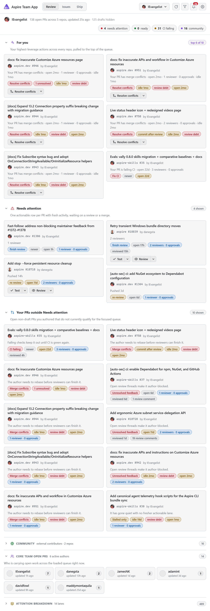
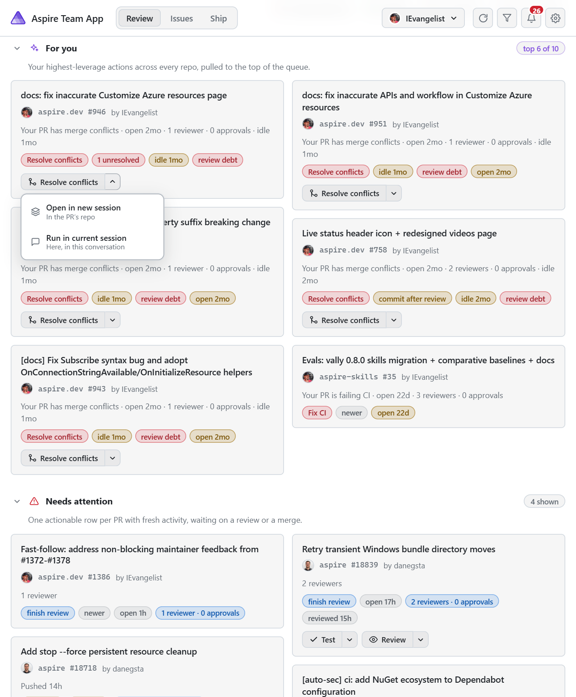

# Aspire Team App (canvas)

A GitHub Copilot App **canvas extension** that recreates the
[`davidfowl/pr-dashboard`](https://github.com/davidfowl/pr-dashboard) cross-repo PR
review queue for the **logged-in GitHub user**. This is published as the first
entry in the Canvas Marketplace.

## Screenshots

The cross-repo review queue — signal pills, a "For you" focus lane, and per-repo
lanes for everything waiting on you:



Per-card action buttons. On github.com PRs each button is a split-button dropdown to
run the action in a new sub-session (the PR's own repo) or in the current conversation.
Enterprise (GHES/EMU) cards can't open a sub-session, so they render a single button
with no dropdown that runs the action in the current conversation. The buttons a card
shows are driven by its lane and its signal pills:

- **Test** / **Review** — someone else's PR that's waiting on you. Each self-routes
  to the repo's matching skill (`/pr-testing`, `/code-review`), falling back to a
  thorough manual pass.
- **Address review** / **Discuss review** — a review-debt card (aged without an
  approving review; a PR that was only commented on or had changes requested still
  counts until it's approved). Address review runs a fresh review; Discuss review
  talks through the existing feedback and lays out response options without rewriting
  anything.
- **Address feedback** / **Discuss review** — your own PR with changes requested (the
  "Author response" case, including in *Your PRs outside Needs attention*, which would
  otherwise show no actions). Address feedback works the requested changes; Discuss
  review talks them through and lays out options without rewriting anything.
- **Resolve conflicts** — any card carrying a "merge conflicts" signal; runs a
  direct git conflict-resolution flow.
- **Evaluate CI failures** — any card carrying a "CI failing" signal; self-routes to
  the repo's CI-diagnosis skill (`/ci-test-failures`) or diagnoses manually, then
  reports the failing checks, likely root cause, and a suggested fix.
- **Resolve** / **Address feedback** — a card with unresolved review threads (an
  "N unresolved" signal or the Unresolved feedback lane); works each thread, makes
  the requested change, and resolves it.



## What it does

- **Review mode** — buckets every open PR across your watched repos into lanes:
  Needs your review, Ready to merge, CI failing, Unresolved feedback, and Your PRs.
- **Issues mode** — Assigned to you, Your issues, Needs triage, Recently active.
- **Ship mode** — PRs in the current release milestone grouped into Ready to ship,
  In progress, and Blocked.
- **Signal pills** — Draft, CI failing, Merge conflicts, Changes requested,
  N unresolved, Approved, Ready to merge, Needs review, Quick win, Stalled.
- **Notifications** — review requested, your PR ready to merge, changes requested,
  CI failing, with per-category preferences. Live updates over SSE.
- **Multiple GitHub accounts** — every detected credential (gh CLI, environment,
  Copilot) appears on the Accounts screen. Activate any number of them and their
  results **interleave across every tab**, de-duplicated by PR/issue URL. Each
  account watches **its own** repositories, editable inline.
- **Enterprise aware** — accounts on a GitHub Enterprise Server host are badged and
  their API calls are routed to that host's GraphQL/REST endpoints.
- **Editable watched repos** — per account; defaults to the public Aspire team set,
  except Enterprise Managed User (EMU) accounts (e.g. `dapine_microsoft`), which
  default to the first-party `devdiv-microsoft/aspire-1p` repo. Defaults only fill
  in accounts you haven't configured — they never overwrite an explicit repo list.

## How it works

| File | Responsibility |
| --- | --- |
| `extension.mjs` | Wiring: `joinSession` + `createCanvas`, agent-facing actions. |
| `server.mjs` | Per-instance loopback HTTP server, JSON API, SSE refresh, multi-account interleave. |
| `accounts.mjs` | Credential discovery, per-account repo-access probing, host/enterprise detection. |
| `github.mjs` | GraphQL queries, lane bucketing, signals, avatars, cross-account merge. |
| `model.mjs` | Attention buckets, focus queue, core-team / community classification. |
| `constants.mjs` | Configuration: core-team members, release milestone, personal picks. |
| `render.mjs` | Iframe HTML / CSS / client JS, styled with Copilot theme tokens. |
| `agent.mjs` | Card-action prompt/log builders (Test, Review, Resolve conflicts, Address review, Evaluate CI failures, Discuss review, Address feedback) with untrusted-PR hardening. |
| `state.mjs` | Durable per-account preferences (watched repos, active flag, notifications). |

The canvas reads each account's token from `GH_TOKEN` / `GITHUB_TOKEN`, the
per-account Copilot credentials, or `gh auth token`, and queries the matching
GitHub GraphQL API with read-only public scopes.

## Agent actions

- `refresh` — reload the queue and push to the open dashboard.
- `set_mode` — switch to `review` / `issues` / `ship`.
- `set_repos` — replace the watched repositories for an account (targets the first
  active account unless `account` id/login is given).
- `set_account_active` — activate or deactivate an account by id/login; active
  accounts interleave across every tab.
- `accounts` — list every detected credential, its active state, and repo access.
- `summary` — return a text summary without opening the canvas.

## Install

This extension ships in the repository under `.github/extensions/aspire-team-app/`, so
the GitHub Copilot app auto-discovers it as a **project extension** whenever this repo is
opened. No manual install step is required.

It is also published to the Canvas Marketplace and can be installed standalone:

```text
install_extension url: https://github.com/IEvangelist/canvas-marketplace/tree/main/canvases/aspire-team-app
```

Once loaded, open it from chat, or via `open_canvas` with `canvasId: "aspire-team-app"`.

## Notes

- Notifications are **in-canvas + live in-session** (SSE). A canvas iframe is not a
  PWA with a service worker, so OS-level push while the app is closed is out of
  scope for v1.
- `copilot-extension.json` lets the folder install as a gist as well as a repo
  folder. `extension.mjs` must keep that exact filename.
