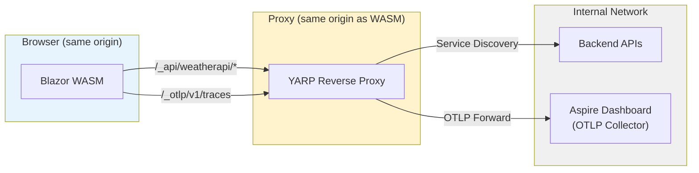
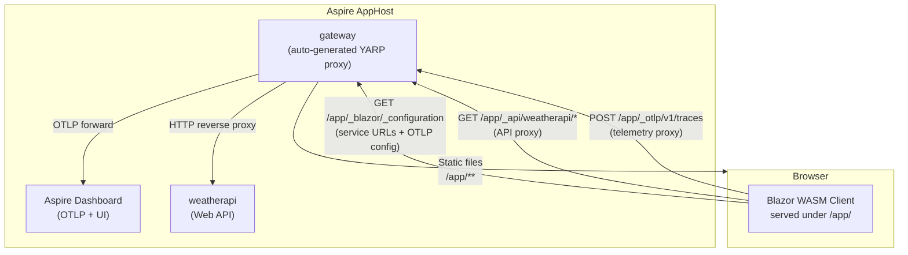
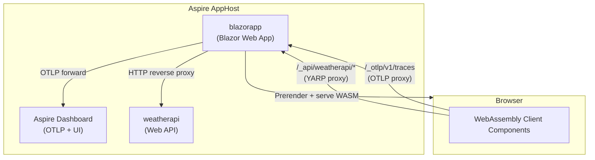
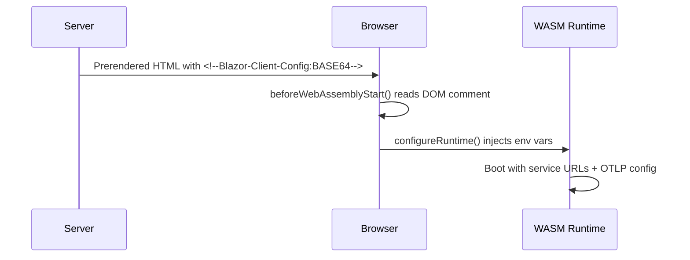
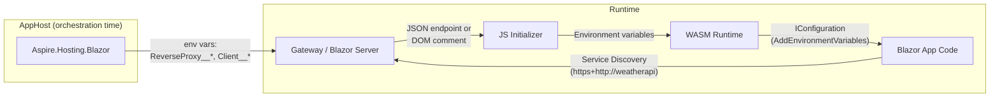
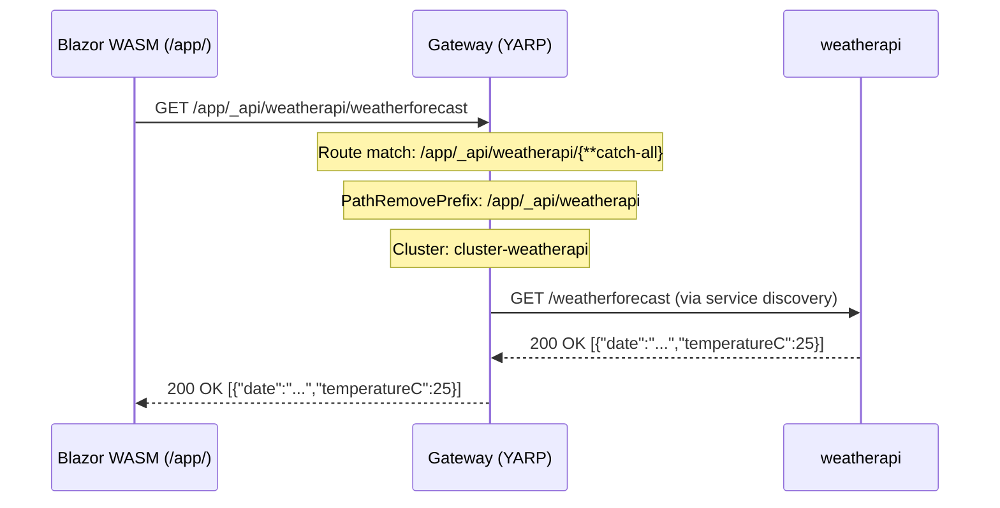
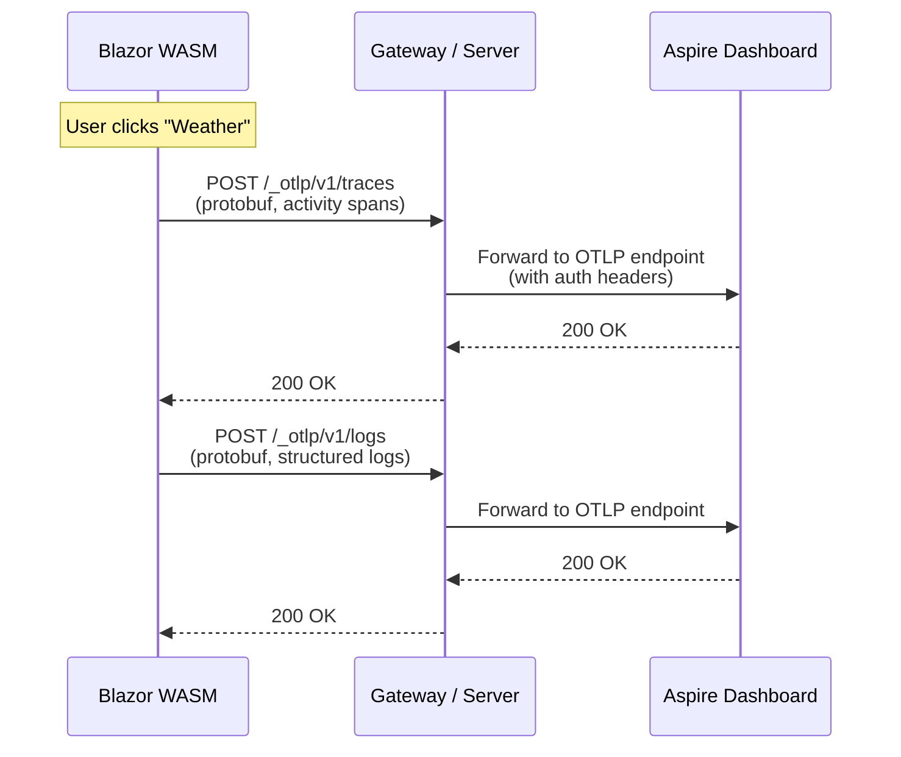
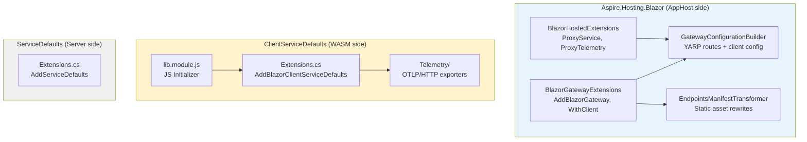

# Aspire.Hosting.Blazor — Design & Architecture

## Overview

`Aspire.Hosting.Blazor` extends Aspire's orchestration to Blazor WebAssembly applications, giving browser-based .NET apps the same service discovery, distributed tracing, and structured logging that server-side Aspire resources enjoy.

With a few lines in the AppHost, a Blazor WASM client can:

- **Discover and call backend services** using standard Aspire service discovery (`https+http://weatherapi`)
- **Send OpenTelemetry data** (traces, logs, metrics) to the Aspire dashboard
- **Appear as a first-class resource** in the dashboard with its own identity and health status

### Approach: same-origin reverse proxy

The integration routes all browser traffic through a **YARP reverse proxy** that runs on the same origin as the WASM app. This is a deliberate architectural choice:

- **No CORS configuration** — the browser talks only to its own origin, so no `Access-Control-Allow-Origin` headers are needed on backend services or the OTLP collector
- **No exposed internals** — backend services and the dashboard's OTLP collector remain on the internal network; only the proxy is publicly reachable
- **No credential leakage** — API keys and OTLP auth tokens stay on the server side and are never sent to the browser directly
- **No preflight overhead** — same-origin requests skip the OPTIONS round-trip that CORS requires



The proxy is either:
- **An auto-generated gateway** — for standalone WASM apps that have no server
- **The existing Blazor Server host** — for hosted apps where the server already exists

## Two hosting models

`Aspire.Hosting.Blazor` supports both models that Blazor WebAssembly ships with, each with a tailored API.

### Standalone WebAssembly

The WASM app has no ASP.NET Core server. Aspire generates a **gateway** process that serves static files and proxies traffic.

```csharp
var weatherApi = builder.AddProject<Projects.WeatherApi>("weatherapi");

var blazorApp = builder.AddBlazorWasmProject("app", "path/to/App.csproj")
    .WithReference(weatherApi);

var gateway = builder.AddBlazorGateway("gateway")
    .WithExternalHttpEndpoints()
    .WithClient(blazorApp);
```

### Hosted WebAssembly (Blazor Web App)

The WASM client is hosted inside an ASP.NET Core server. The server already serves static files — it just needs YARP routes injected.

```csharp
var weatherApi = builder.AddProject<Projects.WeatherApi>("weatherapi");

builder.AddProject<Projects.BlazorHost>("blazorapp")
    .ProxyService(weatherApi)    // WASM client can reach weatherapi via /_api/weatherapi/*
    .ProxyTelemetry();           // WASM client OTLP flows through /_otlp/*
```

## Architecture

### Standalone model



The gateway is a real ASP.NET Core process launched by the AppHost. Its `Program.cs` is auto-generated as a [`dotnet run --file`](https://learn.microsoft.com/dotnet/core/tools/dotnet-run#file-based-apps) script that configures YARP from environment variables.

**Multi-app support.** Multiple WASM apps can share a single gateway. Each app is served under its own path prefix (the resource name), so `/store/` and `/admin/` coexist without conflict. The `<base href>` in each app's `index.html` must match its prefix.

### Hosted model



No gateway process is created — the existing Blazor Server acts as the proxy. The AppHost injects YARP route configuration via environment variables, and the server's `Program.cs` loads them with `LoadFromConfig`.

## Design details

### Same-origin proxy vs. CORS

The proxy approach was chosen over CORS for several reasons:

| Concern | CORS approach | Proxy approach |
|---------|---------------|----------------|
| **Configuration** | Every backend service needs `AllowOrigin` headers | Zero CORS configuration |
| **OTLP collector** | Dashboard must accept browser origins | Dashboard stays internal |
| **Credentials** | API keys leak to the browser | Keys stay on the server |
| **Preflight requests** | Every cross-origin request adds an OPTIONS round-trip | No preflights (same origin) |
| **Security surface** | Backend services exposed to internet | Only the proxy is exposed |

### Environment variables as the configuration transport

The .NET WebAssembly runtime supports setting environment variables at boot time. This lets us reuse the standard Aspire patterns:

- `services__weatherapi__https__0` → service discovery via `IConfiguration`
- `OTEL_EXPORTER_OTLP_ENDPOINT` → OpenTelemetry SDK auto-configuration
- `OTEL_SERVICE_NAME` → resource identification in the dashboard

By mapping Aspire's env-var conventions into the WASM runtime, client-side code can use the same service discovery and telemetry APIs as server-side code. `AddEnvironmentVariables()` bridges them into `IConfiguration`, and service discovery resolves `https+http://weatherapi` as usual.

### Configuration delivery: DOM comments vs. HTTP endpoint

The two models have different constraints for delivering configuration to the WASM client:

**Standalone:** The WASM app loads from static files. The gateway serves a `/_blazor/_configuration` JSON endpoint. A [JavaScript initializer](https://learn.microsoft.com/aspnet/core/blazor/fundamentals/startup#javascript-initializers) (`onRuntimeConfigLoaded`) fetches this endpoint and injects env vars into the MonoConfig before the runtime starts.

**Hosted:** The server pre-renders the page. The WASM runtime needs configuration *before* it boots, but `beforeWebAssemblyStart` fires before any fetch could complete. Instead, the server embeds the config as a base64-encoded HTML comment during prerendering:

```html
<!--Blazor-Client-Config:eyJ3ZWJBc3NlbWJseSI6ey4uLn19-->
```

The JS initializer reads this synchronously from the DOM — no network round-trip, no race condition with the WASM boot sequence.



### Explicit opt-in with `ProxyService()`

In the hosted model, `WithReference(weatherApi)` makes a service available to the **server**. `ProxyService(weatherApi)` additionally makes it available to the **WASM client** by creating a YARP route.

These are intentionally separate — not every service should be reachable from the browser. A database connection string referenced by the server should never be proxied to the client. The developer explicitly chooses which services the browser can reach.

```csharp
builder.AddProject<Projects.BlazorHost>("blazorapp")
    .WithReference(weatherApi)       // server can call weatherapi (server-to-server)
    .WithReference(database)         // server can access the database
    .ProxyService(weatherApi)        // WASM client can also reach weatherapi (browser → YARP → API)
    // database is NOT proxied — the browser cannot reach it
    .ProxyTelemetry();
```

### Configurable route prefixes

The default prefixes `/_api` and `/_otlp` are chosen to minimize collision with application routes. However, if an app has routes starting with `/_api/`, they can be customized:

```csharp
// Standalone
gateway.WithClient(blazorApp, apiPrefix: "api-proxy", otlpPrefix: "telemetry");

// Hosted
builder.AddProject<Projects.BlazorHost>("blazorapp")
    .ProxyService(weatherApi, apiPrefix: "api-proxy")
    .ProxyTelemetry(otlpPrefix: "telemetry");
```

The proxy then routes `/{prefix}/api-proxy/weatherapi/*` (standalone) or `/api-proxy/weatherapi/*` (hosted) instead of the defaults.

### Client identity in the dashboard

In the hosted model, the server and WASM client share the same resource name (`blazorapp`). To distinguish their telemetry in the dashboard, the hosting layer appends the suffix `(client)` to the `OTEL_SERVICE_NAME` for the WASM client:

- `blazorapp` → server-side traces and logs
- `blazorapp (client)` → browser-side traces and logs

This lets you filter and correlate telemetry by origin while seeing the full distributed trace across both.

## Data flow

### Configuration delivery



### API request flow (standalone)



### Telemetry flow



The OTLP auth headers (`x-otlp-api-key`) are included in the client configuration so the browser can authenticate with the dashboard's collector. The proxy passes these headers through transparently.

## YARP configuration (generated)

All YARP configuration is emitted as environment variables at orchestration time. The gateway/server reads them via `LoadFromConfig(configuration.GetSection("ReverseProxy"))`.

### Standalone (per-app, with prefix)

```text
# API route — proxies /app/_api/weatherapi/* → weatherapi service
ReverseProxy__Routes__route-app-weatherapi__ClusterId=cluster-weatherapi
ReverseProxy__Routes__route-app-weatherapi__Match__Path=/app/_api/weatherapi/{**catch-all}
ReverseProxy__Routes__route-app-weatherapi__Transforms__0__PathRemovePrefix=/app/_api/weatherapi
ReverseProxy__Clusters__cluster-weatherapi__Destinations__d1__Address=https+http://weatherapi

# OTLP route — proxies /app/_otlp/* → Aspire dashboard OTLP endpoint
ReverseProxy__Routes__route-otlp-app__ClusterId=cluster-otlp-dashboard
ReverseProxy__Routes__route-otlp-app__Match__Path=/app/_otlp/{**catch-all}
ReverseProxy__Routes__route-otlp-app__Transforms__0__PathRemovePrefix=/app/_otlp
ReverseProxy__Clusters__cluster-otlp-dashboard__Destinations__d1__Address={OTLP_ENDPOINT}
```

### Hosted (no prefix)

```text
# API route — proxies /_api/weatherapi/* → weatherapi service
ReverseProxy__Routes__route-weatherapi__ClusterId=cluster-weatherapi
ReverseProxy__Routes__route-weatherapi__Match__Path=/_api/weatherapi/{**catch-all}
ReverseProxy__Routes__route-weatherapi__Transforms__0__PathRemovePrefix=/_api/weatherapi
ReverseProxy__Clusters__cluster-weatherapi__Destinations__d1__Address=https+http://weatherapi

# OTLP route — proxies /_otlp/* → Aspire dashboard OTLP endpoint
ReverseProxy__Routes__route-otlp__ClusterId=cluster-otlp-dashboard
ReverseProxy__Routes__route-otlp__Match__Path=/_otlp/{**catch-all}
ReverseProxy__Routes__route-otlp__Transforms__0__PathRemovePrefix=/_otlp
ReverseProxy__Clusters__cluster-otlp-dashboard__Destinations__d1__Address={OTLP_ENDPOINT}
```

## Client configuration JSON

Both models deliver the same JSON structure to the WASM client. The only difference is how it gets there (HTTP endpoint vs. DOM comment):

```json
{
  "webAssembly": {
    "environment": {
      "services__weatherapi__https__0": "https://localhost:7101/_api/weatherapi",
      "services__weatherapi__http__0": "http://localhost:5101/_api/weatherapi",
      "OTEL_EXPORTER_OTLP_ENDPOINT": "https://localhost:7101/_otlp/",
      "OTEL_EXPORTER_OTLP_PROTOCOL": "http/protobuf",
      "OTEL_SERVICE_NAME": "app",
      "OTEL_EXPORTER_OTLP_HEADERS": "x-otlp-api-key=abc123"
    }
  }
}
```

**Key detail:** Service URLs point to the proxy, not to the backend service directly. For example, `services__weatherapi__https__0` resolves to `https://localhost:7101/_api/weatherapi` (the proxy's address), not to weatherapi's actual endpoint. This is what makes same-origin proxying work — the WASM client's `HttpClient` thinks it's talking to weatherapi, but it's actually talking to the proxy.

## WebAssembly telemetry

The client-side telemetry library adapts OpenTelemetry for the browser runtime, handling three platform-specific constraints.

### Manual provider initialization

The OpenTelemetry SDK uses `IHostedService` to start exporters. In WebAssembly, hosted services don't automatically run. The client must force-initialize the providers:

```csharp
var host = builder.Build();
_ = host.Services.GetService<MeterProvider>();
_ = host.Services.GetService<TracerProvider>();
await host.RunAsync();
```

### OTLP/HTTP instead of gRPC

The standard OTLP exporter uses gRPC, which requires HTTP/2 — not available in browser fetch. The client-side telemetry library uses custom OTLP/HTTP exporters that send protobuf payloads via `HttpClient` (browser fetch), which only requires HTTP/1.1.

### Direct `HttpClient` for exporters

Using `IHttpClientFactory` inside the OTLP exporter causes a reentrancy crash: the exporter is resolved from DI during `Lazy<T>` initialization, but it calls back into DI to get an `HttpClient`, which triggers the same `Lazy<T>`. The exporters use `new HttpClient()` directly, bypassing the DI container.

## Component overview



## Summary comparison

| | Standalone | Hosted |
|---|---|---|
| **AppHost API** | `AddBlazorWasmProject` + `AddBlazorGateway` + `WithClient` | `ProxyService` + `ProxyTelemetry` |
| **Proxy** | Auto-generated gateway process | Existing Blazor Server |
| **Static files** | Gateway serves them (from build output) | Server serves them (built-in) |
| **Config delivery** | `/_blazor/_configuration` HTTP endpoint | `<!--Blazor-Client-Config:BASE64-->` DOM comment |
| **JS hook** | `onRuntimeConfigLoaded` (standalone boot) | `beforeWebAssemblyStart` (hosted boot) |
| **Path prefix** | Per-app prefix (e.g., `/app/`) | No prefix |
| **Multi-app** | Yes — multiple WASM apps per gateway | N/A — one client per server |
| **Prerendering** | Not applicable | Supported |
| **Dashboard identity** | Separate resource (e.g., `app`) | `blazorapp` + `blazorapp (client)` |
| **CORS** | Not needed (same-origin proxy) | Not needed (same-origin proxy) |
