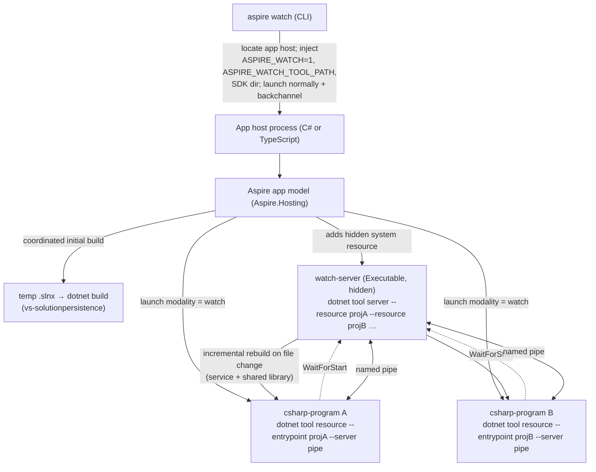

# Project v2 stage 1 (`CSharpProgram`) + `aspire watch` — Initial Implementation Plan

> **Scope:** The "improved watch as initial vertical slice" of Project Resource v2
> (issue [#16386](https://github.com/microsoft/aspire/issues/16386), comment
> [4300445417](https://github.com/microsoft/aspire/issues/16386#issuecomment-4300445417);
> tracking issue [#15710](https://github.com/microsoft/aspire/issues/15710)).
> Everything is marked **experimental**.

---

## 1. Goal

Deliver a minimal-but-real vertical slice of Project v2:

1. A new experimental **`CSharpProgram`** resource that represents a C# program added **by path**
   (no app-host project reference, polyglot-friendly).
2. **`aspire watch`** — run the app host normally while **C# service projects hot-reload** via the
   `Microsoft.DotNet.HotReload.Watch.Aspire` tool, using a **hidden "watch server" system resource**
   plus per-service `resource` processes.
3. The Aspire app model **builds** the C# programs itself (coordinated via a temporary `.slnx`),
   because — unlike Project v1 — the app host no longer references and builds them.

The design must not preclude the full Project v2 vision (partial runs, persistent execution,
container execution, debugging-under-watch, programmatic build config, events/callbacks redesign).

---

## 2. Decisions locked in with the requester (do not re-litigate)

| # | Decision |
|---|----------|
| D1 | **`CSharpProgram` is the new v2 base type.** The existing experimental `CSharpAppResource` becomes a **thin derived/compat alias** (`CSharpAppResource : CSharpProgram`). |
| D2 | **`CSharpProgram` is an "ordinary" resource — NOT derived from `ProjectResource`.** It implements the same *interfaces* (`IResourceWithEnvironment`, `IResourceWithArgs`, `IResourceWithEndpoints`, `IResourceWithServiceDiscovery`, `IResourceWithWaitSupport`, `IResourceWithProbes`) but sheds v1 baggage (container build/push pipeline steps, `IComputeResource`, `IContainerFilesDestinationResource`). `CSharpAppResource` ceasing to be a `ProjectResource` is an accepted breaking change for the experimental surface. |
| D3 | **`aspire watch` = services only** at this stage. The app host runs normally (NOT itself under `dotnet watch`); only `CSharpProgram` services hot-reload. The POC's `host` command is not used. |
| D4 | **The watch tool is bundled** with the Aspire CLI/SDK (no restore/download at watch time). The CLI resolves the bundled tool path + SDK dir and hands them to the app host (mirroring the existing **TerminalHost** bundling pattern). |
| D5 | **Coordinated temp-`.slnx` build is in scope now, for both watch and non-watch run paths.** The app model performs the initial coordinated build; the watch server takes over incremental builds. Library: `Microsoft.VisualStudio.SolutionPersistence` (vs-solutionpersistence). |
| D6 | **Out of MVP, but kept forward-compatible:** partial runs / launch groups, persistent execution (survive app-host restart), container execution, debugging `CSharpProgram` *while under watch*, and the full model-events/callbacks redesign. **Non-watch debugging/F5 is preserved** so `CSharpAppResource` doesn't regress. |
| D7 | **Watch tool version:** pin `Microsoft.DotNet.HotReload.Watch.Aspire` to`10.0.301` (stable). |
| D8 | **Verification priority:** TypeScript-based app host first, C#-based app host second. |
| D9 | **`watch/` is a top-level bundle component** — a peer of `dcp/` and `managed/`, **not** nested under `managed/`. Rationale: like `dcp/`, the watch tool is an *externally-sourced* bundled package (`Microsoft.DotNet.HotReload.Watch.Aspire`, pinned independently via `MicrosoftDotNetHotReloadWatchAspireVersion`); it is **framework-dependent** and needs an **external SDK** (`ASPIRE_WATCH_SDK_PATH`), unlike the **self-contained** `aspire-managed` binary; and it is **RID-agnostic** (one copy serves every RID) whereas `managed/`/`dcp/` are RID-specific. `managed/` is concretely the single self-contained binary, not a generic "managed tools" bucket. Top-level placement matches the existing peer-component model (`LayoutComponent.Watch`, `ASPIRE_WATCH_TOOL_PATH`, `TryDiscoverWatchTool*`) and avoids coupling an independently-versioned external tool to the managed binary's extract/cleanup lifecycle (which cleans/replaces `managed/` + `dcp/` as units). |

### Additional assumptions
- **A1.** The watch server's `server`/`resource` commands perform incremental builds and shared-library
  change handling; the **initial** build is done by the app model's coordinated `.slnx` build (D5).
- **A2.** The type is named **`CSharpProgram`** (no `Resource` suffix) per explicit instruction, deviating
  from the `*Resource` naming convention (`ProjectResource`, `ExecutableResource`, `NodeAppResource`).
  The builder entry point is `AddCSharpProgram`. *(Experimental API, can be changed later)*
- **A3.** Watch mode is signaled from CLI → app host via configuration/env; the **app model** (not the CLI)
  adds the hidden watch-server resource and rewrites each `CSharpProgram`'s launch to the watch modality.
- **A4.** `vs-solutionpersistence` (`Microsoft.VisualStudio.SolutionPersistence`, MIT) is available on an
  approved internal feed mirror (dotnet-public). If not, it must be mirrored before Session 2.
- **A5.** The watch tool (`Microsoft.DotNet.HotReload.Watch.Aspire`) does not (and will not) do the initial application build; there will always be a need for coordinated build resource (created in Session 2).
- **A6.** The watch tool **does not self-resolve the .NET SDK base path**: it requires a valid
  `--sdk <basePath>` to be supplied by the app model. When the CLI's directory-probing fast path
  (`ASPIRE_WATCH_SDK_PATH`, see §5.6) cannot derive it, the **app model** (Aspire.Hosting) — *not* the
  watch tool — resolves it by running `dotnet --info` and parsing the `Base Path:` line. That probe is
  lazy (run at the latest moment, right before the watch server is launched), memoized (at most once per
  application run), and is **never** invoked when watch mode is inactive or no `CSharpProgram` exists.
- **A7.** From the next Aspire release the bundled watch tool is a **mandatory** CLI bundle component. 
  The bundle build fails without it (`tools/CreateLayout` `CopyWatch()`), and the
  CLI rejects a freshly-extracted bundle that lacks `watch/` (`BundleService.IsVersionedLayoutValid` →
  `aspire setup --force`). Discovery of externally-supplied/legacy `ASPIRE_LAYOUT_PATH` layouts and the
  inner-loop dev (NuGet-cache) fallback stays tolerant of its absence.

---

## 3. How it works today (research baseline)

### 3.1 The watch tool protocol (from the `karolz-ms/aspire-watch` POC)
Tool = `Microsoft.DotNet.HotReload.Watch.Aspire`; launched as `dotnet <tool>.dll <command> …`.
Three commands:

```
server   --sdk <sdkDir> --server <pipe> --status-pipe <pipe> --control-pipe <pipe> --verbose \
         --resource <projA.csproj> --resource <projB.csproj> …
resource --server <serverPipe> --entrypoint <proj.csproj> --no-launch-profile --verbose -e KEY=VALUE …
host     --sdk <sdkDir> --entrypoint <apphost.csproj> --verbose [-- forwardedArgs]      # NOT used (D3)
```

POC model (the pattern we follow): the app host adds a **`watch-server` executable** (told about all
resource project paths up front), and each service runs as a **`resource` executable** that connects to
the server pipe; services `WaitForStart(watchServer)`. Status/control are named pipes held open by a
hosted service. Pipe names are random (`server-/status-/control-` + suffix).

### 3.2 Existing Aspire infrastructure we will REUSE if possible
| Need | Reuse | Location |
|------|-------|----------|
| Hidden DCP "build" executable + stop→build→restart command | **`ProjectRebuilderResource`** + the **rebuild command** | `ApplicationModel/ProjectRebuilderResource.cs`, `ApplicationModel/CommandsConfigurationExtensions.cs` |
| Hidden / system resource | `WithHidden()` / `HiddenAnnotation(HiddenBehavior.Always)` | `ResourceBuilderExtensions.cs`, `ApplicationModel/HiddenAnnotation.cs` |
| Don't auto-start a resource | `WithExplicitStart()` / `ExplicitStartupAnnotation` | `ResourceBuilderExtensions.cs` |
| Order start (resource after server) | `WaitForStart(dependency)` | `ResourceBuilderExtensions.cs:2494` |
| Base process resource | `ExecutableResource` + `AddExecutable` | `ApplicationModel/ExecutableResource.cs`, `ExecutableResourceBuilderExtensions.cs` |
| C#-program-by-path resource (today) | **`CSharpAppResource`** + `AddCSharpApp` (+ polyglot `addCSharpApp`) | `ApplicationModel/CSharpAppResource.cs`, `ProjectResourceBuilderExtensions.cs:354–454` |
| Project metadata by path | `ProjectMetadata` / `IProjectMetadata` | `IProjectMetadata.cs` |
| Project defaults (OTEL, `ASPNETCORE_URLS`, endpoints, ports, certs, rebuilder) | `WithProjectDefaults`, `SetAspNetCoreUrls`, `AddRebuilderResource` | `ProjectResourceBuilderExtensions.cs` |
| Debug/launch-profile launch | `WithDebugSupport(producer, "project")` + `ProjectLaunchConfiguration` | `ResourceBuilderExtensions.cs:4769`, `Dcp/Model/ExecutableLaunchConfiguration.cs` |
| DCP executable translation | `Dcp/ExecutableCreator.cs` (`PrepareProjectExecutables`, `PreparePlainExecutables`) | `Dcp/ExecutableCreator.cs` |
| Bundled sidecar tool path → app host (env var injection) | **Terminal host pattern**: `BundleDiscovery.*PathEnvVar`, `DcpOptions`, CLI injection | `Shared/BundleDiscovery.cs`, `Dcp/DcpOptions.cs`, `Aspire.Cli/Projects/DotNetAppHostProject.cs:1296+` |
| Temp build artifacts dir | `IAspireStore` / `IFileSystemService.TempDirectory` | `Aspire.Hosting` |
| CLI run/launch/backchannel | `RunCommand`, `AppHostLauncher`, `IAppHostAuxiliaryBackchannel`, `DotNetCliRunner` | `Aspire.Cli/…` |
| Polyglot/TS exposure | `[AspireExport]` + codegen | `Aspire.Hosting.RemoteHost`, `Aspire.Hosting.CodeGeneration.TypeScript` |
| Resource lifecycle ops from a command | `ApplicationOrchestrator.Start/StopResourceAsync`, `ResourceNotificationService`, `KnownResourceStates` | `Aspire.Hosting` |

### 3.3 The key constraint that drives most of the work
DCP categorization is **type-driven**:
`PrepareProjectExecutables()` iterates `model.Resources.OfType<ProjectResource>()` and
`PreparePlainExecutables()` iterates `OfType<ExecutableResource>()`
(`Dcp/ExecutableCreator.cs:183,336`). Because `CSharpProgram` (per D2) is **neither** a `ProjectResource`
**nor** an `ExecutableResource`, **today's DCP layer would never launch it.** The plan must add/generalize
a DCP launch path for `CSharpProgram` (Session 1B).

---

## 4. Target architecture

### 4.1 Component view (watch mode)



### 4.2 Launch modality (forward-compatible with #8984)
A `CSharpProgram` can be launched two ways. We model this as an **annotation-selected launch modality**
so it composes with the future annotation-based "RunAs/PublishAs" union
([#8984](https://github.com/microsoft/aspire/issues/8984)):

- **`project` (default, non-watch):** behaves like `CSharpAppResource` today — DCP IDE/process launch via
  `ProjectLaunchConfiguration` (`dotnet run --project|--file …`), launch-profile + **debugging preserved**.
- **`watch`:** DCP plain executable launch of `dotnet <watchTool> resource --entrypoint <proj> --server <pipe> …`.

The modality is chosen at build time from configuration (`ASPIRE_WATCH`) + annotations, **not** hard-coded
in the type — this is the seam that #8984 will later generalize into RunAs/PublishAs. Per D6, the watch
modality is no-debug for the MVP.

---

## 5. New & changed types (with the most important members)

> Namespaces follow existing placement: resources in `Aspire.Hosting.ApplicationModel`, builder
> extensions in `Aspire.Hosting`. All new public surface carries an `[Experimental(...)]` attribute.

### 5.1 `CSharpProgram` (new) — the v2 base resource
`Aspire.Hosting.ApplicationModel/CSharpProgram.cs`
```csharp
public class CSharpProgram : Resource,
    IResourceWithEnvironment, IResourceWithArgs, IResourceWithEndpoints,
    IResourceWithServiceDiscovery, IResourceWithWaitSupport, IResourceWithProbes
{
    public CSharpProgram(string name) : base(name) { }
    // Project path is carried by the IProjectMetadata annotation (reused), surfaced for convenience.
    // NOTE: today's GetProjectMetadata() helper is typed to ProjectResource; Session 1A generalizes it
    // (or reads Annotations.OfType<IProjectMetadata>().Single()) so CSharpProgram can reuse it.
    public string ProjectPath => this.GetProjectMetadata().ProjectPath;
}
```
- **Does NOT** add the container build/push `PipelineStepAnnotation` / `ContainerBuildOptionsCallbackAnnotation`
  that `ProjectResource` adds in its ctor (that's the v1 baggage we shed).
- **Fit:** it's an ordinary resource. It participates in env/endpoints/service-discovery/wait/probes via the
  same interfaces `ProjectResource` uses, so existing reference/wiring code keeps working.

### 5.2 `CSharpAppResource` (changed) — thin compat alias
`Aspire.Hosting.ApplicationModel/CSharpAppResource.cs`
```csharp
public class CSharpAppResource(string name) : CSharpProgram(name) { }   // was : ProjectResource(name)
```

### 5.3 Builder extensions (new + retargeted)
`Aspire.Hosting/CSharpProgramBuilderExtensions.cs` (new file; or extend `ProjectResourceBuilderExtensions`)
```csharp
[Experimental("ASPIRECSHARPPROGRAM001", UrlFormat = "https://aka.ms/aspire/diagnostics/{0}")]
public static IResourceBuilder<CSharpProgram> AddCSharpProgram(
    this IDistributedApplicationBuilder builder, [ResourceName] string name, string path,
    Action<CSharpProgramOptions>? configure = null);

// Retarget existing AddCSharpApp to build on CSharpProgram, returning the alias for back-compat:
public static IResourceBuilder<CSharpAppResource> AddCSharpApp(/* …unchanged signatures… */);

// Polyglot export (new) — TS/other hosts:
[AspireExport("addCSharpProgram")]
internal static IResourceBuilder<CSharpProgram> AddCSharpProgramForPolyglot(/* … */);
```
- **Most important internals (reused/generalized from `WithProjectDefaults`):** apply OTEL, `ASPNETCORE_URLS`,
  endpoints from launch settings/Kestrel, ports, certs, and the hidden rebuilder; attach `ProjectMetadata`;
  `WithDebugSupport(mode => new ProjectLaunchConfiguration{…}, "project")` for the non-watch modality;
  validate `.csproj`/`.cs` in `OnBeforeResourceStarted` (moved from `AddCSharpApp`).
- **Key refactor:** today these helpers are typed to `IResourceBuilder<ProjectResource>`. Session 1A
  **generalizes** them (to `IResourceWithEndpoints & IResourceWithEnvironment` + the `IProjectMetadata`
  annotation, or a shared internal interface) so both `ProjectResource` and `CSharpProgram` can reuse them.

### 5.4 `CSharpWatchServerResource` (new, internal) — hidden system resource
`Aspire.Hosting.ApplicationModel/CSharpWatchServerResource.cs` — mirrors `ProjectRebuilderResource`.
```csharp
internal sealed class CSharpWatchServerResource : ExecutableResource
{
    public CSharpWatchServerResource(string name, string dotnetPath, string workingDirectory)
        : base(name, dotnetPath, workingDirectory) { }
    public WatchPipeNames Pipes { get; init; }              // server/status/control pipe names
    public IReadOnlyList<string> ResourceProjectPaths { get; init; }   // --resource <path> …
}
```
- Added via the standard builder with: `WithArgs(server …)`, `WithHidden()`, `WithExplicitStart()` (started
  before services), `ExcludeFromManifest()`, `ExcludeLifecycleCommandsAnnotation`, initial `NotStarted` snapshot —
  exactly the annotation set `AddRebuilderResource` already uses.
- One watch server per app run (MVP). Reuses a small `PipeNameFactory` helper (ported from POC).
- The `server --sdk <basePath>` argument is materialized at launch via the SDK base-path resolver
  (Session 3 deliverable): fast path `DcpOptions.WatchSdkPath`, else a lazy/memoized `dotnet --info`
  fallback. The watch tool does **not** self-resolve the SDK (A6).

### 5.5 `CSharpProgramBuildOrchestrator` (new, internal) — coordinated build
`Aspire.Hosting/Dcp` or `Aspire.Hosting/CSharp/…`
```csharp
internal sealed class CSharpProgramBuildOrchestrator
{
    // Generates a temp .slnx containing all CSharpProgram projects (vs-solutionpersistence),
    // runs a single coordinated `dotnet build <temp>.slnx`, surfaces logs/state.
    Task BuildAllAsync(IReadOnlyList<CSharpProgram> programs, CancellationToken ct);
}
```
- Runs as a **lifecycle/run-sequence step before resources start** (both watch and non-watch).
- Reuses `IAspireStore`/temp-dir abstractions for the `.slnx`; reuses the `ProjectRebuilderResource`-style
  DCP-executable-for-build approach for log capture + cleanup. File-based apps (`.cs`) are excluded from the
  `.slnx` (built/run individually as today).

### 5.6 Watch options + bundling plumbing (new) — ✅ implemented in Session 0
- `BundleDiscovery` (final): `WatchToolPathEnvVar = "ASPIRE_WATCH_TOOL_PATH"`,
  `WatchSdkPathEnvVar = "ASPIRE_WATCH_SDK_PATH"`, `WatchDirectoryName = "watch"`,
  `WatchToolDllName = "Microsoft.DotNet.HotReload.Watch.Aspire.dll"`
- Hosting options (final): `WatchToolPath` **and** `WatchSdkPath` were added to **`DcpOptions`**, 
  bound in `ConfigureDefaultDcpOptions` with the established
  precedence `env → dcpPublisher config → assembly metadata` — same shape as `TerminalHostPath`.
  They are intentionally **not** added to `ValidateDcpOptions`: the watch *tool* is a mandatory CLI
  **bundle** component (A7), but the hosting options stay optional because non-CLI / publish / test
  hosts legitimately don't set them.
- CLI (final): inject `ASPIRE_WATCH_TOOL_PATH` (+ `ASPIRE_WATCH_SDK_PATH` when a private SDK install is
  resolvable) **unconditionally** at every app-host launch path.
  Activation (`ASPIRE_WATCH=1`) is deferred to `aspire watch` (Session 4); 
  the path vars are inert on a normal `aspire run`. 
  Preference order per site: pre-existing env (user override) → repo-local NuGet-cache
  probe (dev) → bundle `watch/` directory. 
  `ASPIRE_WATCH_SDK_PATH` is only the **fast path** (pure path math; no process spawn). When it can't be
  derived (the common ambient-`dotnet` case) it is omitted, and the **app model** resolves the SDK base
  path itself via a single, memoized `dotnet --info` at watch-server launch (§5.4 / Session 3) — the watch
  tool does **not** self-resolve it (A6).

### 5.7 `WatchCommand` (new) — `aspire watch`
`Aspire.Cli/Commands/WatchCommand.cs`
```csharp
internal sealed class WatchCommand : BaseCommand   // sibling of RunCommand
{
    protected override Task<CommandResult> ExecuteAsync(ParseResult parseResult, CancellationToken ct);
}
```
- Reuses `RunCommand`'s machinery (project location, `AppHostLauncher`, backchannel, monitor). Difference vs
  `run`: sets `ASPIRE_WATCH=1` + watch-tool env, and **does not** wrap the app host in `dotnet watch`/nodemon
  (app host runs normally — D3). Registered in `RootCommand` + DI (`Program.cs`).

---

## 6. How the new types fit the existing app model

1. **Authoring:** `builder.AddCSharpProgram("svc", "../Svc/Svc.csproj")` (C#) or `builder.addCSharpProgram(...)`
   (TypeScript) creates a `CSharpProgram` with a `ProjectMetadata` annotation — *just like* `AddCSharpApp`
   today, minus the `ProjectResource` base. `.WithReference`, `.WaitFor`, `.WithHttpEndpoint`,
   `.WithEnvironment`, service discovery, probes all work via the implemented interfaces.
2. **Build:** during the run sequence the `CSharpProgramBuildOrchestrator` performs one coordinated
   `.slnx` build of all `CSharpProgram` projects (shared libraries built once, no parallel conflicts).
3. **Launch (non-watch):** `CSharpProgram` flows through the **generalized** DCP project-launch path
   (`ProjectLaunchConfiguration`, IDE/debug preserved) — parity with `CSharpAppResource` today.
4. **Launch (watch):** when `ASPIRE_WATCH=1`, the app model adds the hidden `CSharpWatchServerResource`
   (told all project paths), and each `CSharpProgram` is launched as `dotnet <tool> resource …` with
   `WaitForStart(watchServer)`. Incremental rebuilds (service + shared lib) are handled by the watch server.
5. **Dashboard/CLI:** the watch server is hidden (`IsHidden`); services appear as normal resources with logs
   and start/stop. `aspire resource <svc> restart` etc. keep working via the existing backchannel.

---

## 7. Work breakdown — agentic coding sessions

> Sequential unless noted. Every session ends **green**: `./build.sh` clean + targeted tests, and
> (where applicable) a manual run against the **TypeScript** app host first, then a C# app host (D8).
> Keep all new surface `[Experimental]`. Do **not** hand-edit `api/*.cs` (generated).

### Session 0 — Bundle the watch tool + hosting plumbing *(foundational; no user-visible behavior)* — ✅ implemented
**Deliverables (as built)**
- Pinned `Microsoft.DotNet.HotReload.Watch.Aspire` in `eng/Versions.props` as
  `MicrosoftDotNetHotReloadWatchAspireVersion` and included it as a **bundle component** (new `watch/`
  dir) in the CLI layout, alongside `dcp/` and `managed/`. `tools/CreateLayout` downloads it via
  `PackageDownload` and `CopyWatch()` copies the whole `tools/net10.0/any/` directory (the package is
  **not** dependency-free — it carries Roslyn/MSBuild, locale folders and a `hotreload/` subdir — so the
  full-directory copy is required). `eng/Bundle.proj` passes `--watch-version $(…)` so the copy is
  deterministic.
- `BundleDiscovery`: `WatchToolPathEnvVar` (`ASPIRE_WATCH_TOOL_PATH`), `WatchSdkPathEnvVar`
  (`ASPIRE_WATCH_SDK_PATH`), `WatchDirectoryName` (`watch`), `WatchToolEntryPointName`
  (`Microsoft.DotNet.HotReload.Watch.Aspire.dll`), and `TryDiscoverWatchTool*` helpers (mirror DCP/managed).
- CLI layout: `LayoutComponent.Watch` + `LayoutComponents.Watch` (default `watch`), wired into
  `GetComponentPath`. The watch tool is a **mandatory** bundle component (A7), guaranteed by two
  halves: the **build** (`tools/CreateLayout` `CopyWatch()` throws if the package is absent) and the
  **extract** integrity check (`BundleService.IsVersionedLayoutValid` rejects a freshly-extracted
  bundle that lacks `watch/` → extraction fails → `aspire setup --force`). `LayoutDiscovery.ValidateLayout`
  intentionally stays `managed + dcp` (it does **not** require `watch`) so externally-supplied/legacy
  `ASPIRE_LAYOUT_PATH` layouts remain usable in a degraded, watch-less mode; `LayoutConfiguration.GetWatchToolPath()`
  keeps its defensive `File.Exists` (returns `null` when absent) for those tolerant layouts and the
  inner-loop dev (NuGet-cache) fallback.
- Hosting: `WatchToolPath` + `WatchSdkPath` on **`DcpOptions`**, bound in `ConfigureDefaultDcpOptions`
  (env → dcpPublisher config → assembly metadata). 
- CLI: inject the watch-tool env var(s) **unconditionally** at all launch paths (incl. TS/guest), only when
  not already present (user override wins); `ASPIRE_WATCH_SDK_PATH` added best-effort when a private SDK
  install is resolvable, otherwise omitted (no `dotnet --info` on the launch path). When omitted, the
  **app model** resolves the SDK base path via a single, memoized `dotnet --info` at watch-server launch
  (Session 3) — the watch tool does **not** self-resolve it (A6).
**Startup-perf guardrail (for Sessions 3–4):** the app-host launch path must **not** gain a `dotnet --info`
(or any process spawn) when wiring `--sdk`; resolve the SDK dir with pure path math (as Session 0 does), or
omit `ASPIRE_WATCH_SDK_PATH` and let the **app model** resolve it lazily via a single, memoized `dotnet --info`
at watch-server launch — only in watch mode with ≥1 `CSharpProgram`, so a normal `aspire run` never spawns it.
**Verified:** discovery/binding/injection unit tests (16 new, green) + no regressions in
`DotNetAppHostProjectTests`; real `CreateLayout` run produces `watch/` with the entry DLL and its deps; the
bundled entry DLL launches (`dotnet <dll>` reaches the tool's own arg parser).

### Session 1A — `CSharpProgram` type + generalize project-defaults wiring
**Deliverables**
- `CSharpProgram` resource (§5.1); `CSharpAppResource : CSharpProgram` (§5.2).
- `AddCSharpProgram` (+ `CSharpProgramOptions`) and retarget `AddCSharpApp` onto `CSharpProgram`.
- Generalize `WithProjectDefaults`/`SetAspNetCoreUrls`/`AddRebuilderResource`/launch-settings-endpoint logic
  so they operate on `CSharpProgram` (and still on `ProjectResource`).
- Migrate consumers of the (now non-`ProjectResource`) alias: `Aspire.Hosting.Blazor` gateway, polyglot
  `addCSharpApp`, add polyglot `addCSharpProgram`; regenerate the TypeScript SDK.
- New diagnostic id `ASPIRECSHARPPROGRAM001` (keep `ASPIRECSHARPAPPS001` on the alias surface).
**Reuse:** all of `ProjectResourceBuilderExtensions` defaults; `ProjectMetadata`; `WithDebugSupport`.
**Verify:** hosting unit tests (resource builds, annotations, endpoints, env). *Depends on: none (can start now).* 

### Session 1B — DCP launch path for `CSharpProgram` (non-watch parity)
**Deliverables**
- Generalize DCP categorization so `CSharpProgram` is launched via the **project** path (today keyed on
  `OfType<ProjectResource>()`). Preferred: drive off the **`IProjectMetadata` annotation + "project" launch
  config** rather than the concrete type; fall back to a dedicated `PrepareCSharpProgramExecutables()` if a
  generalized predicate proves too invasive.
- Preserve IDE/debug + launch-profile behavior for non-watch `CSharpProgram` (no regression vs `CSharpAppResource`).
**Reuse:** `ExecutableCreator`, `ProjectLaunchConfiguration`, `SupportsDebuggingAnnotation`,
`CreateProjectLaunchConfiguration`.
**Verify:** run a `CSharpProgram` (no watch) from a **TS** app host (extend `RpsArena`) and a C# app host;
endpoints/env/service discovery/debug all work; `CSharpAppResource` regression suite passes.
*Depends on: 1A.*

### Session 2 — Coordinated temp-`.slnx` build (vs-solutionpersistence)
**Deliverables**
- Add `Microsoft.VisualStudio.SolutionPersistence` dependency (verify/mirror to approved feed first — A4).
- `CSharpProgramBuildOrchestrator` (§5.5): collect all `CSharpProgram` `.csproj` paths → generate temp `.slnx`
  → one coordinated `dotnet build` before resources start (both run modes). Exclude `.cs` file-based apps.
- Hook into the run sequence ahead of resource creation; stream build logs; fail fast on build error.
**Reuse:** `ProjectRebuilderResource` DCP-build pattern, `IAspireStore`/temp-dir abstractions, `DotNetCliRunner`/
`dotnet build` invocation conventions.
**Verify:** multi-project app **with a shared library** builds once, coordinated, no shared-lib write conflicts,
from a TS app host then a C# app host. *Depends on: 1A (resource exists). Parallelizable with 1B.*

### Session 3 — Watch server system resource + `CSharpProgram` watch modality
**Deliverables**
- `CSharpWatchServerResource` (§5.4): hidden, explicit-start `dotnet <tool> server --sdk … --server <pipe>
  --status-pipe … --control-pipe … --resource <proj> …`. `PipeNameFactory` helper (ported from POC).
- **SDK base-path resolver** (Aspire.Hosting; new internal service, e.g. `IWatchSdkPathResolver`): supplies
  the watch server's `--sdk` value. Fast path = `DcpOptions.WatchSdkPath` (CLI directory-probing via
  `ASPIRE_WATCH_SDK_PATH`); when empty, fall back to running `dotnet --info` from the app host's working
  directory and parsing the `Base Path:` line. **Lazy + memoized** (`Lazy<Task<string>>`,
  `ExecutionAndPublication`) so the probe runs at most once per run and only when first awaited; the watch
  server's arg/env callback (or `BeforeResourceStartedEvent`) is the only awaiter, so it is invoked at the
  latest moment and never on a normal `aspire run` (A6). Force `DOTNET_CLI_UI_LANGUAGE=en-US` for stable
  (non-localized) `Base Path:` parsing. On non-zero exit / unparseable output, fail the watch server
  startup with a clear, actionable error (no launching the tool with an empty/garbage `--sdk`).
- Launch-modality seam (§4.2): when `ASPIRE_WATCH=1`, the app model (a) adds the watch server with all
  `CSharpProgram` project paths, (b) rewrites each `CSharpProgram` to launch `dotnet <tool> resource
  --entrypoint <proj> --server <pipe> --no-launch-profile -e K=V …` as a DCP executable, (c)
  `WaitForStart(watchServer)`.
- Initial coordinated build (Session 2) runs first; watch server then owns incremental builds.
- Optional: status-pipe monitor (hosted/background service) surfacing watch status into resource logs/state
  (port of `WatchPipeMonitorHostedService`).
**Reuse:** `WithHidden`, `WithExplicitStart`, `WaitForStart`, `ExcludeFromManifest`,
`ExcludeLifecycleCommandsAnnotation`, `ExecutableResource`, env-callback annotations; `IProcessRunner`
(`Dcp/Process`) for the `dotnet --info` fallback; watch-tool path + SDK fast-path dir from Session 0.
**Verify (TS first):** under a watch harness, edit a service file → that service hot-reloads; edit the shared
library → both services reload. Then repeat with a C# app host. *Depends on: 1B, 2, 0.*

### Session 4 — `aspire watch` CLI command
**Deliverables**
- `WatchCommand` (§5.7) registered in `RootCommand`/DI. Locates the app host (any language), launches it
  **normally** with `ASPIRE_WATCH=1` + watch-tool env, connects the backchannel, streams logs/state.
- Guardrails/strings (e.g. interplay with the existing `--watch` app-host feature), `--help`, telemetry.
**Reuse:** `RunCommand`/`AppHostLauncher`/backchannel/monitor; Session 0 env injection.
**Verify (TS first):** `aspire watch` against the TS `RpsArena`-style playground → services start under watch,
edits hot-reload end-to-end; then a C# app host. *Depends on: 3, 0.*

### Session 5 — Tests, playground & docs
**Deliverables**
- TypeScript playground (extend `playground/TypeScriptApps/RpsArena` or add one) using `addCSharpProgram`
  under watch; a parallel C# app-host sample.
- CLI e2e test for `aspire watch` (hex1b / `cli-e2e-testing`); hosting tests for `CSharpProgram`, watch-server
  wiring, launch-modality switch, and the `.slnx` build; verify-snapshot updates as needed.
- Docs: experimental `CSharpProgram` + `aspire watch` usage, limitations (no watch-debug, no partial runs yet),
  the `ASPIRECSHARPPROGRAM001` diagnostic.
**Reuse:** `dashboard-testing`/`cli-e2e-testing` patterns, existing playground scaffolding.
**Verify:** new tests green in CI (exclude quarantined/outerloop locally). *Depends on: 4.*

### Dependency graph
```
0 ─┬─────────────► 3 ──► 4 ──► 5
1A ┬► 1B ─────────► 3
   └► 2 ──────────► 3
```
1A is the only session with no prerequisites; 1B and 2 can run in parallel after 1A.

---

## 8. Compatibility with the annotation-based RunAs/PublishAs proposal (#8984)
- The **launch modality** (§4.2) is annotation/config-selected, not type-bound — the natural insertion point
  for a future `RunAsWatch()` / `RunAsProject()` / `RunAsContainer()` union.
- `CSharpProgram` returns a strongly-typed builder while behavior is annotation-driven, matching #8984's
  "proxy reflects base + modality" goal.
- We avoid hard-coding "watch" into the type or DCP; the watch server + resource wiring keys off annotations,
  so adding modalities (container, persistent) later is additive. Per the requester, #8984 alignment is
  best-effort and must not compromise the core Project v2 vision.

## 9. Events / callbacks (noted, redesign deferred — D6)
The slice touches: `BeforeResourceStartedEvent` (path/SDK validation, env materialization),
`WaitForStart` ordering (server → services), and env/args callbacks (materialized into the `resource`
command line). For the MVP we **document** current ordering/cardinality but do **not** redesign the contracts.
Risk to watch out for: env/args callbacks may need to run for build/closure even when a resource isn't
"running" (an explicit future concern in #16386).

## 10. Risks & open items
- **R1 — DCP generalization blast radius (Session 1B):** changing `OfType<ProjectResource>()` categorization
  could affect Azure Functions / file-based-app paths. Mitigate with an annotation-driven predicate +
  regression tests; fall back to a dedicated prepare path.
- **R2 — Generalizing `WithProjectDefaults` (Session 1A):** heavily `ProjectResource`-typed; the refactor is
  the riskiest reuse. Consider a shared internal interface implemented by both types.
- **R3 — Watch tool ↔ SDK coupling:** `dotnet <tool> --sdk <dir>` must match the active SDK; the bundled tool
  is pinned (currently `10.0.301`) but the user's SDK may differ. The watch tool does **not** self-resolve the
  SDK base path (A6), so the app model must always hand it a valid `--sdk`. Two-step resolution:
  (1) **fast path** — the CLI's pure path-math probe (`ASPIRE_WATCH_SDK_PATH`, Session 0); the *launch path*
  must not spawn a process (startup-perf guardrail). (2) **fallback** — when the fast path yields nothing,
  the **app model** (Aspire.Hosting, *not* the watch tool) resolves it via a lazy, memoized `dotnet --info`
  at watch-server launch (Session 3) — run at most once per app run and only in watch mode with ≥1
  `CSharpProgram`, so a normal `aspire run` never spawns it.
- **R4 — Named pipes cross-platform:** verify `PipeOptions.CurrentUserOnly` semantics on macOS/Linux (POC ran
  Windows-centric). TS-first verification will exercise non-Windows.
- **R5 — `vs-solutionpersistence` feed availability (A4).**
- **R6 — `aspire watch` vs existing app-host `--watch`:** ensure the two "watch" concepts don't collide in CLI
  UX/strings.
- **O1 — Naming:** `CSharpProgram` vs `CSharpProgramResource` vs something else (A2).
  ## References 

  | Description | Reference |
  |---------|------|
  | Project v2 vision and roadmap | https://github.com/microsoft/aspire/issues/16386 |
  | Stage 1 (Aspire 13.5) scope for Project v2 (tracking issue) | https://github.com/microsoft/aspire/issues/15710 |
  | Aspire watch prototype | https://github.com/karolz-ms/aspire-watch |
  | Solution file editing library | https://github.com/microsoft/vs-solutionpersistence |
  | Annotation-bases resource flavoring proposal | https://github.com/microsoft/aspire/issues/8984 |
