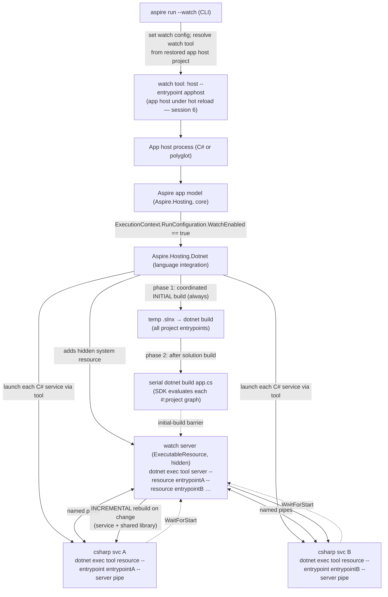

# Project v2 stage 1 — `Aspire.Hosting.Dotnet` language integration + `aspire run --watch`

---

## 1. Goal

Deliver a minimal-but-real vertical slice of Project v2 that establishes the **language integration
package** as the unit that owns how a language's services are launched (run *and* watch):

1. A new experimental **`Aspire.Hosting.Dotnet`** package — the C# peer of `Aspire.Hosting.Go`,
   `Aspire.Hosting.Python`, and `Aspire.Hosting.JavaScript`. It introduces a new **`ExecutableResource`-based**
   **`DotnetProjectResource`** + **`AddDotnetProject`** (a C# project or file-based app added **by path**,
   polyglot-friendly). The shipped **`CSharpAppResource` + `AddCSharpApp`** in core `Aspire.Hosting` are
   **left unchanged** and are out of scope for the watch work.
2. **`aspire run --watch`** — a **sub-mode of `aspire run`**. In watch sub-mode the C# language
   integration package launches each `DotnetProjectResource` via the watch tool's **`resource`** command, coordinated
   by a hidden **watch `server`** system resource; the app host itself runs under the tool's **`host`**
   command (delivered as its own session). C# services **hot-reload**; other languages run in watch mode
   or normally depending on their own integration package's watch support.
3. The Aspire app model performs a **coordinated initial build** of every `DotnetProjectResource` itself —
   identically for watch and non-watch — because the watch tool only does *incremental* builds. Project
   entrypoints build together through a temp `.slnx`; file-based `.cs` entrypoints build serially so their
   SDK-evaluated `#:project` graphs cannot race on shared `bin`/`obj` outputs.

The design must not preclude the full Project v2 vision (partial runs, persistent execution, container
execution, debugging-under-watch, programmatic build config, events/callbacks redesign), and must
generalize cleanly so Go/Python/JavaScript can add watch support later.

---

## 2. Decisions locked in with the requester (do not re-litigate)

| # | Decision |
|---|----------|
| **D1** | **New `Aspire.Hosting.Dotnet` language integration package**, structured as a peer of `Aspire.Hosting.Go` / `Aspire.Hosting.Python` / `Aspire.Hosting.JavaScript`. |
| **D2** | **Introduce a new `DotnetProjectResource : ExecutableResource` + `AddDotnetProject` (+ the polyglot `addDotnetProject` export, diagnostic `ASPIREDOTNETPROJECT001`) in `Aspire.Hosting.Dotnet`.** Core `Aspire.Hosting` keeps `AddProject<T>` / `ProjectResource` **and the shipped `CSharpAppResource` / `AddCSharpApp` (still `: ProjectResource`, diagnostic `ASPIRECSHARPAPPS001`) unchanged**. Project v2 mechanics (ExecutableResource launch, watch, coordinated build) target the **new** `DotnetProjectResource`, so there is **no breaking change** to the existing experimental surface. |
| **D3** | **Activation is `aspire run --watch`** (watch is a **sub-mode of local run**, not a separate command). In watch sub-mode the **app host runs via the watch tool's `host` command** *and* **each C# service runs via the tool's `resource` command**, coordinated by a hidden watch **`server`**. |
| **D4** | **Only C# watch is implemented now.** Design a **general per-language-package watch seam** so Go/Python/JavaScript can adopt watch later, but do not implement them in this plan. Non-C# services run normally under watch until their package adds support. |
| **D5** | **Core exposes run configuration as state** on `DistributedApplicationExecutionContext` (a `RunConfiguration` with a `WatchEnabled` property); language packages query it. **All watch mechanics** (server, `host`/`resource`/`server` commands, pipes, builds) live in the language package. Core is **not** involved in watch details. |
| **D6** | **Watch tool referenced from `Aspire.Hosting.Dotnet`** via a NuGet `PackageReference` (`GeneratePathProperty=true`) + a `.targets` file that injects the tool dll path as **app-host assembly metadata** (the DCP/dashboard/terminal-host pattern); the running app host invokes it with `dotnet exec`. **Not bundled in the CLI.** The CLI obtains the tool for the `host` command by resolving it from the **restored app host project** (handled in the app-host-watch session). |
| **D7** | **Coordinated INITIAL build is in scope**, owned by `Aspire.Hosting.Dotnet`, for **both project and file-based entrypoints** ([#19037](https://github.com/microsoft/aspire/issues/19037)). Before any service starts, generate a temp `.slnx` of all `.csproj` entrypoints and run one `dotnet build`, then run `dotnet build <app.cs>` for each file-based entrypoint **serially**. As an optional incremental improvement, evaluate each file entrypoint with `dotnet build <app.cs> --no-restore -getItem:ProjectReference -getResultOutputFile:<path>`, take the evaluated `.csproj` items' `FullPath` metadata, and include those projects in the initial `.slnx`. This resolves directory-form, relative, and MSBuild-evaluated references instead of consuming raw `#:project` display values; the `.slnx` build follows their transitive project-reference graphs. The serial file builds remain the correctness fallback and still prevent two file apps, or a file app and the `.slnx` build, from writing a shared dependency's outputs concurrently. Launches consume those outputs without another initial build. This is identical for watch and non-watch; the watch tool performs only later **incremental** builds. Library: `Microsoft.VisualStudio.SolutionPersistence`. |
| **D8** | **App-host watch via the tool's `host` command is a separate implementation session.** The earlier service-watch sessions run the app host normally; the host-command session layers app-host hot reload on top and reconciles/replaces today's whole-app-host `dotnet watch`. |
| **D9** | **Non-watch debugging/F5 parity is required** for `DotnetProjectResource`. Because it is an `ExecutableResource` (not a `ProjectResource`), this requires generalizing the DCP project-launch/debug path (§6, R1). |

### Assumptions (flag if wrong)
- **A1.** The watch tool's CLI surface (`server` / `resource` / `host` flags) follows the
  `karolz-ms/aspire-watch` POC (§4.1). **Re-verify against the shipped `Microsoft.DotNet.HotReload.Watch.Aspire`**
  (currently `10.0.301` on nuget.org) since the POC may differ from the released tool.
- **A2.** Both `Microsoft.DotNet.HotReload.Watch.Aspire` and `Microsoft.VisualStudio.SolutionPersistence`
  must be available on an **approved internal feed mirror** (per `NuGet.config`) before use; mirror them if not.
- **A3.** The watch tool's `--sdk <dir>` must match the active SDK; resolve the SDK directory at runtime
  (e.g. via `dotnet --info`) rather than assuming the bundled/pinned version.
- **A4.** The watch tool does **not** perform the initial build (confirmed by the requester); both phases of
  the coordinated build (the `.slnx` build and serial file-app builds in D7) are always required.

---

## 3. How it works today (research baseline — verified against current `main` as of 6/22/2026)

### 3.1 The watch tool protocol (from `karolz-ms/aspire-watch`; re-verify per A1)
Tool = `Microsoft.DotNet.HotReload.Watch.Aspire` (a `PackAsTool` dotnet tool, .NET 10); invoked as
`dotnet exec <tool>.dll <command> …`. Three commands — **all three are now used**:

```
server   --sdk <sdkDir> --server <pipe> --status-pipe <pipe> --control-pipe <pipe> --verbose \
         --resource <entrypoint.csproj|app.cs> …
resource --server <serverPipe> --entrypoint <entrypoint.csproj|app.cs> --no-launch-profile --verbose -e KEY=VALUE …
host     --sdk <sdkDir> --entrypoint <apphost.csproj> --verbose [-- forwardedArgs]
```

Model: a hidden **`server`** holds the status/control pipes and owns incremental builds (service +
shared-library change handling); each service runs as a **`resource`** that connects to the server pipe
and `WaitForStart`s it; the **`host`** wraps the app host process itself under hot reload. Session 4 must
verify that the shipped tool accepts both `.csproj` and file-based `.cs` entrypoints; file-app service watch
cannot ship until that path is confirmed or an equivalent graph-aware watch path is provided.

### 3.2 Language integration packages are the established pattern (the template for `Aspire.Hosting.Dotnet`)
`Aspire.Hosting.Go`, `Aspire.Hosting.Python`, `Aspire.Hosting.JavaScript` already demonstrate everything
the C# package needs:

| Concern | How the existing language packages do it |
|---------|------------------------------------------|
| Resource type | `GoAppResource` / `PythonAppResource` derive from **`ExecutableResource`** (e.g. `ExecutableResource(name, "go"/"python", workingDirectory)`), implement `IResourceWithServiceDiscovery`, `IContainerFilesDestinationResource`, etc. |
| Launch args | A `WithArgs(ctx => …)` callback builds the run command (`go run …`, `python …`). |
| Debug/IDE launch | **`WithDebugSupport(producer, "<type>", argsCallback)`** attaches a `SupportsDebuggingAnnotation` carrying a `*LaunchConfiguration : ExecutableLaunchConfiguration("<type>")` + an args transformer that strips the run-command args in IDE mode. Run-mode only. |
| Supporting executables | Hidden helper `ExecutableResource`s (e.g. `PythonInstallerResource`, `PythonVenvCreatorResource`, `JavaScriptInstallerResource`) added with `WithParentRelationship`, `WithExplicitStart`, and ordered via `WaitForCompletion` / `WaitForStart`. |
| Polyglot exposure | `[AspireExport]` on the resource type (`ExposeProperties = true`) and on the `Add*` method; code generators (`Aspire.Hosting.CodeGeneration.{TypeScript,Go,Python,…}`) + `Aspire.Hosting.RemoteHost` surface them to non-C# app hosts. |

### 3.3 DCP launch categorization (the one core change non-watch needs)
`Dcp/ExecutableCreator.cs`:
- `PrepareProjectExecutables()` iterates **`_model.GetProjectResources()`** (i.e. `OfType<ProjectResource>()`)
  and configures the **`"project"`** launch config there directly.
- `PreparePlainExecutables()` iterates `ExecutableResource`s; in `CreateObjectAsync` the generic debug
  annotator runs **only for launch types `!= "project"`** (lines ~163–172) — `"project"` is deliberately
  skipped because it is handled in `PrepareProjectExecutables`.

This means, because `DotnetProjectResource` is an `ExecutableResource` (not a `ProjectResource`), a `"project"` launch
config on it would be applied **nowhere**. Achieving F5/debug parity (D9) therefore requires
generalizing this path (see R1). Non-debug run works regardless (plain `dotnet run --project …`).

### 3.4 Existing watch is the *inverse* of the v2 vision (must be reconciled)
Today watch is a CLI **feature flag** `KnownFeatures.DefaultWatchEnabled` (default `false`); there is **no
`--watch` CLI option**. When enabled, `DotNetCliRunner.RunAsync` runs the **whole app host** under
`dotnet watch` (`watch` vs `run`), and the guest path enables `enableHotReload`. The v2 vision is the
opposite (app host + services hot-reload via the watch tool's `host`/`resource`). The app-host-watch
session (D8) reconciles these by switching to the tool's `host` command.

### 3.5 Run/Publish plumbing pattern (template for the watch signal)
`DistributedApplicationBuilder` reads `Configuration["Publishing:Publisher"]` to choose Run vs Publish and
builds `DistributedApplicationExecutionContextOptions` → `DistributedApplicationExecutionContext`
(`Operation`, `IsRunMode`, `IsPublishMode`). The `--publisher` CLI arg maps to that config key. The watch
signal follows the identical pattern: a CLI config key → builder → a new state member on the execution
context.

### 3.6 Tool referencing pattern (template for D6)
`Aspire.Hosting.AppHost/build/*.targets` inject `AssemblyMetadata` (e.g. `dcpclipath`,
`aspiredashboardpath`, `aspireterminalhostpath`) from resolved bundle/package paths; `Dcp/DcpOptions.cs`
reads them at runtime (priority: explicit config > `ASPIRE_*` env var > assembly metadata). The dashboard
is invoked via `dotnet exec --runtimeconfig <cfg> <dll>`. `Aspire.Hosting.Dotnet` mirrors this for the
watch tool dll.

### 3.7 Reuse map
| Need | Reuse | Location |
|------|-------|----------|
| `ExecutableResource` + debug seam | `ExecutableResource`, `WithDebugSupport`, `SupportsDebuggingAnnotation`, `ExecutableLaunchConfiguration` | `Aspire.Hosting` |
| Project defaults (OTEL, `ASPNETCORE_URLS`, launchSettings/Kestrel endpoints, dev certs, rebuilder) | `WithProjectDefaults` & helpers (today `where T : ProjectResource`) | `ProjectResourceBuilderExtensions.cs` |
| Hidden/explicit-start/ordering | `WithHidden`, `WithExplicitStart`, `WaitForStart`, `WaitForCompletion`, `WithParentRelationship`, `ExcludeFromManifest` | `ResourceBuilderExtensions.cs` |
| Supporting executable pattern | `PythonInstallerResource` / `PythonVenvCreatorResource` wiring | `Aspire.Hosting.Python` |
| Hidden DCP build executable | `ProjectRebuilderResource` + rebuild command | `Aspire.Hosting/ApplicationModel` |
| Polyglot export + codegen | `[AspireExport]`, `Aspire.Hosting.RemoteHost`, `CodeGeneration.*` | various |
| Tool path → app host | `.targets` `AssemblyMetadata` + runtime reader; `dotnet exec` | `AppHost/build/*.targets`, `Dcp/DcpOptions.cs` |
| Temp build artifacts | `IAspireStore` / `IFileSystemService.TempDirectory` | `Aspire.Hosting` |
| CLI run/launch/backchannel | `RunCommand`, `AppHostLauncher`, `DotNetCliRunner`, backchannel | `Aspire.Cli/…` |

---

## 4. Target architecture

### 4.1 Component view (watch mode)

```mermaid
flowchart TD
    CLI["aspire run --watch (CLI)"] -->|"set watch config; resolve watch tool<br/>from restored app host project"| HOST["watch tool: host --entrypoint apphost<br/>(app host under hot reload — session 6)"]
    HOST --> AH["App host process (C# or polyglot)"]
    AH --> Model["Aspire app model (Aspire.Hosting, core)"]
    Model -->|"ExecutionContext.RunConfiguration.WatchEnabled == true"| Pkg["Aspire.Hosting.Dotnet (language integration)"]
    Pkg -->|"phase 1: coordinated INITIAL build (always)"| SLNX["temp .slnx → dotnet build<br/>(all project entrypoints)"]
    SLNX -->|"phase 2: after solution build"| FILES["serial dotnet build app.cs<br/>(SDK evaluates each #:project graph)"]
    Pkg -->|"adds hidden system resource"| WS["watch server (ExecutableResource, hidden)<br/>dotnet exec tool server --resource entrypointA --resource entrypointB …"]
    FILES -. "initial-build barrier" .-> WS
    Pkg -->|"launch each C# service via tool"| P1["csharp svc A<br/>dotnet exec tool resource --entrypoint entrypointA --server pipe"]
    Pkg -->|"launch each C# service via tool"| P2["csharp svc B<br/>dotnet exec tool resource --entrypoint entrypointB --server pipe"]
    P1 -. "WaitForStart" .-> WS
    P2 -. "WaitForStart" .-> WS
    WS <-->|named pipes| P1
    WS <-->|named pipes| P2
    WS -->|"INCREMENTAL rebuild on change<br/>(service + shared library)"| P1
    WS --> P2
```
No service starts until both initial-build phases succeed. Non-watch run is identical minus the watch
`server`/`host`/`resource` wrapping: each `DotnetProjectResource` launches from the coordinated outputs
without rebuilding (`dotnet run --project … --no-build` or `dotnet run --file … --no-build`, with the
`"project"` debug launch config for F5). Coordinator-owned file-app launches must not pass `--no-cache`,
which requests an unconditional build and would defeat coordination.

### 4.2 The core/package boundary (D5)
- **Core `Aspire.Hosting`** gains exactly one watch-aware concept: **run configuration as state** on
  `DistributedApplicationExecutionContext` (a `RunConfiguration` object carrying `bool WatchEnabled`),
  populated from a CLI config key the same way `Operation` is populated from `Publishing:Publisher`.
  Core contains **no** watch server, pipes, tool paths, or build logic.
- **`Aspire.Hosting.Dotnet`** reads `ExecutionContext.RunConfiguration.WatchEnabled` and, when true, adds the
  watch `server` and rewrites each C# service's launch to the tool's `resource` command. This is the
  **general seam**: any language package can do the same for its own resources later (D4).

---

## 5. New & changed types / files

> Resources → the package's own namespace (`Aspire.Hosting.Dotnet`, matching Go/Python);
> builder extensions → `Aspire.Hosting`. All new public surface stays `[Experimental]`. Do **not**
> hand-edit `api/*.cs`, `*.Capabilities.txt`, `*.ats.txt` (generated).

### 5.1 `Aspire.Hosting.Dotnet` (new package)
- `src/Aspire.Hosting.Dotnet/Aspire.Hosting.Dotnet.csproj` (mirror `Aspire.Hosting.Go.csproj`: project-ref
  to `Aspire.Hosting`, `[AspireExport]` wiring, `api/Aspire.Hosting.Dotnet.cs`, README).
- **`DotnetProjectResource`** (new): `public class DotnetProjectResource(string name, string workingDirectory)
  : ExecutableResource(name, "dotnet", workingDirectory), IResourceWithServiceDiscovery, IProjectLaunchDefaultsResource`
  — an `ExecutableResource` (no `ProjectResource` container-build pipeline).
  `[Experimental("ASPIREDOTNETPROJECT001")]`, `[AspireExport(ExposeProperties = true)]`.
- **`AddDotnetProject`** (new): builds the `DotnetProjectResource`, attaches `IProjectMetadata`, adds a
  `WithArgs` callback producing `run --project <proj>` (or the file-based `.cs` form), applies the
  generalized project defaults (§5.4), and `WithDebugSupport(mode => new ProjectLaunchConfiguration{…},
  "project")` for F5 parity. Includes the `Action<ProjectResourceOptions>` overload + validation
  (`.csproj`/`.cs`, .NET-version check) in `OnBeforeResourceStarted`. Diagnostic `ASPIREDOTNETPROJECT001`.
- **`AddDotnetProjectForPolyglot`** (new, `internal`, `[AspireExport("addDotnetProject")]`). New capability id
  `Aspire.Hosting.Dotnet/addDotnetProject`.
- Core `CSharpAppResource` / `AddCSharpApp` (+ `addCSharpApp`, `ASPIRECSHARPAPPS001`) stay in `Aspire.Hosting`
  unchanged; this package does not touch them.

### 5.2 `DotnetWatchServerResource` (new, internal) — hidden system resource
`internal sealed class DotnetWatchServerResource : ExecutableResource` running
`dotnet exec <tool> server --sdk <dir> --server <pipe> --status-pipe <pipe> --control-pipe <pipe>
--resource <projA> …`. Added with `WithHidden`, `WithExplicitStart`, `ExcludeFromManifest`, lifecycle-command
exclusion (mirrors `AddRebuilderResource`). One per app run (MVP). Includes a small pipe-name helper
(ported from POC) and, optionally, a status-pipe monitor surfacing watch status into resource logs/state.

### 5.3 Coordinated build orchestrator (new, internal)
`internal sealed class DotnetProjectBuildOrchestrator` (name TBD) owns the complete initial-build barrier
for **both** run modes:

1. Collect and de-duplicate all project-based `DotnetProjectResource` `.csproj` entrypoints. As an optional
   optimization, evaluate each file-based entrypoint with
   `dotnet build <app.cs> --no-restore -getItem:ProjectReference -getResultOutputFile:<path>`. Read the
   structured item output, take `FullPath` only for evaluated `.csproj` references, normalize/de-duplicate
   those paths into the same set, and reject malformed output rather than guessing from raw directive text.
   The query performs MSBuild evaluation without executing the build, so directory-form and relative
   `#:project` references are resolved consistently with the generated file-app project. Generate a temp
   `.slnx` (`Microsoft.VisualStudio.SolutionPersistence`) from that set and run one coordinated `dotnet build`;
   its normal project-reference traversal handles transitive dependencies. If this optional discovery is not
   implemented, the serialized file-app phase remains the correctness path.
2. After the `.slnx` build succeeds, build each file-based `.cs` entrypoint with `dotnet build <app.cs>`,
   one at a time in deterministic resource order and with the same configuration/build-affecting inputs used
   for launch. Do not hand-parse `#:project`; the .NET SDK's generated file-app project is the authoritative
   evaluator for directive syntax and project-reference discovery. Because these builds are serialized after
   the `.slnx` build, shared project references never have concurrent writers, including references shared by
   file apps and traditional project resources.
3. Start no `DotnetProjectResource` until the entire barrier succeeds. Once this always-on coordinator is
   installed, mark each resource's `IProjectMetadata.SuppressBuild` as `true` so both plain process launches
   and the `"project"` IDE/debug path consume the coordinated outputs. Update both argument-generation paths
   so file-app launches select `--no-build` **instead of** `--no-cache`; passing both is not acceptable because
   `--no-cache` requests an unconditional build. Watch launches hand the already-built entrypoints to the
   watch tool, which owns only subsequent incremental builds.

The orchestrator streams each phase's logs with the resource/entrypoint identified, fails fast, and reuses
`IAspireStore`/temp-dir abstractions plus the `ProjectRebuilderResource`-style DCP-build-executable approach
for log capture and cleanup. Empty project or file-app phases are skipped.

### 5.4 Generalized project-defaults wiring (core ↔ package)
Today `WithProjectDefaults` / `SetAspNetCoreUrls` / rebuilder / launchSettings-endpoint logic are
`private`/`where T : ProjectResource` in `Aspire.Hosting`. `AddDotnetProject` (different assembly,
non-`ProjectResource`) must reuse them. **Decision (R2):** generalize to an internal interface
(`IProjectLaunchDefaultsResource`) implemented by both `ProjectResource` (core) and `DotnetProjectResource`
(package), making the helpers generic over it and exposing them via `InternalsVisibleTo` — preferred
over reimplementing the defaults in the package. The shipped `CSharpAppResource : ProjectResource` keeps
working through the same generalized helpers unchanged.

### 5.5 Core run configuration state (new, minimal)
- Add a `RunConfiguration` object with a `WatchEnabled` property to
  `DistributedApplicationExecutionContextOptions` and surface it read-only on
  `DistributedApplicationExecutionContext`.
- `DistributedApplicationBuilder` populates it from a CLI config key, exactly as `Operation` is derived
  from `Publishing:Publisher`.

### 5.6 Watch tool acquisition (D6)
- `Directory.Packages.props`: pin `Microsoft.DotNet.HotReload.Watch.Aspire` (mirror to approved feed; A2).
- `Aspire.Hosting.Dotnet`: `PackageReference … GeneratePathProperty="true"` + `build/Aspire.Hosting.Dotnet.targets`
  injecting the tool dll path as app-host `AssemblyMetadata`; a runtime reader (priority: env var > metadata)
  resolves it; invoked via `dotnet exec`.

### 5.7 CLI `aspire run --watch`
- Add a `--watch` `Option<bool>` to `RunCommand`; when set, pass the watch config signal to the app
  host (so the package reacts). Reconcile with `DefaultWatchEnabled` (explicit `--watch` wins; keep the flag
  as the default-on switch). The `host`-command wrapping of the app host is **session 6**.

### 5.8 Consumers
- **`Aspire.Hosting.Blazor`**: `AddBlazorGateway` (calls core `AddCSharpApp`, returns
  `IResourceBuilder<ProjectResource>`) is **unchanged**. **Add** a new `DotnetProjectResource`-backed gateway
  (`AddDotnetProjectBlazorGateway` + a `WithBlazorClientApp` overload) and **generalize** the gateway's
  private helpers (`WithBlazorApp`, `MirrorGatewayStateToClients`, `WatchGatewayStateAsync`,
  `CreatePublishCompanion`, `ForwardEndpointReference`) over a shared constraint so both gateway resource
  types share one implementation. The new variant supports **run mode**; **publish fails fast** because
  `DotnetProjectResource` is not an `IContainerFilesDestinationResource` (the WASM static-asset merge needs it).
  This lifts once container execution lands for `DotnetProjectResource`.
- Polyglot SDKs / `api/*` / `*.Capabilities.txt` / `*.ats.txt`: the `addDotnetProject` export is **additive**
  (new capability in `Aspire.Hosting.Dotnet`); core `addCSharpApp` is unchanged, so core codegen snapshots
  are unaffected.

---

## 6. Work breakdown — agentic coding sessions

> Sequential unless noted. Every session ends **green**: `./build.sh` clean + targeted tests, and (where
> applicable) a manual run against a **TypeScript** app host first, then a C# app host. Keep all surface
> `[Experimental]`. Do **not** hand-edit generated `api/*` files.

### Session 1 — Scaffold `Aspire.Hosting.Dotnet`; add `DotnetProjectResource`/`AddDotnetProject`
Create the package (mirror `Aspire.Hosting.Go`). Add `DotnetProjectResource` (`: ExecutableResource`) and
`AddDotnetProject` (+ polyglot `addDotnetProject`, diagnostic `ASPIREDOTNETPROJECT001`); core
`CSharpAppResource`/`AddCSharpApp` are untouched. Add the core project-defaults generalization (§5.4 —
`IProjectLaunchDefaultsResource`). Reproduce **non-watch, non-debug** launch via `dotnet run --project …`
args + generalized project defaults. Add the new `DotnetProjectResource`-backed Blazor gateway variant (§5.8);
regenerate polyglot SDKs/api (additive). 

**Verify:** builds clean; a service added via `AddDotnetProject` runs
(no debug) from a C# app host **and** a TS app host with endpoints/env/service discovery; the existing Blazor
gateway is unchanged and the new variant works in run mode. *Depends on: none.*

**Status: ✅ Complete** — commit `435f5d08`, PR [#18442](https://github.com/microsoft/aspire/pull/18442).

### Session 1b — `AddDotnetProject` playground sample (early dogfood harness)
Add a **committed** `playground/` sample (name TBD, e.g. `ProjectV2AppHost`) that models services via
`AddDotnetProject`: at minimum a `.csproj` service **plus a shared class library** it references, and — since
the resource supports it — optionally a file-based `.cs` service. Provide a **TypeScript app host**
(`addDotnetProject`) alongside a C# app host, mirroring `playground/GoAppHost`, `playground/PythonAppHost`,
`playground/TypeScriptAppHost`, and `playground/FileBasedApps`. Wire endpoints/env/service discovery between
the services. This is the **persistent dogfood target** later sessions verify against: the shared library
gives Session 5 (coordinated `.slnx` build) and Session 6 (shared-library hot reload) a ready multi-project
case, and Session 9 extends it for the watch end-to-end. 

**Verify:** `aspire run` (non-watch) starts the services from both the C# and TS app hosts; 
endpoints, env, and service discovery resolve. *Depends on: 1. Parallelizable with 2–5.*

**Status: ✅ Complete** — sample at `playground/DotnetProject/`: a C# app host (`DotnetProject.AppHost`, using
`AddDotnetProject`) and a `TypeScriptAppHost` (using the polyglot `addDotnetProject`), sharing a class library
(`DotnetProject.SharedLibrary`), two `.csproj` services (`DotnetProject.ApiService`, `DotnetProject.WorkerService`
— both referencing the shared library, with `workerservice` referencing/`WaitFor`-ing `apiservice`), and a
file-based `.cs` service (`worker/worker.cs`). The four C# projects are in `Aspire.slnx` and build clean.
`aspire run` is verified end-to-end from the **C# app host**: all resources reach `Running`/`Healthy`, each
`DotnetProjectResource` launches via `dotnet run --project/--file … --no-launch-profile`, and HTTP calls confirm
the shared library and service discovery (`workerservice`/`worker` → `apiservice`). Running the **TypeScript**
app host in-repo follows the standard polyglot package workflow (pack `Aspire.Hosting.Dotnet` to a local source
+ `npm install`; see A2/A1). Both app hosts temporarily chain `WaitFor`/`waitFor` across the three services
to serialize their independent `dotnet run` builds; Session 5 removes that workaround only after project and
file-app initial builds both participate in the coordinated barrier.

### Session 2 — Non-watch **debug/F5 parity** (DCP project-launch generalization)
Generalize the DCP path so a non-`ProjectResource` carrying `IProjectMetadata` + a `"project"`
`SupportsDebuggingAnnotation` is launched/debugged correctly (preferred: an annotation/metadata-driven
predicate; fallback: a dedicated prepare path or a distinct launch type). Preserve launch-profile behavior.

**Verify:** F5/debug of a `DotnetProjectResource` (no watch) from a C# app host and the Aspire VS Code extension;
debug behavior matches `AddProject`. *Depends on: 1.* **(R1)**

**Status: ✅ Complete.** DCP treats an `ExecutableResource` carrying `IProjectMetadata` and `"project"` debug
support as a project launch. `DotnetProjectResource` therefore gets launch-profile and Debug/NoDebug handling,
is classified/rendered as a project, and passes only application arguments to the IDE. Project launches and
other debug integrations that rewrite arguments have no Process fallback; persistent resources and IDEs without
`"project"` support keep the normal process launch.

The VS Code project debugger supports file-based `.cs` resources. It resolves the program through
`dotnet run-api`, retains the built-DLL host prefix when `dotnet` is the launcher, and keeps the selected or
disabled launch profile authoritative for application arguments, working directory, and environment while
preserving required `DOTNET_ROOT*` host variables.

Automated coverage exercises the DCP, package, snapshot, and extension behavior above. The C# app-host + VS Code
F5 check in **Verify** was verified manually. *(Watch-mode debugging remains out of scope; see Session 9.)*

### Session 3 — Core run configuration state (minimal, no mechanics)
Add a run configuration to `DistributedApplicationExecutionContext(+Options)`; populate from a CLI config
key in `DistributedApplicationBuilder` (mirror `Publishing:Publisher`). No watch logic in core. **Verify:**
unit test that the config flag flips the watch signal; both run modes still behave normally.
*Depends on: none (parallelizable with 1–2).*

**Status: ✅ Complete.** Core exposes an experimental `RunConfiguration` class with a single
`bool WatchEnabled` property, and a read-only, never-null `DistributedApplicationExecutionContext.RunConfiguration`
set through an `init` property on `DistributedApplicationExecutionContextOptions`. Both are marked
`[Experimental("ASPIREWATCH001", UrlFormat = "https://aka.ms/aspire/diagnostics/{0}")]`, and `RunConfiguration`
is an `[AspireDto]` so polyglot app hosts read it as a plain object. `DistributedApplicationBuilder` populates
it on both run-mode paths from the **`AppHost:Run:WatchEnabled`** configuration key. Values other than
`true`/`false`, and publish mode, yield defaults (`WatchEnabled == false`). Downstream reads
`ExecutionContext.RunConfiguration.WatchEnabled`. Core contains **no** watch mechanics. `OperationModesTests`
covers the configuration and publish-mode behavior; the five polyglot codegen snapshots (TS/Go/Python/Java/Rust)
are regenerated.

### Session 4 — Watch tool acquisition in `Aspire.Hosting.Dotnet`
Pin + mirror `Microsoft.DotNet.HotReload.Watch.Aspire` (A2); add the `PackageReference` +
`GeneratePathProperty` + `.targets` assembly-metadata injection + runtime resolver; invoke via `dotnet exec`.

**Verify:** from a built app host that references `Aspire.Hosting.Dotnet`, `dotnet exec <resolved tool> --help`
runs; re-verify the `server`/`resource`/`host` flag surface (A1), including `.cs` entrypoints and incremental
changes to their `#:project` dependencies. If the shipped tool does not support file-based entrypoints, resolve
that gap before Session 6 rather than launching file apps through an uncoordinated build path. *Depends on: 1.*

### Session 5 — Coordinated initial build (`.slnx` + file apps)
Add/mirror `Microsoft.VisualStudio.SolutionPersistence` (A2). Implement `DotnetProjectBuildOrchestrator`
(§5.3): build a temp `.slnx` containing all project entrypoints and, as an optional optimization, the resolved
`.csproj` `FullPath` values returned by
`dotnet build <app.cs> --no-restore -getItem:ProjectReference -getResultOutputFile:<path>`; then serially
`dotnet build` every file-based entrypoint so the SDK discovers and builds its complete `#:project` graph
without overlapping another build. Treat both phases as one startup barrier **identically for watch and
non-watch**; stream logs; fail fast; launch from the result with build suppression. Evaluated-item discovery
must not replace the serial fallback.

**Verify:** from a TS app host then a C# app host: (1) multiple `.csproj` resources share a library; (2) two
file-based apps share the same `#:project` class-library reference; and (3) a file-based app and a `.csproj`
resource share a dependency. Start all resources concurrently and prove no overlapping builds/write races.
Confirm both watch and non-watch execute the initial barrier, non-watch launches do not rebuild, and removing
the playground's temporary `WaitFor`/`waitFor` chain is safe.
*Depends on: 1. Parallelizable with 2–4.*

### Session 6 — C# **service** watch: watch `server` + `resource` launch
Add `DotnetWatchServerResource` (§5.2). When `ExecutionContext.RunConfiguration.WatchEnabled`, the package (a) adds the hidden
watch server with all `DotnetProjectResource` entrypoint paths (`.csproj` and `.cs`), (b) rewrites each `DotnetProjectResource` to
`dotnet exec <tool> resource --entrypoint <entrypoint> --server <pipe> --no-launch-profile -e K=V …`, (c)
`WaitForStart(server)`. The complete coordinated initial-build barrier (session 5) runs first; the server owns
incremental builds, including shared dependencies reached through a file app's `#:project` graph.
Optional status-pipe monitor. **App host still runs normally in this session.** 

**Verify (TS app host first,
then C#):** edit a project or file-based service → that service hot-reloads; edit a shared library referenced
by two file apps and a project resource → all affected services reload without concurrent build-output writes.
*Depends on: 3, 4, 5 (and 1).*

### Session 7 — `aspire run --watch` CLI wiring
Add the `--watch` option to `RunCommand`; flow the watch signal to the app host; reconcile with
`DefaultWatchEnabled` (explicit flag wins). App host still launched normally (services hot-reload). 

**Verify (TS first, then C#):** `aspire run --watch` → C# services start under watch and hot-reload end-to-end.
*Depends on: 6, 3.*

### Session 8 — App-host watch via the tool's `host` command (reverses D3; separate per D8)
CLI launches the app host via `dotnet exec <tool> host --sdk <dir> --entrypoint <apphost> …` (tool resolved
from the **restored app host project**, not bundled), replacing today's whole-app-host `dotnet watch`.
Reconcile `DefaultWatchEnabled`. Decide polyglot-app-host behavior (guest hosts under their own watch; the C#
app-host-server case). 

**Verify:** editing app host code hot-reloads the topology under `aspire run --watch`.
*Depends on: 7, 4.*

### Session 9 — Tests, playground & docs
**Extend the Session 1b playground** to exercise `aspire run --watch` (C# services hot-reload; a shared-library
edit reloads all affected project and file-based services) from the TS and C# app hosts. Add a second file-based
app with the same `#:project` dependency, remove the temporary `WaitFor`/`waitFor` serialization, and use this
as the regression scenario for [#19037](https://github.com/microsoft/aspire/issues/19037). Add CLI e2e for
`aspire run --watch` (hex1b /
`cli-e2e-testing`); hosting tests for the package, watch-server wiring, watch switch, and the `.slnx`
plus serial file-app build barrier; Verify-snapshot updates. Docs for experimental `Aspire.Hosting.Dotnet` + `aspire run --watch`,
limitations (no watch-debug, no partial runs yet), `ASPIREDOTNETPROJECT001`. *Depends on: 7 (and 8).*

### Dependency graph
```
1 ─┬─► 1b ───────────────────────────────┐
   ├─► 2 ─────────────────────────┐      │
   ├─► 4 ─────────────┐           │      │
   └─► 5 ─────────────┤           │      │
3 ──────────────────► 6 ─► 7 ─► 8 ─► 9 ◄─┘
                      ▲           ▲
                      └─ (4,5) ───┘
```
Session 1 (✅ complete) is the root. Sessions 1b (✅ complete) and 2 (✅ complete) are done; sessions 4, 5
parallelize after 1; session 3 is independent.
Service watch (6) needs 3+4+5; CLI `--watch` (7) needs 6+3; app-host watch (8) needs 7+4; tests/docs (9) last.
Session 1b (the playground dogfood harness) is extended by session 9.

---

## 7. Compatibility with the annotation-based RunAs/PublishAs proposal ([#8984](https://github.com/microsoft/aspire/issues/8984))
The per-language launch decision is **annotation/state-driven** (`ExecutionContext.RunConfiguration.WatchEnabled` + the package's
own annotations), not type-bound — the natural insertion point for a future `RunAsWatch()` / `RunAsProject()`
/ `RunAsContainer()` union. Adding modalities (container, persistent) later is additive and stays inside the
language package. #8984 alignment is best-effort and must not compromise the core Project v2 vision.

## 8. Events / callbacks (noted; redesign deferred)
The slice touches `BeforeResourceStartedEvent` (path/SDK validation, env materialization), `WaitForStart`
ordering (server → services), and env/args callbacks (materialized into the `resource` command line). For the
MVP we **document** current ordering/cardinality but do **not** redesign the contracts. Watch point: env/args
callbacks may need to run for build/closure even when a resource isn't "running" (a known #16386 concern).

## 9. Risks & open items
- **R1 — DCP project-launch generalization (Session 2).** Making a non-`ProjectResource` debuggable via the
  `"project"` path could affect Azure Functions / file-based-app categorization. Mitigate with an
  annotation/metadata-driven predicate + regression tests; fall back to a dedicated prepare path or a distinct
  launch type recognized by DCP/the Aspire extension.
- **R2 — Cross-assembly reuse of `WithProjectDefaults` (Session 1).** Heavily `ProjectResource`-typed and
  `private` in core. Generalize over a shared internal interface (`IProjectLaunchDefaultsResource`, implemented
  by both `ProjectResource` and `DotnetProjectResource`) exposed via `InternalsVisibleTo`; avoid divergent
  reimplementation in the package.
- **R3 — Feed availability (A2).** `Microsoft.DotNet.HotReload.Watch.Aspire` and
  `Microsoft.VisualStudio.SolutionPersistence` must be mirrored to an approved internal feed before Sessions 4/5.
- **R4 — Watch tool ↔ SDK coupling (A3).** `--sdk <dir>` must match the active SDK; resolve at runtime.
- **R5 — Tool surface drift (A1).** Re-verify the shipped tool's `server`/`resource`/`host` flags vs the POC.
- **R6 — Named pipes cross-platform.** Verify `PipeOptions.CurrentUserOnly` semantics on macOS/Linux
  (POC was Windows-centric); TS-first verification exercises non-Windows.
- **R7 — `--watch` vs `DefaultWatchEnabled` vs the old `dotnet watch`.** Reconcile UX/strings so the explicit
  flag, the feature flag, and the host-command behavior don't collide (Sessions 7–8).
- **R8 — New polyglot capability.** `addDotnetProject` is a new capability in `Aspire.Hosting.Dotnet`
  (additive; core `addCSharpApp` is unchanged); confirm guest SDK regeneration picks it up.
- **R9 — Blazor gateway variant (Session 1).** The new `DotnetProjectResource`-backed gateway shares one
  generalized helper implementation with the unchanged `ProjectResource` gateway; publish on the new variant
  fails fast until `DotnetProjectResource` gains container-files support.
- **R10 — File-app build graph coordination ([#19037](https://github.com/microsoft/aspire/issues/19037)).**
  File apps can share `#:project` dependencies with one another and with `.csproj` resources. They must not
  fall back to independent startup builds. Session 5 serializes SDK-evaluated file-app builds behind the
  `.slnx` build and suppresses launch-time rebuilds; Session 6 verifies the watch tool preserves graph-aware
  incremental behavior. Do not remove the playground's temporary waits until those guarantees have tests.
- **O1 — Watch signal shape.** ✅ **Resolved (Session 3):** a `RunConfiguration` object with a
  `bool WatchEnabled` property, exposed read-only as `DistributedApplicationExecutionContext.RunConfiguration`.
  Additional run behaviors are added as further properties rather than as mutually exclusive modes.
  Sessions 6/7 query `ExecutionContext.RunConfiguration.WatchEnabled`. The signal is carried by the
  `AppHost:Run:WatchEnabled` configuration key.
- **O2 — App-host watch for polyglot hosts (Session 8).** How the tool's `host` command applies when the app
  host is TypeScript/Go/Python (guest runtime watch vs the C# app-host-server).

## 10. Out of scope

- **Azure Functions on `DotnetProjectResource`.** A Functions resource backed by the new
  `ExecutableResource`-based `DotnetProjectResource` (to gain watch/hot-reload) is **not** in this plan.
  Blockers: (1) `DotnetProjectResource` has **no publish/deploy path** yet (publish fails fast), whereas
  deploy-to-ACA is Functions' primary scenario; (2) Functions launches via its own `azure-functions` launch
  type / `func host start`, so hot-reload through the Functions host + isolated worker is unverified; (3) it
  would add an `Aspire.Hosting.Azure.Functions` → `Aspire.Hosting.Dotnet` dependency. Revisit once container
  execution + publish land for `DotnetProjectResource`. Today's `AzureFunctionsProjectResource : ProjectResource`
  stays unchanged.

## References
| Description | Reference |
|---------|------|
| Project v2 vision and roadmap | https://github.com/microsoft/aspire/issues/16386 |
| Stage 1 scope for Project v2 (tracking issue) | https://github.com/microsoft/aspire/issues/15710 |
| Aspire watch prototype | https://github.com/karolz-ms/aspire-watch |
| Watch tool package | https://www.nuget.org/packages/Microsoft.DotNet.HotReload.Watch.Aspire/ |
| Hot reload & watch docs | https://aspire.dev/app-host/hot-reload-and-watch/ |
| Solution file editing library | https://github.com/microsoft/vs-solutionpersistence |
| File-app coordinated-build requirement | https://github.com/microsoft/aspire/issues/19037 |
| Annotation-based resource flavoring proposal | https://github.com/microsoft/aspire/issues/8984 |
