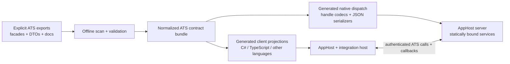
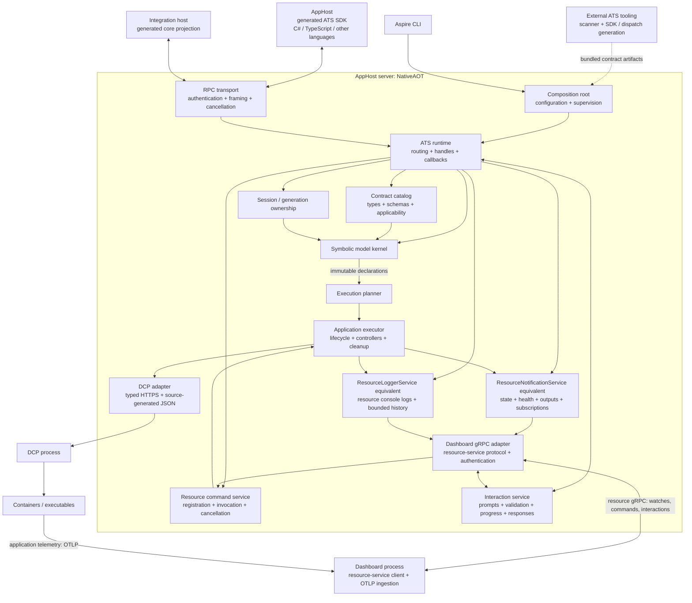

# Aspire App Model v2: ATS-native integration authoring

> **Status:** Design exploration with an ATS-native kernel, authenticated NativeAOT socket server, DCP execution, resource-preserving model revisions, and a Dashboard gRPC adapter. Local fixtures run through `aspire run` and the actual Dashboard. This is not a supported API contract or a general-purpose replacement AppHost server.
> **Audience:** Contributors exploring a minimal NativeAOT hosting core and integrations authored in C#, TypeScript, and other languages.
> **Baseline:** [Aspire Resource Model: Concepts, Design, and Authoring Guidance](appmodel.md).
> **Related:** [Polyglot integrations](polyglot-integrations.md#single-runtime-representation).

## Purpose

This document evolves with the native hosting proof of concept. Its purpose is to
give each integration-authoring pattern in `appmodel.md` an ATS-native equivalent,
not to reproduce every `Aspire.Hosting` type or method.

The proposed foundation is:

**The application model is one server-owned graph of typed entities, structured
values, and relationships. Integrations contribute schemas and behavior through
projections of core ATS APIs. CLR classes are an authoring convenience, not the
shared runtime representation.**

The core remains implemented in C#, but its contracts do not require loading
arbitrary integration assemblies or instantiating integration-defined CLR types.
C# and TypeScript integrations use the same identities and state. There is no
second CLR model to synchronize with an ATS model.

The desired guest experience remains ordinary application composition with
`Add`/`With` methods and build/run lifetime. Preserving useful guest APIs does not
require preserving the implementation-facing integration API one for one.

### Design test: imagine the core is implemented in Rust

This is a reasoning exercise, not a proposal to rewrite the implementation.
Could a Rust server implement the same contract without understanding .NET
services, CLR inheritance, DI, reflection, or framework context objects? If not,
the contract is carrying implementation machinery rather than model semantics.

The language-neutral core owns entities and identities, schemas and structured
values, relationships and dependencies, scoped authority, invocation and callback
lifetimes, execution observations, and interaction state machines. Requests name
capabilities, carry copied data and opaque handles, and receive explicit results
or classified failures. A handle denotes granted operations on an entity or
scope, not an instruction to instantiate a CLR class.

C# attributes, binding facades, dictionaries and locks are implementation/tooling
choices. C# `Task` and `CancellationToken` are language projections of asynchronous
completion and cancellation protocols, not concepts a remote server must
instantiate. A resource type expresses schema and capability applicability, not
CLR assignability. The first generated IDs follow existing ATS naming conventions;
their strings are opaque protocol identifiers, not runtime type-loading requests.

There is no service-provider concept in the authoring contract. Callback contexts
directly carry their authorized resource-execution and interaction capabilities.
No API fetches a notification service, resolves a logger, or imports a server
service instance. Model/runtime behavior is defined independently of the C#
bindings so a different implementation could satisfy the same protocol tests.

A local-only independent Rust reference implements the eight composition
capabilities to vet the C# NativeAOT implementation with the same ATS bundle and
generated TypeScript consumer. It is not a shipping implementation, repository
dependency, or proposed second host. It is kept outside commits and the PR.
This comparison covers composition only, not execution, Dashboard services,
callbacks, or diagnostics parity.

## Architecture and dependency boundary

```text
C# integration host                    TypeScript integration host
  generated core projection              generated core projection
  integration assemblies                 integration packages
  service clients, local DI              service clients, controllers
              |                                  |
              +----------- ATS contracts ---------+
                                   |
                         Native hosting core
                    entities, values, relationships
                    lifecycle, ownership, state
                    DCP execution and cleanup
                                   |
                       application workloads
```

An integration contributes projectable capability metadata and implementations.
The server routes exported calls to their owner. The implementation composes
resources by calling projected core APIs, rather than manipulating server objects.
Authors do not implement sockets, authentication, callback IDs, or RPC dispatch.

Managed dependencies, reflection-based discovery, dependency injection, and
service-specific clients may live in a C# integration host. npm dependencies may
live in a TypeScript host. They must not become native-core dependencies.
Metadata scanning and SDK generation can execute outside the native process.

Application containers and executables declared through the model are owned by
the core's DCP execution boundary. Integration-host workers belong to their
host's supervised process scope. These are different ownership domains.

### Primary API: native host exports

**ATS is the primary API contract, not a projection added after designing a
managed API.** AppHosts and integrations in C#, TypeScript, and other languages
consume projections of that contract. Native implementation classes are not an
alternative supported authoring surface. Existing AppHost composition calls
remain the goal; integration implementations change to use the new core exports.

Use the existing ATS export vocabulary (`AspireExport`, `AspireDto`, unions,
handles and callbacks). Do not invent a second native IDL or independently
maintain C# and TypeScript signatures. Initially, explicit exports on small C#
facades are the authoritative declarations. Offline tooling normalizes them into
one ATS contract bundle. The facades contain real bindings to tested server
components, not throwing declaration stubs or implementations copied from the
playground. Their internal constructors receive explicitly wired services;
those services and their constructors are not exported.

The symbolic kernel remains independent of export attributes and tooling.
Facades sit at the ATS boundary and translate projected inputs into kernel and
runtime operations. Export attributes must have a small shared definition source
usable without referencing `Aspire.Hosting`. The nonshipping
`Aspire.Hosting.Ats.Abstractions` project now compiles the existing attribute
sources once for native consumers; it does not change their shipped definitions
in managed Hosting. Do not make per-project copies of attribute classes the
production solution. Scanner, analyzer, generator, and contract-inspection dependencies are
build/tool dependencies, not runtime dependencies.



#### Export authoring and delivery process

1. **Design the consumer call first.** Show C# and TypeScript use from an AppHost
   or integration callback. Specify the receiver, applicability, lifecycle phase,
   ownership, cancellation, result, failure classifications, and documentation.
   A conceptual API must have the same semantics in every language.
2. **Declare a narrow export.** Use a purpose-built facade/handle and explicit
   exported members. DTOs carry copied data; handles carry live authority;
   callbacks carry registered behavior. Do not export service providers,
   framework loggers, mutable service instances, or arbitrary CLR objects.
   A live handle or callback is not hidden inside a DTO.
3. **Bind it to a tested component.** The facade delegates to the model,
   notification, logging, command, or interaction component. Validation at this
   boundary includes session/generation, owner, receiver applicability and mode,
   not just JSON shape. Inputs cannot supply their own permission or owner.
4. **Generate one contract bundle at build time.** Scan and validate capability
   IDs, receiver/member collisions, DTO shapes, callback signatures and docs.
   Produce deterministic metadata and implementation bindings from those
   declarations. Core exports bind to native implementations; integration
   exports route to authenticated registered providers using validated metadata,
   not a compiled list of integration names.
5. **Generate both sides from that bundle.** Emit static native dispatch, typed
   handle/callback marshalling, and source-generated JSON serializers; generate
   language client projections and reference documentation from the same data.
   Unsupported shapes are build errors. No hand-maintained dispatch switch,
   reflective invocation, runtime scanning, or generated-text surgery.
6. **Package and advertise the actual surface.** Ship matching native bindings
   and contract metadata together. The existing CLI code-generation RPCs use
   that metadata outside the native process. Runtime negotiation advertises the
   implemented core surface and available integration providers, not APIs merely
   planned in this spec. Bootstrap is a contract-aware generator input, not a
   hard-coded managed Hosting helper.
7. **Gate the API before use.** Inspect generated signatures/docs, compile C#
   and TypeScript consumers, exercise real RPC calls against the published native
   server, and measure dependency, binary-size and working-set changes. An export
   is not delivered merely because its underlying service has unit tests.

An export change updates its declaration, implementation, generated-contract
expectations and consumer tests together. Generated artifacts are outputs, not
independent sources to patch. Release API baselines remain release artifacts;
ordinary development does not manually edit `api/*.cs` or ATS release baselines.
There must also be a focused check that an export is neither advertised without
an implementation nor implemented without its generated contract entry.

#### Acquiring the primary APIs

The authenticated bootstrap returns a session-scoped composition handle.
Composition exports create typed resources, configure structured values and
relationships, and register behavior. Runtime callbacks receive purpose-built
context handles. They directly carry only the resource runtime, command, interaction,
and cancellation capabilities that their owner is allowed to use. This replaces
`GetService<T>()`, exported `IServiceProvider`, and direct access to server objects.

| API family | Primary receiver | Responsibilities |
|---|---|---|
| Composition | Composition/resource handles | Entities, configuration, annotations, references, lifecycle registration |
| Resource observations | Owner-scoped resource-runtime handle | Publish state/health/endpoints/outputs; inspect or wait through separately authorized views |
| Resource logs | Owner-scoped resource-runtime handle | Write bounded, resource-attributed console-log entries |
| Commands | Resource/controller registration and invocation contexts | Register typed operations, route invocation, enforce concurrency and cancellation |
| Interactions | Authorized interaction handle | Confirmation, inputs, validation callbacks, notifications and progress |

Read authority is not write authority. Model inspection and subscriptions use
separate applicable views; knowing a resource name or holding a read handle
does not permit publishing its state or executing its commands. Acquiring a
runtime writer requires registered controller/executor ownership. Retirement
revokes its handles, callbacks, subscriptions and outstanding operations.
Resource observations are run-time APIs, not a way to mutate sealed declarations
or resolve publish-time expressions early.

The following shows **proposed generated runtime calls**, not an implemented
runtime SDK. `context` is a controller callback context issued by the server. DTO and
member names remain provisional, but ownership is deliberately absent from the
payload: it comes from the server-issued receiver.

```csharp
await context.Resource.ReportState(
    new ResourceStateUpdate { State = ResourceExecutionState.Running },
    cancellationToken);
await context.Resource.WriteLog(
    new ResourceLogEntry
    {
        Message = "Tunnel forwarding is active.",
        Stream = ResourceLogStream.Stdout
    },
    cancellationToken);
```

```typescript
await context.resource.reportState(
    { state: ResourceExecutionState.Running },
    cancellationToken);
await context.resource.writeLog(
    { message: "Tunnel forwarding is active.", stream: ResourceLogStream.Stdout },
    cancellationToken);
```

Both versions perform ATS calls to the same server-owned services. A C#
integration does not bypass RPC by importing the native implementation assembly.
Language-specific fluent helpers can compose these exports but cannot introduce
different authority, defaulting, failure, or lifecycle behavior.

#### Versioning and acceptance

Treat capability IDs, receiver/type IDs, parameter names, DTO field meanings,
enum values, callback shapes and documented semantics as the external contract.
CLR method names and assembly layout are not wire authority. Keep established
IDs stable; distinguish wire-protocol negotiation from API contract compatibility.
Negotiate required capabilities before composition or provider registration and
report unsupported requirements explicitly. An absent export is not a successful
no-op, and caller-supplied metadata cannot manufacture an implemented capability.

Before accepting an export, require component behavior tests, deterministic
contract/SDK snapshots, generated consumer compilation, and real native RPC
round trips. Cover invalid payloads and receiver types, forged/foreign/stale
handles, unauthorized owners, cancellation, callback reentrancy and retirement.
Long-lived subscriptions need bounded delivery and disposal coverage. Dashboard
APIs additionally need integration-to-service-to-gRPC-client round trips.
Diagnostics must correlate the invocation without recording payloads or secrets.

The playground proves offline ATS scanning, TypeScript generation and static
native dispatch are feasible. Its linked attribute sources, declaration stubs,
method-name special cases, integration allow-list, and bootstrap text rewriting
are exploration mechanisms, not the production export process. The production composition slice now has real export bindings, build-time ATS
generation, a generated TypeScript projection, an authenticated socket listener,
resource notifications/logs, commands, and confirmation interactions.
Generated C# projections and general runtime callback contexts remain pending.
Each slice must pass the same generation and native round-trip
gates before integrations depend on it.

### Production component boundaries

This is the general AppHost v2 architecture. Its three application-authoring
roles are the **AppHost**, the **integration host**, and the **AppHost server**
(the new NativeAOT runtime). The AppHost composes the application; the integration
host implements integration capabilities; the AppHost server owns the shared
model and orchestration. AppHost composition in C#, TypeScript, or another
supported language uses the same ATS model and runtime.

The playground supplies evidence, not production implementations to copy.
The new host composes narrow components inside one
`Aspire.Hosting.Native.Server` project. `Core/`, `Api/`, `Rpc/`, `Dcp/`, and
`Dashboard/` are folders, not separate projects or processes. It does not adapt
managed Hosting signatures or carry two application models.



These are component boundaries, not a requirement for one assembly or interface
per box. Runtime components live in folders inside one native server project.
Keep code generation in its separate build-time project so compiler and scanner
dependencies do not enter the executable; do not create a general plugin framework
in anticipation.

| Component | Owns | Does not own |
|---|---|---|
| Composition root | Configuration and process lifetime; explicit wiring | Service-specific integration behavior |
| RPC transport | Authenticated connections, framing, correlated I/O, cancellation | Resource semantics or reflection dispatch |
| ATS runtime | Capability routing, authoritative handle views, callback ownership | A second resource graph or integration CLR objects |
| Contract catalog | Type/schema registration and capability applicability | Permission derived from a caller-supplied type string |
| Session coordinator | AppHost ownership, generation fencing, awaited cleanup before replacement | Workload state stored in the declaration graph |
| Symbolic model | Entities, declarations, relationships, schemas, structured values, sealing | Allocated ports, processes, resolved secrets, service clients |
| Planner | Validated declaration-to-execution plan | Network/process I/O or graph mutation |
| Executor | Dependency scheduling, lifecycle callbacks, owned controllers and cleanup | Code generation or public API compatibility |
| DCP adapter | Typed requests, watches, TLS, allocation and administrative cleanup | Redis/PostgreSQL/Dev Tunnels authoring |
| Resource notification service | Current execution state, health, outputs, resource snapshots, subscriptions and readiness waits | Mutable declarations, integration business logic, or gRPC DTOs |
| Resource logger service | Resource-scoped console-log publication, bounded history and ordered subscriptions | Host diagnostic events or application OTLP ingestion |
| Resource command service | Validated registration, owner routing, concurrency and cancellation | Workload lifecycle implementation or UI-only permission checks |
| Interaction service | Pending interactions, input/validation callbacks, progress and completion ownership | UI rendering or ownership of caller-supplied terminals |
| Dashboard gRPC adapter | Existing resource-service protocol, authentication, DTO mapping and stream lifetime | Resource-state storage, integration service clients or interaction business rules |
| Dashboard process | Resource UI and application OTLP ingestion | Authoritative model, resource observations or integration execution |
| External ATS tooling | Metadata, language projections, native static dispatch and serializers | Assemblies loaded into the native core |

The external toolchain must produce contract artifacts as a normal build input.
It must not edit generated TypeScript by searching for managed bootstrap text.
Core calls use generated static dispatch; integration capabilities are described
and routed by validated metadata, not compiled integration-specific allow-lists.
The CLI control plane can keep its `generateCode`/runtime negotiation RPCs
without recreating managed Hosting's exported implementation signatures.

Resource notifications, resource console logs, commands, and interactions are
first-class AppHost-server services. Integration hosts use generated ATS
projections to publish observations/logs, register commands, and request
interactions. They do not reference managed `IResource`, `ILogger`, dependency
injection containers, or Dashboard protobuf types in the core contract. The
integration host may adapt its local logging abstractions to the resource-log
projection. DCP observations enter the same authoritative services through the
executor, not a parallel Dashboard-only state path.

The Dashboard protocol is an external contract to retain, not a managed Hosting
compatibility layer. Its gRPC adapter reads these services and routes commands
and interaction responses back to their owners. The Dashboard stays a separate
process. Resource console logs travel through the resource-service gRPC protocol;
application telemetry travels to Dashboard OTLP ingestion. Neither is the same
as the AppHost server's own operational diagnostics.

### Diagnostics across component boundaries

Every component needs direct tests and observable failure/lifetime boundaries.
The AppHost, integration host, and AppHost server propagate W3C trace context
across RPC requests and callbacks. Session, generation, invocation, resource,
controller, subscription, and interaction identities correlate structured
events and spans. Operation/outcome classifications are bounded metric dimensions;
identities, names and user-supplied values are not.

Kernel operations emit BCL `ActivitySource` spans, `Meter` measurements, and a
typed event feed that works independently of trace sampling. The typed feed
avoids reflective `DiagnosticSource.Write` payload discovery. Its subscribers
are trusted, nonblocking, nonthrowing diagnostic sinks, not integration callbacks;
they must not reenter host APIs or perform synchronous I/O. Cross-process
propagation and exporters are still pending.

Failures retain their original exceptions for callers. Operational diagnostics
record classifications rather than configuration, authentication tokens,
interaction values, or raw exception messages. Tests must cover transport
disconnects, callback reentrancy, generation retirement, subscription overflow,
command cancellation, and interaction cancellation with correlated evidence.
Measure native size, dependencies and working set as each adapter is introduced;
do not attribute kernel-smoke measurements to the complete AppHost server.

### First production slice

`src/Aspire.Hosting.Native.Server/Core` owns generation-scoped resource identities,
case-insensitive name uniqueness, acyclic readiness dependencies, synchronized
composition, and immutable declaration snapshots. Sealing rejects further
composition. Retirement revokes model access; stale generation retirement cannot
dispose its replacement. Type identities are namespaced strings at this layer,
not evidence that a schema exists or that a capability is authorized.

`tests/Aspire.Hosting.Native.Core.Tests` exercises these invariants directly,
including concurrent declarations and AppHost ownership. Both projects are in
`Aspire.slnx`; their project-reference edge supplies CI routing without a manual
trigger-map rule. Core source uses only BCL APIs. Build-time contract compilation
also checks `Core/` and `Api/` against BCL and ATS-annotation references, without
ASP.NET Core, DCP, managed Hosting, or integration-client references. The complete
server includes the gRPC dependencies used by `Dashboard/`.

The declaration owner remains synchronous because it owns only in-memory data.
The execution coordinator now retires capabilities immediately, cancels owned
workloads, and awaits their cleanup before accepting a replacement generation.
Do not equate declaration `Dispose` with completed workload cleanup.
Values, general integration registration, and execution annotations remain
separate work beyond the implemented standard container/executable primitives.

Kernel validation on macOS arm64 passed 36 focused MTP tests and a
published NativeAOT smoke executable that exercises composition, sealing, and
generation replacement, including diagnostic spans, typed events and metrics:

```bash
dotnet test --project tests/Aspire.Hosting.Native.Core.Tests/Aspire.Hosting.Native.Core.Tests.csproj \
  --no-launch-profile -- --filter-not-trait "quarantined=true" --filter-not-trait "outerloop=true"
dotnet publish tests/Aspire.Hosting.Native.Core.Tests/AotSmoke/Aspire.Hosting.Native.Core.AotSmoke.csproj \
  -r osx-arm64 -c Release -o artifacts/native-hosting/production-kernel-smoke -v:q
artifacts/native-hosting/production-kernel-smoke/Aspire.Hosting.Native.Core.AotSmoke
```

The smoke application now references the consolidated server, including its
Dashboard gRPC dependencies, and the small ATS attribute assembly.
Scanner, Roslyn, TypeSystem, TypeScript generation, Semver and managed Hosting
assemblies remain absent from its runtime dependencies. It is a validation harness, not the
new native host or a complete host-size measurement. The unit-test project builds the harness
through a project reference; native publication/execution is an explicit local
check, not yet an automated CI gate.

The generated composition/RPC slice connects ATS contracts to this kernel.
Runtime observations, logs, commands, confirmations, framed socket transport,
standard workload execution, and the DCP and Dashboard adapters are implemented.
Redis/PostgreSQL/Dev Tunnels migrate only through generated
core projections. A first real host is complete only when it runs through
`aspire run`, reexecutes AppHost composition safely, removes its owned workloads, and records
native binary/working-set measurements without using the playground server.
Dashboard gRPC, integration-originated resource notifications and console logs,
commands, and interaction request/response round trips are also required for
this first working host, not optional follow-up presentation features. These
services are implemented in runtime and adapter folders, not by introducing
managed Hosting services or protobuf types into the kernel.

### Implemented native RPC capability slice

`Aspire.Hosting.Native.Server/Api` retains the eight composition exports over the kernel:
`createSession`, `startGeneration`, `retireGeneration`, `addResource`, `waitFor`,
`inspectResource`, `inspect`, and `seal`. It also adds runtime notification,
logger, execution, command, and confirmation
capabilities, plus workspace revisions and configuration application, for a total of 45 generated exports. The facades are
internal server bindings; integrations do not link to them for direct calls.
Resource snapshots contain copied IDs and declarations, not live authority.

`Aspire.Hosting.Native.CodeGeneration` uses the existing ATS scanner outside the
native process. It embeds the server's exact `Core/` and `Api/` sources and uses
Roslyn to compile them with the server assembly identity for reflection-based
scanning. This avoids a circular project reference: the server needs generated
dispatch before it can compile. Compiler and scanner dependencies are build-time
only, and generated TypeScript is not rewritten to change identities.
ATS type IDs now use the consolidated `Aspire.Hosting.Native.Server` assembly;
the static `createSession` export also uses that assembly prefix. Instance
capability namespaces remain unchanged. Regenerate clients rather than mixing
SDK artifacts from the former split projects with this server.
A normal server-project build emits static dispatch, a
source-generated JSON context, a normalized contract bundle and the existing
TypeScript generator's client projections. Unsupported signature shapes fail
the build. The generator has an explicit option to omit managed bootstrap
helpers; native generation does not rewrite generated TypeScript text.

`Aspire.Hosting.Native.Server/Rpc` processes authenticated JSON-RPC with the existing
`invokeCapability` parameter shape and ATS `$error` results. It validates exact
arguments and server-issued receiver types, bounds request size/depth and handle
count, rejects duplicate JSON keys, and owns handles per connection. Capacity is
checked before a handle-producing operation mutates the model. Retirement
revokes and releases generation handles; a foreign connection cannot reuse them
or turn a snapshot ID into authority. Connection disposal retires owned sessions.
The processor resolves authoritative handles under the connection gate and awaits
asynchronous workload, observation, command, and interaction completion outside
it. Replies on another request can therefore unblock pending work on the same
connection. The CLI bootstrap accepts bounded W3C trace-context fields and
propagates them into typed diagnostics without recording payloads or tokens.

The smoke executable's `--rpc` mode is a line-delimited subprocess test transport,
not the production network listener. The checked-in `NativeRpcSmoke.mts` consumer
uses actual generated wrappers against that published native process. It exercises
resource creation, dependency composition, copied snapshots, sealing, retired
handles and repeated generation replacement. Protocol tests and a complete
contract snapshot cover the same boundary in the native test project.

On macOS arm64, the published RPC smoke measured **2,995,728 bytes**, versus
**2,099,952 bytes** for the preceding kernel/diagnostics smoke. Three resident-set
samples after 101 generation replacements were **14,172,160 bytes** each.
These are fixture measurements, not the working set or footprint of the future
complete AppHost server; Dashboard, DCP, execution and network transport are absent.

Reproduce the native process/SDK boundary after installing the normal repository
SDK and having Node, TypeScript, Node typings and `vscode-jsonrpc` available. This
example reuses an existing `extension/node_modules` installation:

```bash
dotnet test --project tests/Aspire.Hosting.Native.Core.Tests/Aspire.Hosting.Native.Core.Tests.csproj \
  --no-launch-profile -- --filter-not-trait "quarantined=true" --filter-not-trait "outerloop=true"
dotnet publish tests/Aspire.Hosting.Native.Core.Tests/AotSmoke/Aspire.Hosting.Native.Core.AotSmoke.csproj \
  -r osx-arm64 -c Release -o artifacts/native-hosting/production-rpc-smoke -v:q
mkdir -p artifacts/native-hosting/production-rpc-sdk
cp artifacts/obj/Aspire.Hosting.Native.Server/Debug/native-ats/*.mts artifacts/native-hosting/production-rpc-sdk/
cp artifacts/obj/Aspire.Hosting.Native.Server/Debug/native-ats/contract.json artifacts/native-hosting/production-rpc-sdk/
cp tests/Aspire.Hosting.Native.Core.Tests/AotSmoke/NativeRpcSmoke.mts artifacts/native-hosting/production-rpc-sdk/
ln -sfn "$PWD/extension/node_modules" artifacts/native-hosting/production-rpc-sdk/node_modules
node extension/node_modules/typescript/bin/tsc \
  --strict --module NodeNext --target ES2022 --types node \
  --typeRoots extension/node_modules/@types \
  --rootDir artifacts/native-hosting/production-rpc-sdk \
  --outDir artifacts/native-hosting/production-rpc-sdk/out \
  artifacts/native-hosting/production-rpc-sdk/*.mts
node artifacts/native-hosting/production-rpc-sdk/out/NativeRpcSmoke.mjs \
  "$PWD/artifacts/native-hosting/production-rpc-smoke/Aspire.Hosting.Native.Core.AotSmoke"
```

### Implemented socket, workload, and Dashboard slice

`Aspire.Hosting.Native.Server` explicitly composes the RPC listener, optional
DCP executor, and optional Dashboard adapter. The kernel still has no Hosting,
ASP.NET Core, protobuf, Kubernetes client, or integration-client dependency.
The `Dashboard/` adapter uses ASP.NET Core gRPC and the existing Dashboard proto
inside the same server process and executable.
Publishing with NativeAOT succeeds without AOT-analysis warnings.

The server publishes its RPC socket independently of DCP startup. SDK retrieval
and authentication can proceed while DCP initializes; workload launch awaits
successful DCP readiness. `ASPIRE_NATIVE_DCP_PATH` selects the existing DCP tool.
Container ports are DCP-allocated loopback endpoints. Executable ports use DCP's
`portForServing` environment substitution, not reserve/release allocation.
Integration code owns probing and initialization, and must publish healthy only
after a real check. Readiness dependencies wait for that health.

The CLI boot override is scoped to guest `run`; SDK-only commands, scaffolding,
and publishing retain the standard server selection. The native executable
implements the existing `baseline.v2` CLI backchannel, including resource and
AppHost-log streams, cancellation, readiness notification, and graceful stop.
There is no native-specific CLI backchannel client or native shutdown budget.
Server readiness is distinct from resource health.

Known backchannel and DCP payloads use typed DTOs with JSON source-generated
contexts. Language commands come from build-time language-provider metadata,
not runtime TypeScript-specific branching. This build still includes only the
TypeScript SDK; the registry does not imply other SDKs are already implemented.
Caller-owned ATS configuration and evolving language metadata remain opaque
payloads rather than being reinterpreted by the kernel.

`ASPIRE_NATIVE_SERVER_OPTIONS_PATH` accepts a source-generated JSON options file
for lifecycle budgets, retry/observation intervals, request/stream capacities,
and resource/AppHost-log retention. Missing properties retain named defaults; unknown,
null, and invalid values fail explicitly. For example:

```json
{
  "controllerStartupTimeout": "00:01:00",
  "cleanupTimeout": "00:01:00",
  "maximumConcurrentRequests": 128,
  "runtime": {
    "workloadStartupTimeout": "00:03:00",
    "observationInterval": "00:00:00.500",
    "retainedResourceLogEntries": 256,
    "maximumPendingRequestsPerResource": 64
  }
}
```

Generated native clients require an explicit authentication timeout. Container
target ports are integration input, not server-selected constants; a target
port of zero requests no endpoint. Host ports are allocated by DCP. Loopback
binding, wire capability names, and protocol versions are intentional protocol
and security requirements, not fixture defaults.

An authenticated AppHost connection creates execution invitations. Each
one-use, role-specific invitation grants either exclusive execution for one
resource or application observation/action authority. The separate integration
process starts Redis and PostgreSQL, initializes and queries them through their
allocated endpoints, starts an explicitly local forwarding executable, publishes
health and logs, services a Redis command, and requests user confirmation.
Writer disconnect fails the resource and cancels its pending work.

The Dashboard adapter uses `x-resource-service-api-key` authentication on a
loopback HTTP/2 endpoint. It projects resources, URLs, health, commands, console
logs, and confirmation interactions using the same native observation
capabilities. Resource watches publish generation deletions and adopt a
replacement; replies retain their original generation authority. Unsupported
file-upload and terminal execution methods remain explicitly unimplemented.
The empty terminal inventory reflects that no native terminal resource exists.

`ASPIRE_DASHBOARD_PATH` configures the actual Dashboard assembly, native
executable, or managed bundle. The server submits it to DCP with a dynamically
allocated frontend port, authenticated resource-service access, and browser-token
authentication. `GetDashboardUrlsAsync` awaits frontend health and returns the
existing `/login?t=...` contract. DCP owns launch and shutdown; the CLI only boots
the server and reports its URL. Dashboard shutdown starts alongside workload
shutdown, before disposing the resource-service adapter, so long-lived gRPC
watches do not exhaust the CLI's ordinary shutdown budget.

The latest local verification passed 119 native/legacy regression tests and the
actual CLI, DCP-owned Dashboard, Chromium confirmation, workload command, and
exact container/process cleanup scenario. The CLI exited with code zero. This
run sampled 42,811,392 bytes of native-server resident memory, not combined
memory across the CLI, DCP, integration, and Dashboard processes.

Local macOS arm64 verification exercised the **same published server** through
the existing `ASPIRE_CLI_NATIVE_APPHOST_SERVER` override with the real CLI, its
offline-generated SDK, a separate integration process, DCP, and the actual
Dashboard process in Chromium. The Dashboard displayed all three running
resources, and clicking its confirmation button completed the integration's
pending operation. The Redis command returned the initialized value. Shutdown
was checked against actual Docker container IDs and the executable PID, not only
DCP object deletion. A separate socket harness also retired and replaced the
generation while keeping the server alive.

Before the CLI-boundary refactor, the full native unit/protocol suite passed **95 tests**, including the reviewed
and accepted complete ATS contract snapshot. The executable with the gRPC adapter
and workspace revision APIs measured **14,293,456 bytes**, and one resident-set sample while the CLI, DCP,
integration worker, and actual Dashboard were running was **42,778,624 bytes**.
The resident set is for the native server alone, not all distributed processes.
These are local fixture measurements, not release benchmarks.

Reproduce using the repository-restored SDK, Docker, Node, and an existing
TypeScript compiler. Install fixture dependencies only under ignored artifacts:

```bash
dotnet build src/Aspire.Cli/Aspire.Cli.csproj -v:q
dotnet build src/Aspire.Dashboard/Aspire.Dashboard.csproj -v:q
dotnet publish src/Aspire.Hosting.Native.Server/Aspire.Hosting.Native.Server.csproj \
  -r osx-arm64 -c Release -o artifacts/native-hosting/native-server -v:q
mkdir -p artifacts/native-hosting/runtime-sdk
cp artifacts/obj/Aspire.Hosting.Native.Server/Release/native-ats/*.mts artifacts/native-hosting/runtime-sdk/
cp artifacts/obj/Aspire.Hosting.Native.Server/Release/native-ats/contract.json artifacts/native-hosting/runtime-sdk/
cp tests/Aspire.Hosting.Native.Core.Tests/AotSmoke/*.mts artifacts/native-hosting/runtime-sdk/
cp tests/Aspire.Hosting.Native.Core.Tests/AotSmoke/CliAppHost/* artifacts/native-hosting/runtime-sdk/
npm install --prefix artifacts/native-hosting/runtime-sdk --no-save --package-lock=false \
  pg@8.16.3 @types/pg@8.15.5 @types/node@20.19.37 tsx playwright vscode-jsonrpc@8.2.1
artifacts/native-hosting/runtime-sdk/node_modules/.bin/playwright install chromium
node extension/node_modules/typescript/bin/tsc \
  --strict --module NodeNext --moduleResolution NodeNext --skipLibCheck --target ES2022 --types node \
  --typeRoots artifacts/native-hosting/runtime-sdk/node_modules/@types \
  --rootDir artifacts/native-hosting/runtime-sdk --outDir artifacts/native-hosting/runtime-sdk/out \
  artifacts/native-hosting/runtime-sdk/NativeCliSmoke.mts \
  artifacts/native-hosting/runtime-sdk/NativeRevisionSmoke.mts \
  artifacts/native-hosting/runtime-sdk/NativeRevisionAppHost.mts \
  artifacts/native-hosting/runtime-sdk/NativeIntegrationWorker.mts \
  artifacts/native-hosting/runtime-sdk/NativeTunnelFixture.mts
mkdir -p artifacts/native-hosting/cli-fixture
cp tests/PolyglotAppHosts/Aspire.Hosting.DevTunnels/TypeScript/package.json artifacts/native-hosting/cli-fixture/
cp tests/Aspire.Hosting.Native.Core.Tests/AotSmoke/CliAppHost/* artifacts/native-hosting/cli-fixture/
ln -s "$PWD/artifacts/native-hosting/runtime-sdk/out" artifacts/native-hosting/cli-fixture/out
DOTNET_ROOT="$PWD/.dotnet" PATH="$PWD/.dotnet:$PATH" \
ASPIRE_NATIVE_DASHBOARD_DLL="$PWD/artifacts/bin/Aspire.Dashboard/Debug/net11.0/Aspire.Dashboard.dll" \
ASPIRE_NATIVE_DCP_PATH="<absolute path to restored DCP tool>" \
node artifacts/native-hosting/runtime-sdk/out/NativeCliSmoke.mjs \
  "$PWD/artifacts/bin/Aspire.Cli/Debug/net11.0/aspire" \
  "$PWD/artifacts/native-hosting/native-server/Aspire.Hosting.Native.Server" \
  "$PWD/artifacts/native-hosting/cli-fixture"
```

Use the actual generated-output and application target-framework directories for
the checked-out SDK; stale `artifacts/bin` outputs from another framework are not
equivalent. `NativeRuntimeSmoke.mts` covers the socket-only observation/command
boundary; `NativeWorkloadSmoke.mts` adds real workloads and retirement/replacement.
The CLI fixture uses an existing normal TypeScript project manifest in a
separate workspace. Its standard dependency installation must not prune the
independent integration/browser harness dependencies.
These local Node/browser/AOT harnesses are not yet CI gates. The regular .NET
tests are solution projects whose references and linked proto supply Layer 1
routing; no trigger-map edge claims that a local-only harness runs in PR CI.
The native test project also references the playground ATS server and exercises
parallel graph authoring and one-use host registration, bringing its compilation
and those focused regressions into the solution-owned CI test graph.

**Remaining boundaries:** the integration worker is a fixture, not production
package registration/dispatch or three complete reusable integration APIs.
The forwarding executable is not the live Dev Tunnels service. CLI file watching and guest reexecution,
deployment lowering, full interaction input/terminal/upload support, arbitrary
package acquisition, and automated multi-platform AOT/E2E coverage remain work.
Rust stays locally excluded and is only evidence for the earlier composition
contract; it is neither shipped nor wired into production dependencies or CI.

### Implemented resource-preserving revision slice

`ApplicationWorkspace` is server-owned rather than connection-owned. An AppHost
creates it once and delegates a one-use workspace invitation to its replacement
process. Disconnecting an AppHost discards only its uncommitted staging model;
it does not stop the workspace's runtime or disconnect the integration host.
Explicit retirement or server shutdown still cancels and awaits owned workloads.

Each `beginRevision` produces an isolated composition. `commitRevision` seals
and applies the complete desired graph. Matching resource names
(case-insensitive) and exact type IDs retain runtime IDs, integration ownership,
workloads, logs, commands, and pending interactions. Declaration and authoring
execution handles from previous revisions are revoked; retained integration and
observer handles remain valid. New, retyped, or removed-and-readded resources
receive new runtime IDs. Removed resources lose authority immediately, and
commit awaits their actual workload cleanup before accepting another revision.

For example, a replacement AppHost uses the generated SDK:

```typescript
const workspace = await server.joinApplicationWorkspace(workspaceInvitation);
const revision = await workspace.beginRevision();
const cache = await revision.addResource('cache', 'native.testing/Redis');
await cache.setResourceConfiguration({
    properties: [{ name: 'proofValue', value: 'reloaded-value' }]
});
await workspace.commitRevision(revision);
const execution = await workspace.getApplicationExecution();
const nextInvitation = await workspace.inviteApplicationWorkspace();
```

The fixture configuration contract is a bounded, sorted array of string
properties, not the complete schema/value/secret model. Configuration and
readiness-dependency changes increment a resource's desired configuration
revision and mark it pending/unhealthy. Its integration waits through
`waitResourceConfiguration`, reads only its declared dependency observations,
and acknowledges the current revision as succeeded or failed. Healthy publication
and command invocation are blocked until the current configuration succeeds.
Failure does not silently become success or retire the resource; another changed
desired configuration can request a retry.

The integration decides whether a change can be applied in place or needs
`restartContainer`/`restartExecutable`. Restart preserves the resource's owner
and runtime ID, cancels old resource commands/interactions, awaits the old
lease's actual removal, and starts the replacement without overlapping leases.
Transitive readiness dependents become configuration-pending so they can
re-resolve endpoints. A commit attempted during replacement is rejected before
mutating the running graph; its sealed staged revision can be retried after the
replacement finishes. There is no rollback promise for external side effects.
A commit cleanup failure is explicit and fences further revisions until workspace
retirement. In-flight calls whose resources are removed return `HANDLE_NOT_FOUND`,
not an invalid-argument error or successful empty result.

`NativeRevisionSmoke.mts` exercises eight separate AppHost process executions
against the published AOT server, separate integration worker, real DCP, and
actual Dashboard. Invalid/aborted and disconnected staging leave the running
graph unchanged. Identical revisions retain the Redis/PostgreSQL container IDs,
relay PID, and initialized data. A Redis SET applies in place; a subsequent
launch-configuration change replaces Redis, invalidates the relay's dependency,
and restarts that relay against the new endpoint while PostgreSQL and its data
remain unchanged. Runtime IDs stay stable and the Dashboard remains connected.
Removing the relay and retiring the workspace are checked against actual PIDs
and Docker inventory. Unit/protocol tests additionally cover additions, type
replacement, pending commands/confirmations, cleanup failure, and Dashboard
UID/creation-time continuity.

After preparing the SDK and compiling both revision fixtures with the preceding
commands:

```bash
DOTNET_ROOT="$PWD/.dotnet" PATH="$PWD/.dotnet:$PATH" \
ASPIRE_NATIVE_DASHBOARD_DLL="$PWD/artifacts/bin/Aspire.Dashboard/Debug/net11.0/Aspire.Dashboard.dll" \
ASPIRE_NATIVE_DCP_PATH="<absolute path to restored DCP tool>" \
node artifacts/native-hosting/runtime-sdk/out/NativeRevisionSmoke.mjs \
  "$PWD/artifacts/native-hosting/native-server/Aspire.Hosting.Native.Server"
```

This is the RPC/application-lifetime mechanism for warm guest reload, not a CLI
file watcher or automatic integration migration. General structured values and
secret propagation, integration crash recovery, durable workspace recovery, and
production integration registration remain unfinished. Dashboard process
ownership is unchanged: production launch belongs to DCP; this browser fixture
still explicitly launches it.

## Resources and resource types

A resource is an inert, server-owned entity with:

- A unique application-model name and a generation-scoped identity.
- A declared ATS resource type and standard capability contracts.
- Typed configuration, annotations, outputs, and explicit relationships.
- An execution description or an integration-owned lifecycle provider.

Separate the **integration type** from the **execution kind**:

| Integration type | Execution shape |
|---|---|
| Redis | Container |
| PostgreSQL server | Container |
| PostgreSQL database | Logical child with initialization and readiness behavior |
| JavaScript application | Executable |
| Dev Tunnel port | Controller-backed resource with externally reported endpoints |
| Talking Clock | Controller-backed resource with no independent DCP workload |

Custom resource types remain supported as a design requirement. An integration
can declare fields, outputs, applicable capabilities, and exported methods.
Generated facades provide typed access without introducing a new class into the
native executable.

For example, the Redis type could describe:

```text
type: example.redis/Redis
execution: container
supports: endpoints, environment, arguments, connection-properties
fields:
  password: parameter-reference
outputs:
  host: string-expression
  port: integer-expression
  uri: secret-string-expression
  connectionString: secret-string-expression
```

This is an illustrative schema, not a selected schema syntax. Registration must
validate schemas and capability applicability. A caller-supplied type identifier
must not grant access to capabilities the actual entity does not support.

## Standard capabilities and polymorphism

The original guide's standard interfaces express important behavior. Preserve
that behavior as language-neutral capability contracts rather than relying on
CLR assignability.

| Existing interface | Proposed contract |
|---|---|
| `IResourceWithEnvironment` | Configure literal or structured environment values |
| `IResourceWithArgs` | Configure literal or structured arguments |
| `IResourceWithEndpoints` | Declare and reference named endpoints |
| `IResourceWithServiceDiscovery` | Contribute discoverable service endpoints |
| `IResourceWithConnectionString` | Expose connection properties and a default connection expression |
| `IResourceWithWaitSupport` | Declare explicit readiness dependencies |
| `IResourceWithoutLifetime` | Participate as model data without independent execution |
| `IResourceWithParent` | Declare lifecycle ownership separately from visual grouping |

Generated projections should expose methods only where applicable, and the
server must enforce applicability independently of client type checking.
Publishers and other integrations should work against these contracts without
special-casing every integration's concrete resource type.

## Add and With authoring patterns

`AddX` validates its inputs, creates entities, configures defaults, declares
outputs, and registers owned behavior. Composition must not start workloads,
resolve secrets, provision cloud resources, or allocate endpoints.

`WithX` contributes configuration, annotations, relationships, or behavior to an
existing entity. It normally preserves that entity's identity. Methods that
create child resources should make that distinction explicit.

Projections can offer fluent APIs and language-specific conveniences. Their
semantics come from the shared contract, not from C# overload resolution.

### C# integration example

The following is a **proposed projected API**, not a compilable example against
the current proof of concept. `BuilderHandle`, `ResourceHandle`, specification
types, and enum names are placeholders for the future core contract.
`RedisProbe` is integration-owned client code.

```csharp
public static class RedisIntegration
{
    [AspireExport]
    public static async Task<ResourceHandle> AddRedis(
        this BuilderHandle builder,
        string name,
        string image)
    {
        var password = await builder.AddParameter(
            $"{name}-password",
            new ParameterSpec { Secret = true, Generate = true });

        var redis = await builder.AddContainer(name, new ContainerSpec
        {
            Image = image,
            Command = "/bin/sh",
            Arguments =
            [
                "-c",
                "exec redis-server --requirepass \"$REDIS_PASSWORD\""
            ],
            Endpoints =
            [
                new EndpointSpec
                {
                    Name = "tcp",
                    Scheme = "redis",
                    TargetPort = 6379
                }
            ]
        });

        await redis.WithEnvironment("REDIS_PASSWORD", await password.Value());

        var uri = await builder.Concat(
            await builder.Literal("redis://:"),
            await password.Value(ValueEncoding.UriComponent),
            await builder.Literal("@"),
            await redis.Endpoint("tcp", EndpointProperty.Host),
            await builder.Literal(":"),
            await redis.Endpoint("tcp", EndpointProperty.Port));

        await redis.WithConnectionProperty("uri", uri);
        await redis.WithHealth(async (resource, cancellationToken) =>
        {
            var endpoint = await resource.ResolveConnectionProperty(
                "uri", cancellationToken);
            return await RedisProbe.PingAsync(endpoint, cancellationToken);
        });

        return redis;
    }
}
```

The returned resource must ultimately carry the integration's declared Redis
type, not just an unrestricted handle. Type attachment syntax is not selected.
The example focuses on primitive composition and a URI output; a complete Redis
integration also declares its default connection string for generic references.

### TypeScript integration example

This is the equivalent **proposed API**, not the current generated SDK.
`redisMetadata` represents build-produced export metadata. Full TypeScript
signature inference is not implemented by the proof of concept.

```typescript
import type {
    BuilderHandle,
    ResourceHandle,
} from './.aspire/modules/core.mjs';
import { AspireExport, defineIntegration } from './.aspire/modules/base.mjs';
import { redisMetadata } from './generated/exports.mjs';
import { pingRedis } from './redis-client.mjs';

export const addRedis = AspireExport(
    redisMetadata,
    async ({ builder, name, image }: {
        builder: BuilderHandle;
        name: string;
        image: string;
    }): Promise<ResourceHandle> => {
        const password = await builder.addParameter(
            `${name}-password`,
            { secret: true, generate: true });

        const redis = await builder.addContainer(name, {
            image,
            command: '/bin/sh',
            arguments: [
                '-c',
                'exec redis-server --requirepass "$REDIS_PASSWORD"',
            ],
            endpoints: [
                { name: 'tcp', scheme: 'redis', targetPort: 6379 },
            ],
        });

        await redis.withEnvironment(
            'REDIS_PASSWORD', await password.value());

        const uri = await builder.concat(
            await builder.literal('redis://:'),
            await password.value('uriComponent'),
            await builder.literal('@'),
            await redis.endpoint('tcp', 'host'),
            await builder.literal(':'),
            await redis.endpoint('tcp', 'port'));

        await redis.withConnectionProperty('uri', uri);
        await redis.withHealth(async (resource, cancellation) => {
            const endpoint = await resource.resolveConnectionProperty(
                'uri', cancellation);
            return pingRedis(endpoint, cancellation);
        });

        return redis;
    });

export default defineIntegration({
    name: 'Redis',
    capabilities: [addRedis],
});
```

Callbacks are normal author-language functions. The projection and host runtime
handle registration, invocation, cancellation, and disposal. An integration can
use local clients and caches, but shared model state belongs to the core.

## Annotations and extension data

Preserve annotations as an extensibility mechanism, but replace arbitrary live
objects with namespaced, schema-defined model data.

For example, `example.redis/persistence` could carry a duration and an integer
threshold. C# projects it as a record and TypeScript as an interface. Both access
the same server-owned payload.

A single JSON value per ID is not a complete replacement for the existing
annotation collection. The contract must distinguish:

- Singleton settings with explicit replacement semantics.
- Ordered, repeatable contributions with identity and removal semantics.
- Relationships and expression-valued fields.
- Behavior registrations, which carry owned callback references rather than
  serialized delegates.

An integration may retain opaque local objects in its own host. Those objects
are not portable annotations and cannot be inspected by another integration or
publisher. Portable data must use the shared contract.

### Implemented PoC: scalar singleton annotations

The primitive ATS contract now includes:

| Capability | Behavior |
|---|---|
| `builder.defineAnnotation(id, fields)` | Register a graph-scoped scalar schema; identical declarations are idempotent |
| `resource.withAnnotation(id, json)` | Validate and replace one payload during composition |
| `resource.getAnnotation(id)` | Read the payload; absence is an explicit error |
| `resource.hasAnnotation(id)` | Check payload presence for a registered schema |

Fields have `string`, `number`, or `boolean` kinds and a required flag. Payloads
are JSON objects with no undeclared fields, duplicate properties, null values,
or non-finite numbers. A schema has 1-32 fields; a payload is at most 64 KiB of
UTF-8. Conflicting declarations and invalid writes fail without replacing the
prior payload. Declaration order does not affect schema identity.

The TypeScript helper provides typed declarations over the generated primitive
APIs:

```typescript
const persistence = defineAnnotation<{
    intervalMs: number;
    keysChangedThreshold: number;
}>('native.redis/persistence', {
    intervalMs: { type: 'number', required: true },
    keysChangedThreshold: { type: 'number', required: true },
});

await registerAnnotation(builder, persistence);
await setAnnotation(cache, persistence, {
    intervalMs: 30000,
    keysChangedThreshold: 5,
});
const settings = await getAnnotation(cache, persistence);
```

The executable Redis integration exposes `withRedisPersistence(30000, 5)`,
validates Redis-specific constraints, writes this annotation, then reads it
through ATS to configure process environment values. The native core validates
scalar shape, not Redis domain rules. The real workload is checked with Redis
`CONFIG GET save`, rather than only inspecting the stored annotation.

Schemas and payloads are included in symbolic model publication. Writes and
schema registration are rejected after graph sealing, while lifecycle callbacks
can still read the data. Guest disposal revokes handles and discards schemas;
the next generation can declare a different schema under the same ID.

This is a non-secret configuration-data contract. It does not yet support
nested structures, repeatable annotations, removal, references, secret fields,
or runtime mutation. Do not put credentials or resolved secrets into annotation
strings. Portable C# typed annotation helpers and the generated external C#
projection remain future work.

## Structured values, references, and secrets

The core owns an expression graph, not just strings or JSON DTOs.

```text
Literal("postgresql://")
Parameter(password, encoding: uri-component)
Endpoint(postgres, "tcp", property: host)
Output(database, "databaseName")
Concat(...)
```

Expressions preserve output types, references, sensitivity, and evaluation
context. Runtime resolution accounts for the consumer's network context,
including host-to-container and container-to-container traffic. Publishing
translates the same expressions into target-specific representations without
resolving local endpoints or secrets.

Secret sensitivity must propagate through composed expressions. Logs, model
inspection, metadata, and generated artifacts must not accidentally disclose
resolved secret values.

Integration-defined value providers remain a design requirement. They need
explicit inputs and references, typed outputs, cancellation, ownership, and
publish semantics. An opaque callback returning a string does not provide enough
information for dependency analysis or portable publishing.

## Relationships and graph validation

Use distinct relationships rather than one overloaded parent/dependency field:

| Relationship | Meaning |
|---|---|
| Visual grouping | Organize presentation without controlling execution |
| Lifecycle ownership | Tie a child's lifetime to its owner |
| Readiness dependency | Wait for another resource to satisfy a declared condition |
| Value reference | Consume a parameter, endpoint, or output |

These relationships are authored explicitly, not inferred from resource names.
Validation must enforce the relevant rules for each relationship.

Endpoint references do not automatically imply readiness waits. Mutual
frontend/OIDC URL references must not become startup deadlocks. The graph must
distinguish endpoint allocation dependencies from execution/readiness dependencies.

## Lifecycle, health, and controllers

The core owns scheduling and lifecycle progression. Integrations register
bounded behavior through explicit resource-scoped contracts.

| Behavior | Example |
|---|---|
| Preparation | Produce configuration or files required for execution |
| Initialization | Create a PostgreSQL database after its server is ready |
| Pre-start setup | Configure a tunnel port using allocated endpoint information |
| Health probe | Test Redis connectivity without changing service state |
| Controller | Monitor an external resource and report state and endpoints |
| Disposal | Stop controllers and release integration-owned external state |

The stage names are provisional. The contract must define ordering, concurrency,
timeouts, cancellation, error propagation, and which operations are legal in
each phase. Multiple registrations must have explicit composition semantics.
Independent resources should not be serialized behind a global integration queue.

Readiness is derived from execution state and configured probes. A failed probe
is distinct from an invocation failure or a disconnected provider.
Controller-backed resources report observations through a validated ownership
contract; they do not arbitrarily publish core lifecycle events.

Initialization callbacks complete. Background controllers have a separate,
explicit lifetime. Service clients and controller queues remain in integration
hosts, not resource constructors or core services.

## Resource state, logs, and commands

Projected APIs provide resource-scoped logs, structured snapshots, endpoint
updates, and command registration. The core owns validation and delivery.
Human-readable diagnostics and machine-readable state remain separate.

Writes are fenced by resource identity, graph generation, and controller
ownership. Late updates from a retired owner must be rejected even when a new
resource uses the same name.

Commands need typed inputs/results, cancellation, and provider-side concurrency
control. A disabled UI command is not a concurrency guarantee.

The server-owned resource notification service is the equivalent of today's
`ResourceNotificationService`. It holds execution observations separately from
declarations and supports both resource-state subscriptions and readiness waits.
An initial snapshot and registration for subsequent ordered updates must be
atomic, so a concurrent publication cannot disappear between the two. Reconnects
receive a new snapshot; retired resources produce explicit deletions. Bounded
subscription queues must surface overflow and force resynchronization instead
of silently losing state or blocking all publishers behind a slow Dashboard.

The server-owned resource logger service is the equivalent of today's
`ResourceLoggerService`. It accepts resource-scoped, preformatted console-log
entries through ATS and executor-owned workload readers. Each entry retains
ordering and stdout/stderr attribution. Bounded retention, tail-then-follow
subscription, follow cancellation, and slow-subscriber behavior are explicit
parts of the contract. The existing Dashboard console-log request has no resume
cursor, so the adapter must not promise lossless cursor-based reconnects.
Eviction and subscriber overflow must be observable, not silent.

Resource names are Dashboard-facing presentation identities, not write authority.
An update or log publication must resolve an authorized resource/owner handle
and generation before entering either service. The same fencing applies to
commands, controller-provided endpoints, and interaction ownership. A replacement
resource with the same name cannot inherit pending operations from its predecessor.

The Dashboard gRPC adapter must implement application information, resource
watches, resource console-log watches, command execution, and bidirectional
interaction watches against these services. Preserve authentication, TLS and
secret-aware presentation at that boundary. Validate the selected gRPC/protobuf
stack by native publication and real protocol round trips before adopting it;
do not hand-write HTTP/2 or suppress trimming warnings to manufacture support.
Keep protocol dependencies out of the symbolic kernel and measure their cost in
the complete native server.

The interaction service owns confirmations, input dialogs, notifications, and
progress independently of a Dashboard stream. Input loading and validation use
owned ATS callbacks, not delegate-bearing DTOs. Waiting for a response or callback
must not hold a global ATS dispatch gate. Cancellation, Dashboard disconnect,
generation retirement, duplicate responses, and multiple clients require an
explicit policy and exactly-once terminal completion. Availability is explicit;
an unavailable UI must not manufacture a successful user response. Terminal
prompts borrow caller-owned terminals, so completing a prompt does not dispose
the terminal. File-upload and terminal RPC support must be explicitly scoped and
advertised before presenting those actions in generated projections or the UI.

Focused tests cover publication/snapshot races, bounded-history tails,
subscription overflow, cancellation, stale-owner rejection and callback
reentrancy. Protocol tests use the real Dashboard client contract; the first
native-server end-to-end gate must show an integration updating resource
state/health/endpoints, emitting a console log, receiving a resource command,
and completing a validated input or confirmation through Dashboard. The
production kernel does not yet implement these services or the Dashboard protocol.

## Custom-resource example: Talking Clock

The original guide's Talking Clock is the reference example for a resource with
no container or executable of its own. Its v2 equivalent would:

1. Declare a clock resource and two child entities with explicit relationships.
2. Register a controller owned by the integration host.
3. Start its ticking loop when the run lifecycle activates the controller.
4. Publish tick/tock snapshots and resource logs through projected APIs.
5. Cancel and await the loop during graph disposal.

The core knows ownership, state, and relationships, not how a clock ticks.
This is the same extensibility category as a Dev Tunnel port whose endpoint and
health are supplied by an external controller.

## Publishing and deployment

Do not remote the existing `ManifestPublishingContext.Writer` operation by
operation. A publisher consumes a typed model view and contributes structured
artifacts or a deployment plan. Expressions and dependencies stay structured
until the target translates them.

Integrations may contribute target-specific metadata, preparation, provisioning,
and publishing capabilities outside the core. Run-only resources must be
explicitly excluded from deployment output.

Model views should support generic inspection by capability as well as
integration-specific schema inspection. Artifact paths, ownership, diagnostics,
and cancellation require explicit contracts.

The native proof of concept has symbolic model output, not a complete
publishing/deployment implementation. Publishing requirements must nevertheless
guide the model so local execution does not discard information needed later.

## Integration lifetime and guest reload

Model generation, guest process lifetime, and integration-host process lifetime
are separate scopes.

The legacy `CompositionSession` reload policy remains full graph replacement:

1. Fence new mutations from the retiring guest.
2. Stop and await its controllers and owned behavior.
3. Cancel outstanding work and revoke generation-scoped handles.
4. Clean up workloads and integration-owned session state.
5. Allow the next guest to build a new graph.

Integration hosts can remain alive between generations. Their graph-scoped
clients, callbacks, and controller state cannot remain active accidentally.
Host loss must invalidate its behavior and surface a failure rather than leave
resources reporting healthy indefinitely.

The newer server-owned workspace supports resource-preserving revisions as
described in [the implemented revision slice](#implemented-resource-preserving-revision-slice).
Composition-revision lifetime is separate from execution lifetime. The RPC
mechanism retains compatible resources and delegates configuration application
and restart decisions to integration owners; it does not infer reconciliation
merely because a host process stays alive.

## Comparison with the original guide

| Original authoring pattern | V2 direction |
|---|---|
| Data-only resource classes | Typed server-owned entities and projected facades |
| CLR inheritance and standard interfaces | Execution kinds and capability contracts |
| `IResourceBuilder<T>` | Typed entity configuration APIs with preserved identity |
| Arbitrary `IResourceAnnotation` objects | Schema-defined data and explicit contribution semantics |
| `IValueProvider` / `IManifestExpressionProvider` | Structured expressions and owned provider contracts |
| `builder.Services` | Integration-host-local services; projected core behavior registration |
| Application event subscriptions | Resource-scoped lifecycle contracts with defined scheduling |
| .NET health-check registration | Integration-owned probes scheduled by the core |
| Notification and logger services | Owned, generation-fenced state/log APIs |
| Custom resource loops | Explicit integration-host controllers |
| Manifest writer callbacks | Typed model views and structured publishing contributions |
| Live object references | Validated generation-scoped entity and callback references |

The intended invariants survive: inert composition, deferred values, explicit
relationships, polymorphic integration, readiness distinct from running, and
separate run/publish behavior. Their CLR implementation mechanisms need not.

## Proof-of-concept evidence and gaps

See [the native hosting playground](../../playground/NativeHosting/README.md)
for executable samples and reproduction commands.

| Area | Current evidence | Still required |
|---|---|---|
| Native core | NativeAOT primitive graph, static dispatch, BCL DCP access | Generalized ATS model contracts |
| TypeScript authoring | Generated primitive APIs, external Redis/PostgreSQL/Dev Tunnels ports | Stable authoring surface and metadata tooling |
| Annotations | Graph-scoped scalar singleton schemas, typed TS helpers, cross-connection reads, real Redis configuration | Nested/repeatable data, removal, reference/secret fields, external C# projection |
| C# authoring | Offline C# declarations drive ATS scanning | Generated core projection and external C# execution host |
| Resources | Fixed primitive handles and bounded production-type views | Integration-defined schemas and validated capability catalogs |
| Values | Deferred parameters, endpoint properties, concatenation | Typed extensible providers and complete sensitivity semantics |
| Lifecycle | Health/setup callbacks and owned custom-resource controller updates | General registration composition and recovery policy |
| Reload | Server-owned workspaces, staged revisions, retained workloads/owners, configuration acknowledgements, integration-controlled restart | CLI file watching/reexecution, structured-value reconciliation and recovery |
| Publishing | Symbolic primitive model output | Publisher contracts and deployment targets |

The production-signature compatibility adapter is an experiment, not the
foundation of this design. It must not determine what integrations are allowed
to express or require the native core to mirror all managed Hosting APIs.

## Expanding the proof of concept

Use the original guide's patterns as acceptance cases:

1. Typed Redis composition with portable annotations and connection outputs.
2. PostgreSQL parent/child resources with initialization and readiness ordering.
3. Dev Tunnels or Talking Clock with owned controllers, logs, commands, and fenced updates.
4. The same core contracts consumed by an external C# integration host.
5. A publisher consuming expressions and extension data without integration CLR objects.

For each expansion, update this document with the selected contract, executable
evidence, and remaining limitations. Keep proposed samples labeled until they
can run against generated projections.

The scalar annotation expansion is covered by
`playground/NativeHosting/annotations-e2e.mts`, which needs no running Docker
workloads, and by the Redis scenario in `ats-e2e.mts`. The first harness exercises
the real native socket and generated proxies from independent connections,
invalid-write atomicity, the exact UTF-8 size boundary, symbolic publication, and
generation fencing. The workload harness verifies configuration, sealed writes,
controller cleanup, and two guest generations with the integration host retained.

Measure the actual native binary size, runtime dependency graph, and repeated
post-readiness core working-set samples. Report integration-host and codegen
costs separately rather than presenting core-only measurements as whole-session
costs.
