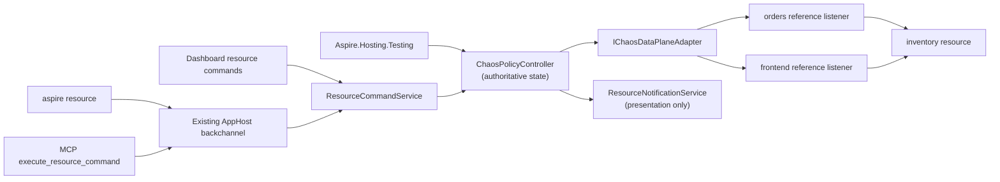

# Native Chaos hosting integration

**Status:** Proposed contribution-oriented incubation, August 2026.

This document proposes bringing the piloted `Aspire.Hosting.Chaos` experience into the Aspire ecosystem as a first-class hosting integration. It is not an Aspire roadmap or repository-ownership commitment. Product management has expressed enthusiastic support for the technical direction and for exploring CLI extensibility, while repository placement, architecture, and engineering ownership remain maintainer decisions.

## Decision summary

### Direction established by this proposal

- Every Phase 1 policy has two universal required fields, **resource + fault**, and one universal optional field, **fromResource**. The controller resolves `resource`, validates `fromResource` against declared AppHost references when present, infers a stable versioned logical profile, and uses that profile to select a closed, versioned `fault` discriminated union.
- A policy applies exactly one fault to the selected scope until explicitly removed. Omitting `fromResource` selects all callers; supplying it selects the calling Aspire resource on an existing declared reference to `resource`. Modeled Cosmos account, database, or container resources may additionally select `read`, `write`, or `query` operations.
- The logical profile is derived metadata, not authored policy and not a CLR type. Aspire compiles it to DCP's internal proxy topology and matcher/response templates. Policy authors never select a profile, endpoint, route, raw HTTP method, path, header, percentage, seed, policy lifetime, priority, effect order, or policy ID.
- The MVP fault surface is a closed support matrix: `http/v1` permits only typed `latency` and `httpStatus`; only modeled Cosmos emulator account, database, and container resources receive the Azure-specific `cosmos-gateway/v1` profile, which permits only typed `throttle`. Every other Azure resource type is explicitly ineligible.
- Phase 1 admits a policy only when DCP can apply the requested fault unambiguously and completely across every relevant resource-wide path or every path for the selected declared caller reference. Otherwise, application fails with an actionable eligibility reason.
- Policy scopes conflict when both the destination scope and caller scope overlap. A resource-wide policy conflicts with every caller-specific policy on the same ordinary resource or overlapping Cosmos hierarchy; caller-specific policies for distinct callers may coexist.
- Use one authoritative controller for CLI, dashboard, MCP, and tests. The CLI remains a client of resource commands rather than a second policy engine.
- Use the typed JSON policy document as canonical CLI input through `--file <path|->`; interactive authoring and typed test helpers produce that same payload rather than defining parallel schemas.
- Keep DCP endpoint topology stable for the Run session and mutate fault behavior dynamically.
- Keep the integration run-only and publish-safe. Chaos control resources and metadata do not appear in publish output.
- Explicit removal is the policy lifecycle. Test lease disposal removes the policy. AppHost shutdown or restart clears all policies.
- DCP proxies force pass-through after controller-liveness loss. The absence of a configurable policy lifetime must never strand a fault.
- Start with HTTP/1.1 and only the HTTP/2 request/response behavior proven by conformance testing. Unsupported protocols and resources fail explicitly.
- Random campaigns are a future direction. Phase 1 agents use the same explicit add and remove operations as humans.
- Caller-specific support faults a reference already declared in the AppHost model through optional `fromResource`. It does not ask users to select proxy topology or permit authors to invent an edge.
- Phase 1 includes a Cosmos emulator Gateway HTTPS profile. `resource` names an existing modeled account, database, or container resource, and optional `operations` selects `read`, `write`, or `query`; omitted means all operations in that resource scope.
- Cosmos operation selection is a hard release gate, not an optimistic contract. If Gateway traffic cannot be classified from URI, method, and headers without request-body parsing, Phase 1 falls back to modeled container-level all-operations support and rejects `operations`.
- `fromResource` ships only when DCP provides stable eager per-reference listener and address identity. That topology and its pooled-connection isolation proof are Phase 1 gates; headers and baggage are never used as caller identity.

### Recommendation

Extend the DCP proxy with a versioned fault-control contract, backed by a singleton controller provided by Aspire Hosting at run time. This follows the direction Damian suggested in the original meeting: keep Aspire's transparent proxy topology and add fault behavior at that layer.

The user-facing contract stays Aspire-native and intentionally small. DCP may retain a richer normalized capability and wire contract internally, but that vocabulary does not become the policy schema.

This proposal intentionally applies chaos to DCP. DCP does not support fault injection today: current support controls whether an endpoint is proxied and how its address is allocated. The native work therefore includes the live policy, acknowledgement, capability, liveness, and telemetry seams described below rather than routing around DCP with a second permanent proxy layer.

### Decisions still required

- Whether the contribution belongs directly in `microsoft/aspire` or should continue incubating in an Azure-owned repository before moving into the Aspire namespace.
- The DCP and Aspire Hosting ownership split for the proxy fault-control contract.
- Whether a YARP-compatible adapter is useful as a temporary conformance harness while the DCP contract is implemented.
- Which HTTP/2 behaviors pass the required correctness spikes.
- Whether Aspire-managed double-leg TLS interception can establish trusted identity across Windows, Linux, macOS, and supported containers without disabling validation.
- Whether a richer dashboard experience is warranted after resource commands and telemetry prove sufficient.
- Whether the semantic and performance budgets agreed with DCP owners support default-on availability or require process/run opt-in.
- Whether Gateway traffic proves database/container and `read|write|query` classification without request-body parsing; failure narrows Phase 1 to modeled container-level all-operations support.
- Whether DCP can add stable per-reference listener identity without changing service-discovery values or breaking pooled connections.

## Motivation and source context

The pilot addresses a practical inner-loop gap: applications often behave differently across developer hosts, Linux containers, and shared authenticated environments. Local fault injection can expose retry, timeout, idempotency, and partial-failure bugs before a developer needs a scarce shared environment.

Cosmos emulator Gateway faulting is a defining Phase 1 use case because it tests the architecture beyond generic HTTP status and latency: Aspire already models account/database/container identity, while a useful throttle must preserve TLS validation, isolate a selected hierarchy scope and operation category, and engage the Cosmos SDK's normal retry behavior. Shipping that profile with hard protocol gates demonstrates that resource-native authoring can remain small without reducing DCP to a Cosmos-specific proxy.

The Aspire discussion identified the existing service proxy as the right architectural direction, and subsequent product conversations supported exploring proxy-based fault handling and CLI extensibility. This remains **contribution-oriented incubation pending maintainer and engineering decisions**, not a shipping or repository-ownership commitment.

## Goals

1. Provide zero-setup fault injection for eligible Aspire resources in Run mode.
2. Make the complete Phase 1 policy model understandable as required `resource`, optional `fromResource`, resource-validated selectors such as Cosmos `operations`, and required typed `fault`.
3. Apply and remove faults dynamically without restarting the AppHost or changing service discovery.
4. Keep proxy topology and protocol details out of user-facing policy, CLI, and testing APIs while supporting caller selection by Aspire resource identity.
5. Route CLI, dashboard, MCP, and tests through one controller and one acknowledgement path.
6. Make every successful mutation reflect acknowledged DCP state, including forward compensation after partial application.
7. Keep tests simple and honest about resource-wide, caller-specific, and typed Cosmos operation effects.
8. Keep publish output deterministic and free of run-only chaos topology or state.
9. Make active faults visible in the dashboard and telemetry.
10. Reject unsupported resources, faults, and protocols with actionable diagnostics.

## Non-goals

- Moving Conductor, run-to-green workflow logic, or pilot-specific MCP glue into Aspire.
- Providing production traffic fault injection or a production service mesh.
- Persisting policies across AppHost restarts.
- Exposing generic request selection by path, method, headers, or other raw protocol properties.
- Authoring arbitrary caller-to-destination pairs or selecting a particular proxy listener, endpoint, or route.
- Probabilistic activation, user-provided randomness, or parallel-test traffic isolation.
- Configurable policy lifetime, expiry, pause, priority, ordering, or composition.
- User selection of proxy paths or network topology.
- Random campaign execution in Phase 1.
- Supporting arbitrary L4 protocols in the first increment.
- Building a custom dashboard framework as a prerequisite.
- Replacing Azure Chaos Studio or other environment-level fault systems.
- Making application code depend on a Chaos client library.

## Current pilot

The pilot proves the end-to-end experience and provides useful invariants, but several details are incubation workarounds rather than the desired upstream design.

| Area | Pilot behavior | Native Phase 1 treatment |
| --- | --- | --- |
| Resource | `ChaosProxyResource` is a thin `ContainerResource` with service discovery | Replace it with one inert run-only `ChaosEnvironmentResource`; DCP carries traffic |
| Topology | One explicit proxy per selected edge | Keep topology internal to DCP and admit only resources with complete fault coverage |
| Policies | Startup and runtime policy documents include detailed matching and lifetime controls | No startup authoring; runtime policy has required `resource`, optional `fromResource`, inferred catalogs, closed typed selectors, and required typed `fault` |
| State | Proxy-local in-memory policy stores | One AppHost controller owns authoritative state |
| Cleanup | Explicit delete plus expiry | Explicit remove only; controller-liveness loss forces pass-through |
| Composition | Installation order resolves overlap | Caller and destination scope determine conflicts; overlapping applies fail deterministically |
| Isolation | Request matching can isolate some traffic | Omitted `fromResource` affects all callers; a validated `fromResource` isolates one declared caller, and Cosmos may additionally select typed operations |
| Telemetry | Fire counts and fired paths survive removal | Keep bounded activation counts and sanitized receipts |
| Publish | Proxy resources are excluded from the manifest | Also prove normal references contain no chaos metadata |
| Proxy image | Each edge builds its own image for an Aspire version workaround | Do not port |
| Certificates | Development certificates and accept-any upstream TLS support emulator scenarios | Replace with a reviewed local trust and control-channel design |
| Integration glue | Conductor and run-to-green drive policies | Do not move initially |

Pilot evidence includes:

- `src/Aspire.Hosting.Chaos/ApplicationModel/ChaosProxyResource.cs`
- `src/Aspire.Hosting.Chaos/ChaosProxyResourceBuilderExtensions.cs`
- `src/Aspire.Hosting.Chaos/ChaosProxyMeshExtensions.cs`
- `src/Aspire.Hosting.Chaos/Mesh/ChaosMeshScope.cs`
- `src/Aspire.Hosting.Chaos/container/Program.cs`
- `src/Aspire.Hosting.Chaos/container/ChaosEndpoints.cs`
- `src/Aspire.Hosting.Chaos/container/Policy/ActivePolicyStore.cs`
- `src/Aspire.Hosting.Chaos/container/PolicyExpirationService.cs`
- `src/Aspire.Chaos.Client/ChaosProxyClient.cs`
- `src/Aspire.Chaos.Client/ChaosPolicy.cs`
- `docs/projects/aspire-chaos-proxy/aspire-chaos-proxy.plan.md`

These paths are relative to the piloted Chaos repository, not this repository.

## Relevant Aspire primitives

The proposal builds on current Aspire contracts rather than inventing parallel infrastructure.

### App model and DCP proxy support

- Resources are inert model objects; lifecycle and behavior belong in annotations, services, and event handlers (`docs/specs/appmodel.md`).
- Stable endpoint annotations exist during model construction, while allocated host values resolve later (`src/Aspire.Hosting/ResourceBuilderExtensions.cs`).
- `ProxySupportAnnotation` currently contains only `ProxyEnabled` (`src/Aspire.Hosting/ApplicationModel/ProxySupportAnnotation.cs`).
- DCP service specs carry address, port, protocol, and allocation mode; `Proxyless` bypasses the proxy (`src/Aspire.Hosting/Dcp/Model/Service.cs`).
- `DcpExecutor` creates proxied or proxyless services and waits for effective addresses, but no current model carries fault rules or live policy revisions (`src/Aspire.Hosting/Dcp/DcpExecutor.cs`).
- `YarpResource` is an existing explicit L7 proxy resource, but it does not expose dynamic fault behavior (`src/Aspire.Hosting.Yarp/YarpResource.cs`).

Adding faults to DCP is new product work across Hosting and DCP, not use of an existing extension point.

### Reference and Cosmos resource identity

- `EndpointReferenceAnnotation` records a reference from one resource to another resource's endpoints, and `ValueProviderContext.Caller` identifies the resource requesting a resolved value (`src/Aspire.Hosting/ApplicationModel/EndpointReferenceAnnotation.cs` and `src/Aspire.Hosting/ApplicationModel/IValueProvider.cs`).
- `AzureCosmosDBResource`, `AzureCosmosDBDatabaseResource`, and `AzureCosmosDBContainerResource` are public top-level Aspire resources with public parent and logical-name identity (`src/Aspire.Hosting.Azure.CosmosDB/AzureCosmosDBResource.cs`, `AzureCosmosDBDatabaseResource.cs`, and `AzureCosmosDBContainerResource.cs`).
- `WithReference(container)` preserves a directed `ResourceRelationshipAnnotation` to that container and emits inherited `DatabaseName` plus `ContainerName` connection properties (`src/Aspire.Hosting/ResourceBuilderExtensions.cs` and `src/Aspire.Hosting.Azure.CosmosDB/AzureCosmosDBContainerResource.cs`).
- The Cosmos emulator client integration forces Gateway mode and `LimitToEndpoint`, providing a bounded first target for protocol proof (`src/Aspire.Hosting.Azure.CosmosDB/AzureCosmosDBExtensions.cs`).

These identities are sufficient for Phase 1 Cosmos authoring, but enforcement remains gated on traffic classification, protocol-correct throttling, trusted TLS interception, and stable eager per-reference DCP listener identity. Current DCP `Service` and proxy contracts have no caller dimension, so Phase 1 must add that capability before `fromResource` can ship.

### Resource commands and clients

`WithCommand` binds a resource command to an AppHost callback with dependency injection, logging, cancellation, and validated arguments (`src/Aspire.Hosting/ResourceBuilderExtensions.cs` and `src/Aspire.Hosting/ApplicationModel/ResourceCommandService.cs`).

The dashboard, CLI, and MCP already dispatch those commands through the AppHost backchannel:

- `src/Aspire.Cli/Commands/ResourceCommand.cs`
- `src/Aspire.Cli/Commands/ResourceCommandHelper.cs`
- `src/Aspire.Hosting/Backchannel/AuxiliaryBackchannelRpcTarget.cs`
- `src/Aspire.Cli/Mcp/Tools/ExecuteResourceCommandTool.cs`
- `docs/specs/cli-backchannel.md`

Chaos commands that promise JSON must return exactly one valid JSON document and mark it as JSON. A chaos-specific backchannel method is not required.

### Testing and eventing

Current `Aspire.Hosting.Testing` surfaces include builder callbacks, `BuildAsync`, `StartAsync`, endpoint lookup, application services, and disposal (`src/Aspire.Hosting.Testing/DistributedApplicationTestingBuilder.cs` and `src/Aspire.Hosting.Testing/DistributedApplicationFactory.cs`).

The integration must not use obsolete `IDistributedApplicationLifecycleHook`. A long-lived controller should register through `IDistributedApplicationEventingSubscriber`, retain subscription tokens, unsubscribe during disposal, and observe AppHost shutdown and resource lifecycle events.

### Presentation state

`CustomResourceSnapshot` and `ResourceNotificationService` describe dashboard state. They are not a policy database or data-plane contract (`src/Aspire.Hosting/ApplicationModel/CustomResourceSnapshot.cs` and `src/Aspire.Hosting/ApplicationModel/ResourceNotificationService.cs`).

## Proposed architecture



The architecture has four layers:

1. **App-model resources, declared references, and DCP capabilities** determine whether a fault can cover a destination resource or one caller's references completely.
2. **`ChaosPolicyController`** resolves the resource, validates optional caller identity against existing references, infers the resource's stable logical profile and closed fault catalog, validates the policy, and owns active policies, generated policy IDs, revisions, leases, acknowledgement, and bounded activation observations.
3. **`IChaosDataPlaneAdapter`** translates the small Aspire policy and selectors validated by the inferred catalog into DCP's internal desired-state contract.
4. **DCP proxies** inject faults and report acknowledgement, liveness, and bounded observations.

All control-plane clients use the controller. No client writes directly to proxy state, and workload headers or baggage never establish caller identity.

### Implicit control resource

Aspire Hosting automatically adds one visible run-only `ChaosEnvironmentResource` when the selected DCP version advertises fault-control capability. This synthetic resource exposes commands and aggregate status; it does not carry traffic or add a network hop.

`chaos` is the preferred resource name, not a reserved name. If user code already uses it, Aspire chooses the first deterministic fallback (`aspire-chaos`, then a numeric suffix). The resolved name appears in startup logs, the dashboard, and `aspire resource list`.

No `AddChaos`, special reference API, or per-resource setting is required. Every resource remains pass-through until a policy is applied. Standard resource declarations, references, and service-discovery values do not change.

Default-on availability in Run mode is conditional on Phase 0 proving semantic and performance budgets agreed with DCP owners. If those budgets pass, the capability is available by default with administrative opt-out through `ASPIRE_CHAOS_ENABLED=false`. If they fail, it ships default-off with process/run opt-in through `ASPIRE_CHAOS_ENABLED=true`. Publish and Deploy never enable the capability.

### Resource eligibility

The `resource` field names the downstream Aspire resource receiving the traffic. For example, `"resource": "inventory"` applies the fault on requests entering `inventory`; it does not fault requests originating from `inventory`.

Optional `fromResource` names the calling Aspire resource on an existing reference to `resource`. For example, `"fromResource": "orders", "resource": "inventory"` selects the declared `orders -> inventory` reference while leaving `frontend -> inventory` unaffected. Omitting `fromResource` selects all callers. Both fields use Aspire resource identity, not DNS names, listeners, endpoint addresses, or arbitrary caller/destination strings.

The controller validates the edge from the AppHost model before activation. Ordinary references use their declared endpoint/reference relationships. Cosmos child-resource references use their modeled `ResourceRelationshipAnnotation` and account -> database -> container parent identity, including the relationship created by `WithReference(container)` even though its connection properties inherit account and database values. A caller must reference the selected resource itself; inherited connection properties do not authorize an undeclared caller.

If one caller has multiple declared references to the same destination resource, `fromResource` selects all of those references. DCP must cover every selected path atomically; the controller rejects an ambiguous or partially mediated set rather than choosing one reference. A caller with no declared edge is rejected. This keeps policy semantics stable if the AppHost adds another endpoint reference later.

Enforcement requires DCP to eagerly allocate distinct per-reference proxy/listener/address identity at startup. Service-discovery values must remain stable while policies mutate, including for warmed pooled connections. Phase 1 cannot ship `fromResource` until the DCP contract expresses that caller dimension and the proof gate demonstrates isolation across multiple callers and multiple references. Propagating caller identity in a header or baggage is rejected: it is spoofable, requires application changes, and does not cover Cosmos or direct protocols.

A resource is eligible for a fault only when:

- the resource exists in the current AppHost model;
- `fromResource`, when supplied, exists and is the caller side of at least one declared AppHost reference to `resource`;
- the controller can infer a supported logical profile and catalog version from that resource;
- every relevant resource-wide path, or every declared path for `fromResource`, is mediated by a DCP proxy that supports the fault;
- each selected caller path has stable eager listener and address identity for the Run session;
- DCP can preserve pass-through behavior for the resource's protocol;
- applying the fault has one complete, unambiguous meaning for the resource;
- every closed resource-profile selector is valid and enforceable for that resource type; and
- DCP can acknowledge the same desired revision across every enforcing proxy path.

If any condition fails, the controller rejects the apply before activation. Diagnostics name the resource and explain what the developer can change. Example reasons include:

- the resource uses a proxyless path;
- some host or container traffic bypasses DCP;
- the resource exposes a protocol unsupported by the requested fault;
- HTTPS interception is not available;
- multiple relevant paths cannot be covered atomically; or
- the selected caller has no declared reference to the destination or one of its multiple references lacks stable DCP identity; or
- the selected DCP version does not advertise the required capability.

`list-resources` and `describe-resource` resolve the app model and report the inferred logical profile, eligible faults, their typed required and optional parameters, profile selectors, eligible `fromResource` callers, and actionable ineligibility reasons. These commands serialize the closed MVP support matrix directly, including ineligible Azure resources with no profile. A developer does not need to guess resource names or understand CLR types, listeners, or address allocation. Each row shows:

| Column | Purpose |
| --- | --- |
| Resource name | The exact identifier to use in `resource` |
| Modeled resource type | Discoverability context such as project, container, or `AzureCosmosDBContainerResource`; never authored policy |
| Logical profile/version | Stable controller contract such as `http/v1` or `cosmos-gateway/v1`; inferred rather than authored and not a CLR type |
| Parent hierarchy | The account -> database -> container chain, when the resource has one |
| Supported faults | Closed fault types plus JSON types, constraints, required and optional member parameters, and profile selectors from the shipping MVP matrix |
| Eligible callers | Aspire resource names accepted by `fromResource`, grouped with the number of declared references they cover; empty when caller-specific routing is unavailable |
| Eligibility reason | Why the resource is eligible, or the specific actionable reason it is not |

For example:

| Resource name | Modeled resource type | Logical profile/version | Parent hierarchy | Supported faults | Eligible callers | Eligibility reason |
| --- | --- | --- | --- | --- | --- | --- |
| `inventory` | Project | `http/v1` | — | `latency(amount)`, `httpStatus(statusCode)` | `orders` (1), `frontend` (2) | Eligible |
| `carts` | `AzureCosmosDBContainerResource` | `cosmos-gateway/v1` | `cosmos` -> `shop-db` -> `carts` | `throttle(retryAfter?)` with `read`, `write`, `query`, or all | `orders` (1) | Eligible when modeled with `AddContainer`, referenced by `orders`, and proven Gateway HTTPS emulator mode |
| `storage` | `AzureStorageResource` | — | — | — | — | Ineligible: no MVP chaos profile exists for `AzureStorageResource` |
| `legacy-orders` | Container | — | — | — | — | Ineligible: some container traffic bypasses DCP |

Phase 0 must census representative and playground resources and record eligibility reasons. Low coverage should become explicit roadmap evidence, not an excuse to expose proxy topology in the v1 contract.

For the Phase 1 Cosmos profile, the same `resource` field may name an `AzureCosmosDBResource`, `AzureCosmosDBDatabaseResource`, or `AzureCosmosDBContainerResource` — see [How resource selection works](#how-resource-selection-works) for the account/database/container scoping table. No duplicate database or container string fields are added; `"resource": "carts"` selects the modeled container resource named `carts`, including its public parent and logical container identity.

The first supported target is a modeled Cosmos emulator resource in Gateway HTTPS mode. Direct/TCP (RNTBD) bypasses that gateway; real accounts, Direct clients, and consumers whose connection mode cannot be proven are ineligible and must fail loudly rather than no-op. EF Core may use containers that are not modeled as `AzureCosmosDBContainerResource`. `list-resources` must warn about that gap, and container-scoped selection requires the AppHost to model the container with `AddContainer`.

### Stable startup and connection semantics

DCP resource-wide and per-reference proxy paths are established eagerly at startup whether or not a policy is active. An empty policy set is pass-through. Applying and removing a policy never rewrites service-discovery values or restarts workloads.

When DCP advertises HTTP chaos capability, the relevant path remains protocol-aware for the entire Run session. It must not switch from L4 forwarding to L7 handling when the first policy arrives.

Acknowledged revision R governs every request dispatched after acknowledgement, including requests on pooled connections. A request already in flight keeps the revision selected at dispatch. Removal uses the same boundary: after acknowledgement, the next dispatched request passes through.

Conformance coverage includes headers, trailers, connection reuse, `Expect: 100-continue`, cancellation, and HTTP/2 flow control. Tests must warm pools from at least two callers, apply a caller-specific policy and prove only the selected caller's next request faults, then remove it and prove both callers pass without reconnecting. Multiple references from one caller must remain covered by the same policy and acknowledgement.

## DCP proxy extension

### Native path

The recommended path extends DCP and Aspire Hosting with:

- versioned capability discovery;
- stable eager per-reference listener and address identity;
- live full-snapshot policy updates;
- revision acknowledgement and structured rejection;
- protocol-aware proxy behavior;
- controller-liveness fail-safe behavior; and
- bounded activation telemetry.

The internal DCP contract may describe proxy path coverage, protocol details, normalized effect configuration, matcher/response templates, and compatibility versions. Those are generic platform contracts between Hosting and DCP. Aspire infers the logical profile from modeled resource identity, validates its closed fault catalog, and compiles typed operations into those templates; raw HTTP methods, paths, headers, Cosmos response details, and the inferred profile identifier are not fields in authored policy.

The minimal operations are:

- `GetCapabilities`, which returns resource coverage and normalized effect capabilities that Aspire intersects with its versioned logical fault catalogs;
- `SetDesiredPolicies(revision, policies[])`, which sends the complete desired snapshot; and
- `GetStatus`, which returns the acknowledged revision, controller-liveness state, bounded observations, and structured rejection details.

### Incubation fallback

An explicit run-only YARP-compatible proxy and controller can serve as a conformance harness if DCP sequencing would otherwise block policy validation. It is not the product topology: it adds visible resources, address rewriting, and another network hop.

`IChaosDataPlaneAdapter` keeps controller behavior independent of that choice. CLI commands, leases, generated policy IDs, acknowledgement, telemetry, and dashboard projections remain the same.

## Phase 1 policy model

Every Phase 1 policy has these universal fields:

| Field | Meaning |
| --- | --- |
| `resource` | Required downstream Aspire resource name; the fault applies on requests entering this resource |
| `fromResource` | Optional calling Aspire resource on an existing declared reference to `resource`; omitted means all callers |
| `fault` | Required member of the inferred profile's discriminated union; `fault.type` is the discriminator |

The controller resolves `resource` and optional `fromResource` against the AppHost model before interpreting `fault`. It infers a stable, versioned logical profile from `resource`, then uses `fault.type` to select one member schema from that profile's closed discriminated union. Each member has explicit required and optional typed parameters. Authors do not provide `resourceType`, `profile`, or a generic parameter bag. The inferred profile is not a CLR type and may evolve only through explicit catalog versioning.

### Closed MVP support matrix

The MVP (Phase 1) support matrix is closed. Discovery, validation, CLI prompting, Dashboard controls, MCP, and typed testing helpers all project this same matrix rather than maintaining separate fault lists.

| Stable logical profile | Aspire resource types eligible for the profile | `fault.type` | Typed fault parameters | Resource-profile selectors |
| --- | --- | --- | --- | --- |
| `http/v1` | Ordinary non-Azure `ProjectResource` and `ContainerResource` destinations whose selected inbound paths are fully mediated by DCP as HTTP/1.1 or proven h2c HTTP/2; no `Azure*Resource` enters this row | `latency` | `amount`: required JSON duration string; must be positive and no greater than the maximum advertised by the DCP capability | Universal optional `fromResource`; no profile-specific selectors |
| `http/v1` | Same as above | `httpStatus` | `statusCode`: required JSON integer from 400 through 599 | Universal optional `fromResource`; no profile-specific selectors |
| `cosmos-gateway/v1` | `AzureCosmosDBResource` selecting a modeled emulator account in Gateway HTTPS mode | `throttle` | `retryAfter`: optional JSON duration string; must be non-negative and no greater than the profile maximum; omission uses the catalog-defined default | Universal optional `fromResource`; optional non-empty unique `operations` array containing only `read`, `write`, and `query`; omission means all operations in the account scope |
| `cosmos-gateway/v1` | `AzureCosmosDBDatabaseResource` under an eligible modeled emulator account | `throttle` | Same typed `retryAfter` contract | Universal optional `fromResource`; the same gated `operations` selector, scoped to every modeled container under the database |
| `cosmos-gateway/v1` | `AzureCosmosDBContainerResource` under an eligible modeled emulator database | `throttle` | Same typed `retryAfter` contract | Universal optional `fromResource`; the same gated `operations` selector, scoped to that modeled container |

No other Azure resource type has an MVP chaos profile. `AzureStorageResource`, `AzureServiceBusResource`, `AzureRedisResource`, `AzureKeyVaultResource`, `AzureSqlServerResource`, `AzurePostgresResource`, their child resources, and every other `Azure*Resource` outside the three Cosmos rows are ineligible even if their SDK traffic ultimately uses HTTP. They must appear in discovery with `resourceProfile: null`, no supported faults, and an actionable "no MVP chaos profile" reason. Adding support requires a separately reviewed stable profile, closed fault union, protocol proof, and matrix row; the controller never falls back from an unknown Azure resource type to `http/v1`.

Catalog membership is profile-specific. Resolving ordinary `inventory` to `http/v1` permits only `latency` and `httpStatus`, while resolving one of the three modeled Cosmos resource types to `cosmos-gateway/v1` permits only `throttle`; no fault type, parameter schema, or selector implicitly carries across profiles.

The Cosmos `operations` selector ships only if classification from URI, method, and headers passes its release gate without body parsing. If that gate fails, the account and database rows are removed from the shipping matrix, the container row supports all-operations `throttle` only, and `operations` is rejected rather than guessed.

Matcher, percentage, seed, duration, priority, endpoint, source, `resourceType`, `profile`, and campaign fields are not added to Phase 1. Generic HTTP method, path, header, body, or arbitrary fault-property matchers are explicitly rejected. Fields outside the universal schema or the inferred profile's closed selectors are rejected.

The controller generates an opaque policy ID after a successful apply. The ID is returned for later removal but is never user-authored policy content. Revision, ownership, proxy coverage, acknowledgement state, and liveness metadata remain internal.

Fault-specific parameters exist only in their discriminated-union member schema. An unknown fault type, unknown parameter, missing required parameter, or profile-specific selector outside the matrix fails before activation with a diagnostic listing every valid fault type, required and optional parameters, and selector for the resolved resource.

### Examples

**HTTP latency**

```json
{
  "resource": "inventory",
  "fromResource": "orders",
  "fault": {
    "type": "latency",
    "amount": "2s"
  }
}
```

Requests from `orders` to `inventory` receive two seconds of added latency until the policy is removed. Other callers remain unaffected because the AppHost declares a distinct reference for each caller.

**HTTP synthetic status**

```json
{
  "resource": "orders",
  "fault": {
    "type": "httpStatus",
    "statusCode": 503
  }
}
```

Every request to `orders` receives the protocol-correct synthetic response until the policy is removed because `fromResource` is omitted.

### How resource selection works

Every identifier that can appear in a policy — `resource` and optional `fromResource` — is an Aspire app-model resource name: the name assigned when the resource was added in the AppHost, for example via `AddProject`, `AddContainer`, or `AddAzureCosmosDB(...).AddDatabase(...).AddContainer(...)`. The controller resolves that name by resource type and by the parent/child and reference relationships already recorded in the Aspire application model. It is never a DNS name, an Azure physical resource name, a proxy listener or endpoint address, or an arbitrary string the policy author invents.

| Resource type named by `resource` | Fault scope |
| --- | --- |
| Ordinary project or container resource | All inbound traffic when `fromResource` is omitted; otherwise all declared references from that caller to the downstream resource |
| `AzureCosmosDBResource` (account) | Every modeled database and container under that account, for all callers or the declared caller selected by `fromResource` |
| `AzureCosmosDBDatabaseResource` | Every modeled container under that database, for all callers or the declared caller selected by `fromResource` |
| `AzureCosmosDBContainerResource` | That one modeled container, for all callers or the declared caller selected by `fromResource` |

Physical Azure database and container names are derived from the resource's model properties and its account -> database -> container parent chain at execution time. Authors name the Aspire resource once; they never duplicate the physical database or container name in policy.

### Cosmos container write throttling (Phase 1)

Assume the AppHost already models a Cosmos container with `AddContainer("carts", ...)`. The policy's `resource` field selects that existing `AzureCosmosDBContainerResource`:

```json
{
  "resource": "carts",
  "fromResource": "orders",
  "operations": ["write"],
  "fault": {
    "type": "throttle",
    "retryAfter": "1s"
  }
}
```

The table below labels each field:

| Field | Availability | Meaning |
| --- | --- | --- |
| `resource` | Phase 1 | Required downstream Aspire resource name; see [How resource selection works](#how-resource-selection-works) |
| `fromResource` | Phase 1 | Optional calling Aspire resource. Must be the caller side of an existing declared AppHost reference to `resource`; omitted means all callers |
| `fault` | Phase 1 | Required single fault whose type and closed parameters are validated against the inferred resource catalog |
| `operations` | Phase 1 Cosmos profile, subject to the classification release gate | Optional operation categories: `read`, `write`, `query`. Omitted means all operations within the selected resource's scope |

This policy throttles writes only from `orders` through the already-declared `orders -> carts` reference. Omitting `fromResource` would throttle writes from every caller of `carts`. The caller must have `WithReference(carts)` or the equivalent modeled child-resource relationship; inherited Cosmos connection properties do not create an edge for an unrelated caller.

`operations` describes what kind of Cosmos activity the fault applies to, in plain terms: `read` for point/item reads, `write` for creates/updates/deletes, and `query` for SQL queries. Gateway traffic capture must prove that classification from URI, method, and headers alone, without parsing request bodies. If body parsing is required, Phase 1 rejects `operations` and ships only modeled container-level all-operations support; it must not expose a misleading selector. Point-operation verbs may be added only after evidence justifies them.

In this example, `carts` specifically names the modeled Cosmos container, not the Cosmos account or database. More generally, `resource` may name an existing Aspire Cosmos account, database, or container resource to select that hierarchy scope. Authors do not repeat raw Cosmos database or container names or an inferred profile in policy. Aspire compiles the typed resource, `retryAfter`, and operation selectors to an internal matcher and a protocol-correct 429 response template, including the Cosmos retry metadata and body needed to engage normal SDK retry behavior. Raw HTTP paths, methods, headers, and response details remain internal to the profile/data-plane contract; DCP stays generic.

The first profile target is modeled Cosmos emulator resources in Gateway HTTPS mode. Aspire's emulator integration forces Gateway and `LimitToEndpoint`, but interception must establish Aspire-managed trust on both TLS legs across supported hosts and containers. Direct/TCP (RNTBD), real accounts, and unprovable connection modes remain unsupported. EF Core container usage not represented by an `AzureCosmosDBContainerResource` is ineligible for container scope until the AppHost uses `AddContainer`.

### Invalid selectors and diagnostics

The controller rejects a policy before activation whenever its identifiers do not resolve cleanly. The most important cases:

| Invalid case | Result |
| --- | --- |
| `resource` names something that does not exist in the current AppHost model | Rejected with an unknown-resource diagnostic |
| `resource` names a Cosmos container that is only reached through EF Core and was never modeled with `AddContainer` | Rejected for container scope; `list-resources` also warns about the unmodeled container |
| `operations` is supplied for a resource outside the Cosmos profile | Rejected; `operations` only has meaning for a Cosmos account, database, or container resource |
| An Azure resource type is not one of the three Cosmos resource types in the MVP matrix | Rejected with no inferred profile or faults, for example: `storage (AzureStorageResource) has no MVP chaos profile` |
| `fault.type` is not in the inferred resource catalog, or its member parameters are missing, mistyped, out of range, or unknown | Rejected with the inferred logical profile/version plus valid fault types, JSON types, constraints, and required/optional parameters, for example: `inventory uses http/v1; valid faults are latency(amount: duration string, required) and httpStatus(statusCode: integer 400..599, required)` |
| Authored input supplies `resourceType` or `profile` | Rejected; both are inferred metadata and never authored policy |
| The Cosmos client uses Direct/TCP (RNTBD), or targets a real (non-emulator) account whose connection mode cannot be proven | Rejected as ineligible; the controller fails loudly rather than silently no-op |
| `fromResource` names something that does not exist | Rejected with an unknown-caller-resource diagnostic |
| `fromResource` names a resource with no existing declared reference to `resource` | Rejected; caller-specific behavior only faults a reference the AppHost already declares, not an arbitrary caller/destination pair |
| `fromResource` has multiple references to `resource` and any selected path lacks stable eager DCP identity | Rejected with the uncovered references identified; the controller never chooses one path implicitly |

Phase 1 accepts only the resource type, fault, parameter, and selector combinations in the shipping matrix. It accepts `operations` only for a modeled Cosmos resource and only when the operation-classification release gate passes; otherwise the container-level fallback rejects the field. The unknown-resource, no-profile, declared-reference, and Cosmos-eligibility rows govern every Phase 1 policy.

### One policy per overlapping scope

Two policies conflict when their destination scopes overlap and their caller scopes overlap. Omitted `fromResource` means the caller scope is all callers, so a resource-wide `inventory` policy conflicts with every caller-specific `inventory` policy. Two caller-specific policies for `orders -> inventory` conflict, while `orders -> inventory` and `frontend -> inventory` may coexist.

For Cosmos, account, database, and container ancestry defines destination overlap. An account policy overlaps every modeled database and container beneath it; a database policy overlaps its account and descendant containers; and a container policy overlaps its ancestors or another policy on that container, regardless of operation selection. Overlap becomes a conflict only when `fromResource` is omitted by either policy or both policies name the same caller. Sibling containers and distinct caller-specific scopes do not conflict.

This rule eliminates precedence, ordering, and composition from Phase 1. Installation timing cannot change behavior. A future version may introduce explicit composition only after real scenarios justify the complexity.

## Controller state and acknowledgement

The controller owns:

- active policies keyed by generated policy ID and normalized destination/caller scope;
- lease ownership for typed testing;
- monotonically increasing desired revisions;
- per-proxy acknowledged revisions;
- bounded, sanitized activation observations;
- controller-liveness heartbeats; and
- active mutation state for command enablement.

Use a single-reader mutation queue for changes spanning registration and proxy acknowledgement. Read-only operations use immutable snapshots and remain available during mutation.

For each apply or remove, the controller validates the request, creates a new immutable desired snapshot, increments the revision, and sends the complete snapshot to every affected DCP proxy path. A resource-wide policy affects every relevant path; a caller-specific policy affects every stable per-reference path from `fromResource` to `resource`, including multiple declared references. The controller returns success only when all affected paths acknowledge the revision. A known-unavailable path rejects the mutation before it is queued, and an unresponsive path cannot block the queue indefinitely.

### Forward compensation

If one proxy path rejects or times out after another has acknowledged an apply, the controller immediately sends a compensating revision that omits the attempted policy. Ordinary failure is returned only after that compensating revision is acknowledged everywhere.

If compensation cannot converge within its fixed internal deadline, the controller returns a typed partially-applied failure naming the unresolved internal paths. Proxies that lose controller liveness force pass-through after a fixed platform safety interval. The interval is not policy content and is not configurable by the policy author.

The typed apply APIs surface partial application as a `ChaosPolicyApplyException` with cleanup ownership so test infrastructure can continue attempting removal. A rejected apply must never return ordinary failure while an acknowledged fault from that attempt remains active.

## Policy lifecycle

### Apply

Applying a policy is complete only when:

1. the resource and fault are valid;
2. no active policy has an overlapping destination and caller scope;
3. DCP confirms complete eligibility for the fault;
4. the controller creates a new desired revision; and
5. every affected proxy path acknowledges that revision.

The generated policy ID is returned only after successful acknowledgement.

### Remove

Removal uses the generated policy ID. It creates and awaits a new revision that omits that policy. Removing an already absent policy is idempotent success when the caller owns the ID or lease.

Explicit removal is the normal and only user-controlled lifecycle. Phase 1 does not include configurable expiry, pause, resume, or renewal.

### Liveness and restart

| Event | Behavior |
| --- | --- |
| Test lease disposal | Removes only that lease's policy and awaits acknowledgement |
| AppHost graceful shutdown | Attempts bounded removal of all policies before controller disposal |
| AppHost restart | Starts with an empty policy set; no policy state is persisted or replayed |
| Controller-liveness loss | DCP proxies force pass-through after the fixed platform safety interval |
| Proxy restart while AppHost remains alive | Starts pass-through, then reconciles the controller's latest desired revision |
| Workload restart | Existing resource-wide and per-reference DCP addresses and active controller policy remain unchanged |

Controller-liveness pass-through is mandatory because Phase 1 deliberately has no policy lifetime. It protects against a crashed or disconnected controller without asking users to reason about expiry.

## CLI UX

The immediate CLI uses existing resource commands, but the authored JSON policy is the canonical and scalable input. `add-policy` accepts exactly one input mode:

1. `--file <path>` reads one UTF-8 JSON policy document from a file.
2. `--file -` reads one UTF-8 JSON policy document from standard input. Requiring `-` explicitly prevents an interactive invocation from unexpectedly blocking on stdin.
3. Omitting `--file` starts an interactive resource-first builder when a terminal is available. It uses `describe-resource` to offer only declared callers, matrix-supported faults, typed parameters, and selectors, then submits the same JSON shape.

The subcommand-local `--file` spelling follows the Aspire CLI's existing file-option convention. `-` follows the standard CLI convention for explicit stdin and avoids inventing a second payload option.

The MVP does not add `--latency`, `--http-status`, `--throttle`, `--operations`, `--from-resource`, or an inline JSON argument to `add-policy`. Fault-specific flags would grow with every profile and duplicate the typed discriminated unions; inline JSON also creates avoidable shell-escaping and command-history problems. `--file` and interactive mode are mutually exclusive by construction, so there is no precedence or merge behavior. If concise convenience flags are justified later, each invocation must still construct exactly one canonical payload and must be rejected when combined with `--file`; convenience flags never override payload fields.

For example, `chaos-policy.json` can contain the ordinary caller-specific payload defined earlier:

```json
{
  "resource": "inventory",
  "fromResource": "orders",
  "fault": {
    "type": "latency",
    "amount": "2s"
  }
}
```

The command surface is:

```console
aspire resource chaos add-policy --file chaos-policy.json
aspire resource chaos add-policy --file -
aspire resource chaos add-policy
aspire resource chaos remove-policy --policy-id <policy-id-returned-by-add>
aspire resource chaos list-policies
aspire resource chaos list-resources
aspire resource chaos describe-resource --resource carts
```

The first two forms support repeatable automation; the third is interactive. These examples assume `chaos` is the resolved control-resource name. If user code already claimed that name, `aspire resource list` reveals the deterministic fallback.

The CLI performs only UTF-8 JSON framing and syntax parsing before passing the typed document through `ResourceCommandService` to `ChaosPolicyController`. The controller owns AppHost resource resolution, profile inference, matrix validation, conflict checks, and DCP acknowledgement. A malformed document reports file or stdin origin plus line and column. A structurally valid but unsupported policy reports JSON Pointer paths and the resolved matrix contract, for example: `$.fault.statusCode must be an integer from 400 through 599 for http/v1`. The CLI never turns the payload into a generic property bag and never calls DCP directly.

`add-policy` requires confirmation before activation, with `--yes` as the orthogonal non-interactive confirmation flag for trusted automation. `--file -` without `--yes` may prompt only when the controlling terminal supports it; otherwise it fails before consuming or applying the policy with instructions to pass `--yes`.

Illustrative `add-policy` output:

```json
{
  "controlResource": "chaos",
  "policyId": "policy-7f3a",
  "policy": {
    "resource": "inventory",
    "fromResource": "orders",
    "fault": {
      "type": "latency",
      "amount": "2s"
    }
  },
  "resourceProfile": "http/v1",
  "state": "active",
  "activationCount": 0
}
```

Illustrative `list-policies` output:

```json
{
  "controlResource": "chaos",
  "policies": [
    {
      "policyId": "policy-7f3a",
      "policy": {
        "resource": "inventory",
        "fromResource": "orders",
        "fault": {
          "type": "latency",
          "amount": "2s"
        }
      },
      "resourceProfile": "http/v1",
      "state": "active",
      "activationCount": 3
    }
  ]
}
```

The nested `policy` object is the normalized, round-trippable authored payload: it contains `resource`, optional `fromResource`, any profile selectors, and typed `fault`, and it omits output-only fields. Duration strings and selector ordering use one stable canonical form. A caller may save that object and reapply it after removing the active policy. `resourceProfile`, generated policy ID, state, and observations remain output-only sibling metadata; supplying them in authored policy is rejected.

Read-only commands remain available during mutations. Failures use nonzero command status and structured diagnostics rather than success-shaped JSON with an embedded error.

A future `aspire chaos ...` alias may provide shorter syntax over the same controller. Custom CLI extension loading must never be required for correctness or testing.

## Aspire.Hosting.Testing UX

Tests use typed, catalog-specific convenience APIs rather than shelling out or constructing generic policy property bags. Each helper serializes the same canonical policy DTO accepted by CLI file/stdin input before invoking the controller, so testing is not a second schema:

```csharp
// Proposed pseudocode. These APIs do not exist.
await using var lease = await app.ApplyHttpChaosPolicyAsync(
    resource: "inventory",
    fault: HttpChaosFault.Latency(TimeSpan.FromSeconds(2)),
    fromResource: "orders",
    cancellationToken: cancellationToken);
```

Cosmos tests use typed fault and operation selectors rather than a generic request matcher:

```csharp
// Proposed pseudocode. These APIs do not exist.
await using var lease = await app.ApplyCosmosChaosPolicyAsync(
    resource: "carts",
    fault: CosmosChaosFault.Throttle(retryAfter: TimeSpan.FromSeconds(1)),
    operations: [CosmosOperation.Write],
    fromResource: "orders",
    cancellationToken: cancellationToken);
```

The method name and typed fault improve discoverability but do not author a resource profile. The optional typed parameter is named `fromResource` consistently across HTTP and Cosmos helpers; omitting it means all callers. The controller still resolves `carts`, validates the declared caller reference, infers its catalog, and rejects a mismatch. The typed operation overload is available only when the classifier passes its release gate; the container-level fallback omits the operations argument and affects all operations. No testing API accepts raw HTTP methods, paths, headers, arbitrary parameter bags, or response templates.

The apply APIs return an `IAsyncDisposable` lease. A richer concrete lease may expose `PolicyId`, `Resource`, optional `FromResource`, inferred `ResourceProfile`, `Fault`, `ActivationCount`, and bounded activation observations, but those details are not required for the common path.

The lease contract is:

- creation completes only after all affected DCP proxy paths acknowledge the apply;
- disposal removes only the lease's generated policy ID;
- disposal waits for removal acknowledgement within a fixed cleanup deadline;
- disposal is idempotent;
- disposal never clears another resource's policy; and
- cleanup failure throws a typed exception rather than silently succeeding.

Illustrative test:

```csharp
// Proposed pseudocode. These APIs do not exist.
await using var app = await testingBuilder.BuildAsync();
await app.StartAsync();

await using var lease = await app.ApplyHttpChaosPolicyAsync(
    resource: "inventory",
    fault: HttpChaosFault.Latency(TimeSpan.FromSeconds(2)),
    fromResource: "orders",
    cancellationToken: cancellationToken);

using var client = app.CreateHttpClient("orders");
var response = await client.GetAsync("/checkout", cancellationToken);

await lease.WaitForActivationAsync(cancellationToken);
```

Assertions happen after application traffic completes. The proxy records activation; it does not execute test assertions inline.

### Fixture use and isolation

A policy with omitted `fromResource` affects all traffic in its selected destination scope. A caller-specific policy affects all declared references from that caller to the destination, plus the selected operations for a Cosmos resource. Phase 1 does not claim per-request or per-test traffic isolation, and it does not split multiple references from the same caller.

Tests sharing an AppHost must serialize overlapping chaos mutations and any traffic that depends on them. Non-overlapping caller-specific policies may run concurrently, but tests that need independent behavior within one caller scope must use separate AppHost instances. The API and documentation must state this directly rather than implying isolation through distributed-context propagation.

A fixture may own the `DistributedApplication`, but each test should own and dispose its lease:

```csharp
// Proposed pseudocode. These APIs do not exist.
public Task<IAsyncDisposable> ApplyLatencyAsync(
    string resource,
    string? fromResource,
    TimeSpan amount,
    CancellationToken cancellationToken) =>
    App.ApplyHttpChaosPolicyAsync(
        resource: resource,
        fault: HttpChaosFault.Latency(amount),
        fromResource: fromResource,
        cancellationToken: cancellationToken);
```

Fixture teardown and AppHost disposal provide final cleanup boundaries. They do not replace per-test lease disposal or serialization.

## Dashboard visualization and MCP

The dashboard must make active fault injection obvious. A developer should not need to inspect logs or remember that a test installed a policy to understand why a resource is delayed or failing.

### Initial dashboard experience

The Resources page shows one run-only chaos control resource. Its state and properties are projections from `ChaosPolicyController`, never authoritative storage.

The control resource remains `Running` while available and uses warning styling whenever a policy is active. Reconciliation failure and revision drift appear as health reports rather than invented lifecycle states. The resource never gates workload startup or readiness.

The Phase 1 policy table shows caller scope, inferred logical profile, and operation scope when applicable:

| Resource | From resource | Logical profile | Operations | Fault | State | Activation count |
| --- | --- | --- | --- | --- | --- | ---: |
| `inventory` | `orders` | `http/v1` | All | Latency 2s | Active | 3 |
| `carts` | All callers | `cosmos-gateway/v1` | Write | Throttle (429, retry after 1s) | Active | 7 |

The control resource exposes commands for add, remove, list policies, list resources, and describe resource. After resource selection, the dashboard renders an optional caller selector populated only with declared, eligible `fromResource` values, then dynamically renders only controls projected from the shipping MVP matrix. Operations use the same canonical payload, validation, and acknowledgement path as CLI and tests. The dashboard never calls DCP directly.

Selected workload resources may show a derived `Chaos fault` property and a relationship to the control resource. Intentional fault activation must not make the workload resource unhealthy.

First activation in a Run session emits a one-time message-bar notification linking to the control resource. A persistent global active-chaos indicator is potential future Dashboard core work.

### MCP

MCP uses the existing `execute_resource_command` tool against the same commands and supplies the same canonical typed JSON policy payload as CLI file/stdin input. It is not a privileged DCP client and does not receive an independent policy store or schema.

The Phase 1 agent story is explicit and inspectable: list eligible resources and their declared callers, optionally select `fromResource` in the command input, add one policy, observe telemetry, and remove that policy. An agent crash cannot bypass controller-liveness pass-through.

## Random campaigns

Random campaigns are not part of Phase 1. No campaign, seed, schedule, interval, budget, or replay field appears in the v1 policy model.

The strategic direction remains that Aspire should eventually own safe and reproducible campaign execution rather than asking an agent to implement randomness by repeatedly invoking add and remove in its own loop. Aspire is the right future owner for validation, cancellation, cleanup, dashboard visibility, reproducibility, and crash safety.

That future design requires separate evidence and review. Until then, humans and agents use explicit add and remove operations, and tests use fixed faults through leases.

## Observability

### Resource state

Suggested non-sensitive control-resource properties are:

- active policy count;
- desired and acknowledged revision;
- last successful reconciliation time;
- active operation name and state; and
- bounded apply, remove, activation, and reconciliation-failure counts.

### Metrics, traces, and logs

Suggested telemetry:

| Signal | Purpose |
| --- | --- |
| `aspire.chaos.policy.apply` | Apply latency and result |
| `aspire.chaos.policy.remove` | Removal latency and result |
| `aspire.chaos.fault.activated` | Count by generated policy ID, destination resource, optional `fromResource`, inferred logical profile/version, operation scope, and fault type |
| `aspire.chaos.proxy.revision_lag` | Desired minus acknowledged revision |
| `aspire.chaos.controller.liveness_loss` | Forced pass-through events |

Fault spans should link to the proxied request span where possible and include generated policy ID, destination Aspire resource, optional `fromResource`, inferred logical profile/version, operation scope when applicable, fault type, and activation index. Structured logs record lifecycle and reconciliation without serializing credentials or policy bodies.

Synthetic responses may include `x-aspire-chaos-policy`. Faults that cannot carry a response header rely on trace and log markers. Intentional activation never makes the affected resource unhealthy.

### Activation observations

Retain a bounded ring of sanitized observations per generated policy ID after removal. An observation may include:

- generated policy ID;
- destination Aspire resource and optional `fromResource`;
- inferred logical profile/version and typed operation scope when applicable;
- activation time;
- fault type;
- activation index; and
- trace ID when safe.

Do not retain request bodies, authorization data, cookies, connection strings, raw sensitive headers, or unbounded URLs. Observations are diagnostics, not policy state.

## Security

- The management channel is internal, excluded from service discovery, and inaccessible through workload proxy routes.
- Controller-to-proxy calls use a per-run credential passed as a secret. It never appears in command arguments or snapshot properties.
- Resource commands execute inside the AppHost and use existing backchannel access.
- Policy documents have strict size limits. Fault parameters have reviewed bounds, such as maximum latency amount and valid synthetic status codes.
- Policies cannot specify arbitrary upstream destinations.
- Unknown fields, unsupported faults, and ineligible resources reject the apply rather than broadening behavior.
- Inferred catalogs use explicit allowlists for fault types, parameters, and selectors; generic property bags and HTTP matchers are not accepted.
- Management traffic is never eligible for fault injection.
- Request and response bodies are not captured by default.
- Cosmos operation classification never parses request bodies.
- Proxies force pass-through after controller-liveness loss.
- Snapshot, command, log, trace, and observation serializers use explicit allowlists.
- The pilot's accept-any certificate behavior cannot become a general default.

This is a development integration, but "development only" is not an exemption from control-plane authentication or secret hygiene.

## Health and readiness

Expose separate checks:

| Check | Ready when |
| --- | --- |
| Process liveness | Proxy process is responsive |
| Data-plane readiness | Listener is bound and routing configuration is valid |
| Control-plane health | Controller authentication succeeds and desired revision is acknowledged |
| Upstream observation | Original resource destination is resolvable; this does not mutate resource state |

The proxy should wait for the workload to start, not necessarily become healthy, to avoid readiness cycles. Reconciliation health attaches to the chaos control resource and never participates in another resource's `WaitForHealthy`.

An empty policy set is healthy pass-through. Revision drift emits a health report while the control resource remains `Running`. The controller independently rejects new applies when reconciliation is unhealthy, while remove and list remain available for recovery.

## Run, publish, and deploy behavior

Chaos is run-only.

### Run

- Materialize the singleton chaos control resource.
- Keep normal DCP-proxied addresses under workload resource names.
- Eagerly retain stable internal per-reference listener and address identity without changing service-discovery values.
- Start the controller with an empty pass-through revision.
- Keep supported DCP paths protocol-aware and semantically pass-through when no policy is active.

### Publish

- Do not materialize chaos control resources or fault metadata in deployable output.
- Emit normal resource references deterministically.
- Do not serialize policy state, controller revisions, local management addresses, credentials, or observations.
- Validate that no published reference carries chaos metadata.
- Fail publish with an actionable error if the normal reference cannot be proven.

Calling only `.ExcludeFromManifest()` is insufficient because DCP fault metadata could still leak into publish processing. The preferred implementation treats chaos as run-only metadata on otherwise normal references.

### Deploy

Deploy consumes the direct, chaos-free publish model. Phase 1 has no deployment behavior.

## Protocol and fault scope

### Initial scope

- HTTP/1.1 request/response proxying over HTTP.
- HTTP/2 request/response proxying over h2c only for behaviors that pass conformance tests.
- Resource-wide or declared-caller-specific latency with a bounded intrinsic amount.
- Resource-wide or declared-caller-specific synthetic HTTP status with a valid intrinsic status code.
- Modeled Cosmos emulator account, database, and container resources in Gateway HTTPS mode, using Aspire-managed double-leg TLS trust.
- Protocol-correct Cosmos 429 throttling for all operations or typed `read`, `write`, and `query` operations when classification is proven without body parsing.

HTTP/2 support must verify multiplexing, cancellation propagation, header and trailer handling, flow control, and connection reuse. Passing HTTP/1.1 tests is not evidence that a fault is correct for HTTP/2.

### Explicitly deferred

- General-purpose HTTPS interception outside the closed Cosmos profile.
- Generic TCP faults.
- AMQP and broker-protocol faults.
- Cosmos DB direct/TCP (RNTBD), real accounts, and unprovable client connection modes.
- Unary and streaming gRPC.
- WebSockets and server-sent events.
- Request or response body corruption.
- Production traffic.

Unsupported protocols and faults fail explicitly. DCP must not silently reinterpret them as generic HTTP behavior.

## Packaging and versioning

If maintainers approve direct inclusion:

- Use a focused preview package named `Aspire.Hosting.Chaos`.
- Keep resource modeling, controller contracts, and the testing convenience API together unless dependency analysis requires a small companion package.
- Keep the DCP runtime implementation internal to the supported distribution model.
- Version the internal DCP contract independently from the universal authored fields and Aspire's stable logical fault catalogs.
- Treat logical profile identifiers and catalog versions as compatibility contracts. They are output metadata, not CLR type names or authored input.
- Mark unstable public APIs experimental.
- Add the package to `aspire add` only when minimum run, publish, protocol, and liveness tests pass.
- Keep the authored policy language-neutral; typed test helpers may remain C#-only initially.

If incubation remains outside `microsoft/aspire`, use the same boundaries and avoid dependencies on internal Aspire implementation types that would block later contribution.

### Migration from the pilot

- Do not retain preview APIs solely for compatibility.
- Translate startup policies into explicit CLI, dashboard, MCP, or testing operations.
- Replace direct `ChaosProxyClient` usage with controller commands or the typed testing apply APIs.
- Remove detailed request matching, probabilistic activation, expiry, and composition from the native v1 contract.
- Remove internal-feed, per-edge Docker build, generated-certificate, and Aspire-version workaround code.
- Do not move Conductor, run-to-green, or custom MCP orchestration.
- Document unsupported pilot transforms individually.

## Alternatives considered

### Avoid DCP changes

Building only an explicit proxy is implementable in the hosting integration, but it bypasses the native proxy layer Damian identified and leaves Aspire with two local proxy topologies. Rejected as the product destination.

### Host YARP in the AppHost process

An in-process data plane avoids image acquisition and a management credential, but it mixes traffic handling with AppHost control-plane availability and gives each path a custom lifecycle outside normal DCP management. Keep it as a conformance comparison, not the default.

### Use Toxiproxy

Toxiproxy is appropriate for several TCP-level fault classes and remains a useful explicit integration alternative. It does not provide the desired Aspire resource-command, typed lease, dashboard, or topology experience by itself.

### Application middleware

Application middleware requires modifying each application, cannot cover arbitrary dependencies, and conflates test instrumentation with workload code. Rejected.

### Propagate caller identity in headers or baggage

Attaching caller identity to application traffic would avoid per-reference listeners, but the identity is spoofable, requires workload changes, and cannot cover Cosmos or direct protocols. Rejected. Caller identity must come from the declared AppHost reference and its stable eager DCP address allocation.

### Expose generic request matching

Path, method, and header matchers could describe Cosmos traffic, but they would leak protocol details into authored policy and create an unsafe generic matching language. Rejected. An Aspire-side inferred logical catalog owns typed selectors and compiles them to DCP's internal generic data-plane contract.

### Require an authored resource type or profile

Asking authors to repeat `resourceType` or `profile` could simplify parsing, but it duplicates AppHost truth, can drift from the selected resource, and couples policy to implementation types. Rejected. The controller resolves `resource` first and emits its stable logical profile only as derived discovery and result metadata.

### Expose DCP topology to policy authors

Allowing authors to choose listeners or network paths would make the first version more flexible, but it would leak platform internals and make policy correctness depend on topology knowledge. Rejected. DCP must provide complete resource-level eligibility or an actionable failure.

### Compose overlapping policies

Priority, composition, and effect overlap rules would immediately become part of the public contract. Rejected for Phase 1. Policies may coexist only when their destination scope or caller scope is disjoint; resource-wide and caller-specific overlap fails deterministically instead of composing effects.

### Require a custom CLI extension

This could provide polished syntax early, but it would make correctness depend on extension loading and duplicate the resource-command path. Rejected. A future alias may use the same control plane.

## Phased delivery

### Phase 0: proof spikes and maintainer decisions

- Decide repository placement and engineering owner.
- Review the minimal DCP capability, desired-state, acknowledgement, liveness, and status contract.
- Prove deterministic control-resource fallback naming and discovery.
- Agree semantic and performance budgets that decide default-on versus process/run opt-in.
- Prove standard references and service-discovery values are unchanged when the feature is inactive.
- Prove the control resource and DCP capability exist only in Run mode.
- Census representative resources with `list-resources` and actionable eligibility reasons.
- Prove complete resource-wide and declared-caller fault coverage across relevant host and container proxy paths without user topology selection.
- Prove authenticated revision application, forward compensation, restart reconciliation, and controller-liveness pass-through.
- Run HTTP/1.1 and HTTP/2 semantic conformance tests for initial faults.
- Add stable eager per-reference listener and address identity without changing service-discovery values.
- Warm pools from `orders` and `frontend`; prove acknowledged caller-specific apply and remove isolate `orders -> inventory` without reconnecting either caller.
- Prove one `fromResource` policy covers multiple declared references from the same caller atomically and rejects partial path coverage.
- Measure pass-through and enabled-fault overhead after semantic conformance passes.
- Use an explicit YARP-compatible engine only as a conformance harness if DCP is not available.
- Review the closed MVP resource/profile/fault matrix and canonical JSON payload—required `resource`, optional `fromResource`, profile selectors, and required typed `fault`—with CLI, dashboard, MCP, and testing consumers.
- Prove resource-to-logical-profile inference is deterministic, independent of CLR type names, and represented consistently in list, describe, canonical command output, dashboard, telemetry, and diagnostics.
- Prove unsupported Azure resources expose no fallback profile, and invalid resource/fault combinations list only matrix-valid discriminated-union members, typed required/optional parameters, constraints, and selectors.
- Census modeled Cosmos account/database/container resources through public APIs and report EF Core or otherwise unmodeled container gaps.
- Capture Cosmos emulator Gateway traffic and prove database/container plus `read|write|query` classification from URI, method, and headers without request-body parsing; if operation classification needs bodies, reject `operations` and retain modeled container-level all-operations support.
- Prove Aspire-managed double-leg TLS trust across Windows, Linux, and macOS without disabling certificate validation on either leg.
- Prove protocol-correct 429 responses include Cosmos retry metadata and body content that engage normal Cosmos SDK retry behavior.
- Prove selected-container write throttling leaves reads and sibling containers unaffected, including after warming `CosmosClient` connections.
- Prove Direct/RNTBD, real-account, proxy-bypass, and otherwise unprovable connection modes reject eligibility loudly rather than silently no-op.

### Phase 1: minimal native loop

- Automatically added run-only chaos control resource with deterministic fallback naming.
- Universal authored required `resource`, optional `fromResource`, resource-profile selectors, required typed `fault`, inferred versioned fault catalogs, and generated policy IDs.
- Complete resource and declared-caller-reference eligibility with actionable rejection.
- Stable eager per-reference DCP listeners and addresses, with pooled-connection isolation and multi-reference atomicity proven before release.
- Deterministic destination/caller conflict detection: resource-wide scopes conflict with caller-specific scopes, while distinct callers may coexist.
- Singleton controller and DCP full-snapshot reconciliation with forward compensation.
- Add policies from canonical typed JSON files, explicit stdin, or the interactive builder; remove and list policies; and list and describe resources with JSON results and output-only logical profile metadata.
- Matrix-driven CLI and dashboard discovery that offers only declared eligible callers, valid faults, typed parameters, and selectors.
- Typed HTTP and Cosmos testing apply APIs with optional `fromResource`, returning `IAsyncDisposable` leases without authored profile fields or generic parameter bags.
- Explicit removal, AppHost cleanup, restart clearing, and controller-liveness pass-through.
- HTTP/1.1 plus only proven HTTP/2 behavior.
- Modeled Cosmos emulator Gateway HTTPS account/database/container selection with protocol-correct throttling.
- Optional typed Cosmos `operations` (`read`, `write`, `query`; omitted means all) if classification is proven without body parsing; otherwise container-level all-operations support with `operations` rejected.
- Publish bypass validation.
- Dashboard visibility using existing resource, command, property, relationship, health, and telemetry surfaces.

### Phase 2: evidence-driven diagnostics

- Richer activation observations and links from policies to traces.
- Additional inferred closed fault catalogs that preserve required `resource`, optional `fromResource`, and required typed `fault` authoring.
- A persistent global active-chaos indicator if Dashboard owners approve the core work.
- A dedicated `aspire chaos` alias if general CLI-extensibility work supports it.
- Revisit a safe, reproducible campaign primitive as a separate design.

### Phase 3: broader platform integration

- Evaluate additional DCP proxy engines and protocols using Phase 1 evidence.
- Compare transparency, compatibility, and security across supported protocols.
- Consider richer dashboard and campaign experiences independently.

## Open questions and proof spikes

| Question | Recommended default | Evidence required |
| --- | --- | --- |
| Repository placement | Continue contribution review without assuming ownership | Aspire maintainer and owning engineering team decision |
| First data plane | DCP proxy extension | Reviewed DCP control proposal and Phase 0 conformance results |
| Conformance fallback | Explicit YARP-compatible adapter, not product topology | Evidence that DCP sequencing blocks policy validation |
| Availability | Default-on in Run mode only if agreed semantic and performance budgets pass | Compatibility, security, latency, throughput, startup, memory, run, and publish proofs |
| Resource and caller eligibility | Cover every relevant resource-wide path or every declared path for `fromResource`; otherwise reject | Representative host/container coverage census, stable eager per-reference identity, multiple-reference coverage, and atomic acknowledgement proof |
| Initial HTTP/2 behavior | Ship only proven faults | Multiplexing, cancellation, flow-control, headers, trailers, and connection reuse |
| Runtime persistence | None | Revisit only if restart use cases outweigh stale-fault risk |
| Controller loss | Force pass-through after a fixed platform interval | Crash, disconnect, and recovery tests |
| Dashboard extension | Existing resource surfaces first | User evidence that commands and telemetry are insufficient |
| Logical fault catalogs | Infer stable versioned identifiers from the AppHost model; never author them | Compatibility review of profile-specific discriminated unions plus deterministic list/describe/canonical output and invalid-combination diagnostics |
| General HTTPS | Deferred outside the Cosmos profile | Separate cross-platform certificate identity, trust, and protocol proof |
| Cosmos profile | Phase 1 modeled emulator Gateway HTTPS only; keep typed profile in Aspire and DCP generic | Resource hierarchy census, double-leg TLS trust, protocol-correct 429, warmed-client isolation, and loud rejection of bypass modes |
| Cosmos operations | Phase 1 `read|write|query`; omit means all, contingent on classification proof | Prove URI/method/header classification; if bodies are required, reject the field and retain container-level all-operations support |
| Caller-specific routing | Ship optional `fromResource` over an existing AppHost reference in Phase 1 | Stable eager per-reference listeners, unchanged service discovery, multi-reference atomicity, and pooled-connection isolation proof |
| EF Core Cosmos containers | Warn in `list-resources`; reject container scope unless modeled with `AddContainer` | Public API census and representative EF Core eligibility results |
| Testing package shape | Keep the convenience API with the integration if dependency-safe | Project-reference and public API review |
| Campaigns | Aspire may eventually own safe reproducible execution | Separate design with crash cleanup and reproducibility evidence |

## Acceptance criteria for an implementation proposal

Phase 1 must not release until the following are demonstrated:

1. A reader can explain the complete Phase 1 authored policy as required `resource`, optional `fromResource`, resource-profile selectors such as Cosmos `operations`, and required typed `fault`; the controller infers a stable versioned logical profile whose closed `fault.type` discriminated union defines the valid typed member schemas.
2. Existing AppHost code requires no chaos-specific setup.
3. CLI, dashboard, MCP, and tests all mutate the same controller instance.
4. Applying and disposing a test lease each await acknowledgement from every affected DCP proxy path, including every declared reference selected by `fromResource`.
5. A resource-wide policy conflicts with caller-specific policies on the same ordinary resource or overlapping Cosmos hierarchy; policies for distinct callers may coexist, and a second overlapping apply fails clearly until removal.
6. Omitting `fromResource` affects all callers in the selected destination scope. Supplying it affects only the named caller's existing declared references, and Cosmos `operations` further narrows that traffic. Testing guidance requires serialized overlapping mutations or separate AppHosts.
7. Users never select proxy paths or other DCP topology details.
8. A policy is admitted only when the requested fault maps unambiguously and completely across every relevant resource-wide path or every declared path from `fromResource`.
9. Unknown resources, missing declared caller edges, partially covered multiple references, ineligible resources, and unsupported protocols fail with actionable diagnostics.
10. A rejected or timed-out apply never returns ordinary failure while an acknowledged fault from that attempt remains active; the controller compensates first.
11. Controller-liveness loss forces pass-through without relying on user-configured expiry.
12. Lease disposal removes only its generated policy ID and cannot clear another resource-wide or caller-specific policy.
13. AppHost restart clears all policies, and proxy restart reconciles from the live controller.
14. A publish snapshot emits normal references with no chaos control resource, state, or metadata.
15. HTTP/1.1 and every claimed HTTP/2 behavior pass semantic conformance for pass-through, apply, and remove on warmed pooled connections, with stable eager per-reference addresses isolating at least two callers.
16. Dashboard policy presentation contains Resource, From resource (or All callers), inferred logical profile/version, operation scope when applicable, Fault, State, and activation count.
17. Snapshots and observations contain no credentials, bodies, connection strings, or raw sensitive headers.
18. A pre-existing resource named `chaos` does not break model construction or silently disable the feature; the resolved fallback is discoverable.
19. Random campaigns do not appear in the Phase 1 policy schema or command set.
20. The visible control resource remains `Running`, uses warning styling for active faults, reports reconciliation problems through health, and never gates workload readiness.
21. If Phase 0 budgets fail, the feature ships default-off with process/run opt-in rather than weakening pass-through guarantees.
22. Phase 1 JSON, dashboard, MCP, testing APIs, canonical output, and diagnostics consistently use `fromResource`; no alternate authored caller field or caller-specific CLI option exists.
23. A Phase 1 Cosmos policy names an existing modeled account, database, or container resource; no duplicate physical names appear in authored policy, and unmodeled EF Core containers produce a `list-resources` warning that directs the user to `AddContainer`.
24. Cosmos `operations` ships only if Gateway traffic proves profile-defined typed classification without body parsing; otherwise Phase 1 rejects the field and supports modeled container-level all-operations throttling.
25. Cosmos Gateway proofs demonstrate protocol-correct 429 retry behavior and selected-container write throttling without affecting reads or sibling containers, with warmed `CosmosClient` connections and cross-platform TLS validation intact; Direct/RNTBD, real-account, and unprovable modes fail eligibility rather than no-op.
26. Authored policy rejects `resourceType`, `profile`, and arbitrary parameter bags; logical profile/version appears only as derived list, describe, canonical result, dashboard, telemetry, and diagnostic metadata.
27. Invalid resource/fault combinations report the inferred profile/version, valid fault types, JSON types, constraints, and each member's required/optional parameters and selectors, while interactive CLI and Dashboard resolve the resource before offering declared eligible callers and fault controls.
28. `list-resources` and `describe-resource` show eligible `fromResource` values and reference counts; callers with no declared edge are rejected, and one caller with multiple references is covered atomically.
29. Modeled Cosmos child-resource relationships are honored for caller validation without treating inherited account or database connection properties as undeclared edges.
30. The shipping support matrix contains only `http/v1` for eligible ordinary non-Azure project/container destinations and `cosmos-gateway/v1` for `AzureCosmosDBResource`, `AzureCosmosDBDatabaseResource`, and `AzureCosmosDBContainerResource`; all other Azure resource types expose no profile or faults and fail with an actionable diagnostic.
31. Each matrix row specifies its closed fault types, JSON parameter types and constraints, required/optional status, and selectors, and discovery, validation, CLI, Dashboard, MCP, and typed testing APIs agree with it.
32. CLI automation accepts exactly one canonical typed JSON policy through `--file <path>` or `--file -`; no per-fault flag family or inline JSON argument exists in the MVP.
33. Interactive CLI authoring produces the same canonical payload, malformed and invalid documents receive source-grounded structured diagnostics, and apply/list output contains a normalized `policy` object that round-trips without output-only metadata.

## Source map

| Concern | Aspire source |
| --- | --- |
| DCP proxy flag | `src/Aspire.Hosting/ApplicationModel/ProxySupportAnnotation.cs` |
| DCP service allocation | `src/Aspire.Hosting/Dcp/Model/Service.cs` |
| DCP endpoint materialization | `src/Aspire.Hosting/Dcp/DcpExecutor.cs` |
| DCP options | `src/Aspire.Hosting/Dcp/DcpOptions.cs` |
| Declared caller-to-destination reference | `src/Aspire.Hosting/ApplicationModel/EndpointReferenceAnnotation.cs` |
| Caller during value resolution | `src/Aspire.Hosting/ApplicationModel/IValueProvider.cs` |
| Cosmos account resource | `src/Aspire.Hosting.Azure.CosmosDB/AzureCosmosDBResource.cs` |
| Cosmos database resource | `src/Aspire.Hosting.Azure.CosmosDB/AzureCosmosDBDatabaseResource.cs` |
| Cosmos container resource | `src/Aspire.Hosting.Azure.CosmosDB/AzureCosmosDBContainerResource.cs` |
| Cosmos `AddContainer` and emulator Gateway client configuration | `src/Aspire.Hosting.Azure.CosmosDB/AzureCosmosDBExtensions.cs` |
| Reference relationship and connection-property injection | `src/Aspire.Hosting/ResourceBuilderExtensions.cs` |
| Explicit L7 proxy resource | `src/Aspire.Hosting.Yarp/YarpResource.cs` |
| Stable endpoint behavior | `src/Aspire.Hosting/ResourceBuilderExtensions.cs` |
| Presentation snapshots | `src/Aspire.Hosting/ApplicationModel/CustomResourceSnapshot.cs` |
| Notification publication | `src/Aspire.Hosting/ApplicationModel/ResourceNotificationService.cs` |
| Resource command model | `src/Aspire.Hosting/ApplicationModel/ResourceCommandAnnotation.cs` |
| Resource command dispatch | `src/Aspire.Hosting/ApplicationModel/ResourceCommandService.cs` |
| CLI resource command | `src/Aspire.Cli/Commands/ResourceCommand.cs` |
| AppHost backchannel | `src/Aspire.Hosting/Backchannel/AuxiliaryBackchannelRpcTarget.cs` |
| MCP command execution | `src/Aspire.Cli/Mcp/Tools/ExecuteResourceCommandTool.cs` |
| Backchannel compatibility | `docs/specs/cli-backchannel.md` |
| Testing builder | `src/Aspire.Hosting.Testing/DistributedApplicationTestingBuilder.cs` |
| Testing factory | `src/Aspire.Hosting.Testing/DistributedApplicationFactory.cs` |
| Event subscriptions | `src/Aspire.Hosting/Eventing/IDistributedApplicationEventing.cs` |
| Eventing subscriber lifecycle | `src/Aspire.Hosting/Lifecycle/IDistributedApplicationEventingSubscriber.cs` |
