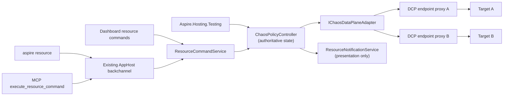

# Native Chaos hosting integration

**Status:** Proposed contribution-oriented incubation, August 2026.

This document proposes bringing the piloted `Aspire.Hosting.Chaos` experience into the Aspire ecosystem as a first-class hosting integration. It is not an Aspire roadmap or repository-ownership commitment. Product management has expressed enthusiastic support for the technical direction and for exploring CLI extensibility, while repository placement, architecture, and engineering ownership remain maintainer decisions.

## Decision summary

### Direction established by this proposal

- Model chaos topology statically in the AppHost and mutate policies dynamically at run time.
- Use one authoritative controller and policy state model for resource commands, the CLI, dashboard, MCP, and tests.
- Make the CLI a client of resource commands, not a second policy engine.
- Make both required mutation paths first-class:
  - `aspire resource chaos add-policy|remove-policy|list-policies`, where `chaos` is the single run-only control resource and each policy names its validated scope
  - typed test-scoped policy application and removal through `ApplyChaosPolicyAsync(...)`
- Keep the integration run-only. Chaos control resources and metadata must not appear in publish output; publish emits normal references or fails.
- Keep policy cleanup explicit. TTL is a safety net rather than the primary lifecycle.
- Treat `CustomResourceSnapshot` as presentation state only.
- Start with HTTP/1.1 and proven HTTP/2 request/response behavior. Explicitly defer generic TCP, AMQP, Cosmos direct/TCP, and streaming gRPC.

### Recommendation

Implement the native integration by extending the DCP proxy with a versioned fault-control contract, backed by a singleton controller provided by Aspire Hosting at run time. This is the direction Damian suggested in the original meeting: keep Aspire's transparent proxy topology and add fault behavior at that layer. Keep the controller contract engine-neutral so the policy model, CLI, dashboard, MCP, and testing experience are not coupled to DCP implementation details.

This proposal intentionally applies chaos to DCP. DCP does not support fault injection today: current support controls whether an endpoint is proxied and how its address is allocated. The native work therefore includes adding the live policy, acknowledgement, capability, and telemetry seam described below rather than routing around DCP with a second permanent proxy layer.

### Decisions still required

- Whether the contribution belongs directly in `microsoft/aspire` or should continue incubating in an Azure-owned repository before moving into the Aspire namespace.
- The DCP and Aspire Hosting ownership split for the new proxy fault-control contract.
- Whether an explicit YARP-compatible adapter is useful as a temporary conformance harness while the DCP contract is implemented.
- Which HTTP/2 behaviors pass the required correctness spikes.
- Whether and how consumer-facing HTTPS interception can establish trusted identity across hosts and containers.
- Whether a richer dashboard experience is warranted after resource commands and telemetry prove sufficient.

## Motivation and source context

The pilot targets a practical inner-loop gap: applications often behave differently across developer hosts, Linux containers, and shared authenticated environments. Local fault injection can expose retry, timeout, idempotency, and partial-failure bugs before a developer needs a scarce shared environment.

The Aspire discussion identified the existing service proxy as the right architectural direction, and subsequent product conversations supported exploring proxy-based fault handling and CLI extensibility. This remains **contribution-oriented incubation pending maintainer and engineering decisions**, not a shipping or repository-ownership commitment.

## Goals

1. Make fault behavior available on DCP-proxied endpoints without requiring AppHost setup.
2. Let developers add, remove, inspect, pause, and resume policies without restarting the AppHost.
3. Give tests a typed, scoped, acknowledgement-based lifecycle that is safe in fixtures and honest about parallel execution.
4. Route every mutation surface through one controller and one policy contract.
5. Preserve deterministic behavior under concurrent callers.
6. Keep local development safe through bounded policies, TTL expiry, explicit cleanup, sanitized diagnostics, and fail-closed scope validation.
7. Keep publish output deterministic and free of run-only chaos topology.
8. Make DCP the native data plane without coupling callers to DCP-specific wire types.

## Non-goals

- Moving Conductor, run-to-green workflow logic, or pilot-specific MCP glue into Aspire.
- Providing a production service mesh or production traffic-fault platform.
- Persisting runtime policies across AppHost restarts.
- Defining generalized Aspire CLI extension loading as part of this feature.
- Supporting arbitrary L4 protocols in the first increment.
- Building an extensible dashboard framework as a prerequisite.
- Replacing Azure Chaos Studio or other environment-level fault systems.
- Making application code depend on a Chaos client library.

## Current pilot

The pilot proves the end-to-end experience and provides useful invariants, but several implementation details are incubation workarounds rather than upstream architecture.

| Area | Pilot behavior | Native design treatment |
| --- | --- | --- |
| Resource | `ChaosProxyResource` is a thin `ContainerResource` with service discovery | Replace it with one inert `ChaosEnvironmentResource`; DCP carries traffic |
| Topology | One proxy per selected existing edge; topology is fixed for the run | Preserve static policy scope; decide DCP endpoint-versus-reference granularity in Phase 0 |
| Policies | Bootstrap and declared policies load at startup; runtime policies use HTTP CRUD | Do not port startup policy authoring; use the shared runtime controller for every policy |
| State | In-memory immutable-list reads and locked writes | Preserve in-memory state; replace install-order precedence |
| Cleanup | Explicit delete is primary; runtime TTL defaults to five minutes; expiry sweeps every 30 seconds | Preserve |
| Pause | Global pause is independent of policy mutation and survives clear | Preserve, with explicit resource/all scope |
| Telemetry | Fire counts and fired paths survive policy expiry for late assertions | Preserve as bounded, sanitized receipts |
| Scope | Mesh allowlists validate requested edges and fail closed | Derive valid scopes from the AppHost model and fail closed |
| Publish | Proxy resources are excluded from the manifest | Strengthen: also prove references bypass the proxies |
| Proxy image | Each edge builds its own image because of an Aspire 13.3.5 image-tag workaround | Do not port |
| Certificates | Development certificates and accept-any upstream TLS support emulator scenarios | Replace with a reviewed local trust/control-channel design |
| Integration glue | Conductor and run-to-green drive policies | Do not move initially |

Pilot evidence includes:

- `src/Aspire.Hosting.Chaos/ApplicationModel/ChaosProxyResource.cs`
- `src/Aspire.Hosting.Chaos/ChaosProxyResourceBuilderExtensions.cs`
- `src/Aspire.Hosting.Chaos/ChaosProxyMeshExtensions.cs`
- `src/Aspire.Hosting.Chaos/Mesh/ChaosMeshScope.cs`
- `src/Aspire.Hosting.Chaos/container/Program.cs`
- `src/Aspire.Hosting.Chaos/container/ChaosEndpoints.cs`
- `src/Aspire.Hosting.Chaos/container/Policy/ActivePolicyStore.cs`
- `src/Aspire.Hosting.Chaos/container/PolicyExpirationService.cs`
- `src/Aspire.Chaos.Client/ChaosProxyClient.cs`
- `src/Aspire.Chaos.Client/ChaosPolicy.cs`
- `docs/projects/aspire-chaos-proxy/aspire-chaos-proxy.plan.md`

These paths are relative to the piloted Chaos repository, not this repository.

## Relevant Aspire primitives

The proposal builds on current Aspire contracts rather than inventing parallel infrastructure.

### App model and endpoints

- Resources are inert model objects; lifecycle and behavior belong in annotations, services, and event handlers (`docs/specs/appmodel.md`).
- Stable endpoint annotations must exist during model construction, while allocated host values are resolved later (`src/Aspire.Hosting/ResourceBuilderExtensions.cs`).
- `YarpResource` is an existing explicit L7 proxy resource with route and cluster configuration, but it does not expose dynamic fault policy behavior (`src/Aspire.Hosting.Yarp/YarpResource.cs`).

### DCP proxy support

Current DCP proxy integration is allocation and on/off behavior:

- `ProxySupportAnnotation` contains only `ProxyEnabled` (`src/Aspire.Hosting/ApplicationModel/ProxySupportAnnotation.cs`).
- DCP service specs carry address, port, protocol, and allocation mode; `Proxyless` bypasses the proxy (`src/Aspire.Hosting/Dcp/Model/Service.cs`).
- `DcpExecutor` creates proxied or proxyless services and waits for effective addresses, but no current model carries fault rules or live policy revisions (`src/Aspire.Hosting/Dcp/DcpExecutor.cs`).

Adding faults to DCP is new product work across Hosting and DCP, not use of an existing extension point. That is the intended native integration in this proposal.

### Resource commands and clients

`WithCommand` binds a resource command to an AppHost callback with dependency injection, logging, cancellation, and validated arguments (`src/Aspire.Hosting/ResourceBuilderExtensions.cs` and `src/Aspire.Hosting/ApplicationModel/ResourceCommandService.cs`).

The dashboard, CLI, and MCP already dispatch those commands through the AppHost backchannel:

- `src/Aspire.Cli/Commands/ResourceCommand.cs`
- `src/Aspire.Cli/Commands/ResourceCommandHelper.cs`
- `src/Aspire.Hosting/Backchannel/AuxiliaryBackchannelRpcTarget.cs`
- `src/Aspire.Cli/Mcp/Tools/ExecuteResourceCommandTool.cs`
- `docs/specs/cli-backchannel.md`

Resource command results are currently a string tagged as text, JSON, or Markdown. Chaos commands that promise JSON must serialize exactly one valid JSON document and set the JSON format. A new chaos-specific backchannel method is not required.

### Testing and eventing

Current `Aspire.Hosting.Testing` construction and lifecycle surfaces include builder callbacks, `BuildAsync`, `StartAsync`, endpoint lookup, application services, and disposal (`src/Aspire.Hosting.Testing/DistributedApplicationTestingBuilder.cs` and `src/Aspire.Hosting.Testing/DistributedApplicationFactory.cs`).

The integration must not use obsolete `IDistributedApplicationLifecycleHook`. A long-lived controller should register through `IDistributedApplicationEventingSubscriber`, use `IDistributedApplicationEventing.Subscribe`, retain subscription tokens, and unsubscribe during controller disposal. Resource-specific cleanup should observe `ResourceStoppedEvent`.

### Presentation state

`CustomResourceSnapshot` and `ResourceNotificationService` describe dashboard state. They are not a policy database or data-plane contract (`src/Aspire.Hosting/ApplicationModel/CustomResourceSnapshot.cs` and `src/Aspire.Hosting/ApplicationModel/ResourceNotificationService.cs`).

## Proposed architecture



The architecture has four layers:

1. **App-model topology** declares which directed endpoint references are mediated.
2. **`ChaosPolicyController`** owns authoritative desired policy state, policy revisions, pause state, leases, expiry, and acknowledgement.
3. **`IChaosDataPlaneAdapter`** applies a canonical policy revision to one or more proxy instances.
4. **Data-plane proxies** match requests, inject faults, and emit bounded observations.

All callers use the controller. No caller writes directly to proxy state.

### Why the controller is authoritative

The pilot makes each proxy's in-memory store authoritative. That is adequate for one harness, but it becomes ambiguous when CLI, dashboard, MCP, fixtures, and background expiry can mutate concurrently.

The native controller should own:

- canonical active policies keyed by policy ID;
- the policy owner or lease ID;
- monotonically increasing desired revisions;
- per-proxy acknowledged revisions;
- resource-level and global pause state;
- expiry scheduling;
- bounded, sanitized fire receipts returned by the data plane;
- active and queued mutation state for command enablement.

The proxy retains only the last acknowledged data-plane snapshot, absolute policy expiry times, controller-liveness state, and bounded observations. It independently stops activating an expired policy even when the controller cannot acknowledge removal. If controller liveness is lost beyond a bounded grace period, the proxy fails safe to pass-through while retaining the last revision for diagnostics. A controller restart intentionally clears runtime policy state; a proxy restart is reconciled from the still-running controller.

`CustomResourceSnapshot` may display `policyCount`, `paused`, `desiredRevision`, `acknowledgedRevision`, and last-operation status. Those values are projections of controller state.

### Controller concurrency

Use a single-reader mutation queue for state that spans policy registration and proxy acknowledgement. Read-only operations may use immutable snapshots and must remain available while a mutation is active.

Each mutation:

1. Validates and canonicalizes the complete request.
2. Detects policy ID and composition conflicts.
3. Registers the accepted operation before enqueueing.
4. Produces a new immutable desired snapshot and revision.
5. Prepares that inactive revision on all affected proxies.
6. Waits for prepare acknowledgements within a bounded deadline.
7. Commits the prepared revision and waits until all affected proxies report it active.
8. Commits the new authoritative state and updates presentation.
9. Completes the caller with success, cancellation, or a structured failure.

Prepare, commit, and rollback are idempotent by revision. If prepare fails, no proxy activates the revision. If commit partially succeeds, the controller rolls acknowledged proxies back to the prior committed revision and continuously reconciles every affected proxy to that revision. The chaos resources remain unready until convergence. A known-unready proxy causes apply to fail before enqueueing, one unresponsive proxy must not stall the queue indefinitely, and the controller must not return success when only queue acceptance occurred.

## Resource and topology model

### Implicit control resource and model-derived scopes

Aspire Hosting automatically adds one run-only `ChaosEnvironmentResource`, named `chaos`, whenever the selected DCP version advertises the fault-control capability. This is a synthetic command and aggregate-status resource; it does not carry traffic or add another network hop. Traffic continues through DCP proxies.

The feature requires no `AddChaos`, special reference API, or per-endpoint setting. Every DCP-proxied endpoint is behaviorally pass-through until a policy is applied. The automatically added resource has:

- the stable `chaos` resource name;
- the target endpoints present in the AppHost model and, where DCP supports it, distinguishable directed references;
- DCP capability and acknowledged-revision state by policy scope;
- resource commands attached by Aspire Hosting.

The policy carries its scope. The controller resolves that scope against the current AppHost model and rejects unknown resources, endpoints, proxyless endpoints, and directed references that DCP cannot distinguish. A CLI payload cannot redirect faults to an arbitrary host because raw destination addresses are not valid policy scopes.

There is no Chaos API in AppHost code. The `ChaosEnvironmentResource` appears automatically in the dashboard and CLI, while DCP services remain the traffic endpoints. Standard resource declarations, references, and service-discovery values do not change.

The product default is available in Run mode with zero active policies. A host-level configuration opt-out should exist for organizations that prohibit local fault injection or need to disable the control surface. The exact setting belongs in the DCP/Hosting contract review; normal applications should not need to set it. Publish and Deploy never enable the capability.

HTTPS/TLS scopes remain unavailable until DCP can preserve target identity and trust while injecting the requested effect. Applying a policy to an unsupported scope fails explicitly; model construction itself does not fail merely because the application has an HTTPS endpoint.

### Stable startup topology

DCP proxy endpoints are created and allocated at startup whether or not any policies are active. An empty policy set is pass-through. Adding and removing policies never rewrites service-discovery endpoints or restarts workloads.

This preserves the pilot's core inner-loop property: topology is static, policy is dynamic.

## DCP proxy extension

The original meeting discussed plugging faults into Aspire's existing proxy layer. Brent's August 4 proposal likewise described extending that layer. Current source, however, shows no DCP fault-extension seam.

### Recommended native path: add a DCP proxy fault-control contract

This option deliberately extends DCP and Aspire Hosting with:

- a versioned fault policy schema or engine-neutral desired-state reference;
- live policy update and acknowledgement operations;
- per-endpoint fault capability discovery;
- compatibility negotiation between Hosting and DCP;
- protocol-aware proxy behavior;
- observable revision and failure state.

**Benefits**

- Existing endpoint references remain transparent.
- No additional proxy resource or network hop is visible to the user.
- Stable DCP-allocated endpoints already exist.
- A future implementation could support protocols below HTTP when DCP has a suitable engine.

**Consequences**

- This is a cross-repository DCP feature, not an integration-only change.
- Current DCP proxy metadata is port/protocol oriented and does not model HTTP matching or effects.
- Proxyless endpoints cannot participate.
- A DCP proxy is currently associated with a target endpoint, not a directed consumer-to-target edge. Phase 0 must either add per-reference proxy identity or narrow initial policy scope to the whole target endpoint; it must not claim edge isolation that the data plane cannot observe.
- Schema compatibility, DCP version skew, update acknowledgement, and engine security become platform contracts.
- Waiting for this contract delays validation of the desired CLI and testing experience.

### Incubation fallback: explicit run-only L7 proxy resource and controller

This option creates a normal run-only resource that forwards to the original target and receives canonical revisions from the AppHost controller.

**Benefits**

- It is implementable with current Aspire hosting primitives.
- The proxy, controller, and policy matcher can be independently tested and versioned.
- Resource commands naturally expose control to the dashboard, CLI, and MCP.
- HTTP semantics are explicit rather than inferred from an L4 contract.

**Consequences**

- Each mediated edge adds a process or container and a network hop.
- Reference rewriting and publish bypass must be correct.
- The integration owns health, certificates, management authentication, and controller/proxy reconciliation.
- YARP is an HTTP data plane; it does not make generic TCP or AMQP support available.

### Recommended staged path

Design and review the DCP contract first. Use the pilot's YARP-compatible engine as a conformance harness for policy semantics only if DCP implementation sequencing would otherwise block that validation. Do not make the explicit proxy the committed native topology merely because it is implementable with today's public Aspire primitives.

This directly follows Damian's suggestion and Brent's later framing to Maddy: extend Aspire's existing proxy layer, then expose policy handling through the CLI and testing APIs. It also states the actual engineering cost rather than implying the DCP seam already exists.

`IChaosDataPlaneAdapter` keeps the controller insulated from the DCP wire contract and allows the conformance harness to run the same tests. CLI commands, test leases, policy IDs, composition, TTL, telemetry, and dashboard projections remain unchanged.

## Policy schema

Use a versioned, engine-neutral schema. The following is **proposed pseudocode**:

```csharp
var policy = new ChaosPolicy
{
    SchemaVersion = "v1alpha1",
    Id = "inventory-timeout",
    Priority = 100,
    Scope = ChaosPolicyScope.ForReference(
        sourceResource: "orders",
        targetResource: "inventory",
        endpointName: "http"),
    Match = new HttpChaosMatch
    {
        Methods = ["GET"],
        Path = "/api/inventory/*",
        IsolationScope = testScope
    },
    Effects =
    [
        ChaosEffect.Delay(TimeSpan.FromSeconds(2)),
        ChaosEffect.Abort()
    ],
    Probability = 1.0,
    Seed = 42,
    TimeToLive = TimeSpan.FromMinutes(2)
};
```

The canonical schema should include:

| Field | Contract |
| --- | --- |
| `schemaVersion` | Required for wire payloads |
| `id` | Stable caller-supplied ID or controller-generated ID |
| `priority` | Required signed integer with no implicit default; higher values win |
| `scope` | Required structured target endpoint or directed reference; resolved against the current AppHost model |
| `match` | Protocol-specific, fail-closed selector |
| `effects` | Ordered effects within one policy |
| `probability` | Bounded from 0 through 1 |
| `seed` | Optional deterministic random seed |
| `maxActivationsPerEpoch` | Optional bounded fire count within one controller-assigned policy activation epoch |
| `ttl` | Required/defaulted for runtime mutation; resolved to an expiry time |
| `metadata` | Bounded labels for diagnostics; never executable behavior |

The policy identifies its scope using Aspire resource and endpoint identities, never a raw destination URI. The controller rejects scopes absent from the AppHost model or unsupported by the negotiated DCP capability.

### Composition and precedence

Do not preserve first-installed-wins. Installation order depends on racing callers and is unsuitable for parallel tests.

The recommended model is:

1. Filter to active, unexpired policies for the edge.
2. Filter by the request matcher and optional isolation scope.
3. Select the highest explicit `priority`.
4. If exactly one policy has that priority, apply its effects in declared order.
5. If multiple matching policies have the same highest priority, inject no fault, record a conflict, and surface the conflict through telemetry and controller state.

The controller should conservatively reject equal-priority policies whose declared conflict domains overlap. Runtime conflict handling remains necessary because complex matchers may overlap in ways static validation cannot prove. Requiring priority makes the conflict policy visible in every authored document instead of assigning unrelated callers the same hidden default.

This is deterministic, independent of installation timing, and safe by default. Callers that intentionally layer behavior should put the effects in one policy. Distinct policies can use distinct priorities, but relying on priority to combine unrelated test policies is discouraged.

The controller assigns an opaque activation epoch when a policy ID is first applied. Data-plane counters and seeded random sequences are keyed by policy ID plus activation epoch and carry across unrelated revision commits. Explicit counter reset, removal followed by a new apply, or proxy restart creates a new activation epoch.

### Fail-closed matching

- Unknown fields, unsupported matcher kinds, invalid regular expressions, and unresolved edge scopes reject the policy.
- An empty selector means match all traffic on the named edge only; it never broadens to other edges.
- A missing requested mesh edge fails model validation.
- Unsupported protocol features reject application rather than silently degrading to a broader HTTP rule.
- Management paths are never eligible for fault injection.

## Policy lifecycle

### Apply

Applying a policy is complete only when:

1. the controller accepts and canonicalizes it;
2. a new desired revision is created;
3. every affected proxy acknowledges that revision; and
4. the controller commits the revision.

Applying the same policy ID with identical canonical content and the same owner is idempotent. Reusing an ID with different content or a different owner fails with a conflict.

### Remove

Removal is by policy ID. It produces and awaits a new acknowledged revision. Bulk clear may exist as an administrative command, but test cleanup must never use it.

Removing an already absent or expired policy is idempotent success when the caller owns that ID or lease.

### Pause and resume

Pause is state independent of policy mutation:

- pausing stops fault activation while preserving policies, TTLs, counters, and receipts;
- resuming re-enables eligible policies;
- clearing policies does not implicitly resume;
- pause may target one chaos resource or all chaos resources;
- repeated pause and resume operations are idempotent.

Pause is useful for diagnosis and recovery, but tests should prefer lease disposal so cleanup remains scoped.

### TTL

- Runtime policies applied by CLI, MCP, dashboard, or tests default to a bounded TTL, initially five minutes.
- Callers may request a shorter TTL and may extend within a configured maximum.
- The committed revision carries an absolute expiry time. Each proxy independently stops activating the policy at that time.
- The controller also reconciles expiry by removing only the expired policy ID and awaiting proxy acknowledgement.
- Explicit removal remains the primary cleanup path.

### Restart

| Restart | Behavior |
| --- | --- |
| Proxy restarts while AppHost remains alive | Stable proxy endpoint remains allocated. Controller marks the proxy not ready, reapplies the current committed revision, and restores readiness after acknowledgement. Policy activation epochs, counters, `maxActivationsPerEpoch` budgets, and deterministic random sequences restart; receipts include the activation epoch. Exact activation-budget tests must treat proxy restart as an invalidating event. A stronger cross-restart budget is not claimed. |
| AppHost restarts | Runtime policies and pause state are intentionally lost. Proxies start pass-through with an empty revision. Callers may replay a retained policy or campaign receipt explicitly. |
| Controller shuts down | It attempts bounded explicit removal and proxy pause. Proxy-enforced absolute TTL and controller-liveness pass-through remain independent fallbacks if shutdown is interrupted. |
| Workload restarts | Static proxy endpoint and active policy revision remain unchanged. |

No policy persistence store is proposed for the initial integration.

## Random chaos campaigns

Aspire should provide a bounded, reproducible campaign primitive. An agent may choose and launch a campaign through the CLI, but it should not implement randomness by repeatedly calling `add-policy` and `remove-policy` in its own loop.

Keeping campaign execution in Aspire provides:

- one owner for TTL, cancellation, cleanup, pause, and controller-liveness safety;
- deterministic replay from a recorded seed and canonical campaign plan;
- validation against model-derived scopes and supported effects;
- atomic limits on duration, concurrent policies, activation count, and fault rate;
- dashboard visibility and a single receipt describing what was selected and when;
- consistent behavior whether the caller is a human, agent, dashboard, MCP client, or test.

The campaign definition is declarative and bounded:

```json
{
  "schemaVersion": "v1alpha1",
  "id": "checkout-shakeout",
  "seed": 72491,
  "duration": "00:05:00",
  "selectionInterval": "00:00:20",
  "maxConcurrentPolicies": 1,
  "maxActivations": 25,
  "scopes": [
    {
      "sourceResource": "orders",
      "targetResource": "inventory",
      "endpointName": "http"
    }
  ],
  "effectCatalog": [
    {
      "kind": "delay",
      "minMilliseconds": 100,
      "maxMilliseconds": 1500,
      "weight": 4
    },
    {
      "kind": "abort",
      "weight": 1
    }
  ]
}
```

The controller validates the complete campaign, expands the seed into a deterministic selection schedule, and records that schedule before activation. Only model-resolved scopes and supported, bounded effect templates participate. Unknown effects, an empty scope set, unbounded duration, or limits above configured maxima reject the campaign.

At each interval the controller installs or removes ordinary policies through the same revision and acknowledgement protocol. Campaign-generated policies are not a second policy type and do not bypass precedence or conflict rules. Stopping or disposing a campaign removes only policies owned by that campaign and awaits acknowledgement. Campaign TTL is enforced by both the controller and DCP data plane.

Proposed commands:

```console
aspire resource chaos start-campaign --campaign-json @checkout-shakeout.json
aspire resource chaos campaign-status --campaign-id checkout-shakeout
aspire resource chaos stop-campaign --campaign-id checkout-shakeout
aspire resource chaos replay-campaign --receipt ./checkout-shakeout.receipt.json
```

The existing resource-command path may require generic file-input support before the `@file` syntax is available. Inline JSON remains the compatibility path.

An agent's role is orchestration: select a goal, ask Aspire to preview the canonical plan, start it, observe telemetry, stop it early when appropriate, and use the recorded seed or receipt to replay a finding. Aspire owns random selection and enforcement so an agent crash cannot strand faults or make the run irreproducible.

Tests may use the same lifecycle through a proposed `StartChaosCampaignAsync(...) -> ChaosCampaignLease : IAsyncDisposable`. Random campaigns should not be the default for correctness tests; fixed seeds and retained receipts are required when a campaign failure must be reproducible.

## CLI UX

The immediate CLI uses existing resource commands. The following command lines and flags are **proposed syntax**; command argument projection must follow the final resource-command conventions.

```console
aspire resource chaos add-policy --policy-json '{"schemaVersion":"v1alpha1","id":"inventory-timeout","priority":100,"scope":{"sourceResource":"orders","targetResource":"inventory","endpointName":"http"},"match":{"methods":["GET"],"path":"/api/inventory/*"},"effects":[{"kind":"delay","milliseconds":2000}],"ttl":"00:02:00"}'
aspire resource chaos remove-policy --policy-id inventory-timeout
aspire resource chaos list-policies --target-resource inventory --endpoint http
aspire resource chaos pause --target-resource inventory --endpoint http
aspire resource chaos resume --target-resource inventory --endpoint http
aspire resource chaos start-campaign --campaign-json '{"schemaVersion":"v1alpha1","id":"checkout-shakeout","seed":72491,"duration":"00:05:00","selectionInterval":"00:00:20","maxConcurrentPolicies":1,"maxActivations":25,"scopes":[{"sourceResource":"orders","targetResource":"inventory","endpointName":"http"}],"effectCatalog":[{"kind":"delay","minMilliseconds":100,"maxMilliseconds":1500,"weight":4},{"kind":"abort","weight":1}]}'
aspire resource chaos stop-campaign --campaign-id checkout-shakeout
```

`chaos` is the automatically added singleton `ChaosEnvironmentResource`. Policy and filter arguments identify a model-resolved DCP scope; the CLI resource name is not part of that scope.

Mutations go through `ResourceCommandService` to `ChaosPolicyController`. The CLI does not call the proxy management endpoint and does not parse or own policy semantics.

The immediate resource-command path accepts an inline policy document. A future generic resource-command file-input capability may let the CLI read a local file and send its contents, but the AppHost must not interpret a path relative to its own working directory.

Commands return one structured JSON document. Illustrative `add-policy` output:

```json
{
  "resource": "chaos",
  "policyId": "inventory-timeout",
  "scope": {
    "sourceResource": "orders",
    "targetResource": "inventory",
    "endpointName": "http"
  },
  "revision": 12,
  "expiresAt": "2026-08-06T05:03:00Z",
  "acknowledgedProxies": 1,
  "status": "applied"
}
```

Illustrative `list-policies` output:

```json
{
  "resource": "chaos",
  "paused": false,
  "revision": 12,
  "policies": [
    {
      "id": "inventory-timeout",
      "priority": 100,
      "expiresAt": "2026-08-06T05:03:00Z",
      "fireCount": 3
    }
  ]
}
```

Read-only `list-policies` remains available during mutations. Failures use nonzero command status and structured diagnostics; they are not success-shaped JSON with an embedded error.

A future `aspire chaos ...` command may provide shorter syntax over the same resource-command and controller contract. That is a separate generalized CLI-extensibility decision. Loading a custom CLI extension must never be required for policy correctness or test execution.

## Aspire.Hosting.Testing UX

Tests need a typed lifecycle rather than shelling out to the CLI.

The recommended API is:

```csharp
// Proposed pseudocode. These APIs do not exist.
await using ChaosPolicyLease lease =
    await app.ApplyChaosPolicyAsync(
        policy,
        cancellationToken);
```

`ApplyChaosPolicyAsync(...)` returns `ChaosPolicyLease : IAsyncDisposable`.

The lease contract is:

- `PolicyId`, canonical scope, canonical policy, and expiry are inspectable.
- Creation completes only after the apply revision is acknowledged.
- `DisposeAsync` removes only the lease's policy ID.
- `DisposeAsync` waits for removal acknowledgement within a bounded cleanup deadline.
- Disposal is idempotent and succeeds if TTL already removed the policy.
- Disposal never calls clear-all.
- A lease cannot remove a policy owned by another lease.
- Late assertion APIs read bounded receipts retained after policy expiry or removal.

If the cleanup deadline expires, `DisposeAsync` throws a typed cleanup exception and reports that proxy-enforced absolute TTL and controller-liveness pass-through are now the remaining safety nets. Cleanup failure must not be silently converted into success. Test infrastructure should preserve both the test failure and cleanup failure when its assertion framework supports aggregated exceptions.

Illustrative test:

```csharp
// Proposed pseudocode. These APIs do not exist.
await using var app = await testingBuilder.BuildAsync();
await app.StartAsync();

using var client = app.CreateHttpClient("orders");
var scope = ChaosTestScope.Create();
scope.ApplyToCurrentDistributedContext();

await using var lease = await app.ApplyChaosPolicyAsync(
    new ChaosPolicy
    {
        Id = $"inventory-timeout-{scope.Id}",
        Priority = 100,
        Scope = ChaosPolicyScope.ForReference("orders", "inventory", "http"),
        Match = HttpChaosMatch.Get("/api/inventory/*", scope),
        Effects = [ChaosEffect.Delay(TimeSpan.FromSeconds(2))],
        TimeToLive = TimeSpan.FromMinutes(2)
    },
    cancellationToken);

var response = await client.GetAsync("/checkout", cancellationToken);

var receipt = await lease.WaitForActivationAsync(
    timeout: TimeSpan.FromSeconds(10),
    cancellationToken);
Assert.Equal("/api/inventory/42", receipt.SanitizedPath);
```

Assertions happen after application traffic completes. The proxy records what fired; it does not execute test assertions inline.

### Fixture use

A fixture may own the `DistributedApplication`, but each test should own and dispose its leases:

```csharp
// Proposed pseudocode. These APIs do not exist.
public Task<ChaosPolicyLease> ApplyPolicyAsync(
    ChaosPolicy policy,
    CancellationToken cancellationToken) =>
    App.ApplyChaosPolicyAsync(
        policy,
        cancellationToken);
```

Fixture teardown disposes the application and provides a final cleanup boundary. It is not a substitute for per-test lease disposal.

### Parallel-test isolation

Parallel tests sharing an AppHost and edge are safe only when their traffic is distinguishable.

The recommended HTTP mechanism is a generated isolation scope carried in a reserved W3C baggage entry:

- `ChaosTestScope.Create()` creates a cryptographically random opaque value.
- The policy matcher includes that exact scope.
- The test adds the reserved baggage entry to the current distributed context.
- Instrumented inbound and outbound HTTP propagation carries the baggage across intermediate services to the faulted edge.
- Every chaos proxy preserves the baggage so the same scoped test can target later mediated edges in the call graph.
- The scope value is never included in snapshots, logs, spans, or receipts.

The scope is opaque local test metadata, not a credential, and may be visible to instrumented workloads as standard baggage. Policies with different isolation scopes are disjoint even on the same path. This guarantee requires propagation to cross every hop before the faulted edge. Workloads without compatible distributed-context propagation need an application-side client handler, separate AppHost instances, or serialized access to the shared edge. The API must not imply isolation that the traffic cannot provide.

## Dashboard visualization and MCP

The dashboard must make active fault injection obvious. A developer should not need to inspect logs or remember that a test installed a policy to understand why requests are delayed or failing.

### Initial experience using existing dashboard surfaces

The Resources page shows one run-only `chaos` resource. Its state and properties are projections from `ChaosPolicyController`, never the authoritative policy store.

| Dashboard state | Meaning |
| --- | --- |
| `Running` | DCP capabilities are available, revisions are acknowledged, and no policy is paused or conflicted |
| `Active` | At least one unexpired policy is enabled |
| `Paused` | Policies remain installed but fault activation is paused |
| `Reconciling` | Desired and acknowledged revisions differ |
| `Degraded` | A proxy rejected a revision, a scope is unavailable, or rollback has not converged |

The resource properties show:

- active policy count and nearest expiry;
- active campaign, seed, elapsed time, and remaining safety budgets;
- affected target endpoints and directed references when DCP can distinguish them;
- desired and acknowledged revision;
- paused scope, if any;
- bounded activation, conflict, and expiry counts;
- last successful reconciliation and last structured error.

The `chaos` resource exposes dashboard command buttons for add, remove, list, pause, and resume. `list-policies` renders a sanitized table with policy ID, scope, effect summary, priority, expiry, state, and activation count. Add and remove operations use the same validation, confirmation, progress, and acknowledgement path as the CLI. The dashboard never calls a DCP management endpoint directly.

Selected target resources should also display a derived `Chaos policies` property and a relationship to the `chaos` resource. This is a navigation and awareness aid only. Target resource state must not become unhealthy merely because a policy intentionally injects failures.

Existing telemetry pages provide request-level visualization:

- **Structured logs** record policy lifecycle and reconciliation without policy bodies or isolation values.
- **Traces** mark an activated fault on the affected request span or a linked internal span, with policy ID, effect kind, canonical scope, and activation index.
- **Metrics** show activations, expiry, conflicts, apply latency, and revision lag.

This initial experience does not require a custom dashboard extension. It uses the existing resource, command, log, trace, and metric surfaces while still making chaos visible at both the environment and affected-resource levels.

### Rich policy view

The original meeting raised a custom dashboard tab as an exploratory direction. After the resource-based experience is validated, a richer view may add:

- a filterable policy table grouped by target resource and endpoint;
- campaign plan, current selection, seed, budget consumption, stop, and replay controls;
- a topology overlay highlighting scopes with active policies;
- remaining TTL and live activation counts;
- conflict and reconciliation diagnostics;
- policy authoring and removal using the same controller commands;
- links from a policy to matching traces and retained activation receipts.

This view must consume controller projections and resource commands rather than introduce another policy store or dashboard-only control plane. It should be proposed with Aspire's general dashboard extensibility work, not implemented as a private Chaos extension mechanism.

### MCP

MCP uses the existing `execute_resource_command` tool against the same commands. MCP is not a privileged direct proxy client and does not receive an independent policy store. If MCP needs richer typed JSON handling, that should improve generic resource-command result propagation rather than add a Chaos-only backchannel.

## Observability

### Resource state

Publish presentation updates only after controller state transitions. Suggested non-sensitive properties:

- policy count;
- paused state;
- desired and acknowledged revision;
- last successful reconciliation time;
- active operation name and status;
- bounded conflict and expiry counts.

### Metrics and traces

Suggested telemetry:

| Signal | Purpose |
| --- | --- |
| `aspire.chaos.policy.apply` | Apply duration and result |
| `aspire.chaos.policy.remove` | Removal duration and result |
| `aspire.chaos.policy.expired` | TTL cleanup |
| `aspire.chaos.policy.conflict` | Ambiguous precedence or ownership conflict |
| `aspire.chaos.fault.activated` | Count by policy ID, edge, and effect kind |
| `aspire.chaos.proxy.revision_lag` | Desired minus acknowledged revision |

Fault spans should link to the proxied request span where possible and include policy ID, edge resource, effect kind, and deterministic activation index. Do not capture authorization headers, cookies, bodies, isolation scope values, connection strings, or unbounded URLs.

### Late assertion receipts

Retain a bounded ring of sanitized activation receipts per policy after expiry or removal. A receipt may include:

- policy ID;
- edge resource;
- activation time;
- method;
- normalized or sanitized path;
- effect kind;
- activation index;
- activation epoch;
- trace ID when safe.

Retention is bounded by count and time. Receipts are diagnostic observations, not authoritative policy state.

## Security

- The management endpoint is internal, excluded from service discovery, and inaccessible through the public proxy route.
- Controller-to-proxy calls use a per-run credential generated and passed as a secret. The credential is never a command argument or snapshot property.
- Resource commands execute inside the AppHost and authorize mutations through existing backchannel access.
- Policy documents have strict size, count, TTL, probability, delay, body-buffer, and response-size limits.
- Policies cannot specify arbitrary upstream destinations.
- Matchers reject unsupported or malformed scope rather than broadening.
- Management paths bypass policy matching.
- Request and response bodies are not captured by default.
- Header match and mutation APIs block sensitive headers unless a separately reviewed scenario requires them.
- The reserved Chaos baggage member is preserved through mediated workload hops but excluded from all Chaos diagnostics.
- Proxies enforce absolute policy expiry and fail safe to pass-through after bounded controller-liveness loss.
- Snapshot, command, log, trace, and receipt serializers use explicit allowlists.
- Local TLS behavior must be explicit. The pilot's accept-any certificate behavior cannot be copied as a general default without a constrained emulator-only contract.

This is a development integration, but "development only" is not an exemption from control-plane authentication or secret hygiene.

## Health and readiness

Expose separate checks:

| Check | Ready when |
| --- | --- |
| Process liveness | Proxy process is responsive |
| Data-plane readiness | Listener is bound and routing configuration is valid |
| Control-plane readiness | Controller authentication succeeds and committed revision is acknowledged |
| Upstream observation | Original target endpoint is resolvable; this does not mutate target state |

The proxy should wait for the target to start, not necessarily become healthy, to avoid introducing readiness cycles. A consuming resource that requires mediated traffic should wait for the chaos resource's readiness.

An empty policy set is healthy pass-through. Revision drift makes the chaos resource unready. Presentation command state should indicate that new applies are unavailable, but it is only a UI hint: the controller independently rejects new applies. Remove, pause, list, and clear remain available for recovery. Health checks must remain observational.

## Run, publish, and deploy behavior

Chaos is run-only.

### Run

- Materialize the singleton chaos control resource.
- Keep the existing DCP-proxied endpoint under the target's service name.
- Start the controller with an empty pass-through revision.
- Keep the DCP proxy pass-through when no policy is active.

### Publish

- Do not materialize chaos control resources or fault metadata in deployable output.
- Emit the normal target references deterministically.
- Do not serialize policy state, pause state, controller revisions, local endpoints, credentials, or observations.
- Validate that no published reference carries chaos metadata.
- Fail publish with an actionable error if the normal reference cannot be proven.

Calling only `.ExcludeFromManifest()` is insufficient because DCP fault metadata could still leak into publish processing. The preferred implementation treats chaos as run-only metadata on an otherwise normal structured endpoint reference.

### Deploy

Deploy consumes the direct, chaos-free publish model. The initial integration has no deployment target behavior.

## Protocol scope

### Initial scope

- HTTP/1.1 request/response proxying over HTTP.
- HTTP/2 request/response proxying over h2c only for behaviors that pass conformance tests in the chosen engine.
- HTTP matching by method, normalized path, selected non-sensitive headers, and test isolation scope.
- Bounded delay, synthetic status/error, connection abort where semantically valid, selected header mutation, and deterministic probability/count gates.

HTTP/2 support must verify stream multiplexing, cancellation propagation, header handling, flow control, and connection reuse. A passing HTTP/1.1 test is not evidence that an effect is correct for HTTP/2.

HTTPS interception is deferred until a proof spike defines a cross-platform certificate identity and trust flow for host processes and containers. Phase 1 requires HTTP or h2c on both proxy legs and does not mint an untrusted TLS identity for the consumer-facing mediated endpoint.

### Explicitly deferred

- Generic TCP faults.
- AMQP and broker-protocol faults.
- Cosmos DB direct/TCP mode and gateway HTTPS.
- Streaming gRPC and long-lived bidirectional HTTP/2 streams.
- WebSockets and server-sent events.
- Consumer-to-proxy HTTPS interception.
- Arbitrary request/response body corruption.
- Production traffic.

Unary gRPC also remains unsupported until trailer, status, deadline, cancellation, and retry behavior are proven. The proxy must report unsupported surfaces explicitly rather than silently treating them as generic HTTP.

## Packaging and versioning

If maintainers approve direct inclusion:

- Use a focused preview package named `Aspire.Hosting.Chaos`.
- Keep resource modeling, controller contracts, and the test lease API together unless dependency analysis requires a small `Aspire.Hosting.Chaos.Testing` companion.
- Keep the proxy runtime implementation internal to the feature's supported distribution model.
- Version the canonical policy schema independently from the package assembly.
- Mark unstable public APIs experimental.
- Add the package to `aspire add` only when the minimum run, publish, and protocol tests pass.
- Keep the runtime policy and campaign wire contracts language-neutral; typed test helpers may remain C#-only initially.

If incubation remains outside `microsoft/aspire`, use the same contract boundaries and avoid dependencies on internal Aspire implementation types that would block later contribution.

### Migration from the pilot

- Preserve source-compatible names where they fit the final design, but do not retain preview APIs solely for compatibility.
- Translate any existing pilot startup policy into an explicit CLI, dashboard, MCP, or testing-client operation. Do not migrate startup authoring into AppHost code.
- Replace direct `ChaosProxyClient` usage with controller commands or `ApplyChaosPolicyAsync`.
- Remove internal-feed, per-edge Docker build, generated-certificate, and Aspire-version workaround code.
- Do not move Conductor, run-to-green, or custom MCP orchestration.
- Document unsupported pilot transforms individually if they are not in the first native protocol scope.

## Alternatives considered

### Avoid DCP changes

Building only an explicit proxy is implementable in the hosting integration, but it bypasses the native proxy layer Damian identified and leaves Aspire with two local proxy topologies. Rejected as the product destination.

### Use the explicit proxy permanently

This is viable for HTTP as an incubation or conformance engine. It adds visible resources and hops and bypasses Aspire's native proxy topology, so it is not the recommended product destination.

### Host YARP in the AppHost process

An in-process data plane avoids image acquisition and a separate management credential, but it mixes traffic handling with AppHost control-plane availability and gives each edge a custom lifecycle outside normal DCP process/container management. Keep it as a Phase 0 comparison, not the default.

### Use Toxiproxy

Toxiproxy is appropriate for several TCP-level fault classes and remains a good explicit integration alternative. It does not provide the desired HTTP matcher, resource-command, typed lease, or Aspire topology experience by itself.

### Application middleware

Application middleware avoids a proxy process but requires modifying each application, cannot cover arbitrary dependencies, and conflates test instrumentation with workload code. Rejected.

### Preserve first-installed-wins

This matches the pilot and is simple, but concurrent callers make install order nondeterministic. Rejected in favor of explicit priority with fail-closed equal-priority conflicts.

### Require a custom CLI extension

This could provide polished syntax early, but it would make correctness depend on extension loading and duplicate the resource-command path. Rejected. A future alias may be added over the same control plane.

## Phased delivery

### Phase 0: proof spikes and maintainer decisions

- Decide repository placement and engineering owner.
- Review a versioned DCP policy, acknowledgement, capability, and telemetry contract with DCP owners.
- Prove standard `WithReference` behavior and service-discovery values are unchanged when the DCP fault capability is present but inactive.
- Prove the control resource and DCP fault capability exist only in Run mode and the host-level opt-out removes them.
- Decide and prove DCP policy granularity: a whole target endpoint or a distinguishable directed reference.
- Prove authenticated controller-to-proxy revision application and restart reconciliation.
- Run HTTP/1.1 and HTTP/2 conformance tests for the initial effects.
- Validate test isolation through a propagated W3C baggage member across at least two mediated edges and an intermediate service.
- Measure DCP pass-through and enabled-fault overhead.
- Use the explicit YARP-compatible engine only as a conformance harness if the DCP implementation is not yet available.
- Review the policy and campaign schemas with CLI, dashboard, MCP, and testing consumers.
- Validate the DCP contract against the engine-neutral adapter boundary.

### Phase 1: minimal native loop

- Automatically added singleton chaos control resource with model-derived DCP policy scopes.
- Singleton controller and engine-neutral revision contract.
- DCP adapter implementing prepare, commit, rollback, capability discovery, and observations.
- Add, remove, list, pause, and resume resource commands with JSON results.
- `ApplyChaosPolicyAsync` and `ChaosPolicyLease`.
- TTL expiry, explicit cleanup, restart reconciliation, and bounded receipts.
- HTTP/1.1 plus only the HTTP/2 behaviors that passed Phase 0.
- Publish bypass validation.

### Phase 2: campaigns and diagnostics

- Bounded random campaigns with preview, stop, deterministic replay, receipts, and test leases.
- Preview/canonicalize and match-diagnostics commands.
- Fire-once and counter-reset operations.
- Scope discovery, filtering, and presets over model-derived DCP endpoints.
- Richer resource properties and telemetry.

### Phase 3: broader platform integration

- Evaluate additional DCP proxy engines and protocol coverage using Phase 1 and 2 evidence.
- Compare transparency, compatibility, and security across supported protocols.
- Consider a richer dashboard view and `aspire chaos` alias independently.

## Open questions and proof spikes

| Question | Recommended default | Evidence required |
| --- | --- | --- |
| Repository placement | Continue contribution review without assuming ownership | Jose, Aspire maintainers, and owning engineering team decision |
| First data plane | DCP proxy extension | Reviewed DCP schema/control proposal and Phase 0 conformance results |
| Conformance fallback | Explicit YARP-compatible adapter, not product topology | Evidence that DCP sequencing blocks policy validation |
| Activation model | Available by default on DCP-proxied endpoints in Run mode; host-level opt-out | Compatibility, security, inactive-overhead, and run/publish proofs |
| HTTP/2 scope | Ship only proven effects | Multiplexing, cancellation, flow-control, and trailer conformance |
| Unary gRPC | Defer by default | Status/trailer/deadline/retry test matrix |
| Policy overlap | Explicit priority; equal-priority conflict fails closed | Parallel apply and runtime overlap tests |
| Random campaigns | Aspire owns bounded seeded execution; agents orchestrate through commands | Crash cleanup, deterministic replay, budget enforcement, and receipt conformance |
| Test isolation | Reserved W3C baggage member preserved across workload hops and scrubbed from diagnostics | End-to-end proof across two mediated edges and an intermediate service over HTTP/1.1 and HTTP/2 |
| Runtime persistence | None | Revisit only if restart use cases outweigh stale-fault risk |
| Dashboard extension | Standard resource commands first | User evidence that commands and telemetry are insufficient |
| Proxy granularity | One DCP proxy per target endpoint; do not promise directed-edge isolation until DCP can distinguish references | DCP routing design and a two-consumer isolation proof |
| Proxy execution model | Existing DCP proxy topology | DCP ownership, deployment, restart, and compatibility review |
| TLS behavior | Phase 1 consumer edge is HTTP/h2c; HTTPS interception remains deferred | Cross-platform certificate identity and trust proof for host and container clients |
| Policy schema location | Shared engine-neutral contract | Dependency and versioning review |
| Testing package shape | Keep lease API with integration if dependency-safe | Project-reference and public API review |

## Acceptance criteria for an implementation proposal

An implementation should not begin until the following are demonstrated:

1. A publish snapshot containing a chaos-enabled run model emits normal references with no chaos metadata.
2. CLI, dashboard, MCP, and tests all mutate the same controller instance.
3. Applying and disposing a lease each await proxy acknowledgement.
4. Lease disposal cannot remove another test's policy.
5. Equal-priority overlap is deterministic and fail closed.
6. Parallel scoped policies do not affect each other's requests.
7. Proxy restart restores the committed revision before readiness.
8. AppHost restart clears runtime policies.
9. TTL expiry is observable and explicit removal remains the normal path.
10. Snapshots and receipts contain no secrets, bodies, isolation values, or raw sensitive headers.
11. Unsupported protocols and effects fail explicitly.
12. HTTP/1.1 and each claimed HTTP/2 behavior pass protocol-specific conformance tests.
13. Existing AppHost code requires no chaos-specific setup, and standard references are unchanged when no policy is active.
14. Proxies enforce absolute TTL and controller-liveness pass-through independently of controller acknowledgement.
15. Phase 1 rejects consumer HTTPS edges rather than silently changing endpoint scheme.
16. Each policy scope maps unambiguously to the DCP proxy instance and acknowledged revision that enforce it; directed-edge scope is exposed only if DCP can distinguish that reference.

## Source map

| Concern | Aspire source |
| --- | --- |
| DCP proxy flag | `src/Aspire.Hosting/ApplicationModel/ProxySupportAnnotation.cs` |
| DCP service allocation | `src/Aspire.Hosting/Dcp/Model/Service.cs` |
| DCP endpoint materialization | `src/Aspire.Hosting/Dcp/DcpExecutor.cs` |
| DCP options | `src/Aspire.Hosting/Dcp/DcpOptions.cs` |
| Explicit L7 proxy resource | `src/Aspire.Hosting.Yarp/YarpResource.cs` |
| Stable endpoint behavior | `src/Aspire.Hosting/ResourceBuilderExtensions.cs` |
| Presentation snapshots | `src/Aspire.Hosting/ApplicationModel/CustomResourceSnapshot.cs` |
| Notification publication | `src/Aspire.Hosting/ApplicationModel/ResourceNotificationService.cs` |
| Resource command model | `src/Aspire.Hosting/ApplicationModel/ResourceCommandAnnotation.cs` |
| Resource command dispatch | `src/Aspire.Hosting/ApplicationModel/ResourceCommandService.cs` |
| CLI resource command | `src/Aspire.Cli/Commands/ResourceCommand.cs` |
| AppHost backchannel | `src/Aspire.Hosting/Backchannel/AuxiliaryBackchannelRpcTarget.cs` |
| MCP command execution | `src/Aspire.Cli/Mcp/Tools/ExecuteResourceCommandTool.cs` |
| Backchannel compatibility | `docs/specs/cli-backchannel.md` |
| Testing builder | `src/Aspire.Hosting.Testing/DistributedApplicationTestingBuilder.cs` |
| Testing factory | `src/Aspire.Hosting.Testing/DistributedApplicationFactory.cs` |
| Event subscriptions | `src/Aspire.Hosting/Eventing/IDistributedApplicationEventing.cs` |
| Eventing subscriber lifecycle | `src/Aspire.Hosting/Lifecycle/IDistributedApplicationEventingSubscriber.cs` |
