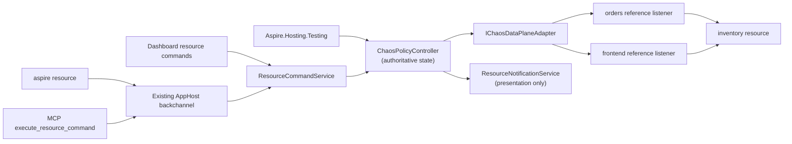

# Native Chaos hosting integration

**Status:** Proposed contribution-oriented incubation, August 2026.

## Summary

This document proposes a first-class Aspire hosting integration for local fault injection. It is not an Aspire roadmap or repository-ownership commitment. Product management has expressed enthusiastic support for the technical direction and for exploring CLI extensibility, while repository placement, architecture, and engineering ownership remain maintainer decisions.

## Decision summary

### Direction established by this proposal

- Every Phase 1 policy has two universal required fields, **resource + fault**, and one universal optional field, **fromResource**. The controller resolves `resource`, validates `fromResource` against declared AppHost references when present, rejects any selected effective proxyless path, then infers a stable versioned logical profile for an eligible path and uses that profile to select an enumerated, versioned `fault` discriminated union.
- A policy applies exactly one fault to the selected scope until explicitly removed. Omitting `fromResource` selects all callers; supplying it selects the calling Aspire resource on an existing declared reference to `resource` or an in-scope modeled descendant. Modeled Cosmos account, database, or container resources may additionally select `read`, `write`, or `query` operations. A modeled Storage account requires the profile-specific `service` selector (`blob`, `queue`, or `table`); selecting a modeled Storage service or child resource infers that service.
- The logical profile is derived metadata, not authored policy and not a CLR type. Aspire compiles it to DCP's internal proxy topology and matcher/response templates. Policy authors never select a profile, endpoint, route, raw HTTP method, path, header, percentage, seed, policy lifetime, priority, effect order, or policy ID.
- The MVP shipping matrix includes `http/v1`, `cosmos-gateway/v1`, `storage/v1`, and `app-configuration/v1`. `http/v1` includes typed `latency`, `httpStatus`, and `rateLimit`; the three Azure profiles provide the typed service-specific catalogs below. Once an HTTP(S) caller is pre-routed through YARP and the destination URI is known, emulator versus deployed Azure upstream is not a data-plane capability distinction. Automatic eager mediation and identical policy payload, typed fault semantics, and eligibility rules across every supported upstream location are required MVP work. If any selected profile cannot meet that location-independent contract, the MVP release is blocked rather than shipping without it or as an emulator-only subset.
- Capabilities that require raw matchers, arbitrary headers or bodies, probabilistic or capped activation, response-stream synthesis, or protocol-specific body parsing remain proposed post-MVP work with named safety and correctness gates; they are not exposed through an unsafe generic property bag.
- Phase 1 admits a policy only when DCP can apply the requested fault unambiguously and completely across every relevant resource-wide path or every path for the selected declared caller reference. Otherwise, application fails with an actionable eligibility reason.
- **MVP requires a fully Aspire-mediated path.** A selected structured reference whose effective path is proxyless remains an ordinary direct Aspire reference but is loudly ineligible for Chaos: `list-resources`, `describe-resource`, CLI, Dashboard, MCP, testing, and apply all report `Not eligible — the selected reference resolves directly through a proxyless endpoint; MVP requires an Aspire-mediated path.` The controller never silently converts the endpoint, inserts a mediation edge, or reports success while bypassing it.
- Policy scopes conflict when both the destination scope and caller scope overlap. A resource-wide policy conflicts with every caller-specific policy on the same ordinary resource or overlapping Cosmos or Storage hierarchy; caller-specific policies for distinct callers may coexist.
- Use one authoritative controller for CLI, dashboard, MCP, and tests. The CLI remains a client of resource commands rather than a second policy engine.
- Use the typed JSON policy document as canonical CLI input through `--file <path>` or `--file -`; the CLI reads and validates exactly one document, then sends it as the scalar `policyJson` resource-command argument. Interactive authoring and typed test helpers produce that same payload rather than defining parallel schemas.
- Keep DCP endpoint topology stable for the Run session and mutate fault behavior dynamically.
- Stable listeners and caller-specific reference rewrites for eligible non-proxyless paths must exist before workload client construction. Once traffic is pre-routed, live policy revisions affect warmed clients without reconnect or restart. A policy applied to an already-direct pooled client or a proxyless reference is rejected with an actionable eligibility error; restart and automatic endpoint conversion are not the capture contract.
- Keep the integration run-only and publish-safe. Chaos control resources and metadata do not appear in publish output.
- Explicit removal is the policy lifecycle. Test lease disposal removes the policy. AppHost shutdown or restart clears all policies.
- DCP proxies force pass-through after controller-liveness loss. The absence of a configurable policy lifetime must never strand a fault.
- Start with HTTP/1.1 and only the HTTP/2 request/response behavior proven by conformance testing. Unsupported protocols and resources fail explicitly.
- Random campaigns are a future direction. Phase 1 agents use the same explicit add and remove operations as humans.
- Caller-specific support faults an eligible non-proxyless reference already declared in the AppHost model through optional `fromResource`. It does not ask users to select proxy topology or permit authors or the runtime to invent an edge.
- `cosmos-gateway/v1` is one location-independent MVP profile with protocol-correct 429 throttle, 449 Retry With, 412 precondition failed, 503 service unavailable, and latency behaviors. For every selected caller, eligibility requires runtime enforcement that no Cosmos traffic can leave through a path outside the stable mediated Gateway listener, plus pre-activation proof of Gateway mode and `LimitToEndpoint`. Experimental `RunAsPreviewEmulator` remains ineligible because its endpoint and trust lifecycle are not yet proven, not because it is an emulator. `resource` names an existing modeled account, database, or container resource, and optional `operations` selects `read`, `write`, or `query`; omitted means all operations in that resource scope except that `preconditionFailed` only fires on an ETag-conditional write.
- Cosmos operation and conditional-write selection are hard MVP release gates, not optimistic contracts. A particular client path whose Gateway traffic cannot be classified from URI, method, and headers without request-body parsing is runtime-ineligible. If the implementation cannot prove the selected catalog and selectors against both stable emulator and Azure, MVP release is blocked rather than narrowing or demoting `cosmos-gateway/v1`.
- `fromResource` ships only when DCP provides stable eager per-reference listener and address identity. That topology and its pooled-connection isolation proof are Phase 1 gates; headers and baggage are never used as caller identity.
- Real Azure resources are not automatically intercepted by current Aspire/DCP. YARP can already forward to an arbitrary URI, including an `ExternalServiceResource`; the missing native capability is not reverse-proxy reachability. Today real `AzureProvisioningResource` URI outputs do not produce DCP Services/listeners, `ServiceSpec` has no resolved-upstream L7/TLS target, and resolved reference values are injected into workload configuration before clients are constructed. A viable zero-AppHost-source path requires automatic pre-workload per-reference listener allocation, caller-aware structured reference rewriting, and delayed upstream binding after provisioning resolves.
- Phase 1 includes a persistent, non-health Dashboard indicator on every affected main Resources row. The destination row distinguishes all-callers from caller-specific scope, a caller-specific policy also marks the `fromResource` row, and modeled Cosmos and Storage descendants identify inherited account, database, or selected-service scope.

### Recommendation

Extend the DCP proxy with a versioned fault-control contract, backed by a singleton controller provided by Aspire Hosting at run time. This follows the direction Damian suggested in the original meeting: keep Aspire's transparent proxy topology and add fault behavior at that layer.

The user-facing contract stays Aspire-native and intentionally small. DCP may retain a richer normalized capability and wire contract internally, but that vocabulary does not become the policy schema.

This proposal intentionally applies chaos to DCP. DCP does not support fault injection today: current support controls whether an endpoint is proxied and how its address is allocated. The native work therefore includes the live policy, acknowledgement, capability, liveness, and telemetry seams described below rather than routing around DCP with a second permanent proxy layer.

Deployment location is not a profile or support boundary. Aspire infers a profile from modeled resource identity plus an eligible protocol, transport, and completely captured path; the same authored payload and typed wire behavior apply whether the upstream is an emulator or deployed Azure service. An emulator may be a conformance fixture, but it cannot define a smaller product tier. For the selected Storage, Cosmos Gateway, and App Configuration profiles, automatic eager mediation, trust, authentication, authority, private-endpoint, warmed-client, and complete-path proofs across every supported location are release-blocking MVP work. Effective proxyless paths are a separate runtime eligibility exclusion, not a profile or resource-type exclusion. They retain their authored direct endpoint semantics and receive no Chaos policy in MVP. Workloads start normally with an empty pass-through policy set. Applying a policy through CLI, Dashboard, MCP, or `Aspire.Hosting.Testing` is explicit Run-mode consent to activate that fault, and success is returned only after every affected eligible route acknowledges it; Publish remains byte-equivalent to the ordinary direct model.

### Decisions still required

- Whether the contribution belongs directly in `microsoft/aspire` or should continue incubating in an Azure-owned repository before moving into the Aspire namespace.
- The DCP and Aspire Hosting ownership split for the proxy fault-control contract.
- Whether a YARP-compatible adapter is useful as a temporary conformance harness while the DCP contract is implemented.
- Which HTTP/2 behaviors pass the required correctness spikes.
- Whether Aspire's existing trust-delivery infrastructure can support synthesized-listener leaf issuance and double-leg TLS validation across Windows, Linux, macOS, supported containers, emulator fixtures, and deployed Azure upstreams, replacing stable Cosmos `RunAsEmulator`'s current disabled-validation baseline.
- Whether Dashboard owners approve the proposed general `ResourceRowIndicatorSnapshot` contract and its compact name-column rendering.
- Whether the semantic and performance budgets agreed with DCP owners are sufficient to ship the automatic Run-mode mediation.
- Whether Gateway traffic proves database/container and `read|write|query` classification without request-body parsing; failure in either supported location blocks MVP release, while an individual unprovable runtime path is ineligible.
- Whether DCP can completely cover Storage's distinct Blob, Queue, and Table endpoints across Azurite and Azure, classify eligible Blob conditional writes and non-batch Table update/delete requests with concrete ETags from URI, method, and standard headers, reject batch/multipart operations, and preserve service-correct response envelopes without request-body parsing.
- Whether App Configuration's complete HTTP(S) path remains mediated for warmed SDK clients, preserves the original service authority required by connection-string HMAC, and accepts the same protocol-correct 429 profile across the emulator fixture and Azure without client or AppHost changes.
- Whether DCP can add stable per-reference listener identity for each caller network without changing client-visible service authority, service-discovery values, or pooled-connection behavior.

## Background and motivation

Applications often behave differently across developer hosts, Linux containers, and shared authenticated environments. Local fault injection can expose retry, timeout, idempotency, optimistic-concurrency, and partial-failure bugs before a developer needs a scarce shared environment.

Cosmos Gateway HTTPS faulting is a defining profile because it tests the architecture beyond generic HTTP status and latency: Aspire already models account/database/container identity, while useful faults must establish validated interception trust, isolate a selected hierarchy scope and operation category, and emit the exact wire shape expected by `CosmosClient`. The same `cosmos-gateway/v1` contract must pass against the stable emulator and Azure Gateway paths with `LimitToEndpoint`; the current stable emulator connection string's `DisableServerCertificateValidation=True` cannot satisfy that release gate. Typed `preconditionFailed` targets an ETag-conditional write and exercises the application's lost-update handling rather than pretending that 412 is an SDK-retry case. Experimental `RunAsPreviewEmulator` starts with an HTTP endpoint declaration that may transition to HTTPS after developer-certificate setup and remains ineligible until that endpoint and trust lifecycle pass the same transport contract.

The Aspire discussion identified the existing service proxy as the right architectural direction, and subsequent product conversations supported exploring proxy-based fault handling and CLI extensibility. This remains **contribution-oriented incubation pending maintainer and engineering decisions**, not a shipping or repository-ownership commitment.

## Design goals

1. Provide zero-setup fault injection for eligible Aspire resources in Run mode.
2. Make the complete Phase 1 policy model understandable as required `resource`, optional `fromResource`, resource-validated selectors such as Cosmos `operations`, and required typed `fault`.
3. Apply and remove faults dynamically without restarting the AppHost or changing service discovery.
4. Keep proxy topology and protocol details out of user-facing policy, CLI, and testing APIs while supporting caller selection by Aspire resource identity.
5. Route CLI, dashboard, MCP, and tests through one controller and one acknowledgement path.
6. Make every successful mutation reflect acknowledged DCP state, including forward compensation after partial application.
7. Keep tests simple and honest about resource-wide, caller-specific, typed resource-profile effects, including Cosmos retry and optimistic-concurrency behavior.
8. Keep publish output deterministic and free of run-only chaos topology or state.
9. Make active faults visible directly on every affected row in the Dashboard main Resources view, with deeper policy detail and commands on the control resource.
10. Reject unsupported resources, faults, and protocols with actionable diagnostics.
11. Make profile eligibility and typed behavior independent of emulator versus deployed upstream location; every supported location uses the same profile version and policy payload.

## Non-goals

- Moving workflow orchestration or environment-specific automation into Aspire.
- Providing production traffic fault injection or a production service mesh.
- Persisting policies across AppHost restarts.
- Exposing generic request selection by path, method, headers, or other raw protocol properties.
- Authoring arbitrary caller-to-destination pairs or selecting a particular proxy listener, endpoint, or route.
- Probabilistic activation, user-provided randomness, or parallel-test traffic isolation.
- Configurable policy lifetime, expiry, pause, priority, ordering, or composition.
- User selection of proxy paths or network topology.
- Random campaign execution in Phase 1.
- Supporting arbitrary L4 protocols in the first increment.
- Building a custom dashboard framework as a prerequisite.
- Replacing Azure Chaos Studio or other environment-level fault systems.
- Making application code depend on a Chaos client library.
- Shipping emulator-only or deployed-resource-only profile variants, schemas, fault catalogs, or behavior.

## Terminology

| Term | Meaning |
| --- | --- |
| Policy | One explicitly applied fault over one selected destination and caller scope until explicit removal |
| Destination resource | The downstream Aspire resource named by required `resource` |
| Caller scope | All callers when `fromResource` is omitted, or the one declared calling Aspire resource named by `fromResource` |
| Logical profile | Stable versioned metadata inferred from the modeled destination, such as `http/v1`, `cosmos-gateway/v1`, or `storage/v1`; never authored policy |
| Fault catalog | The logical profile's enumerated discriminated union of supported fault types, parameters, constraints, and selectors |
| Controller | The singleton `ChaosPolicyController`, authoritative for validation, desired state, acknowledgement, cleanup, and observations |
| DCP proxy path | An internal protocol-aware path that enforces one controller revision; users never select it |
| Control resource | The synthetic run-only `ChaosEnvironmentResource` that exposes commands, aggregate health, policy details, and row indicators |
| Row indicator | A non-health Dashboard marker beside an affected resource name, published through `ResourceRowIndicatorSnapshot` |

## Product constraints

The design follows these Aspire-native constraints:

| Area | Phase 1 constraint |
| --- | --- |
| Resource model | Add one inert run-only `ChaosEnvironmentResource`; DCP carries traffic and workload resources remain unchanged |
| Topology | Keep proxy paths internal to DCP and admit only resources with complete fault coverage |
| Policy authoring | Require `resource`, optional `fromResource`, inferred catalogs, explicitly defined typed selectors, and one required typed `fault` |
| State | One AppHost controller owns authoritative desired state, acknowledgement, cleanup, and observations |
| Cleanup | Use explicit removal; controller-liveness loss forces pass-through |
| Composition | Caller and destination scope determine conflicts; overlapping applies fail deterministically |
| Isolation | Omitted `fromResource` affects all callers; a validated `fromResource` isolates one declared caller; resource profiles may add typed selectors |
| Telemetry | Retain bounded activation counts and sanitized receipts without capturing request or response bodies |
| Fault catalog | Use versioned, profile-specific discriminated unions with fixed protocol templates rather than generic transforms |
| Publish | Emit no chaos control resource, metadata, or changed workload references |
| Certificates | Replace the current stable Cosmos disabled-validation baseline with reviewed local trust on both proxy legs or an explicitly approved equivalent; never depend on disabled certificate validation |
| Automation | Keep workflow orchestration outside the hosting integration; all clients use the same controller contract |

## Existing Aspire contracts

The proposal builds on current Aspire contracts rather than inventing parallel infrastructure.

### App model and DCP proxy support

- Resources are inert model objects; lifecycle and behavior belong in annotations, services, and event handlers (`docs/specs/appmodel.md`).
- Stable endpoint annotations exist during model construction, while allocated host values resolve later (`src/Aspire.Hosting/ResourceBuilderExtensions.cs`).
- `ProxySupportAnnotation` currently contains only `ProxyEnabled` (`src/Aspire.Hosting/ApplicationModel/ProxySupportAnnotation.cs`).
- DCP service specs carry only address, port, protocol, and allocation mode; they have no resolved upstream URI or authority, L7 route, or TLS-termination target. `Proxyless` means "don't use a proxy, instead bind to the first Endpoint" (`src/Aspire.Hosting/Dcp/Model/Service.cs` and [Proxyless endpoints](https://aspire.dev/fundamentals/networking-overview/#proxyless-endpoints)).
- `DcpExecutor.PrepareServices` creates proxied or proxyless Services only for resources with `EndpointAnnotation`s and waits for effective addresses. Effective proxyless forms include an explicitly non-proxied endpoint, a resource with proxy support disabled, and the persistent-resource default when port randomization is disabled. DCP resolves those forms to `EndpointAnnotation.IsProxied == false` and `AddressAllocationMode.Proxyless`; callers use the workload's directly allocated endpoint rather than an Aspire reverse proxy. Real Azure provisioning outputs do not create a Service/listener through this path, and no current model carries fault rules or live policy revisions (`src/Aspire.Hosting/ApplicationModel/EndpointAnnotation.cs`, `src/Aspire.Hosting/ApplicationModel/ResourceExtensions.cs`, `src/Aspire.Hosting/Dcp/DcpExecutor.cs`, and `src/Aspire.Hosting/Dcp/DcpModelUtilities.cs`).
- `YarpResource` is an existing explicit L7 proxy resource. Its configuration accepts `ExternalServiceResource`, string, and `Uri` destinations, so forwarding to a known deployed-service URI is already supported; it does not expose dynamic fault behavior or automatic mediation of Azure output references (`src/Aspire.Hosting.Yarp/ConfigurationBuilder/IYarpConfigurationBuilder.cs`, `src/Aspire.Hosting.Yarp/ConfigurationBuilder/YarpConfigurationBuilder.cs`, and `src/Aspire.Hosting.Yarp/ConfigurationBuilder/YarpCluster.cs`).

Adding faults and automatic pre-start native mediation to DCP is new product work across Hosting and DCP, not use of an existing extension point. Prior YARP-based validation established dynamic policy updates over a statically authored edge, including Cosmos emulator Gateway traffic constrained with `LimitToEndpoint`. It did not establish automatic edge synthesis from real Azure outputs or real-service TLS, authentication, authority, private-endpoint, and complete-client-path conformance. The current gap is native synthesis and service proof, not whether a reverse proxy can reach a deployed Azure URI.

### Reference and resource identity

- `EndpointReferenceAnnotation` records a reference from one resource to another resource's endpoints, and `ValueProviderContext.Caller` identifies the resource requesting a resolved value (`src/Aspire.Hosting/ApplicationModel/EndpointReferenceAnnotation.cs` and `src/Aspire.Hosting/ApplicationModel/IValueProvider.cs`). `ResourceExtensions.GetValue` passes that caller into expression resolution while executable/container configuration is gathered, before the workload process starts (`src/Aspire.Hosting/ApplicationModel/ResourceExtensions.cs`, `src/Aspire.Hosting/Dcp/ExecutableCreator.cs`, and `src/Aspire.Hosting/Dcp/ContainerCreator.cs`). This is precedent for caller-aware rewriting, not an existing stable per-reference listener implementation.
- `AzureCosmosDBResource`, `AzureCosmosDBDatabaseResource`, and `AzureCosmosDBContainerResource` are public top-level Aspire resources with public parent and logical-name identity (`src/Aspire.Hosting.Azure.CosmosDB/AzureCosmosDBResource.cs`, `AzureCosmosDBDatabaseResource.cs`, and `AzureCosmosDBContainerResource.cs`).
- `WithReference(container)` preserves a directed `ResourceRelationshipAnnotation` to that container and emits inherited `DatabaseName` plus `ContainerName` connection properties (`src/Aspire.Hosting/ResourceBuilderExtensions.cs` and `src/Aspire.Hosting.Azure.CosmosDB/AzureCosmosDBContainerResource.cs`).
- The Cosmos client component defaults emulator clients to Gateway mode and `LimitToEndpoint` before invoking the user options callback. The callback can override those values, and raw clients can bypass the component entirely. DCP cannot detect a raw client after it has bypassed modeled references, so a selected caller is eligible only when the runtime can enforce that no outbound Cosmos path exists outside the stable mediated Gateway listener and can prove Gateway plus `LimitToEndpoint` before activation (`src/Components/Aspire.Microsoft.Azure.Cosmos/AspireMicrosoftAzureCosmosExtensions.cs`). Stable `RunAsEmulator` models one HTTPS conformance fixture for `cosmos-gateway/v1`, but its current connection string sets `DisableServerCertificateValidation=True`; the whole profile therefore requires a validated-trust interception path or an explicitly approved equivalent that preserves client validation across supported locations (`src/Aspire.Hosting.Azure.CosmosDB/AzureCosmosDBEmulatorConnectionString.cs`). Experimental `RunAsPreviewEmulator` initially declares HTTP and may update its URI scheme to HTTPS after developer-certificate setup, so its endpoint and trust lifecycle remain ineligible until they pass the same profile contract (`src/Aspire.Hosting.Azure.CosmosDB/AzureCosmosDBExtensions.cs`).
- `AzureStorageResource` exposes distinct emulator `blob`, `queue`, and `table` endpoints. `AzureBlobStorageResource`, `AzureBlobStorageContainerResource`, `AzureQueueStorageResource`, `AzureQueueStorageQueueResource`, and `AzureTableStorageResource` preserve the modeled service, parent, and available child identity needed for one service-discriminated `storage/v1` profile (`src/Aspire.Hosting.Azure.Storage/AzureStorageResource.cs` and the corresponding service and child resource files).
- `AzureAppConfigurationResource.IsEmulator` and `RunAsEmulator` expose a named HTTP endpoint in Run mode and leave Publish unchanged (`src/Aspire.Hosting.Azure.AppConfiguration/AzureAppConfigurationResource.cs` and `AzureAppConfigurationExtensions.cs`).
- `AzureKustoClusterResource` similarly exposes a local HTTP emulator endpoint and modeled database children, but database selection for core operations is not safe without request-content parsing (`src/Aspire.Hosting.Azure.Kusto/AzureKustoClusterResource.cs`, `AzureKustoReadWriteDatabaseResource.cs`, and `AzureKustoBuilderExtensions.cs`).
- `AzureServiceBusResource` and `AzureEventHubsResource` preserve namespace and child identity and expose local emulator endpoints, but those endpoints carry AMQP rather than HTTP (`src/Aspire.Hosting.Azure.ServiceBus/AzureServiceBusResource.cs` and `src/Aspire.Hosting.Azure.EventHubs/AzureEventHubsResource.cs`).
- `AzureKeyVaultResource`, `AzureAppConfigurationResource`, `AzureSearchResource`, and `AzureOpenAIResource` expose modeled real-service URIs; that identity is useful for profile inference but is not evidence that current DCP interposes authenticated HTTPS (`src/Aspire.Hosting.Azure.KeyVault/AzureKeyVaultResource.cs`, `src/Aspire.Hosting.Azure.AppConfiguration/AzureAppConfigurationResource.cs`, `src/Aspire.Hosting.Azure.Search/AzureSearchResource.cs`, and `src/Aspire.Hosting.Azure.CognitiveServices/AzureOpenAIResource.cs`).
- Aspire already gathers certificate-authority trust and developer certificates for executable and container workloads (`src/Aspire.Hosting/ApplicationModel/CertificateTrustExecutionConfigurationGatherer.cs`, `src/Aspire.Hosting/Dcp/ExecutableCreator.cs`, and `src/Aspire.Hosting/Dcp/ContainerCreator.cs`). That is reusable trust-delivery infrastructure. Automatic listener identity, per-upstream-authority leaf issuance, setting upstream HTTP Host and TLS SNI from the resolved Azure authority, and upstream TLS validation are still missing.

These identities are sufficient for resource-driven Phase 1 authoring, but enforcement remains gated on profile-specific traffic classification, protocol-correct fixed responses, trusted TLS interception, and stable eager per-reference DCP listener identity. `DcpNameGenerator` already keys Services by resource, endpoint, and network, and value resolution already receives the caller; both are useful precedent. Neither supplies stable per-reference identity today, so Phase 1 must implement and prove that capability before `fromResource` or any location-independent Azure profile can ship.

### Azure-output routing gap and generic extension

Current deployed-Azure resource behavior is direct. `AzureProvisioningResource`-derived integrations expose service-specific output expressions, caller configuration is gathered and resolved, and the workload constructs its Azure SDK clients from those values (`src/Aspire.Hosting.Azure/AzureProvisioningResource.cs`, the resource files cited below, `src/Aspire.Hosting/ApplicationModel/ResourceExtensions.cs`, `src/Aspire.Hosting/Dcp/ExecutableCreator.cs`, and `src/Aspire.Hosting/Dcp/ContainerCreator.cs`). Because those outputs do not create `EndpointAnnotation`s, `DcpExecutor.PrepareServices` creates no corresponding listener. Because `ServiceSpec` has no dynamically bound upstream contract, DCP cannot automatically synthesize a stable client-facing listener from an Azure URI, terminate local TLS, and derive the upstream HTTP Host and TLS SNI from the resolved Azure authority. This structural gap blocks every affected profile as a whole; it does not create an emulator product tier. Known-URI YARP forwarding itself is already established.

The viable zero-AppHost-source extension is generic Aspire/DCP product work:

1. Before workload client construction, enumerate eligible non-proxyless structured references and allocate one stable listener/address identity per selected reference and caller network. Host callers may use loopback transport addresses; container callers use an address reachable through their DCP network or tunnel. Distinct `fromResource` scopes receive distinct routing identities.
2. During caller-aware value resolution, route only the structured endpoint/connection properties for that caller through the stable listener while preserving the original service authority in the client-visible URI and certificate identity. Do not ask AppHost code or application code to opt in, add annotations, or construct a chaos client.
3. After Azure provisioning resolves the real service URI, bind the listener's upstream to that URI without changing the already-injected listener address.
4. Terminate client TLS with a locally trusted leaf for the original service authority, validate upstream TLS normally, and forward that same authority in the upstream HTTP Host header and TLS SNI so routing, signatures, certificate identity, and token audience remain service-correct. Rewriting the client-visible authority to `localhost` is ineligible because App Configuration connection-string HMAC signs `host` as a required header ([HMAC authentication](https://learn.microsoft.com/azure/azure-app-configuration/rest-api-authentication-hmac)).
5. Keep the listener pass-through with an empty policy and apply full-snapshot policy revisions live. A warmed client already using the listener observes later revisions without reconnect or restart.
6. Reject any reference that cannot be rewritten before client construction, any client path that bypasses the listener, and any security posture that cannot protect decrypted credentials and request content.

This synthesis never applies to a reference whose effective path is proxyless in MVP. Aspire preserves `IsProxied == false`, the direct allocated endpoint, fixed-port and persistent-resource behavior, and caller-visible reference values exactly as authored. It does not convert the destination to proxied, replace its endpoint, or silently insert a caller-scoped mediation edge. Future caller-scoped support remains possible only through a separately reviewed DCP/Aspire mediation contract that preserves or explicitly revises those proxyless semantics; this proposal does not promise that support.

This extension is not a chaos-specific AppHost API. It is a generic automatic native edge-synthesis and structured-reference-routing capability that chaos can consume. Workloads start normally against stable pass-through routes with no active policy. Applying a policy is the uniform Run-mode consent event for fault activation and does not add an AppHost setup step, per-run enablement, or second consent boundary. Publish and Deploy continue to resolve and emit the ordinary direct values, with no listener, trust material, policy, or rewritten reference.

### Resource commands and clients

`WithCommand` binds a resource command to an AppHost callback with dependency injection, logging, cancellation, and validated arguments (`src/Aspire.Hosting/ResourceBuilderExtensions.cs` and `src/Aspire.Hosting/ApplicationModel/ResourceCommandService.cs`).

The dashboard, CLI, and MCP already dispatch those commands through the AppHost backchannel:

- `src/Aspire.Cli/Commands/ResourceCommand.cs`
- `src/Aspire.Cli/Commands/ResourceCommandHelper.cs`
- `src/Aspire.Hosting/Backchannel/AuxiliaryBackchannelRpcTarget.cs`
- `src/Aspire.Cli/Mcp/Tools/ExecuteResourceCommandTool.cs`
- `docs/specs/cli-backchannel.md`

Chaos commands that promise JSON must return exactly one valid JSON document and mark it as JSON. A chaos-specific backchannel method is not required.

### Testing and eventing

Current `Aspire.Hosting.Testing` surfaces include builder callbacks, `BuildAsync`, `StartAsync`, endpoint lookup, application services, and disposal (`src/Aspire.Hosting.Testing/DistributedApplicationTestingBuilder.cs` and `src/Aspire.Hosting.Testing/DistributedApplicationFactory.cs`).

The integration must not use obsolete `IDistributedApplicationLifecycleHook`. A long-lived controller should register through `IDistributedApplicationEventingSubscriber`, retain subscription tokens, unsubscribe during disposal, and observe AppHost shutdown and resource lifecycle events.

### Presentation state

`CustomResourceSnapshot` and `ResourceNotificationService` describe dashboard state. They are not a policy database or data-plane contract (`src/Aspire.Hosting/ApplicationModel/CustomResourceSnapshot.cs` and `src/Aspire.Hosting/ApplicationModel/ResourceNotificationService.cs`).

Today the main Resources grid renders the resource icon and name, lifecycle state and health-derived state icon, URLs, and actions. Highlighted properties and relationships appear only after opening resource details. Resource commands appear in the Actions column, and notifications can link to an action, but there is no general contract for a controller resource to place a compact indicator on another resource's main-grid row (`src/Aspire.Dashboard/Components/Pages/Resources.razor`, `ResourceNameDisplay.razor`, `StateColumnDisplay.razor`, and `ResourceDetails.razor`).

Phase 1 therefore requires the small general-purpose `ResourceRowIndicatorSnapshot` contract described in [Dashboard visualization](#dashboard-visualization). Reusing lifecycle state or health would report false semantics, while a property or relationship alone would remain invisible in the main view.

## Architecture



The architecture has four layers:

1. **App-model resources, declared references, effective proxy mode, and DCP capabilities** determine whether a fault can cover a destination resource or one caller's references completely. Effective proxyless paths are excluded before profile or policy validation.
2. **`ChaosPolicyController`** resolves the resource, validates optional caller identity against existing references, infers the resource's stable logical profile and enumerated fault catalog, validates the policy, and owns active policies, generated policy IDs, revisions, leases, acknowledgement, and bounded activation observations.
3. **`IChaosDataPlaneAdapter`** translates the small Aspire policy and selectors validated by the inferred catalog into DCP's internal desired-state contract.
4. **DCP proxies** inject faults and report acknowledgement, liveness, and bounded observations.

All control-plane clients use the controller. No client writes directly to proxy state, and workload headers or baggage never establish caller identity.

### Implicit control resource

Aspire Hosting automatically adds one visible run-only `ChaosEnvironmentResource` when the selected DCP version advertises fault-control capability. This synthetic resource exposes commands, aggregate status, policy details, and the replace-all row-indicator projection; it does not carry traffic or add a network hop.

`chaos` is the preferred resource name, not a reserved name. If user code already uses it, Aspire chooses the first deterministic fallback (`aspire-chaos`, then a numeric suffix). The resolved name appears in startup logs, the dashboard, and `aspire resource list`.

No `AddChaos`, special reference API, or per-resource setting is required. Every resource remains pass-through until a policy is applied. Standard resource declarations, references, endpoint proxy modes, and service-discovery values do not change.

The automatic mediation capability is available in Run mode without AppHost setup or per-run enablement for eligible non-proxyless paths. It never reinterprets an effective proxyless endpoint or pre-routes a proxyless reference in MVP. Its semantic and performance budgets are release gates, not a reason to add a second opt-in. Publish and Deploy never materialize the capability.

### Resource eligibility

The `resource` field names the downstream Aspire resource receiving the traffic. For example, `"resource": "inventory"` applies the fault on requests entering `inventory`; it does not fault requests originating from `inventory`.

Optional `fromResource` names the calling Aspire resource on an existing reference to `resource` or, for a hierarchical account scope, an eligible modeled descendant. For example, `"fromResource": "orders", "resource": "inventory"` selects the declared `orders -> inventory` reference while leaving `frontend -> inventory` unaffected. `"fromResource": "worker", "resource": "storage", "service": "queue"` may select the declared `worker -> orders-queue` edge because that queue is inside the selected service scope. Omitting `fromResource` selects all callers. Both fields use Aspire resource identity, not DNS names, listeners, endpoint addresses, or arbitrary caller/destination strings.

The controller validates the edge from the AppHost model before activation. Ordinary references use their declared endpoint/reference relationships. Cosmos and Storage child-resource references use their modeled parent identity, including relationships created by `WithReference(container)` or `WithReference(queue)` even though connection properties inherit account/service values. A caller must reference the selected resource or an eligible descendant inside its hierarchical scope; inherited connection properties do not authorize an unrelated caller or an unsupported sibling service.

If one caller has multiple declared references to the same destination resource, `fromResource` selects all of those references. DCP must cover every selected path atomically; the controller rejects an ambiguous or partially mediated set rather than choosing one reference. A caller with no declared edge is rejected. This keeps policy semantics stable if the AppHost adds another endpoint reference later.

Proxyless is evaluated on each selected reference's effective runtime path, not from one syntax or from resource type alone. If `fromResource` selects a reference that resolves directly through an effective proxyless endpoint, that selected path is not eligible. When `fromResource` is omitted, every selected modeled caller path must be eligible; one proxyless path rejects the all-callers policy atomically before activation. This scope covers modeled references only. It does not claim interception of browser traffic, raw direct inbound traffic, or any other path outside the AppHost reference model.

Enforcement for eligible non-proxyless paths requires DCP to eagerly allocate distinct per-reference proxy/listener/address identity for each caller network at startup. Host and container callers may require different reachable transport addresses, and distinct `fromResource` scopes require distinct routing identity. Client-visible service authority and service-discovery values must remain stable while policies mutate, including for warmed pooled connections. Phase 1 cannot ship `fromResource` until the DCP contract expresses that caller dimension and the proof gate demonstrates isolation across multiple callers and multiple references. Propagating caller identity in a header or baggage is rejected: it is spoofable, requires application changes, and does not cover Cosmos or direct protocols.

A resource is eligible for a fault only when:

- the resource exists in the current AppHost model;
- `fromResource`, when supplied, exists and is the caller side of at least one declared AppHost reference to `resource` or an in-scope modeled descendant selected by a hierarchical profile;
- every selected reference has an effective non-proxyless path;
- the controller can infer a supported logical profile and catalog version from that resource;
- every relevant resource-wide path, or every declared path for `fromResource`, is mediated by a DCP proxy that supports the fault;
- each selected caller path has stable eager listener and address identity for the Run session;
- DCP can preserve pass-through behavior for the resource's protocol;
- applying the fault has one complete, unambiguous meaning for the resource;
- every explicitly defined resource-profile selector is valid and enforceable for that resource type; and
- DCP can acknowledge the same desired revision across every enforcing proxy path.

If any condition fails, the controller rejects the apply before activation. Diagnostics name the resource and explain what the developer can change. Example reasons include:

- the selected reference resolves directly through a proxyless endpoint; MVP requires an Aspire-mediated path;
- some host or container traffic bypasses DCP;
- the resource exposes a protocol unsupported by the requested fault;
- HTTPS interception is not available;
- multiple relevant paths cannot be covered atomically; or
- the selected caller has no declared reference to the destination or one of its multiple references lacks stable DCP identity; or
- the selected DCP version does not advertise the required capability.

`list-resources` and `describe-resource` resolve the app model and first report runtime path eligibility. For eligible paths they report the inferred MVP logical profile, eligible faults, their typed required and optional parameters, profile selectors, and eligible `fromResource` callers. These commands serialize the approved MVP support matrix directly, including Azure resources outside that matrix with no active profile or faults. A selected proxyless reference is reported as `Not eligible` with the direct-path reason above and is not assigned an active profile, offered a fault set, or accepted as input to policy validation or apply. This path-level result does not remove the resource type from its profile or demote any matrix row; another non-proxyless reference to the same modeled resource is assessed independently. Candidate profile, fault, and reference information for non-MVP resources may appear only as explicitly labeled assessment diagnostics; it is never treated as an inferred supported profile, supported fault catalog, or input to policy validation. A developer does not need to guess resource names or understand CLR types, listeners, or address allocation. Each row shows:

Roadmap phase and non-MVP candidate details belong in the later delivery and ranked-assessment sections; `list-resources` reports current runtime eligibility and actionable reasons, not roadmap shorthand. The example below describes the target shipped MVP after its release gates pass; at runtime, a selected profile is eligible only when the actual modeled path and transport satisfy these rules.

| Column | Purpose |
| --- | --- |
| Resource name | The exact identifier to use in `resource` |
| Modeled resource type | Discoverability context such as project, container, or `AzureCosmosDBContainerResource`; never authored policy |
| Logical profile/version | Inferred supported controller contract such as `http/v1`, `cosmos-gateway/v1`, `storage/v1`, or `app-configuration/v1`; a non-MVP contract may appear only as a clearly labeled candidate diagnostic and is not a CLR type |
| Parent hierarchy | The modeled account -> service/database -> child chain, when the resource has one |
| Supported faults | Enumerated fault types plus JSON types, constraints, required and optional member parameters, and profile selectors from the shipping MVP matrix |
| Eligible callers | Aspire resource names currently accepted by `fromResource`, grouped with the number of declared references they cover; non-MVP candidate reference assessments are explicitly labeled and are not eligible callers |
| Eligibility reason | Why the resource is eligible, or the specific actionable reason it is not |

For example:

| Resource name | Modeled resource type | Logical profile/version | Parent hierarchy | Supported faults | Eligible callers | Eligibility reason |
| --- | --- | --- | --- | --- | --- | --- |
| `inventory` | Project | `http/v1` | — | `latency(minimum, maximum)`, `httpStatus(statusCode)`, `rateLimit(requestsPerWindow, window, retryAfter?)` | `orders` (1), `frontend` (2) | Eligible |
| `carts` | `AzureCosmosDBContainerResource` | `cosmos-gateway/v1` | `cosmos` -> `shop-db` -> `carts` | `latency`, `throttle`, `retryWith`, `preconditionFailed`, `serviceUnavailable`; typed operation constraints apply | `orders` (1) | Eligible — the client uses Gateway + `LimitToEndpoint` and every selected path is completely mediated |
| `storage` | `AzureStorageResource` | `storage/v1` | — | Account selection requires `service`; the selected Blob, Queue, or Table catalog defines the supported faults | `worker` (1), `api` (1) | Eligible — every path for the selected service is completely mediated |
| `images` | `AzureBlobStorageContainerResource` | `storage/v1` | `storage` -> `blobs` -> `images` | `latency`, `serverBusy`, conditional-write-only `preconditionFailed` | `api` (1) | Eligible — the Blob path and URI-only container classification passed |
| `orders-queue` | `AzureQueueStorageQueueResource` | `storage/v1` | `storage` -> `queues` -> `orders-queue` | `latency`, `serverBusy` | `worker` (1) | Eligible — every selected Queue path is completely mediated |
| `tables` | `AzureTableStorageResource` | `storage/v1` | `storage` -> `tables` | `latency`, `serverBusy`, concrete-ETag `updateConditionNotSatisfied` | `api` (1) | Eligible — non-batch update/delete classification passed; `If-Match: *` and `$batch` remain excluded |
| `settings` | `AzureAppConfigurationResource` | `app-configuration/v1` | — | `latency`, `throttle(retryAfter)` | `api` (1) | Eligible — the complete App Configuration path is mediated for the warmed client |
| `direct-api` | Project | — | — | — | — | Not eligible — the selected reference resolves directly through a proxyless endpoint; MVP requires an Aspire-mediated path |
| `vault` | `AzureKeyVaultResource` | — (candidate: `key-vault-https/v1`) | — | — (candidate preview: `latency`, `throttle(retryAfter)`) | — | Not eligible — add automatic listener synthesis from the resolved vault URI and prove trust delivery, authority, auth, private endpoints, complete paths, and secret handling |

MVP foundation work must census representative and playground resources and record eligibility reasons. Low coverage should become explicit roadmap evidence, not an excuse to expose proxy topology in the v1 contract.

For the MVP Cosmos profile, the same `resource` field may name an existing `AzureCosmosDBResource`, `AzureCosmosDBDatabaseResource`, or `AzureCosmosDBContainerResource`; see [How resource selection works](#how-resource-selection-works) for the account/database/container scoping table. No duplicate database or container string fields are added: `"resource": "carts"` selects the modeled container resource named `carts`, including its public parent and logical container identity. Storage similarly uses the modeled account, service, or child resource. A service or child infers Blob, Queue, or Table; the account requires one typed `service` value because the three endpoints have different wire contracts. Data Lake stays ineligible until both DFS and Blob paths pass as one complete profile; the absence of an emulator fixture is not a profile classification. Authors never select profile identifiers or upstream location; those remain derived implementation details.

`cosmos-gateway/v1` is required in the MVP for both stable emulator and Azure upstreams. For each selected caller, the runtime must prove before activation that Gateway plus `LimitToEndpoint` is configured and enforce that no outbound Cosmos path can bypass the stable mediated listener. Direct/TCP (RNTBD), regional discovery, raw clients, component callbacks that bypass the listener, and consumers whose complete outbound path cannot be enforced are ineligible regardless of upstream location and fail loudly rather than no-op. DCP cannot discover a raw bypass after the client has left the modeled path. Stable `RunAsEmulator` is a useful fixture, but its disabled-validation connection string cannot establish the shipping trust contract. Experimental `RunAsPreviewEmulator` remains separately ineligible because its endpoint may transition from HTTP to HTTPS and its trust lifecycle is unproven. EF Core may use containers that are not modeled as `AzureCosmosDBContainerResource`; `list-resources` must warn about that gap, and container-scoped selection requires the AppHost to model the container with `AddContainer`.

### Stable startup and connection semantics

DCP resource-wide and per-reference proxy paths are established eagerly before workload startup whether or not a policy is active, but only for paths that are eligible and effectively non-proxyless. Each such selected reference receives a stable address reachable from its caller network while retaining the original service authority in the client-visible URI and certificate identity; an Azure upstream binds when its URI is available. Effective proxyless references keep their ordinary direct allocated endpoints and are never pre-routed, rewritten, or replaced for Chaos in MVP. With no policy, workloads start normally and eligible mediated paths remain pass-through. Applying and removing policies after the AppHost is running never rewrites service-discovery values, changes endpoint proxy mode, pauses workload traffic, or restarts workloads.

Once a client is pre-routed through that listener, an acknowledged live policy revision affects its next dispatched request even when the client and connection pool are warm. A late policy cannot capture a client that was constructed from an unrevised direct Azure URI. The controller must reject that path as not pre-routed and explain which reference or client path bypassed interception; asking the developer to restart as the normal activation mechanism or silently reporting success is prohibited.

When DCP advertises HTTP chaos capability, the relevant path remains protocol-aware for the entire Run session. It must not switch from L4 forwarding to L7 handling when the first policy arrives.

Acknowledged revision R governs every request beginning after the apply returns, including requests on pooled connections. Requests that began before all affected routes acknowledged R may complete without the new policy. Apply does not pause workload traffic while acknowledgement is pending. Removal uses the same boundary: requests beginning after removal returns pass through, while earlier requests may complete under the prior revision.

Conformance coverage includes headers, trailers, connection reuse, `Expect: 100-continue`, cancellation, and HTTP/2 flow control. Tests must warm pools from at least two callers, apply a caller-specific policy and prove only the selected caller's next request faults, then remove it and prove both callers pass without reconnecting. Multiple references from one caller must remain covered by the same policy and acknowledgement. A `rateLimit` policy must also prove one shared window counter across at least two selected paths.

## DCP proxy extension

### Native path

The recommended path extends DCP and Aspire Hosting with:

- versioned capability discovery;
- stable eager per-reference listener and caller-network-reachable address identity for eligible non-proxyless paths;
- automatic per-reference listeners for eligible non-proxyless paths whose upstream can bind after provisioning while their caller-visible address stays fixed;
- caller-aware structured connection/reference routing for eligible non-proxyless paths before workload startup while preserving client-visible service authority;
- explicit pre-synthesis rejection of effective proxyless paths without changing `IsProxied`, endpoint identity, or direct reference values;
- trusted TLS termination for the original service authority, the same upstream HTTP Host and TLS SNI, and validated upstream TLS;
- live full-snapshot policy updates;
- revision acknowledgement and structured rejection;
- protocol-aware proxy behavior;
- controller-liveness fail-safe behavior; and
- bounded activation telemetry.

The internal DCP contract may describe proxy path coverage, protocol details, normalized effect configuration, matcher/response templates, and compatibility versions. Those are generic platform contracts between Hosting and DCP. Aspire infers the logical profile from modeled resource identity, validates its enumerated fault catalog, and compiles typed operations into those templates; raw HTTP methods, paths, headers, Cosmos response details, and the inferred profile identifier are not fields in authored policy.

The minimal operations are:

- `GetCapabilities`, which returns resource coverage and normalized effect capabilities that Aspire intersects with its versioned logical fault catalogs;
- `SetDesiredPolicies(revision, policies[])`, which sends the complete desired snapshot; and
- `GetStatus`, which returns the acknowledged revision, controller-liveness state, bounded observations, and structured rejection details.

### Incubation fallback

An explicit run-only YARP-compatible proxy and controller can serve as a conformance harness if DCP sequencing would otherwise block policy validation. It is not the product topology: it adds visible resources, address rewriting, and another network hop.

`IChaosDataPlaneAdapter` keeps controller behavior independent of that choice. CLI commands, leases, generated policy IDs, acknowledgement, telemetry, and dashboard projections remain the same.

## Phase 1 policy model

Every Phase 1 policy has these universal fields:

| Field | Meaning |
| --- | --- |
| `resource` | Required downstream Aspire resource name; the fault applies on requests entering this resource |
| `fromResource` | Optional calling Aspire resource on an existing declared reference to `resource` or an eligible descendant inside a hierarchical scope; omitted means all callers |
| `fault` | Required member of the inferred profile's discriminated union; `fault.type` is the discriminator |

The controller resolves `resource` and optional `fromResource` against the AppHost model before interpreting `fault`. It evaluates effective path eligibility first and rejects a selected proxyless reference without active-profile inference or fault validation. For an eligible path, it infers a stable, versioned logical profile from `resource`, then uses `fault.type` to select one member schema from that profile's enumerated discriminated union. Each member has explicit required and optional typed parameters. Authors do not provide `resourceType`, `profile`, or a generic parameter bag. The inferred profile is not a CLR type and may evolve only through explicit catalog versioning.

### MVP profile contracts and shipping matrix

The MVP ships `http/v1`, `cosmos-gateway/v1`, `storage/v1`, and `app-configuration/v1` together. The selected Azure profiles require typed behavior and automatic mediation across every supported upstream location before MVP release; failure blocks the release rather than removing a profile or creating an emulator-only tier. Discovery, validation, CLI prompting, Dashboard controls, MCP, and typed testing helpers all project the same enumerated schema regardless of emulator versus deployed upstream; location never adds, removes, or changes a fault. Later catalog changes use explicit profile versioning and compatibility review rather than generic fallback or location-specific variants.

Every matrix row is also subject to per-reference runtime path eligibility. An effective proxyless path is ineligible for every MVP profile without changing that profile's identity, resource-type classification, schema, fault catalog, or location-independence mandate. The four profile rows remain required; the controller simply exposes no active profile or fault set for the rejected selected path.

| Stable logical profile | Aspire resource types eligible for the profile | `fault.type` | Typed fault parameters | Resource-profile selectors |
| --- | --- | --- | --- | --- |
| `http/v1` | Ordinary non-Azure `ProjectResource` and author-added `ContainerResource` destinations whose selected inbound paths are fully mediated by DCP as HTTP/1.1 or proven h2c HTTP/2; no `Azure*Resource` enters this row | `latency` | `minimum` and `maximum`: required positive JSON durations; `maximum` must be greater than or equal to `minimum`; both are bounded by the DCP capability | Universal optional `fromResource`; no profile-specific selectors |
| `http/v1` | Same as above | `httpStatus` | `statusCode`: required JSON integer from 400 through 599; response body and headers come from a safe platform template and are not authored | Same as above |
| `http/v1` | Same as above | `rateLimit` | `requestsPerWindow`: required positive integer; `window`: required positive bounded JSON duration; `retryAfter`: optional non-negative bounded duration; response status is fixed at 429; one generated policy ID owns one shared window counter across all selected paths | Same as above |
| `cosmos-gateway/v1` | `AzureCosmosDBResource`, `AzureCosmosDBDatabaseResource`, or `AzureCosmosDBContainerResource` under a modeled account whose selected caller is proven before activation to use Gateway plus `LimitToEndpoint` and whose runtime enforces no outbound Cosmos path outside the stable mediated listener; upstream location is irrelevant; experimental `RunAsPreviewEmulator` is excluded until its endpoint and trust lifecycle pass this contract | `latency` | Same required `minimum` and `maximum` contract as `http/v1` | Universal optional `fromResource`; optional non-empty unique `operations` containing only `read`, `write`, and `query`; omission means all operations in the selected hierarchy scope |
| `cosmos-gateway/v1` | Same as above | `throttle` | `retryAfter`: required non-negative bounded JSON duration; DCP emits fixed 429, `x-ms-retry-after-ms`, `x-ms-substatus: 3200`, and Cosmos `TooManyRequests` body | Same as above |
| `cosmos-gateway/v1` | Same as above | `retryWith` | No authored parameters; DCP emits fixed 449 Retry With and the reviewed Cosmos `RetryWith` response body, not a 409-style conflict body | `operations`, when supplied, must be exactly `write`; omission still limits activation to classified writes |
| `cosmos-gateway/v1` | Same as above | `preconditionFailed` | No authored parameters; DCP emits fixed 412, `x-ms-substatus: 0`, and the Cosmos `PreconditionFailed` body | `operations`, when supplied, must be exactly `write`; the internal profile additionally requires a classified ETag-conditional write and never faults an unconditional create |
| `cosmos-gateway/v1` | Same as above | `serviceUnavailable` | No authored parameters; DCP emits fixed 503, `x-ms-substatus: 0`, and the Cosmos `ServiceUnavailable` body | Same optional `operations` selector as `latency` and `throttle` |
| `storage/v1` | `AzureStorageResource` with `service: "blob"`, `AzureBlobStorageResource`, or `AzureBlobStorageContainerResource` under an `AzureStorageResource`, independent of Azurite versus Azure upstream | `latency` | Same required `minimum` and `maximum` contract as `http/v1` | Universal optional `fromResource`; service is inferred except at account scope; container scope is classified from URI; no authored path, method, header, body, or upstream-location selector |
| `storage/v1` | Same Blob scope as above | `serverBusy` | No authored parameters; DCP emits fixed 503, `x-ms-error-code: ServerBusy`, and the Azure Storage XML error envelope | Same Blob scope as above |
| `storage/v1` | Same Blob scope as above | `preconditionFailed` | No authored parameters; DCP emits fixed 412, `x-ms-error-code: ConditionNotMet`, and the Azure Storage XML error envelope | The internal profile requires an eligible conditional Blob write. Conditional GET/HEAD paths that can produce 304 are excluded, as are Blob batch/multipart operations |
| `storage/v1` | `AzureStorageResource` with `service: "queue"`, `AzureQueueStorageResource`, or `AzureQueueStorageQueueResource`, independent of Azurite versus Azure upstream | `latency` | Same required `minimum` and `maximum` contract as `http/v1` | Universal optional `fromResource`; service is inferred except at account scope; queue scope is classified from URI |
| `storage/v1` | Same Queue scope as above | `serverBusy` | No authored parameters; DCP emits fixed 503, `x-ms-error-code: ServerBusy`, and the Azure Storage XML error envelope | Same Queue scope as above; no Queue ETag fault is claimed |
| `storage/v1` | `AzureStorageResource` with `service: "table"` or `AzureTableStorageResource`, independent of Azurite versus Azure upstream | `latency` | Same required `minimum` and `maximum` contract as `http/v1` | Universal optional `fromResource`; service is inferred except at account scope; Aspire has no modeled individual table child |
| `storage/v1` | Same Table scope as above | `serverBusy` | No authored parameters; DCP emits fixed 503 with the reviewed Table error envelope for the request's API version and media type | Same Table scope as above |
| `storage/v1` | Same Table scope as above | `updateConditionNotSatisfied` | No authored parameters; DCP emits fixed 412 with Table error code `UpdateConditionNotSatisfied` and the reviewed Table error envelope for the request's API version and media type | The internal profile requires a non-batch entity update or delete with a concrete ETag in `If-Match`; `If-Match: *`, Table `$batch`, and multipart suboperations are excluded |
| `app-configuration/v1` | `AzureAppConfigurationResource` over a completely mediated HTTP(S) path, independent of emulator versus Azure upstream | `latency` | Same required `minimum` and `maximum` contract as `http/v1` | Universal optional `fromResource`; no key, label, path, header, body, or upstream-location selector |
| `app-configuration/v1` | Same as above | `throttle` | `retryAfter`: required non-negative bounded JSON duration; DCP emits fixed 429, `retry-after-ms`, the App Configuration media type, and the documented problem body | Same as above |

The selected Azure profiles carry the following release-blocking MVP engineering and proof obligations:

| MVP profile contract | Modeled identity and eligible data plane | Required work before MVP release |
| --- | --- | --- |
| `storage/v1` | Modeled Blob, Queue, and Table HTTP(S) paths | Identical payload and exact typed responses across Azurite and Azure; automatic edge synthesis; Entra, SharedKey, and SAS; private endpoints; secondary-URI bypass; service-specific URI and signed-request behavior; complete warmed-client capture |
| `cosmos-gateway/v1` | Modeled account/database/container paths with pre-activation Gateway plus `LimitToEndpoint` proof and enforced absence of caller bypass | Identical payload and exact typed responses across stable emulator and Azure; regional and alternate endpoint exclusion; token audience; trust; complete warmed-client capture; Direct/RNTBD rejection everywhere |
| `app-configuration/v1` | Completely captured modeled App Configuration HTTP(S) path | Identical payload, fixed 429, and latency semantics across emulator and Azure; automatic edge synthesis; Entra and connection-string HMAC auth; original client-visible authority and signed Host preservation; private endpoints; complete warmed-client capture |

Key Vault and AI Search retain their separately assessed Phase 0 classifications outside this MVP matrix. Data Lake, Azure OpenAI, Kusto, Service Bus, Event Hubs, Redis, SQL, PostgreSQL, SignalR, Web PubSub, and every other `Azure*Resource` outside the four selected profiles appear in discovery with no active profile and an actionable protocol, transport, path, or security reason. The controller never falls back from an unknown Azure resource type to `http/v1`, applies one Storage service's response template to another service, or uses upstream location to alter eligibility or schema.

Catalog membership is profile-specific and location-independent. Resolving ordinary `inventory` to `http/v1` permits only `latency`, `httpStatus`, and `rateLimit`. Resolving a modeled Cosmos resource on an eligible Gateway path permits the five Cosmos members above, and resolving a Storage account with `service: "blob"` or a modeled Blob child selects only the Blob members; Queue and Table resolve their own subsets inside the same `storage/v1` profile. Resolving an eligible App Configuration resource permits only `latency` and `throttle`. Emulator and Azure fixtures exercise the same payload and fixed response template; no fault, schema, response, selector, or profile version changes by upstream location.

The Cosmos `operations` and conditional-write selectors ship only when classification from URI, method, and headers passes its release gate without body parsing against stable emulator and Azure. A runtime path that cannot prove those properties is ineligible. If the conformance suite cannot establish general operation classification or identify ETag-conditional writes unambiguously in either location, MVP release is blocked rather than removing account/database scope, selectors, or `preconditionFailed` from `cosmos-gateway/v1`. Cosmos 449 always means Retry With/`RetryWith`; it is a transient write response and must not reuse the generic 409 Conflict body.

The existing `key-vault-https/v1` design remains `latency` plus protocol-correct 429 `throttle(retryAfter)`, but it is a Phase 0 candidate rather than an immediate matrix row. Existing certificate trust delivery removes the need to treat trust as nonexistent, but it does not automatically synthesize the pre-start listener or its leaf identity. DCP must prove that automatic pre-start routing sets upstream authority correctly and preserves certificate identity, Azure SDK token audience, private-endpoint routing, complete client paths, caller isolation, and decrypted-secret hygiene without AppHost changes, after-start trust mutation, or accept-any validation. Failure leaves the profile unavailable.

#### Ranked Azure scope and delivery assessment

This ranking starts from current Aspire resource identity and reference data, then distinguishes the three required Azure MVP profiles from separately assessed future profiles. Applying a policy is the consent boundary. Publish always uses the ordinary direct model: no row below may emit a chaos resource, profile, policy, credential, trust material, listener, altered reference, or other chaos metadata.

| Rank | Resource and exact Aspire identity | Current versus proposed path | Protocol and wire-correct typed fault fit | Dynamic DCP and trust assessment | MVP decision and release gate | Publish safety |
| ---: | --- | --- | --- | --- | --- | --- |
| 1 | Storage: `AzureStorageResource`, `AzureBlobStorageResource`, `AzureBlobStorageContainerResource`, `AzureQueueStorageResource`, `AzureQueueStorageQueueResource`, and `AzureTableStorageResource` (`src/Aspire.Hosting.Azure.Storage`) | Azurite endpoints are modeled; Azure URI outputs are direct today. One MVP profile covers both | Distinct HTTP(S) services. Blob: latency, fixed 503 `ServerBusy`, and eligible conditional-write 412 `ConditionNotMet`. Queue: latency and fixed 503. Table: latency, fixed 503, and concrete-ETag update/delete 412. Batch and multipart operations reject without body parsing | Automatic mediation must cover every selected path before construction. Azure adds auth, authority, private-endpoint, signed-request, secondary-URI, and trust obligations; those are conformance requirements for the same profile | **Required MVP profile.** Identical payload and typed semantics must pass against Azurite and Azure across Entra, SharedKey, and SAS. Failure blocks MVP; no Azurite-only row | Publish emits ordinary location-appropriate Storage references |
| 2 | App Configuration: `AzureAppConfigurationResource` (`src/Aspire.Hosting.Azure.AppConfiguration`) | The emulator endpoint is modeled; Azure output is direct today. One MVP HTTP(S) profile covers both | Latency and fixed 429 throttle with `retry-after-ms` and the documented [App Configuration throttling response](https://learn.microsoft.com/azure/azure-app-configuration/rest-api-throttling) | Prove automatic mediation, complete warmed SDK coverage, Entra and connection-string auth, original client-visible service authority, signed Host preservation required by [HMAC authentication](https://learn.microsoft.com/azure/azure-app-configuration/rest-api-authentication-hmac), trust, private endpoints, and secret handling across supported locations | **Required MVP profile.** Identical payload and typed semantics must pass against emulator and Azure. Failure blocks MVP; no emulator-only row | Publish emits the ordinary location-appropriate reference |
| 3 | Cosmos Gateway: `AzureCosmosDBResource`, `AzureCosmosDBDatabaseResource`, and `AzureCosmosDBContainerResource` (`src/Aspire.Hosting.Azure.CosmosDB`) | Stable emulator and Azure account paths share one MVP Gateway contract; preview emulator has a distinct unproven lifecycle | Gateway HTTPS with latency, 429, 449, conditional-only 412, and 503 | Before activation, require Gateway plus `LimitToEndpoint` and runtime enforcement that the selected caller has no outbound Cosmos bypass. Also require complete capture, validated trust, token audience, original authority, warmed-client revisions, and regional/alternate endpoint exclusion on both stable emulator and Azure. Direct/RNTBD is ineligible everywhere | **Required MVP profile.** Stable emulator and Azure must pass the same contract. Failure blocks MVP; no stable-emulator-only row. Preview remains transport-ineligible until its lifecycle passes | Publish emits the ordinary Cosmos reference |
| 4 | Key Vault: `AzureKeyVaultResource` (`src/Aspire.Hosting.Azure.KeyVault/AzureKeyVaultResource.cs`) | Current vault URI is direct; no automatic DCP mediation exists | Authenticated HTTPS. Typed latency and fixed 429 throttle remain plausible | Prove automatic edge synthesis, leaf identity, upstream authority, token audience, private endpoint, complete client paths, caller isolation, and decrypted-secret handling | **Phase 0 then MVP** if the complete modeled Key Vault HTTPS path passes; location is not an authored or schema dimension | Publish emits the ordinary vault URI and secret references |
| 5 | AI Search: `AzureSearchResource` (`src/Aspire.Hosting.Azure.Search/AzureSearchResource.cs`) | Current Search URI is direct; no automatic DCP mediation exists | Authenticated HTTPS. Service-wide latency and fixed 503 are body-independent; operation-specific 412/207 are not initial members under the documented [status contract](https://learn.microsoft.com/rest/api/searchservice/http-status-codes) | Prove API-key and Entra auth, authority, private endpoint, complete client paths, caller isolation, and credential hygiene | **Phase 0 then MVP** for one complete `search-https/v1` path; location is not an authored or schema dimension | Publish emits the ordinary Search URI |
| 6 | Kusto: `AzureKustoClusterResource` and `AzureKustoReadWriteDatabaseResource` (`src/Aspire.Hosting.Azure.Kusto`) | Modeled cluster HTTP(S) paths vary by configured upstream, but one profile must cover every supported location | Cluster-wide latency and fixed pre-response service unavailable are plausible; database identity for core requests is carried in content under the [Kusto REST API](https://learn.microsoft.com/kusto/api/rest/) | Database scope requires body parsing and is excluded; streaming ingest and every bypassing path must be excluded or captured | **Phase 0 then MVP** only for a location-independent cluster-wide profile with complete non-streaming coverage | Publish emits the ordinary Kusto model |
| 7 | Azure OpenAI: `AzureOpenAIResource` and `AzureOpenAIDeploymentResource` (`src/Aspire.Hosting.Azure.CognitiveServices`) | Modeled deployment-addressed HTTP(S) path | Authenticated HTTPS with streaming-capable responses. Pre-response latency and 429 are plausible, but SSE/streaming completeness is part of the supported path | Automatic mediation may solve authority and trust, but it does not prove HTTP/2/SSE cancellation, streaming, or no partial-response corruption | **Post-MVP.** Keep the entire profile deferred until streaming completeness passes; no non-streaming or location-specific tier | Publish emits ordinary account/deployment references |
| 8 | Service Bus: `AzureServiceBusResource` and children (`src/Aspire.Hosting.Azure.ServiceBus`) | Modeled AMQP path independent of emulator or Azure upstream | Stateful AMQP 1.0, optionally WebSockets. Generic TCP delay/disconnect is not a typed substitute. See the [AMQP overview](https://learn.microsoft.com/azure/service-bus-messaging/service-bus-amqp-overview) | DCP has no AMQP-aware data plane and pooled sessions multiplex entities | **Phase 0 then MVP** only after one AMQP profile proves settlement correctness and complete coverage across supported locations | Publish emits ordinary namespace/entity references |
| 9 | Event Hubs: `AzureEventHubsResource` and children (`src/Aspire.Hosting.Azure.EventHubs`) | Modeled AMQP/Kafka paths independent of emulator or Azure upstream | AMQP for Azure SDK clients; some upstreams also expose [Kafka](https://learn.microsoft.com/azure/event-hubs/azure-event-hubs-apache-kafka-overview) | AMQP sessions multiplex entities and Kafka can bypass AMQP mediation | **Phase 0 then MVP** only after one explicitly bounded transport profile proves complete coverage across supported locations | Publish emits ordinary namespace/hub references |
| 10 | Redis resources (`src/Aspire.Hosting.Azure.Redis`, `src/Aspire.Hosting.Redis`) | Modeled RESP path independent of hosting location | RESP is pipelined and push-capable; command-safe typed faults require a [RESP parser](https://redis.io/docs/latest/develop/reference/protocol-spec/) | Generic delay/disconnect cannot define transaction, pub/sub, or pooled semantics | **Post-MVP.** Require one RESP-aware profile across supported locations | Publish emits ordinary Redis references |
| 11 | SQL and PostgreSQL resources (`src/Aspire.Hosting.Azure.Sql`, `src/Aspire.Hosting.Azure.PostgreSQL`) | Modeled TDS or PostgreSQL path independent of hosting location | Stateful protocols require dedicated parsing, encryption, authentication, and transaction semantics | Host/port identity does not make mid-session routing safe | **Post-MVP.** Require protocol-aware profiles and pooled-session proofs across supported locations | Publish emits ordinary database references |
| 12 | SignalR and Web PubSub (`src/Aspire.Hosting.Azure.SignalR`, `src/Aspire.Hosting.Azure.WebPubSub`) | Modeled persistent and request/response paths independent of hosting location | Persistent WebSockets plus negotiate/REST/event paths | HTTP-only interception would silently miss long-lived paths | **Post-MVP.** Require one WebSocket-aware complete-path profile across supported locations | Publish emits ordinary references |
| 13 | Data Lake: `AzureDataLakeStorageResource` and `AzureDataLakeStorageFileSystemResource` (`src/Aspire.Hosting.Azure.Storage`) | Modeled DFS and Blob HTTPS paths; no local fixture currently covers both | Authenticated HTTPS across DFS and Blob surfaces | Dual endpoints can bypass one another and require private-endpoint, auth, and typed-fault proof | **Phase 0 then MVP** only after one dual-endpoint profile proves complete coverage; the lack of an emulator fixture does not create a deployed-only tier | Publish emits ordinary Data Lake references |
| 14 | Deployment/control-plane resources such as Front Door, Container Registry, Network, App Service, Container Apps, Kubernetes, Operational Insights, and Application Insights (`src/Aspire.Hosting.Azure.*`) | Not an application downstream data-plane target | Deployment, ingress, management, or background telemetry rather than one declared request edge | Endpoint presence does not create an eligible workload data plane | **Excluded.** Do not infer any chaos profile | Publish behavior is unchanged |

The ranking intentionally rejects profile inflation. A new resource joins only when its modeled identity selects a complete data plane, its typed faults match the SDK's wire semantics, and generic Aspire/DCP work can eagerly establish stable per-reference routing and required trust from existing Run-mode model data. A Phase 0 spike that needs workload or AppHost source changes, a per-resource opt-in, trust-disabling client configuration, hidden metadata, request-body parsing, or a generic fallback has failed.

##### Storage cross-location conformance and release gate

`storage/v1` requires one MVP contract exercised against both Azurite and Azure. The minimum Azure fixture is a concrete Entra-authenticated `BlobServiceClient` proof:

1. With zero AppHost-source and application-source changes, caller-aware reference resolution establishes a stable caller-network-reachable listener before the workload starts and before `BlobServiceClient` is constructed. The client-visible URI and certificate identity retain the original Azure Blob authority.
2. The listener binds its upstream only after provisioning resolves, validates the real certificate, and forwards the same Storage authority in the upstream HTTP Host and TLS SNI. Host callers may use loopback transport; container callers use their DCP network or tunnel. The client continues to request the fixed Azure Storage token audience.
3. The test warms the `BlobServiceClient` and its connection pool, then applies and removes latency and fixed 503 `ServerBusy` policies live. The next request observes each acknowledged revision without reconnect, workload restart, or AppHost restart.
4. The client validates the local listener certificate. No accept-any callback or disabled validation is allowed.
5. Publish output is byte-equivalent to the baseline direct reference and contains no listener, policy, trust material, or rewritten URI.

Before MVP release, run the same `storage/v1` payload and typed assertions against Azurite and Azure, repeat the Azure proof with SharedKey and SAS, exercise each service-specific URI, prove secondary/retry endpoints cannot bypass the listener, and validate private-endpoint reachability. Security review must account for bearer tokens, SAS query values, SharedKey authorization, and signed request material becoming plaintext inside the local proxy after TLS termination. Failure in either location blocks MVP release; Storage is not demoted or shipped only for Azurite.

##### App Configuration authority and HMAC release gate

`app-configuration/v1` must preserve the original App Configuration authority in the client-visible URI and certificate identity while routing transport through the stable listener for the caller's network. The proxy forwards the same authority in HTTP Host and TLS SNI. Replacing that authority with `localhost` or a DCP service name is ineligible because connection-string [HMAC authentication](https://learn.microsoft.com/azure/azure-app-configuration/rest-api-authentication-hmac) includes `host` in the required signed headers.

Before MVP release, the same App Configuration policy and assertions must pass for host and container callers, emulator and Azure upstreams, Entra and connection-string authentication, warmed SDK clients, and private endpoints. The connection-string case must prove the SDK signs the original authority, the proxy preserves that Host value unchanged upstream, and distinct `fromResource` scopes use distinct routing identities without changing the signed authority.

#### Deferred capabilities and known exclusions

The MVP deliberately favors deterministic, resource-scoped faults with bounded schemas. The following capabilities remain outside the immediate matrix because their user and safety contracts need separate design. A candidate classified as Phase 0 spike then MVP may graduate only by adding an explicitly reviewed matrix row; the spike does not create an implicit fallback.

| Capability | Why it is useful | Requirement before inclusion |
| --- | --- | --- |
| Probabilistic or first-N activation | Exercise intermittent failures without faulting every request | Reproducible seed semantics, finite activation budgets, bounded counters, restart behavior, and freeze-to-repro workflow |
| One-shot and pause/resume controls | Trigger a targeted failure during an interactive debugging session | Acknowledged finite-budget lifecycle, race-free state transitions, controller-loss behavior, and consistent CLI/Dashboard/test semantics |
| Duplicate, drop, partial, slow-stream, or forward-then-fail responses | Exercise idempotency, cancellation, truncation handling, and ambiguous completion | Replay-safety model, cancellation and connection semantics, bounded response data, streaming protocol conformance, and explicit side-effect warnings |
| Header mutation and idempotency-key collision | Exercise application behavior around allowlisted protocol metadata | Resource-profile-owned header allowlists, secret-injection prevention, bounded cache semantics, and fixed response templates |
| Raw method, path, header, body, or activity-name matching | Target application-specific traffic not represented in the app model | A separately reviewed typed resource profile; generic authored matchers and body inspection remain prohibited |
| Authored expiry, priority, or transform composition | Coordinate richer experiments | Deterministic overlap semantics, crash cleanup, forward compensation, and compatibility rules |
| Random campaigns | Explore a broader failure space across resources | Reproducibility, budgets, exclusions, crash cleanup, freeze-to-repro, and a separate campaign design |
| Durable Task activity/queue faults | Exercise replay races and activity completion behavior | Modeled Durable Task identity, body-parsing security review if unavoidable, finite activation budgets, and queue protocol conformance |
| Service Bus delivery faults | Exercise duplicate delivery and broker failures | A separately reviewed AMQP profile and broker-protocol data plane |
| Caller-scoped chaos over proxyless references | Preserve direct endpoint semantics while enabling a future caller-scoped fault plane | A separately reviewed Aspire/DCP mediation contract that preserves or explicitly revises proxyless fixed-port, persistence, direct-access, endpoint-identity, and reference-value semantics; outside MVP and not promised |

Matcher, percentage, seed, policy lifetime, priority, endpoint, source, `resourceType`, `profile`, and campaign fields are not added to Phase 1. Generic HTTP method, path, header, body, or arbitrary fault-property matchers are explicitly rejected. Fields outside the universal schema or the inferred profile's enumerated selectors are rejected.

The controller generates an opaque policy ID after a successful apply. The ID is returned for later removal but is never user-authored policy content. Revision, ownership, proxy coverage, acknowledgement state, and liveness metadata remain internal.

Fault-specific parameters exist only in their discriminated-union member schema. An unknown fault type, unknown parameter, missing required parameter, or profile-specific selector outside the matrix fails before activation with a diagnostic listing every valid fault type, required and optional parameters, and selector for the resolved resource.

### Examples

**HTTP latency**

```json
{
  "resource": "inventory",
  "fromResource": "orders",
  "fault": {
    "type": "latency",
    "minimum": "2s",
    "maximum": "2s"
  }
}
```

Requests from `orders` to `inventory` receive two seconds of added latency until the policy is removed. Other callers remain unaffected because the AppHost declares a distinct reference for each caller.

**HTTP synthetic status**

```json
{
  "resource": "orders",
  "fault": {
    "type": "httpStatus",
    "statusCode": 503
  }
}
```

Every request to `orders` receives the protocol-correct synthetic response until the policy is removed because `fromResource` is omitted.

**Cosmos ETag precondition failure**

```json
{
  "resource": "operations",
  "fromResource": "workspaces-api",
  "operations": ["write"],
  "fault": {
    "type": "preconditionFailed"
  }
}
```

Only ETag-conditional writes from `workspaces-api` to the modeled `operations` container are eligible to receive the fixed Cosmos DB 412 response. The profile does not fault an unconditional create, point read, or query. This exercises the realistic case where an operation-completion write loses an optimistic-concurrency race and the application must translate `CosmosException(HttpStatusCode.PreconditionFailed)` correctly instead of leaking a 500. The user selects a modeled resource and typed operation; the profile owns detection of the standard Cosmos conditional-write wire shape.

**Storage account Queue server busy**

```json
{
  "resource": "storage",
  "fromResource": "worker",
  "service": "queue",
  "fault": {
    "type": "serverBusy"
  }
}
```

This is the location-independent `storage/v1` payload for a protocol-correct Azure Storage 503 `ServerBusy` response to eligible Queue traffic from `worker`. The account needs `service` because its Blob, Queue, and Table endpoints have different typed catalogs. The identical payload and wire semantics must hold for Azurite and Azure; naming a modeled service or child resource infers the service instead.

**App Configuration throttle**

```json
{
  "resource": "settings",
  "fromResource": "api",
  "fault": {
    "type": "throttle",
    "retryAfter": "250ms"
  }
}
```

This is the location-independent `app-configuration/v1` payload for the fixed App Configuration 429 response on the existing declared `api -> settings` path. The same payload and typed response must hold against emulator and Azure upstreams. No AppHost opt-in, key selector, endpoint, raw header, profile, or upstream-location field appears in the policy.

### How resource selection works

Every identifier that can appear in a policy — `resource` and optional `fromResource` — is an Aspire app-model resource name: the name assigned when the resource was added in the AppHost, for example via `AddProject`, `AddContainer`, or `AddAzureCosmosDB(...).AddDatabase(...).AddContainer(...)`. The controller resolves that name by resource type and by the parent/child and reference relationships already recorded in the Aspire application model. It is never a DNS name, an Azure physical resource name, a proxy listener or endpoint address, or an arbitrary string the policy author invents.

| Resource type named by `resource` | Fault scope |
| --- | --- |
| Ordinary project or container resource | All eligible modeled caller paths when `fromResource` is omitted; otherwise all eligible declared references from that caller to the downstream resource |
| `AzureCosmosDBResource` (account) | Every modeled database and container under that account, for all callers or the declared caller selected by `fromResource` |
| `AzureCosmosDBDatabaseResource` | Every modeled container under that database, for all callers or the declared caller selected by `fromResource` |
| `AzureCosmosDBContainerResource` | That one modeled container, for all callers or the declared caller selected by `fromResource` |
| `AzureStorageResource` (account) | One required `service` value selects the Blob, Queue, or Table endpoint plus that service's modeled descendants, independent of upstream location; Data Lake is a separate dual-endpoint profile |
| `AzureBlobStorageResource` | All modeled Blob traffic through that service, including modeled container descendants |
| `AzureBlobStorageContainerResource` | That one modeled Blob container, classified from URI without body parsing |
| `AzureQueueStorageResource` | All modeled queue traffic through that queue service, for all callers or the declared caller selected by `fromResource` |
| `AzureQueueStorageQueueResource` | That one modeled queue, for all callers or the declared caller selected by `fromResource` |
| `AzureTableStorageResource` | All modeled Table service traffic; Aspire models no individual table child |
| `AzureAppConfigurationResource` | All completely mediated App Configuration data-plane calls, independent of upstream location |

Physical Azure database, container, queue, and deployment names are derived from the resource's model properties and parent chain at execution time. Authors name the Aspire resource once; they never duplicate the physical child name or service endpoint in policy.

These scopes describe modeled references, not every packet that could reach the destination. Browser requests, manually constructed URLs, raw direct connections, and other inbound paths outside the AppHost reference model are not covered. A modeled path is still rejected when its effective endpoint is proxyless.

### Cosmos container MVP profile contract

Assume the AppHost already models a Cosmos container with `AddContainer("carts", ...)`. The policy's `resource` field selects that existing `AzureCosmosDBContainerResource`:

```json
{
  "resource": "carts",
  "fromResource": "orders",
  "operations": ["write"],
  "fault": {
    "type": "throttle",
    "retryAfter": "1s"
  }
}
```

The table below labels each field:

| Field | Availability | Meaning |
| --- | --- | --- |
| `resource` | Phase 1 | Required downstream Aspire resource name; see [How resource selection works](#how-resource-selection-works) |
| `fromResource` | Phase 1 | Optional calling Aspire resource. Must be the caller side of an existing declared AppHost reference to `resource` or an eligible descendant inside its hierarchical scope; omitted means all callers |
| `fault` | Phase 1 | Required single fault whose type and explicitly defined parameters are validated against the inferred resource catalog |
| `operations` | Phase 1 Cosmos profile, subject to the classification release gate | Optional operation categories: `read`, `write`, `query`. Omitted means all operations within the selected resource's scope |
| `service` | Phase 1 Storage profile | Required when `resource` names `AzureStorageResource`; valid values are `blob`, `queue`, and `table`. A modeled Storage service or child infers the value and rejects an authored selector |

This policy throttles writes only from `orders` through the already-declared `orders -> carts` reference. Omitting `fromResource` would throttle writes from every caller of `carts`. The caller must have `WithReference(carts)` or the equivalent modeled child-resource relationship; inherited Cosmos connection properties do not create an edge for an unrelated caller.

`operations` describes what kind of Cosmos activity the fault applies to, in plain terms: `read` for point/item reads, `write` for creates/updates/deletes, and `query` for SQL queries. Gateway traffic capture must prove that classification from URI, method, and headers alone, without parsing request bodies. `preconditionFailed` has a stronger internal predicate: the request must be a classified write carrying the standard Cosmos ETag precondition. A runtime path that cannot prove either classification is ineligible; if either supported location requires body parsing, MVP release is blocked. The implementation must not expose a misleading option or apply 412 to an unconditional request. Point-operation verbs may be added only after evidence justifies them.

In this example, `carts` specifically names the modeled Cosmos container, not the Cosmos account or database. More generally, `resource` may name an existing Aspire Cosmos account, database, or container resource to select that hierarchy scope. Authors do not repeat raw Cosmos database or container names or an inferred profile in policy. Aspire compiles the typed resource, member, parameters, and operation selectors to an internal matcher and the selected fixed Cosmos response template: 429 throttle, 449 Retry With, 412 precondition failed, 503 service unavailable, or latency. Raw HTTP paths, methods, headers, ETag detection, and response details remain internal to the profile/data-plane contract; DCP stays generic.

`cosmos-gateway/v1` targets modeled Cosmos resources whose selected callers are proven before activation to use Gateway plus `LimitToEndpoint`, independent of upstream location. Aspire's component currently defaults emulator clients to those settings before invoking the user callback, but callbacks and raw `CosmosClient` instances can bypass them. DCP cannot detect those clients after they leave the modeled reference path. Eligibility therefore requires a runtime mechanism that enforces no outbound Cosmos path outside the stable mediated Gateway listener; without it, the caller/profile application is rejected. Stable `RunAsEmulator` and Azure Gateway are conformance fixtures for the same profile; the emulator's current `DisableServerCertificateValidation=True` connection string cannot satisfy the shipping trust contract.

The profile proof must preserve token audience and original account authority in the client-visible URI and certificate identity, forward that same authority in upstream HTTP Host and TLS SNI, validate trust, exclude regional discovery and failover bypass, and demonstrate live revisions on warmed clients against both stable emulator and Azure upstreams. Direct/RNTBD, raw clients, callbacks that restore Direct mode or disable `LimitToEndpoint`, and every unprovable mode are ineligible everywhere. Experimental `RunAsPreviewEmulator` remains ineligible because its endpoint may transition from HTTP to HTTPS and its trust lifecycle is unproven. EF Core container usage not represented by an `AzureCosmosDBContainerResource` is ineligible for container scope until the AppHost uses `AddContainer`.

The Cosmos SDK's component-native fault-injection APIs are a separate alternative track. They can model Cosmos-aware faults without DCP HTTP interception, but Aspire would have to integrate them into the first-party client-construction path before `CosmosClient` is built. That is not current DCP behavior and is not zero-setup for arbitrary raw clients, so it must not be presented as a transparent fallback.

### Storage MVP profile contract

Storage exposes three distinct service paths under one modeled account. `storage/v1` treats them as fixed service catalogs rather than pretending they share one response format, and applies the same catalog to Azurite and Azure:

| Service | Modeled scope | MVP typed faults | Fixed response behavior |
| --- | --- | --- | --- |
| Blob | `AzureBlobStorageResource` and `AzureBlobStorageContainerResource` | `latency`, `serverBusy`, `preconditionFailed` | XML Storage error envelope; 503 `ServerBusy`; 412 `ConditionNotMet` only for eligible conditional writes. Conditional GET/HEAD may correctly produce 304 and is excluded |
| Queue | `AzureQueueStorageResource` and `AzureQueueStorageQueueResource` | `latency`, `serverBusy` | XML Storage error envelope; 503 `ServerBusy`; no invented ETag fault |
| Table | `AzureTableStorageResource` | `latency`, `serverBusy`, `updateConditionNotSatisfied` | Reviewed Table error envelope; 503 `ServerBusy`; non-batch entity update/delete with a concrete ETag `If-Match` receives 412 `UpdateConditionNotSatisfied`; `If-Match: *` is unconditional |

Selecting a service or child resource infers the service. Selecting `AzureStorageResource` requires exactly one `service`; omission fails with `blob`, `queue`, and `table` as the valid values. Table remains service-wide because Aspire has no modeled table child. Data Lake remains a separate profile because complete mediation requires both DFS and Blob paths; whether a local fixture exists does not change that boundary.

Conditional faults require URI, method, and standard conditional headers only. They never parse blob or entity bodies and never turn an unconditional operation into a concurrency failure. Blob batch APIs, Table `$batch`, and multipart suboperations are rejected because selecting safe suboperations would require request-body parsing. Account-level `fromResource` is eligible only when the caller references the account or an in-scope descendant for the selected service. The controller resolves every matching service path for that caller and acknowledges them atomically; references to sibling services do not authorize the policy.

### Invalid selectors and diagnostics

The controller rejects a policy before activation whenever its identifiers do not resolve cleanly. The most important cases:

| Invalid case | Result |
| --- | --- |
| `resource` names something that does not exist in the current AppHost model | Rejected with an unknown-resource diagnostic |
| `resource` names a Cosmos container that is only reached through EF Core and was never modeled with `AddContainer` | Rejected for container scope; `list-resources` also warns about the unmodeled container |
| `operations` is supplied for a resource outside the Cosmos profile | Rejected; `operations` only has meaning for a Cosmos account, database, or container resource |
| `operations` contains `read` or `query` for `retryWith` or `preconditionFailed` | Rejected; those catalog members permit classified writes only |
| `preconditionFailed` is requested on a path where DCP cannot prove Cosmos ETag-conditional-write classification | Rejected as a profile capability gap; never broadened to every write or synthesized on an unconditional request |
| `resource` names an `AzureStorageResource` without `service`, or `service` is supplied for a modeled service or child | Rejected with the valid account values or guidance to omit the redundant selector |
| `resource` names Storage whose selected service path is not completely mediated or fails runtime conformance | Rejected as not eligible with the missing endpoint, transport, auth, security, or uncovered-reference reason |
| `fromResource` has references only to a sibling Storage service | Rejected with `No eligible <service> reference from <caller> to <resource>`; one service's wire behavior is never broadened to another |
| A Blob `preconditionFailed` path is a conditional GET/HEAD, Blob batch operation, multipart operation, or otherwise cannot prove an eligible conditional write | Rejected as a profile capability gap; never converted to 412 when the service can return 304 or safe classification needs body parsing |
| A Table `updateConditionNotSatisfied` path is `$batch`, multipart, not an update/delete, has `If-Match: *`, lacks a concrete ETag, or otherwise cannot prove the required operation | Rejected as a profile capability gap; never broadened to unconditional or batch operations |
| A Queue ETag or precondition fault is requested | Rejected; the Queue catalog has no ETag fault |
| `resource` names App Configuration whose selected path is not completely mediated or fails runtime conformance | Rejected as not eligible with the missing transport, auth, private-endpoint, security, or complete-path reason |
| An Azure resource type is outside the four selected MVP profiles | Rejected with no active inferred profile or faults; a non-MVP candidate contract may be named only as assessment context, for example: `vault (AzureKeyVaultResource) is not eligible; candidate key-vault-https/v1 requires automatic edge synthesis plus authority, auth, private-endpoint, complete-path, and secret-handling proof` |
| For a supported profile, `fault.type` is not in the inferred resource catalog, or its member parameters are missing, mistyped, out of range, or unknown | Rejected with the inferred logical profile/version plus valid fault types, JSON types, constraints, and required/optional parameters, for example: `operations uses cosmos-gateway/v1; valid faults are latency(minimum: duration, maximum: duration), throttle(retryAfter: duration), retryWith(), preconditionFailed(), and serviceUnavailable()` |
| Authored input supplies `resourceType` or `profile` | Rejected; both are inferred metadata and never authored policy |
| The runtime cannot enforce that a selected caller has no outbound Cosmos path outside the stable mediated Gateway listener | Rejected as ineligible before activation; DCP does not claim it can detect a raw client after that client bypasses modeled references |
| The selected caller is not proven before activation as Gateway plus `LimitToEndpoint`, or the resource uses experimental `RunAsPreviewEmulator` whose endpoint/trust lifecycle has not passed | Rejected from `cosmos-gateway/v1` regardless of upstream location; Direct/RNTBD, regional-discovery, raw, preview-lifecycle, and other unprovable paths remain ineligible |
| `fromResource` names something that does not exist | Rejected with an unknown-caller-resource diagnostic |
| `fromResource` names a resource with no existing declared reference to `resource` or an eligible in-scope descendant | Rejected; caller-specific behavior only faults references the AppHost already declares, not an arbitrary caller/destination pair |
| Any selected reference has an effective proxyless path | Rejected atomically before profile/fault validation or activation with `Not eligible — the selected reference resolves directly through a proxyless endpoint; MVP requires an Aspire-mediated path`; the controller does not convert, replace, synthesize an edge for, or bypass that reference |
| `fromResource` has multiple eligible references in the selected scope and any path lacks stable eager DCP identity | Rejected with the uncovered references identified; the controller never chooses one path implicitly |
| A workload client was constructed from a direct reference before stable listener substitution | Rejected as not pre-routed, with the bypassing reference/client path identified; restart is not offered as the normal policy-activation contract and success is never reported |

Phase 1 accepts only the resource type, fault, parameter, and selector combinations in the shipping matrix: `http/v1`, `cosmos-gateway/v1`, `storage/v1`, and `app-configuration/v1`. `operations` is valid only for Cosmos Gateway, and conditional faults require their standard request-metadata proofs. Key Vault, AI Search, Data Lake, and every other assessed profile outside the selected MVP remain unavailable until their separately named gates pass. No profile falls back to generic HTTP or exposes a smaller emulator-only catalog.

### One policy per overlapping scope

Two policies conflict when their destination scopes overlap and their caller scopes overlap. Omitted `fromResource` means the caller scope is all callers, so a resource-wide `inventory` policy conflicts with every caller-specific `inventory` policy. Two caller-specific policies for `orders -> inventory` conflict, while `orders -> inventory` and `frontend -> inventory` may coexist.

For Cosmos, account, database, and container ancestry defines destination overlap. An account policy overlaps every modeled database and container beneath it; a database policy overlaps its account and descendant containers; and a container policy overlaps its ancestors or another policy on that container, regardless of operation selection. Overlap becomes a conflict only when `fromResource` is omitted by either policy or both policies name the same caller. Sibling containers and distinct caller-specific scopes do not conflict.

For Storage, an account policy overlaps only the selected service and that service's modeled descendants. A Blob service policy overlaps its account's Blob selection and descendant containers; a Blob container policy overlaps its account, service, or another policy on that container. Queue follows the same service/queue hierarchy. Table service scope overlaps its account's Table selection. Distinct services under the same account do not conflict. The same caller-scope rule determines whether overlapping destinations conflict.

This rule eliminates precedence, ordering, and composition from Phase 1. Installation timing cannot change behavior. A future version may introduce explicit composition only after real scenarios justify the complexity.

## Controller state and acknowledgement

The controller owns:

- active policies keyed by generated policy ID and normalized destination/caller scope;
- lease ownership for typed testing;
- monotonically increasing desired revisions;
- per-proxy acknowledged revisions;
- bounded, sanitized activation observations;
- controller-liveness heartbeats; and
- active mutation state for command enablement.

Use a single-reader mutation queue for changes spanning registration and proxy acknowledgement. Read-only operations use immutable snapshots and remain available during mutation.

For each apply or remove, the controller validates the request, creates a new immutable desired snapshot, increments the revision, and sends the complete snapshot to every affected DCP proxy path. A resource-wide policy affects every eligible modeled caller path; a caller-specific policy affects every stable eligible per-reference path from `fromResource` to `resource`, including multiple declared references. Before a revision is created or sent, the controller atomically rejects the apply if any selected or required path is effectively proxyless. Omitting `fromResource` requires every selected modeled caller path to pass that check; one proxyless path blocks the all-callers policy. The controller returns success only when all affected paths acknowledge the revision. A known-unavailable path rejects the mutation before it is queued. There is no internal default apply timeout: the operation remains pending until every path acknowledges, a path reports failure, or the caller cancels.

### Forward compensation

If one proxy path rejects or the caller cancels after another path has acknowledged an apply, the controller immediately sends a compensating revision that omits the attempted policy. Ordinary failure is returned only after that compensating revision is acknowledged everywhere.

If compensation cannot converge because a path is unavailable, the controller returns a typed partially-applied failure naming the unresolved internal paths. Proxies that lose controller liveness force pass-through after the DCP-owned platform safety interval. The interval is not policy content and is not configurable by the policy author.

The typed apply APIs surface partial application as a `ChaosPolicyApplyException` with cleanup ownership so test infrastructure can continue attempting removal. A rejected apply must never return ordinary failure while an acknowledged fault from that attempt remains active.

## Policy lifecycle

### Apply

Applying a policy is complete only when:

1. the resource and fault are valid;
2. no active policy has an overlapping destination and caller scope;
3. every selected or required reference has an effective non-proxyless path;
4. DCP confirms complete eligibility for the fault;
5. the controller creates a new desired revision; and
6. every affected proxy path acknowledges that revision.

The generated policy ID is returned only after successful acknowledgement.

Applying a policy does not hold workload startup or pause traffic. With no policy, workloads start and run normally. Requests beginning after apply returns are covered by the acknowledged policy; requests that began before every affected path acknowledged may complete without it.

### Remove

Removal uses the generated policy ID. It creates and awaits a new revision that omits that policy. Removing an already absent policy is idempotent success when the caller owns the ID or lease.

Explicit removal is the normal and only user-controlled lifecycle. Phase 1 does not include configurable expiry, pause, resume, or renewal.

### Liveness and restart

| Event | Behavior |
| --- | --- |
| Test lease disposal | Removes only that lease's policy and awaits acknowledgement |
| AppHost graceful shutdown | Attempts bounded removal of all policies before controller disposal |
| AppHost restart | Starts with an empty policy set; no policy state is persisted or replayed |
| Controller-liveness loss | DCP proxies force pass-through after the fixed platform safety interval |
| Proxy restart while AppHost remains alive | Starts pass-through, then reconciles the controller's latest desired revision |
| Workload restart | Existing resource-wide and per-reference DCP addresses and active controller policy remain unchanged |

Controller-liveness pass-through is mandatory because Phase 1 deliberately has no policy lifetime. It protects against a crashed or disconnected controller without asking users to reason about expiry.

## CLI UX

The immediate CLI uses existing resource commands, but the authored JSON policy is the canonical and scalable input. `add-policy` accepts exactly one input mode:

1. `--file <path>` makes the CLI process read one UTF-8 JSON policy document from a path resolved relative to the CLI process's working directory.
2. `--file -` makes the CLI process read one UTF-8 JSON policy document from standard input. Requiring `-` explicitly prevents an interactive invocation from unexpectedly blocking on stdin.
3. Omitting `--file` starts an interactive resource-first builder when a terminal is available. It uses `describe-resource` to offer only eligible declared callers, matrix-supported faults, typed parameters, and selectors, then submits the same JSON shape. A proxyless selection shows the shared `Not eligible` reason and offers no profile or fault controls.

The subcommand-local `--file` spelling follows the Aspire CLI's existing file-option convention. `-` follows the standard CLI convention for explicit stdin and avoids inventing a second payload option.

The MVP does not add `--latency`, `--http-status`, `--throttle`, `--operations`, `--from-resource`, or an inline JSON argument to `add-policy`. Fault-specific flags would grow with every profile and duplicate the typed discriminated unions; inline JSON also creates avoidable shell-escaping and command-history problems. `--file` and interactive mode are mutually exclusive by construction, so there is no precedence or merge behavior. If concise convenience flags are justified later, each invocation must still construct exactly one canonical payload and must be rejected when combined with `--file`; convenience flags never override payload fields.

For example, `chaos-policy.json` can contain the ordinary caller-specific payload defined earlier:

```json
{
  "resource": "inventory",
  "fromResource": "orders",
  "fault": {
    "type": "latency",
    "minimum": "2s",
    "maximum": "2s"
  }
}
```

The demonstrated Cosmos 412 case uses the same command and payload framing:

```json
{
  "resource": "operations",
  "fromResource": "workspaces-api",
  "operations": ["write"],
  "fault": {
    "type": "preconditionFailed"
  }
}
```

An account-scoped Storage Queue fault is equally explicit:

```json
{
  "resource": "storage",
  "fromResource": "worker",
  "service": "queue",
  "fault": {
    "type": "serverBusy"
  }
}
```

`describe-resource --resource storage` reports that `service` is required and lists `blob`, `queue`, and `table` with each service's exact fault union. It groups eligible callers by service without exposing upstream location as a support boundary and reports an actionable runtime reason when a selected path is not completely mediated or conformant. For an effective proxyless selection it reports `Not eligible — the selected reference resolves directly through a proxyless endpoint; MVP requires an Aspire-mediated path`, exposes no active profile or fault set for that path, and never offers a conversion or bypass. Data Lake remains separately ineligible because its DFS and Blob paths have not passed one complete profile contract.

The command surface is:

```console
aspire resource chaos add-policy --file chaos-policy.json
aspire resource chaos add-policy --file -
aspire resource chaos add-policy
aspire resource chaos remove-policy --policy-id <policy-id-returned-by-add>
aspire resource chaos list-policies
aspire resource chaos list-resources
aspire resource chaos describe-resource --resource carts
aspire resource chaos describe-resource --resource storage
```

The first two forms support repeatable automation; the third is interactive. These examples assume `chaos` is the resolved control-resource name. If user code already claimed that name, `aspire resource list` reveals the deterministic fallback.

The CLI decodes exactly one UTF-8 JSON document and performs only framing and syntax validation. It sends that document as one scalar `policyJson` argument over the existing resource-command backchannel; no new backchannel method is added. The AppHost never opens a client-side path or reads CLI standard input. Interactive mode constructs and submits the same document through the same scalar argument. `ChaosPolicyController` owns AppHost resource resolution, effective-path eligibility before profile inference, matrix validation, conflict checks, and DCP acknowledgement. A malformed document reports file or stdin origin plus line and column. A structurally valid but unsupported policy reports JSON Pointer paths and the resolved matrix contract, for example: `$.fault.statusCode must be an integer from 400 through 599 for http/v1`. The CLI never turns the payload into a generic property bag and never calls DCP directly.

`add-policy` requires confirmation before activation, with `--yes` as the orthogonal non-interactive confirmation flag for trusted automation. `--file -` without `--yes` may prompt only when the controlling terminal supports it; otherwise it fails before consuming or applying the policy with instructions to pass `--yes`.

Illustrative `add-policy` output:

```json
{
  "controlResource": "chaos",
  "policyId": "policy-7f3a",
  "policy": {
    "resource": "inventory",
    "fromResource": "orders",
    "fault": {
      "type": "latency",
      "minimum": "2s",
      "maximum": "2s"
    }
  },
  "resourceProfile": "http/v1",
  "state": "active",
  "activationCount": 0
}
```

Illustrative `list-policies` output:

```json
{
  "controlResource": "chaos",
  "policies": [
    {
      "policyId": "policy-7f3a",
      "policy": {
        "resource": "inventory",
        "fromResource": "orders",
        "fault": {
          "type": "latency",
          "minimum": "2s",
          "maximum": "2s"
        }
      },
      "resourceProfile": "http/v1",
      "state": "active",
      "activationCount": 3
    }
  ]
}
```

The nested `policy` object is the normalized, round-trippable authored payload: it contains `resource`, optional `fromResource`, any profile selectors, and typed `fault`, and it omits output-only fields. Duration strings and selector ordering use one stable canonical form. A caller may save that object and reapply it after removing the active policy. `resourceProfile`, generated policy ID, state, and observations remain output-only sibling metadata; supplying them in authored policy is rejected.

Read-only commands remain available during mutations. Failures use nonzero command status and structured diagnostics rather than success-shaped JSON with an embedded error.

A future `aspire chaos ...` alias may provide shorter syntax over the same controller. Custom CLI extension loading must never be required for correctness or testing.

## Aspire.Hosting.Testing UX

Tests use typed, catalog-specific convenience APIs rather than shelling out or constructing generic policy property bags. Each helper serializes the same canonical policy DTO accepted by CLI file/stdin input before invoking the controller, so testing is not a second schema:

```csharp
// Proposed pseudocode. These APIs do not exist.
await using var lease = await app.ApplyHttpChaosPolicyAsync(
    resource: "inventory",
    fault: HttpChaosFault.Latency(
        minimum: TimeSpan.FromSeconds(2),
        maximum: TimeSpan.FromSeconds(2)),
    fromResource: "orders",
    cancellationToken: cancellationToken);
```

Cosmos tests use typed fault and operation selectors rather than a generic request matcher:

```csharp
// Proposed pseudocode. These APIs do not exist.
await using var lease = await app.ApplyCosmosChaosPolicyAsync(
    resource: "carts",
    fault: CosmosChaosFault.Throttle(retryAfter: TimeSpan.FromSeconds(1)),
    operations: [CosmosOperation.Write],
    fromResource: "orders",
    cancellationToken: cancellationToken);
```

An optimistic-concurrency test is equally direct:

```csharp
// Proposed pseudocode. These APIs do not exist.
await using var lease = await app.ApplyCosmosChaosPolicyAsync(
    resource: "operations",
    fault: CosmosChaosFault.PreconditionFailed(),
    operations: [CosmosOperation.Write],
    fromResource: "workspaces-api",
    cancellationToken: cancellationToken);
```

Storage tests may select the account row with a typed service selector:

```csharp
// Proposed pseudocode. These APIs do not exist.
await using var lease = await app.ApplyStorageChaosPolicyAsync(
    resource: "storage",
    service: StorageService.Queue,
    fault: StorageChaosFault.ServerBusy(),
    fromResource: "worker",
    cancellationToken: cancellationToken);
```

The method name and typed fault improve discoverability but do not author a resource profile. The optional typed parameter is named `fromResource` consistently across helpers; omitting it means all callers. `StorageService` is required only when `resource` names `AzureStorageResource`; a modeled service or child infers it and rejects a redundant value. The controller still resolves the resource, validates the declared caller reference or in-scope descendant reference, checks effective proxy mode, infers its catalog only for eligible paths, and rejects a mismatch. Every helper receives the same typed proxyless ineligibility result before activation; no testing API can force mediation or bypass the check. The typed Cosmos operation overload is available only when the classifier passes its release gate; `PreconditionFailed()` also requires the internal conditional-write proof. An App Configuration helper accepts an eligible `AzureAppConfigurationResource` and only `AppConfigurationChaosFault.Latency(...)` or `Throttle(...)`, independent of upstream location. No testing API accepts raw HTTP methods, paths, endpoint names, headers, arbitrary parameter bags, response templates, or authored profile identifiers.

Every typed apply API returns `Task<IChaosPolicyLease>`. The proposed lease surface is intentionally limited to disposal plus activation observation:

```csharp
// Proposed pseudocode. This API does not exist.
public interface IChaosPolicyLease : IAsyncDisposable
{
    Task WaitForActivationAsync(CancellationToken cancellationToken);
}
```

The lease contract is:

- creation completes only after all affected DCP proxy paths acknowledge the apply;
- disposal removes only the lease's generated policy ID;
- disposal waits for removal acknowledgement;
- disposal is idempotent;
- disposal never clears another resource's policy; and
- cleanup failure throws a typed exception rather than silently succeeding.

Illustrative test:

```csharp
// Proposed pseudocode. These APIs do not exist.
await using var app = await testingBuilder.BuildAsync();
await app.StartAsync();

await using var lease = await app.ApplyHttpChaosPolicyAsync(
    resource: "inventory",
    fault: HttpChaosFault.Latency(
        minimum: TimeSpan.FromSeconds(2),
        maximum: TimeSpan.FromSeconds(2)),
    fromResource: "orders",
    cancellationToken: cancellationToken);

using var client = app.CreateHttpClient("orders");
var response = await client.GetAsync("/checkout", cancellationToken);

await lease.WaitForActivationAsync(cancellationToken);
```

Assertions happen after application traffic completes. The proxy records activation; it does not execute test assertions inline.

### Fixture use and isolation

A policy with omitted `fromResource` affects all eligible modeled caller paths in its selected destination scope and is rejected if any selected path is proxyless. A caller-specific policy affects all eligible declared references from that caller to the destination or its selected hierarchical descendants, plus the selected operations for a Cosmos resource or selected service for a Storage account. Phase 1 does not claim browser, raw/direct inbound, per-request, or per-test traffic isolation, and it does not split multiple references from the same caller.

Tests sharing an AppHost must serialize overlapping chaos mutations and any traffic that depends on them. Non-overlapping caller-specific policies may run concurrently, but tests that need independent behavior within one caller scope must use separate AppHost instances. The API and documentation must state this directly rather than implying isolation through distributed-context propagation.

A fixture may own the `DistributedApplication`, but each test should own and dispose its lease:

```csharp
// Proposed pseudocode. These APIs do not exist.
public Task<IChaosPolicyLease> ApplyLatencyAsync(
    string resource,
    string? fromResource,
    TimeSpan amount,
    CancellationToken cancellationToken) =>
    App.ApplyHttpChaosPolicyAsync(
        resource: resource,
        fault: HttpChaosFault.Latency(minimum: amount, maximum: amount),
        fromResource: fromResource,
        cancellationToken: cancellationToken);
```

Fixture teardown and AppHost disposal provide final cleanup boundaries. They do not replace per-test lease disposal or serialization.

## Dashboard visualization

The dashboard must make active fault injection obvious in the main Resources view. A developer should not need to open the synthetic chaos resource, inspect details or logs, or remember that a test installed a policy to understand why a resource is delayed or failing.

### Main-view answer

The immediate answer to "how would we see quickly in the main view that fault behavior was enabled?" is: **a persistent `Chaos: ...` indicator appears beside the name of every affected resource row**.

- A resource-wide policy shows `Chaos: all callers` on the selected downstream row.
- One caller-specific policy shows `Chaos: orders` on the downstream row and `Chaos -> inventory` on the `orders` caller row.
- Multiple concurrent caller-specific policies show `Chaos: 3 callers` on the downstream row. Each affected caller row shows `Chaos -> inventory`, or `Chaos -> 2 targets` when that caller has active policies against multiple destinations.
- A Cosmos account/database or Storage account policy also marks every eligible modeled descendant row that inherits the selected scope, for example `Chaos via cosmos: all callers` on a Cosmos container or `Chaos via storage: blob, all callers` on a Blob container. Storage siblings outside the selected service remain unmarked.

The indicator is adjacent to the resource name, after the existing resource icon and persistent-container pin. It does not replace or append to the State column. The resource continues to show its actual lifecycle and health, for example `Running` with the existing healthy icon, even while the adjacent indicator warns that requests may be intentionally faulted.

Concrete main-view examples:

| Scenario | Main Resources row name cell | State and health cell |
| --- | --- | --- |
| Normal | `inventory` | `Running` with its real health |
| Resource-wide active policy | `inventory  [warning icon] Chaos: all callers` | `Running` with its real health |
| One caller-specific active policy, destination | `inventory  [warning icon] Chaos: orders` | `Running` with its real health |
| Same caller-specific policy, caller | `orders  [branch icon] Chaos -> inventory` | `Running` with its real health |
| Three caller-specific policies, destination | `inventory  [warning icon] Chaos: 3 callers` | `Running` with its real health |
| Account-scoped Cosmos policy, selected account | `cosmos  [warning icon] Chaos: all callers` | `Running` with its real health |
| Same account policy, affected descendant | `carts  [warning icon] Chaos via cosmos: all callers` | `Running` with its real health |
| Account-scoped Storage Blob policy, selected account | `storage  [warning icon] Chaos: blob, all callers` | `Running` with its real health |
| Same Storage policy, affected Blob container | `images  [warning icon] Chaos via storage: all callers` | `Running` with its real health |
| Same Storage policy, Queue sibling | `queues` | `Running` with its real health |
| Controller loss after pass-through is confirmed | `inventory  [info icon] Chaos: pass-through` | `Running` with its real health |

The textual label is always present; color alone never communicates scope or state. Active indicators use the existing warning visual intent and a warning icon because behavior is intentionally disruptive, not because the resource is unhealthy. Applying and removing use an existing progress treatment plus text. Uncertain or stale status uses an error or information icon plus explicit text. All indicators are keyboard focusable and expose the full accessible label through `aria-label`.

### Required Dashboard contract

The current Dashboard has no supported way to render a property or relationship on the main resource row. Putting `Chaos` into `CustomResourceSnapshot.State` would corrupt lifecycle semantics and could affect `WaitForResourceAsync`. Adding a chaos health report to the affected workload would incorrectly make intentional behavior look unhealthy and could affect `WaitForHealthy`. A highlighted property or relationship is feasible today but visible only in the details panel, so it does not answer the main-view requirement.

Phase 1 therefore requires one small general Dashboard contract, working name **`ResourceRowIndicatorSnapshot`**:

| Field | Purpose |
| --- | --- |
| `Id` | Stable indicator identity within the publisher snapshot |
| `TargetResourceName` | Existing resource row to decorate |
| `Text` | Concise visible text such as `Chaos: all callers` |
| `AccessibleText` | Complete non-color-only description |
| `IconName` and `Intent` | Existing Fluent icon and visual intent; no custom image pipeline |
| `Tooltip` | Expanded policy and state summary |
| `NavigationResourceName` | Resource whose details should open, normally the resolved chaos control resource |
| `TargetItemId` | Optional policy ID or deterministic policy-group ID to focus after navigation |

`CustomResourceSnapshot` gains a collection of these indicators. The publishing resource owns the collection, and each new snapshot completely replaces that publisher's previous collection. The chaos control resource publishes indicators that target itself, selected downstream resources, eligible inherited Cosmos/Storage descendants, and optional callers. Dashboard service serialization carries the contract into `ResourceViewModel`, and `ResourceNameDisplay` renders the indicators beside the target row's name using existing Fluent icons, badges, tooltips, and navigation.

This is deliberately not a chaos-specific dashboard framework. It is a bounded presentation primitive for a trusted AppHost resource to surface concise, actionable state on related rows. The Dashboard ignores an indicator whose target resource is absent, logs the invalid target, and never creates a phantom row. Indicator content is display-only and cannot alter lifecycle state, health, readiness, relationships, or commands.

The control resource publishes the complete cross-resource indicator set in one snapshot. Dashboard swaps that set atomically by publisher resource UID and the existing monotonically increasing resource snapshot version. This avoids a removal updating the destination row while leaving a stale caller badge. A new control-resource UID after AppHost restart provides the clean epoch boundary.

### Indicator hierarchy and interaction

The visual hierarchy is:

1. The selected downstream scope receives the primary filled warning indicator.
2. A modeled Cosmos or Storage descendant affected through a hierarchical scope receives a secondary outlined indicator naming the ancestor with `via`.
3. A `fromResource` caller receives a secondary outlined relationship indicator using `->`.
4. The chaos control resource receives the aggregate indicator `Chaos: N active`; it does not receive warning lifecycle state merely because a policy is active.

Compact text follows deterministic aggregation rules:

- one exact caller: `Chaos: orders`;
- multiple exact callers: `Chaos: N callers`;
- all callers: `Chaos: all callers`;
- one inherited scope: `Chaos via <scope>: <caller scope>`;
- multiple inherited policies from different hierarchical ancestors: `Chaos: N caller policies`;
- one caller destination: `Chaos -> inventory`; and
- multiple destinations from one caller: `Chaos -> N targets`.

Resource-wide and caller-specific policies cannot overlap on the same destination scope, so `all callers` never hides a concurrent caller count. Multiple distinct caller policies are sorted by caller, then selected hierarchical scope, then generated policy ID in the tooltip. The tooltip and accessible text expand every compact indicator to:

- policy state;
- exact destination Aspire resource and whether the row is the selected or inherited scope;
- `From resource: All callers` or each named caller;
- inferred logical profile/version;
- Cosmos account/database/container or Storage account/service/child scope, plus selected Cosmos operations when applicable;
- fault summary;
- activation count; and
- last acknowledgement or failure detail without credentials, request content, connection strings, or internal proxy addresses.

Clicking or keyboard-activating an indicator uses the existing Resources-page details navigation to open the resolved chaos control resource. A single-policy indicator focuses that policy in the policy table. An aggregate indicator applies a destination, caller, or hierarchical-scope filter and focuses the matching policy group. The row's normal click target still opens that workload resource's details; the indicator stops row-click propagation just as existing nested links and actions do.

The affected resource's ordinary details remain useful secondary context. The controller may project a non-sensitive `Chaos fault` highlighted property and a `Chaos target` or `Chaos caller` relationship to the control resource using existing properties and relationships. Those details complement the main-row indicator; they are never the only signal.

### Policy state shown on rows

The row projection is driven only by acknowledged controller presentation state:

| Controller state | Row behavior |
| --- | --- |
| Applying | Prospective destination, eligible inherited hierarchy, and caller rows show `Chaos applying: <scope>` with progress treatment after validation has succeeded and the desired revision is issued |
| Active | Rows show the active labels above only after every selected DCP path acknowledges the revision |
| Removing | Existing rows remain marked as `Chaos removing: <scope>` until every selected path acknowledges removal |
| Apply rejected or failed with successful compensation | No affected workload indicator remains; the control resource records the failed operation and a notification links to it |
| Apply or remove failed with unresolved paths | Every potentially affected row shows `Chaos uncertain: <scope>` with error intent until reconciliation or liveness pass-through resolves uncertainty |
| Controller liveness lost, pass-through not yet confirmed | Formerly affected rows immediately change to `Chaos status unknown`; they never continue to claim `Active` from a stale snapshot |
| Liveness safety interval elapsed and pass-through is confirmed | Rows show `Chaos: pass-through` with information intent while the desired policy remains unavailable; the tooltip says fault behavior is not currently enabled |
| Proxy restart with a live controller | Affected rows show applying/reconciling until the proxy acknowledges the current revision, then return to Active |
| AppHost restart | A new controller instance starts with an empty indicator collection; no prior policy or indicator is replayed |

Removal acknowledgement atomically deletes destination, inherited hierarchy, caller, and aggregate indicators for that policy. Retained activation observations remain available on the chaos control resource but never keep a main-row indicator alive.

The Dashboard treats a disconnected resource stream or a missing current publisher snapshot as stale. It invalidates active styling immediately and displays `Chaos status unknown` only while the affected rows and prior publisher identity remain known. When the chaos control resource disappears or a new control-resource UID is observed, Dashboard discards the old publisher's complete indicator set. Older resource snapshot versions are ignored. Page refresh reconstructs indicators only from the latest current snapshot, never browser storage.

### Hierarchical resource behavior

The selected modeled Cosmos resource receives the primary indicator:

- account selection marks the account plus every modeled database and container descendant;
- database selection marks the database plus every modeled container descendant;
- container selection marks only that container.

Descendants name the selected ancestor, for example `Chaos via cosmos: orders` or `Chaos via shop-db: all callers`. A caller-specific Cosmos policy also marks the caller row with the selected modeled resource, for example `Chaos -> carts`. If distinct callers have concurrent policies at overlapping Cosmos hierarchy levels, each row aggregates the active caller policies according to the rules above and the tooltip lists the exact caller, selected account/database/container resource, inherited row, operations, and fault. Sibling resources outside the selected hierarchy receive no indicator.

For Storage, the selected account, service, or child receives the primary indicator:

- account selection marks the `storage` row as `Chaos: <service>, <caller scope>` and marks only descendants of the selected Blob, Queue, or Table service;
- Blob service selection marks that service plus its modeled containers, and Blob container selection marks only that container;
- Queue service selection marks that service plus its modeled queues, and Queue selection marks only that queue; and
- Table selection marks the Table service because Aspire models no table child.

Inherited child rows name the selected ancestor, for example `Chaos via storage: all callers`. Sibling services and Data Lake never receive an inherited indicator from the selected `storage/v1` service. The tooltip names the service scope so account selection cannot be mistaken for all-protocol Storage chaos.

### Chaos control resource

The visible run-only `ChaosEnvironmentResource` complements rather than substitutes for main-view visibility. Its role is control, aggregate status, recovery, and detail:

- its main row shows `Chaos: N active`, `Chaos: applying`, `Chaos: removing`, `Chaos: uncertain`, or no indicator;
- its lifecycle state remains `Running` while the controller is available;
- its actual health reports revision drift, authentication failure, or reconciliation failure;
- its details show the policy table and bounded observations;
- its commands add, remove, list, and describe policies and eligible resources; and
- it never gates workload startup or readiness.

The Phase 1 policy table shows:

| Resource | From resource | Logical profile | Operation/service scope | Fault | State | Activation count |
| --- | --- | --- | --- | --- | --- | ---: |
| `inventory` | `orders` | `http/v1` | All | Latency 2s | Active | 3 |
| `carts` | All callers | `cosmos-gateway/v1` | Write | Throttle (429, retry after 1s) | Active | 7 |
| `operations` | `workspaces-api` | `cosmos-gateway/v1` | Conditional write | Precondition failed (412) | Active | 1 |
| `storage` | `worker` | `storage/v1` | Queue | Server busy (503) | Active | 2 |
| `settings` | `api` | `app-configuration/v1` | All | Throttle (429, retry after 250ms) | Active | 4 |

After resource selection, the dashboard renders an optional caller selector populated only with declared, eligible `fromResource` values, then dynamically renders only controls projected from the shipping MVP matrix. A selected proxyless reference displays the shared loud `Not eligible` reason and no profile, fault, or apply controls; the Dashboard cannot override or convert it. Selecting Cosmos `preconditionFailed` fixes the displayed outcome to 412, restricts `operations` to `write`, and explains that only ETag-conditional writes activate it; there is no raw status, body, path, or header editor. Selecting a Storage account requires Blob, Queue, or Table, then offers only callers and faults valid for that service. Selecting a modeled Storage service or child fixes the service automatically. App Configuration offers the same latency and throttle controls for eligible emulator and deployed Azure paths. Operations use the same canonical payload, validation, and acknowledgement path as CLI and tests. The dashboard never calls DCP directly.

### Notifications and Dashboard telemetry

The first activation in a Run session emits a one-time message-bar notification such as `Chaos enabled: orders -> inventory (latency 2s)` with a primary action that opens the focused control-resource policy. Later successful applies update persistent row indicators without notification spam. Applying, removing, uncertain, stale, and pass-through transitions are visible on the rows.

Unresolved partial application, controller-liveness loss, and confirmed safety pass-through each emit a notification with the affected resource/caller scope and a link to recovery details. A cleanly compensated rejected apply emits an error notification but no workload indicator.

Dashboard usage telemetry records indicator render counts by state, indicator activation, navigation target, and whether scope is all-callers, caller-specific, or inherited hierarchical scope. It does not include authored parameter values, policy bodies, resource connection data, or internal proxy identity. A persistent application-wide active-chaos banner remains optional Phase 2 work; it is not needed to satisfy Phase 1 because the affected main rows are always marked.

## MCP UX

MCP uses the existing `execute_resource_command` tool against the same commands and supplies the same canonical typed JSON policy document as the scalar `policyJson` argument. It is not a privileged DCP client and does not receive an independent policy store or schema.

The apply resource command is marked mutating in MCP/resource-command metadata. Invoking it is the explicit consent event on the existing command trust boundary, and the invocation and result are audited. The current backchannel does not carry an authenticated principal for this command, so this design does not claim per-principal authorization: its security assumption is that an actor allowed to invoke existing resource commands for the running AppHost may invoke this mutating command. It adds no separate AppHost setup, per-run enablement, principal field, or second consent boundary.

The Phase 1 agent story is explicit and inspectable: list eligible resources and their declared callers, optionally select `fromResource` in the command input, add one policy, observe telemetry, and remove that policy. MCP receives the same loud proxyless `Not eligible` reason and no active profile or fault set for that selected path; it cannot bypass the controller check or request endpoint conversion. An agent reproducing the Cosmos 412 scenario submits the same `preconditionFailed` payload shown above. An agent selecting `storage` sees that `service` is required and receives the Blob, Queue, and Table fault unions, then submits the same typed Queue `serverBusy` payload without a raw endpoint. It cannot author raw matchers or response templates. An agent crash cannot bypass controller-liveness pass-through.

## Random campaigns

Random campaigns are not part of Phase 1. No campaign, seed, schedule, interval, budget, or replay field appears in the v1 policy model.

The strategic direction remains that Aspire should eventually own safe and reproducible campaign execution rather than asking an agent to implement randomness by repeatedly invoking add and remove in its own loop. Aspire is the right future owner for validation, cancellation, cleanup, dashboard visibility, reproducibility, and crash safety.

That future design requires separate evidence and review. Until then, humans and agents use explicit add and remove operations, and tests use fixed faults through leases.

## Observability

### Resource state

Suggested non-sensitive control-resource properties are:

- active policy count;
- desired and acknowledged revision;
- controller instance ID and current resource snapshot version;
- last successful reconciliation time;
- active operation name and state; and
- bounded apply, remove, activation, and reconciliation-failure counts.

The `ResourceRowIndicatorSnapshot` collection is a replace-all presentation projection from those values. It is not an additional source of policy state.

### Metrics, traces, and logs

Suggested telemetry:

| Signal | Purpose |
| --- | --- |
| `aspire.chaos.policy.apply` | Apply latency and result |
| `aspire.chaos.policy.remove` | Removal latency and result |
| `aspire.chaos.fault.activated` | Count by generated policy ID, destination resource, optional `fromResource`, inferred logical profile/version, derived service scope or typed operation scope, fault type, and fixed protocol outcome such as Cosmos 412 or Storage 503; no body or header values |
| `aspire.chaos.proxy.revision_lag` | Desired minus acknowledged revision |
| `aspire.chaos.controller.liveness_loss` | Forced pass-through events |
| `aspire.chaos.presentation.transition` | Indicator transition by applying, active, removing, uncertain, stale, or pass-through state and by all-caller, caller-specific, or inherited hierarchical scope |

Fault spans should link to the proxied request span where possible and include generated policy ID, destination Aspire resource, optional `fromResource`, inferred logical profile/version, derived service scope or typed operation scope when applicable, fault type, fixed catalog outcome such as `http.status_code=412`, and activation index. Structured logs record lifecycle and reconciliation without serializing credentials, policy bodies, ETags, raw headers, or request/response bodies.

Synthetic responses may include `x-aspire-chaos-policy`. Faults that cannot carry a response header rely on trace and log markers. Intentional activation never makes the affected resource unhealthy.

### Activation observations

Retain a bounded ring of sanitized observations per generated policy ID after removal. An observation may include:

- generated policy ID;
- destination Aspire resource and optional `fromResource`;
- inferred logical profile/version and derived service scope or typed operation scope when applicable;
- activation time;
- fault type;
- fixed catalog outcome such as protocol status, when applicable;
- activation index; and
- trace ID when safe.

Do not retain request bodies, authorization data, cookies, connection strings, raw sensitive headers, or unbounded URLs. Observations are diagnostics, not policy state.

## Security

- The management channel is internal, excluded from service discovery, and inaccessible through workload proxy routes.
- Controller-to-proxy calls use a per-run credential passed as a secret. It never appears in command arguments or snapshot properties.
- Resource commands execute inside the AppHost and use existing backchannel access.
- Invoking the mutating apply command through CLI, Dashboard, MCP, or testing is explicit consent to activate the policy on the existing resource-command trust boundary. Apply invocation, selected resource/caller scope, generated policy ID, result, and removal are audited without recording the policy body or secrets.
- The current command backchannel does not carry an authenticated principal, so the design assumes an actor with access to existing resource commands may mutate chaos policy. It does not claim per-principal authorization and does not add a principal field, AppHost setup, per-run enablement, or second consent boundary.
- Policy documents have strict size limits. Fault parameters have reviewed bounds, such as maximum latency amount and valid synthetic status codes.
- Policies cannot specify arbitrary upstream destinations.
- Resource-specific response bodies, content types, and headers are fixed catalog templates. Authors cannot inject arbitrary response content, ETags, or raw headers.
- Unknown fields, unsupported faults, and ineligible resources reject the apply rather than broadening behavior.
- Effective proxyless paths reject before activation. The controller performs no proxy-mode, endpoint, trust, certificate, or reference rewriting for the rejected path and never records a policy as active for it.
- Inferred catalogs use explicit allowlists for fault types, parameters, and selectors; generic property bags and HTTP matchers are not accepted.
- Management traffic is never eligible for fault injection.
- Request and response bodies are not captured by default.
- Cosmos operation classification never parses request bodies.
- Proxies force pass-through after controller-liveness loss.
- Snapshot, row-indicator, command, log, trace, and observation serializers use explicit allowlists.
- Certificate validation is mandatory for the shipping interception path on both proxy legs, or through an explicitly approved equivalent that preserves client validation. Stable Cosmos `RunAsEmulator`'s current disabled-validation connection string does not satisfy this gate and cannot become the chaos baseline.
- An Azure profile can carry production-capable bearer tokens, SAS values, SharedKey or API-key authorization, signed headers, and decrypted request content inside the local proxy process. The stable path exists in pass-through before policy application so workloads can start normally and warmed clients remain capturable. Applying the mutating policy command is explicit consent to activate fault behavior for that profile in Run mode; there is no location-specific or second consent mode.
- Every Azure-profile proxy path must run with reviewed process isolation and least privilege, never log bodies, authorization headers, cookies, connection strings, SAS query values, API keys, signed canonical requests, or credential-bearing diagnostics, and avoid copies that extend plaintext lifetime.
- Decrypted buffers, header collections, policy observations, crash artifacts, and memory dumps require bounded lifetime and disposal/redaction rules. The controller and Dashboard may retain only allowlisted metadata that cannot reconstruct a credential or signed request.
- If a runtime host, container boundary, diagnostics pipeline, debugger/crash configuration, or memory-lifetime model cannot meet that posture, the affected path is rejected loudly. If the conformance suite cannot meet it in a supported location for Storage, Cosmos Gateway, or App Configuration, MVP release is blocked. The controller must not silently fall back to direct traffic after reporting its policy as active.

This is a development integration, but "development only" is not an exemption from control-plane authentication or secret hygiene.

## Health and readiness

Expose separate checks:

| Check | Ready when |
| --- | --- |
| Process liveness | Proxy process is responsive |
| Data-plane readiness | Listener is bound and routing configuration is valid |
| Control-plane health | Controller authentication succeeds and desired revision is acknowledged |
| Upstream observation | Original resource destination is resolvable; this does not mutate resource state |

The proxy should wait for the workload to start, not necessarily become healthy, to avoid readiness cycles. Reconciliation health attaches to the chaos control resource and never participates in another resource's `WaitForHealthy`. Main-row chaos indicators are presentation state and never modify the workload's lifecycle state or health reports.

Neither the control resource nor policy application holds workload startup. `Aspire.Hosting.Testing` starts the AppHost first and applies policy afterward through the same acknowledgement contract.

An empty policy set is healthy pass-through. Revision drift emits a health report while the control resource remains `Running`. The controller independently rejects new applies when reconciliation is unhealthy, while remove and list remain available for recovery.

## Run, publish, and deploy behavior

Chaos is run-only.

### Run

- Materialize the singleton chaos control resource.
- Keep normal DCP-proxied addresses under workload resource names.
- Eagerly retain stable internal per-reference listener and address identity for eligible non-proxyless paths without changing service-discovery values.
- For a graduated real-resource profile on an eligible non-proxyless path, establish each caller-network-reachable listener and route the caller's structured reference through it before client construction while preserving the original service authority in the client-visible URI and certificate identity. Bind the resolved upstream after provisioning and forward that same authority in HTTP Host and TLS SNI. Workloads start against pass-through routes without waiting for a policy.
- Leave effective proxyless endpoints and references direct as authored. Do not synthesize a listener, replace the destination endpoint, or change proxy mode for Chaos.
- Start the controller with an empty pass-through revision.
- Publish one replace-all row-indicator projection from the chaos control resource for the current controller instance and presentation revision.
- Keep supported DCP paths protocol-aware and semantically pass-through when no policy is active.
- Apply policies only after the AppHost is running; return success after every affected route acknowledges activation without pausing workload traffic.

### Publish

- Do not materialize chaos control resources or fault metadata in deployable output.
- Emit normal resource references deterministically.
- Do not serialize policy state, controller revisions, local management addresses, credentials, or observations.
- Do not serialize interception trust material, certificate changes, local listeners, altered authorities, or rewritten workload references.
- Preserve rejected proxyless paths byte-equivalent and direct, with no proxy, trust, or reference rewriting.
- Validate that no published reference carries chaos metadata.
- Fail publish with an actionable error if the normal reference cannot be proven.

Calling only `.ExcludeFromManifest()` is insufficient because DCP fault metadata could still leak into publish processing. The preferred implementation treats chaos as run-only metadata on otherwise normal references.

### Deploy

Deploy consumes the direct, chaos-free publish model. Phase 1 has no deployment behavior.

## Protocol and fault scope

### Initial scope

- HTTP/1.1 request/response proxying over HTTP.
- HTTP/2 request/response proxying over h2c only for behaviors that pass conformance tests.
- Resource-wide or declared-caller-specific latency with bounded minimum and maximum durations.
- Resource-wide or declared-caller-specific synthetic HTTP status with a valid intrinsic status code.
- Resource-wide or declared-caller-specific fixed-429 rate limiting with a bounded window and optional retry delay. One generated policy ID owns one shared request counter across all selected paths: a caller-specific policy aggregates every eligible reference for that caller, while an all-callers policy aggregates every eligible selected caller path.

HTTP/2 support must verify multiplexing, cancellation propagation, header and trailer handling, flow control, and connection reuse. Passing HTTP/1.1 tests is not evidence that a fault is correct for HTTP/2.

### MVP resource profiles and explicitly deferred paths

- Automatic pre-start native mediation of Azure resource references is required MVP product work, not current DCP behavior. Known-URI YARP forwarding is established. The missing work is automatic edge synthesis plus protocol, path, auth, security, and cross-location conformance for the three selected Azure profiles.
- Automatic edge synthesis applies only to eligible non-proxyless references. Effective proxyless paths remain direct and Chaos-ineligible in MVP; they are not silently converted, bypassed, or removed from their resource profile.
- MVP release requires stable emulator and Azure fixtures to prove the same `cosmos-gateway/v1` latency, 429, 449, conditional 412, and 503 contract with pre-activation Gateway plus `LimitToEndpoint` proof, enforced absence of caller bypass, validated trust, and complete path capture. Direct/RNTBD is ineligible everywhere. Failure blocks MVP release rather than removing Cosmos or shipping an emulator-only profile.
- MVP release requires Azurite and Azure to prove the same `storage/v1` service-specific catalog, including exact response envelopes, conditional semantics, auth forms, private endpoints, and warmed-client coverage. Failure blocks MVP release rather than removing Storage or shipping an Azurite-only profile.
- MVP release requires emulator and Azure to prove the same `app-configuration/v1` latency and fixed-429 contract with complete mediation and supported auth. Failure blocks MVP release rather than removing App Configuration or shipping an emulator-only profile.
- Key Vault and AI Search retain their Phase 0 candidate classifications outside the selected MVP.
- Generic TCP faults.
- AMQP and broker-protocol faults.
- Cosmos DB Direct/TCP (RNTBD), regional-discovery bypass, raw clients, and unprovable client connection modes.
- Data Lake until both DFS and Blob paths pass a dedicated dual-endpoint proof.
- Azure OpenAI remains post-MVP until HTTP/2 and SSE/streaming completeness pass, even if pre-response latency and 429 work.
- Kusto until one cluster-wide profile proves complete non-streaming coverage across supported upstream locations without body parsing.
- Unary and streaming gRPC.
- WebSockets and server-sent events.
- Request or response body corruption.
- Duplicate, drop, partial, slow-stream, forward-then-fail, header-mutation, idempotency-collision, raw-matcher, and random-campaign capabilities until their post-MVP safety and correctness gates pass.
- Production traffic.

Unsupported protocols and faults fail explicitly. DCP must not silently reinterpret them as generic HTTP behavior.

## Packaging and versioning

If maintainers approve direct inclusion:

- Use a focused preview package named `Aspire.Hosting.Chaos`.
- Keep resource modeling, controller contracts, and the testing convenience API together unless dependency analysis requires small profile-registration companions for Cosmos, Storage, or App Configuration. A package split must not create a second controller or schema.
- Keep the DCP runtime implementation internal to the supported distribution model.
- Version the internal DCP contract independently from the universal authored fields and Aspire's stable logical fault catalogs.
- Treat logical profile identifiers and catalog versions as compatibility contracts. They are output metadata, not CLR type names or authored input.
- Mark unstable public APIs experimental.
- Add the package to `aspire add` only when minimum run, publish, protocol, and liveness tests pass.
- Keep the authored policy language-neutral; typed test helpers may remain C#-only initially.

If incubation remains outside `microsoft/aspire`, use the same boundaries and avoid dependencies on internal Aspire implementation types that would block later contribution.

## Alternatives considered

### Avoid DCP changes

Building only an explicit proxy is implementable in the hosting integration, but it bypasses the native proxy layer Damian identified and leaves Aspire with two local proxy topologies. Rejected as the product destination.

### Host YARP in the AppHost process

An in-process data plane avoids image acquisition and a management credential, but it mixes traffic handling with AppHost control-plane availability and gives each path a custom lifecycle outside normal DCP management. Keep it as a conformance comparison, not the default.

### Use Toxiproxy

Toxiproxy is appropriate for several TCP-level fault classes and remains a useful explicit integration alternative. It does not provide the desired Aspire resource-command, typed lease, dashboard, or topology experience by itself.

### Application middleware

Application middleware requires modifying each application, cannot cover arbitrary dependencies, and conflates test instrumentation with workload code. Rejected.

### Propagate caller identity in headers or baggage

Attaching caller identity to application traffic would avoid per-reference listeners, but the identity is spoofable, requires workload changes, and cannot cover Cosmos or direct protocols. Rejected. Caller identity must come from the declared AppHost reference and its stable eager DCP address allocation.

### Expose generic request matching

Path, method, and header matchers could describe Cosmos traffic, but they would leak protocol details into authored policy and create an unsafe generic matching language. Rejected. An Aspire-side inferred logical catalog owns typed selectors and compiles them to DCP's internal generic data-plane contract.

### Require an authored resource type or profile

Asking authors to repeat `resourceType` or `profile` could simplify parsing, but it duplicates AppHost truth, can drift from the selected resource, and couples policy to implementation types. Rejected. The controller resolves `resource` first and emits its stable logical profile only as derived discovery and result metadata.

### Expose DCP topology to policy authors

Allowing authors to choose listeners or network paths would make the first version more flexible, but it would leak platform internals and make policy correctness depend on topology knowledge. Rejected. DCP must provide complete resource-level eligibility or an actionable failure.

### Compose overlapping policies

Priority, composition, and effect overlap rules would immediately become part of the public contract. Rejected for Phase 1. Policies may coexist only when their destination scope or caller scope is disjoint; resource-wide and caller-specific overlap fails deterministically instead of composing effects.

### Require a custom CLI extension

This could provide polished syntax early, but it would make correctness depend on extension loading and duplicate the resource-command path. Rejected. A future alias may use the same control plane.

## Risks and mitigations

| Risk | Mitigation or release gate |
| --- | --- |
| DCP does not provide a compatible live fault-control contract | Complete the capability, desired-state, acknowledgement, liveness, and status contracts before MVP release; use YARP only as a conformance harness, not product topology |
| Caller-specific routing changes service discovery, cannot reach host/container callers, or fails on pooled connections | Do not ship `fromResource` until stable eager per-reference identity, caller-network-reachable transport addresses, preserved client-visible authority, unchanged service-discovery values, multi-reference atomicity, and warmed-pool isolation are proven |
| A policy is applied after a client already captured a direct Azure URI | Reject the path as not pre-routed and identify the bypass; listeners and structured rewrites must exist before client construction, while live revisions only mutate behavior on those stable paths |
| A selected reference is effectively proxyless | Reject atomically before profile/fault validation or activation with the shared actionable reason; preserve `IsProxied == false`, fixed-port/persistence/direct-access semantics, endpoint identity, and reference values; never synthesize or bypass mediation in MVP |
| `cosmos-gateway/v1` traffic cannot be classified safely, the runtime cannot enforce no outbound bypass for a selected caller, or TLS trust cannot be established cross-platform at every supported location | Reject the caller/profile application; if the required conformance cannot be established, block MVP release. Never claim DCP detects a raw client after bypass, narrow or demote the required profile, ship a location-specific subset, or silently no-op |
| A fixed resource-specific response does not match the corresponding SDK's protocol expectations | Treat SDK behavior and protocol-conformance tests as catalog inputs; version stable logical profiles when wire semantics change |
| Cosmos 412 fires on an unconditional create or unrelated write | Require ETag-conditional-write classification from method, URI, and standard headers; block `preconditionFailed` if that proof fails |
| Storage account selection reaches the wrong service, misses a selected path, or emits the wrong service envelope | Require one typed account `service`; compile only to that service endpoint and modeled descendants; prove sibling pass-through, complete coverage, service-correct responses, conditional GET/HEAD exclusion, concrete Table ETag handling, and batch/multipart rejection |
| Storage conditional classification or App Configuration 429 behavior is not wire-correct at either supported location | Block MVP release until the selected matrix member is exact across locations; never demote the required profile, broaden the fault, or fall back to generic HTTP |
| App Configuration routing changes the client-visible authority or signed Host | Block MVP release; preserve the original authority in the URI and certificate identity and forward the same Host/SNI, with connection-string HMAC conformance for host and container callers |
| A selected Azure MVP profile has a modeled URI but DCP cannot automatically synthesize the pre-start edge, set the upstream HTTP Host and TLS SNI from the resolved Azure authority, preserve auth/audience, reach the private endpoint, cover every client path, or handle decrypted secrets safely | Block MVP release. Known-URI YARP forwarding and existing trust delivery are precedent but not proof of automatic native mediation or service conformance; never require AppHost opt-in, client source changes, disabled validation, or a location-specific subset |
| Proxy interception adds unacceptable pass-through overhead or semantic drift | Block release until the agreed semantic and performance budgets pass; do not add a second AppHost or per-run opt-in |
| Partial apply, controller loss, or proxy restart strands an unexpected fault | Require forward compensation, acknowledgement, controller-liveness pass-through, and full-snapshot reconciliation |
| Dashboard visibility corrupts workload lifecycle or health semantics | Use the bounded row-indicator contract; keep workload state and health untouched and attach reconciliation health only to the control resource |
| Dashboard shows a stale Active marker after disconnect, removal, or restart | Replace the publisher's complete indicator set by resource UID and snapshot version, invalidate active styling on disconnect, and never restore from browser storage |
| The v1 policy surface grows into a generic proxy or campaign language | Keep each shipped profile version bounded and explicitly defined by its matrix, authored fields, conflict rules, and non-goals; require a separately reviewed profile version or future design for additions |

## Delivery phases

### MVP foundation, conformance, and maintainer decisions

- Decide repository placement and engineering owner.
- Review the minimal DCP capability, desired-state, acknowledgement, liveness, and status contract.
- Prove deterministic control-resource fallback naming and discovery.
- Agree semantic and performance budgets that gate release of automatic Run-mode mediation.
- Prove standard references and service-discovery values are unchanged when the feature is inactive.
- Prove the control resource and DCP capability exist only in Run mode.
- Census representative resources with `list-resources` and actionable eligibility reasons.
- Prove explicit endpoint-level, resource-level, and persistent-resource effective proxyless forms report the same loud ineligibility reason across list, describe, CLI, Dashboard, MCP, testing, and apply without active-profile inference, fault validation, endpoint conversion, or policy activation.
- Prove complete resource-wide and declared-caller fault coverage across relevant host and container proxy paths without user topology selection.
- Prove authenticated revision application, forward compensation, restart reconciliation, and controller-liveness pass-through.
- Review the general `ResourceRowIndicatorSnapshot` contract with Dashboard owners and prove main-grid rendering beside resource names without changing lifecycle state, health, readiness, or row-click behavior.
- Prove the replace-all indicator projection handles active, applying, removing, compensated failure, unresolved failure, stream staleness, controller loss, confirmed pass-through, proxy restart, AppHost restart, and out-of-order resource snapshot versions without stale active styling.
- Prove keyboard access, screen-reader labels, non-color-only state and scope, tooltip content, and navigation to a focused policy or policy group.
- Prove resource-wide, concurrent caller-specific, Cosmos account/database/container, and Storage account/service/child projections mark exactly the selected destination, eligible inherited modeled descendants, and optional caller rows described by this design.
- Run HTTP/1.1 and HTTP/2 semantic conformance tests for initial faults.
- Add stable eager per-reference listener and address identity for eligible non-proxyless paths without changing service-discovery values or any effective proxyless path.
- Add and prove the generic Azure-resource seam across emulator and deployed upstreams: automatic pre-workload per-reference listener allocation, host loopback or container-network/tunnel reachability, distinct routing identity per `fromResource` scope, caller-aware structured reference routing, delayed upstream binding when needed, original client-visible service authority and leaf identity, the same upstream HTTP Host and TLS SNI, validated upstream TLS, and direct publish output.
- Warm pools from `orders` and `frontend`; prove acknowledged caller-specific apply and remove isolate `orders -> inventory` without reconnecting either caller.
- Prove one `fromResource` policy covers multiple declared references from the same caller atomically and rejects partial path coverage.
- Measure pass-through and enabled-fault overhead after semantic conformance passes.
- Use an explicit YARP-compatible engine only as a conformance harness if DCP is not available.
- Review the required MVP resource/profile/fault matrix and canonical JSON payload—required `resource`, optional `fromResource`, profile selectors, and required typed `fault`—with CLI, dashboard, MCP, and testing consumers without removing a selected profile or creating location-specific variants.
- Review every proposed matrix member against its user scenario, SDK wire semantics, protocol specification, typed schema, and proof gate; any selected-profile member that cannot be demonstrated independently blocks MVP release.
- Prove resource-to-logical-profile inference is deterministic, independent of CLR type names, and represented consistently in list, describe, canonical command output, dashboard, telemetry, and diagnostics.
- Prove unsupported Azure resources expose no fallback profile, and invalid resource/fault combinations list only matrix-valid discriminated-union members, typed required/optional parameters, constraints, and selectors.
- Census modeled Cosmos account/database/container resources through public APIs and report EF Core or otherwise unmodeled container gaps.
- Capture stable emulator and Azure Gateway HTTPS traffic and prove the same database/container plus `read|write|query` classification from URI, method, and headers without request-body parsing; separately prove ETag-conditional writes can be distinguished from unconditional creates and updates. If either location needs bodies, block MVP release rather than removing the selector or member; an individual unprovable runtime path remains ineligible.
- Prove Aspire-managed double-leg TLS trust for stable emulator and Azure Gateway paths across Windows, Linux, and macOS, or an explicitly approved equivalent that preserves client validation; the emulator proof must replace the current `DisableServerCertificateValidation=True` baseline rather than depend on it.
- Prove the complete `cosmos-gateway/v1` catalog with the same payload and wire assertions against stable emulator and Azure: latency; 429 with retry metadata; 449 Retry With and the `RetryWith` body; 412 with substatus 0 and the `PreconditionFailed` body; and 503 with substatus 0 and the `ServiceUnavailable` body.
- Exercise an operation-completion optimistic-concurrency scenario through `cosmos-gateway/v1:preconditionFailed`, show that only the ETag-conditional completion write faults, and verify the application-level conflict translation while unconditional creation remains unaffected.
- Prove selected-container write throttling leaves reads and sibling containers unaffected, including after warming `CosmosClient` connections.
- Prove the first-party Cosmos path enforces that each selected caller has no outbound path outside the stable mediated listener and proves Gateway plus `LimitToEndpoint` before activation for stable emulator and Azure upstreams. Preserve token audience and original account authority in the client-visible URI/certificate and upstream HTTP Host/TLS SNI; reject regional discovery, alternate endpoints, Direct/RNTBD, raw clients, and unprovable callbacks before activation. Do not claim post-bypass detection.
- Evaluate the Cosmos SDK FaultInjection feature as a separate component-native option. It requires Aspire integration into first-party client construction, is not current DCP behavior, and does not provide zero-setup interception for arbitrary raw clients.
- Prove `storage/v1` against modeled Azurite and Azure account, Blob service/container, Queue service/queue, and Table service resources with the same payloads, matrix members, and exact response envelopes.
- Prove account `service` selection covers every eligible path and descendant for that service, includes only callers with matching references, marks only the selected service hierarchy, and leaves sibling services untouched on warmed SDK connections.
- Prove Blob container classification and Blob/Table conditional requests use only URI, method, and standard headers; Blob 412 applies only to eligible conditional writes while conditional GET/HEAD 304 remains untouched; Table 412 applies only to non-batch update/delete with a concrete ETag `If-Match`, never `If-Match: *`.
- Prove Blob batch, Table `$batch`, and multipart suboperations reject eligibility without request-body parsing.
- Prove Queue exposes no ETag member and that invalid cross-service faults produce actionable diagnostics rather than empty success.
- Execute the minimum Entra-authenticated real `BlobServiceClient` PoC: automatic pre-start routing through a stable caller-network-reachable listener, original Storage authority in the client-visible URI and certificate identity, the same upstream HTTP Host and TLS SNI, fixed token audience, warmed client, live latency plus fixed 503 apply/remove after startup without reconnect or restart, zero AppHost/application source changes, validated certificates, and byte-equivalent direct publish output.
- Repeat the Azure Storage proof with SharedKey, SAS, Queue, Table, secondary/retry URI bypass checks, and private endpoints; failure blocks MVP release rather than demoting `storage/v1` or shipping it for Azurite only.
- Prove `app-configuration/v1` latency and 429 throttle with identical payload and response assertions against emulator and Azure, including fixed `retry-after-ms`, media type, problem body, warmed SDK retry behavior, caller isolation, host and container routing, Entra and connection-string auth, original client-visible authority and certificate identity, unchanged HMAC-signed Host, the same upstream Host/SNI, and private endpoints.
- Spike Key Vault and AI Search as automatic native-mediation profiles outside the selected MVP. Known-URI YARP forwarding and existing trust delivery are reusable precedent, but each graduates only after automatic pre-start edge synthesis, upstream HTTP Host and TLS SNI derived from the resolved service authority, service auth forms, private endpoints, complete client paths, caller isolation, retry behavior, and decrypted-secret handling pass without AppHost code changes or location-specific schema.
- Spike one cluster-wide Kusto profile across supported upstream locations without database selection or request-body parsing.
- Record Phase 0 results for AI Search, Azure OpenAI, Service Bus, Event Hubs, Data Lake, Redis, SQL, PostgreSQL, SignalR, and Web PubSub against the ranked assessment; do not promote a partial transport path.
- Prove Direct/RNTBD, unsupported profiles, proxy-bypass, effective proxyless paths, and otherwise unprovable connection modes reject eligibility loudly regardless of upstream location rather than silently no-op, synthesize an edge, or convert the endpoint.
- Prove a late policy against an already-direct pooled client is rejected as not pre-routed. Restart must not be suggested as normal activation, while a pre-routed warmed client must observe live policy revisions without reconnect.
- Threat-model Azure-resource TLS termination and prove process isolation, no credential/header/body logging, bounded plaintext memory lifetime, explicit consent through the mutating apply operation, and loud security rejection on unsupported hosts or container configurations. These are conformance obligations for one profile, not a deployed-resource tier.

### Phase 1: minimal native loop

- Automatically added run-only chaos control resource with deterministic fallback naming.
- Universal authored required `resource`, optional `fromResource`, resource-profile selectors, required typed `fault`, inferred versioned fault catalogs, and generated policy IDs.
- Complete resource and declared-caller-reference eligibility with actionable rejection, including atomic proxyless-path exclusion before profile/fault validation or activation.
- Stable eager per-reference DCP listeners and addresses for eligible non-proxyless paths, with pooled-connection isolation and multi-reference atomicity proven before release; proxyless references remain direct and unchanged.
- Deterministic destination/caller conflict detection: resource-wide scopes conflict with caller-specific scopes, while distinct callers may coexist.
- Singleton controller and DCP full-snapshot reconciliation with forward compensation.
- Add policies from canonical typed JSON files, explicit stdin, or the interactive builder; remove and list policies; and list and describe resources with JSON results and output-only logical profile metadata.
- Matrix-driven CLI and dashboard discovery that offers only declared eligible callers, valid faults, typed parameters, and selectors.
- Typed HTTP, Cosmos Gateway, Storage, and App Configuration testing apply APIs with optional `fromResource`, each returning `Task<IChaosPolicyLease>`. The lease exposes only `IAsyncDisposable` and `WaitForActivationAsync(CancellationToken)`, without authored profile, endpoint, generic parameter-bag, or optional metadata fields. Later profile helpers join only with their entire location-independent profile; Storage account scope uses its typed `service` selector.
- Explicit removal, AppHost cleanup, restart clearing, and controller-liveness pass-through.
- HTTP/1.1 plus only proven HTTP/2 behavior.
- The Phase 1 shipping matrix includes `http/v1`, `cosmos-gateway/v1`, `storage/v1`, and `app-configuration/v1`. Identical payload and typed semantics across every supported upstream location are release gates for the selected Azure profiles; failure blocks MVP release and never produces a smaller location-specific matrix.
- The MVP Cosmos profile exposes typed `operations` (`read`, `write`, `query`; omitted means all) only if classification is proven without body parsing. `preconditionFailed` additionally requires ETag-conditional-write proof and never applies to unconditional requests.
- The MVP Storage profile exposes modeled account plus Blob service/container, Queue service/queue, and Table service selection with one service-correct catalog; account selection requires `service`.
- Publish bypass validation.
- Main Resources view visibility through the approved `ResourceRowIndicatorSnapshot` contract, reusing existing icons, badges, tooltips, details navigation, properties, relationships, commands, notifications, health, and telemetry surfaces.

### Phase 2: evidence-driven diagnostics

- Richer activation observations and links from policies to traces.
- Additional inferred, enumerated fault catalogs beyond the proposed MVP set, preserving required `resource`, optional `fromResource`, and required typed `fault` authoring.
- A persistent global active-chaos indicator if Dashboard owners approve the core work.
- A dedicated `aspire chaos` alias if general CLI-extensibility work supports it.
- Revisit a safe, reproducible campaign primitive as a separate design.

### Phase 3: broader platform integration

- Evaluate additional DCP proxy engines and protocols using Phase 1 evidence.
- Compare transparency, compatibility, and security across supported protocols.
- Consider richer dashboard and campaign experiences independently.

## Open questions and proof spikes

| Question | Recommended default | Evidence required |
| --- | --- | --- |
| Repository placement | Continue contribution review without assuming ownership | Aspire maintainer and owning engineering team decision |
| First data plane | DCP proxy extension | Reviewed DCP control proposal and MVP foundation conformance results |
| Conformance fallback | Explicit YARP-compatible adapter, not product topology | Evidence that DCP sequencing blocks policy validation |
| Availability | Automatic in Run mode with no AppHost setup or per-run enablement | Compatibility, security, latency, throughput, startup, memory, run, and publish proofs; failure blocks release |
| Resource and caller eligibility | Cover every relevant resource-wide path or every declared path for `fromResource`; otherwise reject | Representative host/container coverage census, stable eager per-reference identity, caller-network reachability, preserved client-visible authority, multiple-reference coverage, and atomic acknowledgement proof |
| Effective proxyless references | Exclude from Chaos in MVP while preserving ordinary direct Aspire behavior | Explicit endpoint-level, resource-level, and persistent-resource proxyless forms reject before activation across every control surface; no active profile/fault set, edge synthesis, proxy-mode change, endpoint replacement, reference rewrite, or silent bypass |
| Initial HTTP/2 behavior | Ship only proven faults | Multiplexing, cancellation, flow-control, headers, trailers, and connection reuse |
| Runtime persistence | None | Revisit only if restart use cases outweigh stale-fault risk |
| Controller loss | Force pass-through after a fixed platform interval | Crash, disconnect, and recovery tests |
| Dashboard row indicators | Add the bounded general `ResourceRowIndicatorSnapshot` contract in Phase 1; keep an application-wide banner deferred | Dashboard-owner API/UX review plus accessibility, virtualization, replacement, stale-state, and navigation tests |
| Logical fault catalogs | Infer stable versioned identifiers from the AppHost model; never author them | Compatibility review of profile-specific discriminated unions plus deterministic list/describe/canonical output and invalid-combination diagnostics |
| Azure-resource HTTPS | Known-URI YARP forwarding is established; automatic pre-start native mediation is required MVP work shared by emulator and deployed upstreams | Automatic stable-listener synthesis per selected reference and caller network, caller-aware routing, delayed upstream binding, original client-visible authority and leaf identity, the same upstream HTTP Host and TLS SNI, auth/audience preservation, private endpoints, complete paths, warmed clients, direct publish, and decrypted-secret security proof |
| Resource-specific MVP catalog | Ship `http/v1`, `cosmos-gateway/v1`, `storage/v1`, and `app-configuration/v1` together | Product review plus same-payload protocol conformance across every supported upstream location for every fixed wire shape; any selected-profile failure blocks MVP release |
| Cosmos profile | Ship one MVP `cosmos-gateway/v1` contract for stable emulator and Azure Gateway; experimental preview lifecycle, Direct/RNTBD, raw clients, regional bypass, and unprovable modes remain outside | Resource hierarchy census, pre-activation Gateway + `LimitToEndpoint` proof, enforced absence of any outbound bypass per selected caller, token-audience and authority preservation, validated trust, identical 429/449/412/503 plus latency conformance across locations, warmed-client isolation, and loud rejection |
| Cosmos operations and conditional writes | Phase 1 `read`, `write`, or `query`; omit means all except member-specific constraints; 412 requires an ETag-conditional write | Prove URI/method/header classification across stable emulator and Azure; if either location requires bodies, block MVP release, while an individual unprovable runtime path is rejected |
| Storage profile | Ship one MVP service-specific `storage/v1` contract for Azurite and Azure Blob/Queue/Table | Prove identical payload and exact envelopes across locations, distinct service endpoints, conditional semantics, batch rejection, fixed Storage token audience, SharedKey/SAS, secondary bypass, private endpoints, warmed pools, direct publish, and sibling pass-through |
| App Configuration profile | Ship one MVP `app-configuration/v1` contract for emulator and Azure HTTP(S) paths | Prove identical payload and fixed 429 semantics across locations, automatic edge synthesis, host/container reachability, complete mediation, Entra and connection-string HMAC auth, original client-visible authority and certificate identity, unchanged signed Host and upstream Host/SNI, private endpoints, warmed SDK behavior, caller isolation, secret hygiene, and direct publish |
| Key Vault and AI Search profiles | Preserve each as a single Phase 0 protocol/path profile, not a deployed-resource tier | Prove automatic edge synthesis, existing trust-delivery extension, upstream authority, stable client-facing identity, auth forms, private endpoints, complete client paths, caller isolation, typed responses, and secret hygiene |
| Kusto profile | Spike one cluster-wide profile across supported upstream locations | Prove all eligible HTTP SDK paths are mediated and streaming/bypassing paths are rejected; database scope must not parse bodies |
| Caller-specific routing | Ship optional `fromResource` over an existing AppHost reference in Phase 1 | Stable eager per-reference listeners, unchanged service discovery, multi-reference atomicity, and pooled-connection isolation proof |
| EF Core Cosmos containers | Warn in `list-resources`; reject container scope unless modeled with `AddContainer` | Public API census and representative EF Core eligibility results |
| Testing package shape | Keep the convenience API with the integration if dependency-safe | Project-reference and public API review |
| Campaigns | Aspire may eventually own safe reproducible execution | Separate design with crash cleanup and reproducibility evidence |

## Acceptance criteria

Phase 1 must not release until the following are demonstrated:

1. A reader can explain the complete Phase 1 authored policy as required `resource`, optional `fromResource`, resource-profile selectors such as Cosmos `operations`, and required typed `fault`; after effective-path eligibility passes, the controller infers a stable versioned logical profile whose enumerated `fault.type` discriminated union defines the valid typed member schemas.
2. Existing AppHost code requires no chaos-specific setup, workloads start normally with no active policy, and neither the control resource nor policy application gates startup.
3. CLI, dashboard, MCP, and tests all mutate the same controller instance. Apply is marked mutating, invoking it is explicit consent on the existing resource-command trust boundary, and the invocation is audited; the current backchannel carries no authenticated principal, and the design adds no second opt-in or consent boundary.
4. After the AppHost is running, every typed testing apply API returns `Task<IChaosPolicyLease>`; apply and disposal each await acknowledgement from every affected DCP proxy path, including every declared reference selected by `fromResource`, and the lease exposes `WaitForActivationAsync(CancellationToken)`.
5. A resource-wide policy conflicts with caller-specific policies on the same ordinary resource or overlapping Cosmos/Storage hierarchy; policies for distinct callers may coexist, and a second overlapping apply fails clearly until removal.
6. Omitting `fromResource` affects all eligible modeled caller paths in the selected destination scope and rejects atomically if any selected path is proxyless. Supplying it affects only the named caller's eligible existing declared references to that scope or its modeled descendants. Cosmos `operations` and Storage account `service` further narrow that traffic. Browser and raw/direct inbound traffic outside modeled references are not claimed. Testing guidance requires serialized overlapping mutations or separate AppHosts.
7. Users never select proxy paths or other DCP topology details.
8. A policy is admitted only when every selected reference is effectively non-proxyless and the requested fault maps unambiguously and completely across every relevant modeled caller path or every declared path from `fromResource`.
9. Unknown resources, missing declared caller edges, partially covered multiple references, ineligible resources, and unsupported protocols fail with actionable diagnostics.
10. A rejected or canceled apply never returns ordinary failure while an acknowledged fault from that attempt remains active; the controller compensates first, and no internal default apply timeout is invented.
11. Controller-liveness loss forces pass-through without relying on user-configured expiry.
12. Lease disposal removes only its generated policy ID and cannot clear another resource-wide or caller-specific policy.
13. AppHost restart clears all policies, and proxy restart reconciles from the live controller.
14. A publish snapshot emits normal direct references with no chaos control resource, state, metadata, proxy-mode change, endpoint replacement, trust material, or reference rewriting.
15. HTTP/1.1 and every claimed HTTP/2 behavior pass semantic conformance for pass-through, apply, and remove on warmed pooled connections, with stable eager per-reference addresses isolating at least two callers. One `rateLimit` policy ID proves one shared window budget across at least two paths: all references for a selected caller or all eligible selected caller paths when `fromResource` is omitted.
16. Dashboard policy details contain Resource, From resource (or All callers), inferred logical profile/version, derived service scope or typed operation scope when applicable, Fault, State, and activation count, while the main Resources view marks every affected row without opening those details.
17. Snapshots and observations contain no credentials, bodies, connection strings, or raw sensitive headers.
18. A pre-existing resource named `chaos` does not break model construction or silently disable the feature; the resolved fallback is discoverable.
19. Random campaigns do not appear in the Phase 1 policy schema or command set.
20. The visible control resource remains `Running`, shows `Chaos: N active` through the row-indicator contract, reports reconciliation problems through its real health, and never gates workload readiness.
21. If the agreed semantic or performance budgets fail, MVP release is blocked rather than adding AppHost setup or a per-run opt-in.
22. Phase 1 JSON, dashboard, MCP, testing APIs, canonical output, and diagnostics consistently use `fromResource`; no alternate authored caller field or caller-specific CLI option exists.
23. An MVP Cosmos policy names an existing modeled account, database, or container resource; no duplicate physical names or upstream-location selector appears in authored policy, and unmodeled EF Core containers produce a `list-resources` warning that directs the user to `AddContainer`.
24. Cosmos `operations` ships only if Gateway traffic proves profile-defined typed classification without body parsing against stable emulator and Azure fixtures. `retryWith` emits 449 Retry With with the `RetryWith` body, never a generic Conflict body. `preconditionFailed` ships only if standard request metadata proves an ETag-conditional write in both locations. A particular unprovable runtime path is ineligible; a conformance failure in either supported location blocks MVP release rather than removing or broadening the selector or member.
25. `cosmos-gateway/v1` proofs demonstrate, before activation for every selected caller, Gateway mode with `LimitToEndpoint` and runtime enforcement that no outbound Cosmos path exists outside the stable mediated listener. The same payload and complete catalog pass against stable emulator and Azure upstreams: bounded latency; protocol-correct 429 retry behavior; 449 Retry With with the `RetryWith` body; 412 precondition failed with substatus 0; and 503 service unavailable with substatus 0. Selected scope and operation behavior do not affect unrelated reads, unconditional creates, or sibling containers; warmed clients preserve cross-platform certificate validation. Experimental `RunAsPreviewEmulator` remains ineligible because its endpoint and trust lifecycle have not passed this contract. Direct/RNTBD and raw or otherwise unenforceable paths remain ineligible everywhere; DCP does not claim post-bypass detection.
26. Authored policy rejects `resourceType`, `profile`, and arbitrary parameter bags; a supported logical profile/version appears only as derived list, describe, canonical result, dashboard, telemetry, and diagnostic metadata. Non-MVP candidate identifiers may appear only as explicitly labeled assessment diagnostics and never drive policy validation.
27. Invalid resource/fault combinations for supported profiles report the inferred profile/version, valid fault types, JSON types, constraints, and each member's required/optional parameters and selectors. An ineligible non-MVP candidate resource reports no inferred supported profile or valid faults; any candidate contract or fault preview is diagnostic-only and clearly labeled. Interactive CLI and Dashboard resolve current runtime eligibility before offering declared eligible callers and fault controls.
28. `list-resources` and `describe-resource` show currently eligible `fromResource` values and reference counts; non-MVP candidate reference assessments, if shown, are explicitly diagnostic and cannot be selected. Callers with no declared edge are rejected, and one caller with multiple references is covered atomically.
29. Modeled Cosmos and Storage child-resource relationships are honored for caller validation without treating unrelated inherited connection properties as declared eligible edges.
30. The MVP shipping support matrix contains `http/v1`, `cosmos-gateway/v1`, `storage/v1`, and `app-configuration/v1`. The selected Azure profiles must pass automatic eager mediation and identical typed semantics across every supported upstream location before release; failure blocks MVP and never produces an emulator-only profile or a matrix without that profile. Key Vault, AI Search, and other resources outside the selected MVP retain their separately justified classifications and expose no fallback profile or faults.
31. Each approved matrix row specifies its enumerated fault types, JSON parameter types and constraints, required/optional status, and selectors, and discovery, validation, CLI, Dashboard, MCP, and typed testing APIs agree with it.
32. CLI automation accepts exactly one canonical typed JSON policy through `--file <path>` resolved by the CLI process from its working directory or `--file -` read by the CLI process from stdin. The CLI decodes and syntax-validates exactly one UTF-8 document and sends it as the scalar `policyJson` argument over the existing resource-command backchannel; the AppHost opens no client-side path and reads no CLI stdin. No per-fault flag family, inline JSON argument, or new backchannel method exists in the MVP.
33. Interactive CLI authoring produces the same canonical payload, malformed and invalid documents receive structured diagnostics tied to the authored field and resolved profile, and apply/list output contains a normalized `policy` object that round-trips without output-only metadata.
34. A resource-wide active policy shows `Chaos: all callers` beside the selected downstream resource name while that resource's State and health remain truthful.
35. A caller-specific active policy marks both sides in the main view: the downstream row shows the caller name or caller count, and each `fromResource` row shows its destination or destination count. Concurrent distinct caller policies aggregate deterministically and remain fully expanded in tooltip and accessible text.
36. A Cosmos account policy marks the account and every modeled database/container descendant, a database policy marks the database and modeled container descendants, and a container policy marks only that container. A Storage account policy marks the account plus descendants of the selected Blob, Queue, or Table service, labels that service, and leaves sibling services unmarked. Inherited indicators name the selected ancestor.
37. Applying, active, removing, unresolved failure, stale/unknown, and confirmed pass-through have distinct text plus icon treatment; successful compensation removes workload indicators, removal clears every related row atomically, proxy restart reconciles, and AppHost restart cannot replay an old indicator.
38. Active styling is invalidated on resource-stream disconnect or missing current publisher snapshot, out-of-order resource snapshot versions are ignored, and page refresh reconstructs indicators only from the latest snapshot.
39. Every indicator is keyboard focusable, understandable without color, has a sanitized expanded tooltip, and navigates to the control resource with the matching policy or aggregate group focused.
40. The synthetic chaos resource provides aggregate health, policy details, observations, commands, and recovery; it is not the only place a user can discover that fault behavior affects a workload.
41. A canonical Cosmos 412 policy using `fault.type: "preconditionFailed"` exercises an operation-completion optimistic-concurrency scenario through CLI JSON, typed testing API, Dashboard controls, and MCP without authored raw paths, methods, headers, bodies, or profile IDs.
42. `storage/v1` proves the same account/service/child scope, payload, and exact matrix responses against Azurite and Azure Blob, Queue, and Table. Blob 412 is limited to eligible conditional writes, conditional GET/HEAD 304 is untouched, Table 412 requires a non-batch update/delete with concrete ETag `If-Match`, `If-Match: *` is unconditional, Queue has no ETag fault, and batch/multipart operations reject without body parsing. Failure at either location blocks MVP release.
43. `app-configuration/v1` proves the same latency and protocol-correct 429 throttle payload on warmed SDK connections against emulator and Azure upstreams, including host and container callers, Entra and connection-string auth, private endpoints, original client-visible URI/certificate authority, unchanged HMAC-signed Host, and the same upstream Host/SNI. Rewriting the client-visible authority to `localhost` is ineligible. Failure at either location blocks MVP release.
44. Storage, Cosmos Gateway, Key Vault, App Configuration, AI Search, Kusto, Azure OpenAI, Service Bus, Event Hubs, Redis, SQL, PostgreSQL, SignalR, Web PubSub, Data Lake, and excluded infrastructure remain classified by modeled identity plus eligible protocol, transport, and complete path exactly as the ranked assessment states; none silently acquires `http/v1` or a location-specific variant.
45. Every proposed matrix member has a concrete user scenario, fixed typed schema, protocol rationale, and named release proof; post-MVP capabilities remain listed with their user value and required safety or correctness design.
46. The spec and implementation report current real-resource support accurately: Aspire YARP accepts arbitrary URI and `ExternalServiceResource` destinations, while real Azure output references create no DCP Service/listener today, `ServiceSpec` has no dynamically bound upstream L7/TLS target, and caller values resolve before workload client construction. Known-URI proxy reachability is established; automatic native mediation remains an implementation gap.
47. A generic zero-AppHost-source Azure-resource proof automatically allocates a stable listener/address identity per selected eligible non-proxyless reference and caller network before client construction, uses loopback transport for eligible host callers and the DCP network/tunnel for container callers, preserves the original service authority in client-visible URI and certificate identity, binds the upstream when resolved, forwards the same authority in upstream HTTP Host and TLS SNI, preserves token audience, starts workloads normally with pass-through and no policy, applies later acknowledged revisions to warmed clients without pausing traffic, and leaves Publish direct and byte-equivalent.
48. The `storage/v1` conformance suite uses the same payload and assertions against Azurite and Azure. Its Entra-authenticated `BlobServiceClient` fixture demonstrates pre-start routing with the original Storage authority preserved, validated certificates, warmed-client live latency and fixed 503 toggles without reconnect/restart, no AppHost/application source changes, and direct publish; SharedKey, SAS, Queue, Table, secondary bypass, and private endpoint proofs pass before MVP release.
49. `cosmos-gateway/v1` ships in the MVP only when stable emulator and Azure callers are proven before activation to use Gateway plus `LimitToEndpoint` and the runtime enforces no outbound Cosmos path outside the stable mediated listener, with identical payload and typed-fault behavior, token audience, authority, trust, regional-bypass exclusion, warmed-client, and security proofs. Direct/RNTBD, raw clients, and unprovable or unenforceable modes remain ineligible everywhere. Cosmos SDK FaultInjection is documented only as a separate client-construction integration option.
50. A late policy cannot capture an already-direct pooled client. That path rejects as not pre-routed and identifies the bypass; pre-routed warmed clients observe live revisions, and restart is not the intended activation contract.
51. Existing certificate trust gathering, known-URI YARP forwarding, and caller/network-aware resolution are documented as reusable precedent, while automatic listener synthesis, per-upstream-authority leaf issuance, and stable per-reference identity remain explicit implementation/proof gaps.
52. Azure-resource TLS termination requires reviewed process isolation, no credential/header/body logging, bounded plaintext memory lifetime, explicit consent through the mutating apply operation on the existing command trust boundary, and loud rejection when the security posture cannot be met. It does not require AppHost setup, per-run enablement, or a second consent boundary. Those obligations gate the whole profile rather than creating a deployed-resource tier.
53. No profile, schema, policy payload, fault member, selector, response template, or eligibility result differs because the upstream is an emulator or deployed service. An emulator may be a fixture, but any location-specific failure in `storage/v1`, `cosmos-gateway/v1`, or `app-configuration/v1` blocks MVP release rather than demoting the profile.
54. A selected structured reference whose effective path is proxyless reports `Not eligible — the selected reference resolves directly through a proxyless endpoint; MVP requires an Aspire-mediated path` consistently through list, describe, CLI, Dashboard, MCP, testing, and apply. Rejection occurs atomically before active-profile inference, fault validation, desired-revision creation, or activation; omitting `fromResource` requires every selected modeled caller path to be eligible, so one proxyless path blocks the all-callers policy. Run preserves direct endpoint, fixed-port, persistence, and reference semantics without synthesized mediation or silent bypass, Publish remains byte-equivalent, and the four-profile MVP matrix is unchanged. Any future caller-scoped support requires a separate approved mediation contract and is not promised by this proposal.

## Aspire implementation touchpoints

| Concern | Aspire source |
| --- | --- |
| DCP proxy flag | `src/Aspire.Hosting/ApplicationModel/ProxySupportAnnotation.cs` |
| DCP service allocation | `src/Aspire.Hosting/Dcp/Model/Service.cs` |
| DCP endpoint materialization | `src/Aspire.Hosting/Dcp/DcpExecutor.cs` |
| DCP endpoint-to-Service wiring and allocated addresses | `src/Aspire.Hosting/Dcp/DcpModelUtilities.cs` |
| Network-keyed DCP Service naming precedent | `src/Aspire.Hosting/Dcp/DcpNameGenerator.cs` |
| Executable/container configuration resolution before process creation | `src/Aspire.Hosting/Dcp/ExecutableCreator.cs`, `src/Aspire.Hosting/Dcp/ContainerCreator.cs` |
| DCP options | `src/Aspire.Hosting/Dcp/DcpOptions.cs` |
| Declared caller-to-destination reference | `src/Aspire.Hosting/ApplicationModel/EndpointReferenceAnnotation.cs` |
| Caller during value resolution | `src/Aspire.Hosting/ApplicationModel/IValueProvider.cs` |
| Caller-aware value resolution | `src/Aspire.Hosting/ApplicationModel/ResourceExtensions.cs` |
| Endpoint allocation and network-aware value resolution | `src/Aspire.Hosting/ApplicationModel/EndpointReference.cs` |
| Certificate trust delivery precedent | `src/Aspire.Hosting/ApplicationModel/CertificateTrustExecutionConfigurationGatherer.cs`, `src/Aspire.Hosting/Dcp/ExecutableCreator.cs`, `src/Aspire.Hosting/Dcp/ContainerCreator.cs` |
| Azure provisioning resource base | `src/Aspire.Hosting.Azure/AzureProvisioningResource.cs` |
| Cosmos account resource | `src/Aspire.Hosting.Azure.CosmosDB/AzureCosmosDBResource.cs` |
| Cosmos database resource | `src/Aspire.Hosting.Azure.CosmosDB/AzureCosmosDBDatabaseResource.cs` |
| Cosmos container resource | `src/Aspire.Hosting.Azure.CosmosDB/AzureCosmosDBContainerResource.cs` |
| Cosmos `AddContainer`, stable/preview emulator endpoint schemes, and Hosting lifecycle client configuration | `src/Aspire.Hosting.Azure.CosmosDB/AzureCosmosDBExtensions.cs` |
| Cosmos stable emulator connection-string validation behavior | `src/Aspire.Hosting.Azure.CosmosDB/AzureCosmosDBEmulatorConnectionString.cs` |
| Cosmos component Gateway and `LimitToEndpoint` defaults plus user callback | `src/Components/Aspire.Microsoft.Azure.Cosmos/AspireMicrosoftAzureCosmosExtensions.cs` |
| Storage account, service, and child resource hierarchy | `src/Aspire.Hosting.Azure.Storage/AzureStorageResource.cs`, `src/Aspire.Hosting.Azure.Storage/AzureQueueStorageResource.cs`, `src/Aspire.Hosting.Azure.Storage/AzureQueueStorageQueueResource.cs`, `src/Aspire.Hosting.Azure.Storage/AzureBlobStorageResource.cs`, `src/Aspire.Hosting.Azure.Storage/AzureBlobStorageContainerResource.cs`, `src/Aspire.Hosting.Azure.Storage/AzureTableStorageResource.cs`, `src/Aspire.Hosting.Azure.Storage/AzureDataLakeStorageResource.cs` |
| Storage emulator and service modeling | `src/Aspire.Hosting.Azure.Storage/AzureStorageExtensions.cs` |
| App Configuration resource and emulator | `src/Aspire.Hosting.Azure.AppConfiguration/AzureAppConfigurationResource.cs`, `src/Aspire.Hosting.Azure.AppConfiguration/AzureAppConfigurationExtensions.cs` |
| Key Vault resource | `src/Aspire.Hosting.Azure.KeyVault/AzureKeyVaultResource.cs` |
| AI Search resource | `src/Aspire.Hosting.Azure.Search/AzureSearchResource.cs` |
| Azure OpenAI account and deployment resources | `src/Aspire.Hosting.Azure.CognitiveServices/AzureOpenAIResource.cs`, `src/Aspire.Hosting.Azure.CognitiveServices/AzureOpenAIDeploymentResource.cs` |
| Kusto cluster, database, and emulator | `src/Aspire.Hosting.Azure.Kusto/AzureKustoClusterResource.cs`, `src/Aspire.Hosting.Azure.Kusto/AzureKustoReadWriteDatabaseResource.cs`, `src/Aspire.Hosting.Azure.Kusto/AzureKustoBuilderExtensions.cs` |
| Service Bus namespace, children, and emulator | `src/Aspire.Hosting.Azure.ServiceBus/AzureServiceBusResource.cs`, `src/Aspire.Hosting.Azure.ServiceBus/AzureServiceBusQueueResource.cs`, `src/Aspire.Hosting.Azure.ServiceBus/AzureServiceBusTopicResource.cs`, `src/Aspire.Hosting.Azure.ServiceBus/AzureServiceBusSubscriptionResource.cs`, `src/Aspire.Hosting.Azure.ServiceBus/AzureServiceBusExtensions.cs` |
| Event Hubs namespace, children, and emulator | `src/Aspire.Hosting.Azure.EventHubs/AzureEventHubsResource.cs`, `src/Aspire.Hosting.Azure.EventHubs/AzureEventHubResource.cs`, `src/Aspire.Hosting.Azure.EventHubs/AzureEventHubConsumerGroupResource.cs`, `src/Aspire.Hosting.Azure.EventHubs/AzureEventHubsExtensions.cs` |
| SignalR resource and emulator | `src/Aspire.Hosting.Azure.SignalR/AzureSignalRResource.cs`, `src/Aspire.Hosting.Azure.SignalR/AzureSignalRExtensions.cs` |
| Web PubSub service and hub | `src/Aspire.Hosting.Azure.WebPubSub/AzureWebPubSubResource.cs`, `src/Aspire.Hosting.Azure.WebPubSub/AzureWebPubSubHubResource.cs` |
| Redis, SQL, and PostgreSQL resource identity | `src/Aspire.Hosting.Azure.Redis`, `src/Aspire.Hosting.Azure.Sql`, `src/Aspire.Hosting.Azure.PostgreSQL` |
| Reference relationship and connection-property injection | `src/Aspire.Hosting/ResourceBuilderExtensions.cs` |
| Explicit L7 proxy resource | `src/Aspire.Hosting.Yarp/YarpResource.cs` |
| Stable endpoint behavior | `src/Aspire.Hosting/ResourceBuilderExtensions.cs` |
| Presentation snapshots | `src/Aspire.Hosting/ApplicationModel/CustomResourceSnapshot.cs` |
| Notification publication | `src/Aspire.Hosting/ApplicationModel/ResourceNotificationService.cs` |
| Main Resources grid | `src/Aspire.Dashboard/Components/Pages/Resources.razor` |
| Resource-name row affordances | `src/Aspire.Dashboard/Components/ResourcesGridColumns/ResourceNameDisplay.razor` |
| Lifecycle and health state rendering | `src/Aspire.Dashboard/Components/ResourcesGridColumns/StateColumnDisplay.razor`, `src/Aspire.Dashboard/Model/ResourceStateViewModel.cs` |
| Resource properties and relationships detail | `src/Aspire.Dashboard/Components/Controls/ResourceDetails.razor` |
| Resource actions and commands | `src/Aspire.Dashboard/Model/ResourceMenuBuilder.cs` |
| Dashboard notifications | `src/Aspire.Dashboard/Components/Dialogs/NotificationEntryComponent.razor` |
| Resource command model | `src/Aspire.Hosting/ApplicationModel/ResourceCommandAnnotation.cs` |
| Resource command dispatch | `src/Aspire.Hosting/ApplicationModel/ResourceCommandService.cs` |
| CLI resource command | `src/Aspire.Cli/Commands/ResourceCommand.cs` |
| AppHost backchannel | `src/Aspire.Hosting/Backchannel/AuxiliaryBackchannelRpcTarget.cs` |
| MCP command execution | `src/Aspire.Cli/Mcp/Tools/ExecuteResourceCommandTool.cs` |
| Backchannel compatibility | `docs/specs/cli-backchannel.md` |
| Testing builder | `src/Aspire.Hosting.Testing/DistributedApplicationTestingBuilder.cs` |
| Testing factory | `src/Aspire.Hosting.Testing/DistributedApplicationFactory.cs` |
| Event subscriptions | `src/Aspire.Hosting/Eventing/IDistributedApplicationEventing.cs` |
| Eventing subscriber lifecycle | `src/Aspire.Hosting/Lifecycle/IDistributedApplicationEventingSubscriber.cs` |
