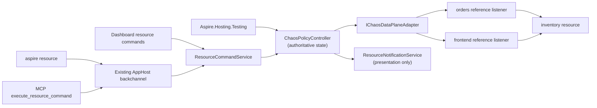

# Native Chaos hosting integration

**Status:** Proposed contribution-oriented incubation, August 2026.

## Summary

This document proposes a first-class Aspire hosting integration for local fault injection. It is not an Aspire roadmap or repository-ownership commitment. Product management has expressed enthusiastic support for the technical direction and for exploring CLI extensibility, while repository placement, architecture, and engineering ownership remain maintainer decisions.

## Decision summary

### Direction established by this proposal

- Every Phase 1 policy has two universal required fields, **resource + fault**, and one universal optional field, **fromResource**. The controller resolves `resource`, validates `fromResource` against declared AppHost references when present, infers a stable versioned logical profile, and uses that profile to select an enumerated, versioned `fault` discriminated union.
- A policy applies exactly one fault to the selected scope until explicitly removed. Omitting `fromResource` selects all callers; supplying it selects the calling Aspire resource on an existing declared reference to `resource` or an in-scope modeled descendant. Modeled Cosmos account, database, or container resources may additionally select `read`, `write`, or `query` operations. A modeled Azurite account requires the profile-specific `service` selector (`blob`, `queue`, or `table`); selecting a modeled Storage service or child resource infers that service.
- The logical profile is derived metadata, not authored policy and not a CLR type. Aspire compiles it to DCP's internal proxy topology and matcher/response templates. Policy authors never select a profile, endpoint, route, raw HTTP method, path, header, percentage, seed, policy lifetime, priority, effect order, or policy ID.
- The proposed immediate MVP fault surface remains open to review and change before approval. `http/v1` includes typed `latency`, `httpStatus`, and `rateLimit`. Resource-specific profiles add `cosmos-gateway/v1` (`latency`, `throttle`, `retryWith`, `preconditionFailed`, and `serviceUnavailable`) for the release-gated stable HTTPS Cosmos `RunAsEmulator` path, `storage/v1` with service-correct Blob, Queue, and Table members for modeled Azurite resources, and `app-configuration/v1` (`latency` and `throttle`) for the local App Configuration emulator. Real Blob, Queue, Table, Cosmos Gateway, Key Vault, App Configuration, and AI Search are separate Phase 0 reverse-proxy candidates; none enters the immediate matrix until the generic remote-upstream proof passes.
- Capabilities that require raw matchers, arbitrary headers or bodies, probabilistic or capped activation, response-stream synthesis, or protocol-specific body parsing remain proposed post-MVP work with named safety and correctness gates; they are not exposed through an unsafe generic property bag.
- Phase 1 admits a policy only when DCP can apply the requested fault unambiguously and completely across every relevant resource-wide path or every path for the selected declared caller reference. Otherwise, application fails with an actionable eligibility reason.
- Policy scopes conflict when both the destination scope and caller scope overlap. A resource-wide policy conflicts with every caller-specific policy on the same ordinary resource or overlapping Cosmos or Storage hierarchy; caller-specific policies for distinct callers may coexist.
- Use one authoritative controller for CLI, dashboard, MCP, and tests. The CLI remains a client of resource commands rather than a second policy engine.
- Use the typed JSON policy document as canonical CLI input through `--file <path|->`; interactive authoring and typed test helpers produce that same payload rather than defining parallel schemas.
- Keep DCP endpoint topology stable for the Run session and mutate fault behavior dynamically.
- Stable listeners and caller-specific reference rewrites must exist before workload client construction. Once traffic is pre-routed, live policy revisions affect warmed clients without reconnect or restart. A policy applied to an already-direct pooled client is rejected with an actionable eligibility error; restart is not the capture contract.
- Keep the integration run-only and publish-safe. Chaos control resources and metadata do not appear in publish output.
- Explicit removal is the policy lifecycle. Test lease disposal removes the policy. AppHost shutdown or restart clears all policies.
- DCP proxies force pass-through after controller-liveness loss. The absence of a configurable policy lifetime must never strand a fault.
- Start with HTTP/1.1 and only the HTTP/2 request/response behavior proven by conformance testing. Unsupported protocols and resources fail explicitly.
- Random campaigns are a future direction. Phase 1 agents use the same explicit add and remove operations as humans.
- Caller-specific support faults a reference already declared in the AppHost model through optional `fromResource`. It does not ask users to select proxy topology or permit authors to invent an edge.
- Phase 1 proposes a release-gated Cosmos Gateway HTTPS profile for the stable `RunAsEmulator` path with protocol-correct 429 throttle, 449 Retry With, 412 precondition failed, 503 service unavailable, and latency behaviors. Experimental `RunAsPreviewEmulator`, whose endpoint is initially declared HTTP and may transition to HTTPS after developer-certificate setup, is outside the immediate matrix because its endpoint and trust lifecycle differ. `resource` names an existing modeled account, database, or container resource, and optional `operations` selects `read`, `write`, or `query`; omitted means all operations in that resource scope except that `preconditionFailed` only fires on an ETag-conditional write.
- Cosmos operation and conditional-write selection are hard release gates, not optimistic contracts. If Gateway traffic cannot be classified from URI, method, and headers without request-body parsing, Phase 1 narrows to modeled container-level all-operations support for faults that remain semantically valid and rejects selectors or `preconditionFailed` rather than guessing.
- `fromResource` ships only when DCP provides stable eager per-reference listener and address identity. That topology and its pooled-connection isolation proof are Phase 1 gates; headers and baggage are never used as caller identity.
- Real Azure resources are not impossible to intercept, but current Aspire/DCP does not do it. Today real `AzureProvisioningResource` URI outputs do not produce DCP Services/listeners, `ServiceSpec` has no remote-upstream L7/TLS target, and resolved reference values are injected into workload configuration before clients are constructed. A viable zero-AppHost-source path requires generic pre-workload per-reference listener allocation, caller-aware structured reference rewriting, and delayed upstream binding after provisioning resolves.
- Phase 1 includes a persistent, non-health Dashboard indicator on every affected main Resources row. The destination row distinguishes all-callers from caller-specific scope, a caller-specific policy also marks the `fromResource` row, and modeled Cosmos and Storage descendants identify inherited account, database, or selected-service scope.

### Recommendation

Extend the DCP proxy with a versioned fault-control contract, backed by a singleton controller provided by Aspire Hosting at run time. This follows the direction Damian suggested in the original meeting: keep Aspire's transparent proxy topology and add fault behavior at that layer.

The user-facing contract stays Aspire-native and intentionally small. DCP may retain a richer normalized capability and wire contract internally, but that vocabulary does not become the policy schema.

This proposal intentionally applies chaos to DCP. DCP does not support fault injection today: current support controls whether an endpoint is proxied and how its address is allocated. The native work therefore includes the live policy, acknowledgement, capability, liveness, and telemetry seams described below rather than routing around DCP with a second permanent proxy layer.

For the Azure immediate MVP, admit only paths that the existing Run-mode endpoint model already makes credibly interceptable without chaos-specific AppHost setup: the App Configuration emulator, the Blob, Queue, and Table endpoints of Azurite, and the stable HTTPS Cosmos `RunAsEmulator` path, each behind its named proof gates. Experimental `RunAsPreviewEmulator` is outside the immediate matrix because its endpoint starts as HTTP, may switch to HTTPS after developer-certificate setup, and follows a different endpoint and trust lifecycle. Real-resource interception is a credible extension, not current behavior: generic Aspire/DCP work must allocate a stable trusted localhost listener before workload startup, rewrite each caller's structured connection/reference value to that listener, bind its remote upstream after Azure provisioning resolves, and preserve the original upstream Host and SNI. Applying a policy through CLI, Dashboard/MCP, or `Aspire.Hosting.Testing` is the explicit Run-mode consent; there is no earlier per-resource opt-in. Publish remains byte-equivalent to the ordinary direct model.

### Decisions still required

- Whether the contribution belongs directly in `microsoft/aspire` or should continue incubating in an Azure-owned repository before moving into the Aspire namespace.
- The DCP and Aspire Hosting ownership split for the proxy fault-control contract.
- Whether a YARP-compatible adapter is useful as a temporary conformance harness while the DCP contract is implemented.
- Which HTTP/2 behaviors pass the required correctness spikes.
- Whether Aspire's existing trust-delivery infrastructure can be extended with remote-upstream listener leaf issuance and double-leg TLS validation across Windows, Linux, macOS, and supported containers, replacing stable Cosmos `RunAsEmulator`'s current disabled-validation baseline.
- Whether Dashboard owners approve the proposed general `ResourceRowIndicatorSnapshot` contract and its compact name-column rendering.
- Whether the semantic and performance budgets agreed with DCP owners support default-on availability or require process/run opt-in.
- Whether Gateway traffic proves database/container and `read|write|query` classification without request-body parsing; failure narrows Phase 1 to modeled container-level all-operations support.
- Whether DCP can completely cover Azurite's distinct Blob, Queue, and Table endpoints, classify eligible Blob conditional writes and non-batch Table update/delete requests with concrete ETags from URI, method, and standard headers, reject batch/multipart operations, and preserve service-correct response envelopes without request-body parsing.
- Whether the App Configuration emulator's HTTP path remains completely mediated for warmed SDK clients and accepts protocol-correct 429 responses without client or AppHost changes.
- Whether DCP can add stable per-reference listener identity without changing service-discovery values or breaking pooled connections.

## Background and motivation

Applications often behave differently across developer hosts, Linux containers, and shared authenticated environments. Local fault injection can expose retry, timeout, idempotency, optimistic-concurrency, and partial-failure bugs before a developer needs a scarce shared environment.

Stable Cosmos `RunAsEmulator` Gateway HTTPS faulting is a defining Phase 1 use case because it tests the architecture beyond generic HTTP status and latency: Aspire already models account/database/container identity, while useful faults must establish validated interception trust, isolate a selected hierarchy scope and operation category, and emit the exact wire shape expected by `CosmosClient`. The current stable emulator connection string sets `DisableServerCertificateValidation=True`, so that baseline does not satisfy the release gate; the shipping path must preserve client certificate validation through double-leg trust or an explicitly approved equivalent. Typed `preconditionFailed` targets an ETag-conditional write and exercises the application's lost-update handling rather than pretending that 412 is an SDK-retry case. The proposed Cosmos catalog demonstrates that resource-native authoring can remain small without reducing DCP to a Cosmos-specific proxy. Experimental `RunAsPreviewEmulator` starts with an HTTP endpoint declaration that may transition to HTTPS after developer-certificate setup and requires separate profile review because its endpoint and trust lifecycle differ.

The Aspire discussion identified the existing service proxy as the right architectural direction, and subsequent product conversations supported exploring proxy-based fault handling and CLI extensibility. This remains **contribution-oriented incubation pending maintainer and engineering decisions**, not a shipping or repository-ownership commitment.

## Design goals

1. Provide zero-setup fault injection for eligible Aspire resources in Run mode.
2. Make the complete Phase 1 policy model understandable as required `resource`, optional `fromResource`, resource-validated selectors such as Cosmos `operations`, and required typed `fault`.
3. Apply and remove faults dynamically without restarting the AppHost or changing service discovery.
4. Keep proxy topology and protocol details out of user-facing policy, CLI, and testing APIs while supporting caller selection by Aspire resource identity.
5. Route CLI, dashboard, MCP, and tests through one controller and one acknowledgement path.
6. Make every successful mutation reflect acknowledged DCP state, including forward compensation after partial application.
7. Keep tests simple and honest about resource-wide, caller-specific, typed resource-profile effects, including Cosmos retry and optimistic-concurrency behavior.
8. Keep publish output deterministic and free of run-only chaos topology or state.
9. Make active faults visible directly on every affected row in the Dashboard main Resources view, with deeper policy detail and commands on the control resource.
10. Reject unsupported resources, faults, and protocols with actionable diagnostics.

## Non-goals

- Moving workflow orchestration or environment-specific automation into Aspire.
- Providing production traffic fault injection or a production service mesh.
- Persisting policies across AppHost restarts.
- Exposing generic request selection by path, method, headers, or other raw protocol properties.
- Authoring arbitrary caller-to-destination pairs or selecting a particular proxy listener, endpoint, or route.
- Probabilistic activation, user-provided randomness, or parallel-test traffic isolation.
- Configurable policy lifetime, expiry, pause, priority, ordering, or composition.
- User selection of proxy paths or network topology.
- Random campaign execution in Phase 1.
- Supporting arbitrary L4 protocols in the first increment.
- Building a custom dashboard framework as a prerequisite.
- Replacing Azure Chaos Studio or other environment-level fault systems.
- Making application code depend on a Chaos client library.

## Terminology

| Term | Meaning |
| --- | --- |
| Policy | One explicitly applied fault over one selected destination and caller scope until explicit removal |
| Destination resource | The downstream Aspire resource named by required `resource` |
| Caller scope | All callers when `fromResource` is omitted, or the one declared calling Aspire resource named by `fromResource` |
| Logical profile | Stable versioned metadata inferred from the modeled destination, such as `http/v1`, `cosmos-gateway/v1`, or `storage/v1`; never authored policy |
| Fault catalog | The logical profile's enumerated discriminated union of supported fault types, parameters, constraints, and selectors |
| Controller | The singleton `ChaosPolicyController`, authoritative for validation, desired state, acknowledgement, cleanup, and observations |
| DCP proxy path | An internal protocol-aware path that enforces one controller revision; users never select it |
| Control resource | The synthetic run-only `ChaosEnvironmentResource` that exposes commands, aggregate health, policy details, and row indicators |
| Row indicator | A non-health Dashboard marker beside an affected resource name, published through `ResourceRowIndicatorSnapshot` |

## Product constraints

The design follows these Aspire-native constraints:

| Area | Phase 1 constraint |
| --- | --- |
| Resource model | Add one inert run-only `ChaosEnvironmentResource`; DCP carries traffic and workload resources remain unchanged |
| Topology | Keep proxy paths internal to DCP and admit only resources with complete fault coverage |
| Policy authoring | Require `resource`, optional `fromResource`, inferred catalogs, explicitly defined typed selectors, and one required typed `fault` |
| State | One AppHost controller owns authoritative desired state, acknowledgement, cleanup, and observations |
| Cleanup | Use explicit removal; controller-liveness loss forces pass-through |
| Composition | Caller and destination scope determine conflicts; overlapping applies fail deterministically |
| Isolation | Omitted `fromResource` affects all callers; a validated `fromResource` isolates one declared caller; resource profiles may add typed selectors |
| Telemetry | Retain bounded activation counts and sanitized receipts without capturing request or response bodies |
| Fault catalog | Use versioned, profile-specific discriminated unions with fixed protocol templates rather than generic transforms |
| Publish | Emit no chaos control resource, metadata, or changed workload references |
| Certificates | Replace the current stable Cosmos disabled-validation baseline with reviewed local trust on both proxy legs or an explicitly approved equivalent; never depend on disabled certificate validation |
| Automation | Keep workflow orchestration outside the hosting integration; all clients use the same controller contract |

## Existing Aspire contracts

The proposal builds on current Aspire contracts rather than inventing parallel infrastructure.

### App model and DCP proxy support

- Resources are inert model objects; lifecycle and behavior belong in annotations, services, and event handlers (`docs/specs/appmodel.md`).
- Stable endpoint annotations exist during model construction, while allocated host values resolve later (`src/Aspire.Hosting/ResourceBuilderExtensions.cs`).
- `ProxySupportAnnotation` currently contains only `ProxyEnabled` (`src/Aspire.Hosting/ApplicationModel/ProxySupportAnnotation.cs`).
- DCP service specs carry only address, port, protocol, and allocation mode; they have no remote-upstream URI, original authority/SNI, L7 route, or TLS-termination target. `Proxyless` bypasses the proxy (`src/Aspire.Hosting/Dcp/Model/Service.cs`).
- `DcpExecutor.PrepareServices` creates proxied or proxyless Services only for resources with `EndpointAnnotation`s and waits for effective addresses. Real Azure provisioning outputs do not create a Service/listener through this path, and no current model carries fault rules or live policy revisions (`src/Aspire.Hosting/Dcp/DcpExecutor.cs` and `src/Aspire.Hosting/Dcp/DcpModelUtilities.cs`).
- `YarpResource` is an existing explicit L7 proxy resource, but it does not expose dynamic fault behavior (`src/Aspire.Hosting.Yarp/YarpResource.cs`).

Adding faults and remote-upstream listeners to DCP is new product work across Hosting and DCP, not use of an existing extension point. The current gap is an unimplemented contract, not proof that real Azure interception is architecturally impossible.

### Reference and resource identity

- `EndpointReferenceAnnotation` records a reference from one resource to another resource's endpoints, and `ValueProviderContext.Caller` identifies the resource requesting a resolved value (`src/Aspire.Hosting/ApplicationModel/EndpointReferenceAnnotation.cs` and `src/Aspire.Hosting/ApplicationModel/IValueProvider.cs`). `ResourceExtensions.GetValue` passes that caller into expression resolution while executable/container configuration is gathered, before the workload process starts (`src/Aspire.Hosting/ApplicationModel/ResourceExtensions.cs`, `src/Aspire.Hosting/Dcp/ExecutableCreator.cs`, and `src/Aspire.Hosting/Dcp/ContainerCreator.cs`). This is precedent for caller-aware rewriting, not an existing stable per-reference listener implementation.
- `AzureCosmosDBResource`, `AzureCosmosDBDatabaseResource`, and `AzureCosmosDBContainerResource` are public top-level Aspire resources with public parent and logical-name identity (`src/Aspire.Hosting.Azure.CosmosDB/AzureCosmosDBResource.cs`, `AzureCosmosDBDatabaseResource.cs`, and `AzureCosmosDBContainerResource.cs`).
- `WithReference(container)` preserves a directed `ResourceRelationshipAnnotation` to that container and emits inherited `DatabaseName` plus `ContainerName` connection properties (`src/Aspire.Hosting/ResourceBuilderExtensions.cs` and `src/Aspire.Hosting.Azure.CosmosDB/AzureCosmosDBContainerResource.cs`).
- The Cosmos client component defaults emulator clients to Gateway mode and `LimitToEndpoint` before invoking the user options callback. The callback can override those values, and raw clients can bypass the component entirely, so controller conformance must observe Gateway mode and loudly reject any client whose mode cannot be proven rather than silently bypassing it (`src/Components/Aspire.Microsoft.Azure.Cosmos/AspireMicrosoftAzureCosmosExtensions.cs`). Stable `RunAsEmulator` models the HTTPS endpoint used by the immediate profile, but its current connection string sets `DisableServerCertificateValidation=True`; release therefore requires a validated-trust interception path or an explicitly approved equivalent that preserves client validation (`src/Aspire.Hosting.Azure.CosmosDB/AzureCosmosDBEmulatorConnectionString.cs`). Experimental `RunAsPreviewEmulator` initially declares HTTP and may update its URI scheme to HTTPS after developer-certificate setup, so its different endpoint and trust lifecycle keep it outside the immediate matrix (`src/Aspire.Hosting.Azure.CosmosDB/AzureCosmosDBExtensions.cs`).
- `AzureStorageResource` exposes distinct emulator `blob`, `queue`, and `table` endpoints. `AzureBlobStorageResource`, `AzureBlobStorageContainerResource`, `AzureQueueStorageResource`, `AzureQueueStorageQueueResource`, and `AzureTableStorageResource` preserve the modeled service, parent, and available child identity needed for one service-discriminated `storage/v1` profile (`src/Aspire.Hosting.Azure.Storage/AzureStorageResource.cs` and the corresponding service and child resource files).
- `AzureAppConfigurationResource.IsEmulator` and `RunAsEmulator` expose a named HTTP endpoint in Run mode and leave Publish unchanged (`src/Aspire.Hosting.Azure.AppConfiguration/AzureAppConfigurationResource.cs` and `AzureAppConfigurationExtensions.cs`).
- `AzureKustoClusterResource` similarly exposes a local HTTP emulator endpoint and modeled database children, but database selection for core operations is not safe without request-content parsing (`src/Aspire.Hosting.Azure.Kusto/AzureKustoClusterResource.cs`, `AzureKustoReadWriteDatabaseResource.cs`, and `AzureKustoBuilderExtensions.cs`).
- `AzureServiceBusResource` and `AzureEventHubsResource` preserve namespace and child identity and expose local emulator endpoints, but those endpoints carry AMQP rather than HTTP (`src/Aspire.Hosting.Azure.ServiceBus/AzureServiceBusResource.cs` and `src/Aspire.Hosting.Azure.EventHubs/AzureEventHubsResource.cs`).
- `AzureKeyVaultResource`, `AzureAppConfigurationResource`, `AzureSearchResource`, and `AzureOpenAIResource` expose modeled real-service URIs; that identity is useful for profile inference but is not evidence that current DCP interposes authenticated HTTPS (`src/Aspire.Hosting.Azure.KeyVault/AzureKeyVaultResource.cs`, `src/Aspire.Hosting.Azure.AppConfiguration/AzureAppConfigurationResource.cs`, `src/Aspire.Hosting.Azure.Search/AzureSearchResource.cs`, and `src/Aspire.Hosting.Azure.CognitiveServices/AzureOpenAIResource.cs`).
- Aspire already gathers certificate-authority trust and developer certificates for executable and container workloads (`src/Aspire.Hosting/ApplicationModel/CertificateTrustExecutionConfigurationGatherer.cs`, `src/Aspire.Hosting/Dcp/ExecutableCreator.cs`, and `src/Aspire.Hosting/Dcp/ContainerCreator.cs`). That is reusable trust-delivery infrastructure. Remote-upstream listener identity, per-authority leaf issuance, original Host/SNI forwarding, and upstream TLS validation are still missing.

These identities are sufficient for resource-driven Phase 1 authoring, but enforcement remains gated on profile-specific traffic classification, protocol-correct fixed responses, trusted TLS interception, and stable eager per-reference DCP listener identity. `DcpNameGenerator` already keys Services by resource, endpoint, and network, and value resolution already receives the caller; both are useful precedent. Neither supplies stable per-reference identity today, so Phase 1 must implement and prove that capability before `fromResource` or a real-resource path can ship.

### Real-resource routing gap and generic extension

Current real Azure resource behavior is direct. `AzureProvisioningResource`-derived integrations expose service-specific output expressions, caller configuration is gathered and resolved, and the workload constructs its Azure SDK clients from those values (`src/Aspire.Hosting.Azure/AzureProvisioningResource.cs`, the resource files cited below, `src/Aspire.Hosting/ApplicationModel/ResourceExtensions.cs`, `src/Aspire.Hosting/Dcp/ExecutableCreator.cs`, and `src/Aspire.Hosting/Dcp/ContainerCreator.cs`). Because real outputs do not create `EndpointAnnotation`s, `DcpExecutor.PrepareServices` creates no corresponding listener. Because `ServiceSpec` has no remote-upstream contract, DCP cannot take an Azure URI, terminate local TLS, and forward with the original authority. This is why real-resource support is unimplemented and unproven for the immediate MVP.

The viable zero-AppHost-source extension is generic Aspire/DCP product work:

1. When a real-resource policy is explicitly applied before its dependent workload is released, enumerate the selected structured references and allocate one stable localhost listener identity per destination/reference scope, including distinct caller identity when `fromResource` is supported.
2. During caller-aware value resolution, rewrite only the structured endpoint/connection properties for that caller to the stable listener. Do not ask AppHost code or application code to opt in, add annotations, or construct a chaos client.
3. After Azure provisioning resolves the real service URI, bind the listener's upstream to that URI without changing the already-injected listener address.
4. Terminate client TLS with a locally trusted leaf for the listener identity, validate upstream TLS normally, and forward the original Azure Host header and SNI so routing, signatures, and token audience remain service-correct.
5. Keep the listener pass-through with an empty policy and apply full-snapshot policy revisions live. A warmed client already using the listener observes later revisions without reconnect or restart.
6. Reject any reference that cannot be rewritten before client construction, any client path that bypasses the listener, and any security posture that cannot protect decrypted credentials and request content.

This extension is not a chaos-specific AppHost API. It is a generic remote-upstream listener and structured-reference-routing capability that chaos can consume. Applying the initial real-resource policy is the Run-mode consent boundary and must happen before the selected workload constructs its client; the controller does not passively terminate real-resource TLS before that consent. Publish and Deploy continue to resolve and emit the original direct Azure values, with no listener, trust material, policy, or rewritten reference.

### Resource commands and clients

`WithCommand` binds a resource command to an AppHost callback with dependency injection, logging, cancellation, and validated arguments (`src/Aspire.Hosting/ResourceBuilderExtensions.cs` and `src/Aspire.Hosting/ApplicationModel/ResourceCommandService.cs`).

The dashboard, CLI, and MCP already dispatch those commands through the AppHost backchannel:

- `src/Aspire.Cli/Commands/ResourceCommand.cs`
- `src/Aspire.Cli/Commands/ResourceCommandHelper.cs`
- `src/Aspire.Hosting/Backchannel/AuxiliaryBackchannelRpcTarget.cs`
- `src/Aspire.Cli/Mcp/Tools/ExecuteResourceCommandTool.cs`
- `docs/specs/cli-backchannel.md`

Chaos commands that promise JSON must return exactly one valid JSON document and mark it as JSON. A chaos-specific backchannel method is not required.

### Testing and eventing

Current `Aspire.Hosting.Testing` surfaces include builder callbacks, `BuildAsync`, `StartAsync`, endpoint lookup, application services, and disposal (`src/Aspire.Hosting.Testing/DistributedApplicationTestingBuilder.cs` and `src/Aspire.Hosting.Testing/DistributedApplicationFactory.cs`).

The integration must not use obsolete `IDistributedApplicationLifecycleHook`. A long-lived controller should register through `IDistributedApplicationEventingSubscriber`, retain subscription tokens, unsubscribe during disposal, and observe AppHost shutdown and resource lifecycle events.

### Presentation state

`CustomResourceSnapshot` and `ResourceNotificationService` describe dashboard state. They are not a policy database or data-plane contract (`src/Aspire.Hosting/ApplicationModel/CustomResourceSnapshot.cs` and `src/Aspire.Hosting/ApplicationModel/ResourceNotificationService.cs`).

Today the main Resources grid renders the resource icon and name, lifecycle state and health-derived state icon, URLs, and actions. Highlighted properties and relationships appear only after opening resource details. Resource commands appear in the Actions column, and notifications can link to an action, but there is no general contract for a controller resource to place a compact indicator on another resource's main-grid row (`src/Aspire.Dashboard/Components/Pages/Resources.razor`, `ResourceNameDisplay.razor`, `StateColumnDisplay.razor`, and `ResourceDetails.razor`).

Phase 1 therefore requires the small general-purpose `ResourceRowIndicatorSnapshot` contract described in [Dashboard visualization](#dashboard-visualization). Reusing lifecycle state or health would report false semantics, while a property or relationship alone would remain invisible in the main view.

## Architecture



The architecture has four layers:

1. **App-model resources, declared references, and DCP capabilities** determine whether a fault can cover a destination resource or one caller's references completely.
2. **`ChaosPolicyController`** resolves the resource, validates optional caller identity against existing references, infers the resource's stable logical profile and enumerated fault catalog, validates the policy, and owns active policies, generated policy IDs, revisions, leases, acknowledgement, and bounded activation observations.
3. **`IChaosDataPlaneAdapter`** translates the small Aspire policy and selectors validated by the inferred catalog into DCP's internal desired-state contract.
4. **DCP proxies** inject faults and report acknowledgement, liveness, and bounded observations.

All control-plane clients use the controller. No client writes directly to proxy state, and workload headers or baggage never establish caller identity.

### Implicit control resource

Aspire Hosting automatically adds one visible run-only `ChaosEnvironmentResource` when the selected DCP version advertises fault-control capability. This synthetic resource exposes commands, aggregate status, policy details, and the replace-all row-indicator projection; it does not carry traffic or add a network hop.

`chaos` is the preferred resource name, not a reserved name. If user code already uses it, Aspire chooses the first deterministic fallback (`aspire-chaos`, then a numeric suffix). The resolved name appears in startup logs, the dashboard, and `aspire resource list`.

No `AddChaos`, special reference API, or per-resource setting is required. Every resource remains pass-through until a policy is applied. Standard resource declarations, references, and service-discovery values do not change.

Default-on availability in Run mode is conditional on Phase 0 proving semantic and performance budgets agreed with DCP owners. If those budgets pass, the capability is available by default with administrative opt-out through `ASPIRE_CHAOS_ENABLED=false`. If they fail, it ships default-off with process/run opt-in through `ASPIRE_CHAOS_ENABLED=true`. Publish and Deploy never enable the capability.

### Resource eligibility

The `resource` field names the downstream Aspire resource receiving the traffic. For example, `"resource": "inventory"` applies the fault on requests entering `inventory`; it does not fault requests originating from `inventory`.

Optional `fromResource` names the calling Aspire resource on an existing reference to `resource` or, for a hierarchical account scope, an eligible modeled descendant. For example, `"fromResource": "orders", "resource": "inventory"` selects the declared `orders -> inventory` reference while leaving `frontend -> inventory` unaffected. `"fromResource": "worker", "resource": "storage", "service": "queue"` may select the declared `worker -> orders-queue` edge because that queue is inside the selected service scope. Omitting `fromResource` selects all callers. Both fields use Aspire resource identity, not DNS names, listeners, endpoint addresses, or arbitrary caller/destination strings.

The controller validates the edge from the AppHost model before activation. Ordinary references use their declared endpoint/reference relationships. Cosmos and Storage child-resource references use their modeled parent identity, including relationships created by `WithReference(container)` or `WithReference(queue)` even though connection properties inherit account/service values. A caller must reference the selected resource or an eligible descendant inside its hierarchical scope; inherited connection properties do not authorize an unrelated caller or an unsupported sibling service.

If one caller has multiple declared references to the same destination resource, `fromResource` selects all of those references. DCP must cover every selected path atomically; the controller rejects an ambiguous or partially mediated set rather than choosing one reference. A caller with no declared edge is rejected. This keeps policy semantics stable if the AppHost adds another endpoint reference later.

Enforcement requires DCP to eagerly allocate distinct per-reference proxy/listener/address identity at startup. Service-discovery values must remain stable while policies mutate, including for warmed pooled connections. Phase 1 cannot ship `fromResource` until the DCP contract expresses that caller dimension and the proof gate demonstrates isolation across multiple callers and multiple references. Propagating caller identity in a header or baggage is rejected: it is spoofable, requires application changes, and does not cover Cosmos or direct protocols.

A resource is eligible for a fault only when:

- the resource exists in the current AppHost model;
- `fromResource`, when supplied, exists and is the caller side of at least one declared AppHost reference to `resource` or an in-scope modeled descendant selected by a hierarchical profile;
- the controller can infer a supported logical profile and catalog version from that resource;
- every relevant resource-wide path, or every declared path for `fromResource`, is mediated by a DCP proxy that supports the fault;
- each selected caller path has stable eager listener and address identity for the Run session;
- DCP can preserve pass-through behavior for the resource's protocol;
- applying the fault has one complete, unambiguous meaning for the resource;
- every explicitly defined resource-profile selector is valid and enforceable for that resource type; and
- DCP can acknowledge the same desired revision across every enforcing proxy path.

If any condition fails, the controller rejects the apply before activation. Diagnostics name the resource and explain what the developer can change. Example reasons include:

- the resource uses a proxyless path;
- some host or container traffic bypasses DCP;
- the resource exposes a protocol unsupported by the requested fault;
- HTTPS interception is not available;
- multiple relevant paths cannot be covered atomically; or
- the selected caller has no declared reference to the destination or one of its multiple references lacks stable DCP identity; or
- the selected DCP version does not advertise the required capability.

`list-resources` and `describe-resource` resolve the app model and report the inferred logical profile, eligible faults, their typed required and optional parameters, profile selectors, eligible `fromResource` callers, and actionable ineligibility reasons. These commands serialize the approved MVP support matrix directly, including ineligible Azure resources with no profile. A developer does not need to guess resource names or understand CLR types, listeners, or address allocation. Each row shows:

| Column | Purpose |
| --- | --- |
| Resource name | The exact identifier to use in `resource` |
| Modeled resource type | Discoverability context such as project, container, or `AzureCosmosDBContainerResource`; never authored policy |
| Logical profile/version | Stable controller contract such as `http/v1` or `cosmos-gateway/v1`; inferred rather than authored and not a CLR type |
| Parent hierarchy | The modeled account -> service/database -> child chain, when the resource has one |
| Supported faults | Enumerated fault types plus JSON types, constraints, required and optional member parameters, and profile selectors from the shipping MVP matrix |
| Eligible callers | Aspire resource names accepted by `fromResource`, grouped with the number of declared references they cover; empty when caller-specific routing is unavailable |
| Eligibility reason | Why the resource is eligible, or the specific actionable reason it is not |

For example:

| Resource name | Modeled resource type | Logical profile/version | Parent hierarchy | Supported faults | Eligible callers | Eligibility reason |
| --- | --- | --- | --- | --- | --- | --- |
| `inventory` | Project | `http/v1` | — | `latency(minimum, maximum)`, `httpStatus(statusCode)`, `rateLimit(requestsPerWindow, window, retryAfter?)` | `orders` (1), `frontend` (2) | Eligible |
| `carts` | `AzureCosmosDBContainerResource` | `cosmos-gateway/v1` | `cosmos` -> `shop-db` -> `carts` | `latency`, `throttle`, `retryWith`, `preconditionFailed`, `serviceUnavailable`; typed operation constraints apply | `orders` (1) | Eligible when modeled with `AddContainer`, referenced by `orders`, running through stable HTTPS `RunAsEmulator`, observed in Gateway mode, and the validated-trust release gate passes |
| `storage` | `AzureStorageResource` | `storage/v1` | — | Requires `service`; faults are projected from the selected Blob, Queue, or Table catalog | `worker` (1), `api` (1) | Eligible for one selected Azurite service only when every matching path for that service is mediated |
| `images` | `AzureBlobStorageContainerResource` | `storage/v1` | `storage` -> `blobs` -> `images` | `latency`, `serverBusy`, eligible conditional-write-only `preconditionFailed` | `api` (1) | Eligible when modeled under Azurite and URI-only container plus conditional-write classification pass; conditional GET/HEAD and Blob batch are excluded |
| `orders-queue` | `AzureQueueStorageQueueResource` | `storage/v1` | `storage` -> `queues` -> `orders-queue` | `latency`, `serverBusy` | `worker` (1) | Eligible when modeled under Azurite and every selected queue path is mediated |
| `tables` | `AzureTableStorageResource` | `storage/v1` | `storage` -> `tables` | `latency`, `serverBusy`, concrete-ETag `updateConditionNotSatisfied` | `api` (1) | Eligible service-wide when modeled under Azurite and non-batch update/delete with concrete ETag `If-Match` is classifiable without bodies; `If-Match: *` and `$batch` are excluded |
| `settings` | `AzureAppConfigurationResource` | `app-configuration/v1` | — | `latency`, `throttle(retryAfter)` | `api` (1) | Eligible only in emulator mode when the named HTTP path is completely mediated |
| `vault` | `AzureKeyVaultResource` | — | — | — | — | Phase 0 candidate: current DCP creates no remote-upstream listener; generic routing, existing trust-delivery extension, authority/auth/private-endpoint, complete-path, and secret-handling proofs remain |

Phase 0 must census representative and playground resources and record eligibility reasons. Low coverage should become explicit roadmap evidence, not an excuse to expose proxy topology in the v1 contract.

For the Phase 1 Cosmos profile, the same `resource` field may name an existing `AzureCosmosDBResource`, `AzureCosmosDBDatabaseResource`, or `AzureCosmosDBContainerResource`; see [How resource selection works](#how-resource-selection-works) for the account/database/container scoping table. No duplicate database or container string fields are added: `"resource": "carts"` selects the modeled container resource named `carts`, including its public parent and logical container identity. Storage similarly uses the modeled account, service, or child resource. A service or child infers Blob, Queue, or Table; the account requires one typed `service` value because the three endpoints have different wire contracts. Data Lake stays ineligible in emulator mode. Authors never select profile identifiers; those remain derived output metadata.

The first immediate Cosmos target is a modeled resource using stable `RunAsEmulator` with its HTTPS endpoint and a client observed in Gateway mode. Its current connection string disables server certificate validation, so release remains gated on replacing that baseline with a validated-trust interception path or an explicitly approved equivalent that preserves client validation. Experimental `RunAsPreviewEmulator` initially declares HTTP and may transition to HTTPS after developer-certificate setup; it is outside this immediate profile because it is experimental and has a different endpoint and trust lifecycle. Real Cosmos Gateway is a separate Phase 0 path only for clients proven before construction to use Gateway plus `LimitToEndpoint`; Direct/TCP (RNTBD), raw clients, component callbacks that bypass the listener, and consumers whose connection mode cannot be proven are ineligible and fail loudly rather than no-op. EF Core may use containers that are not modeled as `AzureCosmosDBContainerResource`. `list-resources` must warn about that gap, and container-scoped selection requires the AppHost to model the container with `AddContainer`.

### Stable startup and connection semantics

DCP resource-wide and per-reference proxy paths for ordinary resources and modeled emulators are established eagerly before workload startup whether or not a policy is active. For a real-resource candidate, the initial policy must be applied before the selected workload is released; that explicit action allocates the path and rewrites every selected reference before client construction. After the path exists, an empty policy set is pass-through. Applying and removing later policies never rewrites service-discovery values or restarts workloads.

Once a client is pre-routed through that listener, an acknowledged live policy revision affects its next dispatched request even when the client and connection pool are warm. A late policy cannot capture a client that was constructed from an unrevised direct Azure URI. The controller must reject that path as not pre-routed and explain which reference or client path bypassed interception; asking the developer to restart as the normal activation mechanism or silently reporting success is prohibited.

When DCP advertises HTTP chaos capability, the relevant path remains protocol-aware for the entire Run session. It must not switch from L4 forwarding to L7 handling when the first policy arrives.

Acknowledged revision R governs every request dispatched after acknowledgement, including requests on pooled connections. A request already in flight keeps the revision selected at dispatch. Removal uses the same boundary: after acknowledgement, the next dispatched request passes through.

Conformance coverage includes headers, trailers, connection reuse, `Expect: 100-continue`, cancellation, and HTTP/2 flow control. Tests must warm pools from at least two callers, apply a caller-specific policy and prove only the selected caller's next request faults, then remove it and prove both callers pass without reconnecting. Multiple references from one caller must remain covered by the same policy and acknowledgement.

## DCP proxy extension

### Native path

The recommended path extends DCP and Aspire Hosting with:

- versioned capability discovery;
- stable eager per-reference listener and address identity;
- generic remote-upstream listeners whose upstream can bind after provisioning while their caller-visible address stays fixed;
- caller-aware structured connection/reference rewriting before workload startup;
- trusted localhost TLS termination, per-authority leaf identity, original Host/SNI forwarding, and validated upstream TLS;
- live full-snapshot policy updates;
- revision acknowledgement and structured rejection;
- protocol-aware proxy behavior;
- controller-liveness fail-safe behavior; and
- bounded activation telemetry.

The internal DCP contract may describe proxy path coverage, protocol details, normalized effect configuration, matcher/response templates, and compatibility versions. Those are generic platform contracts between Hosting and DCP. Aspire infers the logical profile from modeled resource identity, validates its enumerated fault catalog, and compiles typed operations into those templates; raw HTTP methods, paths, headers, Cosmos response details, and the inferred profile identifier are not fields in authored policy.

The minimal operations are:

- `GetCapabilities`, which returns resource coverage and normalized effect capabilities that Aspire intersects with its versioned logical fault catalogs;
- `SetDesiredPolicies(revision, policies[])`, which sends the complete desired snapshot; and
- `GetStatus`, which returns the acknowledged revision, controller-liveness state, bounded observations, and structured rejection details.

### Incubation fallback

An explicit run-only YARP-compatible proxy and controller can serve as a conformance harness if DCP sequencing would otherwise block policy validation. It is not the product topology: it adds visible resources, address rewriting, and another network hop.

`IChaosDataPlaneAdapter` keeps controller behavior independent of that choice. CLI commands, leases, generated policy IDs, acknowledgement, telemetry, and dashboard projections remain the same.

## Phase 1 policy model

Every Phase 1 policy has these universal fields:

| Field | Meaning |
| --- | --- |
| `resource` | Required downstream Aspire resource name; the fault applies on requests entering this resource |
| `fromResource` | Optional calling Aspire resource on an existing declared reference to `resource` or an eligible descendant inside a hierarchical scope; omitted means all callers |
| `fault` | Required member of the inferred profile's discriminated union; `fault.type` is the discriminator |

The controller resolves `resource` and optional `fromResource` against the AppHost model before interpreting `fault`. It infers a stable, versioned logical profile from `resource`, then uses `fault.type` to select one member schema from that profile's enumerated discriminated union. Each member has explicit required and optional typed parameters. Authors do not provide `resourceType`, `profile`, or a generic parameter bag. The inferred profile is not a CLR type and may evolve only through explicit catalog versioning.

### Proposed immediate MVP support matrix

The matrix below is a proposal and remains open to review and change before approval. Once a logical profile version is approved and shipped, its runtime schema is enumerated and profile-specific: discovery, validation, CLI prompting, Dashboard controls, MCP, and typed testing helpers all project that same versioned matrix rather than accepting arbitrary property bags, falling back to generic HTTP, or maintaining separate fault lists. Later catalog changes use explicit profile versioning and compatibility review; this runtime constraint does not make the design discussion final.

| Stable logical profile | Aspire resource types eligible for the profile | `fault.type` | Typed fault parameters | Resource-profile selectors |
| --- | --- | --- | --- | --- |
| `http/v1` | Ordinary non-Azure `ProjectResource` and author-added `ContainerResource` destinations whose selected inbound paths are fully mediated by DCP as HTTP/1.1 or proven h2c HTTP/2; no `Azure*Resource` enters this row | `latency` | `minimum` and `maximum`: required positive JSON durations; `maximum` must be greater than or equal to `minimum`; both are bounded by the DCP capability | Universal optional `fromResource`; no profile-specific selectors |
| `http/v1` | Same as above | `httpStatus` | `statusCode`: required JSON integer from 400 through 599; response body and headers come from a safe platform template and are not authored | Same as above |
| `http/v1` | Same as above | `rateLimit` | `requestsPerWindow`: required positive integer; `window`: required positive bounded JSON duration; `retryAfter`: optional non-negative bounded duration; response status is fixed at 429 | Same as above |
| `cosmos-gateway/v1` | `AzureCosmosDBResource`, `AzureCosmosDBDatabaseResource`, or `AzureCosmosDBContainerResource` under a modeled account using stable HTTPS `RunAsEmulator` with observed Gateway-mode clients and the validated-trust release gate satisfied; experimental `RunAsPreviewEmulator`, whose endpoint starts as HTTP and may transition to HTTPS after developer-certificate setup, is excluded because its endpoint and trust lifecycle differ | `latency` | Same required `minimum` and `maximum` contract as `http/v1` | Universal optional `fromResource`; optional non-empty unique `operations` containing only `read`, `write`, and `query`; omission means all operations in the selected hierarchy scope |
| `cosmos-gateway/v1` | Same as above | `throttle` | `retryAfter`: required non-negative bounded JSON duration; DCP emits fixed 429, `x-ms-retry-after-ms`, `x-ms-substatus: 3200`, and Cosmos `TooManyRequests` body | Same as above |
| `cosmos-gateway/v1` | Same as above | `retryWith` | No authored parameters; DCP emits fixed 449 Retry With and the reviewed Cosmos `RetryWith` response body, not a 409-style conflict body | `operations`, when supplied, must be exactly `write`; omission still limits activation to classified writes |
| `cosmos-gateway/v1` | Same as above | `preconditionFailed` | No authored parameters; DCP emits fixed 412, `x-ms-substatus: 0`, and the Cosmos `PreconditionFailed` body | `operations`, when supplied, must be exactly `write`; the internal profile additionally requires a classified ETag-conditional write and never faults an unconditional create |
| `cosmos-gateway/v1` | Same as above | `serviceUnavailable` | No authored parameters; DCP emits fixed 503, `x-ms-substatus: 0`, and the Cosmos `ServiceUnavailable` body | Same optional `operations` selector as `latency` and `throttle` |
| `storage/v1` | `AzureStorageResource` with `service: "blob"`, `AzureBlobStorageResource`, or `AzureBlobStorageContainerResource` under an `AzureStorageResource` running as Azurite | `latency` | Same required `minimum` and `maximum` contract as `http/v1` | Universal optional `fromResource`; service is inferred except at account scope; container scope is classified from URI; no authored path, method, header, or body selector |
| `storage/v1` | Same Blob scope as above | `serverBusy` | No authored parameters; DCP emits fixed 503, `x-ms-error-code: ServerBusy`, and the Azure Storage XML error envelope | Same Blob scope as above |
| `storage/v1` | Same Blob scope as above | `preconditionFailed` | No authored parameters; DCP emits fixed 412, `x-ms-error-code: ConditionNotMet`, and the Azure Storage XML error envelope | The internal profile requires an eligible conditional Blob write. Conditional GET/HEAD paths that can produce 304 are excluded, as are Blob batch/multipart operations |
| `storage/v1` | `AzureStorageResource` with `service: "queue"`, `AzureQueueStorageResource`, or `AzureQueueStorageQueueResource` under Azurite | `latency` | Same required `minimum` and `maximum` contract as `http/v1` | Universal optional `fromResource`; service is inferred except at account scope; queue scope is classified from URI |
| `storage/v1` | Same Queue scope as above | `serverBusy` | No authored parameters; DCP emits fixed 503, `x-ms-error-code: ServerBusy`, and the Azure Storage XML error envelope | Same Queue scope as above; no Queue ETag fault is claimed |
| `storage/v1` | `AzureStorageResource` with `service: "table"` or `AzureTableStorageResource` under Azurite | `latency` | Same required `minimum` and `maximum` contract as `http/v1` | Universal optional `fromResource`; service is inferred except at account scope; Aspire has no modeled individual table child |
| `storage/v1` | Same Table scope as above | `serverBusy` | No authored parameters; DCP emits fixed 503 with the reviewed Table error envelope for the request's API version and media type | Same Table scope as above |
| `storage/v1` | Same Table scope as above | `updateConditionNotSatisfied` | No authored parameters; DCP emits fixed 412 with Table error code `UpdateConditionNotSatisfied` and the reviewed Table error envelope for the request's API version and media type | The internal profile requires a non-batch entity update or delete with a concrete ETag in `If-Match`; `If-Match: *`, Table `$batch`, and multipart suboperations are excluded |
| `app-configuration/v1` | `AzureAppConfigurationResource` running through `RunAsEmulator` | `latency` | Same required `minimum` and `maximum` contract as `http/v1` | Universal optional `fromResource`; emulator only; no key, label, path, header, or body selector |
| `app-configuration/v1` | Same as above | `throttle` | `retryAfter`: required non-negative bounded JSON duration; DCP emits fixed 429, `retry-after-ms`, the App Configuration media type, and the documented problem body | Same as above |

No other Azure resource type has an immediate MVP chaos profile. The following real-resource paths are credible Phase 0 candidates, not current DCP support and not implicit members of the immediate matrix:

| Candidate path | Possible profile after proof | Required Phase 0 evidence before MVP graduation |
| --- | --- | --- |
| Real Blob, Queue, and Table | Service-specific members of `storage/v1` | The minimum Entra-auth Blob PoC below, then SharedKey, SAS, Queue, Table, private endpoint, secondary-URI bypass, service-specific URI, signed-request, and exact typed-fault proofs |
| Real Cosmos Gateway | `cosmos-gateway/v1` | The first-party client path is forced or observed as Gateway plus `LimitToEndpoint` before construction; regional discovery and alternate endpoints are excluded; token audience, trust, security, warmed-client, and fixed-response proofs pass |
| Real Key Vault | `key-vault-https/v1` | Generic remote-upstream listener support, original Host/SNI, bearer-token audience, private endpoint, complete client-path, caller-isolation, retry, and decrypted-secret handling proofs |
| Real App Configuration | `app-configuration/v1` | Generic remote-upstream listener support, original Host/SNI, Entra and connection-string auth, private endpoint, complete client-path, caller-isolation, and fixed 429 proofs |
| Real AI Search | A reviewed `search-https/v1` | Generic remote-upstream listener support, original Host/SNI, API-key and Entra auth, private endpoint, complete client-path, caller-isolation, latency, and fixed 503 proofs |

Real Storage, real Cosmos Gateway, Key Vault, real App Configuration, and AI Search remain unavailable until those rows graduate through explicit matrix review. Data Lake, Azure OpenAI, Kusto, Service Bus, Event Hubs, Redis, SQL, PostgreSQL, SignalR, Web PubSub, and every other `Azure*Resource` outside the immediate rows appear in discovery with no active profile and an actionable eligibility or phase reason. The controller never falls back from an unknown Azure resource type to `http/v1`, applies one Storage service's response template to another service, or treats a real-service URI as proof that current DCP already intercepts it.

Catalog membership is profile-specific. Resolving ordinary `inventory` to `http/v1` permits only `latency`, `httpStatus`, and `rateLimit`. Resolving a modeled Cosmos resource permits the five Cosmos members above, including the demonstrated 412 `preconditionFailed` behavior. Resolving an Azurite account with `service: "blob"` or a modeled Blob child selects only the Blob members; Queue and Table resolve their own subsets inside the same `storage/v1` profile. Resolving an App Configuration emulator permits only `latency` and `throttle`. No fault type, parameter schema, response template, or selector implicitly carries across profiles.

The Cosmos `operations` and conditional-write selectors ship only if classification from URI, method, and headers passes its release gate without body parsing. If general operation classification fails, the account and database rows are removed, the container row rejects `operations`, and only members whose semantics remain provable at container-wide scope may ship. If ETag-conditional writes cannot be identified unambiguously, `preconditionFailed` remains excluded rather than applying a synthetic 412 to unrelated requests. Cosmos 449 always means Retry With/`RetryWith`; it is a transient write response and must not reuse the generic 409 Conflict body.

The existing `key-vault-https/v1` design remains `latency` plus protocol-correct 429 `throttle(retryAfter)`, but it is a Phase 0 candidate rather than an immediate matrix row. Existing certificate trust delivery removes the need to treat trust as nonexistent, but it does not supply the remote-upstream listener or leaf identity. DCP must prove that generic pre-start routing preserves HTTPS authority, certificate identity, Azure SDK token audience, private-endpoint routing, complete client paths, caller isolation, and decrypted-secret hygiene without AppHost changes, after-start trust mutation, or accept-any validation. Failure leaves the profile unavailable.

#### Ranked Azure candidate assessment

This ranking starts from current Aspire resource identity and reference data, then asks whether DCP can establish a complete Run-mode path without chaos-specific AppHost setup. Applying a policy is the consent boundary. Publish always uses the ordinary direct model: no row below may emit a chaos resource, profile, policy, credential, trust material, listener, altered reference, or other chaos metadata.

| Rank | Candidate and exact Aspire identity | Current versus proposed path | Protocol and wire-correct typed fault fit | Dynamic DCP and trust assessment | Decision and proof gate | Publish safety |
| ---: | --- | --- | --- | --- | --- | --- |
| 1 | Azurite Blob/Queue/Table: `AzureStorageResource`, `AzureBlobStorageResource`, `AzureBlobStorageContainerResource`, `AzureQueueStorageResource`, `AzureQueueStorageQueueResource`, and `AzureTableStorageResource` (`src/Aspire.Hosting.Azure.Storage`) | Current Run-mode emulator endpoints are modeled; interception is proposed | Distinct HTTP endpoints. Blob: latency, fixed 503 `ServerBusy`, and eligible conditional-write 412 `ConditionNotMet`; conditional GET/HEAD 304 is not this fault. Queue: latency and fixed 503 `ServerBusy`, with no ETag fault. Table: latency, fixed 503, and non-batch update/delete 412 `UpdateConditionNotSatisfied` only for concrete ETag `If-Match`; `If-Match: *` is unconditional. Blob batch, Table `$batch`, and multipart suboperations are rejected without body parsing | Credible because the model exposes separate Azurite endpoints and parent/child identity. DCP must eagerly mediate every selected reference and classify eligible operations without bodies | **Immediate MVP.** Prove warmed-client coverage, service isolation, exact envelopes, batch rejection, conditional-only activation, and account `service` selection | Publish emits the existing direct Storage references only |
| 2 | Real Blob/Queue/Table using the same Storage resource identities | Current Hosting injects service-specific real URI outputs directly; DCP creates no listener for them | The Azurite typed catalog is a starting point, but real-service auth and API/version behavior require separate conformance. Storage bearer tokens retain the fixed Storage audience while SharedKey/SAS signatures depend on original authority and request shape | Credible generic extension, not current support. Allocate and inject a stable trusted localhost listener before client construction, bind upstream after provisioning, and preserve original Host/SNI. Prove service-specific URIs, secondary-URI bypass, private endpoints, warmed pools, signed requests, bearer-token handling, and zero restart | **Phase 0 spike then MVP.** Lead with the minimum Entra-auth Blob PoC; repeat SharedKey, SAS, Queue, Table, and private-endpoint cases before graduation | Publish remains direct and byte-equivalent to the ordinary Storage references |
| 3 | App Configuration emulator: `AzureAppConfigurationResource` with `IsEmulator` and `RunAsEmulator` (`src/Aspire.Hosting.Azure.AppConfiguration`) | Current named local HTTP endpoint is modeled; interception is proposed | Latency and fixed 429 throttle with `retry-after-ms` and the documented [App Configuration throttling response](https://learn.microsoft.com/azure/azure-app-configuration/rest-api-throttling) | Credible because endpoint identity and anonymous local connection data exist. DCP must prove the complete warmed SDK path | **Immediate MVP.** Prove every SDK path uses the listener and accepts the fixed 429 shape | Publish ignores emulator substitution and emits the normal direct reference |
| 4 | Stable Cosmos `RunAsEmulator`: `AzureCosmosDBResource`, `AzureCosmosDBDatabaseResource`, and `AzureCosmosDBContainerResource` (`src/Aspire.Hosting.Azure.CosmosDB`) | Current stable emulator endpoint is modeled; experimental `RunAsPreviewEmulator` has a distinct lifecycle | Gateway HTTPS. Latency, 429 throttle, 449 Retry With/`RetryWith`, conditional-only 412 precondition failed, and 503 service unavailable | Credible only after replacing the disabled-validation baseline with validated trust or an approved equivalent and proving URI/method/header classification. Component defaults are not proof because callbacks and raw clients can bypass them | **Immediate MVP, release-gated.** Preserve scope, no-body-parsing, and loud rejection of unobserved modes | Publish emits the normal Cosmos model and direct references |
| 5 | Real Cosmos Gateway using the same modeled account/database/container identities | Current real account URI is injected directly; default SDK transport is Direct/RNTBD, not DCP HTTP | The Gateway catalog is plausible only for a client path forced or observed as Gateway plus `LimitToEndpoint` before construction. Default Direct/RNTBD, regional discovery, raw clients, and unprovable modes bypass an HTTP listener | Credible generic extension, not current support. Preserve Cosmos token audience and original Host/SNI, exclude alternate/regional endpoints, prove trusted termination and warmed-client live revisions, and reject every bypass | **Phase 0 spike then MVP** only for the proven first-party Gateway/`LimitToEndpoint` path. Default Direct/RNTBD and arbitrary clients remain post-MVP/ineligible | Publish remains the ordinary direct Cosmos reference |
| 6 | Key Vault: `AzureKeyVaultResource` (`src/Aspire.Hosting.Azure.KeyVault/AzureKeyVaultResource.cs`) | Current real vault URI is injected directly; no DCP remote listener exists | Authenticated HTTPS. Typed latency and fixed 429 throttle remain plausible | Certificate trust delivery already exists, so trust is precedent rather than the primary blocker. Missing proof is generic remote-upstream routing, leaf identity, original Host/SNI, token audience, private endpoint, complete client paths, caller isolation, and decrypted-secret handling | **Phase 0 spike then MVP** if those generic and service-specific proofs pass | Publish emits the direct vault URI and normal secret references only |
| 7 | Real App Configuration: `AzureAppConfigurationResource` | Current real endpoint output is injected directly; no DCP remote listener exists | Authenticated HTTPS. Emulator latency and fixed 429 are candidates for real-service conformance, not assumed equivalence | Same generic listener gap as Key Vault. Prove Entra and connection-string auth, original Host/SNI, private endpoint, complete SDK paths, caller isolation, and secret handling | **Phase 0 spike then MVP** after the generic remote-upstream proof | Publish emits the ordinary direct endpoint |
| 8 | Azure AI Search: `AzureSearchResource` (`src/Aspire.Hosting.Azure.Search/AzureSearchResource.cs`) | Current real URI is injected directly; no DCP remote listener exists | Authenticated HTTPS. Service-wide latency and fixed 503 are body-independent; operation-specific 412/207 are not initial members under the documented [status contract](https://learn.microsoft.com/rest/api/searchservice/http-status-codes) | Same generic listener gap. Prove API-key and Entra auth, original Host/SNI, private endpoint, complete client paths, caller isolation, and credential hygiene | **Phase 0 spike then MVP** for service-wide latency/503 if all proofs pass | Publish emits the direct Search URI only |
| 9 | Kusto: `AzureKustoClusterResource` and `AzureKustoReadWriteDatabaseResource` (`src/Aspire.Hosting.Azure.Kusto`) | Current local HTTP emulator endpoint is modeled; real clusters remain separate | Cluster-wide latency and fixed pre-response service unavailable are plausible; database identity for core requests is carried in content under the [Kusto REST API](https://learn.microsoft.com/kusto/api/rest/) | Emulator cluster path is credible. Database scope requires body parsing and is excluded; streaming ingest and partial bypass must be excluded | **Phase 0 spike then MVP** for cluster-wide emulator faults only if all SDK paths and streaming exclusions are explicit | Publish emits the ordinary Kusto model |
| 10 | Azure OpenAI: `AzureOpenAIResource` and `AzureOpenAIDeploymentResource` (`src/Aspire.Hosting.Azure.CognitiveServices`) | Current real account/deployment URI is injected directly | Authenticated HTTPS with deployment-addressed routes and streaming-capable responses. Pre-response latency and 429 are plausible, but SSE/streaming completeness is part of the supported path | Generic remote-upstream routing may solve authority and trust, but it does not prove HTTP/2/SSE cancellation, streaming, or no partial-response corruption | **Post-MVP.** Keep deferred until streaming completeness passes even if latency/429 works in a narrow spike | Publish emits direct account/deployment references |
| 11 | Service Bus: `AzureServiceBusResource` and children (`src/Aspire.Hosting.Azure.ServiceBus`) | Emulator first; real namespace later | Stateful AMQP 1.0, optionally WebSockets. Generic TCP delay/disconnect is not a typed substitute. See the [AMQP overview](https://learn.microsoft.com/azure/service-bus-messaging/service-bus-amqp-overview) | DCP has no AMQP-aware data plane and pooled sessions multiplex entities | **Phase 0 spike then MVP** only after an AMQP engine proves settlement correctness and complete coverage | Publish emits ordinary namespace/entity references |
| 12 | Event Hubs: `AzureEventHubsResource` and children (`src/Aspire.Hosting.Azure.EventHubs`) | Emulator first; real namespace later | AMQP for Azure SDK clients; real services also expose [Kafka](https://learn.microsoft.com/azure/event-hubs/azure-event-hubs-apache-kafka-overview) | AMQP sessions multiplex entities and Kafka creates a second bypass | **Phase 0 spike then MVP** only for an explicitly bounded emulator transport after protocol-aware coverage and bypass proofs | Publish emits ordinary namespace/hub references |
| 13 | Redis resources (`src/Aspire.Hosting.Azure.Redis`, `src/Aspire.Hosting.Redis`) | Local container and real services | RESP is pipelined and push-capable; command-safe typed faults require a [RESP parser](https://redis.io/docs/latest/develop/reference/protocol-spec/) | Generic delay/disconnect cannot define transaction, pub/sub, or pooled semantics | **Post-MVP.** Require a RESP-aware engine | Publish emits existing Redis references |
| 14 | SQL and PostgreSQL resources (`src/Aspire.Hosting.Azure.Sql`, `src/Aspire.Hosting.Azure.PostgreSQL`) | Local containers and real services | Stateful TDS or PostgreSQL protocols require dedicated parsing, encryption, authentication, and transaction semantics | Host/port identity does not make mid-session routing safe | **Post-MVP.** Require protocol-aware engines and pooled-session proofs | Publish emits ordinary database references |
| 15 | SignalR and Web PubSub (`src/Aspire.Hosting.Azure.SignalR`, `src/Aspire.Hosting.Azure.WebPubSub`) | Emulator and/or real service | Persistent WebSockets plus negotiate/REST/event paths | HTTP-only interception would silently miss long-lived paths | **Post-MVP.** Require WebSocket-aware complete-path semantics | Publish emits direct references |
| 16 | Data Lake: `AzureDataLakeStorageResource` and `AzureDataLakeStorageFileSystemResource` (`src/Aspire.Hosting.Azure.Storage`) | Real only; emulator mode is rejected | Authenticated HTTPS across DFS and Blob surfaces | Dual endpoints can bypass one another and require separate private-endpoint, auth, and typed-fault proof | **Phase 0 spike then MVP** only after dual-endpoint completeness; otherwise post-MVP | Publish emits direct Data Lake references |
| 17 | Deployment/control-plane resources such as Front Door, Container Registry, Network, App Service, Container Apps, Kubernetes, Operational Insights, and Application Insights (`src/Aspire.Hosting.Azure.*`) | Not an application downstream data-plane target | Deployment, ingress, management, or background telemetry rather than one declared request edge | Endpoint presence does not create an eligible workload data plane | **Excluded.** Do not infer any chaos profile | Publish behavior is unchanged |

The ranking intentionally rejects profile inflation. A new resource joins only when its modeled identity selects a complete data plane, its typed faults match the SDK's wire semantics, and generic Aspire/DCP work can eagerly establish stable per-reference routing and required trust from existing Run-mode model data. A Phase 0 spike that needs workload or AppHost source changes, a per-resource opt-in, trust-disabling client configuration, hidden metadata, request-body parsing, or a generic fallback has failed.

##### Minimum real Storage PoC and release gate

Real Storage graduation starts with one concrete Entra-authenticated `BlobServiceClient` proof, not a broad claim:

1. With zero AppHost-source and application-source changes, an explicitly applied pre-workload real-resource policy records consent, and caller-aware reference resolution substitutes the real Blob URI with a stable trusted localhost listener before the workload starts and before `BlobServiceClient` is constructed.
2. The listener binds its upstream only after provisioning resolves, validates the real certificate, and forwards the original Storage Host and SNI. The client continues to request the fixed Azure Storage token audience rather than a localhost audience.
3. The test warms the `BlobServiceClient` and its connection pool, then applies and removes latency and fixed 503 `ServerBusy` policies live. The next request observes each acknowledged revision without reconnect, workload restart, or AppHost restart.
4. The client validates the local listener certificate. No accept-any callback or disabled validation is allowed.
5. Publish output is byte-equivalent to the baseline direct reference and contains no listener, policy, trust material, or rewritten URI.

Before real Blob/Queue/Table graduates, repeat the proof with SharedKey and SAS, verify signatures survive original-authority forwarding, exercise each service-specific URI, prove secondary/retry endpoints cannot bypass the listener, and validate private-endpoint reachability. Security review must account for bearer tokens, SAS query values, SharedKey authorization, and signed request material becoming plaintext inside the local proxy after TLS termination.

#### Deferred capabilities and known exclusions

The MVP deliberately favors deterministic, resource-scoped faults with bounded schemas. The following capabilities remain outside the immediate matrix because their user and safety contracts need separate design. A candidate classified as Phase 0 spike then MVP may graduate only by adding an explicitly reviewed matrix row; the spike does not create an implicit fallback.

| Capability | Why it is useful | Requirement before inclusion |
| --- | --- | --- |
| Probabilistic or first-N activation | Exercise intermittent failures without faulting every request | Reproducible seed semantics, finite activation budgets, bounded counters, restart behavior, and freeze-to-repro workflow |
| One-shot and pause/resume controls | Trigger a targeted failure during an interactive debugging session | Acknowledged finite-budget lifecycle, race-free state transitions, controller-loss behavior, and consistent CLI/Dashboard/test semantics |
| Duplicate, drop, partial, slow-stream, or forward-then-fail responses | Exercise idempotency, cancellation, truncation handling, and ambiguous completion | Replay-safety model, cancellation and connection semantics, bounded response data, streaming protocol conformance, and explicit side-effect warnings |
| Header mutation and idempotency-key collision | Exercise application behavior around allowlisted protocol metadata | Resource-profile-owned header allowlists, secret-injection prevention, bounded cache semantics, and fixed response templates |
| Raw method, path, header, body, or activity-name matching | Target application-specific traffic not represented in the app model | A separately reviewed typed resource profile; generic authored matchers and body inspection remain prohibited |
| Authored expiry, priority, or transform composition | Coordinate richer experiments | Deterministic overlap semantics, crash cleanup, forward compensation, and compatibility rules |
| Random campaigns | Explore a broader failure space across resources | Reproducibility, budgets, exclusions, crash cleanup, freeze-to-repro, and a separate campaign design |
| Durable Task activity/queue faults | Exercise replay races and activity completion behavior | Modeled Durable Task identity, body-parsing security review if unavoidable, finite activation budgets, and queue protocol conformance |
| Service Bus delivery faults | Exercise duplicate delivery and broker failures | A separately reviewed AMQP profile and broker-protocol data plane |

Matcher, percentage, seed, policy lifetime, priority, endpoint, source, `resourceType`, `profile`, and campaign fields are not added to Phase 1. Generic HTTP method, path, header, body, or arbitrary fault-property matchers are explicitly rejected. Fields outside the universal schema or the inferred profile's enumerated selectors are rejected.

The controller generates an opaque policy ID after a successful apply. The ID is returned for later removal but is never user-authored policy content. Revision, ownership, proxy coverage, acknowledgement state, and liveness metadata remain internal.

Fault-specific parameters exist only in their discriminated-union member schema. An unknown fault type, unknown parameter, missing required parameter, or profile-specific selector outside the matrix fails before activation with a diagnostic listing every valid fault type, required and optional parameters, and selector for the resolved resource.

### Examples

**HTTP latency**

```json
{
  "resource": "inventory",
  "fromResource": "orders",
  "fault": {
    "type": "latency",
    "minimum": "2s",
    "maximum": "2s"
  }
}
```

Requests from `orders` to `inventory` receive two seconds of added latency until the policy is removed. Other callers remain unaffected because the AppHost declares a distinct reference for each caller.

**HTTP synthetic status**

```json
{
  "resource": "orders",
  "fault": {
    "type": "httpStatus",
    "statusCode": 503
  }
}
```

Every request to `orders` receives the protocol-correct synthetic response until the policy is removed because `fromResource` is omitted.

**Cosmos ETag precondition failure**

```json
{
  "resource": "operations",
  "fromResource": "workspaces-api",
  "operations": ["write"],
  "fault": {
    "type": "preconditionFailed"
  }
}
```

Only ETag-conditional writes from `workspaces-api` to the modeled `operations` container are eligible to receive the fixed Cosmos DB 412 response. The profile does not fault an unconditional create, point read, or query. This exercises the realistic case where an operation-completion write loses an optimistic-concurrency race and the application must translate `CosmosException(HttpStatusCode.PreconditionFailed)` correctly instead of leaking a 500. The user selects a modeled resource and typed operation; the profile owns detection of the standard Cosmos conditional-write wire shape.

**Storage account Queue server busy**

```json
{
  "resource": "storage",
  "fromResource": "worker",
  "service": "queue",
  "fault": {
    "type": "serverBusy"
  }
}
```

This applies a protocol-correct Azure Storage 503 `ServerBusy` response to eligible Queue traffic from `worker` through the modeled Azurite account. The account needs `service` because its Blob, Queue, and Table endpoints have different typed catalogs. Naming a modeled service or child resource infers the service instead.

**App Configuration emulator throttle**

```json
{
  "resource": "settings",
  "fromResource": "api",
  "fault": {
    "type": "throttle",
    "retryAfter": "250ms"
  }
}
```

This applies the fixed App Configuration 429 response only on the existing declared `api -> settings` emulator path. No AppHost opt-in, key selector, endpoint, raw header, or profile field appears in the policy.

### How resource selection works

Every identifier that can appear in a policy — `resource` and optional `fromResource` — is an Aspire app-model resource name: the name assigned when the resource was added in the AppHost, for example via `AddProject`, `AddContainer`, or `AddAzureCosmosDB(...).AddDatabase(...).AddContainer(...)`. The controller resolves that name by resource type and by the parent/child and reference relationships already recorded in the Aspire application model. It is never a DNS name, an Azure physical resource name, a proxy listener or endpoint address, or an arbitrary string the policy author invents.

| Resource type named by `resource` | Fault scope |
| --- | --- |
| Ordinary project or container resource | All inbound traffic when `fromResource` is omitted; otherwise all declared references from that caller to the downstream resource |
| `AzureCosmosDBResource` (account) | Every modeled database and container under that account, for all callers or the declared caller selected by `fromResource` |
| `AzureCosmosDBDatabaseResource` | Every modeled container under that database, for all callers or the declared caller selected by `fromResource` |
| `AzureCosmosDBContainerResource` | That one modeled container, for all callers or the declared caller selected by `fromResource` |
| `AzureStorageResource` (account) | One required `service` value selects the Azurite Blob, Queue, or Table endpoint plus that service's modeled descendants; Data Lake is unsupported in emulator mode |
| `AzureBlobStorageResource` | All modeled Blob traffic through that service, including modeled container descendants |
| `AzureBlobStorageContainerResource` | That one modeled Blob container, classified from URI without body parsing |
| `AzureQueueStorageResource` | All modeled queue traffic through that queue service, for all callers or the declared caller selected by `fromResource` |
| `AzureQueueStorageQueueResource` | That one modeled queue, for all callers or the declared caller selected by `fromResource` |
| `AzureTableStorageResource` | All modeled Table service traffic; Aspire models no individual table child |
| `AzureAppConfigurationResource` | All data-plane calls to the local App Configuration emulator |

Physical Azure database, container, queue, and deployment names are derived from the resource's model properties and parent chain at execution time. Authors name the Aspire resource once; they never duplicate the physical child name or service endpoint in policy.

### Cosmos container faults (Phase 1)

Assume the AppHost already models a Cosmos container with `AddContainer("carts", ...)`. The policy's `resource` field selects that existing `AzureCosmosDBContainerResource`:

```json
{
  "resource": "carts",
  "fromResource": "orders",
  "operations": ["write"],
  "fault": {
    "type": "throttle",
    "retryAfter": "1s"
  }
}
```

The table below labels each field:

| Field | Availability | Meaning |
| --- | --- | --- |
| `resource` | Phase 1 | Required downstream Aspire resource name; see [How resource selection works](#how-resource-selection-works) |
| `fromResource` | Phase 1 | Optional calling Aspire resource. Must be the caller side of an existing declared AppHost reference to `resource` or an eligible descendant inside its hierarchical scope; omitted means all callers |
| `fault` | Phase 1 | Required single fault whose type and explicitly defined parameters are validated against the inferred resource catalog |
| `operations` | Phase 1 Cosmos profile, subject to the classification release gate | Optional operation categories: `read`, `write`, `query`. Omitted means all operations within the selected resource's scope |
| `service` | Phase 1 Storage profile | Required when `resource` names `AzureStorageResource`; valid values are `blob`, `queue`, and `table`. A modeled Storage service or child infers the value and rejects an authored selector |

This policy throttles writes only from `orders` through the already-declared `orders -> carts` reference. Omitting `fromResource` would throttle writes from every caller of `carts`. The caller must have `WithReference(carts)` or the equivalent modeled child-resource relationship; inherited Cosmos connection properties do not create an edge for an unrelated caller.

`operations` describes what kind of Cosmos activity the fault applies to, in plain terms: `read` for point/item reads, `write` for creates/updates/deletes, and `query` for SQL queries. Gateway traffic capture must prove that classification from URI, method, and headers alone, without parsing request bodies. `preconditionFailed` has a stronger internal predicate: the request must be a classified write carrying the standard Cosmos ETag precondition. If body parsing is required for general operation or conditional-write classification, Phase 1 rejects the unprovable selector or member; it must not expose a misleading option or apply 412 to an unconditional request. Point-operation verbs may be added only after evidence justifies them.

In this example, `carts` specifically names the modeled Cosmos container, not the Cosmos account or database. More generally, `resource` may name an existing Aspire Cosmos account, database, or container resource to select that hierarchy scope. Authors do not repeat raw Cosmos database or container names or an inferred profile in policy. Aspire compiles the typed resource, member, parameters, and operation selectors to an internal matcher and the selected fixed Cosmos response template: 429 throttle, 449 Retry With, 412 precondition failed, 503 service unavailable, or latency. Raw HTTP paths, methods, headers, ETag detection, and response details remain internal to the profile/data-plane contract; DCP stays generic.

The immediate profile target is modeled Cosmos resources using stable `RunAsEmulator` and its HTTPS endpoint. Aspire's Cosmos component defaults emulator clients to Gateway mode and `LimitToEndpoint`, then invokes the user options callback; callers can override those defaults, and raw `CosmosClient` instances can bypass the component. The controller must therefore observe conformance and loudly reject any client not proven to use Gateway mode instead of silently leaving traffic unfaulted. Stable `RunAsEmulator` currently emits a connection string with `DisableServerCertificateValidation=True`; eligible interception must replace that baseline with Aspire-managed trust on both TLS legs across supported hosts and containers, or an explicitly approved equivalent that preserves client validation. Experimental `RunAsPreviewEmulator` initially declares HTTP and may transition to HTTPS after developer-certificate setup. It remains outside the immediate matrix because it is experimental and has a different endpoint and trust lifecycle; its initial scheme alone is not the exclusion rationale, and it does not share the stable path's trust gate. EF Core container usage not represented by an `AzureCosmosDBContainerResource` is ineligible for container scope until the AppHost uses `AddContainer`.

Real Cosmos is transport-split rather than categorically excluded. A real account may enter Phase 0 only through a first-party client-construction path that forces or observes `ConnectionMode.Gateway` and `LimitToEndpoint = true` before `CosmosClient` construction. The proof must preserve the Cosmos token audience, original Host/SNI, validated trust, and stable listener address; exclude regional endpoint discovery and failover bypass; and demonstrate live revisions on a warmed client. Default Direct/RNTBD, raw clients, callbacks that restore Direct mode or disable `LimitToEndpoint`, and any mode the controller cannot prove remain post-MVP and ineligible for DCP HTTP interception.

The Cosmos SDK's component-native fault-injection APIs are a separate alternative track. They can model Cosmos-aware faults without DCP HTTP interception, but Aspire would have to integrate them into the first-party client-construction path before `CosmosClient` is built. That is not current DCP behavior and is not zero-setup for arbitrary raw clients, so it must not be presented as a transparent fallback.

### Storage faults (Phase 1)

Azurite gives Aspire three separate HTTP endpoints under one modeled account. The profile treats them as three fixed service catalogs rather than pretending they share one response format:

| Service | Modeled scope | Immediate MVP faults | Fixed response behavior |
| --- | --- | --- | --- |
| Blob | `AzureBlobStorageResource` and `AzureBlobStorageContainerResource` | `latency`, `serverBusy`, `preconditionFailed` | XML Storage error envelope; 503 `ServerBusy`; 412 `ConditionNotMet` only for eligible conditional writes. Conditional GET/HEAD may correctly produce 304 and is excluded |
| Queue | `AzureQueueStorageResource` and `AzureQueueStorageQueueResource` | `latency`, `serverBusy` | XML Storage error envelope; 503 `ServerBusy`; no invented ETag fault |
| Table | `AzureTableStorageResource` | `latency`, `serverBusy`, `updateConditionNotSatisfied` | Reviewed Table error envelope; 503 `ServerBusy`; non-batch entity update/delete with a concrete ETag `If-Match` receives 412 `UpdateConditionNotSatisfied`; `If-Match: *` is unconditional |

Selecting a service or child resource infers the service. Selecting `AzureStorageResource` requires exactly one `service`; omission fails with `blob`, `queue`, and `table` as the valid values. Table remains service-wide because Aspire has no modeled table child. Data Lake remains ineligible because `AzureStorageResource.DataLakeUriExpression` explicitly rejects emulator mode.

Conditional faults require URI, method, and standard conditional headers only. They never parse blob or entity bodies and never turn an unconditional operation into a concurrency failure. Blob batch APIs, Table `$batch`, and multipart suboperations are rejected because selecting safe suboperations would require request-body parsing. Account-level `fromResource` is eligible only when the caller references the account or an in-scope descendant for the selected service. The controller resolves every matching service path for that caller and acknowledges them atomically; references to sibling services do not authorize the policy.

### Invalid selectors and diagnostics

The controller rejects a policy before activation whenever its identifiers do not resolve cleanly. The most important cases:

| Invalid case | Result |
| --- | --- |
| `resource` names something that does not exist in the current AppHost model | Rejected with an unknown-resource diagnostic |
| `resource` names a Cosmos container that is only reached through EF Core and was never modeled with `AddContainer` | Rejected for container scope; `list-resources` also warns about the unmodeled container |
| `operations` is supplied for a resource outside the Cosmos profile | Rejected; `operations` only has meaning for a Cosmos account, database, or container resource |
| `operations` contains `read` or `query` for `retryWith` or `preconditionFailed` | Rejected; those catalog members permit classified writes only |
| `preconditionFailed` is requested on a path where DCP cannot prove Cosmos ETag-conditional-write classification | Rejected as a profile capability gap; never broadened to every write or synthesized on an unconditional request |
| `resource` names an `AzureStorageResource` without `service`, or `service` is supplied for a modeled service or child | Rejected with the valid account values or guidance to omit the redundant selector |
| `resource` names Storage that is neither Azurite nor a graduated real-service path, or has no completely mediated path for the selected service | Rejected with `storage/v1` eligibility guidance that identifies the candidate phase, missing endpoint, or uncovered references |
| `fromResource` has references only to a sibling Storage service | Rejected with `No eligible <service> reference from <caller> to <resource>`; one service's wire behavior is never broadened to another |
| A Blob `preconditionFailed` path is a conditional GET/HEAD, Blob batch operation, multipart operation, or otherwise cannot prove an eligible conditional write | Rejected as a profile capability gap; never converted to 412 when the service can return 304 or safe classification needs body parsing |
| A Table `updateConditionNotSatisfied` path is `$batch`, multipart, not an update/delete, has `If-Match: *`, lacks a concrete ETag, or otherwise cannot prove the required operation | Rejected as a profile capability gap; never broadened to unconditional or batch operations |
| A Queue ETag or precondition fault is requested | Rejected; the Queue catalog has no ETag fault |
| `resource` names real App Configuration, or its emulator path is not completely mediated | Rejected from the immediate matrix with its Phase 0 generic remote-upstream proof or emulator-specific eligibility guidance |
| An Azure resource type is outside the immediate Cosmos, Storage, and App Configuration emulator rows | Rejected with no active inferred profile or faults and its assessment phase, for example: `vault (AzureKeyVaultResource) requires the key-vault-https/v1 remote-upstream, authority, auth, private-endpoint, complete-path, and secret-handling proof` |
| `fault.type` is not in the inferred resource catalog, or its member parameters are missing, mistyped, out of range, or unknown | Rejected with the inferred logical profile/version plus valid fault types, JSON types, constraints, and required/optional parameters, for example: `operations uses cosmos-gateway/v1; valid faults are latency(minimum: duration, maximum: duration), throttle(retryAfter: duration), retryWith(), preconditionFailed(), and serviceUnavailable()` |
| Authored input supplies `resourceType` or `profile` | Rejected; both are inferred metadata and never authored policy |
| The Cosmos client is not observed in Gateway mode, including a component callback that overrides the default or a raw client that bypasses the component | Rejected as ineligible; component defaults are not treated as conformance proof, and the controller fails loudly rather than silently no-op |
| The Cosmos resource uses experimental `RunAsPreviewEmulator`, or targets a real account whose client is not proven pre-construction as Gateway plus `LimitToEndpoint` | Rejected as outside the immediate stable `RunAsEmulator` matrix; real Gateway reports its Phase 0 path, while Direct/RNTBD, regional-discovery, raw, and unprovable clients remain ineligible |
| `fromResource` names something that does not exist | Rejected with an unknown-caller-resource diagnostic |
| `fromResource` names a resource with no existing declared reference to `resource` or an eligible in-scope descendant | Rejected; caller-specific behavior only faults references the AppHost already declares, not an arbitrary caller/destination pair |
| `fromResource` has multiple eligible references in the selected scope and any path lacks stable eager DCP identity | Rejected with the uncovered references identified; the controller never chooses one path implicitly |
| A workload client was constructed from a direct reference before stable listener substitution | Rejected as not pre-routed, with the bypassing reference/client path identified; restart is not offered as the normal policy-activation contract and success is never reported |

Phase 1 accepts only the resource type, fault, parameter, and selector combinations in the shipping matrix. It accepts `operations` only for a modeled Cosmos resource and only when the operation-classification release gate passes. It admits Cosmos or Storage conditional faults only when their standard request-metadata proofs pass. Storage service catalogs and App Configuration require their own protocol proofs and never fall back to generic HTTP. Real Storage, real Cosmos Gateway, real App Configuration, Key Vault, AI Search, Data Lake, and every other assessed candidate remain unavailable until their named phase gates pass; that status means unimplemented/unproven, not impossible. The unknown-resource, no-profile, declared-reference, and profile-eligibility rows govern every Phase 1 policy.

### One policy per overlapping scope

Two policies conflict when their destination scopes overlap and their caller scopes overlap. Omitted `fromResource` means the caller scope is all callers, so a resource-wide `inventory` policy conflicts with every caller-specific `inventory` policy. Two caller-specific policies for `orders -> inventory` conflict, while `orders -> inventory` and `frontend -> inventory` may coexist.

For Cosmos, account, database, and container ancestry defines destination overlap. An account policy overlaps every modeled database and container beneath it; a database policy overlaps its account and descendant containers; and a container policy overlaps its ancestors or another policy on that container, regardless of operation selection. Overlap becomes a conflict only when `fromResource` is omitted by either policy or both policies name the same caller. Sibling containers and distinct caller-specific scopes do not conflict.

For Storage, an account policy overlaps only the selected service and that service's modeled descendants. A Blob service policy overlaps its account's Blob selection and descendant containers; a Blob container policy overlaps its account, service, or another policy on that container. Queue follows the same service/queue hierarchy. Table service scope overlaps its account's Table selection. Distinct services under the same account do not conflict. The same caller-scope rule determines whether overlapping destinations conflict.

This rule eliminates precedence, ordering, and composition from Phase 1. Installation timing cannot change behavior. A future version may introduce explicit composition only after real scenarios justify the complexity.

## Controller state and acknowledgement

The controller owns:

- active policies keyed by generated policy ID and normalized destination/caller scope;
- lease ownership for typed testing;
- monotonically increasing desired revisions;
- per-proxy acknowledged revisions;
- bounded, sanitized activation observations;
- controller-liveness heartbeats; and
- active mutation state for command enablement.

Use a single-reader mutation queue for changes spanning registration and proxy acknowledgement. Read-only operations use immutable snapshots and remain available during mutation.

For each apply or remove, the controller validates the request, creates a new immutable desired snapshot, increments the revision, and sends the complete snapshot to every affected DCP proxy path. A resource-wide policy affects every relevant path; a caller-specific policy affects every stable per-reference path from `fromResource` to `resource`, including multiple declared references. The controller returns success only when all affected paths acknowledge the revision. A known-unavailable path rejects the mutation before it is queued, and an unresponsive path cannot block the queue indefinitely.

### Forward compensation

If one proxy path rejects or times out after another has acknowledged an apply, the controller immediately sends a compensating revision that omits the attempted policy. Ordinary failure is returned only after that compensating revision is acknowledged everywhere.

If compensation cannot converge within its fixed internal deadline, the controller returns a typed partially-applied failure naming the unresolved internal paths. Proxies that lose controller liveness force pass-through after a fixed platform safety interval. The interval is not policy content and is not configurable by the policy author.

The typed apply APIs surface partial application as a `ChaosPolicyApplyException` with cleanup ownership so test infrastructure can continue attempting removal. A rejected apply must never return ordinary failure while an acknowledged fault from that attempt remains active.

## Policy lifecycle

### Apply

Applying a policy is complete only when:

1. the resource and fault are valid;
2. no active policy has an overlapping destination and caller scope;
3. DCP confirms complete eligibility for the fault;
4. the controller creates a new desired revision; and
5. every affected proxy path acknowledges that revision.

The generated policy ID is returned only after successful acknowledgement.

### Remove

Removal uses the generated policy ID. It creates and awaits a new revision that omits that policy. Removing an already absent policy is idempotent success when the caller owns the ID or lease.

Explicit removal is the normal and only user-controlled lifecycle. Phase 1 does not include configurable expiry, pause, resume, or renewal.

### Liveness and restart

| Event | Behavior |
| --- | --- |
| Test lease disposal | Removes only that lease's policy and awaits acknowledgement |
| AppHost graceful shutdown | Attempts bounded removal of all policies before controller disposal |
| AppHost restart | Starts with an empty policy set; no policy state is persisted or replayed |
| Controller-liveness loss | DCP proxies force pass-through after the fixed platform safety interval |
| Proxy restart while AppHost remains alive | Starts pass-through, then reconciles the controller's latest desired revision |
| Workload restart | Existing resource-wide and per-reference DCP addresses and active controller policy remain unchanged |

Controller-liveness pass-through is mandatory because Phase 1 deliberately has no policy lifetime. It protects against a crashed or disconnected controller without asking users to reason about expiry.

## CLI UX

The immediate CLI uses existing resource commands, but the authored JSON policy is the canonical and scalable input. `add-policy` accepts exactly one input mode:

1. `--file <path>` reads one UTF-8 JSON policy document from a file.
2. `--file -` reads one UTF-8 JSON policy document from standard input. Requiring `-` explicitly prevents an interactive invocation from unexpectedly blocking on stdin.
3. Omitting `--file` starts an interactive resource-first builder when a terminal is available. It uses `describe-resource` to offer only declared callers, matrix-supported faults, typed parameters, and selectors, then submits the same JSON shape.

The subcommand-local `--file` spelling follows the Aspire CLI's existing file-option convention. `-` follows the standard CLI convention for explicit stdin and avoids inventing a second payload option.

The MVP does not add `--latency`, `--http-status`, `--throttle`, `--operations`, `--from-resource`, or an inline JSON argument to `add-policy`. Fault-specific flags would grow with every profile and duplicate the typed discriminated unions; inline JSON also creates avoidable shell-escaping and command-history problems. `--file` and interactive mode are mutually exclusive by construction, so there is no precedence or merge behavior. If concise convenience flags are justified later, each invocation must still construct exactly one canonical payload and must be rejected when combined with `--file`; convenience flags never override payload fields.

For example, `chaos-policy.json` can contain the ordinary caller-specific payload defined earlier:

```json
{
  "resource": "inventory",
  "fromResource": "orders",
  "fault": {
    "type": "latency",
    "minimum": "2s",
    "maximum": "2s"
  }
}
```

The demonstrated Cosmos 412 case uses the same command and payload framing:

```json
{
  "resource": "operations",
  "fromResource": "workspaces-api",
  "operations": ["write"],
  "fault": {
    "type": "preconditionFailed"
  }
}
```

An account-scoped Storage Queue fault is equally explicit:

```json
{
  "resource": "storage",
  "fromResource": "worker",
  "service": "queue",
  "fault": {
    "type": "serverBusy"
  }
}
```

`describe-resource --resource storage` reports that `service` is required and lists `blob`, `queue`, and `table` with each service's exact fault union. It groups eligible callers by service and separately identifies Data Lake and real-account paths as outside the immediate matrix.

The command surface is:

```console
aspire resource chaos add-policy --file chaos-policy.json
aspire resource chaos add-policy --file -
aspire resource chaos add-policy
aspire resource chaos remove-policy --policy-id <policy-id-returned-by-add>
aspire resource chaos list-policies
aspire resource chaos list-resources
aspire resource chaos describe-resource --resource carts
aspire resource chaos describe-resource --resource storage
```

The first two forms support repeatable automation; the third is interactive. These examples assume `chaos` is the resolved control-resource name. If user code already claimed that name, `aspire resource list` reveals the deterministic fallback.

The CLI performs only UTF-8 JSON framing and syntax parsing before passing the typed document through `ResourceCommandService` to `ChaosPolicyController`. The controller owns AppHost resource resolution, profile inference, matrix validation, conflict checks, and DCP acknowledgement. A malformed document reports file or stdin origin plus line and column. A structurally valid but unsupported policy reports JSON Pointer paths and the resolved matrix contract, for example: `$.fault.statusCode must be an integer from 400 through 599 for http/v1`. The CLI never turns the payload into a generic property bag and never calls DCP directly.

`add-policy` requires confirmation before activation, with `--yes` as the orthogonal non-interactive confirmation flag for trusted automation. `--file -` without `--yes` may prompt only when the controlling terminal supports it; otherwise it fails before consuming or applying the policy with instructions to pass `--yes`.

Illustrative `add-policy` output:

```json
{
  "controlResource": "chaos",
  "policyId": "policy-7f3a",
  "policy": {
    "resource": "inventory",
    "fromResource": "orders",
    "fault": {
      "type": "latency",
      "minimum": "2s",
      "maximum": "2s"
    }
  },
  "resourceProfile": "http/v1",
  "state": "active",
  "activationCount": 0
}
```

Illustrative `list-policies` output:

```json
{
  "controlResource": "chaos",
  "policies": [
    {
      "policyId": "policy-7f3a",
      "policy": {
        "resource": "inventory",
        "fromResource": "orders",
        "fault": {
          "type": "latency",
          "minimum": "2s",
          "maximum": "2s"
        }
      },
      "resourceProfile": "http/v1",
      "state": "active",
      "activationCount": 3
    }
  ]
}
```

The nested `policy` object is the normalized, round-trippable authored payload: it contains `resource`, optional `fromResource`, any profile selectors, and typed `fault`, and it omits output-only fields. Duration strings and selector ordering use one stable canonical form. A caller may save that object and reapply it after removing the active policy. `resourceProfile`, generated policy ID, state, and observations remain output-only sibling metadata; supplying them in authored policy is rejected.

Read-only commands remain available during mutations. Failures use nonzero command status and structured diagnostics rather than success-shaped JSON with an embedded error.

A future `aspire chaos ...` alias may provide shorter syntax over the same controller. Custom CLI extension loading must never be required for correctness or testing.

## Aspire.Hosting.Testing UX

Tests use typed, catalog-specific convenience APIs rather than shelling out or constructing generic policy property bags. Each helper serializes the same canonical policy DTO accepted by CLI file/stdin input before invoking the controller, so testing is not a second schema:

```csharp
// Proposed pseudocode. These APIs do not exist.
await using var lease = await app.ApplyHttpChaosPolicyAsync(
    resource: "inventory",
    fault: HttpChaosFault.Latency(
        minimum: TimeSpan.FromSeconds(2),
        maximum: TimeSpan.FromSeconds(2)),
    fromResource: "orders",
    cancellationToken: cancellationToken);
```

Cosmos tests use typed fault and operation selectors rather than a generic request matcher:

```csharp
// Proposed pseudocode. These APIs do not exist.
await using var lease = await app.ApplyCosmosChaosPolicyAsync(
    resource: "carts",
    fault: CosmosChaosFault.Throttle(retryAfter: TimeSpan.FromSeconds(1)),
    operations: [CosmosOperation.Write],
    fromResource: "orders",
    cancellationToken: cancellationToken);
```

An optimistic-concurrency test is equally direct:

```csharp
// Proposed pseudocode. These APIs do not exist.
await using var lease = await app.ApplyCosmosChaosPolicyAsync(
    resource: "operations",
    fault: CosmosChaosFault.PreconditionFailed(),
    operations: [CosmosOperation.Write],
    fromResource: "workspaces-api",
    cancellationToken: cancellationToken);
```

Storage tests may select the account row with a typed service selector:

```csharp
// Proposed pseudocode. These APIs do not exist.
await using var lease = await app.ApplyStorageChaosPolicyAsync(
    resource: "storage",
    service: StorageService.Queue,
    fault: StorageChaosFault.ServerBusy(),
    fromResource: "worker",
    cancellationToken: cancellationToken);
```

The method name and typed fault improve discoverability but do not author a resource profile. The optional typed parameter is named `fromResource` consistently across helpers; omitting it means all callers. `StorageService` is required only when `resource` names `AzureStorageResource`; a modeled service or child infers it and rejects a redundant value. The controller still resolves the resource, validates the declared caller reference or in-scope descendant reference, infers its catalog, and rejects a mismatch. The typed Cosmos operation overload is available only when the classifier passes its release gate; `PreconditionFailed()` also requires the internal conditional-write proof. An App Configuration helper accepts only an emulator resource and `AppConfigurationChaosFault.Latency(...)` or `Throttle(...)`. No testing API accepts raw HTTP methods, paths, endpoint names, headers, arbitrary parameter bags, response templates, or authored profile identifiers.

The apply APIs return an `IAsyncDisposable` lease. A richer concrete lease may expose `PolicyId`, `Resource`, optional `FromResource`, inferred `ResourceProfile`, `Fault`, `ActivationCount`, and bounded activation observations, but those details are not required for the common path.

The lease contract is:

- creation completes only after all affected DCP proxy paths acknowledge the apply;
- disposal removes only the lease's generated policy ID;
- disposal waits for removal acknowledgement within a fixed cleanup deadline;
- disposal is idempotent;
- disposal never clears another resource's policy; and
- cleanup failure throws a typed exception rather than silently succeeding.

Illustrative test:

```csharp
// Proposed pseudocode. These APIs do not exist.
await using var app = await testingBuilder.BuildAsync();
await app.StartAsync();

await using var lease = await app.ApplyHttpChaosPolicyAsync(
    resource: "inventory",
    fault: HttpChaosFault.Latency(
        minimum: TimeSpan.FromSeconds(2),
        maximum: TimeSpan.FromSeconds(2)),
    fromResource: "orders",
    cancellationToken: cancellationToken);

using var client = app.CreateHttpClient("orders");
var response = await client.GetAsync("/checkout", cancellationToken);

await lease.WaitForActivationAsync(cancellationToken);
```

Assertions happen after application traffic completes. The proxy records activation; it does not execute test assertions inline.

### Fixture use and isolation

A policy with omitted `fromResource` affects all traffic in its selected destination scope. A caller-specific policy affects all eligible declared references from that caller to the destination or its selected hierarchical descendants, plus the selected operations for a Cosmos resource or selected service for a Storage account. Phase 1 does not claim per-request or per-test traffic isolation, and it does not split multiple references from the same caller.

Tests sharing an AppHost must serialize overlapping chaos mutations and any traffic that depends on them. Non-overlapping caller-specific policies may run concurrently, but tests that need independent behavior within one caller scope must use separate AppHost instances. The API and documentation must state this directly rather than implying isolation through distributed-context propagation.

A fixture may own the `DistributedApplication`, but each test should own and dispose its lease:

```csharp
// Proposed pseudocode. These APIs do not exist.
public Task<IAsyncDisposable> ApplyLatencyAsync(
    string resource,
    string? fromResource,
    TimeSpan amount,
    CancellationToken cancellationToken) =>
    App.ApplyHttpChaosPolicyAsync(
        resource: resource,
        fault: HttpChaosFault.Latency(minimum: amount, maximum: amount),
        fromResource: fromResource,
        cancellationToken: cancellationToken);
```

Fixture teardown and AppHost disposal provide final cleanup boundaries. They do not replace per-test lease disposal or serialization.

## Dashboard visualization

The dashboard must make active fault injection obvious in the main Resources view. A developer should not need to open the synthetic chaos resource, inspect details or logs, or remember that a test installed a policy to understand why a resource is delayed or failing.

### Main-view answer

The immediate answer to "how would we see quickly in the main view that fault behavior was enabled?" is: **a persistent `Chaos: ...` indicator appears beside the name of every affected resource row**.

- A resource-wide policy shows `Chaos: all callers` on the selected downstream row.
- One caller-specific policy shows `Chaos: orders` on the downstream row and `Chaos -> inventory` on the `orders` caller row.
- Multiple concurrent caller-specific policies show `Chaos: 3 callers` on the downstream row. Each affected caller row shows `Chaos -> inventory`, or `Chaos -> 2 targets` when that caller has active policies against multiple destinations.
- A Cosmos account/database or Storage account policy also marks every eligible modeled descendant row that inherits the selected scope, for example `Chaos via cosmos: all callers` on a Cosmos container or `Chaos via storage: blob, all callers` on a Blob container. Storage siblings outside the selected service remain unmarked.

The indicator is adjacent to the resource name, after the existing resource icon and persistent-container pin. It does not replace or append to the State column. The resource continues to show its actual lifecycle and health, for example `Running` with the existing healthy icon, even while the adjacent indicator warns that requests may be intentionally faulted.

Concrete main-view examples:

| Scenario | Main Resources row name cell | State and health cell |
| --- | --- | --- |
| Normal | `inventory` | `Running` with its real health |
| Resource-wide active policy | `inventory  [warning icon] Chaos: all callers` | `Running` with its real health |
| One caller-specific active policy, destination | `inventory  [warning icon] Chaos: orders` | `Running` with its real health |
| Same caller-specific policy, caller | `orders  [branch icon] Chaos -> inventory` | `Running` with its real health |
| Three caller-specific policies, destination | `inventory  [warning icon] Chaos: 3 callers` | `Running` with its real health |
| Account-scoped Cosmos policy, selected account | `cosmos  [warning icon] Chaos: all callers` | `Running` with its real health |
| Same account policy, affected descendant | `carts  [warning icon] Chaos via cosmos: all callers` | `Running` with its real health |
| Account-scoped Storage Blob policy, selected account | `storage  [warning icon] Chaos: blob, all callers` | `Running` with its real health |
| Same Storage policy, affected Blob container | `images  [warning icon] Chaos via storage: all callers` | `Running` with its real health |
| Same Storage policy, Queue sibling | `queues` | `Running` with its real health |
| Controller loss after pass-through is confirmed | `inventory  [info icon] Chaos: pass-through` | `Running` with its real health |

The textual label is always present; color alone never communicates scope or state. Active indicators use the existing warning visual intent and a warning icon because behavior is intentionally disruptive, not because the resource is unhealthy. Applying and removing use an existing progress treatment plus text. Uncertain or stale status uses an error or information icon plus explicit text. All indicators are keyboard focusable and expose the full accessible label through `aria-label`.

### Required Dashboard contract

The current Dashboard has no supported way to render a property or relationship on the main resource row. Putting `Chaos` into `CustomResourceSnapshot.State` would corrupt lifecycle semantics and could affect `WaitForResourceAsync`. Adding a chaos health report to the affected workload would incorrectly make intentional behavior look unhealthy and could affect `WaitForHealthy`. A highlighted property or relationship is feasible today but visible only in the details panel, so it does not answer the main-view requirement.

Phase 1 therefore requires one small general Dashboard contract, working name **`ResourceRowIndicatorSnapshot`**:

| Field | Purpose |
| --- | --- |
| `Id` | Stable indicator identity within the publisher snapshot |
| `TargetResourceName` | Existing resource row to decorate |
| `Text` | Concise visible text such as `Chaos: all callers` |
| `AccessibleText` | Complete non-color-only description |
| `IconName` and `Intent` | Existing Fluent icon and visual intent; no custom image pipeline |
| `Tooltip` | Expanded policy and state summary |
| `NavigationResourceName` | Resource whose details should open, normally the resolved chaos control resource |
| `TargetItemId` | Optional policy ID or deterministic policy-group ID to focus after navigation |

`CustomResourceSnapshot` gains a collection of these indicators. The publishing resource owns the collection, and each new snapshot completely replaces that publisher's previous collection. The chaos control resource publishes indicators that target itself, selected downstream resources, eligible inherited Cosmos/Storage descendants, and optional callers. Dashboard service serialization carries the contract into `ResourceViewModel`, and `ResourceNameDisplay` renders the indicators beside the target row's name using existing Fluent icons, badges, tooltips, and navigation.

This is deliberately not a chaos-specific dashboard framework. It is a bounded presentation primitive for a trusted AppHost resource to surface concise, actionable state on related rows. The Dashboard ignores an indicator whose target resource is absent, logs the invalid target, and never creates a phantom row. Indicator content is display-only and cannot alter lifecycle state, health, readiness, relationships, or commands.

The control resource publishes the complete cross-resource indicator set in one snapshot. Dashboard swaps that set atomically by publisher resource UID and the existing monotonically increasing resource snapshot version. This avoids a removal updating the destination row while leaving a stale caller badge. A new control-resource UID after AppHost restart provides the clean epoch boundary.

### Indicator hierarchy and interaction

The visual hierarchy is:

1. The selected downstream scope receives the primary filled warning indicator.
2. A modeled Cosmos or Storage descendant affected through a hierarchical scope receives a secondary outlined indicator naming the ancestor with `via`.
3. A `fromResource` caller receives a secondary outlined relationship indicator using `->`.
4. The chaos control resource receives the aggregate indicator `Chaos: N active`; it does not receive warning lifecycle state merely because a policy is active.

Compact text follows deterministic aggregation rules:

- one exact caller: `Chaos: orders`;
- multiple exact callers: `Chaos: N callers`;
- all callers: `Chaos: all callers`;
- one inherited scope: `Chaos via <scope>: <caller scope>`;
- multiple inherited policies from different hierarchical ancestors: `Chaos: N caller policies`;
- one caller destination: `Chaos -> inventory`; and
- multiple destinations from one caller: `Chaos -> N targets`.

Resource-wide and caller-specific policies cannot overlap on the same destination scope, so `all callers` never hides a concurrent caller count. Multiple distinct caller policies are sorted by caller, then selected hierarchical scope, then generated policy ID in the tooltip. The tooltip and accessible text expand every compact indicator to:

- policy state;
- exact destination Aspire resource and whether the row is the selected or inherited scope;
- `From resource: All callers` or each named caller;
- inferred logical profile/version;
- Cosmos account/database/container or Storage account/service/child scope, plus selected Cosmos operations when applicable;
- fault summary;
- activation count; and
- last acknowledgement or failure detail without credentials, request content, connection strings, or internal proxy addresses.

Clicking or keyboard-activating an indicator uses the existing Resources-page details navigation to open the resolved chaos control resource. A single-policy indicator focuses that policy in the policy table. An aggregate indicator applies a destination, caller, or hierarchical-scope filter and focuses the matching policy group. The row's normal click target still opens that workload resource's details; the indicator stops row-click propagation just as existing nested links and actions do.

The affected resource's ordinary details remain useful secondary context. The controller may project a non-sensitive `Chaos fault` highlighted property and a `Chaos target` or `Chaos caller` relationship to the control resource using existing properties and relationships. Those details complement the main-row indicator; they are never the only signal.

### Policy state shown on rows

The row projection is driven only by acknowledged controller presentation state:

| Controller state | Row behavior |
| --- | --- |
| Applying | Prospective destination, eligible inherited hierarchy, and caller rows show `Chaos applying: <scope>` with progress treatment after validation has succeeded and the desired revision is issued |
| Active | Rows show the active labels above only after every selected DCP path acknowledges the revision |
| Removing | Existing rows remain marked as `Chaos removing: <scope>` until every selected path acknowledges removal |
| Apply rejected or failed with successful compensation | No affected workload indicator remains; the control resource records the failed operation and a notification links to it |
| Apply or remove failed with unresolved paths | Every potentially affected row shows `Chaos uncertain: <scope>` with error intent until reconciliation or liveness pass-through resolves uncertainty |
| Controller liveness lost, pass-through not yet confirmed | Formerly affected rows immediately change to `Chaos status unknown`; they never continue to claim `Active` from a stale snapshot |
| Liveness safety interval elapsed and pass-through is confirmed | Rows show `Chaos: pass-through` with information intent while the desired policy remains unavailable; the tooltip says fault behavior is not currently enabled |
| Proxy restart with a live controller | Affected rows show applying/reconciling until the proxy acknowledges the current revision, then return to Active |
| AppHost restart | A new controller instance starts with an empty indicator collection; no prior policy or indicator is replayed |

Removal acknowledgement atomically deletes destination, inherited hierarchy, caller, and aggregate indicators for that policy. Retained activation observations remain available on the chaos control resource but never keep a main-row indicator alive.

The Dashboard treats a disconnected resource stream or a missing current publisher snapshot as stale. It invalidates active styling immediately and displays `Chaos status unknown` only while the affected rows and prior publisher identity remain known. When the chaos control resource disappears or a new control-resource UID is observed, Dashboard discards the old publisher's complete indicator set. Older resource snapshot versions are ignored. Page refresh reconstructs indicators only from the latest current snapshot, never browser storage.

### Hierarchical resource behavior

The selected modeled Cosmos resource receives the primary indicator:

- account selection marks the account plus every modeled database and container descendant;
- database selection marks the database plus every modeled container descendant;
- container selection marks only that container.

Descendants name the selected ancestor, for example `Chaos via cosmos: orders` or `Chaos via shop-db: all callers`. A caller-specific Cosmos policy also marks the caller row with the selected modeled resource, for example `Chaos -> carts`. If distinct callers have concurrent policies at overlapping Cosmos hierarchy levels, each row aggregates the active caller policies according to the rules above and the tooltip lists the exact caller, selected account/database/container resource, inherited row, operations, and fault. Sibling resources outside the selected hierarchy receive no indicator.

For Storage, the selected account, service, or child receives the primary indicator:

- account selection marks the `storage` row as `Chaos: <service>, <caller scope>` and marks only descendants of the selected Blob, Queue, or Table service;
- Blob service selection marks that service plus its modeled containers, and Blob container selection marks only that container;
- Queue service selection marks that service plus its modeled queues, and Queue selection marks only that queue; and
- Table selection marks the Table service because Aspire models no table child.

Inherited child rows name the selected ancestor, for example `Chaos via storage: all callers`. Sibling services and Data Lake never receive an inherited indicator from the selected `storage/v1` service. The tooltip names the service scope so account selection cannot be mistaken for all-protocol Storage chaos.

### Chaos control resource

The visible run-only `ChaosEnvironmentResource` complements rather than substitutes for main-view visibility. Its role is control, aggregate status, recovery, and detail:

- its main row shows `Chaos: N active`, `Chaos: applying`, `Chaos: removing`, `Chaos: uncertain`, or no indicator;
- its lifecycle state remains `Running` while the controller is available;
- its actual health reports revision drift, authentication failure, or reconciliation failure;
- its details show the policy table and bounded observations;
- its commands add, remove, list, and describe policies and eligible resources; and
- it never gates workload startup or readiness.

The Phase 1 policy table shows:

| Resource | From resource | Logical profile | Operation/service scope | Fault | State | Activation count |
| --- | --- | --- | --- | --- | --- | ---: |
| `inventory` | `orders` | `http/v1` | All | Latency 2s | Active | 3 |
| `carts` | All callers | `cosmos-gateway/v1` | Write | Throttle (429, retry after 1s) | Active | 7 |
| `operations` | `workspaces-api` | `cosmos-gateway/v1` | Conditional write | Precondition failed (412) | Active | 1 |
| `storage` | `worker` | `storage/v1` | Queue | Server busy (503) | Active | 2 |
| `settings` | `api` | `app-configuration/v1` | All | Throttle (429, retry after 250ms) | Active | 4 |

After resource selection, the dashboard renders an optional caller selector populated only with declared, eligible `fromResource` values, then dynamically renders only controls projected from the shipping MVP matrix. Selecting Cosmos `preconditionFailed` fixes the displayed outcome to 412, restricts `operations` to `write`, and explains that only ETag-conditional writes activate it; there is no raw status, body, path, or header editor. Selecting a Storage account requires Blob, Queue, or Table, then offers only callers and faults valid for that service. Selecting a modeled Storage service or child fixes the service automatically. App Configuration offers only emulator latency and throttle. Operations use the same canonical payload, validation, and acknowledgement path as CLI and tests. The dashboard never calls DCP directly.

### Notifications and Dashboard telemetry

The first activation in a Run session emits a one-time message-bar notification such as `Chaos enabled: orders -> inventory (latency 2s)` with a primary action that opens the focused control-resource policy. Later successful applies update persistent row indicators without notification spam. Applying, removing, uncertain, stale, and pass-through transitions are visible on the rows.

Unresolved partial application, controller-liveness loss, and confirmed safety pass-through each emit a notification with the affected resource/caller scope and a link to recovery details. A cleanly compensated rejected apply emits an error notification but no workload indicator.

Dashboard usage telemetry records indicator render counts by state, indicator activation, navigation target, and whether scope is all-callers, caller-specific, or inherited hierarchical scope. It does not include authored parameter values, policy bodies, resource connection data, or internal proxy identity. A persistent application-wide active-chaos banner remains optional Phase 2 work; it is not needed to satisfy Phase 1 because the affected main rows are always marked.

## MCP UX

MCP uses the existing `execute_resource_command` tool against the same commands and supplies the same canonical typed JSON policy payload as CLI file/stdin input. It is not a privileged DCP client and does not receive an independent policy store or schema.

The Phase 1 agent story is explicit and inspectable: list eligible resources and their declared callers, optionally select `fromResource` in the command input, add one policy, observe telemetry, and remove that policy. An agent reproducing the Cosmos 412 scenario submits the same `preconditionFailed` payload shown above. An agent selecting `storage` sees that `service` is required and receives the Blob, Queue, and Table fault unions, then submits the same typed Queue `serverBusy` payload without a raw endpoint. It cannot author raw matchers or response templates. An agent crash cannot bypass controller-liveness pass-through.

## Random campaigns

Random campaigns are not part of Phase 1. No campaign, seed, schedule, interval, budget, or replay field appears in the v1 policy model.

The strategic direction remains that Aspire should eventually own safe and reproducible campaign execution rather than asking an agent to implement randomness by repeatedly invoking add and remove in its own loop. Aspire is the right future owner for validation, cancellation, cleanup, dashboard visibility, reproducibility, and crash safety.

That future design requires separate evidence and review. Until then, humans and agents use explicit add and remove operations, and tests use fixed faults through leases.

## Observability

### Resource state

Suggested non-sensitive control-resource properties are:

- active policy count;
- desired and acknowledged revision;
- controller instance ID and current resource snapshot version;
- last successful reconciliation time;
- active operation name and state; and
- bounded apply, remove, activation, and reconciliation-failure counts.

The `ResourceRowIndicatorSnapshot` collection is a replace-all presentation projection from those values. It is not an additional source of policy state.

### Metrics, traces, and logs

Suggested telemetry:

| Signal | Purpose |
| --- | --- |
| `aspire.chaos.policy.apply` | Apply latency and result |
| `aspire.chaos.policy.remove` | Removal latency and result |
| `aspire.chaos.fault.activated` | Count by generated policy ID, destination resource, optional `fromResource`, inferred logical profile/version, derived service scope or typed operation scope, fault type, and fixed protocol outcome such as Cosmos 412 or Storage 503; no body or header values |
| `aspire.chaos.proxy.revision_lag` | Desired minus acknowledged revision |
| `aspire.chaos.controller.liveness_loss` | Forced pass-through events |
| `aspire.chaos.presentation.transition` | Indicator transition by applying, active, removing, uncertain, stale, or pass-through state and by all-caller, caller-specific, or inherited hierarchical scope |

Fault spans should link to the proxied request span where possible and include generated policy ID, destination Aspire resource, optional `fromResource`, inferred logical profile/version, derived service scope or typed operation scope when applicable, fault type, fixed catalog outcome such as `http.status_code=412`, and activation index. Structured logs record lifecycle and reconciliation without serializing credentials, policy bodies, ETags, raw headers, or request/response bodies.

Synthetic responses may include `x-aspire-chaos-policy`. Faults that cannot carry a response header rely on trace and log markers. Intentional activation never makes the affected resource unhealthy.

### Activation observations

Retain a bounded ring of sanitized observations per generated policy ID after removal. An observation may include:

- generated policy ID;
- destination Aspire resource and optional `fromResource`;
- inferred logical profile/version and derived service scope or typed operation scope when applicable;
- activation time;
- fault type;
- fixed catalog outcome such as protocol status, when applicable;
- activation index; and
- trace ID when safe.

Do not retain request bodies, authorization data, cookies, connection strings, raw sensitive headers, or unbounded URLs. Observations are diagnostics, not policy state.

## Security

- The management channel is internal, excluded from service discovery, and inaccessible through workload proxy routes.
- Controller-to-proxy calls use a per-run credential passed as a secret. It never appears in command arguments or snapshot properties.
- Resource commands execute inside the AppHost and use existing backchannel access.
- Policy documents have strict size limits. Fault parameters have reviewed bounds, such as maximum latency amount and valid synthetic status codes.
- Policies cannot specify arbitrary upstream destinations.
- Resource-specific response bodies, content types, and headers are fixed catalog templates. Authors cannot inject arbitrary response content, ETags, or raw headers.
- Unknown fields, unsupported faults, and ineligible resources reject the apply rather than broadening behavior.
- Inferred catalogs use explicit allowlists for fault types, parameters, and selectors; generic property bags and HTTP matchers are not accepted.
- Management traffic is never eligible for fault injection.
- Request and response bodies are not captured by default.
- Cosmos operation classification never parses request bodies.
- Proxies force pass-through after controller-liveness loss.
- Snapshot, row-indicator, command, log, trace, and observation serializers use explicit allowlists.
- Certificate validation is mandatory for the shipping interception path on both proxy legs, or through an explicitly approved equivalent that preserves client validation. Stable Cosmos `RunAsEmulator`'s current disabled-validation connection string does not satisfy this gate and cannot become the chaos baseline.
- Real-resource TLS termination exposes production-capable bearer tokens, SAS values, SharedKey or API-key authorization, signed headers, and decrypted request content inside the local proxy process. Explicit real-resource consent at initial pre-workload policy application is required in addition to Run mode; the controller must not passively pre-route or terminate real-service traffic before that boundary, and emulator consent does not imply real-resource consent.
- A real-resource proxy must run with reviewed process isolation and least privilege, never log bodies, authorization headers, cookies, connection strings, SAS query values, API keys, signed canonical requests, or credential-bearing diagnostics, and avoid copies that extend plaintext lifetime.
- Decrypted buffers, header collections, policy observations, crash artifacts, and memory dumps require bounded lifetime and disposal/redaction rules. The controller and Dashboard may retain only allowlisted metadata that cannot reconstruct a credential or signed request.
- If the host, container boundary, diagnostics pipeline, debugger/crash configuration, or memory-lifetime model cannot meet that posture, real-resource eligibility is rejected loudly. The controller must not silently fall back to direct traffic after reporting a real-resource policy as active.

This is a development integration, but "development only" is not an exemption from control-plane authentication or secret hygiene.

## Health and readiness

Expose separate checks:

| Check | Ready when |
| --- | --- |
| Process liveness | Proxy process is responsive |
| Data-plane readiness | Listener is bound and routing configuration is valid |
| Control-plane health | Controller authentication succeeds and desired revision is acknowledged |
| Upstream observation | Original resource destination is resolvable; this does not mutate resource state |

The proxy should wait for the workload to start, not necessarily become healthy, to avoid readiness cycles. Reconciliation health attaches to the chaos control resource and never participates in another resource's `WaitForHealthy`. Main-row chaos indicators are presentation state and never modify the workload's lifecycle state or health reports.

An empty policy set is healthy pass-through. Revision drift emits a health report while the control resource remains `Running`. The controller independently rejects new applies when reconciliation is unhealthy, while remove and list remain available for recovery.

## Run, publish, and deploy behavior

Chaos is run-only.

### Run

- Materialize the singleton chaos control resource.
- Keep normal DCP-proxied addresses under workload resource names.
- Eagerly retain stable internal per-reference listener and address identity without changing service-discovery values.
- For a graduated real-resource profile, require an initial policy before releasing the selected workload, record that apply as explicit consent, substitute the caller's structured reference with the stable trusted listener before client construction, then bind the original upstream after provisioning resolves while preserving Host/SNI and token audience.
- Start the controller with an empty pass-through revision.
- Publish one replace-all row-indicator projection from the chaos control resource for the current controller instance and presentation revision.
- Keep supported DCP paths protocol-aware and semantically pass-through when no policy is active.

### Publish

- Do not materialize chaos control resources or fault metadata in deployable output.
- Emit normal resource references deterministically.
- Do not serialize policy state, controller revisions, local management addresses, credentials, or observations.
- Do not serialize interception trust material, certificate changes, local listeners, altered authorities, or rewritten workload references.
- Validate that no published reference carries chaos metadata.
- Fail publish with an actionable error if the normal reference cannot be proven.

Calling only `.ExcludeFromManifest()` is insufficient because DCP fault metadata could still leak into publish processing. The preferred implementation treats chaos as run-only metadata on otherwise normal references.

### Deploy

Deploy consumes the direct, chaos-free publish model. Phase 1 has no deployment behavior.

## Protocol and fault scope

### Initial scope

- HTTP/1.1 request/response proxying over HTTP.
- HTTP/2 request/response proxying over h2c only for behaviors that pass conformance tests.
- Resource-wide or declared-caller-specific latency with bounded minimum and maximum durations.
- Resource-wide or declared-caller-specific synthetic HTTP status with a valid intrinsic status code.
- Resource-wide or declared-caller-specific fixed-429 rate limiting with a bounded window and optional retry delay.
- Modeled Cosmos account, database, and container resources using stable HTTPS `RunAsEmulator` and observed Gateway-mode clients, only after the validated-trust interception gate replaces the current disabled-validation baseline or an explicitly approved equivalent preserves client validation.
- Protocol-correct Cosmos latency, 429 throttle, 449 Retry With/`RetryWith`, 412 precondition failed, and 503 service unavailable. Typed `read`, `write`, and `query` operations require classification without body parsing, and 412 additionally requires proof of an ETag-conditional write.
- Modeled Azurite Storage account, Blob service/container, Queue service/queue, and Table service resources. Every service has bounded latency and fixed 503 `ServerBusy`; Blob adds 412 `ConditionNotMet` only for eligible conditional writes and excludes conditional GET/HEAD 304 paths; Table adds 412 `UpdateConditionNotSatisfied` only for non-batch update/delete with a concrete ETag `If-Match`, never `If-Match: *`; Queue has no ETag member; Blob batch, Table `$batch`, and multipart suboperations reject without body parsing. Account selection requires `service`.
- Modeled App Configuration emulator resources with bounded latency and protocol-correct 429 throttling.

HTTP/2 support must verify multiplexing, cancellation propagation, header and trailer handling, flow control, and connection reuse. Passing HTTP/1.1 tests is not evidence that a fault is correct for HTTP/2.

### Phase 0 real-resource candidates and explicitly deferred paths

- Generic remote-upstream HTTPS listener support is Phase 0 product work, not current DCP behavior. Real Blob/Queue/Table, real Cosmos Gateway, Key Vault, real App Configuration, and AI Search may graduate only through their ranked proof gates.
- Generic TCP faults.
- AMQP and broker-protocol faults.
- Cosmos DB Direct/TCP (RNTBD), regional-discovery bypass, raw clients, and unprovable client connection modes. A proven real Gateway plus `LimitToEndpoint` path remains a Phase 0 candidate.
- Data Lake until both DFS and Blob paths pass a dedicated dual-endpoint proof.
- Azure OpenAI remains post-MVP until HTTP/2 and SSE/streaming completeness pass, even if pre-response latency and 429 work.
- Kusto until its emulator cluster-wide spike proves complete non-streaming coverage without body parsing.
- Unary and streaming gRPC.
- WebSockets and server-sent events.
- Request or response body corruption.
- Duplicate, drop, partial, slow-stream, forward-then-fail, header-mutation, idempotency-collision, raw-matcher, and random-campaign capabilities until their post-MVP safety and correctness gates pass.
- Production traffic.

Unsupported protocols and faults fail explicitly. DCP must not silently reinterpret them as generic HTTP behavior.

## Packaging and versioning

If maintainers approve direct inclusion:

- Use a focused preview package named `Aspire.Hosting.Chaos`.
- Keep resource modeling, controller contracts, and the testing convenience API together unless dependency analysis requires small profile-registration companions for Cosmos, Storage, or App Configuration. A package split must not create a second controller or schema.
- Keep the DCP runtime implementation internal to the supported distribution model.
- Version the internal DCP contract independently from the universal authored fields and Aspire's stable logical fault catalogs.
- Treat logical profile identifiers and catalog versions as compatibility contracts. They are output metadata, not CLR type names or authored input.
- Mark unstable public APIs experimental.
- Add the package to `aspire add` only when minimum run, publish, protocol, and liveness tests pass.
- Keep the authored policy language-neutral; typed test helpers may remain C#-only initially.

If incubation remains outside `microsoft/aspire`, use the same boundaries and avoid dependencies on internal Aspire implementation types that would block later contribution.

## Alternatives considered

### Avoid DCP changes

Building only an explicit proxy is implementable in the hosting integration, but it bypasses the native proxy layer Damian identified and leaves Aspire with two local proxy topologies. Rejected as the product destination.

### Host YARP in the AppHost process

An in-process data plane avoids image acquisition and a management credential, but it mixes traffic handling with AppHost control-plane availability and gives each path a custom lifecycle outside normal DCP management. Keep it as a conformance comparison, not the default.

### Use Toxiproxy

Toxiproxy is appropriate for several TCP-level fault classes and remains a useful explicit integration alternative. It does not provide the desired Aspire resource-command, typed lease, dashboard, or topology experience by itself.

### Application middleware

Application middleware requires modifying each application, cannot cover arbitrary dependencies, and conflates test instrumentation with workload code. Rejected.

### Propagate caller identity in headers or baggage

Attaching caller identity to application traffic would avoid per-reference listeners, but the identity is spoofable, requires workload changes, and cannot cover Cosmos or direct protocols. Rejected. Caller identity must come from the declared AppHost reference and its stable eager DCP address allocation.

### Expose generic request matching

Path, method, and header matchers could describe Cosmos traffic, but they would leak protocol details into authored policy and create an unsafe generic matching language. Rejected. An Aspire-side inferred logical catalog owns typed selectors and compiles them to DCP's internal generic data-plane contract.

### Require an authored resource type or profile

Asking authors to repeat `resourceType` or `profile` could simplify parsing, but it duplicates AppHost truth, can drift from the selected resource, and couples policy to implementation types. Rejected. The controller resolves `resource` first and emits its stable logical profile only as derived discovery and result metadata.

### Expose DCP topology to policy authors

Allowing authors to choose listeners or network paths would make the first version more flexible, but it would leak platform internals and make policy correctness depend on topology knowledge. Rejected. DCP must provide complete resource-level eligibility or an actionable failure.

### Compose overlapping policies

Priority, composition, and effect overlap rules would immediately become part of the public contract. Rejected for Phase 1. Policies may coexist only when their destination scope or caller scope is disjoint; resource-wide and caller-specific overlap fails deterministically instead of composing effects.

### Require a custom CLI extension

This could provide polished syntax early, but it would make correctness depend on extension loading and duplicate the resource-command path. Rejected. A future alias may use the same control plane.

## Risks and mitigations

| Risk | Mitigation or release gate |
| --- | --- |
| DCP does not provide a compatible live fault-control contract | Review capability, desired-state, acknowledgement, liveness, and status contracts in Phase 0; use YARP only as a conformance harness, not product topology |
| Caller-specific routing changes service discovery or fails on pooled connections | Do not ship `fromResource` until stable eager per-reference identity, unchanged service-discovery values, multi-reference atomicity, and warmed-pool isolation are proven |
| A policy is applied after a client already captured a direct Azure URI | Reject the path as not pre-routed and identify the bypass; listeners and structured rewrites must exist before client construction, while live revisions only mutate behavior on those stable paths |
| Stable `RunAsEmulator` Cosmos traffic cannot be classified safely or TLS trust cannot be established cross-platform | Remove account/database or operation selectors as specified by the narrowing rules in the proposed matrix; reject unsupported modes rather than silently no-op |
| A fixed resource-specific response does not match the corresponding SDK's protocol expectations | Treat SDK behavior and protocol-conformance tests as catalog inputs; version stable logical profiles when wire semantics change |
| Cosmos 412 fires on an unconditional create or unrelated write | Require ETag-conditional-write classification from method, URI, and standard headers; block `preconditionFailed` if that proof fails |
| Storage account selection reaches the wrong service, misses a selected path, or emits the wrong service envelope | Require one typed account `service`; compile only to that service endpoint and modeled descendants; prove sibling pass-through, complete coverage, service-correct responses, conditional GET/HEAD exclusion, concrete Table ETag handling, and batch/multipart rejection |
| Storage conditional classification or App Configuration 429 behavior is not wire-correct | Keep the member/profile visibly blocked with its exact reason; never broaden it or fall back to generic HTTP |
| A real-service candidate appears eligible from a URI but DCP cannot establish remote-upstream routing, original Host/SNI, auth/audience preservation, private-endpoint reachability, complete path coverage, or safe decrypted-secret handling | Keep it in its assessed phase with no active profile; existing trust delivery is precedent but not proof, and the design never requires AppHost opt-in, client source changes, or disabled validation |
| Proxy interception adds unacceptable pass-through overhead or semantic drift | Gate default-on availability on agreed semantic and performance budgets; otherwise require process/run opt-in |
| Partial apply, controller loss, or proxy restart strands an unexpected fault | Require forward compensation, bounded acknowledgement, controller-liveness pass-through, and full-snapshot reconciliation |
| Dashboard visibility corrupts workload lifecycle or health semantics | Use the bounded row-indicator contract; keep workload state and health untouched and attach reconciliation health only to the control resource |
| Dashboard shows a stale Active marker after disconnect, removal, or restart | Replace the publisher's complete indicator set by resource UID and snapshot version, invalidate active styling on disconnect, and never restore from browser storage |
| The v1 policy surface grows into a generic proxy or campaign language | Keep each shipped profile version bounded and explicitly defined by its matrix, authored fields, conflict rules, and non-goals; require a separately reviewed profile version or future design for additions |

## Delivery phases

### Phase 0: proof spikes and maintainer decisions

- Decide repository placement and engineering owner.
- Review the minimal DCP capability, desired-state, acknowledgement, liveness, and status contract.
- Prove deterministic control-resource fallback naming and discovery.
- Agree semantic and performance budgets that decide default-on versus process/run opt-in.
- Prove standard references and service-discovery values are unchanged when the feature is inactive.
- Prove the control resource and DCP capability exist only in Run mode.
- Census representative resources with `list-resources` and actionable eligibility reasons.
- Prove complete resource-wide and declared-caller fault coverage across relevant host and container proxy paths without user topology selection.
- Prove authenticated revision application, forward compensation, restart reconciliation, and controller-liveness pass-through.
- Review the general `ResourceRowIndicatorSnapshot` contract with Dashboard owners and prove main-grid rendering beside resource names without changing lifecycle state, health, readiness, or row-click behavior.
- Prove the replace-all indicator projection handles active, applying, removing, compensated failure, unresolved failure, stream staleness, controller loss, confirmed pass-through, proxy restart, AppHost restart, and out-of-order resource snapshot versions without stale active styling.
- Prove keyboard access, screen-reader labels, non-color-only state and scope, tooltip content, and navigation to a focused policy or policy group.
- Prove resource-wide, concurrent caller-specific, Cosmos account/database/container, and Storage account/service/child projections mark exactly the selected destination, eligible inherited modeled descendants, and optional caller rows described by this design.
- Run HTTP/1.1 and HTTP/2 semantic conformance tests for initial faults.
- Add stable eager per-reference listener and address identity without changing service-discovery values.
- Add and prove the generic real-resource seam: pre-workload per-reference listener allocation, caller-aware structured reference rewrite, post-provisioning upstream binding, trusted localhost leaf identity, original Host/SNI, validated upstream TLS, and direct publish output.
- Warm pools from `orders` and `frontend`; prove acknowledged caller-specific apply and remove isolate `orders -> inventory` without reconnecting either caller.
- Prove one `fromResource` policy covers multiple declared references from the same caller atomically and rejects partial path coverage.
- Measure pass-through and enabled-fault overhead after semantic conformance passes.
- Use an explicit YARP-compatible engine only as a conformance harness if DCP is not available.
- Review and refine the proposed MVP resource/profile/fault matrix and canonical JSON payload—required `resource`, optional `fromResource`, profile selectors, and required typed `fault`—with CLI, dashboard, MCP, and testing consumers before approval.
- Review every proposed matrix member against its user scenario, SDK wire semantics, protocol specification, typed schema, and proof gate; remove any member whose behavior cannot be demonstrated independently.
- Prove resource-to-logical-profile inference is deterministic, independent of CLR type names, and represented consistently in list, describe, canonical command output, dashboard, telemetry, and diagnostics.
- Prove unsupported Azure resources expose no fallback profile, and invalid resource/fault combinations list only matrix-valid discriminated-union members, typed required/optional parameters, constraints, and selectors.
- Census modeled Cosmos account/database/container resources through public APIs and report EF Core or otherwise unmodeled container gaps.
- Capture stable `RunAsEmulator` Gateway HTTPS traffic and prove database/container plus `read|write|query` classification from URI, method, and headers without request-body parsing; separately prove ETag-conditional writes can be distinguished from unconditional creates and updates. If either proof needs bodies, reject the affected selector or member rather than broadening it.
- Prove Aspire-managed double-leg TLS trust for stable `RunAsEmulator` across Windows, Linux, and macOS, or an explicitly approved equivalent that preserves client validation; the proof must replace the current `DisableServerCertificateValidation=True` baseline rather than depend on it.
- Prove the complete proposed Cosmos catalog: latency; 429 with retry metadata; 449 Retry With and the `RetryWith` body; 412 with substatus 0 and the `PreconditionFailed` body; and 503 with substatus 0 and the `ServiceUnavailable` body.
- Exercise an operation-completion optimistic-concurrency scenario through `cosmos-gateway/v1:preconditionFailed`, show that only the ETag-conditional completion write faults, and verify the application-level conflict translation while unconditional creation remains unaffected.
- Prove selected-container write throttling leaves reads and sibling containers unaffected, including after warming `CosmosClient` connections.
- Spike real Cosmos separately with a first-party client path that forces or observes Gateway and `LimitToEndpoint` before construction. Preserve token audience and original Host/SNI; exclude regional discovery, alternate endpoints, Direct/RNTBD, raw clients, and unprovable callbacks; prove warmed-client live revisions and loud bypass rejection.
- Evaluate the Cosmos SDK FaultInjection feature as a separate component-native option. It requires Aspire integration into first-party client construction, is not current DCP behavior, and does not provide zero-setup interception for arbitrary raw clients.
- Prove `storage/v1` against modeled Azurite account, Blob service/container, Queue service/queue, and Table service resources with the exact matrix members and response envelopes.
- Prove account `service` selection covers every eligible path and descendant for that service, includes only callers with matching references, marks only the selected service hierarchy, and leaves sibling services untouched on warmed SDK connections.
- Prove Blob container classification and Blob/Table conditional requests use only URI, method, and standard headers; Blob 412 applies only to eligible conditional writes while conditional GET/HEAD 304 remains untouched; Table 412 applies only to non-batch update/delete with a concrete ETag `If-Match`, never `If-Match: *`.
- Prove Blob batch, Table `$batch`, and multipart suboperations reject eligibility without request-body parsing.
- Prove Queue exposes no ETag member and that invalid cross-service faults produce actionable diagnostics rather than empty success.
- Execute the minimum Entra-authenticated real `BlobServiceClient` PoC: automatic pre-start URI substitution to a stable trusted localhost listener, original Storage Host/SNI and fixed token audience upstream, warmed client, live latency plus fixed 503 apply/remove without reconnect or restart, zero AppHost/application source changes, validated certificates, and byte-equivalent direct publish output.
- Repeat the real Storage proof with SharedKey, SAS, Queue, Table, secondary/retry URI bypass checks, and private endpoints before any real Storage row graduates.
- Prove `app-configuration/v1` latency and 429 throttle on the local emulator, including fixed `retry-after-ms`, media type, problem body, warmed SDK retry behavior, and caller isolation.
- Spike real Key Vault, real App Configuration, and AI Search as reverse-proxy candidates. Existing trust delivery is reusable infrastructure, but each graduates only after generic remote-upstream routing, original Host/SNI, service auth forms, private endpoints, complete client paths, caller isolation, retry behavior, and decrypted-secret handling pass without AppHost code changes.
- Spike cluster-wide Kusto emulator latency/service-unavailable behavior without database selection or request-body parsing.
- Record Phase 0 results for AI Search, Azure OpenAI, Service Bus, Event Hubs, Data Lake, Redis, SQL, PostgreSQL, SignalR, and Web PubSub against the ranked assessment; do not promote a partial transport path.
- Prove Direct/RNTBD, ungraduated real-account, proxy-bypass, and otherwise unprovable connection modes reject eligibility loudly rather than silently no-op.
- Prove a late policy against an already-direct pooled client is rejected as not pre-routed. Restart must not be suggested as normal activation, while a pre-routed warmed client must observe live policy revisions without reconnect.
- Threat-model real-resource TLS termination and prove process isolation, no credential/header/body logging, bounded plaintext memory lifetime, explicit real-resource consent, and loud security rejection on unsupported hosts or container configurations.

### Phase 1: minimal native loop

- Automatically added run-only chaos control resource with deterministic fallback naming.
- Universal authored required `resource`, optional `fromResource`, resource-profile selectors, required typed `fault`, inferred versioned fault catalogs, and generated policy IDs.
- Complete resource and declared-caller-reference eligibility with actionable rejection.
- Stable eager per-reference DCP listeners and addresses, with pooled-connection isolation and multi-reference atomicity proven before release.
- Deterministic destination/caller conflict detection: resource-wide scopes conflict with caller-specific scopes, while distinct callers may coexist.
- Singleton controller and DCP full-snapshot reconciliation with forward compensation.
- Add policies from canonical typed JSON files, explicit stdin, or the interactive builder; remove and list policies; and list and describe resources with JSON results and output-only logical profile metadata.
- Matrix-driven CLI and dashboard discovery that offers only declared eligible callers, valid faults, typed parameters, and selectors.
- Typed HTTP, Cosmos, Storage, and App Configuration testing apply APIs with optional `fromResource`, returning `IAsyncDisposable` leases without authored profile, endpoint, or generic parameter-bag fields; Storage account scope uses its typed `service` selector.
- Explicit removal, AppHost cleanup, restart clearing, and controller-liveness pass-through.
- HTTP/1.1 plus only proven HTTP/2 behavior.
- Modeled Cosmos stable `RunAsEmulator` Gateway HTTPS account/database/container selection with latency, throttle, Retry With, precondition failed, and service unavailable after the validated-trust release gate passes; experimental `RunAsPreviewEmulator`, whose endpoint starts as HTTP and may transition to HTTPS after developer-certificate setup, remains outside the immediate matrix because its endpoint and trust lifecycle differ.
- Optional typed Cosmos `operations` (`read`, `write`, `query`; omitted means all) if classification is proven without body parsing. `preconditionFailed` additionally requires ETag-conditional-write proof and never applies to unconditional requests.
- Modeled Azurite account plus Blob service/container, Queue service/queue, and Table service selection with the service-correct matrix faults; account selection requires `service`.
- Modeled App Configuration emulator selection with latency and throttle.
- Any real-resource Phase 0 candidate enters Phase 1 only through an explicitly reviewed matrix update after its generic routing, auth, private-endpoint, complete-path, warmed-client, typed-wire, and security gates pass. Real Blob/Queue/Table and proven real Cosmos Gateway are the first candidates; this bullet does not place them in the immediate matrix.
- Publish bypass validation.
- Main Resources view visibility through the approved `ResourceRowIndicatorSnapshot` contract, reusing existing icons, badges, tooltips, details navigation, properties, relationships, commands, notifications, health, and telemetry surfaces.

### Phase 2: evidence-driven diagnostics

- Richer activation observations and links from policies to traces.
- Additional inferred, enumerated fault catalogs beyond the proposed MVP set, preserving required `resource`, optional `fromResource`, and required typed `fault` authoring.
- A persistent global active-chaos indicator if Dashboard owners approve the core work.
- A dedicated `aspire chaos` alias if general CLI-extensibility work supports it.
- Revisit a safe, reproducible campaign primitive as a separate design.

### Phase 3: broader platform integration

- Evaluate additional DCP proxy engines and protocols using Phase 1 evidence.
- Compare transparency, compatibility, and security across supported protocols.
- Consider richer dashboard and campaign experiences independently.

## Open questions and proof spikes

| Question | Recommended default | Evidence required |
| --- | --- | --- |
| Repository placement | Continue contribution review without assuming ownership | Aspire maintainer and owning engineering team decision |
| First data plane | DCP proxy extension | Reviewed DCP control proposal and Phase 0 conformance results |
| Conformance fallback | Explicit YARP-compatible adapter, not product topology | Evidence that DCP sequencing blocks policy validation |
| Availability | Default-on in Run mode only if agreed semantic and performance budgets pass | Compatibility, security, latency, throughput, startup, memory, run, and publish proofs |
| Resource and caller eligibility | Cover every relevant resource-wide path or every declared path for `fromResource`; otherwise reject | Representative host/container coverage census, stable eager per-reference identity, multiple-reference coverage, and atomic acknowledgement proof |
| Initial HTTP/2 behavior | Ship only proven faults | Multiplexing, cancellation, flow-control, headers, trailers, and connection reuse |
| Runtime persistence | None | Revisit only if restart use cases outweigh stale-fault risk |
| Controller loss | Force pass-through after a fixed platform interval | Crash, disconnect, and recovery tests |
| Dashboard row indicators | Add the bounded general `ResourceRowIndicatorSnapshot` contract in Phase 1; keep an application-wide banner deferred | Dashboard-owner API/UX review plus accessibility, virtualization, replacement, stale-state, and navigation tests |
| Logical fault catalogs | Infer stable versioned identifiers from the AppHost model; never author them | Compatibility review of profile-specific discriminated unions plus deterministic list/describe/canonical output and invalid-combination diagnostics |
| Real-resource HTTPS | Generic remote-upstream support is a Phase 0 product candidate, not current DCP behavior | Pre-start stable listener and caller-aware rewrite, post-provisioning upstream binding, leaf identity and existing trust delivery, original Host/SNI, auth/audience preservation, private endpoints, complete paths, warmed clients, direct publish, and decrypted-secret security proof |
| Resource-specific immediate MVP catalog | Keep stable Cosmos `RunAsEmulator`, Azurite Blob/Queue/Table, and App Configuration emulator members with clear user scenarios and fixed protocol semantics | Product review plus protocol-conformance tests for every fixed wire shape |
| Cosmos profile | Phase 1 immediate row is modeled stable `RunAsEmulator` Gateway HTTPS, release-gated on validated trust; real Gateway is a separate Phase 0 candidate only when Gateway plus `LimitToEndpoint` is proven before construction; experimental `RunAsPreviewEmulator`, Direct/RNTBD, raw clients, and unprovable modes remain outside | Resource hierarchy census, transport observation, token-audience and authority preservation, validated trust, 429/449 Retry With/412/503 plus latency conformance, regional-bypass exclusion, warmed-client isolation, and loud rejection |
| Cosmos operations and conditional writes | Phase 1 `read`, `write`, or `query`; omit means all except member-specific constraints; 412 requires an ETag-conditional write | Prove URI/method/header classification; if bodies are required, reject the affected selector or member |
| Storage profile | Immediate `storage/v1` is service-specific Azurite Blob/Queue/Table; real Blob/Queue/Table is Phase 0 then MVP after the Entra Blob lead PoC and repeated auth/network proofs | Prove distinct service endpoints, exact envelopes, conditional semantics, batch rejection, fixed Storage token audience, SharedKey/SAS, secondary bypass, private endpoints, warmed pools, direct publish, and sibling pass-through |
| App Configuration profile | Phase 1 immediate row is emulator HTTP; real App Configuration is a Phase 0 reverse-proxy candidate | Prove complete mediation, auth forms, original Host/SNI, private endpoints, fixed 429 semantics, warmed SDK behavior, caller isolation, secret hygiene, and direct publish |
| Key Vault and AI Search profiles | Preserve both as Phase 0 reverse-proxy candidates, not immediate rows | Prove generic remote-upstream routing, existing trust-delivery extension, original Host/SNI, auth forms, private endpoints, complete client paths, caller isolation, typed responses, and secret hygiene |
| Kusto profile | Spike cluster-wide local emulator behavior only | Prove all eligible HTTP SDK paths are mediated and streaming/bypassing paths are rejected; database scope must not parse bodies |
| Caller-specific routing | Ship optional `fromResource` over an existing AppHost reference in Phase 1 | Stable eager per-reference listeners, unchanged service discovery, multi-reference atomicity, and pooled-connection isolation proof |
| EF Core Cosmos containers | Warn in `list-resources`; reject container scope unless modeled with `AddContainer` | Public API census and representative EF Core eligibility results |
| Testing package shape | Keep the convenience API with the integration if dependency-safe | Project-reference and public API review |
| Campaigns | Aspire may eventually own safe reproducible execution | Separate design with crash cleanup and reproducibility evidence |

## Acceptance criteria

Phase 1 must not release until the following are demonstrated:

1. A reader can explain the complete Phase 1 authored policy as required `resource`, optional `fromResource`, resource-profile selectors such as Cosmos `operations`, and required typed `fault`; the controller infers a stable versioned logical profile whose enumerated `fault.type` discriminated union defines the valid typed member schemas.
2. Existing AppHost code requires no chaos-specific setup.
3. CLI, dashboard, MCP, and tests all mutate the same controller instance.
4. Applying and disposing a test lease each await acknowledgement from every affected DCP proxy path, including every declared reference selected by `fromResource`.
5. A resource-wide policy conflicts with caller-specific policies on the same ordinary resource or overlapping Cosmos/Storage hierarchy; policies for distinct callers may coexist, and a second overlapping apply fails clearly until removal.
6. Omitting `fromResource` affects all callers in the selected destination scope. Supplying it affects only the named caller's eligible existing declared references to that scope or its modeled descendants. Cosmos `operations` and Storage account `service` further narrow that traffic. Testing guidance requires serialized overlapping mutations or separate AppHosts.
7. Users never select proxy paths or other DCP topology details.
8. A policy is admitted only when the requested fault maps unambiguously and completely across every relevant resource-wide path or every declared path from `fromResource`.
9. Unknown resources, missing declared caller edges, partially covered multiple references, ineligible resources, and unsupported protocols fail with actionable diagnostics.
10. A rejected or timed-out apply never returns ordinary failure while an acknowledged fault from that attempt remains active; the controller compensates first.
11. Controller-liveness loss forces pass-through without relying on user-configured expiry.
12. Lease disposal removes only its generated policy ID and cannot clear another resource-wide or caller-specific policy.
13. AppHost restart clears all policies, and proxy restart reconciles from the live controller.
14. A publish snapshot emits normal references with no chaos control resource, state, or metadata.
15. HTTP/1.1 and every claimed HTTP/2 behavior pass semantic conformance for pass-through, apply, and remove on warmed pooled connections, with stable eager per-reference addresses isolating at least two callers.
16. Dashboard policy details contain Resource, From resource (or All callers), inferred logical profile/version, derived service scope or typed operation scope when applicable, Fault, State, and activation count, while the main Resources view marks every affected row without opening those details.
17. Snapshots and observations contain no credentials, bodies, connection strings, or raw sensitive headers.
18. A pre-existing resource named `chaos` does not break model construction or silently disable the feature; the resolved fallback is discoverable.
19. Random campaigns do not appear in the Phase 1 policy schema or command set.
20. The visible control resource remains `Running`, shows `Chaos: N active` through the row-indicator contract, reports reconciliation problems through its real health, and never gates workload readiness.
21. If Phase 0 budgets fail, the feature ships default-off with process/run opt-in rather than weakening pass-through guarantees.
22. Phase 1 JSON, dashboard, MCP, testing APIs, canonical output, and diagnostics consistently use `fromResource`; no alternate authored caller field or caller-specific CLI option exists.
23. A Phase 1 Cosmos policy names an existing modeled account, database, or container resource; no duplicate physical names appear in authored policy, and unmodeled EF Core containers produce a `list-resources` warning that directs the user to `AddContainer`.
24. Cosmos `operations` ships only if Gateway traffic proves profile-defined typed classification without body parsing. `retryWith` emits 449 Retry With with the `RetryWith` body, never a generic Conflict body. `preconditionFailed` ships only if standard request metadata proves an ETag-conditional write; an unprovable selector or member is rejected rather than broadened.
25. Stable `RunAsEmulator` Cosmos Gateway HTTPS proofs demonstrate observed Gateway-mode clients and the complete proposed catalog: bounded latency; protocol-correct 429 retry behavior; 449 Retry With with the `RetryWith` body; 412 precondition failed with substatus 0; and 503 service unavailable with substatus 0. Selected scope and operation behavior do not affect unrelated reads, unconditional creates, or sibling containers; warmed `CosmosClient` connections preserve cross-platform certificate validation through validated trust or an explicitly approved equivalent rather than the current disabled-validation baseline. Experimental `RunAsPreviewEmulator`, whose endpoint starts as HTTP and may transition to HTTPS after developer-certificate setup, remains outside the immediate matrix because its endpoint and trust lifecycle differ.
26. Authored policy rejects `resourceType`, `profile`, and arbitrary parameter bags; logical profile/version appears only as derived list, describe, canonical result, dashboard, telemetry, and diagnostic metadata.
27. Invalid resource/fault combinations report the inferred profile/version, valid fault types, JSON types, constraints, and each member's required/optional parameters and selectors, while interactive CLI and Dashboard resolve the resource before offering declared eligible callers and fault controls.
28. `list-resources` and `describe-resource` show eligible `fromResource` values and reference counts; callers with no declared edge are rejected, and one caller with multiple references is covered atomically.
29. Modeled Cosmos and Storage child-resource relationships are honored for caller validation without treating unrelated inherited connection properties as declared eligible edges.
30. The immediate shipping support matrix contains `http/v1` for eligible ordinary non-Azure project/container destinations, `cosmos-gateway/v1` for modeled stable `RunAsEmulator` Cosmos account/database/container resources with observed Gateway-mode clients and the validated-trust release gate satisfied, one `storage/v1` profile with service-specific Azurite Blob/Queue/Table unions, and `app-configuration/v1` for the local emulator. Real Storage, real Cosmos Gateway, Key Vault, real App Configuration, and AI Search are clearly labeled Phase 0 candidates rather than current support. Experimental `RunAsPreviewEmulator` and every ungraduated Azure resource type expose no fallback profile or faults and report their assessment phase and proof gap.
31. Each approved matrix row specifies its enumerated fault types, JSON parameter types and constraints, required/optional status, and selectors, and discovery, validation, CLI, Dashboard, MCP, and typed testing APIs agree with it.
32. CLI automation accepts exactly one canonical typed JSON policy through `--file <path>` or `--file -`; no per-fault flag family or inline JSON argument exists in the MVP.
33. Interactive CLI authoring produces the same canonical payload, malformed and invalid documents receive structured diagnostics tied to the authored field and resolved profile, and apply/list output contains a normalized `policy` object that round-trips without output-only metadata.
34. A resource-wide active policy shows `Chaos: all callers` beside the selected downstream resource name while that resource's State and health remain truthful.
35. A caller-specific active policy marks both sides in the main view: the downstream row shows the caller name or caller count, and each `fromResource` row shows its destination or destination count. Concurrent distinct caller policies aggregate deterministically and remain fully expanded in tooltip and accessible text.
36. A Cosmos account policy marks the account and every modeled database/container descendant, a database policy marks the database and modeled container descendants, and a container policy marks only that container. A Storage account policy marks the account plus descendants of the selected Blob, Queue, or Table service, labels that service, and leaves sibling services unmarked. Inherited indicators name the selected ancestor.
37. Applying, active, removing, unresolved failure, stale/unknown, and confirmed pass-through have distinct text plus icon treatment; successful compensation removes workload indicators, removal clears every related row atomically, proxy restart reconciles, and AppHost restart cannot replay an old indicator.
38. Active styling is invalidated on resource-stream disconnect or missing current publisher snapshot, out-of-order resource snapshot versions are ignored, and page refresh reconstructs indicators only from the latest snapshot.
39. Every indicator is keyboard focusable, understandable without color, has a sanitized expanded tooltip, and navigates to the control resource with the matching policy or aggregate group focused.
40. The synthetic chaos resource provides aggregate health, policy details, observations, commands, and recovery; it is not the only place a user can discover that fault behavior affects a workload.
41. A canonical Cosmos 412 policy using `fault.type: "preconditionFailed"` exercises an operation-completion optimistic-concurrency scenario through CLI JSON, typed testing API, Dashboard controls, and MCP without authored raw paths, methods, headers, bodies, or profile IDs.
42. `storage/v1` proves account/service/child scope for Azurite Blob, Queue, and Table with each service's exact matrix faults and response envelope; Blob 412 is limited to eligible conditional writes, conditional GET/HEAD 304 is untouched, Table 412 requires a non-batch update/delete with concrete ETag `If-Match`, `If-Match: *` is unconditional, Queue has no ETag fault, and Blob batch/Table `$batch`/multipart suboperations reject without body parsing.
43. `app-configuration/v1` proves emulator latency and protocol-correct 429 throttle on warmed SDK connections.
44. Real Storage, real Cosmos Gateway, Key Vault, real App Configuration, AI Search, Kusto, Azure OpenAI, Service Bus, Event Hubs, Redis, SQL, PostgreSQL, SignalR, Web PubSub, Data Lake, and excluded infrastructure remain classified exactly as the ranked assessment states; none silently acquires `http/v1`.
45. Every proposed matrix member has a concrete user scenario, fixed typed schema, protocol rationale, and named release proof; post-MVP capabilities remain listed with their user value and required safety or correctness design.
46. The spec and implementation report current real-resource support accurately: real Azure output references create no DCP Service/listener today, `ServiceSpec` has no remote-upstream L7/TLS target, and caller values resolve before workload client construction. These are implementation gaps, not claims of impossibility.
47. A generic zero-AppHost-source real-resource proof uses initial pre-workload policy application as explicit consent, allocates a stable per-reference listener before releasing the workload, rewrites structured caller values, binds upstream after provisioning, terminates trusted localhost TLS, preserves original Host/SNI and token audience, applies later live revisions to warmed clients, and leaves Publish direct and byte-equivalent.
48. The minimum Entra-authenticated `BlobServiceClient` PoC demonstrates pre-start substitution, validated certificates, warmed-client live latency and fixed 503 toggles without reconnect/restart, no AppHost/application source changes, and direct publish; SharedKey, SAS, Queue, Table, secondary bypass, and private endpoint proofs pass before graduation.
49. Real Cosmos can graduate only for a client proven before construction to use Gateway plus `LimitToEndpoint`, with token audience, authority, trust, regional-bypass exclusion, warmed-client, typed-fault, and security proofs. Direct/RNTBD, raw clients, and unprovable modes remain ineligible. Cosmos SDK FaultInjection is documented only as a separate client-construction integration option.
50. A late policy cannot capture an already-direct pooled client. That path rejects as not pre-routed and identifies the bypass; pre-routed warmed clients observe live revisions, and restart is not the intended activation contract.
51. Existing certificate trust gathering and caller/network-aware resolution are documented as reusable precedent, while remote-upstream leaf issuance and stable per-reference identity remain explicit implementation/proof gaps.
52. Real-resource TLS termination requires explicit real-resource consent, reviewed process isolation, no credential/header/body logging, bounded plaintext memory lifetime, and loud rejection when the security posture cannot be met.

## Aspire implementation touchpoints

| Concern | Aspire source |
| --- | --- |
| DCP proxy flag | `src/Aspire.Hosting/ApplicationModel/ProxySupportAnnotation.cs` |
| DCP service allocation | `src/Aspire.Hosting/Dcp/Model/Service.cs` |
| DCP endpoint materialization | `src/Aspire.Hosting/Dcp/DcpExecutor.cs` |
| DCP endpoint-to-Service wiring and allocated addresses | `src/Aspire.Hosting/Dcp/DcpModelUtilities.cs` |
| Network-keyed DCP Service naming precedent | `src/Aspire.Hosting/Dcp/DcpNameGenerator.cs` |
| Executable/container configuration resolution before process creation | `src/Aspire.Hosting/Dcp/ExecutableCreator.cs`, `src/Aspire.Hosting/Dcp/ContainerCreator.cs` |
| DCP options | `src/Aspire.Hosting/Dcp/DcpOptions.cs` |
| Declared caller-to-destination reference | `src/Aspire.Hosting/ApplicationModel/EndpointReferenceAnnotation.cs` |
| Caller during value resolution | `src/Aspire.Hosting/ApplicationModel/IValueProvider.cs` |
| Caller-aware value resolution | `src/Aspire.Hosting/ApplicationModel/ResourceExtensions.cs` |
| Endpoint allocation and network-aware value resolution | `src/Aspire.Hosting/ApplicationModel/EndpointReference.cs` |
| Certificate trust delivery precedent | `src/Aspire.Hosting/ApplicationModel/CertificateTrustExecutionConfigurationGatherer.cs`, `src/Aspire.Hosting/Dcp/ExecutableCreator.cs`, `src/Aspire.Hosting/Dcp/ContainerCreator.cs` |
| Azure provisioning resource base | `src/Aspire.Hosting.Azure/AzureProvisioningResource.cs` |
| Cosmos account resource | `src/Aspire.Hosting.Azure.CosmosDB/AzureCosmosDBResource.cs` |
| Cosmos database resource | `src/Aspire.Hosting.Azure.CosmosDB/AzureCosmosDBDatabaseResource.cs` |
| Cosmos container resource | `src/Aspire.Hosting.Azure.CosmosDB/AzureCosmosDBContainerResource.cs` |
| Cosmos `AddContainer`, stable/preview emulator endpoint schemes, and Hosting lifecycle client configuration | `src/Aspire.Hosting.Azure.CosmosDB/AzureCosmosDBExtensions.cs` |
| Cosmos stable emulator connection-string validation behavior | `src/Aspire.Hosting.Azure.CosmosDB/AzureCosmosDBEmulatorConnectionString.cs` |
| Cosmos component Gateway and `LimitToEndpoint` defaults plus user callback | `src/Components/Aspire.Microsoft.Azure.Cosmos/AspireMicrosoftAzureCosmosExtensions.cs` |
| Storage account, service, and child resource hierarchy | `src/Aspire.Hosting.Azure.Storage/AzureStorageResource.cs`, `src/Aspire.Hosting.Azure.Storage/AzureQueueStorageResource.cs`, `src/Aspire.Hosting.Azure.Storage/AzureQueueStorageQueueResource.cs`, `src/Aspire.Hosting.Azure.Storage/AzureBlobStorageResource.cs`, `src/Aspire.Hosting.Azure.Storage/AzureBlobStorageContainerResource.cs`, `src/Aspire.Hosting.Azure.Storage/AzureTableStorageResource.cs`, `src/Aspire.Hosting.Azure.Storage/AzureDataLakeStorageResource.cs` |
| Storage emulator and service modeling | `src/Aspire.Hosting.Azure.Storage/AzureStorageExtensions.cs` |
| App Configuration resource and emulator | `src/Aspire.Hosting.Azure.AppConfiguration/AzureAppConfigurationResource.cs`, `src/Aspire.Hosting.Azure.AppConfiguration/AzureAppConfigurationExtensions.cs` |
| Key Vault resource | `src/Aspire.Hosting.Azure.KeyVault/AzureKeyVaultResource.cs` |
| AI Search resource | `src/Aspire.Hosting.Azure.Search/AzureSearchResource.cs` |
| Azure OpenAI account and deployment resources | `src/Aspire.Hosting.Azure.CognitiveServices/AzureOpenAIResource.cs`, `src/Aspire.Hosting.Azure.CognitiveServices/AzureOpenAIDeploymentResource.cs` |
| Kusto cluster, database, and emulator | `src/Aspire.Hosting.Azure.Kusto/AzureKustoClusterResource.cs`, `src/Aspire.Hosting.Azure.Kusto/AzureKustoReadWriteDatabaseResource.cs`, `src/Aspire.Hosting.Azure.Kusto/AzureKustoBuilderExtensions.cs` |
| Service Bus namespace, children, and emulator | `src/Aspire.Hosting.Azure.ServiceBus/AzureServiceBusResource.cs`, `src/Aspire.Hosting.Azure.ServiceBus/AzureServiceBusQueueResource.cs`, `src/Aspire.Hosting.Azure.ServiceBus/AzureServiceBusTopicResource.cs`, `src/Aspire.Hosting.Azure.ServiceBus/AzureServiceBusSubscriptionResource.cs`, `src/Aspire.Hosting.Azure.ServiceBus/AzureServiceBusExtensions.cs` |
| Event Hubs namespace, children, and emulator | `src/Aspire.Hosting.Azure.EventHubs/AzureEventHubsResource.cs`, `src/Aspire.Hosting.Azure.EventHubs/AzureEventHubResource.cs`, `src/Aspire.Hosting.Azure.EventHubs/AzureEventHubConsumerGroupResource.cs`, `src/Aspire.Hosting.Azure.EventHubs/AzureEventHubsExtensions.cs` |
| SignalR resource and emulator | `src/Aspire.Hosting.Azure.SignalR/AzureSignalRResource.cs`, `src/Aspire.Hosting.Azure.SignalR/AzureSignalRExtensions.cs` |
| Web PubSub service and hub | `src/Aspire.Hosting.Azure.WebPubSub/AzureWebPubSubResource.cs`, `src/Aspire.Hosting.Azure.WebPubSub/AzureWebPubSubHubResource.cs` |
| Redis, SQL, and PostgreSQL resource identity | `src/Aspire.Hosting.Azure.Redis`, `src/Aspire.Hosting.Azure.Sql`, `src/Aspire.Hosting.Azure.PostgreSQL` |
| Reference relationship and connection-property injection | `src/Aspire.Hosting/ResourceBuilderExtensions.cs` |
| Explicit L7 proxy resource | `src/Aspire.Hosting.Yarp/YarpResource.cs` |
| Stable endpoint behavior | `src/Aspire.Hosting/ResourceBuilderExtensions.cs` |
| Presentation snapshots | `src/Aspire.Hosting/ApplicationModel/CustomResourceSnapshot.cs` |
| Notification publication | `src/Aspire.Hosting/ApplicationModel/ResourceNotificationService.cs` |
| Main Resources grid | `src/Aspire.Dashboard/Components/Pages/Resources.razor` |
| Resource-name row affordances | `src/Aspire.Dashboard/Components/ResourcesGridColumns/ResourceNameDisplay.razor` |
| Lifecycle and health state rendering | `src/Aspire.Dashboard/Components/ResourcesGridColumns/StateColumnDisplay.razor`, `src/Aspire.Dashboard/Model/ResourceStateViewModel.cs` |
| Resource properties and relationships detail | `src/Aspire.Dashboard/Components/Controls/ResourceDetails.razor` |
| Resource actions and commands | `src/Aspire.Dashboard/Model/ResourceMenuBuilder.cs` |
| Dashboard notifications | `src/Aspire.Dashboard/Components/Dialogs/NotificationEntryComponent.razor` |
| Resource command model | `src/Aspire.Hosting/ApplicationModel/ResourceCommandAnnotation.cs` |
| Resource command dispatch | `src/Aspire.Hosting/ApplicationModel/ResourceCommandService.cs` |
| CLI resource command | `src/Aspire.Cli/Commands/ResourceCommand.cs` |
| AppHost backchannel | `src/Aspire.Hosting/Backchannel/AuxiliaryBackchannelRpcTarget.cs` |
| MCP command execution | `src/Aspire.Cli/Mcp/Tools/ExecuteResourceCommandTool.cs` |
| Backchannel compatibility | `docs/specs/cli-backchannel.md` |
| Testing builder | `src/Aspire.Hosting.Testing/DistributedApplicationTestingBuilder.cs` |
| Testing factory | `src/Aspire.Hosting.Testing/DistributedApplicationFactory.cs` |
| Event subscriptions | `src/Aspire.Hosting/Eventing/IDistributedApplicationEventing.cs` |
| Eventing subscriber lifecycle | `src/Aspire.Hosting/Lifecycle/IDistributedApplicationEventingSubscriber.cs` |
