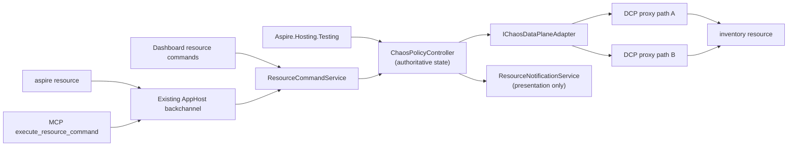

# Native Chaos hosting integration

**Status:** Proposed contribution-oriented incubation, August 2026.

This document proposes bringing the piloted `Aspire.Hosting.Chaos` experience into the Aspire ecosystem as a first-class hosting integration. It is not an Aspire roadmap or repository-ownership commitment. Product management has expressed enthusiastic support for the technical direction and for exploring CLI extensibility, while repository placement, architecture, and engineering ownership remain maintainer decisions.

## Decision summary

### Direction established by this proposal

- Every Phase 1 policy has two universal required fields: **resource + fault**. Closed, resource-type-validated profiles may add typed selectors; the Phase 1 Cosmos profile adds optional `operations`.
- A policy applies exactly one fault to the selected scope until explicitly removed. Ordinary resources select all inbound traffic; modeled Cosmos account, database, or container resources may additionally select `read`, `write`, or `query` operations.
- Aspire resolves the resource profile to DCP's internal proxy topology and matcher/response templates. Policy authors never select an endpoint, route, raw HTTP method, path, header, percentage, seed, policy lifetime, priority, effect order, or policy ID.
- Phase 1 admits a resource only when DCP can apply the requested fault unambiguously and completely across every relevant proxied path. Otherwise, application fails with an actionable resource eligibility reason.
- Only one policy may be active for an ordinary Aspire resource or overlapping Cosmos account/database/container hierarchy scope. Applying an overlapping policy fails until the first is removed.
- Use one authoritative controller for CLI, dashboard, MCP, and tests. The CLI remains a client of resource commands rather than a second policy engine.
- Keep DCP endpoint topology stable for the Run session and mutate fault behavior dynamically.
- Keep the integration run-only and publish-safe. Chaos control resources and metadata do not appear in publish output.
- Explicit removal is the policy lifecycle. Test lease disposal removes the policy. AppHost shutdown or restart clears all policies.
- DCP proxies force pass-through after controller-liveness loss. The absence of a configurable policy lifetime must never strand a fault.
- Start with HTTP/1.1 and only the HTTP/2 request/response behavior proven by conformance testing. Unsupported protocols and resources fail explicitly.
- Random campaigns are a future direction. Phase 1 agents use the same explicit add and remove operations as humans.
- Future directed-edge support faults a reference already declared in the AppHost model through an additive `from` field. It does not ask users to select proxy topology, and Phase 1 rejects `from` with a specific capability-not-supported diagnostic.
- Phase 1 includes a Cosmos emulator Gateway HTTPS profile. `resource` names an existing modeled account, database, or container resource, and optional `operations` selects `read`, `write`, or `query`; omitted means all operations in that resource scope.
- Cosmos operation selection is a hard release gate, not an optimistic contract. If Gateway traffic cannot be classified from URI, method, and headers without request-body parsing, Phase 1 falls back to modeled container-level all-operations support and rejects `operations`.
- `from` remains deferred and capability-gated because caller isolation requires new DCP listener topology. Its absence does not block resource-wide Cosmos faulting.

### Recommendation

Extend the DCP proxy with a versioned fault-control contract, backed by a singleton controller provided by Aspire Hosting at run time. This follows the direction Damian suggested in the original meeting: keep Aspire's transparent proxy topology and add fault behavior at that layer.

The user-facing contract stays Aspire-native and intentionally small. DCP may retain a richer normalized capability and wire contract internally, but that vocabulary does not become the policy schema.

This proposal intentionally applies chaos to DCP. DCP does not support fault injection today: current support controls whether an endpoint is proxied and how its address is allocated. The native work therefore includes the live policy, acknowledgement, capability, liveness, and telemetry seams described below rather than routing around DCP with a second permanent proxy layer.

### Decisions still required

- Whether the contribution belongs directly in `microsoft/aspire` or should continue incubating in an Azure-owned repository before moving into the Aspire namespace.
- The DCP and Aspire Hosting ownership split for the proxy fault-control contract.
- Whether a YARP-compatible adapter is useful as a temporary conformance harness while the DCP contract is implemented.
- Which HTTP/2 behaviors pass the required correctness spikes.
- Whether Aspire-managed double-leg TLS interception can establish trusted identity across Windows, Linux, macOS, and supported containers without disabling validation.
- Whether a richer dashboard experience is warranted after resource commands and telemetry prove sufficient.
- Whether the semantic and performance budgets agreed with DCP owners support default-on availability or require process/run opt-in.
- Whether Gateway traffic proves database/container and `read|write|query` classification without request-body parsing; failure narrows Phase 1 to modeled container-level all-operations support.
- Whether DCP can add stable per-reference listener identity without changing service-discovery values or breaking pooled connections.

## Motivation and source context

The pilot addresses a practical inner-loop gap: applications often behave differently across developer hosts, Linux containers, and shared authenticated environments. Local fault injection can expose retry, timeout, idempotency, and partial-failure bugs before a developer needs a scarce shared environment.

Cosmos emulator Gateway faulting is a defining Phase 1 use case because it tests the architecture beyond generic HTTP status and latency: Aspire already models account/database/container identity, while a useful throttle must preserve TLS validation, isolate a selected hierarchy scope and operation category, and engage the Cosmos SDK's normal retry behavior. Shipping that profile with hard protocol gates demonstrates that resource-native authoring can remain small without reducing DCP to a Cosmos-specific proxy.

The Aspire discussion identified the existing service proxy as the right architectural direction, and subsequent product conversations supported exploring proxy-based fault handling and CLI extensibility. This remains **contribution-oriented incubation pending maintainer and engineering decisions**, not a shipping or repository-ownership commitment.

## Goals

1. Provide zero-setup fault injection for eligible Aspire resources in Run mode.
2. Make the complete Phase 1 policy model understandable as universal `resource + fault`, with only closed, resource-type-validated profile selectors such as Cosmos `operations`.
3. Apply and remove faults dynamically without restarting the AppHost or changing service discovery.
4. Keep proxy topology and protocol details out of user-facing policy, CLI, and testing APIs.
5. Route CLI, dashboard, MCP, and tests through one controller and one acknowledgement path.
6. Make every successful mutation reflect acknowledged DCP state, including forward compensation after partial application.
7. Keep tests simple and honest about resource-wide or typed Cosmos operation effects.
8. Keep publish output deterministic and free of run-only chaos topology or state.
9. Make active faults visible in the dashboard and telemetry.
10. Reject unsupported resources, faults, and protocols with actionable diagnostics.

## Non-goals

- Moving Conductor, run-to-green workflow logic, or pilot-specific MCP glue into Aspire.
- Providing production traffic fault injection or a production service mesh.
- Persisting policies across AppHost restarts.
- Exposing generic request selection by path, method, headers, or other raw protocol properties.
- Selecting one caller-to-destination reference in Phase 1.
- Probabilistic activation, user-provided randomness, or parallel-test traffic isolation.
- Configurable policy lifetime, expiry, pause, priority, ordering, or composition.
- User selection of proxy paths or network topology.
- Random campaign execution in Phase 1.
- Supporting arbitrary L4 protocols in the first increment.
- Building a custom dashboard framework as a prerequisite.
- Replacing Azure Chaos Studio or other environment-level fault systems.
- Making application code depend on a Chaos client library.

## Current pilot

The pilot proves the end-to-end experience and provides useful invariants, but several details are incubation workarounds rather than the desired upstream design.

| Area | Pilot behavior | Native Phase 1 treatment |
| --- | --- | --- |
| Resource | `ChaosProxyResource` is a thin `ContainerResource` with service discovery | Replace it with one inert run-only `ChaosEnvironmentResource`; DCP carries traffic |
| Topology | One explicit proxy per selected edge | Keep topology internal to DCP and admit only resources with complete fault coverage |
| Policies | Startup and runtime policy documents include detailed matching and lifetime controls | No startup authoring; runtime policy has universal `resource + fault` plus closed typed profile selectors |
| State | Proxy-local in-memory policy stores | One AppHost controller owns authoritative state |
| Cleanup | Explicit delete plus expiry | Explicit remove only; controller-liveness loss forces pass-through |
| Composition | Installation order resolves overlap | Exactly one active policy per ordinary resource or overlapping Cosmos hierarchy scope |
| Isolation | Request matching can isolate some traffic | Ordinary faults affect all inbound traffic; Cosmos may select typed operations, and shared tests must serialize overlapping scopes |
| Telemetry | Fire counts and fired paths survive removal | Keep bounded activation counts and sanitized receipts |
| Publish | Proxy resources are excluded from the manifest | Also prove normal references contain no chaos metadata |
| Proxy image | Each edge builds its own image for an Aspire version workaround | Do not port |
| Certificates | Development certificates and accept-any upstream TLS support emulator scenarios | Replace with a reviewed local trust and control-channel design |
| Integration glue | Conductor and run-to-green drive policies | Do not move initially |

Pilot evidence includes:

- `src/Aspire.Hosting.Chaos/ApplicationModel/ChaosProxyResource.cs`
- `src/Aspire.Hosting.Chaos/ChaosProxyResourceBuilderExtensions.cs`
- `src/Aspire.Hosting.Chaos/ChaosProxyMeshExtensions.cs`
- `src/Aspire.Hosting.Chaos/Mesh/ChaosMeshScope.cs`
- `src/Aspire.Hosting.Chaos/container/Program.cs`
- `src/Aspire.Hosting.Chaos/container/ChaosEndpoints.cs`
- `src/Aspire.Hosting.Chaos/container/Policy/ActivePolicyStore.cs`
- `src/Aspire.Hosting.Chaos/container/PolicyExpirationService.cs`
- `src/Aspire.Chaos.Client/ChaosProxyClient.cs`
- `src/Aspire.Chaos.Client/ChaosPolicy.cs`
- `docs/projects/aspire-chaos-proxy/aspire-chaos-proxy.plan.md`

These paths are relative to the piloted Chaos repository, not this repository.

## Relevant Aspire primitives

The proposal builds on current Aspire contracts rather than inventing parallel infrastructure.

### App model and DCP proxy support

- Resources are inert model objects; lifecycle and behavior belong in annotations, services, and event handlers (`docs/specs/appmodel.md`).
- Stable endpoint annotations exist during model construction, while allocated host values resolve later (`src/Aspire.Hosting/ResourceBuilderExtensions.cs`).
- `ProxySupportAnnotation` currently contains only `ProxyEnabled` (`src/Aspire.Hosting/ApplicationModel/ProxySupportAnnotation.cs`).
- DCP service specs carry address, port, protocol, and allocation mode; `Proxyless` bypasses the proxy (`src/Aspire.Hosting/Dcp/Model/Service.cs`).
- `DcpExecutor` creates proxied or proxyless services and waits for effective addresses, but no current model carries fault rules or live policy revisions (`src/Aspire.Hosting/Dcp/DcpExecutor.cs`).
- `YarpResource` is an existing explicit L7 proxy resource, but it does not expose dynamic fault behavior (`src/Aspire.Hosting.Yarp/YarpResource.cs`).

Adding faults to DCP is new product work across Hosting and DCP, not use of an existing extension point.

### Reference and Cosmos resource identity

- `EndpointReferenceAnnotation` records a reference from one resource to another resource's endpoints, and `ValueProviderContext.Caller` identifies the resource requesting a resolved value (`src/Aspire.Hosting/ApplicationModel/EndpointReferenceAnnotation.cs` and `src/Aspire.Hosting/ApplicationModel/IValueProvider.cs`).
- `AzureCosmosDBResource`, `AzureCosmosDBDatabaseResource`, and `AzureCosmosDBContainerResource` are public top-level Aspire resources with public parent and logical-name identity (`src/Aspire.Hosting.Azure.CosmosDB/AzureCosmosDBResource.cs`, `AzureCosmosDBDatabaseResource.cs`, and `AzureCosmosDBContainerResource.cs`).
- `WithReference(container)` preserves a directed `ResourceRelationshipAnnotation` to that container and emits inherited `DatabaseName` plus `ContainerName` connection properties (`src/Aspire.Hosting/ResourceBuilderExtensions.cs` and `src/Aspire.Hosting.Azure.CosmosDB/AzureCosmosDBContainerResource.cs`).
- The Cosmos emulator client integration forces Gateway mode and `LimitToEndpoint`, providing a bounded first target for protocol proof (`src/Aspire.Hosting.Azure.CosmosDB/AzureCosmosDBExtensions.cs`).

These identities are sufficient for Phase 1 Cosmos authoring, but enforcement remains gated on traffic classification, protocol-correct throttling, and trusted TLS interception. Current DCP `Service` and proxy contracts still have no caller dimension, so directed-edge `from` remains deferred.

### Resource commands and clients

`WithCommand` binds a resource command to an AppHost callback with dependency injection, logging, cancellation, and validated arguments (`src/Aspire.Hosting/ResourceBuilderExtensions.cs` and `src/Aspire.Hosting/ApplicationModel/ResourceCommandService.cs`).

The dashboard, CLI, and MCP already dispatch those commands through the AppHost backchannel:

- `src/Aspire.Cli/Commands/ResourceCommand.cs`
- `src/Aspire.Cli/Commands/ResourceCommandHelper.cs`
- `src/Aspire.Hosting/Backchannel/AuxiliaryBackchannelRpcTarget.cs`
- `src/Aspire.Cli/Mcp/Tools/ExecuteResourceCommandTool.cs`
- `docs/specs/cli-backchannel.md`

Chaos commands that promise JSON must return exactly one valid JSON document and mark it as JSON. A chaos-specific backchannel method is not required.

### Testing and eventing

Current `Aspire.Hosting.Testing` surfaces include builder callbacks, `BuildAsync`, `StartAsync`, endpoint lookup, application services, and disposal (`src/Aspire.Hosting.Testing/DistributedApplicationTestingBuilder.cs` and `src/Aspire.Hosting.Testing/DistributedApplicationFactory.cs`).

The integration must not use obsolete `IDistributedApplicationLifecycleHook`. A long-lived controller should register through `IDistributedApplicationEventingSubscriber`, retain subscription tokens, unsubscribe during disposal, and observe AppHost shutdown and resource lifecycle events.

### Presentation state

`CustomResourceSnapshot` and `ResourceNotificationService` describe dashboard state. They are not a policy database or data-plane contract (`src/Aspire.Hosting/ApplicationModel/CustomResourceSnapshot.cs` and `src/Aspire.Hosting/ApplicationModel/ResourceNotificationService.cs`).

## Proposed architecture



The architecture has four layers:

1. **App-model resources and DCP capabilities** determine whether a fault can cover a resource completely.
2. **`ChaosPolicyController`** owns active policies, generated policy IDs, revisions, leases, acknowledgement, and bounded activation observations.
3. **`IChaosDataPlaneAdapter`** translates the small Aspire policy and any closed resource-profile selectors into DCP's internal desired-state contract.
4. **DCP proxies** inject faults and report acknowledgement, liveness, and bounded observations.

All callers use the controller. No caller writes directly to proxy state.

### Implicit control resource

Aspire Hosting automatically adds one visible run-only `ChaosEnvironmentResource` when the selected DCP version advertises fault-control capability. This synthetic resource exposes commands and aggregate status; it does not carry traffic or add a network hop.

`chaos` is the preferred resource name, not a reserved name. If user code already uses it, Aspire chooses the first deterministic fallback (`aspire-chaos`, then a numeric suffix). The resolved name appears in startup logs, the dashboard, and `aspire resource list`.

No `AddChaos`, special reference API, or per-resource setting is required. Every resource remains pass-through until a policy is applied. Standard resource declarations, references, and service-discovery values do not change.

Default-on availability in Run mode is conditional on Phase 0 proving semantic and performance budgets agreed with DCP owners. If those budgets pass, the capability is available by default with administrative opt-out through `ASPIRE_CHAOS_ENABLED=false`. If they fail, it ships default-off with process/run opt-in through `ASPIRE_CHAOS_ENABLED=true`. Publish and Deploy never enable the capability.

### Resource eligibility

The `resource` field names the downstream Aspire resource receiving the traffic. For example, `"resource": "inventory"` applies the fault on requests entering `inventory` from `orders`, a frontend, tests, or any other caller. It does not fault requests originating from `inventory`.

Phase 1 does not select one caller-to-destination edge. The controller asks DCP whether the requested fault can be enforced unambiguously and completely across every relevant inbound proxied path to the destination.

A future directed-edge capability would mean "fault the reference already declared in the AppHost model." For example, `"from": "orders", "resource": "inventory"` would select the existing `orders -> inventory` reference while leaving `frontend -> inventory` unaffected. `from` names the caller; `resource` remains the downstream receiver. This is Aspire resource identity, not user selection of a listener, endpoint, or proxy route.

Enforcement requires DCP to eagerly allocate distinct per-reference proxy/listener/address identity at startup. Service-discovery values must remain stable while policies mutate, including for warmed pooled connections. Current DCP `Service` and proxy contracts cannot express that caller dimension, so this capability is deferred. Propagating caller identity in a header or baggage is rejected: it is spoofable, requires application changes, and does not cover Cosmos or direct protocols.

A resource is eligible for a fault only when:

- the resource exists in the current AppHost model;
- every relevant traffic path is mediated by a DCP proxy that supports the fault;
- DCP can preserve pass-through behavior for the resource's protocol;
- applying the fault has one complete, unambiguous meaning for the resource;
- every closed resource-profile selector is valid and enforceable for that resource type; and
- DCP can acknowledge the same desired revision across every enforcing proxy path.

If any condition fails, the controller rejects the apply before activation. Diagnostics name the resource and explain what the developer can change. Example reasons include:

- the resource uses a proxyless path;
- some host or container traffic bypasses DCP;
- the resource exposes a protocol unsupported by the requested fault;
- HTTPS interception is not available;
- multiple relevant paths cannot be covered atomically; or
- the selected DCP version does not advertise the required capability.

`list-resources` reports eligible faults and actionable ineligibility reasons so a developer does not need to guess resource names or understand listeners, directed references, or address allocation. Each row shows:

| Column | Purpose |
| --- | --- |
| Resource name | The exact identifier to use in `resource` (and, once shipped, `from`) |
| Resource type | For example project, container, or `AzureCosmosDBContainerResource` |
| Parent hierarchy | The account -> database -> container chain, when the resource has one |
| Supported faults | Faults DCP can enforce unambiguously for this resource today |
| Eligibility reason | Why the resource is eligible, or the specific actionable reason it is not |

For example:

| Resource name | Resource type | Parent hierarchy | Supported faults | Eligibility reason |
| --- | --- | --- | --- | --- |
| `inventory` | Project | — | latency, httpStatus | Eligible |
| `carts` | `AzureCosmosDBContainerResource` | `cosmos` -> `shop-db` -> `carts` | throttle (`read`, `write`, `query`, or all) | Eligible when modeled with `AddContainer` and proven Gateway HTTPS emulator mode |
| `legacy-orders` | Container | — | — | Ineligible: some container traffic bypasses DCP |

Phase 0 must census representative and playground resources and record eligibility reasons. Low coverage should become explicit roadmap evidence, not an excuse to expose proxy topology in the v1 contract.

For the Phase 1 Cosmos profile, the same `resource` field may name an `AzureCosmosDBResource`, `AzureCosmosDBDatabaseResource`, or `AzureCosmosDBContainerResource` — see [How resource selection works](#how-resource-selection-works) for the account/database/container scoping table. No duplicate database or container string fields are added; `"resource": "carts"` selects the modeled container resource named `carts`, including its public parent and logical container identity.

The first supported target is a modeled Cosmos emulator resource in Gateway HTTPS mode. Direct/TCP (RNTBD) bypasses that gateway; real accounts, Direct clients, and consumers whose connection mode cannot be proven are ineligible and must fail loudly rather than no-op. EF Core may use containers that are not modeled as `AzureCosmosDBContainerResource`. `list-resources` must warn about that gap, and container-scoped selection requires the AppHost to model the container with `AddContainer`.

### Stable startup and connection semantics

DCP proxy paths are established at startup whether or not a policy is active. An empty policy set is pass-through. Applying and removing a policy never rewrites service-discovery values or restarts workloads.

When DCP advertises HTTP chaos capability, the relevant path remains protocol-aware for the entire Run session. It must not switch from L4 forwarding to L7 handling when the first policy arrives.

Acknowledged revision R governs every request dispatched after acknowledgement, including requests on pooled connections. A request already in flight keeps the revision selected at dispatch. Removal uses the same boundary: after acknowledgement, the next dispatched request passes through.

Conformance coverage includes headers, trailers, connection reuse, `Expect: 100-continue`, cancellation, and HTTP/2 flow control. Tests must warm an `HttpClient` pool, apply a policy and prove the next request faults, then remove it and prove the next request passes without reconnecting.

## DCP proxy extension

### Native path

The recommended path extends DCP and Aspire Hosting with:

- versioned capability discovery;
- live full-snapshot policy updates;
- revision acknowledgement and structured rejection;
- protocol-aware proxy behavior;
- controller-liveness fail-safe behavior; and
- bounded activation telemetry.

The internal DCP contract may describe proxy path coverage, protocol details, normalized effect configuration, matcher/response templates, and compatibility versions. Those are generic platform contracts between Hosting and DCP. The Aspire-side Cosmos profile compiles modeled resource identity and typed operations into those templates; raw HTTP methods, paths, headers, and Cosmos response details are not fields in authored policy.

The minimal operations are:

- `GetCapabilities`, which returns resource coverage and supported faults;
- `SetDesiredPolicies(revision, policies[])`, which sends the complete desired snapshot; and
- `GetStatus`, which returns the acknowledged revision, controller-liveness state, bounded observations, and structured rejection details.

### Incubation fallback

An explicit run-only YARP-compatible proxy and controller can serve as a conformance harness if DCP sequencing would otherwise block policy validation. It is not the product topology: it adds visible resources, address rewriting, and another network hop.

`IChaosDataPlaneAdapter` keeps controller behavior independent of that choice. CLI commands, leases, generated policy IDs, acknowledgement, telemetry, and dashboard projections remain the same.

## Phase 1 policy model

Every Phase 1 policy has these universal fields:

| Field | Meaning |
| --- | --- |
| `resource` | Required downstream Aspire resource name; the fault applies on requests entering this resource from every caller |
| `fault` | Required single fault |

Resource profiles may add only documented, closed fields validated against the selected resource type. The Phase 1 Cosmos profile adds optional `operations`, whose allowed values are `read`, `write`, and `query`; omission means all operations in the selected Cosmos scope. Supplying `operations` for any non-Cosmos resource is rejected. If the operation-classification release gate fails, the fallback Cosmos profile supports modeled container-level all-operations faulting and rejects `operations` rather than guessing.

Matcher, percentage, seed, duration, priority, endpoint, source, `from`, and campaign fields are not added to Phase 1. Generic HTTP method, path, header, or body matchers are explicitly rejected. Fields outside the universal schema or the selected resource's closed profile are rejected. Because `from` is a reserved future capability, Phase 1 rejects it with a specific directed-edge-capability-not-supported diagnostic rather than generic unknown-field wording.

The controller generates an opaque policy ID after a successful apply. The ID is returned for later removal but is never user-authored policy content. Revision, ownership, proxy coverage, acknowledgement state, and liveness metadata remain internal.

Fault-specific parameters exist only when they are intrinsic to the fault. For example, latency needs an amount and a synthetic HTTP response needs a status code.

### Examples

**HTTP latency**

```json
{
  "resource": "inventory",
  "fault": {
    "type": "latency",
    "amount": "2s"
  }
}
```

Every request to `inventory` receives two seconds of added latency until the policy is removed.

**HTTP synthetic status**

```json
{
  "resource": "orders",
  "fault": {
    "type": "httpStatus",
    "statusCode": 503
  }
}
```

Every request to `orders` receives the protocol-correct synthetic response until the policy is removed.

### How resource selection works

Every identifier that can appear in a policy — the Phase 1 `resource` field and the deferred `from` field — is an Aspire app-model resource name: the name assigned when the resource was added in the AppHost, for example via `AddProject`, `AddContainer`, or `AddAzureCosmosDB(...).AddDatabase(...).AddContainer(...)`. The controller resolves that name by resource type and by the parent/child relationships already recorded in the Aspire application model. It is never a DNS name, an Azure physical resource name, a proxy listener or endpoint address, or an arbitrary string the policy author invents.

| Resource type named by `resource` | Fault scope |
| --- | --- |
| Ordinary project or container resource | Faults all inbound traffic to that one downstream resource |
| `AzureCosmosDBResource` (account) | Every modeled database and container under that account |
| `AzureCosmosDBDatabaseResource` | Every modeled container under that database |
| `AzureCosmosDBContainerResource` | That one modeled container |

Physical Azure database and container names are derived from the resource's model properties and its account -> database -> container parent chain at execution time. Authors name the Aspire resource once; they never duplicate the physical database or container name in policy.

### Cosmos container write throttling (Phase 1)

Assume the AppHost already models a Cosmos container with `AddContainer("carts", ...)`. The policy's `resource` field selects that existing `AzureCosmosDBContainerResource`:

```json
{
  "resource": "carts",
  "operations": ["write"],
  "fault": {
    "type": "throttle"
  }
}
```

The table below labels each field:

| Field | Availability | Meaning |
| --- | --- | --- |
| `resource` | Phase 1 | Required downstream Aspire resource name; see [How resource selection works](#how-resource-selection-works) |
| `fault` | Phase 1 | Required single fault |
| `operations` | Phase 1 Cosmos profile, subject to the classification release gate | Optional operation categories: `read`, `write`, `query`. Omitted means all operations within the selected resource's scope |
| `from` | Deferred | Future optional calling Aspire resource. Resolves an existing declared reference (`WithReference`) to `resource`; Phase 1 rejects this field with a directed-edge-capability-not-supported diagnostic |

Because this Phase 1 policy omits `from`, write throttling applies to every caller of `carts`. A future directed form may add `"from": "orders"` to the same policy to isolate the already-declared `orders -> carts` reference. `from` names the calling side of a reference the AppHost already declares — it does not let an author invent a caller/destination pair or select proxy topology. The field is named `from`, not `source`, because Aspire uses source for the referenced or producing resource.

`operations` describes what kind of Cosmos activity the fault applies to, in plain terms: `read` for point/item reads, `write` for creates/updates/deletes, and `query` for SQL queries. Gateway traffic capture must prove that classification from URI, method, and headers alone, without parsing request bodies. If body parsing is required, Phase 1 rejects `operations` and ships only modeled container-level all-operations support; it must not expose a misleading selector. Point-operation verbs may be added only after evidence justifies them.

In this example, `carts` specifically names the modeled Cosmos container, not the Cosmos account or database. More generally, `resource` may name an existing Aspire Cosmos account, database, or container resource to select that hierarchy scope. Authors do not repeat raw Cosmos database or container names in policy. The Aspire-side Cosmos profile compiles the typed resource and operation selectors to an internal matcher and a protocol-correct 429 response template, including the Cosmos retry metadata and body needed to engage normal SDK retry behavior. Raw HTTP paths, methods, headers, and response details remain internal to the profile/data-plane contract; DCP stays generic.

The first profile target is modeled Cosmos emulator resources in Gateway HTTPS mode. Aspire's emulator integration forces Gateway and `LimitToEndpoint`, but interception must establish Aspire-managed trust on both TLS legs across supported hosts and containers. Direct/TCP (RNTBD), real accounts, and unprovable connection modes remain unsupported. EF Core container usage not represented by an `AzureCosmosDBContainerResource` is ineligible for container scope until the AppHost uses `AddContainer`.

### Invalid selectors and diagnostics

The controller rejects a policy before activation whenever its identifiers do not resolve cleanly. The most important cases:

| Invalid case | Result |
| --- | --- |
| `resource` names something that does not exist in the current AppHost model | Rejected with an unknown-resource diagnostic |
| `resource` names a Cosmos container that is only reached through EF Core and was never modeled with `AddContainer` | Rejected for container scope; `list-resources` also warns about the unmodeled container |
| `operations` is supplied for a resource outside the Cosmos profile | Rejected; `operations` only has meaning for a Cosmos account, database, or container resource |
| The Cosmos client uses Direct/TCP (RNTBD), or targets a real (non-emulator) account whose connection mode cannot be proven | Rejected as ineligible; the controller fails loudly rather than silently no-op |
| `from` names a resource with no existing declared reference to `resource` | Rejected; the directed-edge capability only faults a reference the AppHost already declares, not an arbitrary caller/destination pair |

Phase 1 rejects `from`. It accepts `operations` only for a modeled Cosmos resource and only when the operation-classification release gate passes; otherwise the container-level fallback rejects the field. The unknown-resource and Cosmos-eligibility rows govern every Phase 1 policy.

### One policy per overlapping scope

Exactly one policy may be active for an ordinary Aspire resource or overlapping Cosmos hierarchy scope. If `inventory` already has latency applied, any second apply to `inventory` fails with the existing generated policy ID and instructions to remove it first.

For Cosmos, account, database, and container ancestry defines overlap. An account policy conflicts with every modeled database and container beneath it; a database policy conflicts with its account and descendant containers; and a container policy conflicts with its ancestors or another policy on that container, regardless of operation selection. Sibling containers do not overlap.

This rule eliminates precedence, ordering, and composition from Phase 1. Installation timing cannot change behavior. When deferred `from` ships, a resource-wide and caller-specific policy on the same hierarchy scope also conflict. A future version may introduce explicit composition only after real scenarios justify the complexity.

## Controller state and acknowledgement

The controller owns:

- active policies keyed by generated policy ID and validated resource scope;
- lease ownership for typed testing;
- monotonically increasing desired revisions;
- per-proxy acknowledged revisions;
- bounded, sanitized activation observations;
- controller-liveness heartbeats; and
- active mutation state for command enablement.

Use a single-reader mutation queue for changes spanning registration and proxy acknowledgement. Read-only operations use immutable snapshots and remain available during mutation.

For each apply or remove, the controller validates the request, creates a new immutable desired snapshot, increments the revision, and sends the complete snapshot to every affected DCP proxy path. It returns success only when all affected paths acknowledge the revision. A known-unavailable path rejects the mutation before it is queued, and an unresponsive path cannot block the queue indefinitely.

### Forward compensation

If one proxy path rejects or times out after another has acknowledged an apply, the controller immediately sends a compensating revision that omits the attempted policy. Ordinary failure is returned only after that compensating revision is acknowledged everywhere.

If compensation cannot converge within its fixed internal deadline, the controller returns a typed partially-applied failure naming the unresolved internal paths. Proxies that lose controller liveness force pass-through after a fixed platform safety interval. The interval is not policy content and is not configurable by the policy author.

`ApplyChaosPolicyAsync(...)` surfaces partial application as a typed `ChaosPolicyApplyException` with cleanup ownership so test infrastructure can continue attempting removal. A rejected apply must never return ordinary failure while an acknowledged fault from that attempt remains active.

## Policy lifecycle

### Apply

Applying a policy is complete only when:

1. the resource and fault are valid;
2. no policy is already active for the resource or an overlapping Cosmos hierarchy scope;
3. DCP confirms complete eligibility for the fault;
4. the controller creates a new desired revision; and
5. every affected proxy path acknowledges that revision.

The generated policy ID is returned only after successful acknowledgement.

### Remove

Removal uses the generated policy ID. It creates and awaits a new revision that omits that policy. Removing an already absent policy is idempotent success when the caller owns the ID or lease.

Explicit removal is the normal and only user-controlled lifecycle. Phase 1 does not include configurable expiry, pause, resume, or renewal.

### Liveness and restart

| Event | Behavior |
| --- | --- |
| Test lease disposal | Removes only that lease's policy and awaits acknowledgement |
| AppHost graceful shutdown | Attempts bounded removal of all policies before controller disposal |
| AppHost restart | Starts with an empty policy set; no policy state is persisted or replayed |
| Controller-liveness loss | DCP proxies force pass-through after the fixed platform safety interval |
| Proxy restart while AppHost remains alive | Starts pass-through, then reconciles the controller's latest desired revision |
| Workload restart | Existing DCP addresses and active controller policy remain unchanged |

Controller-liveness pass-through is mandatory because Phase 1 deliberately has no policy lifetime. It protects against a crashed or disconnected controller without asking users to reason about expiry.

## CLI UX

The immediate CLI uses existing resource commands. The syntax below is proposed and must follow final resource-command conventions.

```console
aspire resource chaos add-policy --resource inventory --latency 2s
aspire resource chaos add-policy --resource orders --http-status 503
aspire resource chaos add-policy --resource carts --operations write --throttle
aspire resource chaos remove-policy --policy-id <policy-id-returned-by-add>
aspire resource chaos list-policies
aspire resource chaos list-resources
```

Exactly one fault flag is required. `--operations` accepts the closed Cosmos values `read`, `write`, and `query` and is invalid for other resource types. The common cases use readable flags. `--policy-json` may support automation while preserving the same universal fields and closed resource profiles.

These examples assume `chaos` is the resolved control-resource name. If user code already claimed that name, `aspire resource list` reveals the deterministic fallback.

`add-policy` requires confirmation before activation, with an explicit non-interactive confirmation flag for automation. Mutations go through `ResourceCommandService` to `ChaosPolicyController`. The CLI does not call DCP directly and does not parse or own policy semantics.

Illustrative `add-policy` output:

```json
{
  "controlResource": "chaos",
  "policyId": "policy-7f3a",
  "resource": "inventory",
  "fault": {
    "type": "latency",
    "amount": "2s"
  },
  "state": "active",
  "activationCount": 0
}
```

Illustrative `list-policies` output:

```json
{
  "controlResource": "chaos",
  "policies": [
    {
      "policyId": "policy-7f3a",
      "resource": "inventory",
      "fault": {
        "type": "latency",
        "amount": "2s"
      },
      "state": "active",
      "activationCount": 3
    }
  ]
}
```

Read-only commands remain available during mutations. Failures use nonzero command status and structured diagnostics rather than success-shaped JSON with an embedded error.

A future `aspire chaos ...` alias may provide shorter syntax over the same controller. Custom CLI extension loading must never be required for correctness or testing.

## Aspire.Hosting.Testing UX

Tests use a typed convenience API rather than shelling out or constructing policy objects:

```csharp
// Proposed pseudocode. These APIs do not exist.
await using var lease = await app.ApplyChaosPolicyAsync(
    "inventory",
    ChaosFault.Latency(TimeSpan.FromSeconds(2)),
    cancellationToken);
```

Cosmos tests use a typed profile selector rather than a generic request matcher:

```csharp
// Proposed pseudocode. These APIs do not exist.
await using var lease = await app.ApplyChaosPolicyAsync(
    "carts",
    ChaosResourceProfile.Cosmos(CosmosOperation.Write),
    ChaosFault.Throttle(),
    cancellationToken);
```

The Cosmos overload is available only when the typed operation classifier passes its release gate; the container-level fallback omits the profile argument and affects all operations. No testing API accepts raw HTTP methods, paths, headers, or response templates.

`ApplyChaosPolicyAsync(...)` returns an `IAsyncDisposable` lease. A richer concrete lease may expose `PolicyId`, `Resource`, `ResourceProfile`, `Fault`, `ActivationCount`, and bounded activation observations, but those details are not required for the common path.

The lease contract is:

- creation completes only after all affected DCP proxy paths acknowledge the apply;
- disposal removes only the lease's generated policy ID;
- disposal waits for removal acknowledgement within a fixed cleanup deadline;
- disposal is idempotent;
- disposal never clears another resource's policy; and
- cleanup failure throws a typed exception rather than silently succeeding.

Illustrative test:

```csharp
// Proposed pseudocode. These APIs do not exist.
await using var app = await testingBuilder.BuildAsync();
await app.StartAsync();

await using var lease = await app.ApplyChaosPolicyAsync(
    "inventory",
    ChaosFault.Latency(TimeSpan.FromSeconds(2)),
    cancellationToken);

using var client = app.CreateHttpClient("orders");
var response = await client.GetAsync("/checkout", cancellationToken);

await lease.WaitForActivationAsync(cancellationToken);
```

Assertions happen after application traffic completes. The proxy records activation; it does not execute test assertions inline.

### Fixture use and isolation

A policy affects all traffic in its selected scope: all inbound traffic for an ordinary resource, or all callers and the selected operations for a Cosmos resource. Phase 1 does not claim per-caller, per-request, or per-test traffic isolation.

Tests sharing an AppHost must serialize chaos mutations and any traffic that depends on them. Tests that need parallel chaos behavior must use separate AppHost instances. The API and documentation must state this directly rather than implying isolation through distributed-context propagation.

A fixture may own the `DistributedApplication`, but each test should own and dispose its lease:

```csharp
// Proposed pseudocode. These APIs do not exist.
public Task<IAsyncDisposable> ApplyLatencyAsync(
    string resource,
    TimeSpan amount,
    CancellationToken cancellationToken) =>
    App.ApplyChaosPolicyAsync(
        resource,
        ChaosFault.Latency(amount),
        cancellationToken);
```

Fixture teardown and AppHost disposal provide final cleanup boundaries. They do not replace per-test lease disposal or serialization.

## Dashboard visualization and MCP

The dashboard must make active fault injection obvious. A developer should not need to inspect logs or remember that a test installed a policy to understand why a resource is delayed or failing.

### Initial dashboard experience

The Resources page shows one run-only chaos control resource. Its state and properties are projections from `ChaosPolicyController`, never authoritative storage.

The control resource remains `Running` while available and uses warning styling whenever a policy is active. Reconciliation failure and revision drift appear as health reports rather than invented lifecycle states. The resource never gates workload startup or readiness.

The Phase 1 policy table shows resource type/profile and operation scope when applicable:

| Resource | Type/profile | Operations | Fault | State | Activation count |
| --- | --- | --- | --- | --- | ---: |
| `inventory` | Project / HTTP | All inbound | Latency 2s | Active | 3 |
| `carts` | Cosmos container / Gateway HTTPS | Write | Throttle (429) | Active | 7 |

The control resource exposes commands for add, remove, list policies, and list resources. Operations use the same validation and acknowledgement path as CLI and tests. The dashboard never calls DCP directly.

Selected workload resources may show a derived `Chaos fault` property and a relationship to the control resource. Intentional fault activation must not make the workload resource unhealthy.

First activation in a Run session emits a one-time message-bar notification linking to the control resource. A persistent global active-chaos indicator is potential future Dashboard core work.

### MCP

MCP uses the existing `execute_resource_command` tool against the same commands. It is not a privileged DCP client and does not receive an independent policy store.

The Phase 1 agent story is explicit and inspectable: list eligible resources, add one policy, observe telemetry, and remove that policy. An agent crash cannot bypass controller-liveness pass-through.

## Random campaigns

Random campaigns are not part of Phase 1. No campaign, seed, schedule, interval, budget, or replay field appears in the v1 policy model.

The strategic direction remains that Aspire should eventually own safe and reproducible campaign execution rather than asking an agent to implement randomness by repeatedly invoking add and remove in its own loop. Aspire is the right future owner for validation, cancellation, cleanup, dashboard visibility, reproducibility, and crash safety.

That future design requires separate evidence and review. Until then, humans and agents use explicit add and remove operations, and tests use fixed faults through leases.

## Observability

### Resource state

Suggested non-sensitive control-resource properties are:

- active policy count;
- desired and acknowledged revision;
- last successful reconciliation time;
- active operation name and state; and
- bounded apply, remove, activation, and reconciliation-failure counts.

### Metrics, traces, and logs

Suggested telemetry:

| Signal | Purpose |
| --- | --- |
| `aspire.chaos.policy.apply` | Apply latency and result |
| `aspire.chaos.policy.remove` | Removal latency and result |
| `aspire.chaos.fault.activated` | Count by generated policy ID, resource, resource profile, operation scope, and fault type |
| `aspire.chaos.proxy.revision_lag` | Desired minus acknowledged revision |
| `aspire.chaos.controller.liveness_loss` | Forced pass-through events |

Fault spans should link to the proxied request span where possible and include generated policy ID, Aspire resource, resource profile, operation scope when applicable, fault type, and activation index. Structured logs record lifecycle and reconciliation without serializing credentials or policy bodies.

Synthetic responses may include `x-aspire-chaos-policy`. Faults that cannot carry a response header rely on trace and log markers. Intentional activation never makes the affected resource unhealthy.

### Activation observations

Retain a bounded ring of sanitized observations per generated policy ID after removal. An observation may include:

- generated policy ID;
- Aspire resource;
- resource profile and typed operation scope when applicable;
- activation time;
- fault type;
- activation index; and
- trace ID when safe.

Do not retain request bodies, authorization data, cookies, connection strings, raw sensitive headers, or unbounded URLs. Observations are diagnostics, not policy state.

## Security

- The management channel is internal, excluded from service discovery, and inaccessible through workload proxy routes.
- Controller-to-proxy calls use a per-run credential passed as a secret. It never appears in command arguments or snapshot properties.
- Resource commands execute inside the AppHost and use existing backchannel access.
- Policy documents have strict size limits. Fault parameters have reviewed bounds, such as maximum latency amount and valid synthetic status codes.
- Policies cannot specify arbitrary upstream destinations.
- Unknown fields, unsupported faults, and ineligible resources reject the apply rather than broadening behavior.
- Resource-profile fields use explicit allowlists and resource-type validation; generic HTTP matchers are not accepted.
- Management traffic is never eligible for fault injection.
- Request and response bodies are not captured by default.
- Cosmos operation classification never parses request bodies.
- Proxies force pass-through after controller-liveness loss.
- Snapshot, command, log, trace, and observation serializers use explicit allowlists.
- The pilot's accept-any certificate behavior cannot become a general default.

This is a development integration, but "development only" is not an exemption from control-plane authentication or secret hygiene.

## Health and readiness

Expose separate checks:

| Check | Ready when |
| --- | --- |
| Process liveness | Proxy process is responsive |
| Data-plane readiness | Listener is bound and routing configuration is valid |
| Control-plane health | Controller authentication succeeds and desired revision is acknowledged |
| Upstream observation | Original resource destination is resolvable; this does not mutate resource state |

The proxy should wait for the workload to start, not necessarily become healthy, to avoid readiness cycles. Reconciliation health attaches to the chaos control resource and never participates in another resource's `WaitForHealthy`.

An empty policy set is healthy pass-through. Revision drift emits a health report while the control resource remains `Running`. The controller independently rejects new applies when reconciliation is unhealthy, while remove and list remain available for recovery.

## Run, publish, and deploy behavior

Chaos is run-only.

### Run

- Materialize the singleton chaos control resource.
- Keep normal DCP-proxied addresses under workload resource names.
- Start the controller with an empty pass-through revision.
- Keep supported DCP paths protocol-aware and semantically pass-through when no policy is active.

### Publish

- Do not materialize chaos control resources or fault metadata in deployable output.
- Emit normal resource references deterministically.
- Do not serialize policy state, controller revisions, local management addresses, credentials, or observations.
- Validate that no published reference carries chaos metadata.
- Fail publish with an actionable error if the normal reference cannot be proven.

Calling only `.ExcludeFromManifest()` is insufficient because DCP fault metadata could still leak into publish processing. The preferred implementation treats chaos as run-only metadata on otherwise normal references.

### Deploy

Deploy consumes the direct, chaos-free publish model. Phase 1 has no deployment behavior.

## Protocol and fault scope

### Initial scope

- HTTP/1.1 request/response proxying over HTTP.
- HTTP/2 request/response proxying over h2c only for behaviors that pass conformance tests.
- Resource-wide latency with a bounded intrinsic amount.
- Resource-wide synthetic HTTP status with a valid intrinsic status code.
- Modeled Cosmos emulator account, database, and container resources in Gateway HTTPS mode, using Aspire-managed double-leg TLS trust.
- Protocol-correct Cosmos 429 throttling for all operations or typed `read`, `write`, and `query` operations when classification is proven without body parsing.

HTTP/2 support must verify multiplexing, cancellation propagation, header and trailer handling, flow control, and connection reuse. Passing HTTP/1.1 tests is not evidence that a fault is correct for HTTP/2.

### Explicitly deferred

- General-purpose HTTPS interception outside the closed Cosmos profile.
- Generic TCP faults.
- AMQP and broker-protocol faults.
- Cosmos DB direct/TCP (RNTBD), real accounts, and unprovable client connection modes.
- Directed caller-to-destination references, pending stable eager per-reference DCP listeners.
- Unary and streaming gRPC.
- WebSockets and server-sent events.
- Request or response body corruption.
- Production traffic.

Unsupported protocols and faults fail explicitly. DCP must not silently reinterpret them as generic HTTP behavior.

## Packaging and versioning

If maintainers approve direct inclusion:

- Use a focused preview package named `Aspire.Hosting.Chaos`.
- Keep resource modeling, controller contracts, and the testing convenience API together unless dependency analysis requires a small companion package.
- Keep the DCP runtime implementation internal to the supported distribution model.
- Version the internal DCP contract independently from the universal `resource + fault` fields and closed authored resource profiles.
- Mark unstable public APIs experimental.
- Add the package to `aspire add` only when minimum run, publish, protocol, and liveness tests pass.
- Keep the authored policy language-neutral; typed test helpers may remain C#-only initially.

If incubation remains outside `microsoft/aspire`, use the same boundaries and avoid dependencies on internal Aspire implementation types that would block later contribution.

### Migration from the pilot

- Do not retain preview APIs solely for compatibility.
- Translate startup policies into explicit CLI, dashboard, MCP, or testing operations.
- Replace direct `ChaosProxyClient` usage with controller commands or `ApplyChaosPolicyAsync`.
- Remove detailed request matching, probabilistic activation, expiry, and composition from the native v1 contract.
- Remove internal-feed, per-edge Docker build, generated-certificate, and Aspire-version workaround code.
- Do not move Conductor, run-to-green, or custom MCP orchestration.
- Document unsupported pilot transforms individually.

## Alternatives considered

### Avoid DCP changes

Building only an explicit proxy is implementable in the hosting integration, but it bypasses the native proxy layer Damian identified and leaves Aspire with two local proxy topologies. Rejected as the product destination.

### Host YARP in the AppHost process

An in-process data plane avoids image acquisition and a management credential, but it mixes traffic handling with AppHost control-plane availability and gives each path a custom lifecycle outside normal DCP management. Keep it as a conformance comparison, not the default.

### Use Toxiproxy

Toxiproxy is appropriate for several TCP-level fault classes and remains a useful explicit integration alternative. It does not provide the desired Aspire resource-command, typed lease, dashboard, or topology experience by itself.

### Application middleware

Application middleware requires modifying each application, cannot cover arbitrary dependencies, and conflates test instrumentation with workload code. Rejected.

### Propagate caller identity in headers or baggage

Attaching caller identity to application traffic would avoid per-reference listeners, but the identity is spoofable, requires workload changes, and cannot cover Cosmos or direct protocols. Rejected. Directed-edge identity must come from the declared AppHost reference and its DCP address allocation.

### Expose generic request matching

Path, method, and header matchers could describe Cosmos traffic, but they would leak protocol details into authored policy and create an unsafe generic matching language. Rejected. An Aspire-side resource profile owns typed selectors and compiles them to DCP's internal generic data-plane contract.

### Expose DCP topology to policy authors

Allowing authors to choose listeners or network paths would make the first version more flexible, but it would leak platform internals and make policy correctness depend on topology knowledge. Rejected. DCP must provide complete resource-level eligibility or an actionable failure.

### Allow multiple policies per resource

Priority, composition, and effect overlap rules would immediately become part of the public contract. Rejected for Phase 1. One active policy per ordinary resource or overlapping Cosmos hierarchy scope is deterministic and sufficient to validate the native loop.

### Require a custom CLI extension

This could provide polished syntax early, but it would make correctness depend on extension loading and duplicate the resource-command path. Rejected. A future alias may use the same control plane.

## Phased delivery

### Phase 0: proof spikes and maintainer decisions

- Decide repository placement and engineering owner.
- Review the minimal DCP capability, desired-state, acknowledgement, liveness, and status contract.
- Prove deterministic control-resource fallback naming and discovery.
- Agree semantic and performance budgets that decide default-on versus process/run opt-in.
- Prove standard references and service-discovery values are unchanged when the feature is inactive.
- Prove the control resource and DCP capability exist only in Run mode.
- Census representative resources with `list-resources` and actionable eligibility reasons.
- Prove complete resource-level fault coverage across relevant host and container proxy paths without user topology selection.
- Prove authenticated revision application, forward compensation, restart reconciliation, and controller-liveness pass-through.
- Run HTTP/1.1 and HTTP/2 semantic conformance tests for initial faults.
- Warm an `HttpClient` pool and prove acknowledged apply and remove behavior without reconnecting.
- Measure pass-through and enabled-fault overhead after semantic conformance passes.
- Use an explicit YARP-compatible engine only as a conformance harness if DCP is not available.
- Review universal `resource + fault` plus the closed Cosmos `operations` profile with CLI, dashboard, MCP, and testing consumers.
- Census modeled Cosmos account/database/container resources through public APIs and report EF Core or otherwise unmodeled container gaps.
- Capture Cosmos emulator Gateway traffic and prove database/container plus `read|write|query` classification from URI, method, and headers without request-body parsing; if operation classification needs bodies, reject `operations` and retain modeled container-level all-operations support.
- Prove Aspire-managed double-leg TLS trust across Windows, Linux, and macOS without disabling certificate validation on either leg.
- Prove protocol-correct 429 responses include Cosmos retry metadata and body content that engage normal Cosmos SDK retry behavior.
- Prove selected-container write throttling leaves reads and sibling containers unaffected, including after warming `CosmosClient` connections.
- Prove Direct/RNTBD, real-account, proxy-bypass, and otherwise unprovable connection modes reject eligibility loudly rather than silently no-op.

### Phase 1: minimal native loop

- Automatically added run-only chaos control resource with deterministic fallback naming.
- Universal authored `resource + fault`, closed resource profiles, and generated policy IDs.
- Complete resource eligibility with actionable rejection.
- Exactly one active policy per ordinary resource or overlapping Cosmos hierarchy scope.
- Singleton controller and DCP full-snapshot reconciliation with forward compensation.
- Add, remove, list policies, and list resources commands with JSON results.
- `ApplyChaosPolicyAsync(resource, fault)` and its typed Cosmos-profile overload, each returning an `IAsyncDisposable` lease.
- Explicit removal, AppHost cleanup, restart clearing, and controller-liveness pass-through.
- HTTP/1.1 plus only proven HTTP/2 behavior.
- Modeled Cosmos emulator Gateway HTTPS account/database/container selection with protocol-correct throttling.
- Optional typed Cosmos `operations` (`read`, `write`, `query`; omitted means all) if classification is proven without body parsing; otherwise container-level all-operations support with `operations` rejected.
- Publish bypass validation.
- Dashboard visibility using existing resource, command, property, relationship, health, and telemetry surfaces.

### Phase 2: evidence-driven diagnostics

- Richer activation observations and links from policies to traces.
- Additional closed fault profiles that preserve universal `resource + fault` authoring.
- Spike eager per-reference listeners that keep service discovery stable and isolate `orders -> inventory` from `frontend -> inventory`, including warmed pooled connections.
- Add optional directed-edge `from` only after that non-blocking future spike proves stable listener identity.
- A persistent global active-chaos indicator if Dashboard owners approve the core work.
- A dedicated `aspire chaos` alias if general CLI-extensibility work supports it.
- Revisit a safe, reproducible campaign primitive as a separate design.

### Phase 3: broader platform integration

- Evaluate additional DCP proxy engines and protocols using Phase 1 evidence.
- Compare transparency, compatibility, and security across supported protocols.
- Consider richer dashboard and campaign experiences independently.

## Open questions and proof spikes

| Question | Recommended default | Evidence required |
| --- | --- | --- |
| Repository placement | Continue contribution review without assuming ownership | Aspire maintainer and owning engineering team decision |
| First data plane | DCP proxy extension | Reviewed DCP control proposal and Phase 0 conformance results |
| Conformance fallback | Explicit YARP-compatible adapter, not product topology | Evidence that DCP sequencing blocks policy validation |
| Availability | Default-on in Run mode only if agreed semantic and performance budgets pass | Compatibility, security, latency, throughput, startup, memory, run, and publish proofs |
| Resource eligibility | All relevant proxied paths or reject | Representative host/container coverage census and atomic acknowledgement proof |
| Initial HTTP/2 behavior | Ship only proven faults | Multiplexing, cancellation, flow-control, headers, trailers, and connection reuse |
| Runtime persistence | None | Revisit only if restart use cases outweigh stale-fault risk |
| Controller loss | Force pass-through after a fixed platform interval | Crash, disconnect, and recovery tests |
| Dashboard extension | Existing resource surfaces first | User evidence that commands and telemetry are insufficient |
| General HTTPS | Deferred outside the Cosmos profile | Separate cross-platform certificate identity, trust, and protocol proof |
| Cosmos profile | Phase 1 modeled emulator Gateway HTTPS only; keep typed profile in Aspire and DCP generic | Resource hierarchy census, double-leg TLS trust, protocol-correct 429, warmed-client isolation, and loud rejection of bypass modes |
| Cosmos operations | Phase 1 `read|write|query`; omit means all, contingent on classification proof | Prove URI/method/header classification; if bodies are required, reject the field and retain container-level all-operations support |
| Directed edges | Optional `from` over an existing AppHost reference | Stable eager per-reference listeners and pooled-connection isolation proof |
| EF Core Cosmos containers | Warn in `list-resources`; reject container scope unless modeled with `AddContainer` | Public API census and representative EF Core eligibility results |
| Testing package shape | Keep the convenience API with the integration if dependency-safe | Project-reference and public API review |
| Campaigns | Aspire may eventually own safe reproducible execution | Separate design with crash cleanup and reproducibility evidence |

## Acceptance criteria for an implementation proposal

Phase 1 must not release until the following are demonstrated:

1. A reader can explain the complete Phase 1 authored policy as universal `resource + fault` plus only closed, resource-type-validated profile selectors.
2. Existing AppHost code requires no chaos-specific setup.
3. CLI, dashboard, MCP, and tests all mutate the same controller instance.
4. Applying and disposing a test lease each await acknowledgement from every affected DCP proxy path.
5. Exactly one policy can be active per ordinary resource or overlapping Cosmos hierarchy scope, and a second overlapping apply fails clearly until removal.
6. An ordinary policy affects all inbound traffic to its resource; a Cosmos policy affects all callers within its selected resource and operation scope. Testing guidance requires serialized overlapping mutations or separate AppHosts.
7. Users never select proxy paths or other DCP topology details.
8. A resource is admitted only when the requested fault maps unambiguously and completely across every relevant proxied path.
9. Ineligible resources and unsupported protocols fail with actionable diagnostics.
10. A rejected or timed-out apply never returns ordinary failure while an acknowledged fault from that attempt remains active; the controller compensates first.
11. Controller-liveness loss forces pass-through without relying on user-configured expiry.
12. Lease disposal removes only its generated policy ID and cannot clear another resource's policy.
13. AppHost restart clears all policies, and proxy restart reconciles from the live controller.
14. A publish snapshot emits normal references with no chaos control resource, state, or metadata.
15. HTTP/1.1 and every claimed HTTP/2 behavior pass semantic conformance for pass-through, apply, and remove on pooled connections.
16. Dashboard policy presentation contains Resource, resource type/profile, operation scope when applicable, Fault, State, and activation count.
17. Snapshots and observations contain no credentials, bodies, connection strings, or raw sensitive headers.
18. A pre-existing resource named `chaos` does not break model construction or silently disable the feature; the resolved fallback is discoverable.
19. Random campaigns do not appear in the Phase 1 policy schema or command set.
20. The visible control resource remains `Running`, uses warning styling for active faults, reports reconciliation problems through health, and never gates workload readiness.
21. If Phase 0 budgets fail, the feature ships default-off with process/run opt-in rather than weakening pass-through guarantees.
22. Phase 1 rejects `from` with a directed-edge-capability-not-supported diagnostic; omitting it means every caller within the selected ordinary or Cosmos scope.
23. A Phase 1 Cosmos policy names an existing modeled account, database, or container resource; no duplicate physical names appear in authored policy, and unmodeled EF Core containers produce a `list-resources` warning that directs the user to `AddContainer`.
24. Cosmos `operations` ships only if Gateway traffic proves profile-defined typed classification without body parsing; otherwise Phase 1 rejects the field and supports modeled container-level all-operations throttling.
25. Cosmos Gateway proofs demonstrate protocol-correct 429 retry behavior and selected-container write throttling without affecting reads or sibling containers, with warmed `CosmosClient` connections and cross-platform TLS validation intact; Direct/RNTBD, real-account, and unprovable modes fail eligibility rather than no-op.

## Source map

| Concern | Aspire source |
| --- | --- |
| DCP proxy flag | `src/Aspire.Hosting/ApplicationModel/ProxySupportAnnotation.cs` |
| DCP service allocation | `src/Aspire.Hosting/Dcp/Model/Service.cs` |
| DCP endpoint materialization | `src/Aspire.Hosting/Dcp/DcpExecutor.cs` |
| DCP options | `src/Aspire.Hosting/Dcp/DcpOptions.cs` |
| Declared caller-to-destination reference | `src/Aspire.Hosting/ApplicationModel/EndpointReferenceAnnotation.cs` |
| Caller during value resolution | `src/Aspire.Hosting/ApplicationModel/IValueProvider.cs` |
| Cosmos account resource | `src/Aspire.Hosting.Azure.CosmosDB/AzureCosmosDBResource.cs` |
| Cosmos database resource | `src/Aspire.Hosting.Azure.CosmosDB/AzureCosmosDBDatabaseResource.cs` |
| Cosmos container resource | `src/Aspire.Hosting.Azure.CosmosDB/AzureCosmosDBContainerResource.cs` |
| Cosmos `AddContainer` and emulator Gateway client configuration | `src/Aspire.Hosting.Azure.CosmosDB/AzureCosmosDBExtensions.cs` |
| Reference relationship and connection-property injection | `src/Aspire.Hosting/ResourceBuilderExtensions.cs` |
| Explicit L7 proxy resource | `src/Aspire.Hosting.Yarp/YarpResource.cs` |
| Stable endpoint behavior | `src/Aspire.Hosting/ResourceBuilderExtensions.cs` |
| Presentation snapshots | `src/Aspire.Hosting/ApplicationModel/CustomResourceSnapshot.cs` |
| Notification publication | `src/Aspire.Hosting/ApplicationModel/ResourceNotificationService.cs` |
| Resource command model | `src/Aspire.Hosting/ApplicationModel/ResourceCommandAnnotation.cs` |
| Resource command dispatch | `src/Aspire.Hosting/ApplicationModel/ResourceCommandService.cs` |
| CLI resource command | `src/Aspire.Cli/Commands/ResourceCommand.cs` |
| AppHost backchannel | `src/Aspire.Hosting/Backchannel/AuxiliaryBackchannelRpcTarget.cs` |
| MCP command execution | `src/Aspire.Cli/Mcp/Tools/ExecuteResourceCommandTool.cs` |
| Backchannel compatibility | `docs/specs/cli-backchannel.md` |
| Testing builder | `src/Aspire.Hosting.Testing/DistributedApplicationTestingBuilder.cs` |
| Testing factory | `src/Aspire.Hosting.Testing/DistributedApplicationFactory.cs` |
| Event subscriptions | `src/Aspire.Hosting/Eventing/IDistributedApplicationEventing.cs` |
| Eventing subscriber lifecycle | `src/Aspire.Hosting/Lifecycle/IDistributedApplicationEventingSubscriber.cs` |
