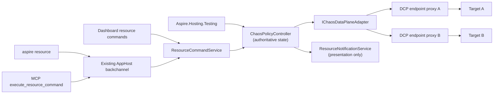

# Native Chaos hosting integration

**Status:** Proposed contribution-oriented incubation, August 2026.

This document proposes bringing the piloted `Aspire.Hosting.Chaos` experience into the Aspire ecosystem as a first-class hosting integration. It is not an Aspire roadmap or repository-ownership commitment. Product management has expressed enthusiastic support for the technical direction and for exploring CLI extensibility, while repository placement, architecture, and engineering ownership remain maintainer decisions.

## Decision summary

### Direction established by this proposal

- Keep DCP endpoint topology stable for the Run session and mutate policies dynamically at run time.
- Use one authoritative controller and policy state model for resource commands, the CLI, dashboard, MCP, and tests.
- Make the CLI a client of resource commands, not a second policy engine.
- Make both required mutation paths first-class:
  - `aspire resource chaos add-policy|remove-policy|list-policies`, where `chaos` is the preferred name for the single run-only control resource and each policy names its target resource and endpoint
  - typed test-scoped policy application and removal through `ApplyChaosPolicyAsync(...)`
- Keep the integration run-only. Chaos control resources and metadata must not appear in publish output; publish emits normal references or fails.
- Keep policy cleanup explicit. TTL is a safety net rather than the primary lifecycle.
- Treat `CustomResourceSnapshot` as presentation state only.
- Start with HTTP/1.1 and proven HTTP/2 request/response behavior. Explicitly defer generic TCP, AMQP, Cosmos direct/TCP, and streaming gRPC.

### Recommendation

Implement the native integration by extending the DCP proxy with a versioned fault-control contract, backed by a singleton controller provided by Aspire Hosting at run time. This is the direction Damian suggested in the original meeting: keep Aspire's transparent proxy topology and add fault behavior at that layer. Keep the controller contract engine-neutral so the policy model, CLI, dashboard, MCP, and testing experience are not coupled to DCP implementation details.

This proposal intentionally applies chaos to DCP. DCP does not support fault injection today: current support controls whether an endpoint is proxied and how its address is allocated. The native work therefore includes adding the live policy, acknowledgement, capability, and telemetry seam described below rather than routing around DCP with a second permanent proxy layer.

### Decisions still required

- Whether the contribution belongs directly in `microsoft/aspire` or should continue incubating in an Azure-owned repository before moving into the Aspire namespace.
- The DCP and Aspire Hosting ownership split for the new proxy fault-control contract.
- Whether an explicit YARP-compatible adapter is useful as a temporary conformance harness while the DCP contract is implemented.
- Which HTTP/2 behaviors pass the required correctness spikes.
- Whether and how consumer-facing HTTPS interception can establish trusted identity across hosts and containers.
- Whether a richer dashboard experience is warranted after resource commands and telemetry prove sufficient.
- Whether the semantic and performance budgets agreed with DCP owners support a default-on activation model, or whether the feature ships default-off with process/run opt-in instead.

## Motivation and source context

The pilot targets a practical inner-loop gap: applications often behave differently across developer hosts, Linux containers, and shared authenticated environments. Local fault injection can expose retry, timeout, idempotency, and partial-failure bugs before a developer needs a scarce shared environment.

The Aspire discussion identified the existing service proxy as the right architectural direction, and subsequent product conversations supported exploring proxy-based fault handling and CLI extensibility. This remains **contribution-oriented incubation pending maintainer and engineering decisions**, not a shipping or repository-ownership commitment.

## Goals

1. Make fault behavior available on DCP-proxied endpoints without requiring AppHost setup or policy authoring.
2. Let developers add, remove, inspect, pause, and resume policies without restarting the AppHost.
3. Give tests a typed, scoped, acknowledgement-based lifecycle that is safe in fixtures and honest about parallel execution.
4. Route every mutation surface through one controller and one policy contract.
5. Preserve deterministic behavior under concurrent callers.
6. Keep local development safe through bounded policies, TTL expiry, explicit cleanup, sanitized diagnostics, and fail-closed scope validation.
7. Keep publish output deterministic and free of run-only chaos topology.
8. Make DCP the native data plane without coupling callers to DCP-specific wire types.

## Non-goals

- Moving Conductor, run-to-green workflow logic, or pilot-specific MCP glue into Aspire.
- Providing a production service mesh or production traffic-fault platform.
- Persisting runtime policies across AppHost restarts.
- Defining generalized Aspire CLI extension loading as part of this feature.
- Supporting arbitrary L4 protocols in the first increment.
- Building an extensible dashboard framework as a prerequisite.
- Replacing Azure Chaos Studio or other environment-level fault systems.
- Making application code depend on a Chaos client library.

## Current pilot

The pilot proves the end-to-end experience and provides useful invariants, but several implementation details are incubation workarounds rather than upstream architecture.

| Area | Pilot behavior | Native design treatment |
| --- | --- | --- |
| Resource | `ChaosProxyResource` is a thin `ContainerResource` with service discovery | Replace it with one inert `ChaosEnvironmentResource`; DCP carries traffic |
| Topology | One proxy per selected existing edge; topology is fixed for the run | Use whole-target-endpoint scope in Phase 1; gate finer granularity on a future DCP capability |
| Policies | Bootstrap and declared policies load at startup; runtime policies use HTTP CRUD | Do not port startup policy authoring; use the shared runtime controller for every policy |
| State | In-memory immutable-list reads and locked writes | Preserve in-memory state; replace install-order precedence |
| Cleanup | Explicit delete is primary; runtime TTL defaults to five minutes; expiry sweeps every 30 seconds | Preserve |
| Pause | Global pause is independent of policy mutation and survives clear | Preserve, with explicit resource/all scope |
| Telemetry | Fire counts and fired paths survive policy expiry for late assertions | Preserve as bounded, sanitized receipts |
| Scope | Mesh allowlists validate requested edges and fail closed | Derive Phase 1 target-endpoint scopes from the AppHost model and fail closed |
| Publish | Proxy resources are excluded from the manifest | Strengthen: also prove references bypass the proxies |
| Proxy image | Each edge builds its own image because of an Aspire 13.3.5 image-tag workaround | Do not port |
| Certificates | Development certificates and accept-any upstream TLS support emulator scenarios | Replace with a reviewed local trust/control-channel design |
| Integration glue | Conductor and run-to-green drive policies | Do not move initially |

Pilot evidence includes:

- `src/Aspire.Hosting.Chaos/ApplicationModel/ChaosProxyResource.cs`
- `src/Aspire.Hosting.Chaos/ChaosProxyResourceBuilderExtensions.cs`
- `src/Aspire.Hosting.Chaos/ChaosProxyMeshExtensions.cs`
- `src/Aspire.Hosting.Chaos/Mesh/ChaosMeshScope.cs`
- `src/Aspire.Hosting.Chaos/container/Program.cs`
- `src/Aspire.Hosting.Chaos/container/ChaosEndpoints.cs`
- `src/Aspire.Hosting.Chaos/container/Policy/ActivePolicyStore.cs`
- `src/Aspire.Hosting.Chaos/container/PolicyExpirationService.cs`
- `src/Aspire.Chaos.Client/ChaosProxyClient.cs`
- `src/Aspire.Chaos.Client/ChaosPolicy.cs`
- `docs/projects/aspire-chaos-proxy/aspire-chaos-proxy.plan.md`

These paths are relative to the piloted Chaos repository, not this repository.

## Relevant Aspire primitives

The proposal builds on current Aspire contracts rather than inventing parallel infrastructure.

### App model and endpoints

- Resources are inert model objects; lifecycle and behavior belong in annotations, services, and event handlers (`docs/specs/appmodel.md`).
- Stable endpoint annotations must exist during model construction, while allocated host values are resolved later (`src/Aspire.Hosting/ResourceBuilderExtensions.cs`).
- `YarpResource` is an existing explicit L7 proxy resource with route and cluster configuration, but it does not expose dynamic fault policy behavior (`src/Aspire.Hosting.Yarp/YarpResource.cs`).

### DCP proxy support

Current DCP proxy integration is allocation and on/off behavior:

- `ProxySupportAnnotation` contains only `ProxyEnabled` (`src/Aspire.Hosting/ApplicationModel/ProxySupportAnnotation.cs`).
- DCP service specs carry address, port, protocol, and allocation mode; `Proxyless` bypasses the proxy (`src/Aspire.Hosting/Dcp/Model/Service.cs`).
- `DcpExecutor` creates proxied or proxyless services and waits for effective addresses, but no current model carries fault rules or live policy revisions (`src/Aspire.Hosting/Dcp/DcpExecutor.cs`).

Adding faults to DCP is new product work across Hosting and DCP, not use of an existing extension point. That is the intended native integration in this proposal.

### Resource commands and clients

`WithCommand` binds a resource command to an AppHost callback with dependency injection, logging, cancellation, and validated arguments (`src/Aspire.Hosting/ResourceBuilderExtensions.cs` and `src/Aspire.Hosting/ApplicationModel/ResourceCommandService.cs`).

The dashboard, CLI, and MCP already dispatch those commands through the AppHost backchannel:

- `src/Aspire.Cli/Commands/ResourceCommand.cs`
- `src/Aspire.Cli/Commands/ResourceCommandHelper.cs`
- `src/Aspire.Hosting/Backchannel/AuxiliaryBackchannelRpcTarget.cs`
- `src/Aspire.Cli/Mcp/Tools/ExecuteResourceCommandTool.cs`
- `docs/specs/cli-backchannel.md`

Resource command results are currently a string tagged as text, JSON, or Markdown. Chaos commands that promise JSON must serialize exactly one valid JSON document and set the JSON format. A new chaos-specific backchannel method is not required.

### Testing and eventing

Current `Aspire.Hosting.Testing` construction and lifecycle surfaces include builder callbacks, `BuildAsync`, `StartAsync`, endpoint lookup, application services, and disposal (`src/Aspire.Hosting.Testing/DistributedApplicationTestingBuilder.cs` and `src/Aspire.Hosting.Testing/DistributedApplicationFactory.cs`).

The integration must not use obsolete `IDistributedApplicationLifecycleHook`. A long-lived controller should register through `IDistributedApplicationEventingSubscriber`, use `IDistributedApplicationEventing.Subscribe`, retain subscription tokens, and unsubscribe during controller disposal. Resource-specific cleanup should observe `ResourceStoppedEvent`.

### Presentation state

`CustomResourceSnapshot` and `ResourceNotificationService` describe dashboard state. They are not a policy database or data-plane contract (`src/Aspire.Hosting/ApplicationModel/CustomResourceSnapshot.cs` and `src/Aspire.Hosting/ApplicationModel/ResourceNotificationService.cs`).

## Proposed architecture



The architecture has four layers:

1. **App-model topology and DCP capabilities** identify eligible target endpoints and any finer-grained scopes the data plane can actually distinguish.
2. **`ChaosPolicyController`** owns authoritative desired policy state, policy revisions, pause state, leases, expiry, and acknowledgement.
3. **`IChaosDataPlaneAdapter`** applies a canonical policy revision to one or more proxy instances.
4. **Data-plane proxies** match requests, inject faults, and emit bounded observations.

All callers use the controller. No caller writes directly to proxy state.

### Why the controller is authoritative

The pilot makes each proxy's in-memory store authoritative. That is adequate for one harness, but it becomes ambiguous when CLI, dashboard, MCP, fixtures, and background expiry can mutate concurrently.

The native controller should own:

- canonical active policies keyed by policy ID;
- the policy owner or lease ID;
- monotonically increasing desired revisions;
- per-proxy acknowledged revisions;
- resource-level and global pause state;
- expiry scheduling;
- bounded, sanitized fire receipts returned by the data plane;
- active and queued mutation state for command enablement.

The proxy retains only the last acknowledged data-plane snapshot, absolute policy expiry times, controller-liveness state, and bounded observations. It independently stops activating an expired policy even when the controller cannot acknowledge removal. If controller liveness is lost beyond a bounded grace period, the proxy fails safe to pass-through while retaining the last revision for diagnostics. A controller restart intentionally clears runtime policy state; a proxy restart is reconciled from the still-running controller.

`CustomResourceSnapshot` may display `policyCount`, `paused`, `desiredRevision`, `acknowledgedRevision`, and last-operation status. Those values are projections of controller state.

### Controller concurrency and DCP contract

Use a single-reader mutation queue for state that spans policy registration and proxy acknowledgement. Read-only operations may use immutable snapshots and must remain available while a mutation is active.

The DCP control protocol is deliberately minimal:

- `GetCapabilities` returns supported scope variants, protocols, matchers, effects, and proxy-path coverage.
- `SetDesiredPolicies(revision, policies[])` sends the complete desired snapshot, not an incremental patch.
- `GetStatus` returns `acknowledgedRevision` plus bounded observations and structured rejection details.

Acknowledgement of a sent revision may come back synchronously in the `SetDesiredPolicies` response, or be observed asynchronously through bounded `GetStatus` polling; either transport is subject to the same configured apply and compensation deadlines described below.

For each mutation, the controller validates and canonicalizes the request, detects conflicts, produces a new immutable desired snapshot and monotonically increasing revision, and sends that snapshot to every affected DCP proxy path. It returns success only when every affected path acknowledges the revision. It remains the sole writer and continuously reconciles lagging paths to the latest desired revision; it does not roll authoritative state back to an older snapshot. A known-unavailable path causes application to fail before enqueueing, and one unresponsive path must not stall the queue indefinitely.

If any affected path rejects or times out on a sent revision N after other paths have already acknowledged it, the controller does not leave that inconsistency in place. It immediately computes and sends a compensating revision N+1 that omits the just-attempted policy and reconciles every affected path back to a consistent snapshot. The originating mutation returns ordinary failure only after that compensating revision is acknowledged everywhere — a rejected apply must never return ordinary failure while a live acknowledged fault from the failed attempt is still active on any path. If compensation itself cannot converge before its own deadline, the controller returns a typed partially-applied failure that names the unresolved paths and the absolute TTL fence each still carries, so a caller always has an outer bound on when the stray fault self-clears even without further intervention. `ApplyChaosPolicyAsync(...)` surfaces that case as a typed `ChaosPolicyApplyException` carrying an `IAsyncDisposable CleanupLease` for the attempted policy's compensation state, so callers and test infrastructure can `await using` or otherwise dispose it to keep pursuing cleanup instead of leaking a policy that outlives the failed apply call (see [Aspire.Hosting.Testing UX](#aspirehostingtesting-ux)).

DCP must provide all-or-reject behavior across every host and container proxy path covered by a scope. If it cannot guarantee that boundary, the scope is unsupported and policy application fails closed. A prepare/commit protocol is a rejected, deferred escalation: revisit it only if Phase 0 proves that full-snapshot reconciliation cannot provide this guarantee.

## Resource and topology model

### Implicit control resource and model-derived targets

Aspire Hosting automatically adds one visible run-only `ChaosEnvironmentResource` whenever the selected DCP version advertises the fault-control capability. This is a synthetic command and aggregate-status resource; it does not carry traffic or add another network hop. Traffic continues through DCP proxies.

`chaos` is the **preferred** resource name, not a reserved name taken from user code. If it is already present, Aspire selects the first available deterministic fallback (`aspire-chaos`, then a numeric suffix). Model construction never throws or silently disables the feature because of a collision. The resolved control-resource name is always surfaced in startup logs, the dashboard, and `aspire resource list`/discovery, so a developer never has to guess it.

The feature requires no `AddChaos`, special reference API, or per-endpoint setting. Every DCP-proxied endpoint is behaviorally pass-through until a policy is applied. The automatically added resource has:

- the resolved control-resource name (`chaos` when available, otherwise the deterministic fallback);
- the eligible target endpoints present in the AppHost model;
- DCP capability and acknowledged-revision state by normalized target scope;
- resource commands attached by Aspire Hosting.

The policy carries an Aspire resource target and optional endpoint. The controller resolves them against the current AppHost model, normalizes them to the DCP scope contract, and rejects unknown resources, endpoints, proxyless endpoints, and variants that the negotiated DCP capability cannot distinguish. A CLI payload cannot redirect faults to an arbitrary host because raw destination addresses are not valid targets.

There is no Chaos API in AppHost code. The `ChaosEnvironmentResource` appears automatically in the dashboard and CLI, while DCP services remain the traffic endpoints. Standard resource declarations, references, and service-discovery values do not change.

Default-on availability in Run mode with zero active policies is conditional on Phase 0 proving it against semantic and performance budgets agreed with DCP owners — added p99 latency, throughput regression, and startup/memory overhead when the capability is present but inactive; this proposal does not invent exact numeric thresholds for those budgets. If the budgets pass, the capability is available by default and the proposed process/host-level administrative opt-out is `ASPIRE_CHAOS_ENABLED=false`. If the budgets fail, the default flips to process/run opt-in instead: the capability stays off until a caller sets `ASPIRE_CHAOS_ENABLED=true` for that run, and once enabled that way, protocol-aware mode remains in effect for the entire Run session rather than toggling per policy. Normal AppHost code remains unchanged either way; Publish and Deploy never enable the capability.

HTTPS/TLS targets remain unavailable until DCP can preserve target identity and trust while injecting the requested fault. Applying a policy to an unsupported target fails explicitly; model construction itself does not fail merely because the application has an HTTPS endpoint.

### Normalized target capability and Phase 1 eligibility

The user-authored `target` and optional `endpoint` are normalized to a discriminated, capability-gated DCP target. Phase 1 supports only the target-endpoint wire shape:

```json
{ "kind": "targetEndpoint", "targetResource": "inventory", "endpointName": "http" }
```

The internal controller/data-plane contract always includes `kind`; the authored policy never does.

A directed-reference variant is available only when DCP advertises a distinct capability for it. Otherwise application fails closed:

```json
{
  "kind": "directedReference",
  "sourceResource": "orders",
  "targetResource": "inventory",
  "endpointName": "http"
}
```

The likely implementation lever is per-reference address allocation or listener identity. That adds listeners and startup cost, so the capability and its limits require DCP-owner review. Phase 1 does not claim directed-reference isolation.

Phase 1 eligibility is limited to DCP-proxied HTTP or h2c endpoint paths covered by the negotiated capability. `list-targets` reports ineligible endpoints with a structured reason, including:

- HTTPS endpoints;
- proxyless endpoints;
- persistent-lifetime resources that default to proxyless, unless platform behavior changes;
- container-to-container paths that bypass the host proxy;
- endpoints with multiple paths when DCP cannot guarantee coverage for all of them.

Phase 0 must census representative and playground endpoints and record each path's eligibility reason. If coverage is low, HTTPS and proxy-coverage work becomes a roadmap priority rather than an implicit Phase 1 promise.

### Stable startup topology

DCP proxy endpoints are created and allocated at startup whether or not any policies are active. An empty policy set is pass-through. Adding and removing policies never rewrites service-discovery endpoints or restarts workloads.

This preserves the pilot's core inner-loop property: topology is static, policy is dynamic.

### Connection semantics

When DCP advertises HTTP chaos capability, the endpoint is protocol-aware for the entire Run session, including when zero policies are installed. It must not switch from L4 forwarding to L7 handling when the first policy arrives.

Acknowledged revision R governs every request dispatched after acknowledgement, including requests sent on pre-existing pooled HTTP connections. A request already in flight keeps the revision selected at dispatch. Policy removal uses the same boundary: after the removal revision is acknowledged, the next dispatched request uses the new snapshot.

This contract requires pass-through semantic conformance, not only overhead measurements. Coverage includes headers, trailers, connection reuse, `Expect: 100-continue`, cancellation, and HTTP/2 flow control. Phase 0 and implementation acceptance must warm an `HttpClient` connection pool, apply a policy and prove the next request faults, then remove it and prove the next request passes on the existing pool.

## DCP proxy extension

The original meeting discussed plugging faults into Aspire's existing proxy layer. Brent's August 4 proposal likewise described extending that layer. Current source, however, shows no DCP fault-extension seam.

### Recommended native path: add a DCP proxy fault-control contract

This option deliberately extends DCP and Aspire Hosting with:

- a versioned fault policy schema or engine-neutral desired-state reference;
- live policy update and acknowledgement operations;
- per-endpoint fault capability discovery;
- compatibility negotiation between Hosting and DCP;
- protocol-aware proxy behavior;
- observable revision and failure state.

**Benefits**

- Existing endpoint references remain transparent.
- No additional proxy resource or network hop is visible to the user.
- Stable DCP-allocated endpoints already exist.
- A future implementation could support protocols below HTTP when DCP has a suitable engine.

**Consequences**

- This is a cross-repository DCP feature, not an integration-only change.
- Current DCP proxy metadata is port/protocol oriented and does not model HTTP matching or effects.
- Proxyless endpoints cannot participate.
- A DCP proxy is currently associated with a target endpoint, so Phase 1 scope is the whole target endpoint. Per-reference identity remains a separately negotiated future capability.
- Schema compatibility, DCP version skew, update acknowledgement, and engine security become platform contracts.
- Waiting for this contract delays validation of the desired CLI and testing experience.

### Incubation fallback: explicit run-only L7 proxy resource and controller

This option creates a normal run-only resource that forwards to the original target and receives canonical revisions from the AppHost controller.

**Benefits**

- It is implementable with current Aspire hosting primitives.
- The proxy, controller, and policy matcher can be independently tested and versioned.
- Resource commands naturally expose control to the dashboard, CLI, and MCP.
- HTTP semantics are explicit rather than inferred from an L4 contract.

**Consequences**

- Each mediated edge adds a process or container and a network hop.
- Reference rewriting and publish bypass must be correct.
- The integration owns health, certificates, management authentication, and controller/proxy reconciliation.
- YARP is an HTTP data plane; it does not make generic TCP or AMQP support available.

### Recommended staged path

Design and review the DCP contract first. Use the pilot's YARP-compatible engine as a conformance harness for policy semantics only if DCP implementation sequencing would otherwise block that validation. Do not make the explicit proxy the committed native topology merely because it is implementable with today's public Aspire primitives.

This directly follows Damian's suggestion and Brent's later framing to Maddy: extend Aspire's existing proxy layer, then expose policy handling through the CLI and testing APIs. It also states the actual engineering cost rather than implying the DCP seam already exists.

`IChaosDataPlaneAdapter` keeps the controller insulated from the DCP wire contract and allows the conformance harness to run the same tests. CLI commands, test leases, policy IDs, composition, TTL, telemetry, and dashboard projections remain unchanged.

## Policy schema

The authored policy should describe the developer's intent, not the controller's reconciliation model. The initial contract is deliberately flat:

| Field | Meaning |
| --- | --- |
| `target` | Required Aspire resource name |
| `endpoint` | Optional endpoint name; inferred when the target has exactly one eligible endpoint |
| `when` | Optional protocol-specific request filter; omission means every request to the target |
| `fault` | Required single fault to inject |
| `percentage` | Optional whole-number percentage from 1 through 100; defaults to 100 |
| `duration` | Optional bounded lifetime; defaults to five minutes |

`name` is an optional human-readable label. `seed` is available only when a caller needs a reproducible percentage sequence.

The following is **proposed typed pseudocode**:

```csharp
var policy = new HttpChaosPolicy
{
    Target = "inventory",
    Endpoint = "http",
    When = HttpRequestMatch.Get("/api/inventory/*"),
    Fault = HttpChaosFault.Abort(after: TimeSpan.FromSeconds(2)),
    Duration = TimeSpan.FromMinutes(2)
};
```

The controller generates the policy ID, resolves defaults, adds ownership and test-isolation state, assigns an activation epoch, converts `duration` to an absolute expiry, and normalizes the target to DCP's capability-discriminated wire contract. Schema version, revision, proxy-path coverage, and acknowledgement state belong to that normalized controller/data-plane contract; users do not provide them when authoring a policy.

The policy identifies its target using Aspire resource and endpoint identities, never a raw destination URI. If `endpoint` is omitted and exactly one eligible endpoint exists, the controller selects it. Zero or multiple eligible endpoints produce an error that lists the available choices. The controller rejects targets absent from the AppHost model or unsupported by the negotiated DCP capability. Target-specific fault catalogs may add strongly typed faults without broadening the generic HTTP vocabulary. For example, a future Cosmos profile can expose throttling while the core HTTP profile remains limited to protocol-generic behavior.

### Policy schema examples

Every example resolves `target` against model-derived resources and endpoints, never a raw address. `percentage` and `seed` appear only where the example is intentionally probabilistic; a deterministic policy omits both and fires on every match.

**HTTP latency or abort (initial scope)**

```json
{
  "name": "checkout-payments-timeout",
  "target": "payments",
  "endpoint": "http",
  "when": {
    "method": "POST",
    "path": "/api/payments/charge"
  },
  "fault": {
    "type": "abort",
    "after": "3s"
  },
  "duration": "5m"
}
```

Every matching request is aborted after three seconds. A latency-only policy uses `{ "type": "delay", "duration": "3s" }`. Keeping one fault per policy avoids exposing effect ordering to the user.

**HTTP synthetic response/error (initial scope)**

```json
{
  "name": "orders-partial-failure",
  "target": "orders",
  "endpoint": "http",
  "when": {
    "method": "GET",
    "path": "/api/orders/*"
  },
  "fault": {
    "type": "httpResponse",
    "statusCode": 503
  },
  "percentage": 25,
  "seed": 4271,
  "duration": "10m"
}
```

A synthetic-error test wants a reproducible partial-failure rate rather than failing every request, so `percentage` and `seed` are meaningful here.

**Cosmos DB gateway-mode throttling or precondition failure (illustrative, deferred)**

```json
{
  "name": "catalog-cosmos-throttle",
  "target": "catalog-cosmos",
  "endpoint": "https",
  "fault": {
    "type": "cosmosThrottling",
    "retryAfter": "1s"
  },
  "duration": "2m"
}
```

Illustrative only — Phase 1 defers Cosmos direct/TCP mode and gateway HTTPS (see Protocol scope), so this target does not resolve against any capability DCP negotiates yet. Applying it fails explicitly rather than silently falling back to plain-HTTP proxying. A future Cosmos profile owns protocol-correct response shaping such as `x-ms-substatus`, `Retry-After`, and the SDK's precondition-failure envelope; users select `cosmosThrottling` rather than constructing those headers themselves.

Future TCP support needs a negotiated TCP capability and connection-level faults with defined lifecycle semantics. Until those contracts exist, TCP policies fail capability validation; the HTTP fault vocabulary never broadens to accept a placeholder TCP shape.

### Composition and precedence

Do not preserve first-installed-wins. Installation order depends on racing callers and is unsuitable for parallel tests.

The initial schema has one fault per policy and no user-authored priority. The controller rejects policies whose declared target and request filters provably overlap. Runtime conflict handling remains necessary because filters may overlap in ways static validation cannot prove: when more than one active policy matches a request, DCP injects no fault, records the conflict, and surfaces it through telemetry and controller state.

This is deterministic, independent of installation timing, and safe by default. If evidence later requires intentional composition, add a named composition model with explicit semantics rather than making every developer invent priority numbers.

The controller assigns an opaque activation epoch when a policy ID is first applied. Data-plane counters and seeded random sequences are keyed by policy ID plus activation epoch and carry across unrelated revision commits. Explicit counter reset, removal followed by a new apply, or proxy restart creates a new activation epoch.

### Fail-closed matching

- Unknown fields, unsupported matcher kinds, invalid regular expressions, and unresolved scopes reject the policy.
- An empty selector means match all traffic on the named target endpoint only; it never broadens to another endpoint.
- A missing requested target endpoint fails model validation.
- Unsupported protocol features reject application rather than silently degrading to a broader HTTP rule.
- Management paths are never eligible for fault injection.

## Policy lifecycle

### Apply

Applying a policy is complete only when:

1. the controller accepts and canonicalizes it;
2. a new desired revision is created;
3. the full desired snapshot is sent to every affected DCP proxy path; and
4. every affected path acknowledges that revision.

Applying the same policy ID with identical canonical content and the same owner is idempotent. Reusing an ID with different content or a different owner fails with a conflict.

If any affected path rejects or times out on step 4 after other paths have already acknowledged the attempted revision, apply follows the forward-compensation contract described in [Controller concurrency and DCP contract](#controller-concurrency-and-dcp-contract): the controller always compensates before returning any failure, and only throws the typed `ChaosPolicyApplyException` (with its disposable `CleanupLease`) if that compensation itself cannot converge by its deadline.

### Remove

Removal is by policy ID. It produces and awaits a new acknowledged revision. Bulk clear may exist as an administrative command, but test cleanup must never use it.

Removing an already absent or expired policy is idempotent success when the caller owns that ID or lease.

### Pause and resume

Pause is state independent of policy mutation:

- pausing stops fault activation while preserving policies, TTLs, counters, and receipts;
- pause-all also stops new campaign selections without extending a campaign's total duration; resume continues within the remaining scheduled duration;
- resuming re-enables eligible policies;
- clearing policies does not implicitly resume;
- `aspire resource chaos pause` with no target pauses all policies and campaigns; narrower target filters remain available;
- repeated pause and resume operations are idempotent.

Pause is useful for diagnosis and recovery, but tests should prefer lease disposal so cleanup remains scoped.

### Duration and expiry

- Runtime policies applied by CLI, MCP, dashboard, or tests default to a five-minute duration.
- Callers may request a shorter duration and may extend it within a configured maximum.
- The desired snapshot carries an absolute expiry time. Each proxy independently stops activating the policy at that time.
- The controller also reconciles expiry by removing only the expired policy ID and awaiting proxy acknowledgement.
- Explicit removal remains the primary cleanup path.

### Restart

| Restart | Behavior |
| --- | --- |
| Proxy restarts while AppHost remains alive | Stable proxy endpoint remains allocated. Controller reports failed reconciliation, reapplies the latest desired revision, and clears that health report after acknowledgement. Policy activation epochs, counters, and deterministic percentage sequences restart; receipts include the activation epoch. Exact activation-count tests must treat proxy restart as an invalidating event. A stronger cross-restart budget is not claimed. |
| AppHost restarts | Runtime policies and pause state are intentionally lost. Proxies start pass-through with an empty revision. Callers may replay a retained policy or campaign receipt explicitly. |
| Controller shuts down | It attempts bounded explicit removal and proxy pause. Proxy-enforced absolute TTL and controller-liveness pass-through remain independent fallbacks if shutdown is interrupted. |
| Workload restarts | Static proxy endpoint and active policy revision remain unchanged. |

No policy persistence store is proposed for the initial integration.

## Random chaos campaigns

Aspire should provide a bounded, reproducible campaign primitive. An agent may choose and launch a campaign through the CLI, but it should not implement randomness by repeatedly calling `add-policy` and `remove-policy` in its own loop.

Keeping campaign execution in Aspire provides:

- one owner for TTL, cancellation, cleanup, pause, and controller-liveness safety;
- deterministic replay from a recorded seed and canonical campaign plan;
- validation against model-derived targets and supported faults;
- atomic limits on duration, concurrent policies, activation count, and fault rate;
- dashboard visibility and a single receipt describing what was selected and when;
- consistent behavior whether the caller is a human, agent, dashboard, MCP client, or test.

The campaign definition is declarative and bounded:

```json
{
  "name": "checkout-shakeout",
  "seed": 72491,
  "duration": "5m",
  "interval": "20s",
  "maxConcurrentFaults": 1,
  "maxActivations": 25,
  "targets": [
    {
      "resource": "inventory",
      "endpoint": "http"
    }
  ],
  "faults": [
    {
      "type": "delay",
      "min": "100ms",
      "max": "1.5s",
      "weight": 4
    },
    {
      "type": "abort",
      "weight": 1
    }
  ]
}
```

The controller validates the complete campaign, expands the seed into a deterministic selection schedule, and records that schedule before activation. Selection is deterministic; the observed outcome still depends on whether matching traffic arrives. Only model-resolved targets and supported, bounded fault templates participate. Unknown faults, an empty target set, unbounded duration, or limits above configured maxima reject the campaign.

At each interval the controller installs or removes ordinary policies through the same revision and acknowledgement protocol. Manual and campaign-generated policies use the same precedence and conflict rules. Stopping or disposing a campaign removes only policies owned by that campaign and awaits acknowledgement. Campaign TTL is enforced by both the controller and DCP data plane. Pause-all stops new selections but does not extend total campaign duration; resume continues the recorded schedule only for its remaining duration.

Proposed commands:

```console
aspire resource chaos preview-campaign --campaign-json @checkout-shakeout.json
aspire resource chaos start-campaign --campaign-json @checkout-shakeout.json
aspire resource chaos campaign-status --campaign-id <campaign-id-returned-by-start>
aspire resource chaos stop-campaign --campaign-id <campaign-id-returned-by-start>
aspire resource chaos replay-campaign --receipt ./checkout-shakeout.receipt.json
```

The existing resource-command path may require generic file-input support before the `@file` syntax is available. Inline JSON remains the compatibility path.

Campaigns remain Phase 2. The Phase 1 agent story is explicit `add-policy` and `remove-policy` only. In Phase 2, an agent's role is orchestration: select a goal, ask Aspire to preview the canonical plan, start it, observe telemetry, stop it early when appropriate, and use the recorded seed or receipt to replay a finding. Aspire owns random selection and enforcement so an agent crash cannot strand faults or make the run irreproducible.

Tests may use the same lifecycle through a proposed `StartChaosCampaignAsync(...) -> ChaosCampaignLease : IAsyncDisposable`. Random campaigns should not be the default for correctness tests; fixed seeds and retained receipts are required when a campaign failure must be reproducible.

## CLI UX

The immediate CLI uses existing resource commands. The following command lines and flags are **proposed syntax**; command argument projection must follow the final resource-command conventions.

```console
aspire resource chaos add-policy --name inventory-timeout --target inventory --endpoint http --method GET --path "/api/inventory/*" --delay 2s --duration 2m
aspire resource chaos add-policy --target orders --endpoint http --method GET --path "/api/orders/*" --status 503 --percentage 25 --duration 10m
aspire resource chaos remove-policy --policy-id <policy-id-returned-by-add>
aspire resource chaos list-policies --target inventory --endpoint http
aspire resource chaos pause --target inventory --endpoint http
aspire resource chaos pause
aspire resource chaos resume --target inventory --endpoint http
aspire resource chaos list-targets
aspire resource chaos preview-campaign --campaign-json @checkout-shakeout.json
aspire resource chaos start-campaign --campaign-json @checkout-shakeout.json
aspire resource chaos stop-campaign --campaign-id <campaign-id-returned-by-start>
```

Exactly one fault flag (`--delay`, `--status`, or `--abort`) is required. The common cases use flags rather than inline JSON; `--policy-json` remains available for automation and target-specific faults such as a future Cosmos profile.

These examples assume `chaos` is the resolved control-resource name. If a pre-existing AppHost resource already claimed `chaos`, use `aspire resource list`/discovery to find the deterministic fallback and substitute it for `chaos` in each command. Policy and filter arguments identify a model-resolved DCP target; the CLI resource name is not part of that target.

`add-policy` and `start-campaign` require interactive confirmation before activation, with an explicit non-interactive confirmation flag for automation. `aspire resource chaos pause` with no target is the panic path: it pauses all policies and campaigns.

Mutations go through `ResourceCommandService` to `ChaosPolicyController`. The CLI does not call the proxy management endpoint and does not parse or own policy semantics.

The immediate resource-command path accepts an inline policy document. A future generic resource-command file-input capability may let the CLI read a local file and send its contents, but the AppHost must not interpret a path relative to its own working directory.

Commands return one structured JSON document. Illustrative `add-policy` output:

```json
{
  "resource": "chaos",
  "policyId": "policy-7f3a",
  "name": "inventory-timeout",
  "target": "inventory",
  "endpoint": "http",
  "revision": 12,
  "expiresAt": "2026-08-06T05:03:00Z",
  "acknowledgedProxyPaths": 1,
  "status": "applied"
}
```

The `resource` field always reflects the actual resolved control-resource name (`chaos` or the deterministic fallback), never a hardcoded literal.

Illustrative `list-policies` output:

```json
{
  "resource": "chaos",
  "paused": false,
  "revision": 12,
  "policies": [
    {
      "id": "policy-7f3a",
      "name": "inventory-timeout",
      "expiresAt": "2026-08-06T05:03:00Z",
      "fireCount": 3
    }
  ]
}
```

Read-only `list-policies` remains available during mutations. Failures use nonzero command status and structured diagnostics; they are not success-shaped JSON with an embedded error.

A future `aspire chaos ...` command may provide shorter syntax over the same resource-command and controller contract. That is a separate generalized CLI-extensibility decision. Loading a custom CLI extension must never be required for policy correctness or test execution.

## Aspire.Hosting.Testing UX

Tests need a typed lifecycle rather than shelling out to the CLI.

The recommended API is:

```csharp
// Proposed pseudocode. These APIs do not exist.
await using ChaosPolicyLease lease =
    await app.ApplyChaosPolicyAsync(
        policy,
        cancellationToken);
```

`ApplyChaosPolicyAsync(...)` returns `ChaosPolicyLease : IAsyncDisposable`.

The lease contract is:

- `ApplyChaosPolicyAsync(...)` requires isolated traffic by default. Callers must use the explicit `ChaosIsolation.None` opt-out when exclusive AppHost ownership or serialization makes unscoped matching intentional.
- The controller assigns an owner-scoped unique policy ID.
- `PolicyId`, normalized target, canonical policy, and expiry are inspectable.
- Creation completes only after the apply revision is acknowledged. If a peer path rejects or times out and the controller's forward compensation cannot converge by its deadline (see [Controller concurrency and DCP contract](#controller-concurrency-and-dcp-contract)), `ApplyChaosPolicyAsync(...)` throws a typed `ChaosPolicyApplyException` naming the unresolved paths and their absolute TTL fences; the exception carries an `IAsyncDisposable CleanupLease` for the attempted policy's compensation state so the caller can `await using` or otherwise dispose it to keep pursuing cleanup rather than leaking a stray fault.
- `DisposeAsync` removes only the lease's policy ID.
- `DisposeAsync` waits for removal acknowledgement within a bounded cleanup deadline.
- Disposal is idempotent and succeeds if TTL already removed the policy.
- Disposal never calls clear-all.
- A lease cannot remove a policy owned by another lease.
- Late assertion APIs read bounded receipts retained after policy expiry or removal.

If the cleanup deadline expires, `DisposeAsync` throws a typed cleanup exception and reports that proxy-enforced absolute TTL and controller-liveness pass-through are now the remaining safety nets. Cleanup failure must not be silently converted into success. Test infrastructure should preserve both the test failure and cleanup failure when its assertion framework supports aggregated exceptions. This is a distinct failure mode from `ChaosPolicyApplyException` above: the `DisposeAsync` cleanup exception covers a lease that applied successfully but could not be torn down, while `ChaosPolicyApplyException` covers an apply attempt whose own forward compensation could not converge — both carry disposable cleanup ownership rather than stranding the caller with a bare failure.

Illustrative test:

```csharp
// Proposed pseudocode. These APIs do not exist.
await using var app = await testingBuilder.BuildAsync();
await app.StartAsync();

await using var lease = await app.ApplyChaosPolicyAsync(
    new HttpChaosPolicy
    {
        Target = "inventory",
        Endpoint = "http",
        When = HttpRequestMatch.Get("/api/inventory/*"),
        Fault = HttpChaosFault.Delay(TimeSpan.FromSeconds(2)),
        Duration = TimeSpan.FromMinutes(2)
    },
    cancellationToken);

using var client = lease.CreateHttpClient("orders", endpointName: null);
var response = await client.GetAsync("/checkout", cancellationToken);

var receipt = await lease.WaitForActivationAsync(
    timeout: TimeSpan.FromSeconds(10),
    cancellationToken);
Assert.Equal("/api/inventory/42", receipt.SanitizedPath);
```

Assertions happen after application traffic completes. The proxy records what fired; it does not execute test assertions inline.

### Fixture use

A fixture may own the `DistributedApplication`, but each test should own and dispose its leases:

```csharp
// Proposed pseudocode. These APIs do not exist.
public Task<ChaosPolicyLease> ApplyPolicyAsync(
    ChaosPolicy policy,
    CancellationToken cancellationToken) =>
    App.ApplyChaosPolicyAsync(
        policy,
        cancellationToken);
```

Fixture teardown disposes the application and provides a final cleanup boundary. It is not a substitute for per-test lease disposal.

### Parallel-test isolation

Parallel tests sharing an AppHost and target endpoint are safe only when their traffic is distinguishable. The primary safe path is `lease.CreateHttpClient("orders", endpointName: null)` (or an equivalent lease-bound client factory matching the normal `Aspire.Hosting.Testing` `CreateHttpClient(resourceName, endpointName)` overload semantics), which attaches the generated isolation scope without a manual setup sequence.

The HTTP isolation scope is carried in a reserved W3C baggage entry:

- The lease generates a cryptographically random opaque value and includes it in the policy matcher.
- The lease-bound client adds the reserved baggage entry.
- Instrumented inbound and outbound HTTP propagation carries the baggage across intermediate services to the faulted endpoint.
- Every chaos proxy preserves the baggage so the same scoped test can target later mediated endpoints in the call graph.
- The scope value is never included in snapshots, logs, spans, or receipts.

Ambient baggage is a fallback for cross-hop propagation when traffic cannot originate from a lease-bound client, not the default manual three-step workflow. The scope is opaque local test metadata, not a credential, and may be visible to instrumented workloads as standard baggage. Policies with different isolation scopes are disjoint even on the same path. This guarantee requires propagation to cross every hop before the faulted endpoint. Workloads without compatible distributed-context propagation need an application-side client handler, separate AppHost instances, serialized access, or the explicit `ChaosIsolation.None` opt-out. The API must not imply isolation that the traffic cannot provide.

`WaitForActivationAsync` timeout diagnostics distinguish at least: no request observed at the resolved proxy path, request observed but matcher mismatch, isolation mismatch, and unresolved or unavailable scope.

## Dashboard visualization and MCP

The dashboard must make active fault injection obvious. A developer should not need to inspect logs or remember that a test installed a policy to understand why requests are delayed or failing.

### Initial experience using existing dashboard surfaces

The Resources page shows one run-only `chaos` resource. Its state and properties are projections from `ChaosPolicyController`, never the authoritative policy store.

The resource `State` remains `Running` while its process-level control surface is available. It uses `StateStyle = warning` whenever any policy or campaign is active. Reconciliation failure, revision drift, and unavailable scope appear as health reports rather than invented lifecycle states. Properties carry active counts, desired and acknowledged revisions, pause state, nearest expiry, and campaign timing.

The resource stays visible rather than hidden so zero-setup capability and active faults are discoverable. This intentionally accepts one row of resource-list clutter. It is never a `WaitFor` participant and must not gate workload startup or readiness.

The resource properties show:

- active policy count and nearest expiry;
- active campaign, seed, elapsed time, and remaining safety budgets;
- affected target endpoints and, for a future separately negotiated capability, directed references DCP can distinguish;
- desired and acknowledged revision;
- paused scope, if any;
- bounded activation, conflict, and expiry counts;
- last successful reconciliation and last structured error.

The `chaos` resource exposes dashboard command buttons for add, remove, list, pause, and resume. `list-policies` renders a sanitized table with policy ID, target, fault summary, expiry, state, and activation count. Add-policy and start-campaign require confirmation. **Pause all** is itself a highlighted resource command with confirmation on the `chaos` resource — the existing resource-commands primitive, not a new dashboard surface. First activation in a Run session emits a one-time `IInteractionService.PromptNotificationAsync` message-bar notification whose link navigates to the `chaos` resource page; the notification's link is navigation, not a direct **Pause all** action itself. Operations use the same validation, progress, and acknowledgement path as the CLI. The dashboard never calls a DCP management endpoint directly.

This initial experience is built entirely from existing dashboard primitives: the visible resource, `Running` state with `warning` styling, health reports, highlighted resource commands with confirmation, properties, relationships, logs/traces/metrics, and the first-activation message-bar notification described above. A persistent global active-chaos indicator visible outside any resource's details is a different kind of thing — it is proposed Dashboard core work, not a reuse of an existing surface, so it belongs in Phase 2 (see [Rich policy view](#rich-policy-view)) unless Dashboard owners explicitly choose to pull it into Phase 1.

Selected target resources should also display a derived `Chaos policies` property and a relationship to the `chaos` resource. This is a navigation and awareness aid only. Target resource state must not become unhealthy merely because a policy intentionally injects failures.

Existing telemetry pages provide request-level visualization:

- **Structured logs** record policy lifecycle and reconciliation without policy bodies or isolation values, and project a bounded activation message into each affected resource's log stream.
- **Traces** mark an activated fault on the affected request span or a linked internal span, with policy ID, fault type, normalized target, and activation index.
- **Metrics** show activations, expiry, conflicts, apply latency, and revision lag.

Synthetic responses include `x-aspire-chaos-policy`. Abort and reset faults cannot carry a response header, so trace and log markers provide the developer-near signal. An intentional activation never makes the target resource unhealthy.

This initial experience does not require a custom dashboard extension. It uses the existing resource, command, log, trace, and metric surfaces while still making chaos visible at both the environment and affected-resource levels.

### Rich policy view

The original meeting raised a custom dashboard tab as an exploratory direction. After the resource-based experience is validated, a richer view may add:

- a persistent global active-chaos indicator visible outside any resource's details — unlike the rest of this list, this requires new Dashboard core chrome rather than an existing per-resource primitive, so it ships in Phase 2 unless Dashboard owners explicitly pull it into Phase 1;
- a filterable policy table grouped by target resource and endpoint;
- campaign plan, current selection, seed, budget consumption, stop, and replay controls;
- a topology overlay highlighting targets with active policies;
- remaining TTL and live activation counts;
- conflict and reconciliation diagnostics;
- policy authoring and removal using the same controller commands;
- links from a policy to matching traces and retained activation receipts.

This view must consume controller projections and resource commands rather than introduce another policy store or dashboard-only control plane. It should be proposed with Aspire's general dashboard extensibility work, not implemented as a private Chaos extension mechanism.

### MCP

MCP uses the existing `execute_resource_command` tool against the same commands. MCP is not a privileged direct proxy client and does not receive an independent policy store. If MCP needs richer typed JSON handling, that should improve generic resource-command result propagation rather than add a Chaos-only backchannel.

## Observability

### Resource state

Publish presentation updates only after controller state transitions. `State` remains `Running`; active behavior changes `StateStyle` to `warning`, while failures use health reports. Suggested non-sensitive properties:

- policy count;
- paused state;
- desired and acknowledged revision;
- last successful reconciliation time;
- active operation name and status;
- bounded conflict and expiry counts.

### Metrics and traces

Suggested telemetry:

| Signal | Purpose |
| --- | --- |
| `aspire.chaos.policy.apply` | Apply duration and result |
| `aspire.chaos.policy.remove` | Removal duration and result |
| `aspire.chaos.policy.expired` | TTL cleanup |
| `aspire.chaos.policy.conflict` | Overlapping match or ownership conflict |
| `aspire.chaos.fault.activated` | Count by policy ID, normalized target, and fault type |
| `aspire.chaos.proxy.revision_lag` | Desired minus acknowledged revision |

Fault spans should link to the proxied request span where possible and include policy ID, target resource, endpoint, fault type, and deterministic activation index. Do not capture authorization headers, cookies, bodies, isolation scope values, connection strings, or unbounded URLs.

### Late assertion receipts

Retain a bounded ring of sanitized activation receipts per policy after expiry or removal. A receipt may include:

- policy ID;
- target resource and endpoint;
- activation time;
- method;
- normalized or sanitized path;
- fault type;
- activation index;
- activation epoch;
- trace ID when safe.

Retention is bounded by count and time. Receipts are diagnostic observations, not authoritative policy state.

## Security

- The management endpoint is internal, excluded from service discovery, and inaccessible through the public proxy route.
- Controller-to-proxy calls use a per-run credential generated and passed as a secret. The credential is never a command argument or snapshot property.
- Resource commands execute inside the AppHost and authorize mutations through existing backchannel access.
- Policy documents have strict size, count, duration, percentage, delay, body-buffer, and response-size limits.
- Policies cannot specify arbitrary upstream destinations.
- Matchers reject unsupported or malformed scope rather than broadening.
- Management paths bypass policy matching.
- Request and response bodies are not captured by default.
- Header match and mutation APIs block sensitive headers unless a separately reviewed scenario requires them.
- The reserved Chaos baggage member is preserved through mediated workload hops but excluded from all Chaos diagnostics.
- Proxies enforce absolute policy expiry and fail safe to pass-through after bounded controller-liveness loss.
- Snapshot, command, log, trace, and receipt serializers use explicit allowlists.
- Local TLS behavior must be explicit. The pilot's accept-any certificate behavior cannot be copied as a general default without a constrained emulator-only contract.

This is a development integration, but "development only" is not an exemption from control-plane authentication or secret hygiene.

## Health and readiness

Expose separate checks:

| Check | Ready when |
| --- | --- |
| Process liveness | Proxy process is responsive |
| Data-plane readiness | Listener is bound and routing configuration is valid |
| Control-plane health | Controller authentication succeeds and the desired revision is acknowledged |
| Upstream observation | Original target endpoint is resolvable; this does not mutate target state |

The proxy should wait for the target to start, not necessarily become healthy, to avoid introducing readiness cycles. State reconciliation health is exposed as a registered `IHealthCheck` — a health-check annotation attached to the `chaos` resource itself that reads controller reconciliation state. The visible `chaos` resource is never a `WaitFor` participant, and that health check never participates in another resource's `WaitForHealthy`; health reports communicate control-plane problems without creating workload readiness dependencies.

An empty policy set is healthy pass-through. Revision drift emits a health report while the resource state remains `Running`. Presentation command state should indicate that new applies are unavailable, but it is only a UI hint: the controller independently rejects new applies. Remove, pause, list, and clear remain available for recovery. Health checks must remain observational.

## Run, publish, and deploy behavior

Chaos is run-only.

### Run

- Materialize the singleton chaos control resource.
- Keep the existing DCP-proxied endpoint under the target's service name.
- Start the controller with an empty pass-through revision.
- Keep the DCP proxy protocol-aware and semantically pass-through when no policy is active.

### Publish

- Do not materialize chaos control resources or fault metadata in deployable output.
- Emit the normal target references deterministically.
- Do not serialize policy state, pause state, controller revisions, local endpoints, credentials, or observations.
- Validate that no published reference carries chaos metadata.
- Fail publish with an actionable error if the normal reference cannot be proven.

Calling only `.ExcludeFromManifest()` is insufficient because DCP fault metadata could still leak into publish processing. The preferred implementation treats chaos as run-only metadata on an otherwise normal structured endpoint reference.

### Deploy

Deploy consumes the direct, chaos-free publish model. The initial integration has no deployment target behavior.

## Protocol scope

### Initial scope

- HTTP/1.1 request/response proxying over HTTP.
- HTTP/2 request/response proxying over h2c only for behaviors that pass conformance tests in the chosen engine.
- HTTP matching by method, normalized path, selected non-sensitive headers, and test isolation scope.
- Bounded delay, synthetic status/error, connection abort where semantically valid, selected header mutation, and deterministic percentage gates.

HTTP/2 support must verify stream multiplexing, cancellation propagation, header handling, flow control, and connection reuse. A passing HTTP/1.1 test is not evidence that an effect is correct for HTTP/2.

HTTPS interception is deferred until a proof spike defines a cross-platform certificate identity and trust flow for host processes and containers. Phase 1 requires HTTP or h2c on both proxy legs and does not mint an untrusted TLS identity for the consumer-facing mediated endpoint.

### Explicitly deferred

- Generic TCP faults.
- AMQP and broker-protocol faults.
- Cosmos DB direct/TCP mode and gateway HTTPS.
- Streaming gRPC and long-lived bidirectional HTTP/2 streams.
- WebSockets and server-sent events.
- Consumer-to-proxy HTTPS interception.
- Arbitrary request/response body corruption.
- Production traffic.

Unary gRPC also remains unsupported until trailer, status, deadline, cancellation, and retry behavior are proven. The proxy must report unsupported surfaces explicitly rather than silently treating them as generic HTTP.

## Packaging and versioning

If maintainers approve direct inclusion:

- Use a focused preview package named `Aspire.Hosting.Chaos`.
- Keep resource modeling, controller contracts, and the test lease API together unless dependency analysis requires a small `Aspire.Hosting.Chaos.Testing` companion.
- Keep the proxy runtime implementation internal to the feature's supported distribution model.
- Version the canonical policy schema independently from the package assembly.
- Mark unstable public APIs experimental.
- Add the package to `aspire add` only when the minimum run, publish, and protocol tests pass.
- Keep the runtime policy and campaign wire contracts language-neutral; typed test helpers may remain C#-only initially.

If incubation remains outside `microsoft/aspire`, use the same contract boundaries and avoid dependencies on internal Aspire implementation types that would block later contribution.

### Migration from the pilot

- Preserve source-compatible names where they fit the final design, but do not retain preview APIs solely for compatibility.
- Translate any existing pilot startup policy into an explicit CLI, dashboard, MCP, or testing-client operation. Do not migrate startup authoring into AppHost code.
- Replace direct `ChaosProxyClient` usage with controller commands or `ApplyChaosPolicyAsync`.
- Remove internal-feed, per-edge Docker build, generated-certificate, and Aspire-version workaround code.
- Do not move Conductor, run-to-green, or custom MCP orchestration.
- Document unsupported pilot transforms individually if they are not in the first native protocol scope.

## Alternatives considered

### Avoid DCP changes

Building only an explicit proxy is implementable in the hosting integration, but it bypasses the native proxy layer Damian identified and leaves Aspire with two local proxy topologies. Rejected as the product destination.

### Use the explicit proxy permanently

This is viable for HTTP as an incubation or conformance engine. It adds visible resources and hops and bypasses Aspire's native proxy topology, so it is not the recommended product destination.

### Host YARP in the AppHost process

An in-process data plane avoids image acquisition and a separate management credential, but it mixes traffic handling with AppHost control-plane availability and gives each edge a custom lifecycle outside normal DCP process/container management. Keep it as a Phase 0 comparison, not the default.

### Use Toxiproxy

Toxiproxy is appropriate for several TCP-level fault classes and remains a good explicit integration alternative. It does not provide the desired HTTP matcher, resource-command, typed lease, or Aspire topology experience by itself.

### Application middleware

Application middleware avoids a proxy process but requires modifying each application, cannot cover arbitrary dependencies, and conflates test instrumentation with workload code. Rejected.

### Preserve first-installed-wins

This matches the pilot and is simple, but concurrent callers make install order nondeterministic. Rejected in favor of fail-closed overlap detection.

### Require a custom CLI extension

This could provide polished syntax early, but it would make correctness depend on extension loading and duplicate the resource-command path. Rejected. A future alias may be added over the same control plane.

## Phased delivery

### Phase 0: proof spikes and maintainer decisions

- Decide repository placement and engineering owner.
- Prove deterministic control-resource fallback naming and discovery when `chaos` or `aspire-chaos` is already present.
- Review the minimal `GetCapabilities`, `SetDesiredPolicies`, and `GetStatus` contract with DCP owners.
- Agree the semantic and performance budgets with DCP owners that gate the default-on activation model — added p99 latency, throughput regression, and startup/memory overhead when the capability is present but inactive; if those budgets fail, ship default-off with process/run opt-in `ASPIRE_CHAOS_ENABLED=true` instead.
- Prove standard `WithReference` behavior and service-discovery values are unchanged when the DCP fault capability is present but inactive.
- Prove the control resource and DCP fault capability exist only in Run mode and the host-level opt-out removes them.
- Census representative and playground endpoint paths with `list-targets`, including HTTPS, proxyless, persistent-lifetime, container-to-container, and multi-path ineligibility reasons.
- Prove target-endpoint policy scope across every covered host and container proxy path; directed references remain capability-gated and deferred.
- Prove authenticated controller-to-proxy revision application and restart reconciliation.
- Run HTTP/1.1 and HTTP/2 semantic conformance tests for the initial effects, including headers, trailers, connection reuse, `Expect: 100-continue`, cancellation, and flow control.
- Warm an `HttpClient` pool, apply a policy and prove the next request faults, then remove it and prove the next request passes without rebuilding the pool.
- Validate test isolation through a propagated W3C baggage member across at least two mediated endpoint paths and an intermediate service.
- Measure DCP pass-through and enabled-fault overhead after semantic conformance passes.
- Use the explicit YARP-compatible engine only as a conformance harness if the DCP implementation is not yet available.
- Review the policy and campaign schemas with CLI, dashboard, MCP, and testing consumers.
- Validate the DCP contract against the engine-neutral adapter boundary.

### Phase 1: minimal native loop

- Automatically added singleton chaos control resource with model-derived DCP policy scopes, using preferred name `chaos` or the deterministic collision-safe fallback.
- Simple authored target `{ resource, endpoint }`, normalized internally to the target-endpoint DCP scope; no directed-reference isolation claim.
- Singleton controller and minimal full-snapshot reconciliation contract, including forward compensation on partial rejection/timeout.
- DCP adapter implementing capability discovery, desired-policy snapshots, acknowledged revision, and observations.
- Add, remove, list, pause, and resume resource commands with JSON results.
- `ApplyChaosPolicyAsync`, default isolation, lease-bound clients, `ChaosPolicyLease`, and `ChaosPolicyApplyException` with its `CleanupLease`.
- TTL expiry, explicit cleanup, restart reconciliation, and bounded receipts.
- HTTP/1.1 plus only the HTTP/2 behaviors that passed Phase 0.
- Publish bypass validation.
- Existing-primitive dashboard experience: visible resource, health check, highlighted resource commands, properties, relationships, telemetry, and the first-activation message-bar notification.

### Phase 2: campaigns and diagnostics

- Bounded random campaigns with preview, stop, deterministic replay, receipts, and test leases.
- Preview/canonicalize and match-diagnostics commands.
- Fire-once and counter-reset operations.
- Target discovery, filtering, and presets over model-derived DCP endpoints.
- Richer resource properties and telemetry.
- Persistent global active-chaos indicator visible outside resource details (new Dashboard core work), unless Dashboard owners explicitly pull it into Phase 1.

### Phase 3: broader platform integration

- Evaluate additional DCP proxy engines and protocol coverage using Phase 1 and 2 evidence.
- Compare transparency, compatibility, and security across supported protocols.
- Consider a richer dashboard view and `aspire chaos` alias independently.

## Open questions and proof spikes

| Question | Recommended default | Evidence required |
| --- | --- | --- |
| Repository placement | Continue contribution review without assuming ownership | Jose, Aspire maintainers, and owning engineering team decision |
| First data plane | DCP proxy extension | Reviewed DCP schema/control proposal and Phase 0 conformance results |
| Conformance fallback | Explicit YARP-compatible adapter, not product topology | Evidence that DCP sequencing blocks policy validation |
| Activation model | Default-on in Run mode with host-level opt-out, conditional on Phase 0 semantic/performance budgets agreed with DCP owners; falls back to default-off with process/run opt-in (`ASPIRE_CHAOS_ENABLED=true`) if those budgets fail | Compatibility, security, semantic/performance-budget conformance (p99 latency, throughput, startup/memory), and run/publish proofs |
| HTTP/2 scope | Ship only proven effects | Multiplexing, cancellation, flow-control, and trailer conformance |
| Unary gRPC | Defer by default | Status/trailer/deadline/retry test matrix |
| Policy overlap | No implicit ordering; overlapping matches fail closed | Parallel apply and runtime overlap tests |
| Random campaigns | Aspire owns bounded seeded execution; agents orchestrate through commands | Crash cleanup, deterministic replay, budget enforcement, and receipt conformance |
| Test isolation | Reserved W3C baggage member preserved across workload hops and scrubbed from diagnostics | End-to-end proof across two mediated endpoint paths and an intermediate service over HTTP/1.1 and HTTP/2 |
| Runtime persistence | None | Revisit only if restart use cases outweigh stale-fault risk |
| Dashboard extension | Standard resource commands first | User evidence that commands and telemetry are insufficient |
| Directed-reference scope | Deferred and fail closed unless DCP advertises a distinct capability | Per-reference listener/address design, startup-cost review, and a two-consumer isolation proof |
| Proxy execution model | Existing DCP proxy topology | DCP ownership, deployment, restart, and compatibility review |
| TLS behavior | Phase 1 endpoint path is HTTP/h2c; HTTPS interception remains deferred | Cross-platform certificate identity and trust proof for host and container clients |
| Policy schema location | Shared engine-neutral contract | Dependency and versioning review |
| Testing package shape | Keep lease API with integration if dependency-safe | Project-reference and public API review |

## Acceptance criteria for an implementation proposal

An implementation should not begin until the following are demonstrated:

1. A publish snapshot containing a chaos-enabled run model emits normal references with no chaos metadata.
2. CLI, dashboard, MCP, and tests all mutate the same controller instance.
3. Applying and disposing a lease each await acknowledgement from every affected DCP proxy path.
4. Lease disposal cannot remove another test's policy.
5. Overlapping matching policies are deterministic and fail closed.
6. Parallel isolated test policies do not affect each other's requests, and the default API refuses unisolated use without `ChaosIsolation.None`.
7. Proxy restart restores the latest desired revision and clears its reconciliation health report after acknowledgement.
8. AppHost restart clears runtime policies.
9. TTL expiry is observable and explicit removal remains the normal path.
10. Snapshots and receipts contain no secrets, bodies, isolation values, or raw sensitive headers.
11. Unsupported protocols and effects fail explicitly.
12. HTTP/1.1 and each claimed HTTP/2 behavior pass semantic conformance tests for pass-through and faulted traffic.
13. Existing AppHost code requires no chaos-specific setup, and standard references are unchanged when no policy is active.
14. Proxies enforce absolute TTL and controller-liveness pass-through independently of controller acknowledgement.
15. Phase 1 rejects consumer HTTPS edges rather than silently changing endpoint scheme.
16. Each Phase 1 `{ kind: "targetEndpoint", targetResource, endpointName }` scope maps unambiguously to every DCP proxy path that enforces it; a directed-reference scope is exposed only through a separately negotiated capability.
17. A warmed `HttpClient` pool observes an acknowledged apply on the next request and an acknowledged removal on the next request without reconnecting.
18. The visible control resource remains `Running`, uses warning styling for active faults, reports reconciliation problems through a registered `IHealthCheck` that never gates another resource's `WaitForHealthy`, and never gates `WaitFor` itself.
19. A pre-existing AppHost resource named `chaos` never causes model construction to throw or causes the control resource to silently disable itself; the actual resolved control-resource name is discoverable through startup logs, the dashboard, and `aspire resource list`/discovery.
20. A rejected or timed-out apply never returns ordinary failure while an acknowledged fault from that attempt remains live on any path; the controller compensates first, and `ApplyChaosPolicyAsync(...)` only throws `ChaosPolicyApplyException` (with its disposable `CleanupLease`) when compensation itself cannot converge by its deadline.
21. If Phase 0's agreed semantic and performance budgets fail, the feature ships default-off with process/run opt-in (`ASPIRE_CHAOS_ENABLED=true`) rather than default-on, and protocol-aware mode remains stable for the whole Run session once enabled that way.
22. A Run session's first fault activation surfaces through a message-bar notification whose link navigates to the resolved control-resource page; no persistent global active-chaos indicator ships before Phase 2 without explicit Dashboard-owner sign-off to pull it into Phase 1.

## Source map

| Concern | Aspire source |
| --- | --- |
| DCP proxy flag | `src/Aspire.Hosting/ApplicationModel/ProxySupportAnnotation.cs` |
| DCP service allocation | `src/Aspire.Hosting/Dcp/Model/Service.cs` |
| DCP endpoint materialization | `src/Aspire.Hosting/Dcp/DcpExecutor.cs` |
| DCP options | `src/Aspire.Hosting/Dcp/DcpOptions.cs` |
| Explicit L7 proxy resource | `src/Aspire.Hosting.Yarp/YarpResource.cs` |
| Stable endpoint behavior | `src/Aspire.Hosting/ResourceBuilderExtensions.cs` |
| Presentation snapshots | `src/Aspire.Hosting/ApplicationModel/CustomResourceSnapshot.cs` |
| Notification publication | `src/Aspire.Hosting/ApplicationModel/ResourceNotificationService.cs` |
| Resource command model | `src/Aspire.Hosting/ApplicationModel/ResourceCommandAnnotation.cs` |
| Resource command dispatch | `src/Aspire.Hosting/ApplicationModel/ResourceCommandService.cs` |
| CLI resource command | `src/Aspire.Cli/Commands/ResourceCommand.cs` |
| AppHost backchannel | `src/Aspire.Hosting/Backchannel/AuxiliaryBackchannelRpcTarget.cs` |
| MCP command execution | `src/Aspire.Cli/Mcp/Tools/ExecuteResourceCommandTool.cs` |
| Backchannel compatibility | `docs/specs/cli-backchannel.md` |
| Testing builder | `src/Aspire.Hosting.Testing/DistributedApplicationTestingBuilder.cs` |
| Testing factory | `src/Aspire.Hosting.Testing/DistributedApplicationFactory.cs` |
| Event subscriptions | `src/Aspire.Hosting/Eventing/IDistributedApplicationEventing.cs` |
| Eventing subscriber lifecycle | `src/Aspire.Hosting/Lifecycle/IDistributedApplicationEventingSubscriber.cs` |
