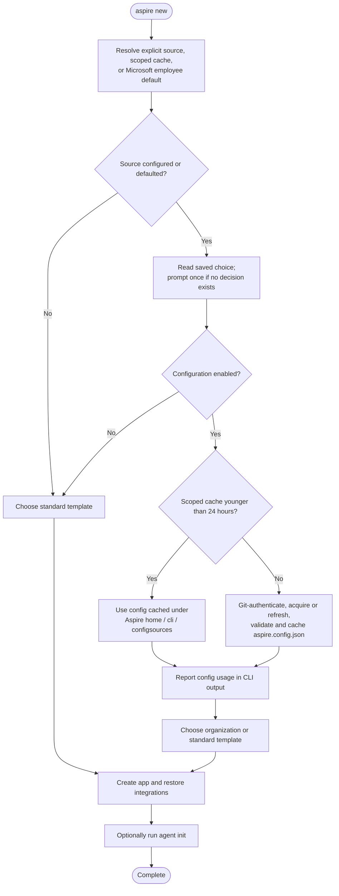

# Aspire CLI config sources

## Overview

Config sources let organizations provide templates, integration catalogs/package sources, and agent skills through a Git-hosted `aspire.config.json`. The CLI selects a repository using `ASPIRE_INIT_SOURCE` and uses focused adapters to acquire and apply each kind of content.

The acquired file and associated metadata are stored under the resolved Aspire home's `cli\configsources` directory, normally `<user-profile>\.aspire\cli\configsources`. Storage is centralized, while applicability is bound to the directory where `aspire new` or `aspire init` enabled the source and its subdirectories. Refresh occurs on the next use after 24 hours. Git authentication and repository permissions protect access to the source.

For detected Microsoft employees, the default source is `https://msft.ghe.com/coreai/aspire-1p-init`. Explicit environment values override defaults. The CLI prompts once to choose between source configuration and standard Aspire content, then persists the decision for that directory scope. Later commands reuse the decision and report actual configuration use without another config-use prompt.

## Implementation status

Proposed. Config-source acquisition, scoped decisions, refresh-on-use, and usage notices are not implemented. This specification defines their intended behavior and the existing CLI components they extend. The optional config-path environment variable name, schema extensions, and adapter contracts remain open design details.

## Goals

- Make organization templates, integrations, and skills available through one config source without changing CLI SDK/channel identity.
- Reuse normal Git authentication and the existing Microsoft-employee detector.
- Persist first-time consent for a source and directory scope, including the decision to use standard content.
- Cache source content centrally while keeping its applicability limited to the selected workspace directory and descendants.
- Refresh on use after 24 hours, report actual configuration use, and surface acquisition or refresh failures explicitly.
- Preserve existing behavior when no source applies and keep project-owned settings separate from source-managed content.

## Scope and non-goals

The initial implementation covers custom .NET template packages, an explicit organization integration catalog, and validated repository-contained skill bundles. These extend `aspire new`, integration add/list/search, and `aspire agent init`. `aspire init` retains its standard scaffolding paths and exposes organization skills through the shared agent-init flow.

The initial content model is additive: keep standard content available, make additions visible, and do not silently replace existing content.

Out of scope for the initial implementation:

- Custom CLI-native starter file trees and brownfield skeleton providers.
- Automatic regeneration of applications or reinstallation of skills when the config refreshes.
- A separate config authentication service or custom token exchange.
- Replacing Aspire SDK/channel selection with an organization channel.
- Tamper-resistant enterprise policy enforcement or an implicit no-public-network policy.

## Background

A single NuGet feed override is insufficient:

- Template identities are registered in CLI code, rather than discovered from arbitrary template packages.
- Several starter templates are embedded in the CLI and do not download their application files from NuGet.
- Integration search restricts package names to the official and Community Toolkit namespaces.
- Skills have a separate bundle format, acquisition path, and trust model.
- `aspire init` has three scaffolding paths; it is not simply `aspire new` applied to an existing repository.

### Current acquisition paths

| Surface | Content/catalog origin | Acquisition and application |
|---|---|---|
| `aspire new`: .NET templates | CLI-defined template identities; fixed `Aspire.ProjectTemplates` package | Resolve package/version/channel, install using `dotnet new install`, then invoke `dotnet new <template>` |
| `aspire new`: CLI-native starters | CLI-defined identities and embedded starter file trees | Resolve an Aspire version, copy embedded files with substitutions, restore/generate the AppHost SDK |
| `aspire new`: empty AppHost | CLI implementation for C#; language scaffolding service for other languages | Write the C# skeleton or request generated files over AppHost-server RPC |
| `aspire init`: C# without a solution, or `--file-based` | C# content written directly by the command | Write a single-file AppHost and related configuration |
| `aspire init`: C# with a solution | Fixed `Aspire.ProjectTemplates` package and `aspire-apphost` identity | Install the package and generate a project-mode AppHost |
| `aspire init`: polyglot | Language/code-generation packages and AppHost-server scaffolding | Prepare the server, request scaffold files over RPC, write/merge files |
| Integrations used by `aspire new` | Dependencies declared by the selected template or generated configuration | Normal .NET restore or the polyglot AppHost-server package restore |
| `aspire add` / integration list/search | NuGet/channel search, constrained by package-name filters | Select a package/version and modify the AppHost's package references/configuration |
| `aspire agent init` | Embedded Aspire skills bundle by default; CLI-defined extra skills | Validate/cache bundle, select skills/locations, write skill files; optional external Playwright installer |

### Templates in `aspire new`

**Catalog construction is separate from package acquisition.**

[TemplateProvider](https://github.com/microsoft/aspire/blob/086e92777f8fc36deabfef2d04fa58274c5d345a/src/Aspire.Cli/Templating/TemplateProvider.cs) concatenates the registered template factories. [Program](https://github.com/microsoft/aspire/blob/086e92777f8fc36deabfef2d04fa58274c5d345a/src/Aspire.Cli/Program.cs) registers [DotNetTemplateFactory](https://github.com/microsoft/aspire/blob/086e92777f8fc36deabfef2d04fa58274c5d345a/src/Aspire.Cli/Templating/DotNetTemplateFactory.cs) and [CliTemplateFactory](https://github.com/microsoft/aspire/blob/086e92777f8fc36deabfef2d04fa58274c5d345a/src/Aspire.Cli/Templating/CliTemplateFactory.cs).

[NewCommand](https://github.com/microsoft/aspire/blob/086e92777f8fc36deabfef2d04fa58274c5d345a/src/Aspire.Cli/Commands/NewCommand.cs) gets synchronous template definitions during construction and registers them as subcommands. Execution then calls the asynchronous catalog to check runtime availability, including .NET SDK availability. Consequently, publishing or preinstalling an organization template does not automatically make it appear in `aspire new`.

#### .NET templates

The .NET factory defines identities such as `aspire-starter` and `aspire-ts-cs-starter`. Additional templates are gated by the `showAllTemplates` feature.

The creation path is:

```text
NewCommand
  -> DotNetTemplateFactory
  -> TemplateNuGetConfigService.ResolveTemplatePackageAsync
  -> PackageChannel / INuGetPackageCache
  -> install Aspire.ProjectTemplates@<selected version>
  -> dotnet new <registered identity>
  -> persist applicable package-source/channel configuration
  -> optionally chain into agent init
```

[TemplateNuGetConfigService](https://github.com/microsoft/aspire/blob/086e92777f8fc36deabfef2d04fa58274c5d345a/src/Aspire.Cli/Templating/TemplateNuGetConfigService.cs) fixes the package name to `Aspire.ProjectTemplates`. [PackageChannel](https://github.com/microsoft/aspire/blob/086e92777f8fc36deabfef2d04fa58274c5d345a/src/Aspire.Cli/Packaging/PackageChannel.cs) and both NuGet search implementations also contain this fixed identity.

Resolution considers explicit `--source`, `--channel`, and `--version`, CLI identity, and local package hives. The resolver attempts a matching CLI/SDK version where applicable. Depending on the invocation and available channels, it can select a highest version or prompt. Local unqualified resolution has stronger exact-version requirements.

[DotNetCliRunner](https://github.com/microsoft/aspire/blob/086e92777f8fc36deabfef2d04fa58274c5d345a/src/Aspire.Cli/DotNet/DotNetCliRunner.cs) installs either `package@version` or a resolved local `.nupkg`. It uses a temporary working directory containing generated NuGet configuration when mappings are needed, because `dotnet new install` does not accept `--configfile`. Template creation subsequently uses the installed template hive, not that temporary configuration.

**Organization implication:** supporting `Acme.Aspire.Templates` requires both a catalog entry and generalized package selection/installation. Changing only the source would still search for and install `Aspire.ProjectTemplates`.

#### CLI-native starters and empty AppHosts

[CliTemplateFactory](https://github.com/microsoft/aspire/blob/086e92777f8fc36deabfef2d04fa58274c5d345a/src/Aspire.Cli/Templating/CliTemplateFactory.cs) defines TypeScript, Python, Go, Java, and empty-AppHost templates. Starter file trees are embedded through [Aspire.Cli.csproj](https://github.com/microsoft/aspire/blob/086e92777f8fc36deabfef2d04fa58274c5d345a/src/Aspire.Cli/Aspire.Cli.csproj), under [Templating/Templates](https://github.com/microsoft/aspire/tree/086e92777f8fc36deabfef2d04fa58274c5d345a/src/Aspire.Cli/Templating/Templates).

The factory copies files and substitutes project names, versions, ports, and other supported values. Some templates also process conditional blocks. For example, the Python starter conditionally adds Redis.

Although starter files are embedded, `NewCommand` normally resolves the Aspire version through `Aspire.ProjectTemplates` package metadata when no version is supplied. That is **version selection**, not acquisition of those embedded starter files.

The [empty-AppHost implementation](https://github.com/microsoft/aspire/blob/086e92777f8fc36deabfef2d04fa58274c5d345a/src/Aspire.Cli/Templating/CliTemplateFactory.EmptyTemplate.cs) writes C# content directly or delegates non-C# generation to [ScaffoldingService](https://github.com/microsoft/aspire/blob/086e92777f8fc36deabfef2d04fa58274c5d345a/src/Aspire.Cli/Scaffolding/ScaffoldingService.cs). The latter prepares language packages, starts a short-lived AppHost-server session, and requests scaffold files over RPC.

**Organization implication:** redirecting NuGet does not replace embedded starter content. A custom CLI-native file-tree adapter would need an explicit content source and rendering contract. Alternatively, an organization can package a polyglot project as a .NET template, but that route requires the .NET template engine even for a non-C# application.

### Templates and scaffolding in `aspire init`

[InitCommand](https://github.com/microsoft/aspire/blob/086e92777f8fc36deabfef2d04fa58274c5d345a/src/Aspire.Cli/Commands/InitCommand.cs) is a brownfield launcher: create a skeleton AppHost, then offer agent initialization so the `aspireify` skill can guide project discovery and wiring.

Its behavior depends on language and solution discovery:

1. **C# single-file mode:** no solution, or explicit `--file-based`. The command directly writes `apphost.cs`, pinning `Aspire.AppHost.Sdk` to the CLI's identity SDK version. It also manages related run/configuration files and channel sources.
2. **C# project mode:** a solution is found. The command resolves and installs `Aspire.ProjectTemplates`, then invokes `dotnet new aspire-apphost`. The running CLI's identity channel drives selection; incidental PR-hive discovery is excluded. Deliberate package-directory overrides still participate.
3. **Polyglot mode:** the command uses `ScaffoldingService` and language packages. The service writes generated content, checks conflicts, and merges selected existing files such as package-manager configuration, ignore files, and editor settings.

The accepted `--source`, `--version`, and `--channel` options are currently hidden, deprecated compatibility options. They produce warnings and **do not control `aspire init`**.

Existing AppHost files are preserved by relevant early-exit checks. After scaffolding, the command can chain into agent initialization; it prints `aspireify` follow-up guidance when that skill is selected.

**Organization implication:** custom skill additions are the least invasive first extension for brownfield onboarding. Custom skeletons require deliberate support for each of the three paths, not a new template-factory registration alone. Do not reinterpret the deprecated options as organization controls.

### Integrations: dependencies versus discovery

There are two distinct operations.

#### Dependencies acquired while running `aspire new`

`aspire new` does not generally prompt from an integration catalog. Integrations are selected by the template's contents and options.

For example:

- The [.NET starter AppHost project](https://github.com/microsoft/aspire/blob/086e92777f8fc36deabfef2d04fa58274c5d345a/src/Aspire.ProjectTemplates/templates/aspire-starter/Aspire-StarterApplication.1.AppHost/Aspire-StarterApplication.1.AppHost.csproj) conditionally references `Aspire.Hosting.Redis`.
- The [TypeScript starter configuration](https://github.com/microsoft/aspire/blob/086e92777f8fc36deabfef2d04fa58274c5d345a/src/Aspire.Cli/Templating/Templates/ts-starter/aspire.config.json) declares `Aspire.Hosting.JavaScript`.
- The [Python starter implementation](https://github.com/microsoft/aspire/blob/086e92777f8fc36deabfef2d04fa58274c5d345a/src/Aspire.Cli/Templating/CliTemplateFactory.PythonStarterTemplate.cs) conditionally adds Redis before SDK generation.

.NET template generation can restore declared project dependencies. Polyglot starters explicitly call `BuildAndGenerateSdkAsync`. [AspireConfigFile.GetIntegrationReferences](https://github.com/microsoft/aspire/blob/086e92777f8fc36deabfef2d04fa58274c5d345a/src/Aspire.Cli/Configuration/AspireConfigFile.cs) includes the base `Aspire.Hosting` package plus configured integrations, and scaffolding adds the language code-generation package.

For bundled AppHost-server preparation, [PrebuiltAppHostServer](https://github.com/microsoft/aspire/blob/086e92777f8fc36deabfef2d04fa58274c5d345a/src/Aspire.Cli/Projects/PrebuiltAppHostServer.cs) restores the integration dependency closure through the bundled NuGet service. Runtime assemblies/assets are then made available to the server and SDK generation.

**Organization implication:** a custom template can declare custom integration dependencies without requiring integration catalog discovery. However, its sources must be available during the first restore and subsequent restore/build/run operations. Acquisition of the template package and acquisition of its dependencies are separate source-selection problems.

In the current .NET factory, persistent source configuration is handled after template generation. A custom adapter must not rely on that ordering for private dependencies that the template engine restores during creation.

#### Integration discovery and installation

[IntegrationPackageSearchService](https://github.com/microsoft/aspire/blob/086e92777f8fc36deabfef2d04fa58274c5d345a/src/Aspire.Cli/Commands/IntegrationPackageSearchService.cs) powers `aspire add` and integration discovery. It searches the implicit channel by default. Explicit channels additionally participate when local hives/package overrides exist or the AppHost has a configured channel. A configured channel does not eliminate the implicit search.

Search implementations differ by CLI packaging:

- [NuGetPackageCache](https://github.com/microsoft/aspire/blob/086e92777f8fc36deabfef2d04fa58274c5d345a/src/Aspire.Cli/NuGet/NuGetPackageCache.cs) uses .NET CLI package search.
- [BundleNuGetPackageCache](https://github.com/microsoft/aspire/blob/086e92777f8fc36deabfef2d04fa58274c5d345a/src/Aspire.Cli/NuGet/BundleNuGetPackageCache.cs) uses the in-process NuGet client.
- Local package-directory channels enumerate `.nupkg` files.

Remote integration search uses `Aspire.Hosting` as its query. Package-name filters admit the official `Aspire.Hosting.*` and `CommunityToolkit.Aspire.Hosting.*` namespaces and exclude infrastructure packages. Deprecated integrations are hidden unless enabled.

Thus `Acme.Aspire.Hosting.Platform` is not automatically discoverable just because its private feed is configured. Both query/discovery and filtering must support it.

Polyglot compatibility filtering exists but is **off by default**, because remote feed/tag search does not reliably produce a correct allow-list. Merely allowing an organization package's name does not make its API usable from polyglot AppHosts; appropriate export/code-generation support is still required.

[AddCommand](https://github.com/microsoft/aspire/blob/086e92777f8fc36deabfef2d04fa58274c5d345a/src/Aspire.Cli/Commands/AddCommand.cs) selects a package/version and delegates installation to the AppHost implementation. [DotNetAppHostProject](https://github.com/microsoft/aspire/blob/086e92777f8fc36deabfef2d04fa58274c5d345a/src/Aspire.Cli/Projects/DotNetAppHostProject.cs) invokes .NET package add; [GuestAppHostProject](https://github.com/microsoft/aspire/blob/086e92777f8fc36deabfef2d04fa58274c5d345a/src/Aspire.Cli/Projects/GuestAppHostProject.cs) modifies configuration and regenerates the SDK.

**Organization implication:** add config-declared package IDs to discovery rather than broadly allowing arbitrary packages. Wire the same catalog into add/list/search, and ensure each installation path actually receives or persists its sources.

### Skills in `aspire agent init`

[AgentInitCommand](https://github.com/microsoft/aspire/blob/086e92777f8fc36deabfef2d04fa58274c5d345a/src/Aspire.Cli/Commands/AgentInitCommand.cs) selects the workspace root, detects agent environments and language, selects skill destinations, resolves the skill catalog, and installs selected content.

#### Default source: embedded bundle

[AspireSkillsInstaller](https://github.com/microsoft/aspire/blob/086e92777f8fc36deabfef2d04fa58274c5d345a/src/Aspire.Cli/Agents/AspireSkills/AspireSkillsInstaller.cs) currently defaults to the embedded snapshot. The `aspireSkillsRemoteFetchEnabled` feature is hidden and defaults to `false` in [KnownFeatures](https://github.com/microsoft/aspire/blob/086e92777f8fc36deabfef2d04fa58274c5d345a/src/Aspire.Cli/KnownFeatures.cs).

[EmbeddedAspireSkillsBundleProvider](https://github.com/microsoft/aspire/blob/086e92777f8fc36deabfef2d04fa58274c5d345a/src/Aspire.Cli/Agents/AspireSkills/EmbeddedAspireSkillsBundleProvider.cs) loads an embedded archive and metadata. The checked-in [metadata](https://github.com/microsoft/aspire/blob/086e92777f8fc36deabfef2d04fa58274c5d345a/src/Aspire.Cli/Agents/AspireSkills/Embedded/aspire-skills.metadata.json) identifies bundle version `0.0.3`, originating from `microsoft/aspire-skills`.

Inspection of the archive's manifest found seven skills: `aspire`, `aspire-deployment`, `aspire-init`, `aspire-monitoring`, `aspire-orchestration`, `aspire-project-v2-migration`, and `aspireify`. Its declared CLI/SDK support range is `>=13.5.0 <13.7.0`. The exact embedded snapshot intentionally skips compatibility-range checking, while retaining other bundle validation.

#### Optional remote source

When remote fetching is enabled, the installer requests GitHub release metadata from the fixed `microsoft/aspire-skills` repository, resolves a release asset, and downloads/verifies it.

The normal remote path checks the release digest when available and verifies artifact attestation against the expected repository, publishing workflow, build type, and version. It can reuse a verified cache entry. Under the documented unavailable-source conditions it can use a previously verified offline entry; otherwise it falls back to the embedded bundle.

`aspireSkillsVersion` changes the requested bundle version. It does not provide a configurable repository or arbitrary bundle source. Embedded content is eligible only when its version matches the requested version.

#### Bundle format and cache

[SkillBundleManifest](https://github.com/microsoft/aspire/blob/086e92777f8fc36deabfef2d04fa58274c5d345a/src/Aspire.Cli/Agents/AspireSkills/SkillBundleManifest.cs) describes bundle version, CLI/SDK compatibility, skills, language restrictions, excluded paths, and per-file hashes. [AspireSkillsBundleProvider](https://github.com/microsoft/aspire/blob/086e92777f8fc36deabfef2d04fa58274c5d345a/src/Aspire.Cli/Agents/AspireSkills/AspireSkillsBundleProvider.cs) validates names, paths, duplicate entries, required `SKILL.md`, frontmatter, and file integrity.

Archives can be tar/gzip or zip. Extraction validates destination paths; tar extraction rejects unsupported entry types, including links. Files are retained as validated content for installation.

Cache layout is under `CliExecutionContext.CacheDirectory`:

```text
aspire-skills\<version>\<archive-sha512>\
```

The installer stages and locks cache publication, records verification metadata, and cleans stale entries using a default seven-day age window. Cleanup age is not a remote-refresh guarantee.

#### Catalog selection and installation scope

Bundle skill definitions are merged with CLI-defined extras. All bundle skills are selected by default, subject to language applicability. The extras are:

- `dotnet-inspect`: static embedded skill content, offered for C#.
- `playwright-cli`: optional external installer, acquiring `@playwright/cli` through npm with provenance validation rather than copying a static bundle skill. See [PlaywrightCliInstaller](https://github.com/microsoft/aspire/blob/086e92777f8fc36deabfef2d04fa58274c5d345a/src/Aspire.Cli/Agents/Playwright/PlaywrightCliInstaller.cs).

[SkillLocation](https://github.com/microsoft/aspire/blob/086e92777f8fc36deabfef2d04fa58274c5d345a/src/Aspire.Cli/Agents/SkillLocation.cs) defines:

| Location option | Workspace destination | Also writes at user scope? |
|---|---|---|
| `standard` (default) | `.agents/skills` | Yes |
| `claudecode` | `.claude/skills` | No |
| `github` | `.github/skills` | No |
| `opencode` | `.opencode/skill` | No |

Installation skips identical file contents after line-ending normalization and overwrites differing files. It is not a managed synchronization operation that removes obsolete files.

`--skill-locations` and `--skills` support explicit selection, `all`, and `none`. No bundle catalog is acquired when locations are empty, skills are `none`, or only CLI-defined extras are explicitly requested. If bundle acquisition fails, the command can continue with CLI-defined skills; an explicit request for a missing bundle skill surfaces the underlying failure.

Both `aspire new` and `aspire init` can chain into this same command and pass the selection options. `--suppress-agent-init` skips that follow-up. MCP configuration remains a standalone, explicit opt-in; chained flows do not expose it.

**Organization implication:** bundle validation and installation are useful reusable components, but the command currently carries one Aspire bundle. Supporting additive organization bundles needs source-aware catalog/file lookup. It also needs a scope decision: copying an organization skill to the default user destination affects other workspaces.

### Existing customization mechanisms and their limits

| Mechanism | Already supports | Does not provide |
|---|---|---|
| User/workspace NuGet configuration | Feeds, source mappings, normal NuGet credentials | Custom template identities or arbitrary integration discovery |
| `aspire new --source/--channel/--version` | Source/version/channel control for existing paths | An organization content catalog or replacement embedded files |
| Local Aspire hives | Build-specific package sources | Acquired initialization config sources or skill bundles |
| `ASPIRE_CLI_PACKAGES` | Local `Aspire*` package override through CLI identity/channel resolution | Custom organization package namespaces, template catalog entries, or skills |
| `ASPIRE_CLI_NUGET_SERVICE_INDEX` | Replacement for canonical NuGet URLs in newly generated configuration | Rewrite of existing user configuration or custom content discovery |
| `aspireSkillsVersion` / remote-fetch feature | Version selection and optional fixed-repository remote acquisition | Organization skill repositories/directories or additive bundles |
| `--skills` / `--skill-locations` | Selection from the resolved catalog and known destinations | A new source of skill content |

The CLI identity environment variables are documented as process-local diagnostic affordances in [IIdentityResolver](https://github.com/microsoft/aspire/blob/086e92777f8fc36deabfef2d04fa58274c5d345a/src/Aspire.Cli/Acquisition/IIdentityResolver.cs) and the [identity-sidecar specification](https://github.com/microsoft/aspire/blob/086e92777f8fc36deabfef2d04fa58274c5d345a/docs/specs/cli-identity-sidecar.md). Organization configuration should not pretend the CLI is a different build or reuse those variables.

[Program](https://github.com/microsoft/aspire/blob/086e92777f8fc36deabfef2d04fa58274c5d345a/src/Aspire.Cli/Program.cs) currently loads environment variables before global and local configuration files. Later configuration providers take precedence. Reading `ASPIRE_INIT_SOURCE` and any source-file override directly through `IEnvironment` keeps explicit machine choices authoritative. The acquired config is a directory-scoped source, not another machine-global settings file.

#### Microsoft-employee detection

The CLI already exposes [IInternalMicrosoftDetector / InternalMicrosoftDetector](https://github.com/microsoft/aspire/blob/052b2a80dcc34ee7dd00b397ef915befd9c85742/src/Aspire.Cli/Telemetry/InternalMicrosoftDetector.cs). Its `IsInternalMicrosoftMachineAsync` method returns a structured result containing `IsInternalMicrosoft`, detection outcome, source, and optional identity information.

The detector caches results with a six-hour refresh interval and uses bounded, staged probes. Existing signals include Microsoft corporate domain/tenant enrollment on Windows and WSL, macOS platform SSO, and Microsoft GitHub organization membership through available credentials. Token-membership probes are skipped in CI to avoid treating automation credentials as a human employee.

The service is already registered as a singleton by [TelemetryServiceCollectionExtensions](https://github.com/microsoft/aspire/blob/052b2a80dcc34ee7dd00b397ef915befd9c85742/src/Aspire.Cli/Telemetry/TelemetryServiceCollectionExtensions.cs). Reuse it rather than adding a second employee detector.

However, the current caller in [AspireCliTelemetry.Initialize](https://github.com/microsoft/aspire/blob/052b2a80dcc34ee7dd00b397ef915befd9c85742/src/Aspire.Cli/Telemetry/AspireCliTelemetry.cs) invokes detection only when reported telemetry is enabled. The initialization-source resolver must consume the detector directly; functional defaults must not depend on telemetry being enabled or tags being exported. Share the invocation result where practical so source selection and telemetry do not duplicate in-flight probes.

**Detection selects a default; it is not authorization.** A positive result does not establish access to `msft.ghe.com` or the selected repository. Git still authenticates the user and enforces repository access. Detection failures/timeouts must remain distinguishable from a confirmed negative result and must not cause an unauthorized repository fetch.

## Design

### Source selection and defaults

`ASPIRE_INIT_SOURCE` is a Git repository address, not a local config path or a raw JSON download URL:

```powershell
$env:ASPIRE_INIT_SOURCE = 'https://msft.ghe.com/coreai/aspire-1p-init'
aspire new
aspire init
aspire agent init
```

The source repository provides `aspire.config.json`. To retain the optional source-file override, a proposed second environment variable, `ASPIRE_INIT_CONFIG`, selects another repository-relative path:

```powershell
$env:ASPIRE_INIT_CONFIG = 'teams\platform\aspire.config.json'
```

The second variable name is a suggestion to finalize. The acquired filename remains `aspire.config.json` inside its Aspire-home cache entry; overriding the upstream path does not move storage into the invoking directory.

| Value | Explicit override | Default |
|---|---|---|
| Repository address | `ASPIRE_INIT_SOURCE` | `https://msft.ghe.com/coreai/aspire-1p-init` when the existing detector reports Microsoft internal; otherwise no organization source |
| Upstream config path | `ASPIRE_INIT_CONFIG` (proposed name) | `aspire.config.json` in the source repository |
| Config and metadata storage | Resolved through the existing Aspire-home location | `<AspireHome>\cli\configsources\<source-key>\<scope-key>` |

Resolve explicit overrides independently. An explicitly supplied source wins over a cached source or the Microsoft default and does not require employee detection. Otherwise, reuse the nearest applicable cached config source before considering the employee default. An upstream path override can accompany any resolved source. Reject a rooted path, traversal outside the repository, and an unusable explicit value rather than silently substituting a different config.

These are effective CLI defaults, not environment values written back to the user's machine. The CLI process reads inherited variables; changes to persistent machine/user environment settings require a newly launched terminal/editor process.

Keep the source separate from SDK/channel identity. Do not propagate it unnecessarily into application resources or store credentials in it.

### First-time choice and usage reporting

When an effective source exists and no decision has been saved for that source and directory scope, display it and prompt once **before using or acquiring its configuration**. The display should identify whether the source was configured explicitly or defaulted from employee detection, along with the applicable directory and upstream config path. The first-time acquisition flow in `aspire new` or `aspire init` records the decision.

An illustrative prompt is:

```text
Initialization source: https://msft.ghe.com/coreai/aspire-1p-init
Source origin: Microsoft employee default
Config: aspire.config.json
Applies to: current directory and subdirectories

Which initialization content would you like to use?
  Use configuration from https://msft.ghe.com/coreai/aspire-1p-init
  Use standard Aspire templates
```

Persist both outcomes in CLI-managed source metadata stored alongside the acquired file, with a proposed `enabled` value:

- **Enabled:** acquire the configuration and use it automatically on later commands in the same directory scope, including descendants. Daily refresh does not repeat the config-use prompt.
- **Disabled:** follow the standard workflow and do not acquire, refresh, or apply organization configuration. Later commands do not repeat the prompt.

The saved choice belongs to the repository address, upstream config path, and applicable directory scope. Descendant commands inherit the nearest scoped choice. Refreshing to a new commit of the same source preserves it; selecting a different repository/path requires its own first-time decision rather than transferring consent to unrelated content.

Store the decision, applicability, provenance, and freshness in the cache entry's `metadata.json`, separate from the downloaded `aspire.config.json`. A declined source needs only a metadata record, not downloaded organization content. Record an enabled decision before acquisition so an acquisition failure can be retried later without asking the same config-use question again. Source refresh must preserve local decisions rather than allowing upstream JSON to reset them. Neither choice writes a config-source file into the invoking workspace.

An environment variable or positive employee detection alone is not consent. If no decision exists in non-interactive mode, use an explicit source-selection binding or documented option contract; its spelling/default remain a decision before implementation. Existing saved decisions can be honored non-interactively without prompting.

If acquisition or refresh fails, report the source-specific error and stop the affected operation while preserving the decision and last valid cache. Do not silently switch to standard/stale content or ask the config-use question again. Cancellation stops acquisition without creating the application. Normal Git authentication can still require its own credential flow; that is separate from the CLI's one-time configuration choice.

Whenever an Aspire command actually uses the enabled scoped config, print a brief notice once per invocation, for example:

```text
Using configuration: C:\Users\developer\.aspire\cli\configsources\acme\work\aspire.config.json
Applies to: C:\Work and subdirectories
Source: https://msft.ghe.com/coreai/aspire-1p-init (cached)
```

Report the cached file path and applicable workspace scope, and distinguish cached use from a successful refresh. This is a usage notice, not a confirmation prompt. Keep machine-readable stdout and MCP protocol output intact by routing the human-readable notice to stderr when needed. Do not claim configuration was used when the source is disabled or loading failed.

#### Interactive `aspire new` flow



The diagram shows the main success path; error handling and cancellation follow the rules above. A saved enabled choice bypasses the prompt on later invocations, including refreshes. Git access occurs only for an enabled source when acquisition or refresh is needed. The chained agent-init flow reuses the accepted config snapshot without another source-choice prompt or usage notice.

### Git acquisition and authentication

Use the user's Git installation and its normal transport authentication, including configured credential helpers or SSH authentication where appropriate. For the HTTPS example, Git handles the existing enterprise login/credential flow. The CLI must not scrape employee-detector credentials or introduce its own token exchange to read the config.

The repository checkout and supporting assets can use the CLI-managed source cache. The acquired `aspire.config.json` and associated metadata must be stored together under `<AspireHome>\cli\configsources`, not in the invoking workspace. Resolve the repository's default branch to a commit and use one consistent snapshot for the config and repository-contained assets throughout the invocation.

Read the selected config from that snapshot. Resolve source-relative asset paths against the upstream config's directory and require them to remain inside the acquired repository. Copying the config into the home cache must not rebase a skill-bundle path onto that cache entry. Retain source provenance so asset lookup still resolves the corresponding repository snapshot.

Git repository authentication protects access to the file. Schema, path, compatibility, and content-integrity validation remain necessary after acquisition, but this design does not require a separate config login service or mandatory config-signing mechanism. Preserve the existing official-skill verification path.

Bound Git operations, support cancellation, redact credential material, and report missing Git, authentication failure, repository failure, and missing config distinctly. Never silently replace an accepted private source with a public source. Both the cached checkout and Aspire-home config/metadata can contain private information and need user-scoped filesystem permissions. Do not copy the acquired organization config into the user's repository automatically.

The current [IGitRepository](https://github.com/microsoft/aspire/blob/052b2a80dcc34ee7dd00b397ef915befd9c85742/src/Aspire.Cli/Git/IGitRepository.cs) supports workspace-root and included-file discovery, not remote clone/fetch. Remote source acquisition needs a focused addition using repository-standard process execution rather than assuming that existing interface already provides it.

### Cache storage, applicability, and refresh

Save the file and associated metadata in the config-source area under the resolved Aspire home. An illustrative layout is:

```text
<AspireHome>\
  cli\
    configsources\
      <source-key>\
        <scope-key>\
          aspire.config.json
          metadata.json
```

The default Aspire home is `<user-profile>\.aspire`, so the usual storage directory is `.aspire\cli\configsources` under the user's profile. Use the existing [CliExecutionContext.AspireHomeDirectory](https://github.com/microsoft/aspire/blob/052b2a80dcc34ee7dd00b397ef915befd9c85742/src/Aspire.Cli/CliExecutionContext.cs) and [CliPathHelper](https://github.com/microsoft/aspire/blob/052b2a80dcc34ee7dd00b397ef915befd9c85742/src/Aspire.Cli/Utils/CliPathHelper.cs) resolution rather than hard-coding the user profile. The [AspireHomeDirectory helper](https://github.com/microsoft/aspire/blob/052b2a80dcc34ee7dd00b397ef915befd9c85742/src/Shared/AspireHomeDirectory.cs) supports the `ASPIRE_HOME` override; install-route resolution can also determine the effective state root. Append `cli\configsources` to that resolved root, not another `.aspire` segment.

Separate **storage location** from **applicability**. For example, a file physically cached under `C:\Users\developer\.aspire\cli\configsources` can apply to `C:\Work` and its descendants, including `C:\Work\ServiceA`, but not `C:\Other` or `C:\Work2`. The metadata records the normalized absolute scope directory selected when `aspire new` or `aspire init` enabled the source, not automatically the Git root or generated application's output directory.

Resolve the config's proposed `initialization.appliesTo.directory` relative to that recorded workspace directory, never the Aspire-home cache entry or remote checkout. The acquired config can describe or narrow where it applies, but must not silently broaden the user's approved scope during refresh.

To select a config, inspect stored source metadata and match the command's working directory to applicable directory scopes. Use path-segment-aware, platform-appropriate comparisons, not a raw string prefix. The most specific applicable scope takes precedence, including an explicit disabled decision; do not merge unrelated organization sources implicitly or fall back past a nearer opt-out.

Commands in descendants reuse the matching central entry rather than copying files into their working directories. If the user selects a different source in a child directory, create a separate source/scope entry in the home cache rather than replacing the ancestor's entry. Cache keys distinguish source repository/upstream path and scope directory; directory names are implementation details, not a substitute for validating metadata identity.

Changing `aspire new --output` does not change cache storage or its recorded scope. An output directory outside the configured tree does not inherit this source on later invocations.

**Refresh on use, not on a background schedule:**

| Cache state after source acceptance | Behavior |
|---|---|
| No matching valid cache | Acquire, validate, and store the config before use |
| Last successful refresh was less than 24 hours ago | Use the cached config without a Git fetch |
| Last successful refresh was at least 24 hours ago | Refresh from the Git source on this invocation before use |
| Refresh succeeds with unchanged content | Keep the config content and advance the successful-refresh timestamp |
| Refresh fails | Preserve the decision and last valid cache, report the failure, and fail the affected operation without repeating the config-use prompt |

The refresh interval is 24 hours of elapsed time, not a midnight/calendar-day boundary. A cache does not update merely because a day passes; it updates when next used. Help/completion and unrelated commands must not trigger network refresh.

Store CLI-managed selection, provenance, and freshness in `metadata.json` next to the acquired file: enabled/disabled decision, applicable workspace scope, source repository, upstream config path, resolved Git commit, and last successful refresh time. A different source/path is a cache miss and needs its own first-time decision even if the previous file is less than a day old. A metadata-only accepted entry without a valid config still needs acquisition; treat missing/invalid timestamps as needing refresh, but never refresh a disabled source.

Stage and validate a complete candidate before publishing the cached config and its matching metadata together under an entry lock. Readers must not observe a new timestamp/commit with old configuration content. Do not change the successful-refresh timestamp after failed authentication, download, parsing, or validation. Concurrent invocations using the same source/scope entry should share a locked refresh and recheck freshness after acquiring the lock. An invocation and its chained agent initialization use one consistent accepted snapshot even if another invocation refreshes the cache.

Preserve installed skills and generated applications until the user explicitly updates them. Refreshing their config source changes future choices; it does not itself regenerate applications or reinstall skills.

The existing [ConfigurationHelper](https://github.com/microsoft/aspire/blob/086e92777f8fc36deabfef2d04fa58274c5d345a/src/Aspire.Cli/Utils/ConfigurationHelper.cs) discovers root-level `aspire.config.json` and legacy `.aspire/settings.json` by walking workspace ancestors. It does not discover home-cached config sources by recorded scope. The new source loader therefore needs explicit wiring separate from that existing project-config discovery. Refresh must not overwrite project-owned AppHost paths, package selections, or launch settings.

### File contracts

The acquired `aspire.config.json` and its CLI-managed `metadata.json` are separate files in the same home-cache entry. The following examples propose their shape; field names and schema details are not finalized.

#### Cache metadata

`metadata.json` is owned by the CLI, not the source repository. `enabled` records the first-time choice, `appliesTo` records its workspace scope, and the timestamp is set only after successful acquisition or refresh. Source refresh must not replace these local decisions:

```json
{
  "repository": "https://git.acme.example/aspire-init",
  "path": "aspire.config.json",
  "enabled": true,
  "appliesTo": {
    "directory": "C:\\Work",
    "includeSubdirectories": true
  },
  "lastSuccessfulRefreshUtc": "2026-10-08T00:00:00Z"
}
```

#### Acquired configuration

`aspire.config.json` contains the source-provided content definitions. `initialization` is a proposed extension for organization content, and its relative applicability is anchored to the workspace scope recorded in metadata:

```json
{
  "initialization": {
    "schemaVersion": 1,
    "organization": "acme",
    "version": "1.0.0",
    "appliesTo": {
      "directory": ".",
      "includeSubdirectories": true
    },
    "sources": [
      {
        "id": "acme-packages",
        "url": "https://packages.acme.example/nuget/v3/index.json",
        "packagePatterns": [
          "Acme.Aspire.*"
        ]
      }
    ],
    "templates": [
      {
        "id": "acme-service",
        "displayName": "Acme service",
        "runtime": "dotnet",
        "language": "csharp",
        "useCases": [
          "new"
        ],
        "package": {
          "id": "Acme.Aspire.Templates",
          "version": "1.2.0",
          "source": "acme-packages"
        },
        "shortName": "acme-service"
      }
    ],
    "integrations": [
      {
        "packageId": "Acme.Aspire.Hosting.Platform",
        "version": "2.3.0",
        "source": "acme-packages",
        "displayName": "Acme platform",
        "applicableLanguages": [
          "csharp"
        ]
      }
    ],
    "skillBundles": [
      {
        "path": "skills-bundle",
        "scope": "workspace",
        "defaultSkills": [
          "acme-platform"
        ]
      }
    ]
  }
}
```

| Section | Purpose |
|---|---|
| `appliesTo` | Describes applicability relative to the workspace scope recorded in cache metadata |
| `sources` | Names NuGet feeds used to acquire packages; `packagePatterns` describes package-source mappings, not catalog discovery |
| `templates` | Declares application-creation choices, template package/version/source, and template identity |
| `integrations` | Declares integration discovery choices and their package/version/source; listing an integration does not install it |
| `skillBundles` | Identifies repository-contained bundles, installation scope, and default skill choices |

The repository-contained skill directory contains the existing `skill-manifest.json` and `skills/<name>/...` layout, including per-file hashes and compatibility ranges. Reuse that format rather than inventing a second skill-file format.

Template-package, integration-package, skill-bundle, config-content, and Aspire SDK versions are independent. The Git commit identifies the acquired source snapshot; the cache refresh timestamp tracks freshness, not a package version. Do not force an organization template version such as `1.2.0` to match an Aspire SDK version.

Git authentication covers repository acquisition, not access to private NuGet feeds declared in the config. Credentials must not be included in the selector, config source URLs, generated project files, or logs. Reuse NuGet credentials/providers where applicable. The in-process [NuGetClient](https://github.com/microsoft/aspire/blob/086e92777f8fc36deabfef2d04fa58274c5d345a/src/Aspire.Cli/NuGet/NuGetClient.cs) initializes credential providers non-interactively, but explicit temporary configurations can change which stored credentials are visible. Test private-feed authentication through both SDK and bundled clients.

### Command behavior

| Command | Initial implementation behavior |
|---|---|
| `aspire new` | Prompt only when no scoped decision exists; otherwise reuse the decision, use/refresh enabled config, report usage, and show template choices |
| `aspire init` | Share the first-time decision, home-cache storage, and workspace scope/refresh rules; report enabled config usage, preserve standard skeletons, and add organization skill choices |
| `aspire agent init` | Reuse the scoped decision for organization skill choices and report config use; the chained flow reuses the invocation snapshot/notice |
| `aspire add` / integration list/search | Include explicit organization integration entries and install from their declared sources |
| Later restore/build/run/update | Continue resolving declared project dependencies without requiring the original cached config-source checkout |

**No explicit source, applicable cached source, or positive Microsoft detection means unchanged behavior.** Positive detection supplies a source for the first-time choice; it does not automatically enable it. A saved enabled choice is used without prompting. A saved disabled choice preserves the standard workflow without repeating the question.

After acceptance, organization templates and integration catalogs are additive by default. Installing a custom integration is driven by the selected template or explicit package selection, not merely by a cached config. The shared `aspire new`/`aspire init` -> agent-init flow should reuse the accepted snapshot and decision, rather than refreshing again or prompting twice.

Standalone `aspire init` and `aspire agent init` use the same scoped decision rather than prompting again for an already enabled source. Employee detection alone must not acquire private organization content.

Use unique template/skill identifiers such as `acme-service` and `acme-platform`. Reject ambiguous duplicate identities; do not silently shadow built-in `aspireify`, other official skills, or CLI-defined extras. Replacing an official skill should be a separately approved feature.

Keep existing explicit flags authoritative for the semantics they already have. Do not silently reinterpret `aspire new --version` as an organization-template-package version, or existing `--source` as the Git config source. Version overrides for custom content need an explicit contract; pinned config versions are enough for the initial increment.

Organization skill defaults must be selectable and visible. Preserve `none`, explicit subsets, suppression, and no-acquisition fast paths. Initial organization skill installation should be workspace-only even when the standard destination also installs official skills at user scope. This requires source-aware scope handling.

### Integration with existing CLI services

Use one typed, invocation-scoped accepted config snapshot and focused adapters rather than distributing environment-variable reads through commands.

The current parser registers template subcommands synchronously, before command execution. An uncached config acquired only after the source-choice prompt cannot contribute new subcommands through that existing constructor-time registration. Cached metadata may be available locally, but it does not justify a network refresh during parser construction. For the initial interactive `aspire new` flow, load source choices at execution time; separately design custom-template argument binding if direct/non-interactive invocation is required.

| Existing seam | Required extension |
|---|---|
| `IEnvironment` / source resolver | Resolve explicit overrides, nearest applicable cached source, then Microsoft defaults; leave unrelated commands unaffected |
| `IInternalMicrosoftDetector` | Reuse cached detection directly, independently of reported telemetry; treat detection as default selection, not repository authorization |
| Configuration discovery / schema | Discover home-cached sources through separate metadata: saved decisions, workspace applicability, and most-specific-scope precedence |
| `NewCommand` / interaction services | Prompt only for a source without a scoped decision; reuse it thereafter and report the config actually used |
| CLI output / interaction services | Emit one usage notice per invocation; preserve machine-readable stdout and do not duplicate chained-flow notices |
| Git process execution / cache | Acquire a consistent authenticated snapshot and publish config/metadata together under Aspire home's `cli/configsources`; refresh on use at the 24-hour boundary |
| `ITemplateFactory` / `TemplateProvider` | Offer config definitions at execution time; resolve runtime availability without pre-prompt Git access |
| Template package resolver/installer | Accept custom package identities; do not route custom content through the fixed `Aspire.ProjectTemplates` search |
| CLI-native template rendering | Later: accept validated external file trees with a bounded substitution contract; do not add arbitrary shell-command callbacks |
| `InitCommand` / `ScaffoldingService` | Initially preserve skeleton behavior; later add explicit brownfield providers with safe merge/conflict rules |
| `IntegrationPackageSearchService` | Merge declared organization package identities consistently into add/list/search |
| Both NuGet cache/client paths and local listing | Discover/version-resolve custom IDs without weakening global package filters |
| NuGet configuration and AppHost-server restore | Apply source mappings before first restore and persist non-secret project requirements for later operations |
| Skill bundle provider / agent-init catalog | Validate additional bundles and resolve selected files by source, not through a single bundle variable |
| Skill installation | Apply per-source scope and managed update/conflict rules |
| Metadata prefetch / help / completion | Respect effective sources and avoid unintended network calls or content installation |

Do not model an organization as another `stable`/`daily` channel. An application can use a standard Aspire SDK channel and organization-owned packages simultaneously. Organization sources should map declared IDs/prefixes, while SDK/channel resolution keeps its existing meaning.

Source **discovery**, template installation, dependency restore, and persistent project configuration must agree. [PackageSourceOverrideMappings](https://github.com/microsoft/aspire/blob/086e92777f8fc36deabfef2d04fa58274c5d345a/src/Aspire.Cli/Packaging/PackageSourceOverrideMappings.cs) already documents that NuGet search queries sources without applying package source mapping. A mapping alone does not enforce an approved discovery/network boundary.

The [NuGetPackagePrefetcher](https://github.com/microsoft/aspire/blob/086e92777f8fc36deabfef2d04fa58274c5d345a/src/Aspire.Cli/NuGet/NuGetPackagePrefetcher.cs) searches template metadata across channels. `NewCommand` currently disables template prefetch for an explicit source. Config-controlled package acquisition needs equivalent alignment; Git acquisition/refresh must respect the saved enabled decision, or wait for the initial choice when none exists. This is distinct from CLI update-notification traffic: organization customization is not automatically a no-public-network policy.

## Reliability and security

1. **Validate before mutation.** An accepted source with failed Git acquisition/refresh, missing config, unsupported schema, incompatible content, unknown source references, duplicate IDs, or invalid paths must produce actionable errors. Preserve the last valid cache; a broken accepted source must not become a success-shaped fallback.
2. **Git owns repository authentication.** Use normal Git credentials and repository access controls rather than a separate config authentication mechanism. Employee detection only supplies defaults. Validate acquired content, protect private cache files, and retain official skill verification instead of disabling it globally.
3. **Constrain content.** Reuse path/frontmatter/hash/compatibility validation. Require containment, reject traversal and unsupported links, and bound archive size/file count. Local directories need link/reparse-point handling as well as lexical path checks.
4. **Treat templates and skills as trusted input.** Templates can contain code, build logic, dependencies, and post-actions. Skills influence agent behavior and can include scripts. Do not automatically execute arbitrary config-defined installers or scripts.
5. **Keep storage, scope, and freshness explicit.** Store config and metadata under Aspire home's `cli\configsources`, select entries by recorded workspace applicability, and refresh on use after 24 hours. A central cache must not make source content or saved decisions apply to unrelated workspaces.
6. **Preserve projects after selection.** Persist necessary package identities, versions, and non-secret source mappings into project-owned configuration. Do not bake the machine's checkout path into generated projects. Colleagues still need feed access, but should not need the original cached initialization repository.
7. **Manage updates deliberately.** The current skill writer overwrites changed files and leaves obsolete files. Track installed organization provenance if updates/removal are supported; avoid deleting or replacing user-authored content without an explicit conflict policy.
8. **Prompt once and report later use.** Persist both enabled and disabled decisions for the source/scope. Display the source on the first-time choice, then report actual config use in CLI output without repeated confirmation. Surface refresh failures rather than silently changing content.
9. **Keep sensitive metadata local.** Do not send private repository/feed URLs, package names, checkout paths, employee identities, organization IDs, or skill text in ordinary product telemetry. Use local diagnostic information with credential redaction.
10. **Do not confuse personalization with enforcement.** An environment variable is a developer configuration mechanism, not a tamper-resistant enterprise policy. Built-in suppression and user choices should remain available unless a separate enforcement feature is deliberately designed.

## Implementation plan

### Initial implementation

- `ASPIRE_INIT_SOURCE` Git repository selector providing `aspire.config.json`, with an optional upstream path override.
- Store acquired config and separate metadata under `<AspireHome>\cli\configsources`, normally `<user-profile>\.aspire\cli\configsources`.
- Record applicability to the invoking workspace directory and descendants independently of cache storage; do not create config-source files in the workspace.
- Reuse the nearest applicable cache and refresh on its next accepted use after 24 hours.
- Existing Microsoft-employee detection supplies the default source; explicit overrides win.
- Source-visible first-time configuration-versus-standard choice, persisted for the source and directory scope.
- CLI usage notice on subsequent commands that use enabled configuration, without repeated config-use prompts.
- Git-authenticated snapshots and atomic cache replacement with actionable errors.
- Additive custom .NET template packages with config catalog metadata.
- Explicit organization integration catalog and narrowly scoped source mappings.
- Additive repository-contained skill bundles using existing validation, workspace-only by default.
- Standard `aspire init` skeletons with organization skills available through the shared chained flow.
- No-source/no-cache/non-detected behavior preserved; detected employees get one initial source choice rather than automatic content use. Existing selection/suppression semantics remain available.

This supports an organization's custom greenfield templates and onboarding skill files while limiting distribution and trust complexity. It does **not** claim to replace every built-in template or brownfield skeleton.

### Future extensions

- CLI-native external file-tree templates for users who should not require the .NET template engine.
- Custom brownfield skeleton providers for C# single-file, C# project, and polyglot modes.
- Managed organization-content updates and conflict-safe removal.
- Optional additional artifact distribution mechanisms only if repository-contained assets and existing package feeds are insufficient.

## Test plan

### Behavioral coverage

| Area | Required evidence when implemented |
|---|---|
| Baseline | No explicit source, applicable cache, or positive detection preserve existing choices, outputs, sources, and file writes |
| Employee defaults | Positive detection supplies the Microsoft source; explicit source/name overrides win independently; telemetry opt-out does not disable functional defaults |
| First-time choice | Prompt shows repository/origin/scope; enabled and disabled decisions persist; declining performs no organization config use or Git acquisition |
| Subsequent usage | Same-scope and descendant commands reuse the decision without prompts, including after 24 hours; emit one correct usage notice for enabled config |
| Disabled source | Repeated invocations do not prompt, acquire, refresh, or report applying disabled organization config |
| Output contracts | Usage notice identifies the central cached file, applicable workspace scope, and cache/refresh status; JSON/MCP stdout remains valid; chained flows do not duplicate it |
| Configuration | Explicit machine selectors win; acquired source sections do not overwrite project-owned root configuration; invalid candidates never replace a valid cache |
| Cache location | Config and metadata are under the resolved Aspire-home `cli/configsources` directory, including home overrides/install routes; workspace remains free of config-source cache files |
| Directory scope | Metadata binds config to the invoking workspace and descendants but not siblings or prefix-lookalike directories; more specific scoped choices, including opt-outs, win |
| Refresh boundary | At 23h 59m 59s use cache; at exactly 24h refresh on use; successful unchanged refresh advances freshness; failures do not |
| Cache lifecycle | Source/path changes require a new first-time decision; same-source refresh preserves it; descendant use refreshes the same central entry; concurrent publication cannot mix config/metadata generations |
| Git acquisition | Normal Git authentication is used; missing Git/auth/repository/config failures are distinct; one commit is used for all repository assets |
| Custom templates | Config templates appear after acceptance; exact custom package is installed; built-ins remain available; argument/help behavior matches the chosen parser design |
| Dependency sources | Private dependencies resolve on first creation and later restore without the original cached source checkout |
| Integration catalog | Custom namespace appears in add/list/search, with correct versions/sources; unrelated packages remain excluded |
| Runtime variants | SDK-based, bundled NuGet, and local-package paths behave consistently |
| Polyglot | Compatible integration SDK generation succeeds; unsupported language/API combinations are not presented as usable |
| Skills | Standard and organization bundles merge deterministically; explicit subsets/all/none and chained suppression work |
| Scope | Organization content does not leak into user-level skill directories by default |
| Trust/cache | Invalid hashes/paths/links/compatibility fail; publishers cannot share trust markers; concurrent publication is safe |
| Brownfield | Existing files/channels/user choices are preserved; each init mode is tested separately |
| Network behavior | Fresh config use does not fetch Git; no refresh before acceptance or during help/completion; package discovery uses intended feeds |

### Regression coverage

Existing employee-default regression coverage should extend [InternalMicrosoftDetectorTests](https://github.com/microsoft/aspire/blob/052b2a80dcc34ee7dd00b397ef915befd9c85742/tests/Aspire.Cli.Tests/Telemetry/InternalMicrosoftDetectorTests.cs), alongside focused source-resolution and Git-acquisition tests.

Existing regression homes include [NewCommandTests](https://github.com/microsoft/aspire/blob/086e92777f8fc36deabfef2d04fa58274c5d345a/tests/Aspire.Cli.Tests/Commands/NewCommandTests.cs), [NewCommandChannelResolutionTests](https://github.com/microsoft/aspire/blob/086e92777f8fc36deabfef2d04fa58274c5d345a/tests/Aspire.Cli.Tests/Commands/NewCommandChannelResolutionTests.cs), [InitCommandTests](https://github.com/microsoft/aspire/blob/086e92777f8fc36deabfef2d04fa58274c5d345a/tests/Aspire.Cli.Tests/Commands/InitCommandTests.cs), [TemplateNuGetConfigServiceTests](https://github.com/microsoft/aspire/blob/086e92777f8fc36deabfef2d04fa58274c5d345a/tests/Aspire.Cli.Tests/Templating/TemplateNuGetConfigServiceTests.cs), [AgentInitCommandTests](https://github.com/microsoft/aspire/blob/086e92777f8fc36deabfef2d04fa58274c5d345a/tests/Aspire.Cli.Tests/Commands/AgentInitCommandTests.cs), [AspireSkillsInstallerTests](https://github.com/microsoft/aspire/blob/086e92777f8fc36deabfef2d04fa58274c5d345a/tests/Aspire.Cli.Tests/Agents/AspireSkillsInstallerTests.cs), and [AspireSkillsBundleTests](https://github.com/microsoft/aspire/blob/086e92777f8fc36deabfef2d04fa58274c5d345a/tests/Aspire.Cli.Tests/Agents/AspireSkillsBundleTests.cs).

If implementation introduces runtime-only E2E packages or copied config-source/skill fixtures, update the conditional CI routing using [test-trigger-map guidance](https://github.com/microsoft/aspire/blob/086e92777f8fc36deabfef2d04fa58274c5d345a/docs/ci/test-trigger-map.md); project-reference coverage alone will not capture those inputs.

## Open questions

- Is additive customization sufficient, or must organizations replace/hide standard content?
- Are custom `aspire init` skeletons required initially, or can standard skeletons plus organization skills cover onboarding?
- Finalize the optional upstream config-path environment variable name, config-extension property names, and associated metadata shape.
- How should non-interactive source consent and custom-template argument selection bind to the CLI parser?
- How should users explicitly reset or change a saved source/scope decision?
- Is an explicit offline/stale-config option needed? Required refresh failures otherwise stop the operation without another config-use prompt.
- Should organization skills ever install at user scope, and how should switching organizations/workspaces behave?
- How are custom template parameters and version overrides exposed without changing existing built-in flag semantics?
