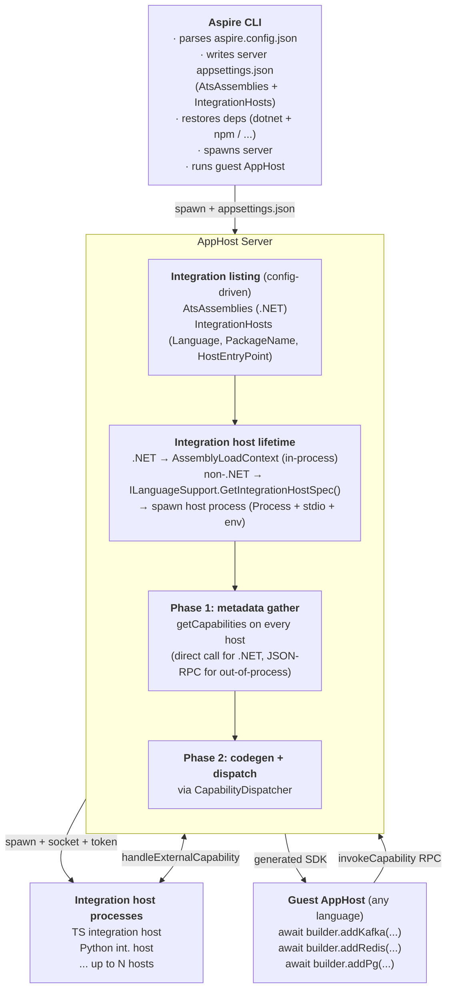
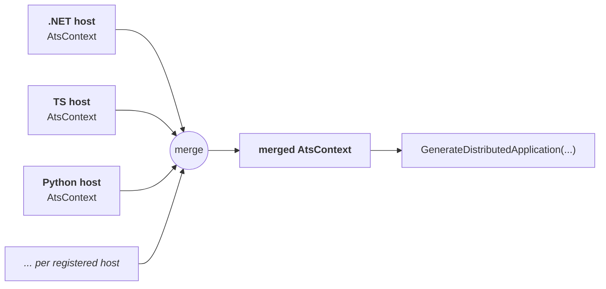

# Polyglot Integrations

> **Status:** Spike Specification
> **Audience:** Aspire contributors working on the AppHost server, integration host protocol, CLI orchestration, and guest-language SDK projection.
> **Related:** [Polyglot AppHost Support](./polyglot-apphost.md) — the sibling spec that covers the *guest AppHost* side (how a TypeScript/Python/Go AppHost talks to the .NET AppHost server over JSON-RPC, how ATS projects the built-in .NET integrations into each language's generated SDK, how codegen works, how the CLI wires up guest runtimes). **This** spec is about the integrations themselves: how an integration authored in any language projects into any consumer's SDK, and how an out-of-process integration host plugs into the same pipeline that scans in-process .NET assemblies.

This document specifies how Aspire supports **integrations authored in any language** — TypeScript, Python, Go, or .NET — and how those integrations project into guest AppHosts as first-class generated APIs.

## Table of Contents

1. [Overview](#overview)
2. [Problem Statement](#problem-statement)
3. [Goals and Non-Goals](#goals-and-non-goals)
4. [Concepts](#concepts)
5. [Authoring an Integration](#authoring-an-integration)
6. [Exposing an Integration to Other Languages](#exposing-an-integration-to-other-languages)
7. [Lifecycle Roles](#lifecycle-roles)
8. [Architecture](#architecture)
9. [Metadata Contract](#metadata-contract)
10. [Metadata Gathering Phase](#metadata-gathering-phase)
11. [NxM: Hosts and Integrations](#nxm-hosts-and-integrations)
12. [Integration Declaration](#integration-declaration)
13. [Package Mechanics](#package-mechanics)
14. [.NET Integrations Under The Same Model](#net-integrations-under-the-same-model)
15. [Runtime Flow](#runtime-flow)
16. [Current Limitations](#current-limitations)
17. [Future Work](#future-work)

---

## Overview

An Aspire integration is a package that contributes hosting capabilities — methods like `addKafka(...)` or `addRedis(...)` that a guest AppHost calls to compose a distributed application. This spec starts from the general model: **integrations can be written in any language**. .NET is one implementation of that model, not the model itself.

An integration only needs to do two things:

1. **describe** its capabilities as projectable metadata
2. **execute** those capabilities at runtime when the guest AppHost calls them

Anything that can do both — a TypeScript package, a Python module, a Go binary, or a .NET assembly — can be an Aspire integration. The AppHost server coordinates (1) into a single `AtsContext`, projects that context into a guest-language SDK, and routes (2) back to the owning integration at runtime.

---

## Problem Statement

Aspire already supports reusable **same-language** helper packages for polyglot AppHosts. The TypeScript codegen supports a package shipping with `aspire.config.json` (no `apphost.ts`), running `aspire restore` to generate its own local `.modules/` tree, and exporting typed helper functions that a consuming TypeScript AppHost imports via a normal npm dependency. The generated public types are structurally compatible across independently-restored trees because public surface types are split from runtime implementation classes (interface + `Impl` class), so a handle produced by the consumer's codegen is assignable to one produced by the helper package's codegen. This is covered end-to-end by the reusable-package integration tests.

That pattern is enough for many integrations — any TypeScript integration consumed by a TypeScript AppHost can ship as a normal npm library today. What it does **not** yet cover:

1. **Cross-language integrations.** A Kafka integration authored in TypeScript cannot be loaded into a Python AppHost's interpreter, and vice versa. For an AppHost in one language to consume an integration authored in another, the integration has to execute somewhere its own runtime is available, and its capabilities have to be projected into the consumer's codegen output.
2. **Integrations with long-lived runtimes.** Some integrations need a process that outlives a single method call — background monitors, stateful connection pools, runtime-managed resources that can't be reconstructed on each call. In-process library functions can't hold that state across the consumer's process lifetime cleanly.
3. **Integration-declared capability metadata for projection.** Even in the same-language case, the reusable-package pattern exports helpers as plain TypeScript functions. It does not yet emit per-integration capability metadata that downstream codegen could consume to produce consistent cross-language wrappers, builder extension methods, scaffolding, or CLI discovery. An integration author who wants their `addKafka` to appear in a .NET AppHost's generated SDK has no declarative way to say so.

This spec covers (1) and (2) with an out-of-process **integration host** protocol, and frames (3) as the shared metadata declaration concern that spans both authoring models.

---

## Goals and Non-Goals

### Goals

- Integrations can be authored in any language with a JSON-RPC capable runtime.
- A single metadata contract describes capabilities regardless of author language.
- The AppHost server gathers and merges metadata from every integration host into one `AtsContext`.
- Code generation projects that merged context into idiomatic guest-language APIs.
- Runtime calls from the guest AppHost reach the originating integration over the same contract.
- Multiple integration host runtimes can coexist in one AppHost run (TS + Python + .NET together).
- A language's host runtime decides how its own integrations are grouped into processes.
- Existing .NET integrations keep working without any author-facing changes.

### Non-Goals

- Reducing integrations to pure declarative data.
- Requiring non-.NET integrations to reproduce CLR semantics.
- Requiring non-.NET integrations to define handle or DTO types on day one.
- Building a new IDL to replace ATS.
- Eliminating the .NET AppHost server from the model.

---

## Concepts

**Integration.** A package (npm, pip, nuget, ...) that contributes one or more capabilities. Lives entirely in the authoring language; has no language-specific knowledge of the rest of Aspire beyond the integration SDK for its language.

**Integration host.** A process (or in-process component) that exposes integrations of a particular language to the AppHost server. One host may own multiple integrations. A host speaks Aspire's JSON-RPC integration protocol and answers `getCapabilities`, `invoke`, and lifecycle RPCs.

**`ILanguageSupport`.** The single language-plugin contract, discovered via assembly scanning. Every supported language ships one implementation. A language opts in to hosting cross-language integrations by overriding `GetIntegrationHostSpec()` to return a non-null `IntegrationHostSpec` — the default returns null, so languages that only support their own AppHost side (codegen, scaffolding, detection) don't need any integration-host code. TypeScript is the only language returning non-null today.

**Metadata contract.** The shape of `AtsCapabilityInfo` that every integration host must produce, regardless of language.

**Guest AppHost.** The user's application composition code, written in any supported language, that consumes the generated SDK and calls capabilities like `addKafka(...)`.

---

## Authoring an Integration

There is **one way** to author an Aspire integration, and it is the same in every supported language: write code that uses the generated `Aspire.Hosting` lib to configure resources. The integration is hand-written source that imports types from a locally-restored `.modules/` tree and calls methods on generated handles — `.addContainer(...).withImageTag(...).withEndpoint(...).withEnvironment(...)`. The generated `Aspire.Hosting` lib is both the type surface the integration author sees and the runtime substrate their calls flow through.

An integration ships as a **normal package** in its language's package manager (npm, pip, nuget, cargo, ...) with:

- `aspire.config.json` declaring the SDK version and any `Aspire.Hosting.*` packages the integration's type surface references
- no AppHost entry point — the package is a library, not a runnable app
- hand-written source files implementing the integration on top of the generated lib

`aspire restore` walks the consumer's dependency graph and runs codegen for every reusable package, producing a `.modules/` SDK per package. Cross-package type interop works by **structural typing** — public generated types are interfaces without private members, so a handle type produced by one `.modules/` tree is assignable to the same-named interface from another.

For same-language consumption, **this is the entire story**. A TypeScript AppHost consuming a TypeScript Kafka integration imports the package, calls the exported function, and the function runs in-process against the consumer's own client. Callbacks are plain in-language closures. No RPC, no external capability protocol, no integration host process. Same story in every language: a Python integration consumed by a Python AppHost is a plain Python function that runs in-process; a C# integration consumed by a C# AppHost is a plain extension method that runs in-process. Same-language is just code.

## Exposing an Integration to Other Languages

An integration authored in language X is only automatically callable from AppHosts in language X. To make it callable from AppHosts in any **other** language, the author opts the integration's public surface into cross-language export by marking the exported capabilities with a **language-specific metadata annotation**. All annotations produce the same underlying projection schema — the author just writes them in whatever form is natural for their authoring language.

**In .NET:** `[AspireExport]` attributes on methods. The ATS scanner reads the attributes via reflection and produces `AtsCapabilityInfo` records. This is how every .NET integration ships today.

```csharp
[AspireExport]
public static IResourceBuilder<KafkaResource> AddKafka(
    this IDistributedApplicationBuilder builder,
    string name,
    int? port = null,
    Action<IResourceBuilder<KafkaResource>>? configure = null)
{
    // implementation using Aspire.Hosting's builder API
}
```

**In TypeScript:** `AspireExport(meta, fn)` wraps a plain typed function, attaching projection metadata under a non-enumerable symbol so the function stays directly callable. `defineIntegration({ name, capabilities })` is the package-level rollup the integration host enumerates at `getCapabilities` time.

Both helpers **live in the generated `.modules/base.ts`** emitted by the TypeScript code generator — integration authors import them from the same place they import `DistributedApplicationBuilder`, `ContainerResource`, and the rest of the typed surface. No framework dependency, no hand-written helper package.

```ts
import type { DistributedApplicationBuilder, ContainerResource } from '../.modules/aspire.js';
import { AspireExport, defineIntegration, type AspireTypeRef } from '../.modules/base.js';

export const addKafka = AspireExport(
    {
        id: 'spike.kafka/addKafka',
        method: 'addKafka',
        description: 'Adds an Apache Kafka broker container',
        projection: { /* target type, parameters, return type, callback info */ },
    },
    async ({ builder, name = 'kafka', tag = '8.1.1', port = 19092, configure }: AddKafkaArgs) => {
        let container = await builder
            .addContainer(name, 'confluentinc/confluent-local')
            .withImageTag(tag)
            .withEndpoint({ port, targetPort: 9092, name: 'tcp' })
            .withEnvironment('KAFKA_LISTENERS', '...');

        if (configure) {
            const extraEnv = await configure(container);
            if (extraEnv) {
                for (const [k, v] of Object.entries(extraEnv)) {
                    container = await container.withEnvironment(k, v);
                }
            }
        }

        return container;
    }
);

export default defineIntegration({
    name: 'KafkaIntegration',
    capabilities: [addKafka],
});
```

Three things to notice:

1. **`AspireExport` and `defineIntegration` come from `.modules/base.js`** — the same `.modules/` tree the integration's `DistributedApplicationBuilder` and `ContainerResource` types come from. The TypeScript codegen emits `AspireExport`, `defineIntegration`, `getAspireExport`, and the projection schema types (`AspireCapabilityProjection`, `AspireCapabilityParameter`, `AspireCallbackParameter`, `AspireTypeRef`) into every restored `.modules/base.ts`. No framework package to install; no hand-written host-runtime authoring helpers to vendor.
2. **The function body uses the generated `Aspire.Hosting` lib directly** — `builder.addContainer(...).withImageTag(...).withEndpoint(...).withEnvironment(...)`. It is the same typed surface a guest AppHost uses when it calls `createBuilder()`. There are no hand-rolled helpers hiding the real API.
3. **The callback is a plain JS closure** — `await configure(container)`. No callback id ceremony at the authoring layer. The integration host runtime reads the projection's `isCallback` flag and replaces the wire-format callback id string with an async function closure before dispatching, so author code never sees the callback id.

**In Python, Go, Rust, Java:** an equivalent decorator, registration function, or attribute that feels native to the language. Same idea. Same schema underneath.

**The schema itself is the same across every language.** Whether the metadata came from a `[AspireExport]` attribute scanned by reflection or an `AspireExport(...)` wrapper enumerated by the integration host at package load, the result is an `AtsCapabilityInfo` record (mirrored in TypeScript as `AspireCapabilityProjection`) — `id`, `method`, `parameters`, `returnType`, `isCallback` / `callbackParameters` / `callbackReturnType`, `targetType`, `returnsBuilder`, `capabilityKind`. Consumers in any language read this schema when generating their SDKs.

### What the annotation actually unlocks

Once an integration is annotated, its capabilities become visible to every codegen target in every language. The consumer's codegen reads the projection records and emits a **fluent builder method** on the consumer's generated `DistributedApplicationBuilder` — `builder.addKafka(...)` rather than `addKafka(builder, ...)`. That emission works the same way for same-language consumers and cross-language consumers alike: every consumer's wrapper body issues a JSON-RPC `invokeCapability` call that routes through the AppHost server and down to the integration host process that loaded the integration.

A TypeScript integration package, authored once with `AspireExport` on top of the generated `Aspire.Hosting` lib, is consumable two ways:

| Consumer | What happens |
|---|---|
| Any language AppHost, unmarked integration | Only reachable via a plain library import in the same language. The consumer writes `await addKafka(builder, ...)` as a free function call. No fluent builder method, no cross-language visibility, no integration host involvement. |
| Any language AppHost, annotated integration | Consumer's codegen emits a fluent `builder.addKafka(...)` method whose body issues a JSON-RPC `invokeCapability` call. The AppHost server reads the integration from its `appsettings.json`, asks that language's `ILanguageSupport.GetIntegrationHostSpec()` how to spawn a host for it (a Node process for `@spike/aspire-kafka`), supervises it like a .NET load context, gathers its capabilities via `getCapabilities`, and dispatches runtime calls through `handleExternalCapability`. The impl runs inside the host process against its own restored `.modules/` tree. |

Same package, same implementation, same annotation. The cross-language codegen picks up exactly what the same-language codegen picks up, because both read the same projection metadata. The only difference between "a TS consumer uses this" and "a Python consumer uses this" is which language's restored `.modules/` the emitted wrapper lives in — the wire dispatch is identical.

**Why everything goes through the integration host — even same-language.** A single delivery mechanism is simpler than two. Same-language consumers could in principle short-circuit the RPC hop and call the imported function directly in their own process, but that would require the codegen to branch on consumer language and emit different wrapper bodies, plus a second code path to maintain. Two Node processes on the same machine round-tripping over JSON-RPC is fast enough for AppHost-time operations (not a hot path), and the single-path design means cross-language and same-language share one tested route. The integration host process also gives long-lived integrations (background monitors, connection pools, watchers) a natural home for state that wouldn't fit cleanly inside the consumer's own process.

### The progression

Authoring an integration is a two-step progression:

1. **Write the integration.** Plain code on top of the generated `Aspire.Hosting` lib. Ships as a normal package in your language's package manager. Same-language consumers can import and call the exported function as a free function today — no fluent builder surface, no cross-language visibility.
2. **Annotate it for export.** Wrap each exported capability with `[AspireExport]` in C#, `AspireExport(meta, fn)` in TypeScript (plus a `defineIntegration` rollup), or the equivalent in any other language. The integration is now projectable into every consumer's codegen, every consumer gets a fluent `builder.addX(...)` surface, and every call flows through the same integration host protocol regardless of consumer language.

Step 1 is an unceremonious library. Step 2 is the **cross-language export opt-in** — and once opted in, there is exactly one delivery path, so there is exactly one code path to test and maintain. The same idea in every language; just a different syntax for the annotation.

---

## Lifecycle Roles

> **Scope:** this section and everything through [Runtime Flow](#runtime-flow) describes the **integration host protocol** that delivers every annotated integration's capabilities at runtime — to same-language and cross-language consumers alike. The only authoring shape that bypasses this path is an **unannotated** library package consumed via plain import as a free function (no fluent builder method, no cross-language visibility). Once an integration is marked with `AspireExport` / `[AspireExport]`, its calls flow through the machinery described here regardless of the consumer's language.

Three components participate in every AppHost run. Their responsibilities are deliberately separated, with **the AppHost server owning integration host lifetime** — the same way it owns the load context of a .NET integration today. The CLI never touches an integration host process directly.

**Aspire CLI** — owns the guest AppHost and the server it talks to.

- Launches the AppHost server process with the guest AppHost's directory and config.
- Pipes server stdout/stderr into CLI logs.
- Watches for the server's ready signal, then hands off to the guest AppHost.
- Tears down the server (and anything the server owns) at shutdown.
- **Does not spawn, parse, or manage integration host processes.** That is the server's job.

**AppHost server** — owns integration discovery, integration host lifetime, and runtime dispatch.

- Scans loaded .NET assemblies for `[AspireExport]` and related type exports. Same as today.
- **Reads non-.NET integrations** from its own `appsettings.json`, under an `IntegrationHosts` section the CLI writes during server-project generation. Each entry carries a `Language`, `PackageName`, and `HostEntryPoint` path. No runtime RPC call; no manifest walk.
- **Spawns integration host processes itself** — the symmetric counterpart to loading a .NET integration into an in-process load context. For each listed host, the server looks up the language's `ILanguageSupport`, calls `GetIntegrationHostSpec()` to get the `Execute` command template, substitutes `{entryPoint}`, starts the process, passes `REMOTE_APP_HOST_SOCKET_PATH` + the auth token via env, captures stdout/stderr into server logs, and holds the `Process` handle in its own registry.
- Accepts inbound connections from the hosts it spawned, registers each via a per-host signal (`registerAsIntegrationHost`), waits for every expected host to register (per-host timeout), runs the metadata gathering phase (`getCapabilities` on every registered host), merges capabilities into `AtsContext`, then unblocks codegen.
- Routes runtime calls from the guest AppHost through `CapabilityDispatcher` — a direct method call for a .NET integration, a JSON-RPC forward for an out-of-process integration host. One dispatch path, two delivery mechanisms decided by the target.
- Tears down every integration host process it spawned when the server itself stops — same shutdown hook that disposes .NET integration load contexts.

**Integration host** — a thin runtime process per language, loaded like a .NET assembly would be.

- Started by the server (not the CLI) with the socket path and auth token in its environment.
- Connects back to the server over the provided socket, authenticates, calls `registerAsIntegrationHost` with its host identity and the integration IDs it owns.
- Answers `getCapabilities` with the full set of capabilities its loaded integrations provide.
- Handles inbound `handleExternalCapability` calls at runtime and dispatches to the right integration function.
- Exits when the server closes its connection or the host process receives a shutdown signal from the server.

**The symmetry with .NET is the whole point.** For a .NET integration, the server loads the assembly into a dedicated `AssemblyLoadContext`, scans it for `[AspireExport]`, holds references to the resulting capability handlers, calls them via direct method invocation, and disposes the load context when it stops. For a TypeScript integration, the server detects the package, spawns a Node process as the "load context", scans it via `getCapabilities`, holds a `JsonRpc` reference, calls handlers via `handleExternalCapability`, and terminates the process when it stops. Same lifecycle hooks, same ownership, same mental model — only the execution environment differs.

---

## Architecture



.NET integrations live in an in-process assembly load context the server owns; non-.NET integrations live in dedicated host processes the server owns. Both kinds feed the same Phase 1 gather and are reachable through the same Phase 2 dispatcher. The CLI never touches either — it only manages the server itself.

---

## Metadata Contract

Every integration host implements `getCapabilities`, returning one or more capability records:

```json
{
  "capabilities": [
    {
      "id": "spike.kafka/addKafka",
      "method": "addKafka",
      "description": "Adds an Apache Kafka broker container",
      "capabilityKind": "Method",
      "targetTypeId": "Aspire.Hosting/Aspire.Hosting.IDistributedApplicationBuilder",
      "targetParameterName": "builder",
      "returnsBuilder": true,
      "returnType": {
        "typeId": "Aspire.Hosting/Aspire.Hosting.ApplicationModel.ContainerResource",
        "category": "Handle"
      },
      "targetType": {
        "typeId": "Aspire.Hosting/Aspire.Hosting.IDistributedApplicationBuilder",
        "category": "Handle",
        "isInterface": true
      },
      "parameters": [
        { "name": "name", "type": { "typeId": "string", "category": "Primitive" } },
        { "name": "tag", "type": { "typeId": "string", "category": "Primitive" }, "isOptional": true },
        { "name": "port", "type": { "typeId": "number", "category": "Primitive" }, "isOptional": true }
      ]
    }
  ]
}
```

This is *the* contract. It is not a translation layer from CLR to RPC — it is the shape every integration host produces, whether by reflecting over its own AST, generating from decorators, or scanning .NET assemblies. The fields mirror the `AtsCapabilityInfo` shape that already drives code generation:

- `id`
- `method`
- `description`
- `capabilityKind`
- `parameters`
- `returnType`
- `targetTypeId`
- `targetType`
- `targetParameterName`
- `returnsBuilder`
- `owningTypeName`
- `expandedTargetTypes`

For this spike, external integrations reuse existing ATS type IDs (`IDistributedApplicationBuilder`, `ContainerResource`, `string`, `number`) instead of minting new ones. A future iteration will let hosts contribute their own handle and DTO type catalogs.

---

## Metadata Gathering Phase

Phase 1 of the AppHost server is **metadata gathering**. Its output is a single `AtsContext` describing every capability available to the guest AppHost, regardless of which host produced it.

The server gathers metadata from the union of:

- every registered integration host, by calling `getCapabilities` over JSON-RPC
- the built-in .NET host, by running CLR reflection over loaded assemblies

Neither source is privileged. `ExternalCapabilityRegistry` normalizes each capability record into `AtsCapabilityInfo` and `AtsTypeRef`, then merges them into the context alongside the CLR-scanned ones:



Projection does not know (or care) which integration host contributed a given capability. The Kafka method from a TypeScript host and the Redis method from the .NET host become adjacent members of the same generated builder.

---

## NxM: Hosts and Integrations

A guest AppHost's dependency graph may contain **M** integration packages spanning **N** distinct language runtimes. Today the server spawns **one host process per integration** — the simplest shape that works, with parallel launches and per-host registration signals.

Process grouping — collapsing multiple integrations into a single host process per language (e.g. one Node process for an entire npm workspace; one Python process per venv) — is explicitly **out of scope for the spike**. The current "one host per integration" model is good enough until a concrete cost shows up that justifies the extra machinery. When that happens, the seam will live on `ILanguageSupport` (the language that knows its own isolation constraints decides the grouping), but the shape of that seam should be driven by real cases, not speculation.

Consequences for the registry and dispatcher that are already in place:

- **Registration is signalled per host.** `registerAsIntegrationHost` carries host identity and the integration IDs the host owns. The registry routes dispatched calls to the right host when the same method name appears under different integrations.
- **Startup is parallel.** The server launches hosts concurrently and waits on a counting semaphore that releases once per registration, with per-host timeouts, rather than a blind fixed delay.
- **Failures are isolated.** A host that fails to start or register fails fast for its own integrations without taking down the other hosts; the server surfaces per-host errors through the same diagnostics channel it uses for .NET integration load failures (exit watcher, piped stdio tagged `IntegrationHost[<name>]`, registration-timeout error with an actionable message).

---

## Integration Declaration

A guest AppHost declares its integrations in a single place: the `packages` dictionary in `aspire.config.json`. One source of truth, one parser, regardless of which ecosystem a given integration comes from.

Each entry value is either a **string** (short form) or an **object** (long form). The string short form is always NuGet — empty means the SDK version, non-empty is an explicit version. The object form carries a required `source` discriminator and per-source fields.

```jsonc
"packages": {
  // String short form: NuGet only.
  "Aspire.Hosting.Redis": "",              // NuGet, SDK version
  "Aspire.Hosting.Kafka": "9.2.0",         // NuGet, explicit version

  // Object form: any source, requires a "source" discriminator.
  "Aspire.Hosting.LocalThing": {
    "source": "project",
    "path": "../LocalThing/LocalThing.csproj"
  },

  "@spike/aspire-kafka": {
    "source": "npm",
    "path": "./kafka-integration/host.ts"
  }
}
```

Known sources:

| `source`  | Required fields | Meaning |
|-----------|-----------------|---------|
| `nuget`   | `version` (optional, SDK version if omitted) | NuGet package. Same ecosystem as a .csproj `<PackageReference>`. |
| `project` | `path` (to `.csproj`) | Local .NET project reference. |
| `npm`     | `path` (to the integration host entry file) | npm integration host package. |

The schema is intentionally open: adding a new ecosystem (pip, cargo, go modules, ...) is one new enum value plus one factory call, not a new prefix in a mini-DSL.

Parsing lives in a single `JsonConverter<PackageEntry>` that handles the string-or-object polymorphism and produces a strong-typed `PackageEntry` with `Source` (enum), `Version?`, and `Path?`. The whole thing is registered in the CLI's source-generated `JsonSerializerContext` — AOT-safe, no reflection at runtime.

Downstream, `AspireConfigFile.GetIntegrationReferences` materializes each `PackageEntry` into an `IntegrationReference { Name, Source, Version?, Path? }` with paths resolved to absolute against the config directory. Every CLI and server code path that needs to know "is this NuGet, project, or npm?" switches on `IntegrationReference.Source` — no more `IsNpmIntegration` / `IsProjectReference` / `IsPackageReference` triad.

### Why not walk the native manifest?

An earlier sketch had each `ILanguageSupport` implementation walk its ecosystem's native manifest (`package.json`, `pyproject.toml`, `go.mod`) to discover Aspire integrations. That's appealing — one source of truth per ecosystem, no duplication in `aspire.config.json` — but it introduces two problems before adding any value:

1. **Recognising an Aspire integration among normal deps.** Walking `package.json.dependencies` finds *every* npm package the AppHost depends on. Aspire needs some way to distinguish "this one is an integration" from "this one is a utility library". Options are all non-trivial: a marker in the integration's own `package.json`, a convention-named file dropped by a postinstall script, a naming convention. Every option has its own tradeoffs and none are obviously better than just keeping an explicit list.
2. **Cross-ecosystem references never go away.** A TypeScript AppHost that wants to pull a .NET integration purely for its projected SDK surface still needs an explicit declaration somewhere — the native `package.json` can't describe it. So you end up with two declaration sources — manifest walk + explicit list — that have to be reconciled.

Keeping `aspire.config.json.packages` as the single source is simpler, has one parser, and loses nothing. If a concrete use case appears where native-manifest discovery is strictly better, the seam can be added later on `ILanguageSupport` without breaking the existing declaration path.

---

## Package Mechanics

A few concrete technical pieces make the single authoring model work. None of them are new design in this spec — they shipped as part of earlier TypeScript codegen work — but they are load-bearing enough that any polyglot integration design has to be built on them.

### Per-package local codegen

Each reusable package has its own `aspire.config.json` declaring the Aspire SDK version and any `Aspire.Hosting.*` packages whose types it references. `aspire restore` walks the consumer's dependency graph and runs codegen **per package**, emitting a local `.modules/` tree into each package directory. Integration authors import types from their own `.modules/` tree; consumers import the integration package's source and their own consumer-side `.modules/` types are what they see at call sites. There is **no shared published npm package** for `Aspire.Hosting` — each package in the dependency graph runs codegen locally.

### Structural typing across trees

Public generated types are interfaces with no private members. Runtime implementations live in separate `Impl` classes that carry the private state. Because the interfaces have nothing nominal to collide on, a handle generated in one `.modules/` tree is structurally assignable to the same-named interface generated in any other. This is what makes cross-package integration authoring work: both the integration and the consumer restore independently, and their generated types interop automatically.

### Cross-assembly exports

For the cross-package case to work, `Aspire.Hosting` has to **export** the types other packages consume. If `Aspire.Hosting.Redis` returns a `ContainerResource` but `ContainerResource` is defined in `Aspire.Hosting`, the `Aspire.Hosting` assembly has to mark `ContainerResource` as an ATS-exported type so downstream codegen knows to emit it. This is the role of assembly-level `[AspireExport(typeof(T))]` declarations. Multi-assembly scanning rules, type ID derivation, and duplicate detection are documented in [`polyglot-apphost.md`](./polyglot-apphost.md).

### Versioning alignment

The wire protocol, handle type IDs, and capability IDs between an integration and the AppHost server that runs it must agree. .NET enforces this transitively through `PackageReference` at build time. The polyglot equivalent is that each package's `aspire.config.json` pins an `sdk.version`, and every package in a consumer's dependency graph must resolve to compatible versions.

### What authors interact with

The integration author never has to understand any of the above. They write `import type { DistributedApplicationBuilder } from '../.modules/aspire.js'` and `builder.addContainer(...).withImageTag(...)`, and everything above either runs at restore time (codegen) or is handled by the framework (structural typing, cross-assembly exports, version pinning). The pieces matter for understanding why the model works; they are not part of the authoring ceremony.

---

## .NET Integrations Under The Same Model

The AppHost server hosts a built-in integration host that produces capabilities from CLR assembly scanning. It runs in-process, so:

- metadata production skips RPC serialization (direct reflection)
- runtime dispatch is a direct method call instead of a JSON-RPC forward
- startup is "already running" — nothing for the CLI to spawn

Functionally, though, it is just another integration host feeding the same Phase 1 gather and Phase 2 dispatch pipelines. Its capability records flow through the same normalization path in `ExternalCapabilityRegistry` as any RPC-sourced host's, and the generated SDK cannot tell them apart.

This is why the existing .NET integration ecosystem continues to work without modification: the pipeline was reshaped so .NET is one branch of a more general contract, not the contract itself.

---

## Runtime Flow

1. CLI parses `aspire.config.json`, resolves each `PackageEntry` to an `IntegrationReference`, and runs per-source restore — `dotnet build` on the generated server csproj for NuGet and project references, `npm install` (and future `pip install`, etc.) for non-.NET integration hosts so their dependencies are on disk before the server starts.
2. CLI writes the AppHost server's `appsettings.json` with two sections: `AtsAssemblies` (for CLR reflection) and `IntegrationHosts` (one entry per non-.NET integration, carrying `Language`, `PackageName`, `HostEntryPoint`).
3. CLI starts the AppHost server process. The server reads `appsettings.json` and runs its integration-listing phase:
   - CLR assembly scanning populates `.NET` integrations into an in-process `AssemblyLoadContext`.
   - For each `IntegrationHosts` entry, the server looks up the language via `LanguageSupportResolver.GetLanguageSupport(language)` and calls `GetIntegrationHostSpec()` to get the `Execute` command template. A language that returns null from `GetIntegrationHostSpec()` (the default) can't host integrations, and the entry is skipped with a clear diagnostic.
4. The server spawns each integration host process directly, substituting `{entryPoint}` into the command args, passing `REMOTE_APP_HOST_SOCKET_PATH` and the auth token via env vars. It captures stdout/stderr into its own logs and holds the `Process` handles in its internal registry — the same way it holds references to .NET integration load contexts.
5. Each spawned host connects back over the socket, authenticates, and calls `registerAsIntegrationHost`. The server waits on a counting-semaphore signal released once per registration, with a per-host timeout.
6. Phase 1 gather: the server calls `getCapabilities` on every registered host (and on the in-process .NET "host" directly) and merges the results into `AtsContext`.
7. Phase 2 codegen runs over the merged context and produces the guest-language SDK (`.modules/`). The readiness gate ensures codegen never runs before every expected host has registered.
8. The server signals ready. The CLI invokes the guest AppHost.
9. Guest AppHost executes against the generated SDK. Every `builder.addX(...)` call becomes an `invokeCapability` RPC to the server.
10. The server's `CapabilityDispatcher` routes each call to the owning integration — a direct method call for a .NET integration in its load context, a JSON-RPC `handleExternalCapability` forward for an out-of-process host.
11. On shutdown, the server tears down every integration host process it spawned, then disposes its .NET load contexts. The CLI then stops the server itself.

Projection and runtime dispatch share the same capability ID throughout, and the same component — the AppHost server — owns the integration's lifetime from first spawn through teardown regardless of whether the integration lives in a .NET load context or a spawned host process.

---

## Current Limitations

Authoring (unmarked libraries):

- Plain TypeScript integration libraries (no `AspireExport` annotation) work end-to-end: the consumer imports and calls the exported function as a free function, structural typing carries cross-tree interop, callbacks run as plain in-process closures, and env vars returned by the callback land on the running container.
- Consumers call these unmarked integrations as **free functions** (`addKafka(builder, name, ...)`) rather than as fluent builder methods. No cross-language visibility.

Annotated integrations (`AspireExport`):

- `AspireExport(meta, fn)` + `defineIntegration({ capabilities: [...] })` works end-to-end for TypeScript. The integration is authored as a plain typed function using the generated `Aspire.Hosting` lib directly (`builder.addContainer(...).withImageTag(...).withEnvironment(...)`), wrapped in `AspireExport`, and the integration host runtime enumerates the wrappers via `getAspireExport` and serves them over `getCapabilities` / `handleExternalCapability`. Callbacks remain plain JS closures. The consumer calls `builder.addKafka("events", { configure: ... })` — the existing codegen wrapper does the rest.
- `AspireExport`, `defineIntegration`, `getAspireExport`, and the projection schema types are emitted by the TypeScript codegen into `.modules/base.ts`. Integration authors import them from the same `.modules/` tree as the generated `Aspire.Hosting` types. No framework package.
- **Projection metadata is still hand-declared** alongside `AspireExport`'s `projection` field. Integration authors still write out per-type `AspireTypeRef` records because runtime projection cannot be derived from TypeScript types that are erased at runtime. The cheapest near-term fix is to have codegen emit a ready-made `AspireTypeRef` constant next to each generated handle type, so authors reference `DistributedApplicationBuilderTypeRef` by name instead of hand-writing the record. The long-term target is full signature inference via the TypeScript compiler API so the `projection` field disappears entirely.
- The integration host runtime needs a side-effect import of the generated `aspire.js` so the module's top-level `registerHandleWrapper(...)` calls actually execute and populate the transport registry. Required because a bare `import type` is erased by tsc. A gotcha for anyone wiring up a new language's integration host runtime.
- The C# side already has `[AspireExport]` and the cross-assembly export story it rests on (documented in `polyglot-apphost.md`).

Integration host lifetime:

- The AppHost server now owns integration host lifetime — symmetric with how it owns `AssemblyLoadContext`s for .NET integrations. The server reads the list of planned hosts from its own config, spawns each one, captures stdio into server logs, waits on per-host registration signals, and terminates everything it spawned at shutdown. The CLI no longer has any integration-host-specific runtime code.
- Dependency restore for integration hosts (`npm install` for TypeScript, and the equivalent for other languages) runs in the CLI restore phase, symmetric with how `dotnet build` resolves NuGet packages for a .NET AppHost. By the time the server starts, each host's dependencies are already present on disk.
- Startup synchronisation uses a per-host registration signal with a per-host timeout, not a blind delay. Failures (missing entry point, host crash during startup, registration timeout) surface through the same diagnostics channel the server uses for .NET integration load failures, with pointers to the host's own stdout/stderr tagged for grep.

Language support:

- Only `typescript/nodejs` overrides `ILanguageSupport.GetIntegrationHostSpec()` today. Python, Go, Java, and Rust have `ILanguageSupport` implementations for the AppHost side (scaffold, detect, runtime spec) but don't yet host integrations. Adding a new language is one method override returning a non-null `IntegrationHostSpec`.
- Process grouping is "one host per integration" across the board. Collapsing many integrations into a single per-language host (or per-venv for Python, etc.) is not implemented and not in scope for the spike.

CLI ergonomics that still assume .NET (verified, not speculative):

- `aspire sdk generate` / `aspire sdk dump` both require `.csproj` input — the commands reject anything else. A TypeScript integration author cannot currently run them against their own integration package.
- `aspire add` queries NuGet feeds only via `PackageChannel.GetIntegrationPackagesAsync`. There's no npm registry / PyPI / crates.io plumbing; the user has to hand-edit `aspire.config.json` to add a non-NuGet integration.
- The CLI-side `ILanguageDiscovery` / `LanguageInfo` registry is independent of the server-side `ILanguageSupport` and doesn't share code. Not a bug today, but a consolidation target.

Runtime projection:

- External integrations project capabilities but cannot yet contribute new handle or DTO type catalogs beyond what ATS already knows about.
- End-to-end automated coverage for the external projection path still needs to be added beyond spike validation.

---

## Future Work

Authoring and export:

- **Emit per-handle `AspireTypeRef` constants from codegen** so integration authors reference `DistributedApplicationBuilderTypeRef`, `ContainerResourceTypeRef`, etc. by name instead of hand-writing the projection record. Small codegen addition; eliminates the most visible remaining duplication at authoring time.
- **Signature inference via the TypeScript compiler API**: derive the full projection record from the TypeScript function signature at codegen time. Author writes only `{ id, description }` — everything else is read from the types. Bigger piece of work but kills the metadata duplication entirely.
- **Rename `Aspire*` → `Ats*`** in the generated module (`AspireCapabilityProjection` → `AtsCapabilityInfo`, `AspireTypeRef` → `AtsTypeRef`, etc.) to keep the naming aligned with the .NET side, which uses `Ats*` throughout. Pure search/replace once agreed.
- **Emit per-package capability manifests at restore time** so cross-language consumers' codegen can produce wrappers without needing to spawn the integration host at restore time to call `getCapabilities` over RPC. Reduces cold-start cost for consumers.

Second language end-to-end:

- Override `ILanguageSupport.GetIntegrationHostSpec()` for a second language (Python is the likely next target) and run the same spike shape end-to-end. This is the real validation that the contract is language-agnostic — everything else is theory until a second language goes through the same code path.

CLI ergonomics:

- Teach `aspire sdk generate` / `aspire sdk dump` to accept non-.NET integration entry points, or to delegate dumping to the integration host itself (so a TS author can inspect their own projection without translating it to a .csproj first).
- Teach `aspire add` to query per-language package registries via an `ILanguageSupport`-rooted seam (npm for TS, PyPI for Python, etc.), so the add flow works regardless of the AppHost language.
- Consolidate the CLI-side `ILanguageDiscovery` / `LanguageInfo` with the server-side `ILanguageSupport` so there's one registry of known languages, not two drifting ones.

Runtime and dispatch:

- Let integration hosts contribute handle and DTO type definitions alongside capabilities.
- Add stronger validation for incoming metadata so bad projections fail fast with useful diagnostics.
- Dedicated AppHost server and end-to-end tests for multi-language, multi-host projection scenarios.
- Revisit process grouping if/when a concrete cost shows up (e.g. many npm integrations in the same workspace). The seam will be a method on `ILanguageSupport`; the shape should be driven by real use cases, not speculation.

---

## Summary

Aspire integrations are language-agnostic, and there is **one way to author one**: write code on top of the generated `Aspire.Hosting` lib in whichever language you're in. A TypeScript integration for a TypeScript AppHost is a normal npm package with typed functions. A Python integration for a Python AppHost is a normal Python module. A .NET integration for a .NET AppHost is a normal class library. Same idea, different package managers.

An **unannotated** library is consumable today — same-language consumers import the package and call exported functions as free functions. No fluent builder surface, no cross-language visibility.

To expose an integration to any consumer (same-language or cross-language) as a **first-class capability with a fluent `builder.addX(...)` method**, the author opts its public surface into cross-language export by marking the exported capabilities with a language-native annotation:

- **C#:** `[AspireExport]` attributes on methods. Read by the CLR scanner.
- **TypeScript:** `AspireExport(meta, fn)` wraps a plain typed function and attaches the metadata via a non-enumerable symbol; `defineIntegration({ name, capabilities })` rolls them up. Both emitted by codegen into `.modules/base.ts` alongside `DistributedApplicationBuilder` and the rest of the generated surface — no framework package.
- **Python, Go, Rust, Java:** an equivalent decorator, attribute, or registration function native to each language.

Same idea in every language. All annotations produce the same underlying `AtsCapabilityInfo` shape (mirrored in generated TypeScript as `AspireCapabilityProjection`) — id, method, parameters, return type, callback signatures, target type. Consumers in any language read this shape at codegen time and emit fluent builder methods on their generated `DistributedApplicationBuilder`. **Every emitted wrapper issues an `invokeCapability` RPC** that routes through the AppHost server to an integration host running the author's language runtime — one delivery mechanism, shared by same-language and cross-language consumers alike.

**The AppHost server owns integration lifetime regardless of language.** A .NET integration lives in an in-process `AssemblyLoadContext` the server loads, scans, and disposes with itself. A TypeScript integration lives in a Node process the server spawns, captures stdio from, and terminates with itself. A Python integration will live in a Python process the same way. The server reads the list of integration hosts from its own `appsettings.json`, looks up each language's `ILanguageSupport.GetIntegrationHostSpec()` to learn how to spawn that language's host, supervises the resulting processes, routes `invokeCapability` calls to them, and tears them down. The CLI never touches an integration host — it only manages the server itself. That's the rest of this document: lifecycle roles, metadata contract, gathering phase, NxM, callback relay.

The winning shape is:

- integrations are code, in any language, on top of the generated `Aspire.Hosting` lib
- unannotated libraries are free functions usable via plain import in the same language
- annotated capabilities are one annotation per function, per language (`[AspireExport]` / `AspireExport(...)` / decorator)
- one projection schema describes every annotated capability regardless of author language
- the AppHost server owns integration lifetime uniformly — .NET load contexts and spawned host processes are two delivery mechanisms behind one ownership model
- one JSON-RPC integration host protocol delivers every annotated call, same-language and cross-language
- `Aspire.Hosting` is the BCL, delivered through the same per-package codegen pipeline that produces guest AppHost SDKs
- `AspireExport` and `defineIntegration` are emitted by that same codegen — integration authors pick them up from the `.modules/` tree without any framework dependency
