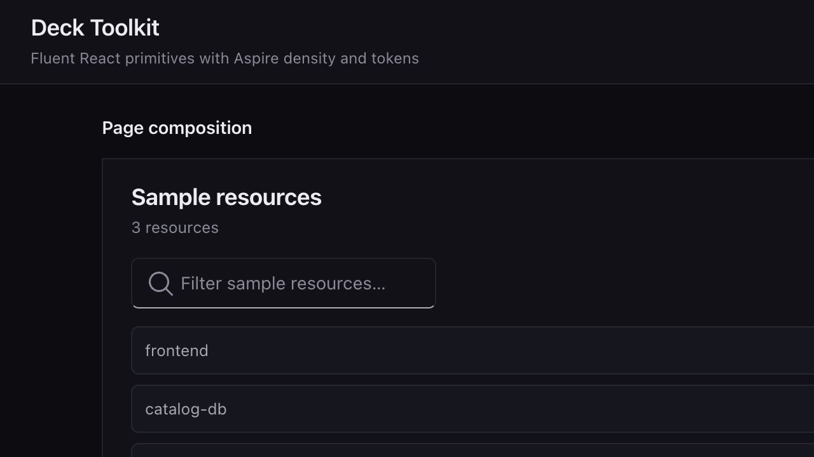
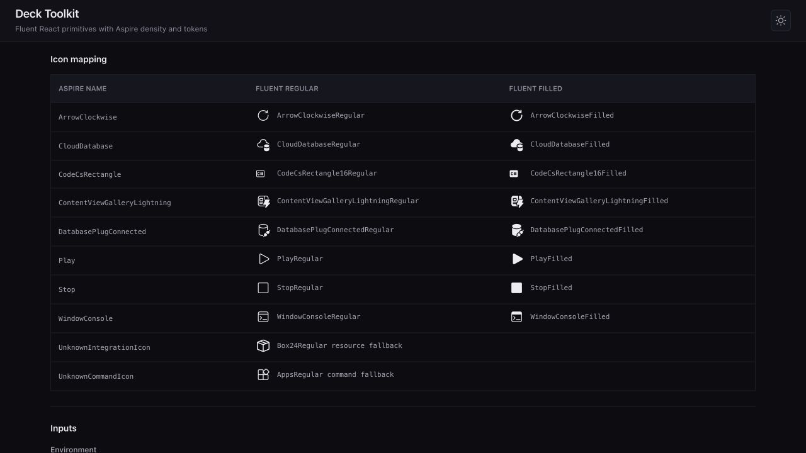
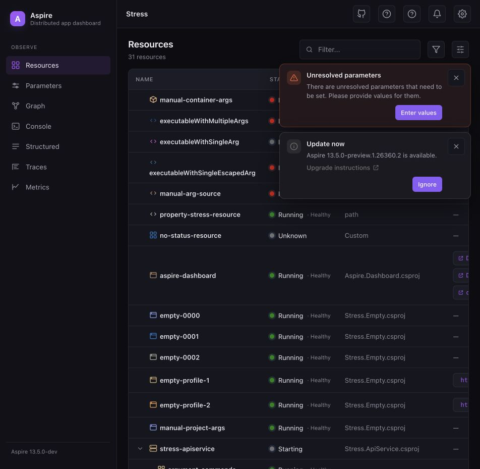
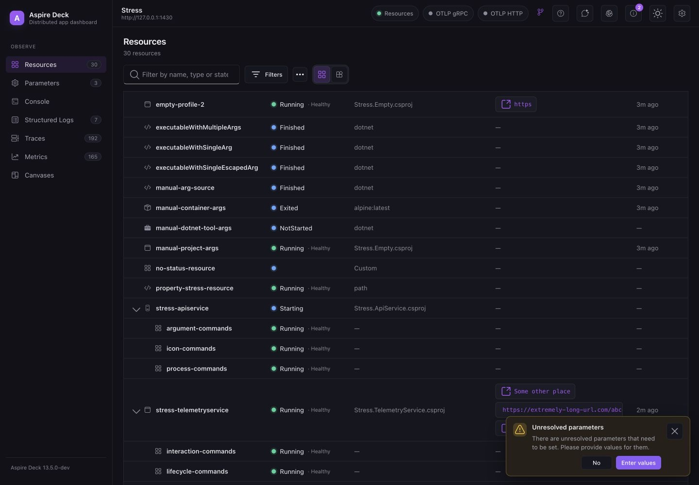
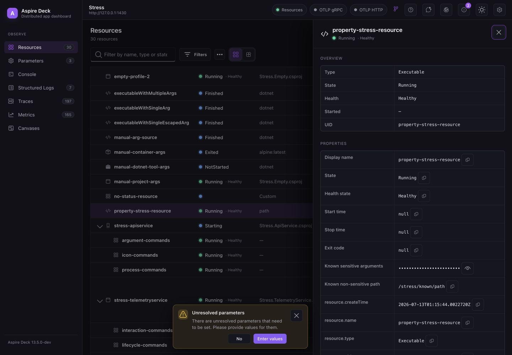
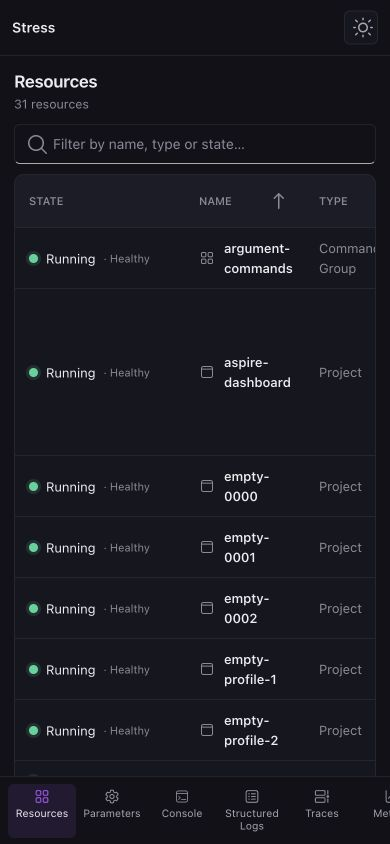

# Aspire Deck — UI

The web UI for **Aspire Deck**, a native desktop replacement for the Aspire Blazor
dashboard. It is a Vite + React 18 + TypeScript (strict) app that runs in three modes from
the **same** code:

- **Standalone (browser / preview)** — when no Tauri runtime is detected, the UI serves
  rich mock data from `src/api/mock.ts`. Resources, console logs, telemetry, and canvases
  all animate so the whole app is demonstrable without the Rust backend.
- **ASP.NET dashboard** — `?backend=http` explicitly loads configuration and resources from
  the authenticated `/api/deck` endpoints. The adapter polls for resource changes and reports
  connection failures without falling back to mock data.
- **Versioned ASP.NET backend** — `?backend=aot` negotiates the versioned `/api/dashboard`
  contract with the separate Native AOT host. Configuration and resources come from that host,
  with resource snapshots and changes streamed over SignalR; every unported capability continues
  through the existing `/api/deck` backend.
- **Tauri-embedded** — when running inside the Tauri shell, the data layer
  (`src/api/deck.ts`) calls the real backend via `invoke(...)` / `listen(...)` exactly as
  described in [`../CONTRACT.md`](../CONTRACT.md).

Tauri detection is automatic (`"__TAURI_INTERNALS__" in window`); HTTP mode is deliberately
explicit. Callers never branch because all transports implement the same data-layer surface.

The UI is built on the reusable module in `src/toolkit`. The toolkit owns the Fluent React
provider, Fluent System Icons, and domain-neutral controls such as buttons, badges, search,
tables, state indicators, empty states, and confirmation dialogs. Deck pages import those
controls only through `src/toolkit/index.ts`; AppHost, resource, and telemetry behavior remains
in `src/api`, `src/components`, and `src/pages`.

## Toolkit architecture

The toolkit is the stable design-language boundary for the dashboard rewrite:

- `DeckProvider` adapts Fluent React behavior and accessibility to Deck's dark/light design
  tokens, density, typography, borders, and status colors.
- `Page`, `DataTable`, `Drawer`, `CommandMenu`, `NotificationStack`, and the input/navigation
  primitives provide reusable composition and interaction patterns without AppHost knowledge.
- `src/components` and `src/pages` add dashboard concepts such as resources, telemetry, and
  commands by composing toolkit exports.
- `src/api` owns the mock, Tauri, and ASP.NET transports. Toolkit controls never fetch data or
  depend on a backend.

Feature code imports the public barrel rather than individual implementation files. A page can
therefore keep its domain logic local while sharing layout, focus behavior, Fluent components,
and visual tokens:

```tsx
import type { Resource } from "../api/types";
import {
  DataTable,
  Page,
  PageBody,
  PageHeader,
  PageHeading,
  PageSubtitle,
  PageTitle,
  PageToolbar,
  SearchBox,
  type Column,
} from "../toolkit";

export function ResourceList({
  resources,
  columns,
  query,
  onQueryChange,
}: {
  resources: Resource[];
  columns: Column<Resource>[];
  query: string;
  onQueryChange: (value: string) => void;
}) {
  return (
    <Page aria-labelledby="resources-title">
      <PageHeader>
        <PageHeading>
          <PageTitle id="resources-title">Resources</PageTitle>
          <PageSubtitle>{resources.length} resources</PageSubtitle>
        </PageHeading>
      </PageHeader>
      <PageToolbar ariaLabel="Resource tools">
        <SearchBox value={query} onChange={onQueryChange} placeholder="Filter resources..." />
      </PageToolbar>
      <PageBody>
        <DataTable columns={columns} rows={resources} rowKey={(resource) => resource.name} />
      </PageBody>
    </Page>
  );
}
```

The standalone playground exercises the toolkit without dashboard data or transport code. Its
icon catalog is generated from the same registry used by `NamedIcon`, and shows the exact Aspire
name to Fluent regular/filled component mapping plus both fallback contracts.

| Toolkit playground | Icon contract |
| --- | --- |
|  |  |

## Visual examples

The existing Blazor dashboard stays intact while the React UI runs against the same Stress
AppHost for side-by-side review.

| Existing dashboard | React dashboard |
| --- | --- |
|  |  |

The shared drawer, secure-value, table, and responsive patterns are exercised against live
Stress resources:

| Resource details | Mobile resources |
| --- | --- |
|  |  |

## Develop

```bash
npm install
npm run dev      # standalone dev server with mocks at http://localhost:1430
```

Open the dev URL in a normal browser. You get a fully interactive dashboard backed by the
mock backend: live resource state changes, streaming console logs, growing telemetry, and
an animated sample canvas.

To run the React UI against an existing dashboard backend, set the dashboard URL
and select the explicit HTTP transport:

```bash
ASPIRE_DASHBOARD_URL=https://Stress.dev.localhost:49985 npm run dev -- --host 127.0.0.1
```

Then open `http://127.0.0.1:1430/?backend=http`. The Vite proxy is enabled only
when `ASPIRE_DASHBOARD_URL` is present, so standalone development continues to use
the deterministic mock backend.

To exercise the first side-by-side Native AOT slice, start the host documented in
[`../../Aspire.Dashboard.Backend/README.md`](../../Aspire.Dashboard.Backend/README.md), then provide both backend URLs:

```bash
ASPIRE_DASHBOARD_URL=https://Stress.dev.localhost:49985 \
ASPIRE_DASHBOARD_AOT_URL=http://127.0.0.1:18889 \
  npm run dev -- --host 127.0.0.1
```

Open `http://127.0.0.1:1430/?backend=aot`. Version discovery and configuration use the new host;
resources arrive as an authoritative snapshot followed by live changes over SignalR, and resource
commands use the versioned backend. Telemetry, interactions, authentication, and terminals remain on the existing dashboard until their
versioned capabilities independently pass the parity inventory. The `resources` HTTP snapshot route
remains a compatibility fallback for a version 1 host that does not advertise `resources-live`.

Open `http://localhost:1430/?view=toolkit` for the standalone toolkit playground. It exercises
the shared controls without depending on the Deck backend or mock data layer, making it the
starting point for new dashboard UI and visual regression coverage.

## Verify the toolkit

```bash
npm run test:e2e
```

The TypeScript Playwright suite starts Vite when needed and verifies the feature inventory in
`e2e/toolkit-features.ts` and the dashboard behavior inventory in
`e2e/dashboard-core-features.ts`. Every inventory ID must be registered by a browser scenario
or the test module fails to load. The suite checks the reviewed YAML accessibility snapshot,
desktop and mobile containment, light and dark theme contrast, navigation, resource commands,
interactions, secure value reveal, filtering, dialogs, drawers, and browser errors. Passing
runs attach desktop/mobile screenshots to the HTML report; failures retain a screenshot, video,
trace, and page context under `test-results`.

Use `npm run test:e2e:update` only after reviewing an intentional accessibility-tree change.

The live Stress black-box suite requires a running Stress AppHost:

```bash
ASPIRE_DASHBOARD_URL=https://Stress.dev.localhost:49985 \
  npm exec -- playwright test --config=playwright.stress.config.ts
```

Run the same inventory through the side-by-side AOT topology after starting the AOT host:

```bash
ASPIRE_DASHBOARD_URL=https://Stress.dev.localhost:49985 \
ASPIRE_DASHBOARD_AOT_URL=http://127.0.0.1:18889 \
ASPIRE_DASHBOARD_BACKEND=aot \
  npm exec -- playwright test --config=playwright.stress.config.ts
```

This verifies that version negotiation, the AOT SignalR resource stream, and the existing
dashboard fallback for capabilities not yet migrated work together across the 23 live Stress
behaviors. Those scenarios provide live coverage evidence for the separate 157-feature parity
ledger enforced by the default Playwright suite.

The terminal playground has a separate live HMP suite. Start `playground/Terminals`, then run:

```bash
ASPIRE_DASHBOARD_URL=<dashboard-url> \
ASPIRE_DASHBOARD_BROWSER_TOKEN=<token> \
  npm exec -- playwright test --config=playwright.terminal.config.ts
```

The migration parity ledger in `e2e/parity/dashboard-parity-features.ts` is derived from the
legacy dashboard and Stress AppHost rather than from the React implementation. It records every
known behavior, its legacy route and black-box scenario, current React status, and existing test
coverage. The deterministic suite snapshots the ledger so removing or silently reclassifying a
feature is reviewed like any other compatibility change.

Run the legacy black-box inventory against the same Stress AppHost before changing a dashboard
surface:

```bash
ASPIRE_LEGACY_DASHBOARD_URL='https://Stress.dev.localhost:49985/login?t=<token>' \
  npm exec -- playwright test --config=playwright.legacy.config.ts
```

Pass the login URL printed by the AppHost for a clean, isolated browser run. A bare dashboard
origin also works when the browser context is authenticated by the surrounding environment.

The Terminals AppHost covers the legacy unsecured-endpoint warning and live terminal controls:

```bash
ASPIRE_LEGACY_TERMINAL_DASHBOARD_URL='<dashboard-login-url>' \
  npm exec -- playwright test --config=playwright.legacy-terminal.config.ts
```

The configured-user scenario uses `playground/Terminals/Terminals.OpenIdAuthority` as a local,
deterministic OpenID Connect authority. Run that authority, then start a standalone legacy
dashboard with `Dashboard__Frontend__AuthMode=OpenIdConnect`. Point the dashboard at the resource
service of a running AppHost so the profile remains interactable during the test:

```bash
ASPNETCORE_URLS=http://127.0.0.1:18080 \
  artifacts/bin/Terminals.OpenIdAuthority/Debug/net8.0/Terminals.OpenIdAuthority

ASPNETCORE_ENVIRONMENT=Development \
ASPIRE_ALLOW_UNSECURED_TRANSPORT=true \
ASPNETCORE_URLS=http://127.0.0.1:18081 \
Dashboard__Frontend__AuthMode=OpenIdConnect \
Dashboard__Otlp__AuthMode=Unsecured \
Dashboard__ResourceServiceClient__AuthMode=ApiKey \
Dashboard__ResourceServiceClient__ApiKey='<resource-service-api-key>' \
ASPIRE_RESOURCE_SERVICE_ENDPOINT_URL='<resource-service-url>' \
Authentication__Schemes__OpenIdConnect__Authority=http://127.0.0.1:18080 \
Authentication__Schemes__OpenIdConnect__ClientId=terminals-dashboard \
Authentication__Schemes__OpenIdConnect__ClientSecret=terminals-dashboard-secret \
Authentication__Schemes__OpenIdConnect__RequireHttpsMetadata=false \
  artifacts/bin/Aspire.Dashboard/Debug/net8.0/Aspire.Dashboard

ASPIRE_LEGACY_AUTH_DASHBOARD_URL=http://127.0.0.1:18081 \
  npm exec -- playwright test --config=playwright.legacy-auth.config.ts
```

`aspire describe aspire-dashboard --format json --include-hidden` reports the running dashboard's
resource-service URL and client authentication settings. Treat the API key as a local secret and
do not commit it.

This run records screenshots, video, and traces for the legacy shell, resource list/details/graph,
parameters, command argument inputs, console, structured logs, traces, and metrics. Features that
still require a purpose-built fixture have `legacyScenario: null` in the ledger and are reported as
gaps; they are not counted as covered merely because a related page loaded.

## Build & preview

```bash
npm run build    # tsc -b && vite build -> dist/
npm run preview  # serve the production build locally
```

`vite.config.ts` sets `base: "./"` and `build.outDir: "dist"` so the bundle loads from
`file://` inside Tauri.

## Tauri integration

A `tauri.conf.json` in the Rust crate points at this UI's build output. Deck loads the embedded
build (no `devUrl`), so debug and release builds behave the same:

```json
{
  "build": {
    "frontendDist": "../ui/dist"
  }
}
```

External link opening uses `@tauri-apps/plugin-opener` when present and falls back to
`window.open` in the browser. If the Tauri opener plugin is enabled, register it in the
Rust app; otherwise links still open in a new tab.

## Structure

```text
src/
  api/      types.ts (mirrors CONTRACT.md), deck.ts (transport router), http.ts (ASP.NET),
            mock.ts (standalone data)
  toolkit/  Fluent provider and reusable, domain-neutral UI primitives
  components/  Deck shell and domain components such as Sidebar, TopBar, DetailsDrawer,
               InteractionPane, NotificationStack, and MetricChart
  pages/    ResourcesPage, ConsolePage, StructuredLogsPage, TracesPage, MetricsPage,
            CanvasesPage
  lib/      format.ts (duration/time/bytes), useDeckEvent.ts (live hooks), theme.ts
  styles/   theme.css (design tokens + dark/light), global.css (components)
public/
  sample-canvas.html   bundled demo canvas used by the mock canvas manifest
```

## Conventions

- TypeScript strict; static imports only (no dynamic `import()`).
- Domain-neutral UI is exported from `src/toolkit/index.ts`; feature code does not import
  toolkit implementation files directly.
- Toolkit controls use Fluent React components and Fluent System Icons while Deck CSS tokens
  define the product-specific color, spacing, and density.
- Dark theme by default; light theme via the top-bar toggle (`[data-theme]` on `<html>`).
- Charts use `uplot` (canvas-based). The telemetry summary only exposes `lastValue`, so the
  Metrics page keeps a small client-side ring buffer per metric to animate the series.
